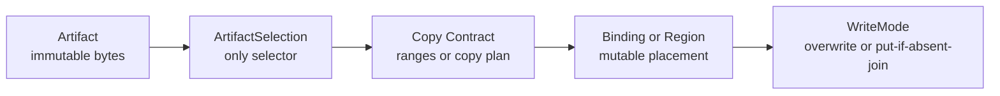
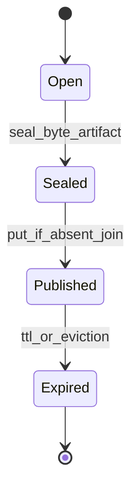
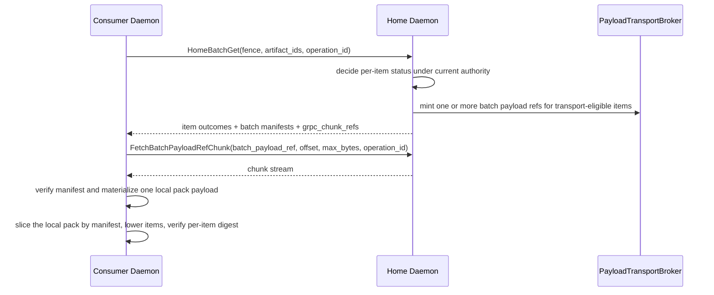
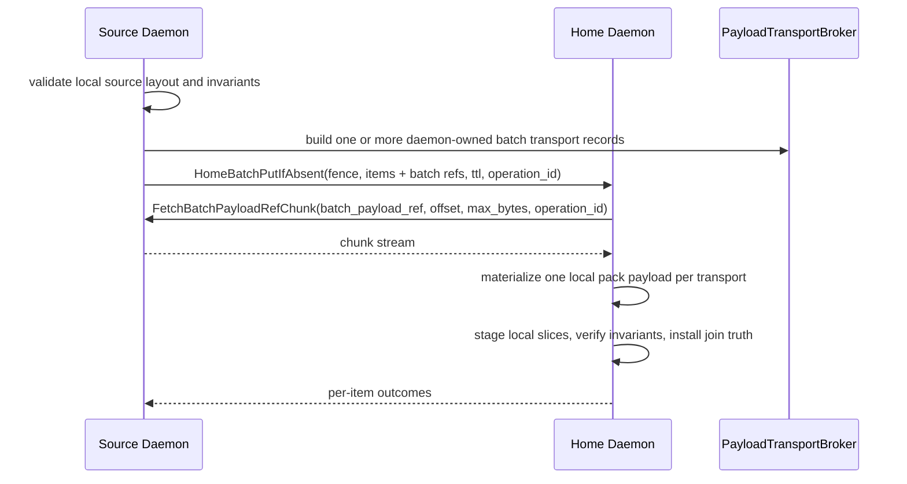
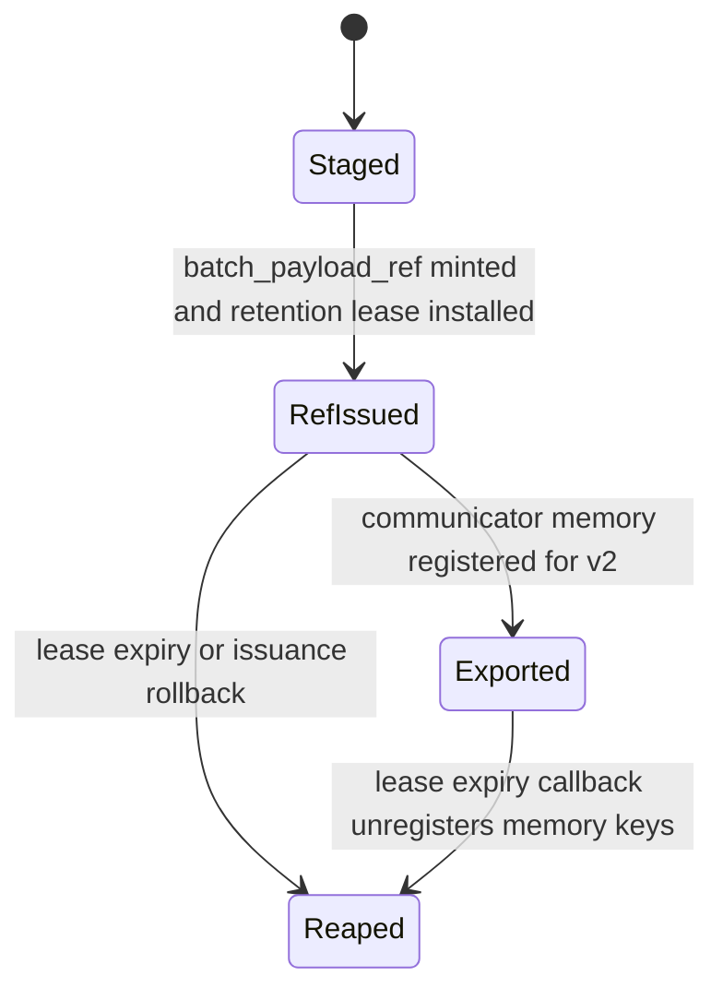
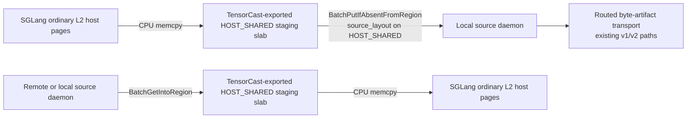
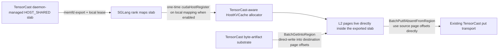
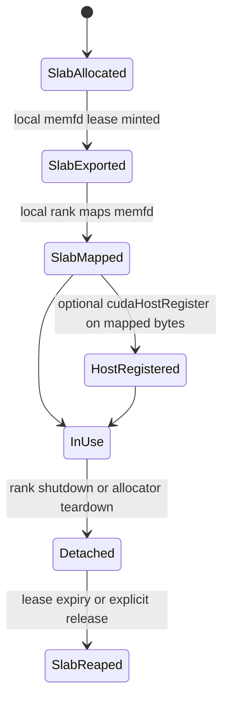
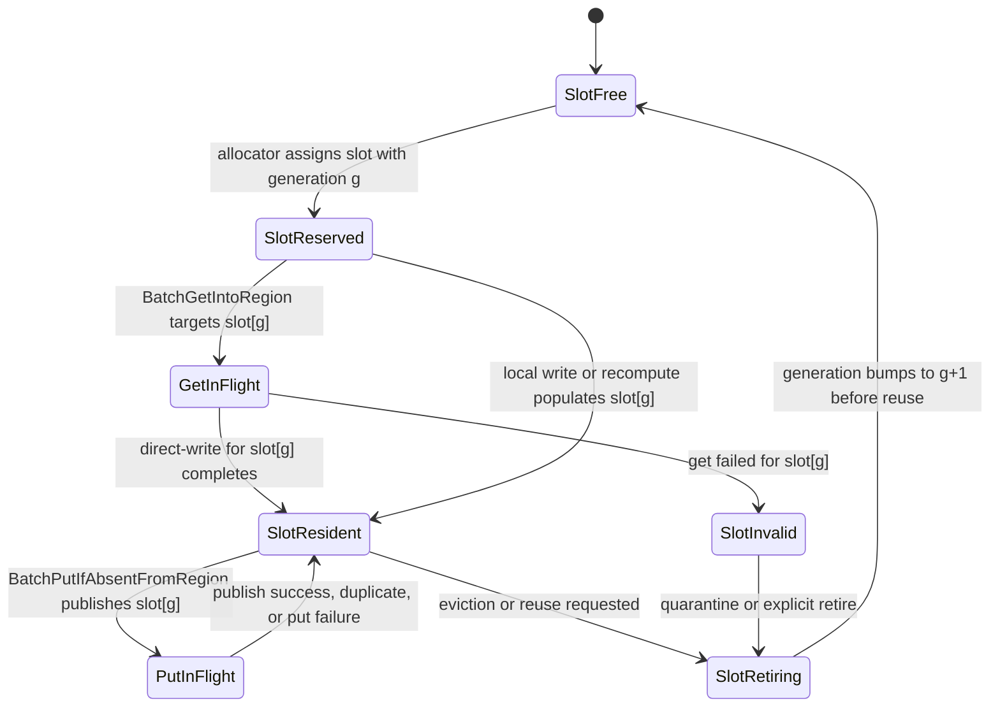
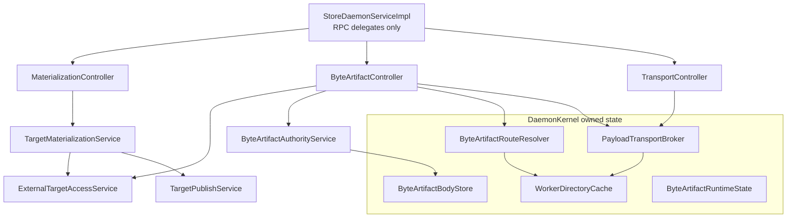

# Summary

TensorCast now has one canonical artifact-first runtime for both structured artifacts and routed byte artifacts.

The unified model is:

- `Artifact`: immutable bytes plus identity.
- `ArtifactSelection`: the only selection contract.
- `Binding` or registered region: mutable placement target.
- copy contract: canonical-byte or mapped-byte write ranges.
- `WriteMode`: overwrite or `PUT_IF_ABSENT_JOIN`.

`byte_artifact` is a profile, not a parallel runtime. The final daemon shape keeps routed byte-artifact authority,
local shared-region access, payload transport, and publication capabilities in separate modules with explicit trust
boundaries.

Engine-oriented alias policy and manifest-oriented integration guidance live in
`docs/designs/0102-engine-artifact-integration-and-high-cardinality-manifest-orchestration.md`; `0087` remains
authoritative for the artifact value model and routed byte-artifact runtime itself.

# Current Implementation Snapshot

As of 2026-03-30, the live implementation matches this design:

- `StoreDaemonServiceImpl` delegates `Batch*`, `HomeBatch*`, `FetchPayloadRefChunk`, and `FetchBatchPayloadRefChunk`
  through controller entrypoints.
- `ByteArtifactController` owns byte-artifact batch ingress and home-authority orchestration.
- `MaterializationController` continues to own `MaterializeIntoTarget`, `MaterializeIntoMappedTarget`,
  `PublishTargetReplica`, and related artifact lifecycle RPCs.
- `TransportController` owns `FetchPayloadRefChunk` and `FetchBatchPayloadRefChunk` delegation on top of
  `PayloadTransportBroker`.
- `DaemonKernel` owns long-lived routed byte-artifact state: runtime state, body store, route resolver, payload
  transport broker, and shared worker directory cache.
- `ExternalTargetAccessService` is the shared local region boundary used by both materialization flows and
  byte-artifact ingress flows.
- `TargetPublicationScope`, `TargetPublicationRegistry`, `target_publication_token`, `PayloadRefScope`, and
  `BatchPayloadRefScope` are the live capability contracts.
- `BatchGetIntoRegionRequest` no longer exposes `preference` or `source_policy`.
- NodeAgent preserves structured `manifest`, `publish`, `hydrate`, and `evict_local` artifact results over
  `ExecutePlan`.

# Goals / Non-Goals

Goals

- Keep one artifact-first semantic model for weights, structured artifacts, and routed byte artifacts.
- Keep `ArtifactSelection` as the only selection envelope across SDK, daemon, NodeAgent, and plans.
- Keep routed byte-artifact truth off the Global Store per-blob hot path.
- Keep caller-accessible local region reads and writes inside one daemon-local safety boundary.
- Keep payload transport reusable and capability-scoped.
- Keep plan and NodeAgent artifact actions aligned with canonical `manifest/publish/hydrate/evict_local` semantics.

Non-Goals

- Move token-to-key mapping, request tables, or paged-attention semantics into TensorCast core.
- Introduce a generic artifact-runtime controller shared by every profile.
- Reintroduce Global Store as a per-blob catalog for `cgid:byte_artifact~...`.
- Treat byte-artifact durability as equivalent to model-artifact durability.

# Architecture & Interfaces

## 1. Unified runtime model



Normative rules:

- `Artifact` is the value layer.
- `ArtifactSelection` is the only selection contract used for routing, validation, and result identity.
- `Binding` or a caller-registered region is the placement layer.
- copy planning stays separate from semantic truth.
- `WriteMode` changes write semantics without creating a second object model.

## 2. Artifact profiles

### 2.1 Tensor-dict artifacts

Tensor-dict artifacts use the standard selection contract from `0078`:

- canonical selection, subset selection, and transform views are all encoded through `ArtifactSelection`,
- `logical_layout_hash` and `selection_hash` are derived from canonical or selected index bytes,
- daemon validation resolves selection once and reuses the resolved selection through the whole flow.

### 2.2 Byte artifacts

Byte artifacts are the routed high-cardinality profile used for paged KV-style caches and other opaque byte payloads.

Schema contract:

- exactly one tensor named `payload`,
- `payload.dtype == uint8`,
- `payload.shape == [byte_length]`.

Selection contract:

- canonical-only,
- full-selection-only,
- `view_id == ""`,
- `view_spec` absent,
- `tensor_names` omitted,
- `view_subset_hash` empty.

Fixed profile digests:

- `logical_layout_hash = sha256(utf8("tensorcast.byte_artifact.layout.v1\n")).digest()`
- `selection_hash = sha256(utf8("tensorcast.byte_artifact.selection.v1\n")).digest()`

Normative rules:

- byte-artifact selection identity must not depend on payload bytes, byte length, or any Global Store lookup,
- `Artifact.view(...)` and subset selection must be rejected for byte artifacts,
- SDK and daemon must share the same byte-artifact selection helper contract,
- `ArtifactProfileRegistry` is the daemon entrypoint for byte-artifact artifact-id validation, selection validation,
  normalized selection construction, shard derivation, and invariant validation.

## 3. Write modes and sealing boundary

TensorCast keeps one write model with two modes:

- `OVERWRITE`: used by binding swap and mapped or inplace overwrite paths,
- `PUT_IF_ABSENT_JOIN`: used by sealed byte-artifact publication.

Byte-artifact publication requires an explicit sealing boundary.



Normative rules:

- `Open` state is engine-owned mutable state and is not publishable.
- `Sealed` state is the immutable byte snapshot that may enter routed publish paths.
- only sealed byte artifacts may use `PUT_IF_ABSENT_JOIN`.

Verification modes for `PUT_IF_ABSENT_JOIN`:

- `BYTE_ARTIFACT_VERIFICATION_MODE_STRICT_SHA256`
- `BYTE_ARTIFACT_VERIFICATION_MODE_LAYOUT_AND_SIZE_ONLY`

Normative rules:

- the default mode for generic routed byte artifacts remains
  `BYTE_ARTIFACT_VERIFICATION_MODE_STRICT_SHA256`,
- `BYTE_ARTIFACT_VERIFICATION_MODE_LAYOUT_AND_SIZE_ONLY` exists for
  engine-owned logical byte artifacts whose `artifact_id` is the engine's
  canonical logical page identity and whose producers do not guarantee
  bitwise-identical payload bytes across repeated publications,
- `STRICT_SHA256` joins on:
  - `layout_id`,
  - `byte_length`,
  - `payload_digest_alg = "sha256"`,
  - `payload_digest_hex = sha256(payload_bytes).hexdigest()`,
- `LAYOUT_AND_SIZE_ONLY` joins on:
  - `layout_id`,
  - `byte_length`,
  - and the routed `artifact_id` itself,
- in `LAYOUT_AND_SIZE_ONLY`, `payload_digest_alg` and `payload_digest_hex`
  become optional per-item metadata:
  - when present they are advisory verification metadata and observability
    inputs,
  - when absent they must not block publication, existence, or retrieval,
  - and they must not become an implicit second equality channel beside the
    engine-owned logical `artifact_id`.

Multiple puts of the same logical byte artifact remain first-writer-wins:

- `PUT_IF_ABSENT_JOIN` never means upsert,
- the first successful routed claim for the current home epoch fixes the visible
  claim for that `artifact_id`,
- later `PUT_IF_ABSENT_JOIN` attempts with the same join key may adopt the
  existing claim, but must not rewrite the retained backing in place,
- later writers must not silently replace the previously published bytes even if
  their payload differs under `LAYOUT_AND_SIZE_ONLY`,
- a workflow that truly needs last-writer-wins or repair-by-rewrite must use an
  explicit overwrite or delete-and-reissue flow rather than a second
  `PUT_IF_ABSENT_JOIN`.

TTL rules:

- TTL extension is monotonic increasing,
- immortal entries remain immortal under join and touch unless explicitly evicted.

## 4. Identity, authority, and routing for `cgid:byte_artifact~...`

Recommended identity profile:

`cgid:byte_artifact~<namespace>~<engine>~<model_id_enc>~<model_version_enc>~<layout_id>~<engine_key_enc>`

Identity rules:

- the suffix after `cgid:` must satisfy the shared CGID grammar `[-._~A-Za-z0-9]`,
- segments are separated by `~`,
- arbitrary bytes or strings should use `b64u.<base64url_nopad(...)>`,
- SDK and C++ runtime paths must share one parser, validator, and test-vector set,
- `model_id_enc` identifies the logical model family, while `model_version_enc`
  identifies the concrete served model revision or checkpoint generation that
  produced the bytes,
- `layout_id` must bind the byte-level page serialization contract, including
  any format version, attention family, dtype or encoding contract, and page
  size,
- `engine_key_enc` must bind the engine-owned logical page identity and any
  rank-local shard qualifier required for correctness, such as TP or PP
  ownership,
- engine-owned logical byte artifacts must not encode run-local or host-local
  values such as `run_id`, `instance_id`, `daemon_id`, or machine identity into
  the routed `artifact_id`.

Authority split:

- Global Store is the authority for shard-home leases only,
- the current shard-home daemon is the authority for per-blob existence truth, first-writer invariants, and TTL.

Sharding:

- `shard_id = hash64(utf8(artifact_id)) % S`,
- `hash64` is `sha256(utf8(artifact_id)).digest()`, first 8 bytes interpreted as little-endian `uint64`,
- `S` is a cluster-wide shard count, defaulting to `4096` unless configured otherwise.

Fencing and route validity:

- every `HomeBatch*` request carries `RouteFence`,
- `RouteFence` includes `{shard_id, lease_generation, holder_daemon_id, routing_epoch}`,
- stale or mismatched fence values fail closed and return redirect information when available,
- cached body validity is scoped by shard, lease generation, and routing epoch,
- ambiguous route freshness degrades to per-item miss or unavailable outcomes instead of unproven hits.

Cluster-wide routing invariants:

- shard count,
- shard hash/version,
- inline payload threshold,
- lease TTL and keepalive policy,
- route staleness budget,
- worker-directory staleness budget,
- routing epoch,
- payload-transport policy,
- batch-transport protocol version and segmentation policy when enabled,
- digest enforcement behavior.

Capability-directory rules:

- `gateway_ingress_enabled` is an external-ingress role bit,
- `shard_home_eligible` gates shard-home acquisition eligibility,
- capability-directory flags are discovery and routing signals, not peer authentication.

## 5. RPC families and trust model

The runtime uses four distinct RPC classes.

### 5.1 External ingress authority RPCs

- `BatchExists`
- `BatchTouchTtl`

Rules:

- these are public ingress RPCs,
- non-local callers require `gateway_ingress_enabled=true`,
- results are outcome-first and per item.

### 5.2 Local-only placement adapters

- `BatchGetIntoRegion`
- `BatchPutIfAbsentFromRegion`

Rules:

- these RPCs remain loopback or UDS-only because they touch caller-accessible local shared regions,
- they validate `pid`, `device_uuid`, and `TargetLayout` through `ExternalTargetAccessService`,
- `BatchGetIntoRegionRequest` carries only `selections`, `target_layout`, `pid`, `device_uuid`, and optional
  `operation_id`,
- `BatchPutIfAbsentFromRegionRequest` carries item selections plus invariants or payload refs, `source_layout`, optional
  `ttl_ms`, `pid`, `device_uuid`, and optional `operation_id`,
- `preference` and `source_policy` are not part of the final `BatchGetIntoRegion` contract.

Current live implementation note:

- current region-backed byte-artifact ingress is still `VRAM` only,
- the planned `HOST_SHARED` extension widens only the local placement layer,
- it does not change routed authority, `RouteFence`, per-item outcome shape, or transport ownership.

### 5.3 Home-scoped fenced authority RPCs

- `HomeBatchExists`
- `HomeBatchGet`
- `HomeBatchPutIfAbsent`
- `HomeBatchTouchTtl`

Rules:

- these are inter-daemon authority RPCs,
- they do not accept caller PID, target layout, or direct caller-region access,
- they are governed by `RouteFence`, not by `gateway_ingress_enabled`,
- current live implementations may answer successful large items through inline payload, singular `payload_ref`, or
  `batch_payload_slice` plus `BatchPayloadTransport`,
- batch-native transport changes only the payload-movement encoding; it does not change per-item authority outcomes.

### 5.4 Inter-daemon transport RPC

- `FetchPayloadRefChunk`
- `FetchBatchPayloadRefChunk`

Rules:

- transport authorization comes from typed signed capability envelopes:
  `payload_ref` for singular payloads and `batch_payload_ref` for batch payload transports,
- it is not an ingress RPC and is not gated by `gateway_ingress_enabled`,
- it carries consume-side `operation_id` when the capability requires operation binding.

### 5.5 Implemented delta: batch-native inter-daemon byte transport

This section describes the current implementation state.

The narrow goal is unchanged:

- keep page-level `byte_artifact` identity unchanged,
- keep shard-home lease, `RouteFence`, and home-authority truth unchanged,
- keep per-item status, digest, and TTL semantics unchanged,
- change only how large inter-daemon byte payloads move after authority has already made a per-item decision.

The transport family is live today:

- `v1 grpc_chunk_ref` is implemented and remains the required batch-native fallback,
- `v2 communicator_source` is implemented and is the preferred realization when both peers advertise protocol
  version `>= 2` and host-memory export is enabled,
- the legacy per-item `payload_ref` path still exists as the fail-closed compatibility path when batch transport is
  disabled, unsupported, or cannot be issued for a given pack.

The remaining follow-ups are narrower than the original design delta:

- current `v2 communicator_source` open paths resolve one remote pack source per `transport_id`, then mirror the full
  pack into local host memory before per-item slicing,
- current `v1 grpc_chunk_ref` consumption also materializes one full pack payload per transport before local slicing,
- session-scoped `StreamingPinnedBuffer` reuse remains deferred and is not part of the current implementation.

This section should be read together with the existing split in the repository:

- ordinary artifact replica transfer already uses the communicator-backed daemon P2P data plane over RDMA or MTCP,
- routed `byte_artifact` uses home-authority `HomeBatch*` plus capability-scoped transport records,
- batch-native routed transport now keeps that authority split intact while replacing the old one-transport-per-artifact
  shape with one transport object per pack.

#### 5.5.1 Semantic hard boundaries

Batch-native transport must preserve these invariants:

1. `HomeBatch*` remains the only authority decision point for routed byte artifacts. Batch transport is a byte movement
   optimization after authority, not a second authority dialect.
2. `BatchExists`, `HomeBatchExists`, `PutIfAbsentJoin`, claim truth, visibility truth, and serving truth keep the same
   meaning defined by `0087` and `0090`.
3. Transport failure must not rewrite claim truth. A failed remote fetch may fail the current operation, but it must not
   implicitly delete or reopen the routed claim.
4. Per-item outcomes remain explicit. A mixed batch must still report which artifacts succeeded, missed, conflicted, or
   failed verification.
5. Digest, size, and invariant checks remain per artifact. Batch transport must not replace per-item verification with a
   single opaque batch checksum.
6. A batch transport object must never mix multiple directions, multiple issuer daemons, or multiple consumer
   `operation_id` bindings.
7. A batch transport object must never cross `RouteFence` boundaries. One object is scoped to one authority epoch.

#### 5.5.2 Transport family, not one realization

The live transport family introduces a batch-scoped transport object instead of overloading singular `payload_ref`.

Current proto shape:

```proto
message BatchPayloadEntry {
  string artifact_id = 1;
  uint64 offset = 2;
  uint64 length = 3;
  string digest_alg = 4;
  string digest_hex = 5;
}

message BatchPayloadManifest {
  repeated BatchPayloadEntry entries = 1;
  uint64 total_size = 2;
}

message BatchPayloadCommunicatorSource {
  bytes batch_payload_ref = 1;
  uint32 protocol_version = 2;
  string producer_daemon_id = 3;
  string consumer_daemon_id = 4;
  string producer_host = 5;
  uint32 producer_port = 6;
  repeated string remote_memory_keys = 7;
  repeated uint64 buffer_sizes = 8;
  string remote_endpoint_id = 9;
  string local_endpoint_id_hint = 10;
  BatchPayloadMemoryLocation memory_location = 11;
  uint64 total_payload_bytes = 12;
}

message BatchPayloadGrpcChunkRef {
  bytes batch_payload_ref = 1;
  uint32 protocol_version = 2;
}

message BatchPayloadTransport {
  string transport_id = 1;
  BatchPayloadManifest manifest = 2;
  oneof transport_kind {
    BatchPayloadGrpcChunkRef grpc_chunk_ref = 3;
    BatchPayloadCommunicatorSource communicator_source = 4;
  }
}

message BatchPayloadSlice {
  string transport_id = 1;
  uint64 offset = 2;
  uint64 length = 3;
}
```

Current additive request and response evolution:

- `HomeBatchGetResponse` may carry repeated `BatchPayloadTransport`, and successful items may refer to one transport via
  `BatchPayloadSlice`.
- `HomeBatchPutIfAbsentRequest` may carry repeated `BatchPayloadTransport`, and request items may refer to one transport
  via `BatchPayloadSlice`.
- existing `inline_payload` and per-item `payload_ref` remain valid fallback encodings.

Normative rules:

1. The manifest is transport metadata only. It does not create a new artifact identity, content identity, or backing
   identity.
2. `BatchPayloadManifest` is the explicit item table used for scatter or gather; transport bytes are interpreted only
   through this manifest.
3. Each manifest entry corresponds to exactly one artifact payload and keeps one exact `{artifact_id, offset, length,
   digest}` tuple.
4. A response or request may carry multiple transports. Batching is per remote-home bucket, and segmentation is still
   allowed by size, item count, or staging constraints.
5. Current realizations do not yet provide a reusable remote slice loader over one open remote pack. `v1 grpc_chunk_ref`
   materializes one local payload buffer per transport, and remote `v2 communicator_source` paths mirror one full pack
   into local host memory before serving subsequent item slices from that local mirror.
6. A per-item outcome or request item must choose exactly one payload encoding family at a time:
   `inline_payload`, singular `payload_ref`, or `batch_payload_slice`.
7. Only items whose semantic authority outcome is success may carry `batch_payload_slice`; `MISS`, conflict, and
   authority-side rejection outcomes must not be encoded through the batch manifest.
8. `BatchPayloadTransport` is a transport-family envelope. The current realizations are `grpc_chunk_ref` and
   `communicator_source`, and later optimizations must not change routed byte-artifact authority semantics or per-item
   result shape.

#### 5.5.3 Current batch payload transport capability family

Per-item `PayloadRefScope` is intentionally singular:

- it binds one `artifact_id`,
- it binds one `payload_size`,
- it binds one digest,
- it is a clean front door for one verified payload.

Batch transport needs different signed truth:

- one `transport_id`,
- one `total_payload_bytes`,
- one manifest digest,
- one direction,
- one consume-side `operation_id`,
- and a typed statement that the capability covers a manifest of many entries instead of one artifact.

Current capability family:

- `BatchPayloadRefScope`
- `CAPABILITY_AUDIENCE_BATCH_PAYLOAD_REF`
- `FetchBatchPayloadRefChunk`

Current `BatchPayloadRefScope` fields:

- `transport_id`
- `payload_size`
- `direction`
- `operation_id`
- `manifest_digest_hex`
- `consumer_daemon_id`

Normative rules:

1. `batch_payload_ref` is always a signed capability envelope over `BatchPayloadRefScope`; expiry and issuer identity
   live in the outer `CapabilityTokenEnvelope`, not inside the scope body.
2. The consumer must verify that the supplied manifest matches the signed digest before using any entry offsets. The
   current implementation always computes and signs `manifest_digest_hex` at issuance time.
3. The capability is single-consumer when `consumer_daemon_id` is set, and operation-scoped when `operation_id` is
   set.
4. The current scope does not sign `producer_daemon_id` or communicator endpoint metadata. `communicator_source` carries
   producer endpoint information, and the broker validates structural consistency, consumer binding, and payload-size
   consistency at open time.
5. Per-entry payload digest verification remains item-scoped. If an entry omits digest fields, the consumer still
   validates `{artifact_id, offset, length}` boundaries and transport success, but does not compute an additional
   content hash for that item.
6. Batch capability TTL, fetch deadline, cleanup, and batch-size controls live under the same payload-transport policy
   family as per-item transport.
7. Rollout still fails closed on mixed support. A daemon emits batch transport only when peer compatibility and routing
   epoch permit it.

#### 5.5.4 Implemented realizations and current selection policy

`v1 grpc_chunk_ref`

- Implemented.
- Introduces `FetchBatchPayloadRefChunk` as a new inter-daemon transport RPC rather than overloading
  `FetchPayloadRefChunk`.
- Stages one daemon-owned contiguous slab per pack and exposes that slab through `BatchPayloadGrpcChunkRef`.
- The current consume-side implementation fetches the full pack into one local payload buffer per `transport_id`, then
  serves subsequent item slices from that local payload.
- It remains subject to gRPC frame sizing and `max_chunk_bytes`, so it is an optimization of the legacy path rather
  than the final cross-daemon data plane.

`v2 communicator_source`

- Implemented.
- Keeps the same `BatchPayloadTransport` envelope and manifest semantics, but realizes bytes through communicator export
  descriptors instead of a transport RPC payload stream.
- The source shape is currently a daemon-owned staged host-memory slab exported through the shared communicator.
- `BatchPayloadCommunicatorSource` is the serializable control-plane descriptor. The broker lowers it into a runtime
  `RemoteKeySource` backed by the shared communicator rather than using `P2PSource` itself as the wire schema.
- The current remote consume path then mirrors the full pack once into local host memory before per-item slicing. This
  keeps the semantic contract stable while leaving reusable remote-slice lowering as future work.

Current selection rules:

1. Default daemon configuration enables batch transport with protocol version `2`, which means `v2 communicator_source`
   is preferred and `v1 grpc_chunk_ref` remains available as fallback.
2. `GetServerConfig` exposes:
   - `batch_transport_protocol_version`
   - `batch_payload_grpc_chunk_ref_enabled`
   - `batch_payload_communicator_source_enabled`
   - `batch_payload_host_memory_export_enabled`
   - `max_batch_payload_bytes`
3. A daemon that supports `v2 communicator_source` must still be able to speak `v1 grpc_chunk_ref` when the peer only
   advertises protocol version `1` or when communicator export cannot be used for the specific pack.
4. When peer capability, local export readiness, minimum TTL checks, or producer endpoint data do not permit
   `communicator_source`, the daemon falls back per pack to `grpc_chunk_ref`, and may fall back further to per-item
   `payload_ref` or inline payload when pack issuance itself fails.

#### 5.5.5 V1 get path



Get-path rules:

1. `HomeBatchGet` still decides per item whether the answer is `MISS`, `OK`, conflict, or unavailable before transport
   starts.
2. Only successful large items may be packed into batch transport objects. Small items may remain inline.
3. The home daemon may choose any stable packing order; order is not semantic because items are re-identified by the
   manifest.
4. The current `v1 grpc_chunk_ref` implementation resolves one `batch_payload_ref` per pack and materializes the full
   pack into one local payload buffer per `transport_id` before per-item slicing. It does not yet stream directly into
   the target layout without an intermediate full-pack buffer.
5. `BatchGetIntoRegion` currently groups apply work by `transport_id`, so one pack becomes one apply work unit and the
   same local pack payload can be reused across all items that reference that transport.
6. When target ranges do not overlap, the controller currently executes those apply work units in parallel across the
   byte-artifact apply pool. Final success remains item-scoped even though pack setup is shared.
7. Final `BatchGetIntoRegion` success is still determined per item after digest verification and region fill complete.

#### 5.5.6 V1 put path



Put-path rules:

1. Source-side batching is grouped by remote home bucket first; a transport pack must not mix different home daemons.
2. The source daemon must not expose caller-accessible local regions directly as a remote fetch source after the local ingress RPC
   returns.
3. Before issuing a batch capability on the put path, the source daemon must adopt or stage the bytes into daemon-owned
   transport state.
4. The current implementation realizes transport state as one contiguous staged slab per pack. The wire contract does
   not depend on that choice, but the live controller and broker paths do.
5. The home daemon still verifies each item's invariant and still installs routed join truth per artifact.
6. The current home-daemon consume path reads one full pack per transport, then stages or reuses per-item slices from
   that local pack payload before join installation.
7. When the consumed pack slice is already available as local host bytes, the home daemon currently prefers a
   one-pass fast CPU staging path that copies into final backing while computing the required content digest, instead
   of rereading the bytes through the generic loader pipeline.
8. `BatchPutIfAbsentFromRegion` currently runs shard-local put tasks concurrently up to
   `min(shard_count, batch_get_apply_threads)`. Each task stages, emits, and dispatches its own local or remote-home
   request as soon as that shard is ready; there is no global "all shards must be packed before any dispatch" barrier.
9. Partial success remains legal. One failed item in a pack must not force unrelated items in the same pack to be
   reported as semantic failure if their bytes verified and their join succeeded.

#### 5.5.7 Implemented v2 communicator-backed realization

`v2 communicator_source` is the current communicator-backed realization. It moves routed byte-artifact remote transport
toward the existing ordinary-artifact communicator data plane without reviving the Global Store per-blob hot path.

Current control-plane schema for `BatchPayloadCommunicatorSource`:

- `batch_payload_ref`
- `protocol_version`
- `producer_daemon_id`
- `consumer_daemon_id`
- `producer_host`
- `producer_port`
- `remote_memory_keys[]`
- `buffer_sizes[]`
- `remote_endpoint_id`
- optional `local_endpoint_id_hint`
- `memory_location`
- `total_payload_bytes`

Rules:

1. `v2` still begins at `HomeBatch*`; communicator is a data-plane realization, not a new routing or authority owner.
2. `BatchPayloadCommunicatorSource` is a serializable control-plane descriptor, not a wire-serialized `P2PSource`.
   The broker currently lowers it into a runtime `RemoteKeySource` backed by the shared communicator.
3. Current `v2` support is intentionally narrow: the controller emits only host-memory exports. The proto already has a
   `GPU_VRAM` enum value for future extensions, but the live controller path does not emit VRAM-backed packs.
4. The producer pack defines one contiguous logical byte space over full byte-artifact payloads. Each manifest entry
   owns exactly one whole-artifact slice `{offset, length}` inside that pack byte space.
5. Current remote `v2` consume paths open one communicator source per `transport_id`, mirror the full pack once into
   local host memory via `mirror_seekable_source_payload(...)`, and then serve subsequent item slices from that local
   mirror. Local same-daemon communicator packs can serve source slices directly without the mirror step.
6. Semantic success remains item-scoped and whole-artifact-scoped. `v2` does not introduce sub-artifact success,
   partial artifact visibility, or sub-artifact digest semantics.
7. `v2` does not require per-pack Global Store transport sessions. Peer addressability and export descriptors come from
   `BatchPayloadCommunicatorSource`, the shared communicator, and worker-directory resolution.
8. Verification remains manifest-first. `v2` uses the signed `batch_payload_ref` manifest digest plus per-entry digests
   when present; it does not require a full-pack payload hash.
9. `v1 grpc_chunk_ref` and legacy per-item `payload_ref` remain valid fallbacks beside `v2`.

#### 5.5.8 Failure isolation and verification

Batch transport must preserve failure granularity even when the wire movement is shared.

Rules:

1. Manifest verification is batch-scoped. If the consumer cannot validate the manifest against the signed
   `BatchPayloadRefScope`, all items that reference that batch transport fail the current operation because their
   offsets are untrusted.
2. The signed batch capability currently binds `transport_id`, `payload_size`, `direction`, `operation_id`,
   `manifest_digest_hex`, `consumer_daemon_id`, plus outer-envelope issuer and expiry. It does not sign
   `producer_daemon_id` or communicator endpoint metadata.
3. Transport-read failure is batch-scoped. If one pack transport fails or times out, only the items that reference
   that pack fail the current operation; unrelated transports in the same `HomeBatch*` request may still complete.
4. Per-entry digest mismatch or per-entry invariant failure remains item-scoped whenever the transport itself remains
   readable and entry boundaries stay trustworthy.
5. Per-entry payload digests are item-scoped. The current packer populates `{digest_alg, digest_hex}` from the source
   descriptor when available, and consumers verify those digests before final item success.
6. A batch-transport failure is an operation result, not an authority rewrite. The recorded routed claim truth,
   visibility truth, and join semantics remain whatever `HomeBatch*` already decided before the transport attempt.
7. Observability must distinguish authority-side miss or conflict from transport-side fetch failure and from post-fetch
   verification failure. The live implementation does this through per-item outcomes plus `transport_open`,
   `transport_mirror`, and summary logs.

#### 5.5.9 Lifecycle and backing ownership

Batch transport stays inside the shared lifecycle direction already established for `payload_ref`, but the current
implementation is simpler than the original explicit-release sketch.



Rules:

1. A batch transport object is still a capability front door, not a new backing-truth family.
2. Current expiry is derived by `resolve_payload_ref_expiry(now, ref_ttl, capability_expires_at)`, so the live expiry is
   `min(now + ref_ttl, capability_expires_at)` when a caller-provided expiry exists.
3. `v2 communicator_source` adds one more gate: the remaining lifetime must be at least
   `minimum_batch_transport_ttl`, otherwise the emitter falls back to `v1 grpc_chunk_ref` or older encodings.
4. `PayloadTransportBroker` owns the staged payload record and installs a retention-lease callback that erases the
   batch record and unregisters communicator memory keys on expiry.
5. Current batch transport cleanup is TTL or lease driven. There is no separate consumer-driven explicit batch-release
   RPC in the current implementation.
6. `transport_release_guard` is already present in config and daemon options, but it is not yet consumed by the live
   broker implementation.
7. `PayloadTransportBroker` remains the transport boundary. Batch transport does not create a second owner-side
   lifecycle subsystem beside the lifecycle kernel.

#### 5.5.10 Potential future optimization: session-scoped streaming buffer reuse

`v1 grpc_chunk_ref` removes the per-artifact remote transport hot path, but it does not by itself remove per-artifact
target-side lowering overhead. In the current `BatchGetIntoRegion` realization, the consumer daemon still executes one
lowering plan per artifact and may initialize one `StreamingPinnedBuffer` per artifact while scattering bytes into the
validated target region. This is semantically correct but leaves a large fixed cost when a request transfers many small
byte artifacts.

This optimization is deferred and is not part of the current implementation.

Recommended optimization:

- treat one `BatchGetIntoRegion` operation, or one remote-home pack within that operation, as a target-side lowering
  session,
- allocate one session-scoped `StreamingPinnedBuffer` or a very small bounded pool per target device for that session,
- reuse that session-scoped staging resource across many item lowerings instead of allocate or initialize per artifact,
- keep the lowering plan and final outcome item-scoped even when the staging resource is reused.

Normative rules:

1. This optimization is internal to the consumer daemon data plane. It must not change caller API, artifact identity,
   `RouteFence`, routed authority truth, or per-item `BatchGetIntoRegion` outcome shape.
2. Reuse is scoped to one active operation, or to one bounded pack-local session within an operation. There is no
   requirement to share staging state across unrelated operations.
3. Digest verification, target-layout validation, and final success or failure remain per artifact even when multiple
   items reuse the same session-scoped staging resource.
4. Session-scoped reuse must remain bounded by the existing pinned-memory budget and GPU scheduling rules. Resource
   pooling is allowed; unbounded staging growth is not.
5. The optimization sits below `BatchPayloadTransport`. It must work for both:
   - `v1 grpc_chunk_ref`
   - current `v2 communicator_source`
   because both realizations still lower a remote readable batch source into the same target-region materialization
   path.
6. Implementations may later collapse multiple item lowerings into a shared executor session, but `v1` only requires
   session-scoped staging reuse. It does not require changing the item-level lowering contract or result contract.

Design intent:

- `BatchPayloadTransport` solves inter-daemon wire inefficiency.
- Session-scoped streaming buffer reuse solves consumer-side lowering inefficiency.
- These optimizations are complementary and must compose cleanly.

#### 5.5.11 Resource controls and observability

Batch-native transport needs explicit guards so implementations do not silently diverge on pack shape or memory risk.

Current additive policy knobs under `DaemonConfig.ByteArtifactRouting.PayloadTransport`:

- `max_batch_payload_bytes`
- `max_batch_items`
- `max_batch_stage_bytes_per_peer`
- `batch_transport_protocol_version`
- `communicator_source_enabled`
- `host_memory_export_enabled`
- `minimum_batch_transport_ttl`
- `transport_release_guard`

Rules:

1. Packers must segment before exhausting staging budgets. Resource pressure should produce more packs or fallback, not
   unbounded temporary slabs.
2. `max_chunk_bytes` continues to cap each `v1 grpc_chunk_ref` fetch RPC payload. `v2 communicator_source` uses
   exportable producer memory instead of RPC payload slicing, but logical pack shape still remains bounded by
   `max_batch_payload_bytes` and `max_batch_items`.
3. Current observability is log-first rather than metrics-first. The live implementation emits structured
   `INFO` or `VLOG(1)` summaries such as:
   - `byte_artifact.home_batch_get_timing_summary`
   - `byte_artifact.home_batch_get_response_shape`
   - `byte_artifact.batch_get_into_region_home_rpc_result`
   - `byte_artifact.batch_get_into_region_transport_open`
   - `byte_artifact.batch_get_into_region_transport_mirror`
   - `byte_artifact.batch_get_into_region_apply_plan`
   - `byte_artifact.batch_get_into_region_transport_apply_summary`
   - `byte_artifact.batch_get_into_region_summary`
   - `byte_artifact.home_batch_put_if_absent_transport_mirror`
   - `byte_artifact.home_batch_put_if_absent_stage_plan`
   - `byte_artifact.batch_put_if_absent_from_region_transport_emit`
   - `byte_artifact.batch_put_if_absent_from_region_home_rpc_result`
   - `byte_artifact.batch_put_if_absent_from_region_summary`
   - `batch_payload_ref.communicator_export_summary`
   - `batch_payload_ref.communicator_open_summary`
4. Current fallback accounting is also log-first. Response-shape and summary logs report inline items, per-item
   `payload_ref` items, batch-slice items, `grpc_chunk_ref` vs `communicator_source` transport counts, and
   remote-payload-ref fallback counts.
5. `GetServerConfig` exposes the batch-transport protocol version, `grpc_chunk_ref` enablement,
   `communicator_source` enablement, host-memory export enablement, and `max_batch_payload_bytes` so observability can
   correlate behavior with the active transport realization.
6. Current controller parallelism is intentionally bounded rather than unbounded:
   - `BatchGetIntoRegion` and home-daemon put staging reuse the byte-artifact apply pool
   - `batch_get_apply_threads` defaults to the engine thread count when unset
   - put-shard fanout is capped at `min(shard_count, batch_get_apply_threads)`
7. Current get-side parallel apply is safety-gated. The controller only parallelizes pack-scoped apply work when the
   target layout ranges do not overlap on the same storage backing; otherwise it falls back to sequential apply.

#### 5.5.12 Compatibility and fallback

Batch-native transport is additive and must coexist with the current path.

Rules:

1. When both peers advertise compatible protocol version `>= 2`, `communicator_source` is enabled, and host-memory
   export is enabled, `v2 communicator_source` is the default selected batch transport realization.
2. If peer compatibility, routing epoch, communicator readiness, host-memory export, producer endpoint data, export
   setup, or minimum-lifetime checks do not permit `v2`, the daemon falls back per pack to `v1 grpc_chunk_ref`.
3. If batch-transport issuance itself fails for a pack, the controller falls back further to per-item `payload_ref` or
   inline payload, depending on item size and availability.
4. Inline payload remains the preferred path for small items under the existing threshold policy.
5. Existing caller APIs, artifact ids, and result shapes remain valid. The change is internal to daemon-to-daemon
   transport and additive to `HomeBatch*` payload encodings.
6. Observability reports both pack-level and per-item accounting through structured logs and response-shape summaries.
7. Support is negotiated per peer and per routing epoch. A daemon must not emit `BatchPayloadTransport` only because it
   is locally enabled; the remote peer must advertise support for the same batch-transport protocol version.
8. Current code emits per-pack warnings when batch packing or transport issuance falls back all the way to per-item
   `payload_ref`, and emits the actual selected transport kind in `transport_emit` or `transport_open` logs. A
   dedicated rate-limited `v2 -> v1` downgrade warning is still future work.
9. `v1 grpc_chunk_ref` is the required fallback realization whenever peers do not jointly advertise
   `v2 communicator_source`.

#### 5.5.13 Planned local `HOST_SHARED` region extension for byte-artifact batch ingress

This section describes the next planned extension. It is not implemented yet.

Goal:

- remove the mandatory GPU staging hop for local byte-artifact batch `put` and `get`,
- keep `BatchGetIntoRegion` / `BatchPutIfAbsentFromRegion` local-only,
- keep byte-artifact identity, routed authority truth, and per-item results unchanged,
- change only the local placement surface so the caller and local daemon may share host memory in addition to VRAM.

Planned region model:

- the region-backed placement surface should converge toward a unified registration model such as
  `RegisterRegion(memory_kind=VRAM|HOST_SHARED)` rather than adding a permanently SGLang-specific side API,
- `memory_kind=HOST_SHARED` means one daemon-local shared host byte window whose lifetime is governed by the same
  local-only lease, TTL, bounds, and poison rules as other region-backed placement surfaces,
- the external region concept remains local placement state only; it is not part of byte-artifact identity, routing,
  authority, or publication truth,
- the implementation may still distinguish backing modes internally, for example:
  - caller-managed or externally imported memory,
  - daemon-managed shared slabs exported to local clients,
  but that distinction must stay below the unified region contract.

Planned schema direction:

- the external surface should converge toward a generic region reference rather than a storage-source-specific
  `host_region_id` field,
- one reasonable target shape is:
  - `enum RegionMemoryKind { VRAM, HOST_SHARED }`
  - `message RegionRef { string region_id; RegionMemoryKind memory_kind; }`
  - `StorageEntry.oneof storage_source { bytes cuda_ipc_handle; RegionRef region_ref; }`
- for allocator-backed Phase B residency, the request must additionally carry a slot-lifetime token or equivalent
  fields sufficient to recover:
  - `slot_index`
  - `slot_generation`
  - `offset_bytes`
  - `length_bytes`
- the first safe rollout should preserve one logical slot token per KV page even if adjacent slots are later coalesced
  internally after validation and before execution,
- legacy `RegisterVramRegion` may remain as a compatibility wrapper over the unified region model,
  but new host-shared flows should not create a parallel storage schema family.

Normative rules:

1. `BatchGetIntoRegion` and `BatchPutIfAbsentFromRegion` remain loopback or UDS-only even after `HOST_SHARED` exists.
   Remote or home daemons must never write directly into a caller-accessible host region.
2. `HOST_SHARED` widens only the local source or target placement type. It must not alter `HomeBatch*`,
   `FetchBatchPayloadRefChunk`, `communicator_source`, shard-home leases, or routed authority ownership.
3. `device_uuid` remains meaningful for `VRAM` regions. The planned `HOST_SHARED` extension should treat GPU-device
   validation as not applicable to host-backed entries rather than pretending host memory belongs to one GPU.
4. A host region is a byte window with explicit `{region_id, offset, length}` bounds. The controller and runtime must
   continue to validate layout coverage item-by-item before any bytes are copied.
5. Host-region support must preserve failure granularity:
   - transport failure stays pack-scoped,
   - verification failure stays item-scoped when boundaries remain trusted,
   - target fill or source read failure stays item-scoped or pack-scoped according to the same rules already used for
     `VRAM`.
6. `HOST_SHARED` must compose with existing verification modes, including the current
   `BYTE_ARTIFACT_VERIFICATION_MODE_LAYOUT_AND_SIZE_ONLY` path used by SGLang HiCache integration.
7. Phase-1 host-shared rollout should reject mixed `VRAM` + `HOST_SHARED` `TargetLayout` requests. Supporting one
   request that spans both memory kinds is a later extension rather than a baseline requirement.
8. For pure `HOST_SHARED` placement:
   - `device_uuid` should be treated as not applicable,
   - `storage.device_id` should not participate in GPU-device matching,
   - and validation should fail closed if a request simultaneously claims `HOST_SHARED` storage and a contradictory GPU
     device binding.
9. Per-rank host slabs are the intended deployment shape for SGLang HiCache. Each rank owns its own exported
   `HOST_SHARED` slab because HiCache residency and page allocation are rank-local.
10. Ordinary batch-operation failure on `HOST_SHARED` placement must not automatically imply whole-slab poison.
    The planned host-slab model should distinguish:
    - slab-level fatal faults:
      mapping corruption, lease invalidity, inconsistent bounds metadata, or another condition that makes the whole
      slab unsafe to continue using,
    - operation-local faults:
      one batch transport failure, one verification failure, or one interrupted fill or publish affecting only the
      current placement window or page set.
11. Whole-slab poison and slab retirement should be reserved for slab-level fatal faults.
    Operation-local faults should invalidate only the affected window or page-range state and allow the slab itself to
    remain attached.
12. The caller owns per-slot liveness:
    - any slot in `SlotReserved`, `GetInFlight`, or `PutInFlight` must remain pinned against eviction,
    - the caller must not recycle a slot or bump its generation while any in-flight ref remains,
    - and `BatchGetIntoRegion` should target slots that are not yet visible as committed HiCache residency.

Planned bring-up sequence:

0. Add daemon-managed `HOST_SHARED` slab export and local-attach lifecycle:
   - local slab allocation,
   - memfd export,
   - local lease issuance,
   - client mapping,
   - and keepalive or release semantics for long-lived attached slabs.
1. Add `HOST_SHARED` source support to `BatchPutIfAbsentFromRegion`.
   The put path is the narrower bring-up because it only needs a host-readable source layout.
2. Add `HOST_SHARED` target support to `BatchGetIntoRegion`.
   The get path is deeper because the runtime must gain a host-target sink rather than the current GPU-only target sink.
3. Switch SGLang off GPU staging and onto long-lived host staging slabs exported by the local daemon.
4. Add a TensorCast-aware host allocator so SGLang L2 pages can live directly inside daemon-exported host slabs and
   the staging copy disappears.

Phase-relationship rule:

- Phase A host staging and Phase B direct host allocation must reuse the same underlying `HOST_SHARED` region
  mechanism,
- they should differ only in policy and integration depth:
  - Phase A uses the exported slab as a scratch placement surface,
  - Phase B uses the same style of exported slab as allocator-owned L2 residency,
- the design should avoid introducing one temporary API or one temporary lifecycle path for Phase A and a second,
  unrelated one for Phase B.
- once the SGLang TensorCast backend switches to the `HOST_SHARED` path, GPU staging should be removed from that
  backend rather than retained as a runtime fallback inside the same integration path.

Planned phase-A non-zero-copy data flow:



Planned phase-B zero-copy data flow:



Planned daemon-managed host-slab lifecycle:



Design notes for the SGLang HiCache use case:

- the first validation step should use one long-lived `HOST_SHARED` staging slab per rank rather than allocating a new
  memfd per batch,
- the zero-copy target is one long-lived daemon-managed slab per rank, internally page-partitioned by the SGLang host
  allocator rather than one region per page,
- for allocator-backed Phase B residency, one slab `slot` is the ownership unit and typically corresponds to one KV
  page,
- allocator-backed slot reuse must be protected by a monotonically increasing `generation` so a delayed completion from
  an old lifetime cannot land into a reused slot,
- Phase A scratch slabs and Phase B allocator slabs should share one export and attach mechanism but use different
  policies:
  - Phase A treats the slab as scratch placement space,
  - Phase B treats the slab as allocator-owned L2 residency,
- if host-to-device load-back performance matters, the SGLang process should map the exported memfd and perform
  long-lived `cudaHostRegister` on that local mapping instead of forcing a separate GPU staging allocation,
- correctness for `HOST_SHARED` placement must not depend on host pinning:
  - shared host placement should work before pinning is enabled,
  - `cudaHostRegister` is a performance policy primarily for allocator slabs and later host-to-device load-back,
- scratch slabs should default to unpinned `HOST_SHARED` unless a later measurement justifies pinning them too.

Phase-B transport scope:

- the immediate zero-copy target is the get path:
  - `BatchGetIntoRegion` should write directly into allocator-owned `HOST_SHARED` slot or contiguous slot-run windows,
  - the current TensorCast direct-write CPU sink path is the intended foundation for this,
- the put path should still stop requiring an extra SGLang-side staging copy once the source page already lives in the
  exported slab,
- but this milestone does not require a new CPU-source direct-RDMA communicator path for put:
  - daemon-side put transport may continue to use the existing communicator/export realization,
  - CPU-source direct RDMA is follow-up communicator work rather than baseline `HOST_SHARED` bring-up.

`SlotInvalid` semantics:

- `SlotInvalid` means the bytes in that slot are not trusted as a valid page for the current generation,
- it is entered for get-side target fill failure, failed post-fill validation, or another corruption signal affecting
  the slot's current lifetime,
- ordinary put-side transport failure does not by itself invalidate the source slot because the put path does not
  mutate local source bytes,
- an invalid slot must not be returned as a hit, inserted into committed residency, or rebound to a new logical page
  without retirement,
- retirement means removing provisional visibility, waiting for in-flight refs to drain, bumping generation, and only
  then returning the slot to the free pool.

Planned host-slab fault model:

- Phase A scratch slabs and Phase B allocator slabs should both avoid whole-slab poison for ordinary batch failures.
- For Phase A scratch slabs:
  - one failed batch `put/get` should invalidate only the current staging window,
  - the next batch may reuse or overwrite another window in the same slab,
  - only slab-level fatal faults should force slab retirement and re-export.
- For Phase B allocator slabs:
  - one failed `get` or `put` should invalidate only the affected page slots or page ranges,
  - other resident pages in the slab must remain usable,
  - slab retirement should remain a rare control-path event rather than a normal data-path failure response.

Planned allocator-slot lifecycle for Phase B:



Planned Phase-B teardown order:

1. Stop admitting new slot allocations and reject new batch region RPCs that target the slab.
2. Drain all in-flight slot refs so no slot remains in `GetInFlight` or `PutInFlight`.
3. Remove or retire any remaining resident or invalid slots from committed visibility.
4. Bump generation for each retired slot before it may return to `SlotFree`.
5. If the local mapping was host-registered, `cudaHostUnregister(...)` it.
6. Unmap the memfd from the local rank.
7. Release the local slab lease so the daemon may reap the backing object.

## 6. Final daemon layering and state ownership



Normative rules:

- `StoreDaemonServiceImpl` is an RPC adapter and dependency wiring point, not the owner of routed byte-artifact state.
- `ByteArtifactController` owns batch ingress and home-batch orchestration for the byte-artifact profile only.
- `MaterializationController` remains the owner of materialize, mapped-materialize, publish-target, and related artifact
  lifecycle flows.
- `TransportController` owns transport RPC delegation, including `FetchPayloadRefChunk`,
  `FetchBatchPayloadRefChunk`, and any future batch-transport companion RPC in the same trust boundary.
- `DaemonKernel` owns long-lived routed byte-artifact state modules and the shared worker directory cache.
- `WorkerDirectoryCache` is shared daemon infrastructure, not byte-artifact-private state.

Service boundaries:

| Service | Responsibilities | Must not own |
| --- | --- | --- |
| `ArtifactProfileRegistry` | byte-artifact id classification, normalized selection, shard derivation, invariant validation | TTL, leases, payload bytes |
| `ExternalTargetAccessService` | local-only peer enforcement, target or source layout validation, validated local-access descriptors | shard routing, join truth |
| `ByteArtifactController` | front-door batch orchestration and fenced home RPC delegation | long-lived payload state |
| `ByteArtifactAuthorityService` | exists, get, put-if-absent-join, touch-ttl semantic truth | PID or device validation |
| `ByteArtifactBodyStore` | payload bytes, invariants, TTL, body validity | route acquisition |
| `ByteArtifactRouteResolver` | shard-home acquisition, fence validation, redirect population | payload bytes |
| `PayloadTransportBroker` | issue, inspect, resolve, and prune `payload_ref` and batch transport capabilities | semantic existence truth |
| `WorkerDirectoryCache` | bounded-staleness `daemon_id -> address` resolution | byte-artifact semantic state |

## 7. Capability contracts

### 7.1 Publication capability

Publication remains publication-specific rather than becoming a universal target-access token.

Final publication contract:

- `TargetPublicationScope`
- `TargetPublicationRegistry`
- `target_publication_token`
- `CAPABILITY_AUDIENCE_TARGET_PUBLICATION`

Rules:

- the token is minted by `TargetMaterializationService`,
- the token is consumed by `TargetPublishService`,
- consume-time verification checks currentness and, when present, exact `operation_id` match,
- scope identity includes publication id, selection, byte space, device UUID, owner PID, and target layout hash,
- the token is short-lived and replay-bounded by the registry currentness check.

### 7.2 Per-item payload transport capability

Payload transport uses a generic but tightly typed capability:

- `PayloadRefScope`
- `CAPABILITY_AUDIENCE_PAYLOAD_REF`

`PayloadRefScope` fields:

- `payload_id`
- `artifact_id`
- `payload_size`
- `digest_alg`
- `digest_hex`
- `direction`
- `operation_id`

Rules:

- `payload_ref` issuance and verification are signed-only,
- unsigned fallback and ad-hoc JSON scopes are not part of the final runtime,
- consume-time verification checks artifact id, payload size, digest, direction, and operation identity,
- payload-ref TTL, fetch deadline, max chunk bytes, and cleanup interval are configured under
  `DaemonConfig.ByteArtifactRouting.PayloadTransport`.

### 7.3 Batch payload transport capability

Batch transport uses its own typed capability family instead of overloading singular `PayloadRefScope`.

Current contract:

- `BatchPayloadRefScope`
- `CAPABILITY_AUDIENCE_BATCH_PAYLOAD_REF`

Current `BatchPayloadRefScope` fields:

- `transport_id`
- `payload_size`
- `direction`
- `operation_id`
- `manifest_digest_hex`
- `consumer_daemon_id`

Rules:

- the scope signs one batch manifest digest rather than one artifact digest,
- outer-envelope issuer and expiry remain in `CapabilityTokenEnvelope`, not inside the scope body,
- the consumer must verify the supplied manifest against the signed digest before reading any pack bytes,
- consume-time verification checks consumer binding, direction, payload size, manifest digest, expiry, and operation
  identity,
- the capability is single-consumer and operation-scoped; reuse by a different consumer or later operation must fail
  closed,
- `producer_daemon_id` and communicator endpoint metadata are not currently signed inside the scope body; they are
  carried by `BatchPayloadCommunicatorSource` and validated at open time,
- per-entry payload digests are optional; when present they must verify before a final per-item success outcome, and
  when absent the consumer falls back to boundary or length verification plus transport success for that item,
- batch transport records may be segmented, but each signed capability still names exactly one logical batch transport
  object,
- the capability family is transport-family-wide rather than `v1`-specific: `grpc_chunk_ref` and
  `communicator_source` realizations both remain subordinate to the same batch manifest and capability semantics.

## 8. Structured artifact execution results

Plan and NodeAgent semantics stay aligned with the artifact runtime instead of flattening outcomes into step status only.

Canonical action names:

- `manifest`
- `publish`
- `hydrate`
- `evict_local`

NodeAgent result contract:

- `ArtifactManifestResult`
- `ArtifactPublishResult`
- `ArtifactHydrateResult`
- `ArtifactBatchResult`

Normative rules:

- NodeAgent must preserve structured artifact outcomes over `ExecutePlan`,
- SDK plan readers must decode them back into typed artifact-result objects,
- per-item byte-artifact outcomes remain visible to schedulers and callers.

## 9. Naming Compliance

The current API names introduced or formalized by this design follow repository naming rules.

Classes, structs, and messages use `PascalCase`:

- `ByteArtifactController`
- `ExternalTargetAccessService`
- `ArtifactProfileRegistry`
- `ByteArtifactBodyStore`
- `ByteArtifactRouteResolver`
- `WorkerDirectoryCache`
- `TargetPublicationScope`
- `TargetPublicationRegistry`
- `PayloadRefScope`
- `PutIfAbsentInvariant`
- `RouteFence`

Functions and methods use `snake_case`:

- `batch_get_into_region`
- `batch_put_if_absent_from_region`
- `home_batch_put_if_absent`
- `validate_local_target_layout`
- `validate_local_source_layout`
- `build_normalized_selection`
- `issue_payload_ref`
- `touch_ttl`

Constants and enum values use `ALL_CAPS`:

- `CAPABILITY_AUDIENCE_TARGET_PUBLICATION`
- `CAPABILITY_AUDIENCE_PAYLOAD_REF`
- `WORKER_CAPABILITY_FLAG_GATEWAY_INGRESS_ENABLED`
- `WORKER_CAPABILITY_FLAG_SHARD_HOME_ELIGIBLE`

# Schema Changes

No new `schema.sql` changes are introduced by this consolidated design.

The current architecture depends on already-landed shard-home lease metadata, worker capability flags, daemon config
fields, and proto surfaces. Any future durable schema for routing-epoch persistence should be proposed as a separate
design delta.

# Trade-offs & Risks

- byte artifacts remain a cache profile, so misses must degrade to recompute or prefill rather than relying on durable
  retention,
- `HomeBatch*`, `FetchPayloadRefChunk`, and `FetchBatchPayloadRefChunk` assume a trusted intra-cluster network unless a
  separate peer-auth layer is introduced,
- batch-native transport is now implemented, but current remote consume paths still use one full-pack local materialized
  buffer per `transport_id`,
- `v1 grpc_chunk_ref` improves transport shape but still inherits gRPC chunk framing and server or client memory-copy
  costs; it should be treated as an incremental step rather than the final cross-host performance target,
- `v2 communicator_source` reduces that gap but still mirrors full remote packs into local host memory before per-item
  slicing, so there is remaining room for a reusable remote-slice lowering path,
- source-side remote-home `put` may still use transient per-item forwarding bodies as a pack or export shortcut; future
  evolution should separate those transport-scoped objects from the retained-body registry hot path and converge toward
  direct pack or forward execution as described by `0089`,
- `v2 communicator_source` introduces more coupling to communicator export lifecycle and requires careful convergence
  with the ordinary-artifact P2P stack without reviving Global Store coordination on the per-blob hot path,
- signed-only payload transport depends on capability-token configuration being available where routed large-payload
  transport is required,
- routing and config drift must fail closed; mixed semantics inside one routing epoch are not allowed.

# Compatibility & Acceptance Criteria

- `ArtifactSelection` remains the only selection contract across SDK, daemon, plan, and NodeAgent paths.
- `cgid:byte_artifact~...` remains excluded from Global Store per-blob artifact and replica catalogs.
- `BatchGetIntoRegion` and `BatchPutIfAbsentFromRegion` remain local-only because they operate on caller-accessible
  local shared regions.
- `BatchGetIntoRegionRequest` does not reintroduce `preference` or `source_policy`.
- `StoreDaemonServiceImpl` keeps delegate-only live paths for `Batch*`, `HomeBatch*`, `FetchPayloadRefChunk`, and
  `FetchBatchPayloadRefChunk`.
- routed byte-artifact state remains kernel-owned rather than being re-embedded into `StoreDaemonServiceImpl`.
- publication flows use `target_publication_token` and publication-specific state; new code must not revive superseded
  pre-publication naming.
- payload transport uses typed signed capability scopes:
  `payload_ref` for singular payloads and `batch_payload_ref` for batch payload transports.
- batch-native routed byte transport is defined as a transport family with `v1 grpc_chunk_ref` and implemented
  `v2 communicator_source` realizations.
- `GetServerConfig` is the peer-discovery surface for batch-transport protocol version and realization support.
- default daemon configuration should advertise `v1 grpc_chunk_ref` capability when batch-native transport support is
  compiled and enabled.
- ambiguous routing freshness or epoch mismatch degrades to refresh, miss, or unavailable outcomes rather than unproven
  hits.
- NodeAgent returns structured artifact results for artifact actions instead of step-status-only flattening.

# References

- [Client-Generated Artifact ID](./0017-client-generated-artifact-id.md)
- [Programmable Framework Advanced Design](./0056-programmable-framework-adv.md)
- [Binding First Inplace Updates](./0063-binding-first-inplace-updates.md)
- [Mapped Binding Requirements](./0070-mapped-binding-requirements.md)
- [Selection-First Artifact Retrieval](./0078-selection-first-artifact-retrieval.md)
- [Region-Backed API](../architecture/api/region-backed.md)
