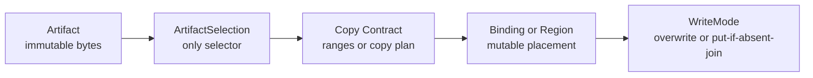
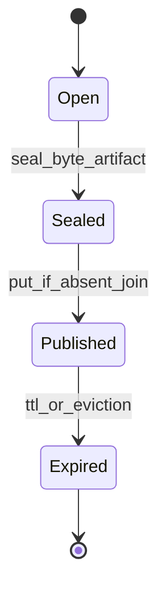
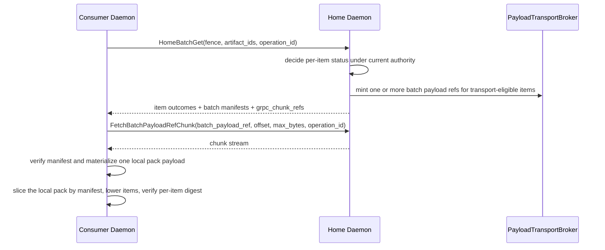
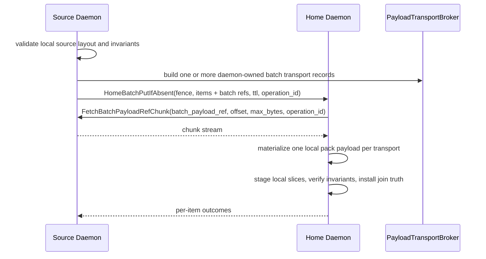
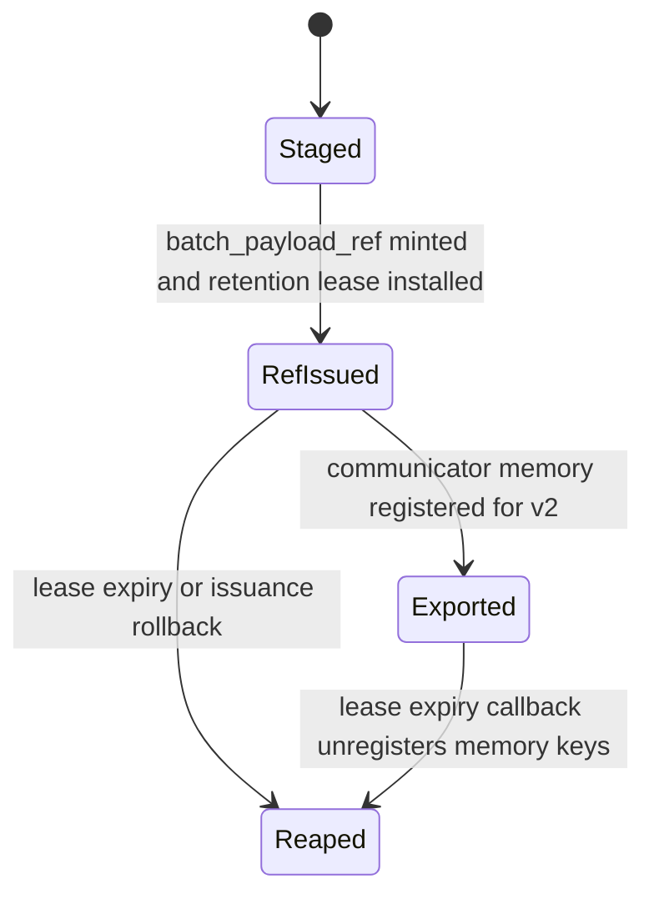
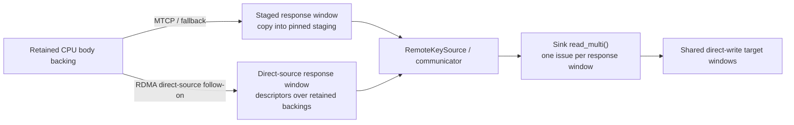
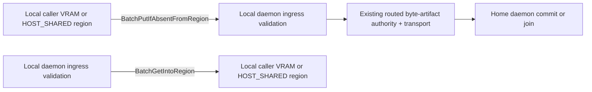
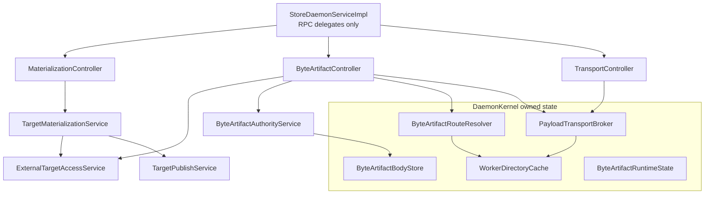

# Summary

TensorCast now has one canonical artifact-first runtime for both structured artifacts and routed byte artifacts.

The unified model is:

- `Artifact`: immutable bytes plus identity.
- `ArtifactSelection`: the only selection contract.
- `Binding` or registered region: mutable placement target.
- copy contract: canonical-byte or mapped-byte write ranges.
- `WriteMode`: overwrite or `PUT_IF_ABSENT_JOIN`.

`byte_artifact` is a profile, not a parallel runtime. The final daemon shape keeps routed byte-artifact authority,
local shared-region access, payload transport, and publication capabilities in separate modules with explicit trust
boundaries.

Engine-oriented alias policy and manifest-oriented integration guidance live in
`docs/designs/0102-engine-artifact-integration-and-high-cardinality-manifest-orchestration.md`; `0087` remains
authoritative for the artifact value model and routed byte-artifact runtime itself.

# Current Implementation Snapshot

As of 2026-04-26, the live implementation matches this design, with narrower
RDMA realization follow-ons still in progress:

- `StoreDaemonServiceImpl` delegates `Batch*`, `HomeBatch*`, `FetchPayloadRefChunk`, and `FetchBatchPayloadRefChunk`
  through controller entrypoints.
- `ByteArtifactController` owns byte-artifact batch ingress and home-authority orchestration.
- `MaterializationController` continues to own `MaterializeIntoTarget`, `MaterializeIntoMappedTarget`,
  `PublishTargetReplica`, and related artifact lifecycle RPCs.
- `TransportController` owns `FetchPayloadRefChunk` and `FetchBatchPayloadRefChunk` delegation on top of
  `PayloadTransportBroker`.
- `DaemonKernel` owns long-lived routed byte-artifact state: runtime state, body store, route resolver, payload
  transport broker, and shared worker directory cache.
- `ExternalTargetAccessService` is the shared local region boundary used by both materialization flows and
  byte-artifact ingress flows.
- `RegisterRegion(memory_kind=VRAM|HOST_SHARED)` is live, and byte-artifact batch ingress accepts `RegionRef`
  layouts over both memory kinds.
- `TargetPublicationScope`, `TargetPublicationRegistry`, `target_publication_token`, `PayloadRefScope`, and
  `BatchPayloadRefScope` are the live capability contracts.
- `BatchGetIntoRegionRequest` no longer exposes `preference` or `source_policy`.
- `HomeBatchGet` may now realize one transport either as a staged contiguous
  pack (`grpc_chunk_ref`, MTCP-compatible `communicator_source`, or fallback)
  or as a segmented `communicator_source` over retained-body export views for
  eligible RDMA packs.
- Remote `communicator_source` consume paths now diverge by transport
  realization on both get and put paths: eligible RDMA lowers remote pack
  slices directly from the opened source without a mandatory full-pack local
  mirror, while MTCP and staged fallback paths still materialize one full local
  pack payload per `transport_id` before per-item slicing.
- `HomeBatchPutIfAbsent` accepts batch transports on the put path and consumes
  eligible remote RDMA `communicator_source` transports without a home-daemon
  full-pack mirror.
- The put-side composite final-body staging cut is implemented for eligible
  `LAYOUT_AND_SIZE_ONLY` byte artifacts: the home daemon prepares unpublished
  retained body backings, lowers one remote pack source into a composite target
  layout, and lets the shared `0115` dataplane execute one batched direct-write
  materialization before authority join installation.
- The put-side source daemon now realizes eligible remote-home
  `HOST_SHARED`/`LAYOUT_AND_SIZE_ONLY` source-layout batch-set transports as
  segmented `communicator_source` exports over the original source spans. The
  contiguous staged-slab realization remains the fallback for strict digest,
  non-`HOST_SHARED`, capability-miss, and lifetime-gap cases.
- `BodyHandle` now exposes the export-view API used by source-side segmented
  communicator export.
- The remaining get-side RDMA follow-on is producer-side read-plan servicing:
  source-side CPU byte-artifact slices may still be copied from retained
  backing into pinned staged response buffers before the remote RDMA reads
  them.
- NodeAgent preserves structured `manifest`, `publish`, `hydrate`, and `evict_local` artifact results over
  `ExecutePlan`.

# Goals / Non-Goals

Goals

- Keep one artifact-first semantic model for weights, structured artifacts, and routed byte artifacts.
- Keep `ArtifactSelection` as the only selection envelope across SDK, daemon, NodeAgent, and plans.
- Keep routed byte-artifact truth off the Global Store per-blob hot path.
- Keep caller-accessible local region reads and writes inside one daemon-local safety boundary.
- Keep payload transport reusable and capability-scoped.
- Keep plan and NodeAgent artifact actions aligned with canonical `manifest/publish/hydrate/evict_local` semantics.

Non-Goals

- Move token-to-key mapping, request tables, or paged-attention semantics into TensorCast core.
- Introduce a generic artifact-runtime controller shared by every profile.
- Reintroduce Global Store as a per-blob catalog for `cgid:byte_artifact~...`.
- Treat byte-artifact durability as equivalent to model-artifact durability.

# Architecture & Interfaces

## 1. Unified runtime model



Normative rules:

- `Artifact` is the value layer.
- `ArtifactSelection` is the only selection contract used for routing, validation, and result identity.
- `Binding` or a caller-registered region is the placement layer.
- copy planning stays separate from semantic truth.
- `WriteMode` changes write semantics without creating a second object model.

## 2. Artifact profiles

### 2.1 Tensor-dict artifacts

Tensor-dict artifacts use the standard selection contract from `0078`:

- canonical selection, subset selection, and transform views are all encoded through `ArtifactSelection`,
- `logical_layout_hash` and `selection_hash` are derived from canonical or selected index bytes,
- daemon validation resolves selection once and reuses the resolved selection through the whole flow.

### 2.2 Byte artifacts

Byte artifacts are the routed high-cardinality profile used for paged KV-style caches and other opaque byte payloads.

Schema contract:

- exactly one tensor named `payload`,
- `payload.dtype == uint8`,
- `payload.shape == [byte_length]`.

Selection contract:

- canonical-only,
- full-selection-only,
- `view_id == ""`,
- `view_spec` absent,
- `tensor_names` omitted,
- `view_subset_hash` empty.

Fixed profile digests:

- `logical_layout_hash = sha256(utf8("tensorcast.byte_artifact.layout.v1\n")).digest()`
- `selection_hash = sha256(utf8("tensorcast.byte_artifact.selection.v1\n")).digest()`

Normative rules:

- byte-artifact selection identity must not depend on payload bytes, byte length, or any Global Store lookup,
- `Artifact.view(...)` and subset selection must be rejected for byte artifacts,
- SDK and daemon must share the same byte-artifact selection helper contract,
- `ArtifactProfileRegistry` is the daemon entrypoint for byte-artifact artifact-id validation, selection validation,
  normalized selection construction, shard derivation, and invariant validation.

## 3. Write modes and sealing boundary

TensorCast keeps one write model with two modes:

- `OVERWRITE`: used by binding swap and mapped or inplace overwrite paths,
- `PUT_IF_ABSENT_JOIN`: used by sealed byte-artifact publication.

Byte-artifact publication requires an explicit sealing boundary.



Normative rules:

- `Open` state is engine-owned mutable state and is not publishable.
- `Sealed` state is the immutable byte snapshot that may enter routed publish paths.
- only sealed byte artifacts may use `PUT_IF_ABSENT_JOIN`.

Verification modes for `PUT_IF_ABSENT_JOIN`:

- `BYTE_ARTIFACT_VERIFICATION_MODE_STRICT_SHA256`
- `BYTE_ARTIFACT_VERIFICATION_MODE_LAYOUT_AND_SIZE_ONLY`

Normative rules:

- the default mode for generic routed byte artifacts remains
  `BYTE_ARTIFACT_VERIFICATION_MODE_STRICT_SHA256`,
- `BYTE_ARTIFACT_VERIFICATION_MODE_LAYOUT_AND_SIZE_ONLY` exists for
  engine-owned logical byte artifacts whose `artifact_id` is the engine's
  canonical logical page identity and whose producers do not guarantee
  bitwise-identical payload bytes across repeated publications,
- `STRICT_SHA256` joins on:
  - `layout_id`,
  - `byte_length`,
  - `payload_digest_alg = "sha256"`,
  - `payload_digest_hex = sha256(payload_bytes).hexdigest()`,
- `LAYOUT_AND_SIZE_ONLY` joins on:
  - `layout_id`,
  - `byte_length`,
  - and the routed `artifact_id` itself,
- in `LAYOUT_AND_SIZE_ONLY`, `payload_digest_alg` and `payload_digest_hex`
  become optional per-item metadata:
  - when present they are advisory verification metadata and observability
    inputs,
  - when absent they must not block publication, existence, or retrieval,
  - and they must not become an implicit second equality channel beside the
    engine-owned logical `artifact_id`.

Multiple puts of the same logical byte artifact remain first-writer-wins:

- `PUT_IF_ABSENT_JOIN` never means upsert,
- the first successful routed claim for the current home epoch fixes the visible
  claim for that `artifact_id`,
- later `PUT_IF_ABSENT_JOIN` attempts with the same join key may adopt the
  existing claim, but must not rewrite the retained backing in place,
- later writers must not silently replace the previously published bytes even if
  their payload differs under `LAYOUT_AND_SIZE_ONLY`,
- a workflow that truly needs last-writer-wins or repair-by-rewrite must use an
  explicit overwrite or delete-and-reissue flow rather than a second
  `PUT_IF_ABSENT_JOIN`.

TTL rules:

- TTL extension is monotonic increasing,
- immortal entries remain immortal under join and touch unless explicitly evicted.

## 4. Identity, authority, and routing for `cgid:byte_artifact~...`

Recommended identity profile:

`cgid:byte_artifact~<namespace>~<engine>~<model_id_enc>~<model_version_enc>~<layout_id>~<engine_key_enc>`

Identity rules:

- the suffix after `cgid:` must satisfy the shared CGID grammar `[-._~A-Za-z0-9]`,
- segments are separated by `~`,
- arbitrary bytes or strings should use `b64u.<base64url_nopad(...)>`,
- SDK and C++ runtime paths must share one parser, validator, and test-vector set,
- `model_id_enc` identifies the logical model family, while `model_version_enc`
  identifies the concrete served model revision or checkpoint generation that
  produced the bytes,
- `layout_id` must bind the byte-level page serialization contract, including
  any format version, attention family, dtype or encoding contract, and page
  size,
- `engine_key_enc` must bind the engine-owned logical page identity and any
  rank-local shard qualifier required for correctness, such as TP or PP
  ownership,
- engine-owned logical byte artifacts must not encode run-local or host-local
  values such as `run_id`, `instance_id`, `daemon_id`, or machine identity into
  the routed `artifact_id`.

Authority split:

- Global Store is the authority for shard-home leases only,
- the current shard-home daemon is the authority for per-blob existence truth, first-writer invariants, and TTL.

Sharding:

- `shard_id = hash64(utf8(artifact_id)) % S`,
- `hash64` is `sha256(utf8(artifact_id)).digest()`, first 8 bytes interpreted as little-endian `uint64`,
- `S` is a cluster-wide shard count, defaulting to `4096` unless configured otherwise.

Fencing and route validity:

- every `HomeBatch*` request carries `RouteFence`,
- `RouteFence` includes `{shard_id, lease_generation, holder_daemon_id, routing_epoch}`,
- stale or mismatched fence values fail closed and return redirect information when available,
- cached body validity is scoped by shard, lease generation, and routing epoch,
- ambiguous route freshness degrades to per-item miss or unavailable outcomes instead of unproven hits.

Cluster-wide routing invariants:

- shard count,
- shard hash/version,
- inline payload threshold,
- lease TTL and keepalive policy,
- route staleness budget,
- worker-directory staleness budget,
- routing epoch,
- payload-transport policy,
- batch-transport protocol version and segmentation policy when enabled,
- digest enforcement behavior.

Capability-directory rules:

- `gateway_ingress_enabled` is an external-ingress role bit,
- `shard_home_eligible` gates shard-home acquisition eligibility,
- capability-directory flags are discovery and routing signals, not peer authentication.

## 5. RPC families and trust model

The runtime uses four distinct RPC classes.

### 5.1 External ingress authority RPCs

- `BatchExists`
- `BatchTouchTtl`

Rules:

- these are public ingress RPCs,
- non-local callers require `gateway_ingress_enabled=true`,
- results are outcome-first and per item.

### 5.2 Local-only placement adapters

- `BatchGetIntoRegion`
- `BatchPutIfAbsentFromRegion`

Rules:

- these RPCs remain loopback or UDS-only because they touch caller-accessible local shared regions,
- they validate `pid`, `device_uuid`, and `TargetLayout` through `ExternalTargetAccessService`,
- `BatchGetIntoRegionRequest` carries only `selections`, `target_layout`, `pid`, `device_uuid`, and optional
  `operation_id`,
- `BatchPutIfAbsentFromRegionRequest` carries item selections plus invariants or payload refs, `source_layout`, optional
  `ttl_ms`, `pid`, `device_uuid`, and optional `operation_id`,
- `preference` and `source_policy` are not part of the final `BatchGetIntoRegion` contract.

Current live implementation note:

- current region-backed byte-artifact ingress supports both `VRAM` and `HOST_SHARED`,
- `HOST_SHARED` widens only the local placement layer,
- it does not change routed authority, `RouteFence`, per-item outcome shape, or transport ownership.

### 5.3 Home-scoped fenced authority RPCs

- `HomeBatchExists`
- `HomeBatchGet`
- `HomeBatchPutIfAbsent`
- `HomeBatchTouchTtl`

Rules:

- these are inter-daemon authority RPCs,
- they do not accept caller PID, target layout, or direct caller-region access,
- they are governed by `RouteFence`, not by `gateway_ingress_enabled`,
- current live implementations may answer successful large items through inline payload, singular `payload_ref`, or
  `batch_payload_slice` plus `BatchPayloadTransport`,
- batch-native transport changes only the payload-movement encoding; it does not change per-item authority outcomes.

### 5.4 Inter-daemon transport RPC

- `FetchPayloadRefChunk`
- `FetchBatchPayloadRefChunk`

Rules:

- transport authorization comes from typed signed capability envelopes:
  `payload_ref` for singular payloads and `batch_payload_ref` for batch payload transports,
- it is not an ingress RPC and is not gated by `gateway_ingress_enabled`,
- it carries consume-side `operation_id` when the capability requires operation binding.

### 5.5 Implemented delta: batch-native inter-daemon byte transport

This section describes the current implementation state.

The narrow goal is unchanged:

- keep page-level `byte_artifact` identity unchanged,
- keep shard-home lease, `RouteFence`, and home-authority truth unchanged,
- keep per-item status, digest, and TTL semantics unchanged,
- change only how large inter-daemon byte payloads move after authority has already made a per-item decision.

The transport family is live today:

- `v1 grpc_chunk_ref` is implemented and remains the required batch-native fallback,
- `v2 communicator_source` is implemented and is the preferred realization when both peers advertise protocol
  version `>= 2` and host-memory export is enabled,
- the legacy per-item `payload_ref` path still exists as the fail-closed compatibility path when batch transport is
  disabled, unsupported, or cannot be issued for a given pack.

The remaining follow-ups are narrower than the original design delta:

- current `v2 communicator_source` already supports segmented retained-body
  export on eligible RDMA get paths, and current RDMA consume paths already
  avoid the old mandatory full-pack local mirror through the shared direct-write
  dataplane,
- current `v1 grpc_chunk_ref` consumption and MTCP-compatible
  `communicator_source` realizations still materialize one full local pack
  payload per transport before local slicing,
- current RDMA producer servicing still copies CPU source slices into pinned
  staged response windows before remote reads, and those response windows are
  still bounded by staged-flow credit rather than descriptor/control limits,
- session-scoped `StreamingPinnedBuffer` reuse remains deferred and is not part
  of the current implementation.

This section should be read together with the existing split in the repository:

- ordinary artifact replica transfer already uses the communicator-backed daemon P2P data plane over RDMA or MTCP,
- routed `byte_artifact` uses home-authority `HomeBatch*` plus capability-scoped transport records,
- batch-native routed transport now keeps that authority split intact while replacing the old one-transport-per-artifact
  shape with one transport object per pack.

#### 5.5.1 Semantic hard boundaries

Batch-native transport must preserve these invariants:

1. `HomeBatch*` remains the only authority decision point for routed byte artifacts. Batch transport is a byte movement
   optimization after authority, not a second authority dialect.
2. `BatchExists`, `HomeBatchExists`, `PutIfAbsentJoin`, claim truth, visibility truth, and serving truth keep the same
   meaning defined by `0087` and `0090`.
3. Transport failure must not rewrite claim truth. A failed remote fetch may fail the current operation, but it must not
   implicitly delete or reopen the routed claim.
4. Per-item outcomes remain explicit. A mixed batch must still report which artifacts succeeded, missed, conflicted, or
   failed verification.
5. Digest, size, and invariant checks remain per artifact. Batch transport must not replace per-item verification with a
   single opaque batch checksum.
6. A batch transport object must never mix multiple directions, multiple issuer daemons, or multiple consumer
   `operation_id` bindings.
7. A batch transport object must never cross `RouteFence` boundaries. One object is scoped to one authority epoch.

#### 5.5.2 Transport family, not one realization

The live transport family introduces a batch-scoped transport object instead of overloading singular `payload_ref`.

Current proto shape:

```proto
message BatchPayloadEntry {
  string artifact_id = 1;
  uint64 offset = 2;
  uint64 length = 3;
  string digest_alg = 4;
  string digest_hex = 5;
}

message BatchPayloadManifest {
  repeated BatchPayloadEntry entries = 1;
  uint64 total_size = 2;
}

message BatchPayloadCommunicatorSource {
  bytes batch_payload_ref = 1;
  uint32 protocol_version = 2;
  string producer_daemon_id = 3;
  string consumer_daemon_id = 4;
  string producer_host = 5;
  uint32 producer_port = 6;
  repeated string remote_memory_keys = 7;
  repeated uint64 buffer_sizes = 8;
  string remote_endpoint_id = 9;
  string local_endpoint_id_hint = 10;
  BatchPayloadMemoryLocation memory_location = 11;
  uint64 total_payload_bytes = 12;
}

message BatchPayloadGrpcChunkRef {
  bytes batch_payload_ref = 1;
  uint32 protocol_version = 2;
}

message BatchPayloadTransport {
  string transport_id = 1;
  BatchPayloadManifest manifest = 2;
  oneof transport_kind {
    BatchPayloadGrpcChunkRef grpc_chunk_ref = 3;
    BatchPayloadCommunicatorSource communicator_source = 4;
  }
}

message BatchPayloadSlice {
  string transport_id = 1;
  uint64 offset = 2;
  uint64 length = 3;
}
```

Current additive request and response evolution:

- `HomeBatchGetResponse` may carry repeated `BatchPayloadTransport`, and successful items may refer to one transport via
  `BatchPayloadSlice`.
- `HomeBatchPutIfAbsentRequest` may carry repeated `BatchPayloadTransport`, and request items may refer to one transport
  via `BatchPayloadSlice`.
- existing `inline_payload` and per-item `payload_ref` remain valid fallback encodings.

Normative rules:

1. The manifest is transport metadata only. It does not create a new artifact identity, content identity, or backing
   identity.
2. `BatchPayloadManifest` is the explicit item table used for scatter or gather; transport bytes are interpreted only
   through this manifest.
3. Each manifest entry corresponds to exactly one artifact payload and keeps one exact `{artifact_id, offset, length,
   digest}` tuple.
4. A response or request may carry multiple transports. Batching is per remote-home bucket, and segmentation is still
   allowed by size, item count, or staging constraints.
5. Current realizations still differ by direction and transport:
   - `v1 grpc_chunk_ref` materializes one local payload buffer per transport,
   - get-side RDMA `v2 communicator_source` already provides a reusable
     remote slice loader over one open remote pack through the shared
     direct-write path,
   - put-side RDMA `v2 communicator_source` uses the same no-mirror
     remote-slice consume shape for eligible direct-write-capable sources,
   - MTCP or staged-fallback `v2 communicator_source` paths still mirror one
     full pack into local host memory before serving subsequent item slices
     from that local mirror.
6. A per-item outcome or request item must choose exactly one payload encoding family at a time:
   `inline_payload`, singular `payload_ref`, or `batch_payload_slice`.
7. Only items whose semantic authority outcome is success may carry `batch_payload_slice`; `MISS`, conflict, and
   authority-side rejection outcomes must not be encoded through the batch manifest.
8. `BatchPayloadTransport` is a transport-family envelope. The current realizations are `grpc_chunk_ref` and
   `communicator_source`, and later optimizations must not change routed byte-artifact authority semantics or per-item
   result shape.

#### 5.5.3 Current batch payload transport capability family

Per-item `PayloadRefScope` is intentionally singular:

- it binds one `artifact_id`,
- it binds one `payload_size`,
- it binds one digest,
- it is a clean front door for one verified payload.

Batch transport needs different signed truth:

- one `transport_id`,
- one `total_payload_bytes`,
- one manifest digest,
- one direction,
- one consume-side `operation_id`,
- and a typed statement that the capability covers a manifest of many entries instead of one artifact.

Current capability family:

- `BatchPayloadRefScope`
- `CAPABILITY_AUDIENCE_BATCH_PAYLOAD_REF`
- `FetchBatchPayloadRefChunk`

Current `BatchPayloadRefScope` fields:

- `transport_id`
- `payload_size`
- `direction`
- `operation_id`
- `manifest_digest_hex`
- `consumer_daemon_id`

Normative rules:

1. `batch_payload_ref` is always a signed capability envelope over `BatchPayloadRefScope`; expiry and issuer identity
   live in the outer `CapabilityTokenEnvelope`, not inside the scope body.
2. The consumer must verify that the supplied manifest matches the signed digest before using any entry offsets. The
   current implementation always computes and signs `manifest_digest_hex` at issuance time.
3. The capability is single-consumer when `consumer_daemon_id` is set, and operation-scoped when `operation_id` is
   set.
4. The current scope does not sign `producer_daemon_id` or communicator endpoint metadata. `communicator_source` carries
   producer endpoint information, and the broker validates structural consistency, consumer binding, and payload-size
   consistency at open time.
5. Per-entry payload digest verification remains item-scoped. If an entry omits digest fields, the consumer still
   validates `{artifact_id, offset, length}` boundaries and transport success, but does not compute an additional
   content hash for that item.
6. Batch capability TTL, fetch deadline, cleanup, and batch-size controls live under the same payload-transport policy
   family as per-item transport.
7. Rollout still fails closed on mixed support. A daemon emits batch transport only when peer compatibility and routing
   epoch permit it.

#### 5.5.4 Implemented realizations and current selection policy

`v1 grpc_chunk_ref`

- Implemented.
- Introduces `FetchBatchPayloadRefChunk` as a new inter-daemon transport RPC rather than overloading
  `FetchPayloadRefChunk`.
- Stages one daemon-owned contiguous slab per pack and exposes that slab through `BatchPayloadGrpcChunkRef`.
- The current consume-side implementation fetches the full pack into one local payload buffer per `transport_id`, then
  serves subsequent item slices from that local payload.
- It remains subject to gRPC frame sizing and `max_chunk_bytes`, so it is an optimization of the legacy path rather
  than the final cross-daemon data plane.

`v2 communicator_source`

- Implemented.
- Keeps the same `BatchPayloadTransport` envelope and manifest semantics, but realizes bytes through communicator export
  descriptors instead of a transport RPC payload stream.
- The source shape is now transport-dependent:
  - eligible RDMA get paths may export one logical pack as segmented retained
    body views without building a daemon-owned pack slab first,
  - MTCP-compatible and fallback paths may still export a staged host-memory
    pack.
- `BatchPayloadCommunicatorSource` is the serializable control-plane descriptor. The broker lowers it into a runtime
  `RemoteKeySource` backed by the shared communicator rather than using `P2PSource` itself as the wire schema.
- The current remote consume path is also transport-dependent:
  - RDMA get lowers item slices directly from the remote source into the
    shared batched direct-write path without a mandatory full-pack local
    mirror,
  - RDMA put lowers item slices directly from the remote source into per-item
    `SourceSlice` loaders and home staging without a mandatory full-pack local
    mirror,
  - MTCP and staged fallback paths still mirror one full pack into local host
    memory before per-item slicing.
- The remaining accepted RDMA follow-on below is producer-side servicing:
  source-backed response windows still use staged pinned buffers rather than
  direct-readable retained CPU backings.

Current selection rules:

1. Default daemon configuration enables batch transport with protocol version `2`, which means `v2 communicator_source`
   is preferred and `v1 grpc_chunk_ref` remains available as fallback.
2. `GetServerConfig` exposes:
   - `batch_transport_protocol_version`
   - `batch_payload_grpc_chunk_ref_enabled`
   - `batch_payload_communicator_source_enabled`
   - `batch_payload_host_memory_export_enabled`
   - `max_batch_payload_bytes`
3. A daemon that supports `v2 communicator_source` must still be able to speak `v1 grpc_chunk_ref` when the peer only
   advertises protocol version `1` or when communicator export cannot be used for the specific pack.
4. When peer capability, local export readiness, minimum TTL checks, or producer endpoint data do not permit
   `communicator_source`, the daemon falls back per pack to `grpc_chunk_ref`, and may fall back further to per-item
   `payload_ref` or inline payload when pack issuance itself fails.

#### 5.5.5 V1 get path



Get-path rules:

1. `HomeBatchGet` still decides per item whether the answer is `MISS`, `OK`, conflict, or unavailable before transport
   starts.
2. Only successful large items may be packed into batch transport objects. Small items may remain inline.
3. The home daemon may choose any stable packing order; order is not semantic because items are re-identified by the
   manifest.
4. The current `v1 grpc_chunk_ref` implementation resolves one `batch_payload_ref` per pack and materializes the full
   pack into one local payload buffer per `transport_id` before per-item slicing. It does not yet stream directly into
   the target layout without an intermediate full-pack buffer.
5. `BatchGetIntoRegion` currently groups apply work by `transport_id`, so one pack becomes one apply work unit and the
   same local pack payload can be reused across all items that reference that transport.
6. When target ranges do not overlap, the controller currently executes those apply work units in parallel across the
   byte-artifact apply pool. Final success remains item-scoped even though pack setup is shared.
7. Final `BatchGetIntoRegion` success is still determined per item after digest verification and region fill complete.

#### 5.5.6 V1 put path



Put-path rules:

1. Source-side batching is grouped by remote home bucket first; a transport pack must not mix different home daemons.
2. The source daemon must not expose caller-accessible local regions as a
   remote fetch source unless it owns a transport-lifetime lease, pin, or
   equivalent keepalive that survives the local ingress RPC and prevents the
   exported bytes from being recycled before transport release.
3. Before issuing a batch capability on the put path, the source daemon must
   adopt the bytes into daemon-owned transport-lifetime state. That state may
   be a staged copy, or for an eligible `HOST_SHARED` no-pack path it may be
   the original region span plus region lease, slot pin or generation token,
   communicator export registration, and cleanup ownership.
4. The current implementation realizes eligible `HOST_SHARED` source-layout
   packs as segmented communicator exports and keeps the contiguous staged slab
   as the fallback realization. The wire contract does not depend on either
   physical choice.
5. The home daemon still verifies each item's invariant and still installs routed join truth per artifact.
6. The home-daemon consume path is transport-dependent. Eligible remote RDMA
   `communicator_source` sources are consumed as per-item remote `SourceSlice`
   loaders without a local full-pack mirror; non-direct communicator sources
   and `grpc_chunk_ref` fallbacks still read one full pack per transport, then
   stage or reuse per-item slices from that local pack payload before join
   installation.
7. When the consumed pack slice is already available as local host bytes, the home daemon currently prefers a
   one-pass fast CPU staging path that copies into final backing while computing the required content digest, instead
   of rereading the bytes through the generic loader pipeline.
8. `BatchPutIfAbsentFromRegion` currently runs shard-local put tasks concurrently up to
   `min(shard_count, batch_get_apply_threads)`. Each task stages, emits, and dispatches its own local or remote-home
   request as soon as that shard is ready; there is no global "all shards must be packed before any dispatch" barrier.
9. Partial success remains legal. One failed item in a pack must not force unrelated items in the same pack to be
   reported as semantic failure if their bytes verified and their join succeeded.

#### 5.5.6a Implemented put-side no-mirror consume

The put path is directionally symmetric with get after authority routing has
selected a remote home: the source daemon owns a logical pack byte space, while
the home daemon is the consumer that stages each successful item into retained
home backing before installing `PUT_IF_ABSENT_JOIN` truth. The first put-side
realization step removes only the home daemon's mandatory remote full-pack
mirror. It does not change source-side pack construction, manifest semantics,
home authority, or per-item join behavior.

Eligibility rules:

1. The candidate is a `HomeBatchPutIfAbsent` item with
   `batch_payload_slice.transport_id` referring to a `v2 communicator_source`
   transport opened with `PAYLOAD_REF_DIRECTION_PUT`.
2. The opened source is remote from the home daemon and resolves to a
   non-null `SeekableSource`.
3. First-cut executable eligibility requires
   `SeekableSource::supports_direct_write_at() == true`. The
   `supports_batched_direct_write_at()` bit is logged for parity with get-side
   composite execution and future put-side vectored work, but by itself is not
   the first-cut per-item `SourceSlice` eligibility signal unless the source
   also advertises scalar `read_into_at(...)` support.
4. Manifest lookup must prove that the item slice exactly matches one
   `{artifact_id, offset, length}` entry in the transport manifest before any
   loader is constructed.

Direct consume realization:

1. The home daemon must not call `mirror_seekable_source_payload(...)` for an
   eligible remote source.
2. The home daemon builds a per-item `SourceSlice` over the opened remote
   source and wraps it in `SeekableSourceLoader`.
3. The item keeps `source_kind = kP2P` and is staged through
   `BodyBackingManager::stage_body(...)`, preserving the existing body
   placement, invariant validation, digest, and verified-content output
   semantics.
4. The direct-slice loader holds the resolved source through shared ownership
   until item staging completes; there is no local full-pack owner buffer and
   no `LocalByteSpan` pointing into a mirrored pack.
5. This first cut may still execute one home staging operation per item. It is
   not the put-side composite or vectored direct-write phase, and it is not
   required to remove all per-item lowering, `StreamingPinnedBuffer`, or
   final-backing copy costs.

Fallback rules:

1. Remote `communicator_source` paths that do not advertise scalar direct-write
   support keep the current `full_pack_mirror` realization.
2. `grpc_chunk_ref` keeps the current full-pack fetch realization.
3. Same-daemon or otherwise local `communicator_source` paths keep local source
   slicing and do not count as remote no-mirror RDMA validation.
4. Fallback must be pre-issue. After a direct-slice staging attempt has begun,
   the controller must not silently retry the same item through full-pack
   mirror because the staging path may already have performed partial writes
   into transient backing. Such failures remain current-operation item
   failures and must not rewrite routed truth.

Correctness and authority rules:

1. `HomeBatchPutIfAbsent` remains the only authority point that installs
   first-writer routed truth. Direct-slice consumption is only a byte-movement
   realization.
2. A failed transport open or manifest validation failure affects only items
   that reference the invalid transport or slice, subject to existing
   batch-scoped capability validation rules.
3. If direct-slice staging fails for one item, the item must not be passed to
   `ByteArtifactAuthorityService::batch_put_if_absent(...)`; unrelated items
   in the same request or different transports may still complete.
4. Digest and verification behavior remains item-scoped. The home daemon still
   validates the item invariant against the staged body descriptor before join
   installation.
5. Implementation may serialize or parallelize direct-slice staging per
   transport. The semantic contract requires explicit-offset reads and correct
   lifetime ownership, not a particular scheduling order.

Observability rules:

1. Opening a put-side remote `communicator_source` must continue to log
   source direct-write and batched direct-write capability.
2. Eligible direct-slice consumption must emit a read-mode log such as
   `byte_artifact.home_batch_put_if_absent_transport_read_mode` with
   `read_mode=direct_remote_slice`, `realization=source_slice_loader`,
   `mirror_ms=0`, and `subsequent_item_slices_local=false`.
3. Fallback mirror consumption must continue to emit
   `byte_artifact.home_batch_put_if_absent_transport_mirror` with
   `realization=full_pack_mirror`.
4. The home summary must distinguish remote direct-slice transports and items
   from remote full-pack mirror transports and bytes so benchmark analysis can
   prove that `remote_mirror_count` and `remote_mirror_bytes` collapse to zero
   on the intended RDMA put path.

#### 5.5.6b Accepted put-side composite final-body stage

After the no-mirror consume cut, the remaining put-side batch-set cost is
per-item home staging. The accepted next realization is to stage one eligible
remote pack directly into the unpublished final retained body backings for all
eligible items in that transport, using the shared composite/vectored
direct-write execution contract from `0115`.

Scope and eligibility:

1. This path applies only inside `HomeBatchPutIfAbsent` after the home shard,
   fence, route epoch, request operation, transport capability, and manifest
   slice validation have already succeeded.
2. The first implementation is limited to remote `v2 communicator_source`
   transports opened with `PAYLOAD_REF_DIRECTION_PUT` whose resolved
   `SeekableSource` is non-null and advertises
   `supports_batched_direct_write_at() == true`.
3. The group is initially per `transport_id`: all composite items share one
   opened source and one transport manifest. Ineligible items in the same RPC
   continue through the 5.5.6a per-item direct-slice path or the existing
   full-pack fallback path.
4. Each item must use
   `BYTE_ARTIFACT_VERIFICATION_MODE_LAYOUT_AND_SIZE_ONLY`. Modes that require
   payload digest verification, including the default strict SHA256 mode, stay
   on the existing per-item staging path until a later stream or post-write
   digest phase is accepted.
5. The resolved body policy must produce CPU final backings that can be exposed
   as writable target-layout storage for the shared materialization dataplane.
   GPU-only, non-direct-writable, zero-length, or otherwise unsupported target
   shapes are pre-issue fallback cases.
6. Duplicate artifact ids or duplicate join keys inside one composite group are
   pre-issue fallback cases until a batch-level de-duplication policy is
   explicitly defined. This keeps authority join and cleanup semantics
   identical to the existing item-scoped path.

Body staging seam:

1. `BodyBackingManager` needs an internal batch staging seam such as
   `stage_bodies_composite(...)`, or an equivalent
   `prepare_body_stage_targets(...)` plus `finalize_staged_bodies(...)` split.
2. That seam owns final body backing preparation. It creates one unpublished
   retained backing per item, with the same logical body identity,
   `BodyBackingIntent`, `ResolvedStorePolicy`, stable-retention admission, and
   `BodyHandle` lifetime rules that single-item `stage_body(...)` uses.
3. Prepared bodies are not routed truth. They are transient unpublished
   candidates until `ByteArtifactAuthorityService::batch_put_if_absent(...)`
   accepts the corresponding item.
4. The first implementation may expose one all-in-one
   `stage_bodies_composite(...)` API that prepares, materializes, finalizes,
   and cleans up on failure. A later split is allowed if tests need finer
   control over pre-issue preparation.

Composite mapping semantics:

1. The source byte space is the transport pack manifest byte space. Each item
   contributes exactly one source slice
   `{source_index=0, src_offset=manifest.offset, length=manifest.length}`.
2. The target byte space is a synthetic concatenation of the unpublished final
   body backings in composite item order. Item `i` owns target range
   `[cursor_i, cursor_i + invariant.byte_length)`, and the backing storage for
   that range must have exactly that length.
3. The `ByteRangeMap` uses `total_bytes=sum(item.byte_length)`,
   `num_sources=1`, and one segment per item mapping the source pack slice to
   the corresponding composite target range. `mapping.total_bytes` is the
   composite target byte count, not the remote pack's total advertised size.
4. The `IntoTargetLayout` storages are the final body backing writable spans.
   Stable local backing metadata may be attached when the backing manager can
   prove the storage is daemon-managed and long-lived enough for the `0115`
   direct-write grant, but this metadata remains local placement state and not
   routed artifact identity.
5. The controller calls the shared materialization seam with one source vector
   entry, the composite `ByteRangeMap`, `source_kind=kP2P`, and a
   transport-scoped operation hint. The expected fast path is
   `readv_into_at(...)` / `ReadPlan` / RDMA vectored direct-write, not a
   byte-artifact-private communicator API.

Verification, authority, and cleanup:

1. For `LAYOUT_AND_SIZE_ONLY`, successful composite materialization produces
   the same per-item `StageResult` shape as `stage_body(...)`: descriptor,
   observation, `BodyHandle`, `VerifiedContentDescriptor`, verification
   record, and backing identity. Payload digest fields remain advisory and
   must not block publication.
2. Each finalized item still runs
   `validate_invariant_body_descriptor(...)` through
   `ByteArtifactAuthorityService::batch_put_if_absent(...)`; composite staging
   does not install authority truth by itself.
3. Conflict, duplicate-writer, invalid-artifact, or invariant failures after
   finalization retire the corresponding unpublished body handle using the
   existing authority cleanup path.
4. If preparation, capability validation, policy resolution, target layout
   construction, or mapping validation fails before the composite dataplane is
   issued, the controller may fall back to the per-item 5.5.6a path for the
   affected items.
5. Once the composite materialization has crossed the `0115` issue boundary,
   hidden full-pack mirror or per-item staged fallback is forbidden. A
   post-issue failure marks the affected composite items failed and retires all
   prepared body handles that were not installed.
6. Partial success is item-scoped only after composite materialization
   succeeds. A composite execution failure before per-item finalization fails
   the whole composite group because individual final backings may have been
   partially dirtied.

Observability rules:

1. Eligible composite execution must log a put-side apply summary such as
   `byte_artifact.home_batch_put_if_absent_transport_apply_summary` with
   `read_mode=batched_direct_write`,
   `materialize_mode=single_source_composite`,
   `stage_mode=composite_final_body`,
   `batched_direct_write=true`, `source_count=1`, `mapping_segments`,
   `item_count`, `item_bytes`, `transport_payload_bytes`, and `mirror_ms=0`.
2. Pre-issue fallback must log a bounded `fallback_reason` and preserve the
   existing `read_mode=direct_remote_slice` or `full_pack_mirror` records so
   benchmarks can distinguish no-mirror scalar staging from composite staging.
3. Home summaries should add composite counters for transport count, item
   count, byte count, materialization calls, batched-direct-write calls,
   fallback count, fallback items, and cleanup/retire count, while retaining
   the existing remote mirror and direct-slice counters.
4. Expected RDMA SGLang KV evidence is: source batch-set packs still show
   `mode=staged_slab`, home full-pack mirror remains zero, eligible home
   transports move from `read_mode=direct_remote_slice` to
   `read_mode=batched_direct_write`, and `stage_loader_count` for eligible
   layout-and-size items drops toward zero because per-item
   `SeekableSourceLoader` staging is bypassed.

#### 5.5.6c Accepted put-side source no-pack segmented export

After composite final-body staging, the remaining batch-set transport copy is
on the requester/source daemon: `BatchPutIfAbsentFromRegion` stages each
remote-home source-layout item into a transient forwarding body and then packs
those bodies into one contiguous host slab before issuing the
`communicator_source`. The accepted Step-3 realization removes that put-side
full-pack slab for eligible `HOST_SHARED` source-layout batches.

Scope:

1. This is a source-daemon optimization for remote-home
   `BatchPutIfAbsentFromRegion`. It does not change `HomeBatchPutIfAbsent`,
   routed authority, shard fencing, per-item outcomes, or the Phase-9
   composite final-body target path.
2. The home daemon still receives the same `BatchPayloadTransport` shape: a
   manifest plus a `v2 communicator_source` opened with
   `PAYLOAD_REF_DIRECTION_PUT`. The physical source may be a segmented export
   over original source-layout spans rather than a staged slab.
3. Same-home puts, inline payloads, per-item `payload_ref` inputs, VRAM source
   layouts, and transports that cannot prove source lifetime keep the existing
   staging and fallback behavior.

Logical planning semantics:

1. Logical pack planning remains manifest-first. Each admitted item contributes
   exactly one `BatchPayloadManifest` entry with the same `{artifact_id,
   offset, length, digest}` contract used by staged packs.
2. Manifest offsets define a concatenated logical pack byte space. They do not
   require the source daemon to allocate one contiguous physical slab.
3. The first no-pack cut should admit `LAYOUT_AND_SIZE_ONLY` source-layout
   items. Modes that require the source daemon to compute or prove a payload
   digest before home publication remain on the staged path until streaming or
   post-write digest support is designed.
4. Pack grouping remains per remote home daemon and per shard task. A no-pack
   pack must not mix different home daemons, mixed source kinds, or items whose
   lifetime cannot be held by the same transport-lifetime contract.

Eligibility:

1. The target home is remote from the source daemon.
2. The peer advertises `v2` batch transport and segmented communicator export;
   the local `PayloadTransportBroker` has segmented communicator export
   enabled; and the local producer endpoint has a usable P2P port.
3. Every admitted entry comes directly from the validated `source_layout`.
   Entries that already require inline bytes, per-item `payload_ref`, or a
   transient `BodyHandle` are excluded from the no-pack group.
4. The source layout is pure CPU `HOST_SHARED`. `VRAM`, mixed memory kinds, and
   non-exportable host mappings fall back before transport issue.
5. Each source-layout item resolves to a bounded exportable span whose length
   exactly matches the manifest entry and the put invariant byte length.
6. Allocator-backed `HOST_SHARED` regions require `slot_index` and
   `slot_generation` on every admitted offset, plus a successful slot pin or
   equivalent generation-validated keepalive that prevents slot reuse until the
   batch transport is safe to release. Missing, stale, or unpinnable tokens are
   pre-issue fallback reasons.
7. Scratch-slab `HOST_SHARED` regions require a daemon-managed region lease
   and an ownership or immutability proof that the source bytes cannot be
   rewritten before transport release. If the current caller contract cannot
   prove that lifetime, the controller must use the staged path.
8. Segment count, payload bytes, control-plane size, and remote-key count must
   stay within the existing batch payload limits and any communicator-specific
   descriptor budget.

Source export seam:

1. `ByteArtifactRegionLayout` should expose a region-source export view, or an
   equivalent `SegmentExportView` abstraction shared with `BodyExportView`,
   rather than forcing `BatchPutIfAbsentFromRegion` to create transient
   forwarding bodies.
2. A region-source export view must carry the CPU address range, length,
   `HOST_SHARED` class, region lease or attach keepalive, slot token and pin
   when applicable, memory location, communicator export registration or a
   registration request, and explicit unregister ownership.
3. `PayloadTransportBroker` should accept segmented source entries from either
   retained-body export views or region-source export views and concatenate
   their remote keys and buffer sizes into one logical
   `BatchPayloadCommunicatorSource`.
4. If the broker registers raw `HOST_SHARED` region spans for this transport,
   the batch record owns those registrations and must unregister them on issue
   failure or transport expiry. If a future region export view reuses a
   pre-existing export lease, that lease owns unregister and the batch record
   must hold only the keepalive. A first implementation should avoid mixing
   owned and externally owned registrations inside one batch record.

Home consume compatibility:

1. `RemoteKeySource` already interprets `remote_memory_keys[]` and
   `buffer_sizes[]` as a segmented logical byte space. A manifest offset maps
   through that concatenation in the same way whether the source is a staged
   slab or original `HOST_SHARED` segments.
2. Phase-9 home composite staging therefore does not need a new mapping model:
   it still maps manifest pack offsets into unpublished final body backing
   offsets and delegates materialization to the shared `0115` dataplane.
3. Same-daemon local slicing remains an implementation detail and is not the
   validation target for this RDMA no-pack path.

Fallback and failure rules:

1. Fallback to the current staged path must happen before issuing the segmented
   transport. The fallback path remains
   `stage_pending_body(kTransientForward)` plus `pack_batch_payload_entries`.
2. Pre-issue fallback covers peer capability misses, local config misses,
   missing P2P endpoint, non-`HOST_SHARED` source layout, mixed source kinds,
   strict digest, missing or unpinnable allocator slot tokens, scratch lifetime
   uncertainty, segment-budget overflow, and export-registration failure.
3. After a segmented no-pack transport has been issued, the controller must not
   silently retry the same operation through a staged slab using the same
   possibly mutable source bytes. The current operation should fail affected
   items using existing transport or RPC failure semantics; an upper-layer
   retry may submit a fresh request.
4. Transport keepalives must outlive remote reads and be released only through
   the broker's batch-record expiry or an equivalent explicit release path.

Observability rules:

1. Eligible no-pack source realization should log
   `byte_artifact.batch_put_if_absent_from_region_pack_realization` with a
   distinct mode such as `mode=segmented_region_export`, `staged_slab=false`,
   `source_realization_mode=source_layout_host_shared`, `host_region_class`,
   `pack_count`, `item_count`, `payload_bytes`, `source_segments`,
   `remote_keys`, and registration ownership.
2. Pre-issue fallback should log a bounded reason such as
   `peer_lacks_segmented_export`, `local_segmented_export_disabled`,
   `producer_endpoint_unavailable`, `not_source_layout`, `not_host_shared`,
   `vram_source`, `slot_token_missing`, `slot_pin_unavailable`,
   `slot_generation_mismatch`, `scratch_lifetime_unproven`,
   `segment_budget_exceeded`, `export_registration_failed`, or
   `mixed_source_kind`.
3. The put summary should separately report staged-slab pack counts and bytes
   versus segmented no-pack export counts and bytes. On the intended SGLang KV
   path, staged batch-set pack bytes should collapse to zero while Phase-9 home
   composite logs remain present.

Phase-10 implementation status, first cut accepted on 2026-04-27:

1. `ByteArtifactRegionLayout::open_host_shared_source_span(...)` is the
   source-layout export seam. It admits only daemon-managed `HOST_SHARED`
   items with a live region keepalive, rejects zero-length or non-host spans,
   and requires allocator-backed offsets to carry both `slot_index` and
   `slot_generation`. There is still no separate allocator slot-pin API; the
   accepted first cut relies on the validated source-layout token plus the
   daemon-managed region keepalive while the synchronous put RPC is in flight.
2. `PayloadTransportBroker::issue_batch_payload_communicator_export(...)` now
   accepts raw `HOST_SHARED` region-source segments, registers those CPU spans
   with the communicator, stores the region keepalives in the batch transport
   record, and marks the remote keys as broker-owned so expiry and failure
   cleanup unregister them.
3. Remote-home `BatchPutIfAbsentFromRegion` admits `LAYOUT_AND_SIZE_ONLY`
   source-layout items into this no-pack path when the peer advertises v2
   segmented communicator export and the local P2P endpoint is usable. Strict
   digest modes, non-`HOST_SHARED` sources, missing tokens, capability misses,
   and export failures still fall back before issue to
   `stage_pending_body(kTransientForward)` plus `pack_batch_payload_entries`.
4. The home daemon path is unchanged from Phase 9: the segmented source-layout
   export still appears as one logical `RemoteKeySource` pack, and
   `HomeBatchPutIfAbsent` applies it through composite final-body staging and
   batched direct-write.
5. Validation run
   `20260427-132749_tensorcast_tp2_workers2_prompts10` showed source worker
   `worker_00` emitted `364` `mode=segmented_region_export` pack realization
   records for `5145` items / `21579694080` bytes, with
   `remote_batch_pack_count=0` and `remote_batch_pack_bytes=0`; home worker
   `worker_01` still emitted `364`
   `home_batch_put_if_absent_transport_apply_summary` records with
   `read_mode=batched_direct_write`,
   `materialize_mode=single_source_composite`, and no full-pack mirror.

#### 5.5.7 Implemented v2 communicator-backed realization

`v2 communicator_source` is the current communicator-backed realization. It moves routed byte-artifact remote transport
toward the existing ordinary-artifact communicator data plane without reviving the Global Store per-blob hot path.

Current control-plane schema for `BatchPayloadCommunicatorSource`:

- `batch_payload_ref`
- `protocol_version`
- `producer_daemon_id`
- `consumer_daemon_id`
- `producer_host`
- `producer_port`
- `remote_memory_keys[]`
- `buffer_sizes[]`
- `remote_endpoint_id`
- optional `local_endpoint_id_hint`
- `memory_location`
- `total_payload_bytes`

Rules:

1. `v2` still begins at `HomeBatch*`; communicator is a data-plane realization, not a new routing or authority owner.
2. `BatchPayloadCommunicatorSource` is a serializable control-plane descriptor, not a wire-serialized `P2PSource`.
   The broker currently lowers it into a runtime `RemoteKeySource` backed by the shared communicator.
3. Current `v2` support is intentionally narrow: the controller emits only host-memory exports. The proto already has a
   `GPU_VRAM` enum value for future extensions, but the live controller path does not emit VRAM-backed packs.
4. The producer pack defines one contiguous logical byte space over full byte-artifact payloads. Each manifest entry
   owns exactly one whole-artifact slice `{offset, length}` inside that pack byte space.
5. Current producer `v2` realizations are transport-dependent:
   - eligible RDMA get paths may export one logical pack as segmented retained
     body views,
   - eligible RDMA put paths may export one logical pack as segmented
     `HOST_SHARED` source-layout views once the no-pack source realization in
     5.5.6c is implemented,
   - MTCP-compatible and fallback paths may still realize one staged host pack.
6. Current get-side remote `v2` consume paths open one communicator source per
   `transport_id`:
   - on RDMA get, item slices lower directly from that remote source into the
     shared `0115` batched direct-write path without a mandatory full-pack
     local mirror,
   - on MTCP or staged fallback paths, the consumer still mirrors one full
     pack into local host memory before per-item slicing,
   - local same-daemon communicator packs can still serve source slices
     directly.
   Put-side home consume matches this no-mirror RDMA shape for eligible
   direct-write-capable sources as described in 5.5.6a.
7. Semantic success remains item-scoped and whole-artifact-scoped. `v2` does not introduce sub-artifact success,
   partial artifact visibility, or sub-artifact digest semantics.
8. `v2` does not require per-pack Global Store transport sessions. Peer addressability and export descriptors come from
   `BatchPayloadCommunicatorSource`, the shared communicator, and worker-directory resolution.
9. Verification remains manifest-first. `v2` uses the signed `batch_payload_ref` manifest digest plus per-entry digests
   when present; it does not require a full-pack payload hash.
10. `v1 grpc_chunk_ref` and legacy per-item `payload_ref` remain valid fallbacks beside `v2`.

#### 5.5.8 Failure isolation and verification

Batch transport must preserve failure granularity even when the wire movement is shared.

Rules:

1. Manifest verification is batch-scoped. If the consumer cannot validate the manifest against the signed
   `BatchPayloadRefScope`, all items that reference that batch transport fail the current operation because their
   offsets are untrusted.
2. The signed batch capability currently binds `transport_id`, `payload_size`, `direction`, `operation_id`,
   `manifest_digest_hex`, `consumer_daemon_id`, plus outer-envelope issuer and expiry. It does not sign
   `producer_daemon_id` or communicator endpoint metadata.
3. Transport-read failure is batch-scoped. If one pack transport fails or times out, only the items that reference
   that pack fail the current operation; unrelated transports in the same `HomeBatch*` request may still complete.
4. Per-entry digest mismatch or per-entry invariant failure remains item-scoped whenever the transport itself remains
   readable and entry boundaries stay trustworthy.
5. Per-entry payload digests are item-scoped. The current packer populates `{digest_alg, digest_hex}` from the source
   descriptor when available, and consumers verify those digests before final item success.
6. A batch-transport failure is an operation result, not an authority rewrite. The recorded routed claim truth,
   visibility truth, and join semantics remain whatever `HomeBatch*` already decided before the transport attempt.
7. Observability must distinguish authority-side miss or conflict from transport-side fetch failure and from post-fetch
   verification failure. The live implementation does this through per-item outcomes plus `transport_open`,
   `transport_mirror`, and summary logs.

#### 5.5.9 Lifecycle and backing ownership

Batch transport stays inside the shared lifecycle direction already established for `payload_ref`, but the current
implementation is simpler than the original explicit-release sketch.



Rules:

1. A batch transport object is still a capability front door, not a new backing-truth family.
2. Current expiry is derived by `resolve_payload_ref_expiry(now, ref_ttl, capability_expires_at)`, so the live expiry is
   `min(now + ref_ttl, capability_expires_at)` when a caller-provided expiry exists.
3. `v2 communicator_source` adds one more gate: the remaining lifetime must be at least
   `minimum_batch_transport_ttl`, otherwise the emitter falls back to `v1 grpc_chunk_ref` or older encodings.
4. `PayloadTransportBroker` owns the staged payload record and installs a retention-lease callback that erases the
   batch record and unregisters communicator memory keys on expiry.
5. Current batch transport cleanup is TTL or lease driven. There is no separate consumer-driven explicit batch-release
   RPC in the current implementation.
6. `transport_release_guard` is already present in config and daemon options, but it is not yet consumed by the live
   broker implementation.
7. `PayloadTransportBroker` remains the transport boundary. Batch transport does not create a second owner-side
   lifecycle subsystem beside the lifecycle kernel.

#### 5.5.10 Accepted follow-on optimization: RDMA source-side direct-readable batch-get realization

The batch transport envelope is already correct. The accepted follow-on
direction is to keep the manifest and capability semantics stable while
splitting logical batch-pack planning from transport-specific physical
realization.

The generic shared execution capability this work depends on is now explicitly
owned by `0115`. Routed byte-artifact code may consume that shared capability,
but it must not define a byte-artifact-private batched RDMA direct-write API.

Design intent:

- logical pack semantics remain manifest-first and transport-independent,
- MTCP-validated pack-plus-mirror optimization remains the intended realization for transports that do not expose
  direct source-to-target writes,
- current RDMA get paths already remove the daemon-owned pack slab and the old
  mandatory sink full-pack mirror on eligible paths,
- put-side `HomeBatchPutIfAbsent` now removes the same mandatory home-daemon
  full-pack mirror for eligible RDMA `communicator_source` transports while
  preserving source-side staged-slab pack construction,
- put-side `HomeBatchPutIfAbsent` now consumes the same shared `0115`
  composite execution contract to batch-stage eligible remote packs into
  unpublished final body backings for `LAYOUT_AND_SIZE_ONLY` items, while
  preserving first-writer authority semantics,
- after put-side composite staging, the remaining put-side copy is the
  requester/source daemon's staged full-pack slab for remote-home
  source-layout batch-set transports,
- the remaining get-side RDMA bottleneck is producer-side servicing: CPU
  source slices may still be copied from retained backing into pinned staged
  response buffers before remote reads,
- RDMA should therefore converge toward direct-readable source servicing for
  eligible retained CPU backings while keeping the existing shared `0115` sink
  and transport execution path,
- `BodyHandle` remains the source-side live-backing seam for export acquisition rather than teaching the transport
  broker to inspect `StoreEngine` internals directly.



Normative rules:

1. `HomeBatchGet` continues to decide authority truth, per-item status, manifest entries, digests, and slice ownership.
   Follow-on work must not move routing, lease, or authority semantics into the communicator layer.
2. Implementations must separate logical pack planning from physical realization. A `BatchPayloadManifest` is the
   semantic truth; a daemon-owned contiguous slab is only one possible realization of that truth.
3. `v1 grpc_chunk_ref` keeps the staged contiguous pack realization. This remains the preferred realization for MTCP or
   other non-direct-write transports, and it remains a valid per-pack fallback even when protocol version `2` is
   available.
4. Sink-side RDMA consume paths must not unconditionally mirror a full remote pack into local host memory. On the get
   path, when a remote `communicator_source` lowers to a `SeekableSource` that supports `read_into_at(...)`, the
   consumer should lower per-item `SourceSlice` loaders directly from that remote source and let the shared
   materialization dataplane choose direct-write execution.
5. Put-side home consume must follow the same no-mirror rule for eligible
   remote `communicator_source` sources: `HomeBatchPutIfAbsent` should build
   per-item `SourceSlice` loaders over the remote pack and stage those items
   through `BodyBackingManager::stage_body(...)` instead of first materializing
   a full local pack mirror.
6. The accepted next put-side step is composite final-body staging, not a new
   transport API: `HomeBatchPutIfAbsent` prepares unpublished final retained
   backings through the body-backing seam, constructs a one-source
   `ByteRangeMap` from pack offsets to those backing offsets, and delegates
   materialization to the shared `0115` composite/vectored direct-write
   dataplane before authority join installation.
7. Source-side RDMA communicator export should continue to prefer no-pack-copy
   segmented export over daemon-owned pack slab realization. The producer may
   expose one logical pack byte space by concatenating per-entry or
   per-backing exported segments through `remote_memory_keys[]`,
   `buffer_sizes[]`, and `total_payload_bytes`; it does not need to copy those
   bytes into one daemon-owned slab first. On the put path, this rule applies
   only when the source daemon can hold the original `HOST_SHARED`
   source-layout bytes with transport-lifetime leases or pins.
8. The next RDMA get-side follow-on is source servicing, not a new sink API. Eligible
   retained CPU backings should be served as direct-readable source segments in
   the read-plan response instead of first being copied into pinned staged
   buffers.
9. The accepted source-side realization seam is `BodyHandle`, as further
   specified by `0089`. `BodyHandle` provides the transport-neutral export-view
   acquisition API that `PayloadTransportBroker` uses to obtain exportable
   backing views and keepalive state without reimplementing replica-runtime
   inspection or export logic.
10. Direct-source RDMA response windows are descriptor-driven, not
   staging-driven. They must not consume `FlowCreditLedger`, `StageLease`, or
   staged ACK-release semantics, and they must not be split merely because
   staged `buffers_per_flow` credit is exhausted.
11. Direct-source window sizing should instead be bounded by descriptor/control
   limits such as segment count, control payload bytes, and request budgeting.
   The accepted benchmark target is that one routed transport's `32` source
   segments fit in one direct-source response window and one sink
   `read_multi()` call, even if transport realization still posts many RDMA
   WRs internally.
12. RDMA producer hot paths may optionally retain a publish-time export-view
    keepalive keyed by backing identity as an optimization hint for later
    direct-source servicing. This cache is RDMA-only, best-effort, and advisory:
    missing, expired, or invalidated retained exports must never change
    authority truth or manifest semantics, and they must not disable request-
    time export acquisition or staged fallback.
13. Publish-time retained exports must live outside `BackingRecord` snapshots.
    Snapshot copies of backing metadata must not silently extend export
    lifetime; source-side preregistration is a separate bounded cache over
    previously acquired `BodyHandle` export views.
14. Publish-time retained-export cache lifetime must be explicitly bounded by
    TTL and live-entry/live-byte budgets, and it must be invalidated on backing
    lifecycle changes such as invalidation, rebind, prune, or replacement.
15. RDMA zero-copy in this design means "no mandatory pack copy, no mandatory
    source-side staging copy, and no mandatory full-pack mirror" when direct-
    write source and target paths exist. It does not remove item-scoped
    digests, item-scoped lowering, or per-item success and failure outcomes.
16. If a candidate pack or item cannot produce the required export view, cannot satisfy lifetime requirements, or
   resolves to a non-direct-write transport, the daemon may fall back per pack to the staged contiguous realization and
   the existing `grpc_chunk_ref` or staged `communicator_source` paths. MTCP-validated behavior must remain available.
17. The intended implementation order is:
    - sink-side no-mirror consume path first, because the lower dataplane
      already supports direct-write remote sources,
    - `BodyHandle` export-view API second,
    - source-side no-pack segmented communicator export third,
    - source-side direct-readable RDMA servicing fourth,
    - put-side home no-mirror consume as the first batch-set parity step,
    - put-side composite final-body staging as the second batch-set parity
      step,
    - put-side source-layout no-pack segmented export as the third batch-set
      parity step,
    - and source-side publish-time retained-export warming as an optional
      follow-on optimization on top of the same `BodyHandle` seam.
18. Session-scoped staging reuse remains complementary follow-on work after this transport-specific split. It must not
    be used as a reason to keep RDMA on the forced pack-plus-mirror path.
19. Shared composite direct-write and routed vectored pull semantics are
    defined by `0115`. `0087` owns byte-artifact authority plus the consumer-
    side and producer-side realization rules that decide whether a routed pack
    is staged or direct-readable; it does not own a transport-private RDMA sink
    API.

#### 5.5.11 Potential future optimization: session-scoped streaming buffer reuse

`v1 grpc_chunk_ref` removes the per-artifact remote transport hot path, but it does not by itself remove per-artifact
target-side lowering overhead. In the current `BatchGetIntoRegion` realization, the consumer daemon still executes one
lowering plan per artifact and may initialize one `StreamingPinnedBuffer` per artifact while scattering bytes into the
validated target region. This is semantically correct but leaves a large fixed cost when a request transfers many small
byte artifacts.

This optimization is deferred and is not part of the current implementation. After the transport-specific split above,
it remains most relevant for staged consume paths and as a bounded internal reuse layer under item-scoped lowering.

Recommended optimization:

- treat one `BatchGetIntoRegion` operation, or one remote-home pack within that operation, as a target-side lowering
  session,
- allocate one session-scoped `StreamingPinnedBuffer` or a very small bounded pool per target device for that session,
- reuse that session-scoped staging resource across many item lowerings instead of allocate or initialize per artifact,
- keep the lowering plan and final outcome item-scoped even when the staging resource is reused.

Normative rules:

1. This optimization is internal to the consumer daemon data plane. It must not change caller API, artifact identity,
   `RouteFence`, routed authority truth, or per-item `BatchGetIntoRegion` outcome shape.
2. Reuse is scoped to one active operation, or to one bounded pack-local session within an operation. There is no
   requirement to share staging state across unrelated operations.
3. Digest verification, target-layout validation, and final success or failure remain per artifact even when multiple
   items reuse the same session-scoped staging resource.
4. Session-scoped reuse must remain bounded by the existing pinned-memory budget and GPU scheduling rules. Resource
   pooling is allowed; unbounded staging growth is not.
5. The optimization sits below `BatchPayloadTransport`. It must compose with:
   - `v1 grpc_chunk_ref`
   - staged `communicator_source` realizations used by MTCP or fallback paths
   - RDMA direct-slice `communicator_source` realizations that bypass full-pack mirroring but still keep item-scoped
     lowering and outcomes
   because all of those realizations still terminate in the same target-region materialization contract.
6. Implementations may later collapse multiple item lowerings into a shared executor session, but `v1` only requires
   session-scoped staging reuse. It does not require changing the item-level lowering contract or result contract.

Design intent:

- `BatchPayloadTransport` solves inter-daemon wire inefficiency.
- Session-scoped streaming buffer reuse solves consumer-side lowering inefficiency.
- These optimizations are complementary and must compose cleanly.

#### 5.5.12 Resource controls and observability

Batch-native transport needs explicit guards so implementations do not silently diverge on pack shape or memory risk.

Current additive policy knobs under `DaemonConfig.ByteArtifactRouting.PayloadTransport`:

- `max_batch_payload_bytes`
- `max_batch_items`
- `max_batch_stage_bytes_per_peer`
- `batch_transport_protocol_version`
- `communicator_source_enabled`
- `host_memory_export_enabled`
- `minimum_batch_transport_ttl`
- `transport_release_guard`

Rules:

1. Packers must segment before exhausting staging budgets. Resource pressure should produce more packs or fallback, not
   unbounded temporary slabs.
2. `max_chunk_bytes` continues to cap each `v1 grpc_chunk_ref` fetch RPC payload. `v2 communicator_source` uses
   exportable producer memory instead of RPC payload slicing, but logical pack shape still remains bounded by
   `max_batch_payload_bytes` and `max_batch_items`.
3. Current observability is log-first rather than metrics-first. The live implementation emits structured
   `INFO` or `VLOG(1)` summaries such as:
   - `byte_artifact.home_batch_get_timing_summary`
   - `byte_artifact.home_batch_get_response_shape`
   - `byte_artifact.batch_get_into_region_home_rpc_result`
   - `byte_artifact.batch_get_into_region_transport_open`
   - `byte_artifact.batch_get_into_region_transport_mirror`
   - `byte_artifact.batch_get_into_region_apply_plan`
   - `byte_artifact.batch_get_into_region_transport_apply_summary`
   - `byte_artifact.batch_get_into_region_summary`
   - `byte_artifact.home_batch_put_if_absent_transport_open`
   - `byte_artifact.home_batch_put_if_absent_transport_read_mode`
   - `byte_artifact.home_batch_put_if_absent_transport_mirror`
   - `byte_artifact.home_batch_put_if_absent_transport_apply_summary`
   - `byte_artifact.home_batch_put_if_absent_stage_plan`
   - `byte_artifact.home_batch_put_if_absent_summary`
   - `byte_artifact.batch_put_if_absent_from_region_pack_realization`
   - `byte_artifact.batch_put_if_absent_from_region_transport_emit`
   - `byte_artifact.batch_put_if_absent_from_region_home_rpc_result`
   - `byte_artifact.put_shard_task_summary`
   - `byte_artifact.batch_put_if_absent_from_region_summary`
   - `batch_payload_ref.communicator_export_summary`
   - `batch_payload_ref.communicator_open_summary`
4. Current fallback accounting is also log-first. Response-shape and summary logs report inline items, per-item
   `payload_ref` items, batch-slice items, `grpc_chunk_ref` vs `communicator_source` transport counts, and
   remote-payload-ref fallback counts.
5. `GetServerConfig` exposes the batch-transport protocol version, `grpc_chunk_ref` enablement,
   `communicator_source` enablement, host-memory export enablement, and `max_batch_payload_bytes` so observability can
   correlate behavior with the active transport realization.
6. Current controller parallelism is intentionally bounded rather than unbounded:
   - `BatchGetIntoRegion` and home-daemon put staging reuse the byte-artifact apply pool
   - `batch_get_apply_threads` defaults to the engine thread count when unset
   - put-shard fanout is capped at `min(shard_count, batch_get_apply_threads)`
7. Current get-side parallel apply is safety-gated. The controller only parallelizes pack-scoped apply work when the
   target layout ranges do not overlap on the same storage backing; otherwise it falls back to sequential apply.

#### 5.5.13 Compatibility and fallback

Batch-native transport is additive and must coexist with the current path.

Rules:

1. When both peers advertise compatible protocol version `>= 2`, `communicator_source` is enabled, and host-memory
   export is enabled, `v2 communicator_source` is the default selected batch transport realization.
2. If peer compatibility, routing epoch, communicator readiness, host-memory export, producer endpoint data, export
   setup, or minimum-lifetime checks do not permit `v2`, the daemon falls back per pack to `v1 grpc_chunk_ref`.
3. If batch-transport issuance itself fails for a pack, the controller falls back further to per-item `payload_ref` or
   inline payload, depending on item size and availability.
4. Inline payload remains the preferred path for small items under the existing threshold policy.
5. Existing caller APIs, artifact ids, and result shapes remain valid. The change is internal to daemon-to-daemon
   transport and additive to `HomeBatch*` payload encodings.
6. Observability reports both pack-level and per-item accounting through structured logs and response-shape summaries.
7. Support is negotiated per peer and per routing epoch. A daemon must not emit `BatchPayloadTransport` only because it
   is locally enabled; the remote peer must advertise support for the same batch-transport protocol version.
8. Current code emits per-pack warnings when batch packing or transport issuance falls back all the way to per-item
   `payload_ref`, and emits the actual selected transport kind in `transport_emit` or `transport_open` logs. A
   dedicated rate-limited `v2 -> v1` downgrade warning is still future work.
9. `v1 grpc_chunk_ref` is the required fallback realization whenever peers do not jointly advertise
   `v2 communicator_source`.

#### 5.5.14 Implemented local `HOST_SHARED` region support for byte-artifact batch ingress

The local region-backed placement surface now supports `HOST_SHARED` in
addition to `VRAM`.

Live surface:

- `RegisterRegion(memory_kind=VRAM|HOST_SHARED)` is the canonical registration
  API,
- `RegisterVramRegion` remains a compatibility wrapper for VRAM callers,
- `StorageEntry.region_ref` is the generic storage reference for region-backed
  placement,
- daemon-managed `HOST_SHARED` regions are attached and released through the
  local handle plane using opaque attach tokens.

Normative rules:

1. `BatchGetIntoRegion` and `BatchPutIfAbsentFromRegion` remain loopback or
   UDS-only. Remote or home daemons never write directly into a caller-visible
   region.
2. `HOST_SHARED` widens only the local source or target placement type. It does
   not alter `HomeBatch*`, `FetchBatchPayloadRefChunk`,
   `communicator_source`, shard-home leases, or routed authority ownership.
3. A pure `HOST_SHARED` byte-artifact layout uses
   `StorageEntry.region_ref.memory_kind = HOST_SHARED`,
   `storage.device_id = -1`, and an empty `device_uuid`.
4. One byte-artifact region layout must use one memory kind. Mixed `VRAM` and
   `HOST_SHARED` layouts are rejected.
5. A region remains local placement state only. It is not part of artifact
   identity, routing truth, authority truth, or publication truth.
6. `BatchPutIfAbsentFromRegion` reads bytes from the local host or VRAM region
   mapping selected by `TargetLayout`.
7. `BatchGetIntoRegion` writes bytes directly into the local host or VRAM
   region mapping selected by `TargetLayout`.
8. Verification modes are unchanged. `HOST_SHARED` composes with both strict
   digest validation and layout-and-size-only validation.
9. For `HOST_SHARED` regions marked `ALLOCATOR`, every offset must be explicit
   and must carry `slot_index` plus `slot_generation`.
10. Slot tokens are caller-owned lifetime labels. TensorCast validates their
    presence and echoes them in per-item outcomes, but slot allocation,
    recycling, and stale-completion filtering remain caller responsibilities.
    A remote no-pack put export is stricter: the source daemon must also hold a
    transport-lifetime slot pin or equivalent generation-validated keepalive,
    otherwise it must stage the bytes before export.
11. Host pinning is an optional performance policy for ordinary local
    `HOST_SHARED` access. RDMA no-pack export still needs an explicit
    communicator registration or reusable export lease for the exported span,
    and that registration must have clear cleanup ownership.
12. `MaterializeIntoMappedTarget` remains a separate mapped-target path and
    currently rejects `HOST_SHARED` target layouts. `HOST_SHARED` direct-write
    is currently defined for byte-artifact batch ingress, not the generic
    mapped-target API.

Current data flow:



Implementation notes:

- `ExternalTargetAccessService` remains the shared trust boundary for local
  region validation,
- `ByteArtifactRegionLayout` owns byte-artifact layout validation for source and
  target region access,
- host-backed target writes lower through `TargetLayoutHostSink`,
- daemon-managed `HOST_SHARED` slabs are still ordinary local regions with the
  same TTL, bounds, and poison semantics as other region-backed placement
  surfaces.

## 6. Final daemon layering and state ownership



Normative rules:

- `StoreDaemonServiceImpl` is an RPC adapter and dependency wiring point, not the owner of routed byte-artifact state.
- `ByteArtifactController` owns batch ingress and home-batch orchestration for the byte-artifact profile only.
- `MaterializationController` remains the owner of materialize, mapped-materialize, publish-target, and related artifact
  lifecycle flows.
- `TransportController` owns transport RPC delegation, including `FetchPayloadRefChunk`,
  `FetchBatchPayloadRefChunk`, and any future batch-transport companion RPC in the same trust boundary.
- `DaemonKernel` owns long-lived routed byte-artifact state modules and the shared worker directory cache.
- `WorkerDirectoryCache` is shared daemon infrastructure, not byte-artifact-private state.

Service boundaries:

| Service | Responsibilities | Must not own |
| --- | --- | --- |
| `ArtifactProfileRegistry` | byte-artifact id classification, normalized selection, shard derivation, invariant validation | TTL, leases, payload bytes |
| `ExternalTargetAccessService` | local-only peer enforcement, target or source layout validation, validated local-access descriptors | shard routing, join truth |
| `ByteArtifactController` | front-door batch orchestration and fenced home RPC delegation | long-lived payload state |
| `ByteArtifactAuthorityService` | exists, get, put-if-absent-join, touch-ttl semantic truth | PID or device validation |
| `ByteArtifactBodyStore` | payload bytes, invariants, TTL, body validity | route acquisition |
| `ByteArtifactRouteResolver` | shard-home acquisition, fence validation, redirect population | payload bytes |
| `PayloadTransportBroker` | issue, inspect, resolve, and prune `payload_ref` and batch transport capabilities | semantic existence truth |
| `WorkerDirectoryCache` | bounded-staleness `daemon_id -> address` resolution | byte-artifact semantic state |

## 7. Capability contracts

### 7.1 Publication capability

Publication remains publication-specific rather than becoming a universal target-access token.

Final publication contract:

- `TargetPublicationScope`
- `TargetPublicationRegistry`
- `target_publication_token`
- `CAPABILITY_AUDIENCE_TARGET_PUBLICATION`

Rules:

- the token is minted by `TargetMaterializationService`,
- the token is consumed by `TargetPublishService`,
- consume-time verification checks currentness and, when present, exact `operation_id` match,
- scope identity includes publication id, selection, byte space, device UUID, owner PID, and target layout hash,
- the token is short-lived and replay-bounded by the registry currentness check.

### 7.2 Per-item payload transport capability

Payload transport uses a generic but tightly typed capability:

- `PayloadRefScope`
- `CAPABILITY_AUDIENCE_PAYLOAD_REF`

`PayloadRefScope` fields:

- `payload_id`
- `artifact_id`
- `payload_size`
- `digest_alg`
- `digest_hex`
- `direction`
- `operation_id`

Rules:

- `payload_ref` issuance and verification are signed-only,
- unsigned fallback and ad-hoc JSON scopes are not part of the final runtime,
- consume-time verification checks artifact id, payload size, digest, direction, and operation identity,
- payload-ref TTL, fetch deadline, max chunk bytes, and cleanup interval are configured under
  `DaemonConfig.ByteArtifactRouting.PayloadTransport`.

### 7.3 Batch payload transport capability

Batch transport uses its own typed capability family instead of overloading singular `PayloadRefScope`.

Current contract:

- `BatchPayloadRefScope`
- `CAPABILITY_AUDIENCE_BATCH_PAYLOAD_REF`

Current `BatchPayloadRefScope` fields:

- `transport_id`
- `payload_size`
- `direction`
- `operation_id`
- `manifest_digest_hex`
- `consumer_daemon_id`

Rules:

- the scope signs one batch manifest digest rather than one artifact digest,
- outer-envelope issuer and expiry remain in `CapabilityTokenEnvelope`, not inside the scope body,
- the consumer must verify the supplied manifest against the signed digest before reading any pack bytes,
- consume-time verification checks consumer binding, direction, payload size, manifest digest, expiry, and operation
  identity,
- the capability is single-consumer and operation-scoped; reuse by a different consumer or later operation must fail
  closed,
- `producer_daemon_id` and communicator endpoint metadata are not currently signed inside the scope body; they are
  carried by `BatchPayloadCommunicatorSource` and validated at open time,
- per-entry payload digests are optional; when present they must verify before a final per-item success outcome, and
  when absent the consumer falls back to boundary or length verification plus transport success for that item,
- batch transport records may be segmented, but each signed capability still names exactly one logical batch transport
  object,
- the capability family is transport-family-wide rather than `v1`-specific: `grpc_chunk_ref` and
  `communicator_source` realizations both remain subordinate to the same batch manifest and capability semantics.

## 8. Structured artifact execution results

Plan and NodeAgent semantics stay aligned with the artifact runtime instead of flattening outcomes into step status only.

Canonical action names:

- `manifest`
- `publish`
- `hydrate`
- `evict_local`

NodeAgent result contract:

- `ArtifactManifestResult`
- `ArtifactPublishResult`
- `ArtifactHydrateResult`
- `ArtifactBatchResult`

Normative rules:

- NodeAgent must preserve structured artifact outcomes over `ExecutePlan`,
- SDK plan readers must decode them back into typed artifact-result objects,
- per-item byte-artifact outcomes remain visible to schedulers and callers.

## 9. Naming Compliance

The current API names introduced or formalized by this design follow repository naming rules.

Classes, structs, and messages use `PascalCase`:

- `ByteArtifactController`
- `ExternalTargetAccessService`
- `ArtifactProfileRegistry`
- `ByteArtifactBodyStore`
- `ByteArtifactRouteResolver`
- `WorkerDirectoryCache`
- `TargetPublicationScope`
- `TargetPublicationRegistry`
- `PayloadRefScope`
- `PutIfAbsentInvariant`
- `RouteFence`

Functions and methods use `snake_case`:

- `batch_get_into_region`
- `batch_put_if_absent_from_region`
- `home_batch_put_if_absent`
- `validate_local_target_layout`
- `validate_local_source_layout`
- `build_normalized_selection`
- `issue_payload_ref`
- `touch_ttl`

Constants and enum values use `ALL_CAPS`:

- `CAPABILITY_AUDIENCE_TARGET_PUBLICATION`
- `CAPABILITY_AUDIENCE_PAYLOAD_REF`
- `WORKER_CAPABILITY_FLAG_GATEWAY_INGRESS_ENABLED`
- `WORKER_CAPABILITY_FLAG_SHARD_HOME_ELIGIBLE`

# Schema Changes

No new `schema.sql` changes are introduced by this consolidated design.

The current architecture depends on already-landed shard-home lease metadata, worker capability flags, daemon config
fields, and proto surfaces. Any future durable schema for routing-epoch persistence should be proposed as a separate
design delta.

# Trade-offs & Risks

- byte artifacts remain a cache profile, so misses must degrade to recompute or prefill rather than relying on durable
  retention,
- `HomeBatch*`, `FetchPayloadRefChunk`, and `FetchBatchPayloadRefChunk` assume a trusted intra-cluster network unless a
  separate peer-auth layer is introduced,
- batch-native transport is now implemented, but the remaining RDMA cost is no
  longer daemon-owned pack slabs or mandatory sink/home full-pack mirrors on
  eligible RDMA get/put consume paths; it is producer-side servicing that still
  stages retained CPU backing bytes into pinned response buffers before remote
  reads,
- `v1 grpc_chunk_ref` improves transport shape but still inherits gRPC chunk framing and server or client memory-copy
  costs; it should be treated as an incremental step rather than the final cross-host performance target,
- `v2 communicator_source` reduces that gap but the current realization still pays unnecessary RDMA copy costs on both
  source and sink sides, so the accepted follow-on work now explicitly separates logical pack semantics from
  transport-specific physical realization,
- source-side remote-home `put` may still use transient per-item forwarding bodies as a pack or export shortcut; future
  evolution should separate those transport-scoped objects from the retained-body registry hot path and converge toward
  direct pack or forward execution as described by `0089`,
- `v2 communicator_source` introduces more coupling to communicator export lifecycle and requires careful convergence
  with the ordinary-artifact P2P stack without reviving Global Store coordination on the per-blob hot path,
- signed-only payload transport depends on capability-token configuration being available where routed large-payload
  transport is required,
- routing and config drift must fail closed; mixed semantics inside one routing epoch are not allowed.

# Compatibility & Acceptance Criteria

- `ArtifactSelection` remains the only selection contract across SDK, daemon, plan, and NodeAgent paths.
- `cgid:byte_artifact~...` remains excluded from Global Store per-blob artifact and replica catalogs.
- `BatchGetIntoRegion` and `BatchPutIfAbsentFromRegion` remain local-only because they operate on caller-accessible
  local shared regions.
- `BatchGetIntoRegionRequest` does not reintroduce `preference` or `source_policy`.
- `StoreDaemonServiceImpl` keeps delegate-only live paths for `Batch*`, `HomeBatch*`, `FetchPayloadRefChunk`, and
  `FetchBatchPayloadRefChunk`.
- routed byte-artifact state remains kernel-owned rather than being re-embedded into `StoreDaemonServiceImpl`.
- publication flows use `target_publication_token` and publication-specific state; new code must not revive superseded
  pre-publication naming.
- payload transport uses typed signed capability scopes:
  `payload_ref` for singular payloads and `batch_payload_ref` for batch payload transports.
- batch-native routed byte transport is defined as a transport family with `v1 grpc_chunk_ref` and implemented
  `v2 communicator_source` realizations.
- logical batch-pack semantics remain independent of the transport-specific physical realization used to move bytes.
- staged contiguous pack realization remains supported for MTCP and non-direct-write fallback paths.
- RDMA-oriented `communicator_source` realization must not require staged
  repack, source-side staged response copy, or full-pack mirror when the same
  manifest and per-item semantics can be preserved through direct-write and
  `BodyHandle`-backed export views.
- Put-side `HomeBatchPutIfAbsent` RDMA `communicator_source` consumption now
  follows the same no-mirror remote-slice rule, which is the required baseline
  for larger batch-set composite or vectored optimizations.
- Put-side composite final-body staging is accepted as the next
  `LAYOUT_AND_SIZE_ONLY` batch-set optimization only if it uses the shared
  `0115` composite/vectored direct-write dataplane, stages into unpublished
  final body backings, and keeps authority join, conflict, and cleanup behavior
  item-scoped after successful materialization.
- `PayloadTransportBroker` remains the transport boundary, but source-side no-copy export must consume the `BodyHandle`
  export-view seam described by `0089` rather than growing broker-private `StoreEngine` inspection logic.
- `GetServerConfig` is the peer-discovery surface for batch-transport protocol version and realization support.
- default daemon configuration should advertise `v1 grpc_chunk_ref` capability when batch-native transport support is
  compiled and enabled.
- ambiguous routing freshness or epoch mismatch degrades to refresh, miss, or unavailable outcomes rather than unproven
  hits.
- NodeAgent returns structured artifact results for artifact actions instead of step-status-only flattening.

# References

- [Client-Generated Artifact ID](./0017-client-generated-artifact-id.md)
- [Programmable Framework Advanced Design](./0056-programmable-framework-adv.md)
- [Binding First Inplace Updates](./0063-binding-first-inplace-updates.md)
- [Mapped Binding Requirements](./0070-mapped-binding-requirements.md)
- [Selection-First Artifact Retrieval](./0078-selection-first-artifact-retrieval.md)
- [Region-Backed API](../architecture/api/region-backed.md)
