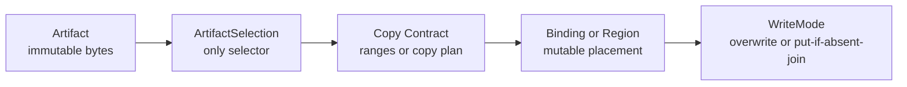
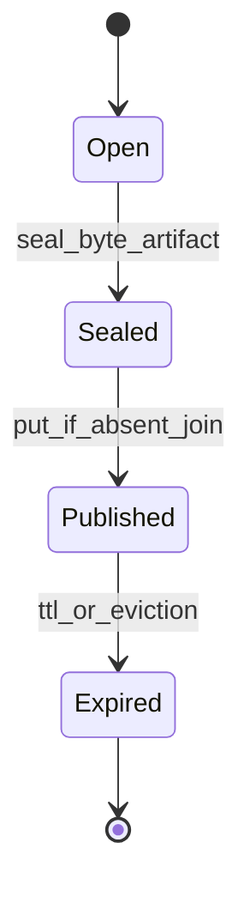
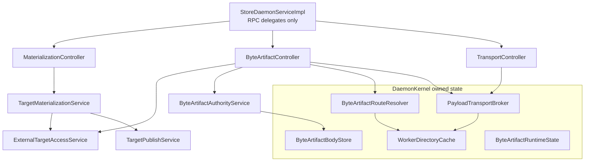

# Summary

TensorCast now has one canonical artifact-first runtime for both structured artifacts and routed byte artifacts.

The unified model is:

- `Artifact`: immutable bytes plus identity.
- `ArtifactSelection`: the only selection contract.
- `Binding` or registered region: mutable placement target.
- copy contract: canonical-byte or mapped-byte write ranges.
- `WriteMode`: overwrite or `PUT_IF_ABSENT_JOIN`.

`byte_artifact` is a profile, not a parallel runtime. The final daemon shape keeps routed byte-artifact authority,
caller-owned region access, payload transport, and publication capabilities in separate modules with explicit trust
boundaries.

# Current Implementation Snapshot

As of 2026-03-08, the live implementation matches this design:

- `StoreDaemonServiceImpl` delegates `Batch*`, `HomeBatch*`, and `FetchPayloadRefChunk` through controller entrypoints.
- `ByteArtifactController` owns byte-artifact batch ingress and home-authority orchestration.
- `MaterializationController` continues to own `MaterializeIntoTarget`, `MaterializeIntoMappedTarget`,
  `PublishTargetReplica`, and related artifact lifecycle RPCs.
- `TransportController` owns `FetchPayloadRefChunk` delegation on top of `PayloadTransportBroker`.
- `DaemonKernel` owns long-lived routed byte-artifact state: runtime state, body store, route resolver, payload
  transport broker, and shared worker directory cache.
- `ExternalTargetAccessService` is the shared caller-owned region boundary used by both materialization flows and
  byte-artifact ingress flows.
- `TargetPublicationScope`, `TargetPublicationRegistry`, `target_publication_token`, and `PayloadRefScope` are the live
  capability contracts.
- `BatchGetIntoRegionRequest` no longer exposes `preference` or `source_policy`.
- NodeAgent preserves structured `manifest`, `publish`, `hydrate`, and `evict_local` artifact results over
  `ExecutePlan`.

# Goals / Non-Goals

Goals

- Keep one artifact-first semantic model for weights, structured artifacts, and routed byte artifacts.
- Keep `ArtifactSelection` as the only selection envelope across SDK, daemon, NodeAgent, and plans.
- Keep routed byte-artifact truth off the Global Store per-blob hot path.
- Keep caller-owned region reads and writes inside one daemon-local safety boundary.
- Keep payload transport reusable and capability-scoped.
- Keep plan and NodeAgent artifact actions aligned with canonical `manifest/publish/hydrate/evict_local` semantics.

Non-Goals

- Move token-to-key mapping, request tables, or paged-attention semantics into TensorCast core.
- Introduce a generic artifact-runtime controller shared by every profile.
- Reintroduce Global Store as a per-blob catalog for `cgid:byte_artifact~...`.
- Treat byte-artifact durability as equivalent to model-artifact durability.

# Architecture & Interfaces

## 1. Unified runtime model

Normative rules:

- `Artifact` is the value layer.
- `ArtifactSelection` is the only selection contract used for routing, validation, and result identity.
- `Binding` or a caller-registered region is the placement layer.
- copy planning stays separate from semantic truth.
- `WriteMode` changes write semantics without creating a second object model.

## 2. Artifact profiles

### 2.1 Tensor-dict artifacts

Tensor-dict artifacts use the standard selection contract from `0078`:

- canonical selection, subset selection, and transform views are all encoded through `ArtifactSelection`,
- `logical_layout_hash` and `selection_hash` are derived from canonical or selected index bytes,
- daemon validation resolves selection once and reuses the resolved selection through the whole flow.

### 2.2 Byte artifacts

Byte artifacts are the routed high-cardinality profile used for paged KV-style caches and other opaque byte payloads.

Schema contract:

- exactly one tensor named `payload`,
- `payload.dtype == uint8`,
- `payload.shape == [byte_length]`.

Selection contract:

- canonical-only,
- full-selection-only,
- `view_id == ""`,
- `view_spec` absent,
- `tensor_names` omitted,
- `view_subset_hash` empty.

Fixed profile digests:

- `logical_layout_hash = sha256(utf8("tensorcast.byte_artifact.layout.v1\n")).digest()`
- `selection_hash = sha256(utf8("tensorcast.byte_artifact.selection.v1\n")).digest()`

Normative rules:

- byte-artifact selection identity must not depend on payload bytes, byte length, or any Global Store lookup,
- `Artifact.view(...)` and subset selection must be rejected for byte artifacts,
- SDK and daemon must share the same byte-artifact selection helper contract,
- `ArtifactProfileRegistry` is the daemon entrypoint for byte-artifact artifact-id validation, selection validation,
  normalized selection construction, shard derivation, and invariant validation.

## 3. Write modes and sealing boundary

TensorCast keeps one write model with two modes:

- `OVERWRITE`: used by binding swap and mapped or inplace overwrite paths,
- `PUT_IF_ABSENT_JOIN`: used by sealed byte-artifact publication.

Byte-artifact publication requires an explicit sealing boundary.

Normative rules:

- `Open` state is engine-owned mutable state and is not publishable.
- `Sealed` state is the immutable byte snapshot that may enter routed publish paths.
- only sealed byte artifacts may use `PUT_IF_ABSENT_JOIN`.

Join invariants for `PUT_IF_ABSENT_JOIN`:

- `layout_id`,
- `byte_length`,
- `payload_digest_alg = "sha256"`,
- `payload_digest_hex = sha256(payload_bytes).hexdigest()`.

TTL rules:

- TTL extension is monotonic increasing,
- immortal entries remain immortal under join and touch unless explicitly evicted.

## 4. Identity, authority, and routing for `cgid:byte_artifact~...`

Recommended identity profile:

`cgid:byte_artifact~<namespace>~<engine>~<model_id_enc>~<layout_id>~<engine_key_enc>`

Identity rules:

- the suffix after `cgid:` must satisfy the shared CGID grammar `[-._~A-Za-z0-9]`,
- segments are separated by `~`,
- arbitrary bytes or strings should use `b64u.<base64url_nopad(...)>`,
- SDK and C++ runtime paths must share one parser, validator, and test-vector set.

Authority split:

- Global Store is the authority for shard-home leases only,
- the current shard-home daemon is the authority for per-blob existence truth, first-writer invariants, and TTL.

Sharding:

- `shard_id = hash64(utf8(artifact_id)) % S`,
- `hash64` is `sha256(utf8(artifact_id)).digest()`, first 8 bytes interpreted as little-endian `uint64`,
- `S` is a cluster-wide shard count, defaulting to `4096` unless configured otherwise.

Fencing and route validity:

- every `HomeBatch*` request carries `RouteFence`,
- `RouteFence` includes `{shard_id, lease_generation, holder_daemon_id, routing_epoch}`,
- stale or mismatched fence values fail closed and return redirect information when available,
- cached body validity is scoped by shard, lease generation, and routing epoch,
- ambiguous route freshness degrades to per-item miss or unavailable outcomes instead of unproven hits.

Cluster-wide routing invariants:

- shard count,
- shard hash/version,
- inline payload threshold,
- lease TTL and keepalive policy,
- route staleness budget,
- worker-directory staleness budget,
- routing epoch,
- payload-transport policy,
- digest enforcement behavior.

Capability-directory rules:

- `gateway_ingress_enabled` is an external-ingress role bit,
- `shard_home_eligible` gates shard-home acquisition eligibility,
- capability-directory flags are discovery and routing signals, not peer authentication.

## 5. RPC families and trust model

The runtime uses four distinct RPC classes.

### 5.1 External ingress authority RPCs

- `BatchExists`
- `BatchTouchTtl`

Rules:

- these are public ingress RPCs,
- non-local callers require `gateway_ingress_enabled=true`,
- results are outcome-first and per item.

### 5.2 Local-only placement adapters

- `BatchGetIntoRegion`
- `BatchPutIfAbsentFromRegion`

Rules:

- these RPCs remain loopback or UDS-only because they touch caller-owned regions,
- they validate `pid`, `device_uuid`, and `TargetLayout` through `ExternalTargetAccessService`,
- `BatchGetIntoRegionRequest` carries only `selections`, `target_layout`, `pid`, `device_uuid`, and optional
  `operation_id`,
- `BatchPutIfAbsentFromRegionRequest` carries item selections plus invariants or payload refs, `source_layout`, optional
  `ttl_ms`, `pid`, `device_uuid`, and optional `operation_id`,
- `preference` and `source_policy` are not part of the final `BatchGetIntoRegion` contract.

### 5.3 Home-scoped fenced authority RPCs

- `HomeBatchExists`
- `HomeBatchGet`
- `HomeBatchPutIfAbsent`
- `HomeBatchTouchTtl`

Rules:

- these are inter-daemon authority RPCs,
- they do not accept caller PID, target layout, or direct caller-region access,
- they are governed by `RouteFence`, not by `gateway_ingress_enabled`,
- large payloads use `payload_ref` instead of large inline bytes.

### 5.4 Inter-daemon transport RPC

- `FetchPayloadRefChunk`

Rules:

- transport authorization comes from `payload_ref`,
- it is not an ingress RPC and is not gated by `gateway_ingress_enabled`,
- it carries consume-side `operation_id` when the capability requires operation binding.

## 6. Final daemon layering and state ownership

Normative rules:

- `StoreDaemonServiceImpl` is an RPC adapter and dependency wiring point, not the owner of routed byte-artifact state.
- `ByteArtifactController` owns batch ingress and home-batch orchestration for the byte-artifact profile only.
- `MaterializationController` remains the owner of materialize, mapped-materialize, publish-target, and related artifact
  lifecycle flows.
- `TransportController` owns transport RPC delegation, including `FetchPayloadRefChunk`.
- `DaemonKernel` owns long-lived routed byte-artifact state modules and the shared worker directory cache.
- `WorkerDirectoryCache` is shared daemon infrastructure, not byte-artifact-private state.

Service boundaries:

| Service | Responsibilities | Must not own |
| --- | --- | --- |
| `ArtifactProfileRegistry` | byte-artifact id classification, normalized selection, shard derivation, invariant validation | TTL, leases, payload bytes |
| `ExternalTargetAccessService` | local-only peer enforcement, target or source layout validation, validated local-access descriptors | shard routing, join truth |
| `ByteArtifactController` | front-door batch orchestration and fenced home RPC delegation | long-lived payload state |
| `ByteArtifactAuthorityService` | exists, get, put-if-absent-join, touch-ttl semantic truth | PID or device validation |
| `ByteArtifactBodyStore` | payload bytes, invariants, TTL, body validity | route acquisition |
| `ByteArtifactRouteResolver` | shard-home acquisition, fence validation, redirect population | payload bytes |
| `PayloadTransportBroker` | issue, inspect, resolve, and prune `payload_ref` capabilities | semantic existence truth |
| `WorkerDirectoryCache` | bounded-staleness `daemon_id -> address` resolution | byte-artifact semantic state |

## 7. Capability contracts

### 7.1 Publication capability

Publication remains publication-specific rather than becoming a universal target-access token.

Final publication contract:

- `TargetPublicationScope`
- `TargetPublicationRegistry`
- `target_publication_token`
- `CAPABILITY_AUDIENCE_TARGET_PUBLICATION`

Rules:

- the token is minted by `TargetMaterializationService`,
- the token is consumed by `TargetPublishService`,
- consume-time verification checks currentness and, when present, exact `operation_id` match,
- scope identity includes publication id, selection, byte space, device UUID, owner PID, and target layout hash,
- the token is short-lived and replay-bounded by the registry currentness check.

### 7.2 Payload transport capability

Payload transport uses a generic but tightly typed capability:

- `PayloadRefScope`
- `CAPABILITY_AUDIENCE_PAYLOAD_REF`

`PayloadRefScope` fields:

- `payload_id`
- `artifact_id`
- `payload_size`
- `digest_alg`
- `digest_hex`
- `direction`
- `operation_id`

Rules:

- `payload_ref` issuance and verification are signed-only,
- unsigned fallback and ad-hoc JSON scopes are not part of the final runtime,
- consume-time verification checks artifact id, payload size, digest, direction, and operation identity,
- payload-ref TTL, fetch deadline, max chunk bytes, and cleanup interval are configured under
  `DaemonConfig.ByteArtifactRouting.PayloadTransport`.

## 8. Structured artifact execution results

Plan and NodeAgent semantics stay aligned with the artifact runtime instead of flattening outcomes into step status only.

Canonical action names:

- `manifest`
- `publish`
- `hydrate`
- `evict_local`

NodeAgent result contract:

- `ArtifactManifestResult`
- `ArtifactPublishResult`
- `ArtifactHydrateResult`
- `ArtifactBatchResult`

Normative rules:

- NodeAgent must preserve structured artifact outcomes over `ExecutePlan`,
- SDK plan readers must decode them back into typed artifact-result objects,
- per-item byte-artifact outcomes remain visible to schedulers and callers.

## 9. Naming Compliance

The current API names introduced or formalized by this design follow repository naming rules.

Classes, structs, and messages use `PascalCase`:

- `ByteArtifactController`
- `ExternalTargetAccessService`
- `ArtifactProfileRegistry`
- `ByteArtifactBodyStore`
- `ByteArtifactRouteResolver`
- `WorkerDirectoryCache`
- `TargetPublicationScope`
- `TargetPublicationRegistry`
- `PayloadRefScope`
- `PutIfAbsentInvariant`
- `RouteFence`

Functions and methods use `snake_case`:

- `batch_get_into_region`
- `batch_put_if_absent_from_region`
- `home_batch_put_if_absent`
- `validate_local_target_layout`
- `validate_local_source_layout`
- `build_normalized_selection`
- `issue_payload_ref`
- `touch_ttl`

Constants and enum values use `ALL_CAPS`:

- `CAPABILITY_AUDIENCE_TARGET_PUBLICATION`
- `CAPABILITY_AUDIENCE_PAYLOAD_REF`
- `WORKER_CAPABILITY_FLAG_GATEWAY_INGRESS_ENABLED`
- `WORKER_CAPABILITY_FLAG_SHARD_HOME_ELIGIBLE`

# Schema Changes

No new `schema.sql` changes are introduced by this consolidated design.

The current architecture depends on already-landed shard-home lease metadata, worker capability flags, daemon config
fields, and proto surfaces. Any future durable schema for routing-epoch persistence should be proposed as a separate
design delta.

# Trade-offs & Risks

- byte artifacts remain a cache profile, so misses must degrade to recompute or prefill rather than relying on durable
  retention,
- `HomeBatch*` and `FetchPayloadRefChunk` assume a trusted intra-cluster network unless a separate peer-auth layer is
  introduced,
- signed-only payload transport depends on capability-token configuration being available where routed large-payload
  transport is required,
- routing and config drift must fail closed; mixed semantics inside one routing epoch are not allowed.

# Compatibility & Acceptance Criteria

- `ArtifactSelection` remains the only selection contract across SDK, daemon, plan, and NodeAgent paths.
- `cgid:byte_artifact~...` remains excluded from Global Store per-blob artifact and replica catalogs.
- `BatchGetIntoRegion` and `BatchPutIfAbsentFromRegion` remain local-only because they operate on caller-owned regions.
- `BatchGetIntoRegionRequest` does not reintroduce `preference` or `source_policy`.
- `StoreDaemonServiceImpl` keeps delegate-only live paths for `Batch*`, `HomeBatch*`, and `FetchPayloadRefChunk`.
- routed byte-artifact state remains kernel-owned rather than being re-embedded into `StoreDaemonServiceImpl`.
- publication flows use `target_publication_token` and publication-specific state; new code must not revive superseded
  pre-publication naming.
- payload transport uses typed signed `payload_ref` scopes only.
- ambiguous routing freshness or epoch mismatch degrades to refresh, miss, or unavailable outcomes rather than unproven
  hits.
- NodeAgent returns structured artifact results for artifact actions instead of step-status-only flattening.

# References

- [Client-Generated Artifact ID](./0017-client-generated-artifact-id.md)
- [Programmable Framework Advanced Design](./0056-programmable-framework-adv.md)
- [Binding First Inplace Updates](./0063-binding-first-inplace-updates.md)
- [Mapped Binding Requirements](./0070-mapped-binding-requirements.md)
- [Selection-First Artifact Retrieval](./0078-selection-first-artifact-retrieval.md)
- [Region-Backed API](../architecture/api/region-backed.md)
