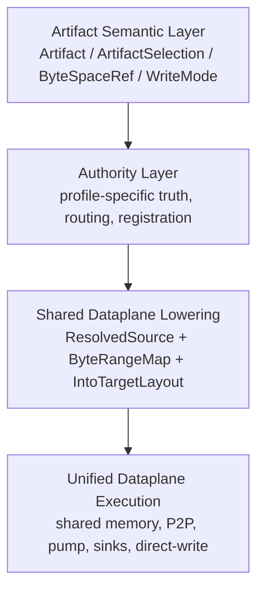
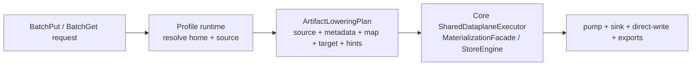

# Summary

TensorCast should keep one artifact-first object model while making a hard architectural split between:

- profile-specific authority, registration, and routing,
- shared core-owned dataplane and memory-movement substrate exposed through the Store Daemon.

`byte_artifact` is not a parallel runtime and not a second data object. It is the first high-cardinality artifact
profile. Its differences are intentionally limited to:

- how identity is minted or validated,
- where semantic truth lives,
- how source ownership and routing are resolved,
- what lifecycle invariants apply (`seal`, `PUT_IF_ABSENT_JOIN`, TTL, fencing).

The long-term bridge out of that specialization must also stay explicit:

- authority-specialized paths may validate, route, fence, and mint bounded serving promises,
- but any path that will move bytes must next converge on one shared source-capability shape,
- then lower through one shared `ArtifactLoweringPlan`,
- then execute through the same core-owned dataplane runtime as every other artifact profile.

After source resolution, all byte movement must reuse the existing TensorCast dataplane:

- source adapters,
- byte-range planning,
- pinned-buffer staging,
- CPU shared memory and GPU shared memory,
- CUDA IPC and memfd export,
- direct-write grants,
- P2P transports,
- target sinks and pump execution.

This is a hard-cut target architecture. No compatibility shims, dual stack, or transitional parallel dataplane should be
retained.

# Problem Statement

TensorCast already has a strong shared dataplane, built around:

- `loading::ArtifactSource`, `loading::IntoTargetLayout`, and `loading::MaterializeHints`,
- `IArtifactLoader`, `SeekableSource`, `ByteRangeMap`, `ByteRangeMappedSource`,
- `TargetLayoutGpuSink`, direct-write grants, pinned-buffer pump execution,
- CPU memfd shared memory, GPU shared memory, CUDA IPC export, and P2P loaders.

That substrate is the most expensive and strategically valuable part of the project. It embodies years of correctness
and performance work around shared memory, copy scheduling, and cross-process/cross-node data movement.

At the same time, TensorCast must support a class of runtime objects with radically different economic properties:

- high cardinality,
- high churn,
- runtime-generated data,
- cache semantics rather than durable catalog semantics,
- no Global Store per-blob hot path,
- but still first-class participation in artifact actions, plans, bindings, and node-agent execution.

`byte_artifact` exists to fill that gap.

The current trajectory is directionally correct because it keeps `byte_artifact` inside the artifact-first world.
However, the current implementation shape risks stopping at:

- semantic unification at the API and control plane,
- but effective dataplane divergence inside daemon controllers and byte-artifact-private copy loops.

That is not acceptable as a long-term architecture. If `byte_artifact` grows a separate host-buffer copy runtime, the
project loses the single most important form of reuse: reuse of the shared memory and copy substrate.

# Current Implementation Snapshot

As of the current staged code line, the repository is in an in-between state:

- semantic and control-plane convergence is real:
  - `tensorcast/common/selection_contract.py` already treats `byte_artifact` as an artifact profile,
  - `proto/tensorcast/node_agent/v1/node_agent.proto` and `tensorcast/node_agent/executor.py` already preserve
    canonical artifact actions and typed results,
  - `proto/tensorcast/global_store/v1/global_store.proto` already narrows Global Store byte-artifact responsibility to
    shard-home lease authority.
- the shared dataplane is already rich enough for reuse:
  - `core/store/runtime/ingestion/materialization_facade.cc` provides a source -> byte-range -> target-sink executor,
  - `core/store/materialization/dataplane/contracts/inline_buffer_loader.h` already adapts in-memory payloads into
    standard source contracts,
  - `core/store/materialization/dataplane/sources/memory_source.h` already exposes CPU and GPU memory sources,
  - `core/store/materialization/dataplane/sinks/target_layout_gpu_sink.h` and
    `core/store/materialization/dataplane/runtime/pump.h` already centralize GPU target writes and scheduling.
- the biggest architectural gap is that byte-artifact steady-state data movement still bypasses that substrate:
  - `daemon/service/controllers/byte_artifact_controller.cc` reassembles `payload_ref` into host strings,
  - `daemon/service/byte_artifact_region_layout.cc` performs direct `cudaMemcpyHostToDevice` /
    `cudaMemcpyDeviceToHost`,
  - `daemon/service/byte_artifact_body_store.cc` primarily owns raw payload bytes rather than body handles,
  - `core/store/store_engine.cc` still leaves `ingest_from_buffer_internal(...)` unimplemented.

This design is specifically about eliminating that last category.

# Why Byte Artifact Exists

`byte_artifact` is required because TensorCast needs to represent high-cardinality runtime cache objects as artifacts
without forcing them through the durable artifact authority model.

This profile exists to support scenarios such as paged KV motivating cases and other opaque byte payloads where:

- the artifact is real and must be schedulable, publishable, hydratable, and evictable,
- the payload is opaque to TensorCast core,
- the object count is too large for Global Store per-blob cataloging,
- the payload lifecycle is driven by cache behavior and request-local barriers, not by persistent artifact retention.

Without `byte_artifact`, TensorCast would be forced into one of two bad outcomes:

- overload the Global Store artifact catalog with high-cardinality cache blobs, or
- build a second engine-specific KV control and data system outside the artifact runtime.

The first is not scalable. The second breaks project-wide consistency.

## Root Cause Summary

The architectural problem is not that byte artifacts need specialization. They do.

The problem is allowing specialization to leak below the authority boundary and become a dedicated data-movement line.

That would cause the project to duplicate the exact part of the system that is most expensive and most strategically
important:

- shared-memory handling,
- memory export and import,
- copy scheduling,
- pinned staging,
- direct-write,
- GPU sink execution,
- cross-node transport.

Therefore the right response to high-cardinality artifacts is:

- specialize authority,
- standardize lowering,
- share execution.

# Goals / Non-Goals

Goals

- Keep one artifact-first semantic model for weights, byte artifacts, checkpoints, and future runtime objects.
- Keep `ArtifactSelection` as the only selection envelope across SDK, daemon, plan, and node-agent paths.
- Make artifact profiles first-class so high-cardinality artifact forms are explicit, not hidden special cases.
- Reuse the existing core-owned dataplane and memory substrate for all profiles after source resolution.
- Restrict `byte_artifact` specialization to authority, routing, registration, and lifecycle policy.
- Preserve and extend reuse of CPU shared memory, GPU shared memory, CUDA IPC, memfd export, direct-write, pinned
  staging, and P2P execution.
- Remove byte-artifact-private host-buffer copy loops from the long-term dataplane.

Non-Goals

- Preserve the current byte-artifact controller/body-store copy path for compatibility.
- Introduce a second data object abstraction parallel to `Artifact`.
- Keep Global Store in the `cgid:byte_artifact~...` per-blob hot path.
- Build a separate byte-artifact-specific memory transport subsystem.
- Maintain dual stack, compatibility wrappers, or migration shims.

# Architecture & Interfaces

## 1. Layering model

Normative rule:

- profiles may differ in layer `B`,
- profiles must converge before layer `D`.

### 1.1 Authority-to-dataplane bridge

There is one required bridge between profile-specific authority and shared execution.

Long-term rule:

- profile authority may produce either:
  - a resolved source-capability result for byte movement,
  - or an attach/resume result for long-lived observe, wait, replay, or status flows.
- if the next step is byte movement, the profile runtime must convert the authority answer into one shared lowering shape.

Required interpretation:

- authority answers semantic questions such as route ownership, fencing, current validity, replay, or lifecycle minting,
- lowering answers execution questions such as source adapter, byte-range map, target layout, and execution hints,
- no profile may stop at a private authority-local success result and then handcraft a private copy path after that point.

### 1.2 Project-wide constitutional rules

This design is not only a byte-artifact cleanup. It is a project-wide architectural constraint line that must remain
compatible with:

- artifact-first SDK semantics from `0039`,
- programmable control-plane / fixed data-plane semantics from `0055`,
- daemon-ingress and instance-boundary rules from `0056`,
- single `ArtifactSelection` identity from `0078`,
- byte-artifact authority split from `0087`.

The following rules are normative:

1. There is one artifact object model, not one object model per workload family.
2. There is one selection model, and profile specialization must not create a second selector contract.
3. There is one steady-state dataplane executor, and it is core-owned.
4. Profile variation is expressed through profile runtimes and lowering, not through service-layer copy engines.
5. Long-lived memory and export lifecycles remain attached to the existing core residency / lease / publish / retire
   model; profile code may reference those objects but must not define a second memory lifecycle.
6. Observability, operation identity, and completion semantics must remain unified after lowering; profiles must not
   create private success/failure accounting for the same byte movement.

### 1.3 Dataplane ownership rule

The shared executor is a core runtime responsibility.

Normative rules:

- steady-state copy execution must remain owned by `core/store`,
- the canonical executor concept in this architecture is the existing core runtime path centered on
  `MaterializationFacade` plus the memory-backed ingest entrypoints in `StoreEngine`,
- daemon/service code may validate, authorize, batch, and lower requests, but it must not become a second execution
  runtime,
- distributed authority code must terminate in shared lowering or an explicit attach/resume handle before realization,
- any new helper introduced on the daemon side must end before source/map/target execution begins.

This preserves the project’s long-term invariant from the daemon and programmable-framework architecture: control plane
may become richer, but the data plane stays fixed.

## 2. Artifact profile model

TensorCast must treat profile as an explicit architectural dimension, separate from identity kind.

Examples:

- `tensor_dict`: structured tensors, view/subset capable, GS catalog and replica model.
- `byte_artifact`: opaque byte payload, canonical-only selection, home-routed authority, cache lifecycle.

Profile must define:

- value schema,
- selection rules,
- authority and routing class,
- publication and join semantics,
- retention and fencing rules,
- lowering contract to shared dataplane.

Identity kind remains independent:

- `mi2:` and `cgid:` are identity kinds,
- `byte_artifact` is a profile,
- not every `cgid:` is a byte artifact,
- not every future high-cardinality artifact should inherit byte-artifact authority behavior.

## 3. Shared semantic contracts

The following contracts remain universal across profiles:

- `Artifact`
- `ArtifactSelection`
- `ByteSpaceRef`
- `WriteMode`
- `manifest`, `publish`, `hydrate`, `evict_local`
- typed capability scopes
- typed plan and node-agent artifact results

`byte_artifact` uses these contracts with profile-specific constraints:

- one tensor named `payload`,
- canonical-only selection,
- full-selection-only,
- fixed profile selection identity,
- explicit `seal` boundary before `PUT_IF_ABSENT_JOIN`.

## 4. Shared dataplane contracts

All profiles must lower to the shared dataplane through the same internal contract family:

- `loading::ArtifactSource`
- `loading::IntoTargetLayout`
- `loader::SeekableSource`
- `loader::ByteRangeMap`
- `loader::TargetLayoutGpuSink`
- `loader::pump_ranges(...)`
- CPU and GPU memory sources
- shared-memory and direct-write facilities

### 4.0 Shared dataplane inventory

The shared dataplane that must be reused is not hypothetical. It already exists in code and includes:

- `loading::ArtifactSource`, `loading::IntoTargetLayout`, `loading::MaterializeHints`
- `IArtifactLoader`, `SeekableSource`, `InlineBufferLoader`
- `CpuMemorySource`, `GpuMemorySource`
- `ByteRangeMap`, `ByteRangeCompiler`, `ByteRangeMappedSource`
- `TargetLayoutGpuSink`
- `pump_ranges(...)`
- `StreamingPinnedBuffer`, direct-write grants, async sink writes
- CPU memfd and GPU CUDA IPC export facilities

Normative rule:

- no new byte-artifact-specific primitive may be introduced below this layer unless it first enters this contract
  family and is reusable by non-byte-artifact flows.

### 4.1 Canonical lowering IR

Profiles must not lower directly into ad-hoc executor call shapes.

They must first produce a canonical internal lowering object:

- `ArtifactLoweringPlan`

Minimum contents of `ArtifactLoweringPlan`:

- resolved source handle or adapter,
- canonical payload metadata required by the core executor,
- byte-range map,
- target layout or replica target,
- execution hints,
- byte-space / selection identity carried forward for observability and publication.

The purpose of this IR is to keep profile code out of executor-specific glue and make future profiles pass through the
same lowering shape.

Normative rules:

- daemon controllers must not handcraft executor call arguments item-by-item,
- profile runtimes lower to `ArtifactLoweringPlan`,
- the core shared executor consumes `ArtifactLoweringPlan` or a mechanically equivalent core-owned translation of it.

### 4.2 Required lowering target

Every artifact materialization path must lower to:

- a resolved source adapter,
- a byte-range map,
- a target layout,
- execution hints.

For `byte_artifact`, the lowering is usually trivial:

- source is the sealed payload body or a remote capability-backed source,
- byte-range map is identity,
- target layout is caller-provided placement,
- execution hints carry authority and transport context.

### 4.3 Byte artifact payload metadata for dataplane

`byte_artifact` selection identity remains profile-fixed, but dataplane execution still requires size-aware metadata.

Normative rule:

- `byte_artifact` may synthesize a trivial canonical payload layout for dataplane execution,
- this synthetic layout must not change profile selection semantics,
- it exists only to drive shared byte-range planning and shared sinks.

Equivalent internal representation:

- tensor name: `payload`
- dtype: `uint8`
- shape: `[byte_length]`

This enables reuse of the existing executor without treating byte artifacts as a separate copy system.

Additional long-term rule:

- the synthetic canonical payload metadata must be produced by one shared builder used by the profile runtime and core
  lowering path,
- daemon controllers must not assemble ad-hoc JSON/index/generation payloads inline,
- if the core executor requires canonical index bytes and generation, those values must come from this shared builder
  contract.

### 4.4 Front-door specialization is allowed

This design does not require identical public or internal RPC families for all profiles.

Allowed specialization:

- byte-artifact-specific register/open/seal/barrier flows,
- home-scoped batch RPCs and shard-fenced authority RPCs,
- profile-specific validation helpers,
- profile-specific route and TTL semantics.

Not allowed:

- a byte-artifact-private steady-state copy engine,
- a byte-artifact-private shared-memory abstraction,
- a byte-artifact-private target sink and scheduler path.

## 5. Authority-plane split

Authority is where profiles are allowed to diverge.

### 5.1 Structured artifact authority

Structured artifact authority continues to use:

- Global Store bindings and artifact catalog,
- replica registry and optional disk hints,
- existing view/subset-aware selection validation.

### 5.2 Byte artifact authority

`byte_artifact` authority must remain:

- home-shard scoped,
- fenced by route generation and routing epoch,
- join-based rather than overwrite-based,
- TTL-driven and cache-shaped,
- off the Global Store per-blob hot path.

Global Store responsibilities for `byte_artifact` remain low-cardinality only:

- shard-home lease authority,
- membership and directory information,
- not per-blob existence truth.

## 6. Required internal module split

Target end-state modules:

| Module | Responsibilities | Must not own |
| --- | --- | --- |
| `ArtifactProfileRegistry` | profile classification, validation metadata, runtime factory lookup | per-profile payload state, global switch-based orchestration |
| `ArtifactProfileRuntime` | per-profile authority validation, route resolution, lowering to `ArtifactLoweringPlan` | steady-state copy execution, shared transport primitives |
| `ByteArtifactProfileRuntime` | `byte_artifact` implementation of `ArtifactProfileRuntime` | generic registry policy, private copy engine |
| `ByteArtifactRoutingService` | shard-home acquisition, redirect, route caching, fencing | payload copy logic |
| `ByteArtifactMetadataStore` | join invariant, TTL, generation/epoch visibility, body-handle references | host/device memcpy loops, private residency lifecycle |
| `BodyHandle` | profile-visible reference to a core-owned residency/export object | profile-private storage/export semantics |
| `PayloadRefSource` | expose payload capability as standard `SeekableSource` | semantic existence truth |
| `ArtifactLoweringPlan` | canonical internal lowering IR between profile runtime and core executor | policy ownership, shared transport implementation |
| `SharedDataplaneExecutor` | core-owned execution of source/map/target flows, implemented by `MaterializationFacade` and memory-backed `StoreEngine` entrypoints | profile policy, service-layer routing |
| `ExternalTargetAccessService` | local caller-owned region validation and storage leases | profile routing |

Normative rule:

- end-state control flow is `ArtifactProfileRegistry` -> `ArtifactProfileRuntime` -> `ArtifactLoweringPlan` ->
  `SharedDataplaneExecutor`,
- there must not be a giant daemon-local switch object that owns authority, lowering, and execution for every profile.

## 7. Hard-cut constraints for the byte-artifact dataplane

The target architecture forbids the following long-term patterns:

- byte-artifact-specific steady-state `cudaMemcpy` loops as the primary get/put dataplane,
- byte-artifact controller reassembling remote payloads into host strings and then writing them directly into target
  memory,
- a payload transport protocol that is itself the copy engine rather than a source capability,
- a body store whose primary abstraction is `artifact_id -> raw payload bytes`.

These patterns may exist transiently during migration, but they are not part of the target architecture.

## 8. Root fix: authority-specialized, dataplane-unified lowering

The fundamental repair is:

1. resolve semantic truth and routing in the profile runtime,
2. lower the result into `ArtifactLoweringPlan`,
3. execute through the core shared substrate,
4. keep all copy, direct-write, and shared-memory optimizations common.

Illustrative lowering:

## 9. Current-to-target module mapping

The following table defines the intended migration of current modules.

| Current module | Current role | Target role |
| --- | --- | --- |
| `daemon/service/controllers/byte_artifact_controller.cc` | request validation, route resolution, payload fetch, target writes, aggregation | request validation, shard batching, authority dispatch, result aggregation only |
| `daemon/service/byte_artifact_route_resolver.cc` | partial home-fence validation and owned-lease handling | single owner of all byte-artifact route and redirect policy |
| `daemon/service/byte_artifact_body_store.cc` | raw payload bytes + invariant + TTL | metadata and body-handle store, not copy engine |
| `daemon/service/payload_transport_broker.cc` | token issuance plus payload lookup | token issuance plus source-capability resolution |
| `daemon/service/byte_artifact_region_layout.cc` | region mapping plus direct copies | placement-lowering helper only; no steady-state copy logic |
| `daemon/service/artifact_profile_registry.h` | validator helper | profile-runtime factory / registry only |
| `core/store/store_engine.cc::ingest_from_buffer_internal` | currently unimplemented | shared in-memory artifact ingestion entrypoint |
| `core/store/runtime/ingestion/materialization_facade.cc` | shared executor for into-target flows | canonical shared dataplane executor for byte-artifact lowering as well |

## 10. Required architectural decisions

### 10.1 Profile runtime over central switches

Long-term extensibility depends on rejecting a central “artifact super-controller”.

Normative rules:

- `ArtifactProfileRegistry` is a registry/factory, not the place where all profile behavior is implemented,
- each profile must own an explicit runtime implementation,
- adding a future profile should require adding one profile runtime plus shared lowering tests, not editing one giant
  dispatcher across daemon and core,
- if a proposed new profile requires a new service-layer copy engine, the design must be rejected or the primitive
  must first be generalized into the shared dataplane.

### 10.2 Body handles, not payload strings

Long-term byte-artifact state must be centered on body handles, not materialized host strings.

Normative rules:

- a `BodyHandle` is a reference to a core-owned residency or export object,
- long-lived handles must participate in existing lease, publish, retire, reconcile, and telemetry semantics rather
  than creating profile-private lifecycle state,
- daemon profile modules may cache and index body handles, but they must not become the owner of memory export or
  residency lifecycle,
- inline transient buffers are allowed only as staging forms on the way into the shared core runtime.

Examples of acceptable body-handle backings:

- daemon-owned CPU shared-memory backing,
- daemon-owned GPU-resident backing,
- replica-key-addressable backing,
- inline in-memory source only as a fallback or staging form.

### 10.3 Payload capability must become a source, not a transport micro-runtime

`payload_ref` may remain the security and rendezvous primitive, but not the copy abstraction.

The target architecture requires:

- `payload_ref` inspection and verification to remain in the authority plane,
- `payload_ref` resolution to produce a standard source abstraction,
- copy execution to happen only after that through the shared dataplane substrate.

### 10.4 Region-backed byte-artifact placement must lower to `IntoTargetLayout`

The current byte-artifact target placement helpers may keep profile-specific surface validation, but their execution
target must become the same `loading::IntoTargetLayout` substrate used elsewhere.

That means:

- no profile-private write loops after placement resolution,
- no profile-private host bounce buffering as the steady-state target write path.

### 10.5 Unified operation and observability semantics

Once a profile has lowered into the shared dataplane, it must inherit the same runtime semantics as any other artifact
flow.

Normative rules:

- lowered byte-artifact execution must emit the same class of request identity, completion status, and timing signals
  used by the shared ingestion/materialization runtime,
- publish and completion dedupe must continue to use the shared publish-context model rather than a byte-artifact-only
  mechanism,
- profile-private telemetry may exist for authority events, but not as a replacement for shared dataplane telemetry.

### 10.6 Future profile admission test

This design is only successful if it makes future profiles cheaper and safer to add.

A future artifact profile is admissible only if:

- it can reuse `Artifact`, `ArtifactSelection`, and shared target/publication semantics,
- it implements specialization through a profile runtime plus lowering,
- it lowers to `ArtifactLoweringPlan` and executes through the same core shared dataplane,
- it does not require a new per-profile steady-state copy engine,
- it does not pull Global Store into a new high-cardinality hot path.

## 11. Naming Compliance

Classes and structs introduced or formalized by this design use `PascalCase`:

- `ArtifactProfileRuntime`
- `ByteArtifactProfileRuntime`
- `ArtifactLoweringPlan`
- `BodyHandle`
- `ByteArtifactRoutingService`
- `ByteArtifactMetadataStore`
- `PayloadRefSource`
- `SharedDataplaneExecutor`

Functions and methods use `snake_case`:

- `resolve_authority`
- `lower_to_dataplane`
- `resolve_payload_ref_source`
- `prune_metadata`

Constants and enum values use `ALL_CAPS`:

- `CAPABILITY_AUDIENCE_PAYLOAD_REF`
- `PAYLOAD_REF_DIRECTION_GET`
- `PAYLOAD_REF_DIRECTION_PUT`

# Required Changes from Current Architecture

## 1. Promote profile runtime to a first-class concept

The project must stop treating byte-artifact behavior as a controller-local exception.

Required:

- explicit profile runtime ownership,
- registry/factory ownership distinct from runtime ownership,
- explicit lowering contract from profile runtime to shared dataplane,
- explicit distinction between authority logic and copy logic.

## 2. Keep the dataplane core-owned

The project must not solve byte-artifact unification by creating a second executor in daemon/service.

Required:

- shared execution remains in `core/store`,
- `MaterializationFacade` and memory-backed `StoreEngine` ingestion stay the canonical execution substrate,
- daemon/profile code stops at `ArtifactLoweringPlan` creation and execution dispatch.

## 3. Move payload storage from raw bytes to body handles

`ByteArtifactMetadataStore` should primarily hold:

- profile metadata,
- TTL and invariant state,
- routing generation visibility,
- body handles.

Body handles may point to:

- daemon-managed memory replicas,
- CPU shared-memory segments,
- GPU-resident exports,
- inline transient buffers only as a fallback.

This is necessary to bring `byte_artifact` closer to the shared dataplane instead of keeping it in a controller-owned
host-buffer world.

Additional long-term rule:

- body handles must bind to the existing lease / publish / retire / reconcile / telemetry lifecycle rather than a
  byte-artifact-private lifecycle.

## 4. Convert payload capabilities into shared sources

`payload_ref` should become a source adapter, not the copy implementation.

Required:

- local and remote payload-capability resolution must produce a standard source object,
- downstream execution must use the common sink and pump path,
- digest checks remain source validation, not the main copy protocol.

## 5. Canonicalize the lowering builder

The project should introduce one shared lowering builder for byte-artifact canonical payload metadata.

Required:

- one shared helper produces synthetic canonical payload metadata for `byte_artifact`,
- controller code must not handcraft canonical index bytes or generation values inline,
- profile runtime and core runtime must validate the same lowering assumptions.

## 6. Centralize route ownership

All shard-home route acquisition, refresh, redirect, and lease-generation handling must live in one service.

Controllers must not reimplement route cache policy or redirect retry semantics.

## 7. Complete in-memory source ingestion in core runtime

The shared runtime must support materializing from memory-backed artifact bodies without forcing a separate byte-artifact
copy path.

That includes finishing the core in-memory ingest path so profile runtimes can hand standard in-memory sources to the
shared executor.

Concretely, the current unimplemented `StoreEngine::ingest_from_buffer_internal(...)` path must be replaced by a real
shared runtime path rather than worked around in daemon controllers.

# Schema Changes

No additional durable schema changes are required for this target architecture.

The architecture assumes:

- `shard_home_leases` remains the only Global Store durable state required for `byte_artifact` routing truth,
- structured artifact schema remains unchanged,
- any future telemetry or cache accounting schema is proposed separately and is not required for the core refactor.

# Trade-offs & Risks

- This design deliberately pushes more responsibility into the lowering boundary between authority and dataplane. That
  boundary must be explicit and well-tested.
- Some current byte-artifact-specific code is simpler locally because it copies through host strings. Replacing it with
  shared dataplane lowering increases short-term refactor cost, but it is the only way to preserve long-term substrate
  reuse.
- Reifying body handles instead of raw payload bytes requires careful lifecycle management, especially across TTL,
  routing epoch, and daemon-local ownership transitions.
- The design only remains healthy if `ArtifactProfileRegistry` stays a factory and profile runtimes stay small. A
  giant central profile switch would recreate the same long-term maintenance problem in a new place.
- The synthetic canonical payload metadata for `byte_artifact` must be generated through one shared builder; if that
  logic forks between controller, profile runtime, and core runtime, semantic drift will reappear.
- The refactor only pays off if the team enforces the “no dedicated byte-artifact dataplane” rule during future work.

# Compatibility & Acceptance Criteria

Compatibility stance:

- hard cut only,
- no compatibility shims,
- no dual stack,
- no redundant fallback implementation kept for old behavior,
- no attempt to preserve current byte-artifact-private dataplane behavior once the shared lowering path is available.

No compatibility requirements are accepted for this architecture line:

- do not retain old controller-owned copy paths as fallback,
- do not introduce feature flags that preserve the private dataplane,
- do not keep duplicate representations just to support staggered migration.

Acceptance criteria:

- `byte_artifact` remains a first-class `Artifact` profile rather than a parallel object model.
- Profiles differ in authority, routing, registration, and lifecycle policy only.
- All steady-state byte movement for `byte_artifact` lowers to the same shared dataplane substrate used by other
  artifact flows.
- The shared executor remains core-owned; daemon/service does not gain a second steady-state copy runtime.
- Profile dispatch is registry/factory-based with explicit profile runtimes, not a giant cross-profile controller.
- CPU shared memory, GPU shared memory, CUDA IPC, direct-write, pinned staging, and P2P execution are reachable for
  `byte_artifact` through shared modules rather than profile-private copy code.
- `payload_ref` is treated as a source capability and not as the primary bespoke copy engine.
- `byte_artifact` synthetic canonical payload metadata is generated through one shared lowering builder.
- body handles participate in the existing core lease / publish / retire / reconcile lifecycle rather than a
  byte-artifact-private lifecycle.
- route acquisition and redirect policy are centralized; byte-artifact controllers do not own route cache policy.
- lowered byte-artifact execution emits the shared operation / completion / publish-context semantics.
- no new byte-artifact-specific copy substrate is introduced in daemon or core.
- any distributed authority path that will move bytes first produces a shared source-capability result and then lowers to
  the same `ArtifactLoweringPlan` / shared executor path as other artifact flows.

# References

- [0039 Artifact-First TensorCast SDK](./0039-artifact-first-sdk.md)
- [0017 Client-Generated Artifact ID](./0017-client-generated-artifact-id.md)
- [0055 Programmable Framework](./0055-programmable-framework.md)
- [0056 Programmable Framework Advanced Design](./0056-programmable-framework-adv.md)
- [0061 Slot-Based Inplace Binding and Safe Swap](./0061-slot-based-inplace-binding-and-swap.md)
- [0078 Selection-First Artifact Retrieval](./0078-selection-first-artifact-retrieval.md)
- [0087 Unified Artifact Runtime and Routed Byte Artifact Architecture](./0087-unified-artifact-runtime-and-routed-byte-artifact-architecture.md)
