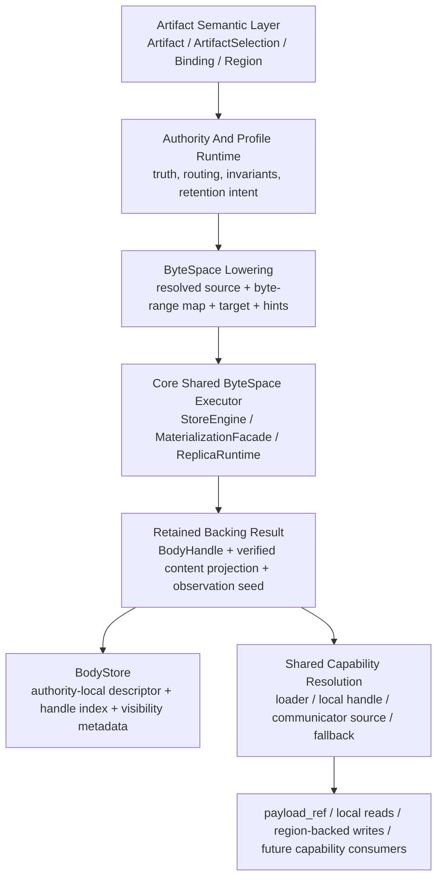
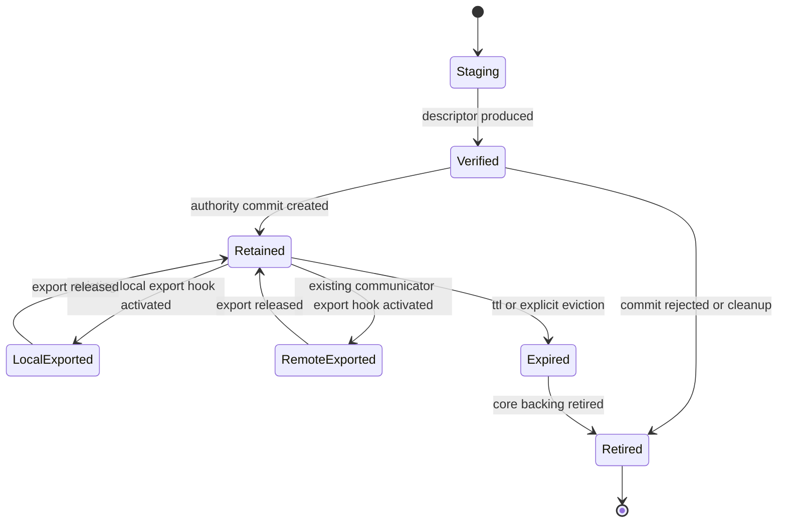

# Summary

`0088` established the correct seam:

- artifact profile logic stops at lowering,
- `ArtifactLoweringPlan` is the canonical internal execution IR,
- `StoreEngine` and `MaterializationFacade` remain the only steady-state executors,
- `BodyHandle` is now core-backed instead of daemon-owned heap bytes.

`0089` preserves that seam and finishes the retained-body cut without creating a second body-private dataplane.

The long-term target state is:

- the shared substrate is a profile-agnostic ByteSpace dataplane, not a tensor-dict-private dataplane,
- `byte_artifact` remains an `Artifact` profile, not a parallel runtime object,
- `byte_artifact` uses a fixed-selection profile over that shared ByteSpace dataplane rather than a second body runtime,
- retained bodies remain authority-local references to core-backed replicas,
- body policy is expressed as authority-local intent above the dataplane,
- content truth, runtime observation, and authority ownership are kept separate,
- verified content descriptors are produced by the shared executor or shared verification path, not by a body-private
  reread path,
- CPU memfd export, CUDA IPC, stable retention, communicator export, and transfer scheduling continue to use existing
  core contracts,
- protocol capabilities such as `payload_ref`, local handle leases, and publish capabilities converge to one shared
  capability-to-source or handle-resolution layer above the dataplane, not to parallel transfer engines.

`0089` is therefore a containment and cutover design, not a new "body runtime" design.

It exists to make sure `byte_artifact` does not grow a second policy model, a second transfer model, or a second
physical lifecycle model under the unified artifact architecture.

# Problem Statement

The latest `0088` code line is materially better than the pre-lowering controller design:

- `ArtifactLoweringPlan` and `execute_artifact_lowering_plan(...)` exist as real core execution contracts,
- `BodyHandle` is backed by a core `ReplicaHandle`,
- `BatchGetIntoRegion` and `BatchPutIfAbsentFromRegion` lower through the shared core dataplane,
- `payload_ref` issuance and chunk reads can operate on `BodyHandle` instead of forcing daemon heap strings.

However, the current body-backing story is still incomplete in four important ways:

1. retained-body policy is still implicit and controller-local,
2. body staging for `put` is still hard-coded to a CPU replica target,
3. invariant validation still rereads the full body through `BodyHandle::compute_sha256_hex()`,
4. the design vocabulary is still too close to a body-private backing taxonomy instead of the repository-wide
   memory/export vocabulary.

That last point is the architectural danger.

If `0089` is solved naively, TensorCast risks creating:

- one artifact model at the API level,
- but a second data-plane language underneath it for body storage, local export, and remote transfer.

There is also a deeper version of the same failure mode:

- the project would keep saying "shared dataplane",
- but would implicitly treat the current executor as a tensor-dict-specific dataplane,
- while `byte_artifact` grows its own capability-resolution, verification, and remote-transfer rules beside it.

That would still be duplication, only at a lower layer.

That would violate the long-term project line from:

- `0039`: one artifact-first value model,
- `0055`: programmable control plane, fixed data plane,
- `0078`: one selection contract,
- `0088`: authority specialization with shared execution.

# Current State & Grounding

Current code baseline after `0088`:

- the canonical internal lowering IR exists:
  - `core/store/runtime/ingestion/artifact_lowering_plan.h`
  - `core/store/runtime/ingestion/materialization_facade.cc`
  - `core/store/store_engine.cc`
- the core executor already consumes that IR for:
  - `into_target` execution,
  - replica-target execution into a core-backed body replica.
- `BodyHandle` wraps a core-backed `ReplicaHandle` and exposes:
  - `make_loader()`,
  - `read_range(...)`,
  - `read_all_bytes()`,
  - `compute_sha256_hex()`,
  - `retire()`.
- `ByteArtifactController` stages incoming payload sources into a core-backed `BodyHandle` before authority commit.
- `PayloadTransportBroker` can:
  - issue `payload_ref` from a `BodyHandle`,
  - open loaders for remote `payload_ref`,
  - serve local chunk reads from `BodyHandle`.

Current architectural constraints still visible in code:

- remote `payload_ref` fetch still uses a chunk-RPC transport path rather than converging to the full shared
  remote-source family,
- stable-retention policy is still wired through existing core hooks rather than a full `StorePolicy` / retention
  registry seam,
- future publish and retention capabilities have not yet terminated in the same shared resolution layer,
- body vocabulary must still stay explicitly mapped onto the core concepts that already exist:
  - `MemoryLocation`,
  - stable lease,
  - export pin,
  - CPU memfd handle lease,
  - CUDA IPC export,
  - communicator export and `P2PSource`.

Relevant existing infrastructure that this design must reuse rather than replace:

- artifact-first retrieval semantics from `0039`,
- fixed dataplane / programmable control-plane rules from `0055`,
- single selection identity from `0078`,
- stable-memory terminology and budgeting rules from `0034`,
- CPU memfd export and handle lease semantics from `0049`,
- stable DRAM publish and memfd lease semantics from `0082`,
- routed byte-artifact authority split from `0087`,
- unified artifact execution and shared lowering from `0088`.

Normative grounding rule for `0089`:

- this design assumes the latest `0088` code line as its baseline reality,
- it must not redefine `ArtifactLoweringPlan`,
- it must not move steady-state execution out of `StoreEngine`,
- it must not introduce a body-private copy, transfer, export, or retention runtime.

# Goals / Non-Goals

Goals

- Keep `byte_artifact` inside the same artifact, selection, and dataplane model as the rest of TensorCast.
- Express retained-body choice as authority-local intent above the dataplane, not as a second executor contract.
- Separate three concerns clearly:
  - verified content truth,
  - runtime backing observation,
  - authority-local retention ownership.
- Keep `BodyHandle` as a reference to core-owned state rather than a new value object.
- Reuse existing core mechanisms for:
  - CPU memfd local export,
  - CUDA IPC local export,
  - stable retention admission,
  - communicator export,
  - P2P or chunked transfer fallback.
- Move invariant validation onto verified descriptor metadata so common-path correctness does not reread full bodies.
- Make the long-term transfer direction explicit: `payload_ref` is capability first, shared source second, chunk fallback
  last.
- Optimize for the end-state architecture instead of compatibility-preserving internal shapes.

Non-Goals

- Introducing a second value abstraction parallel to `Artifact`.
- Introducing a second selection abstraction parallel to `ArtifactSelection`.
- Introducing a second policy center parallel to `StorePolicy`.
- Introducing a body-private transfer or export subsystem in daemon/service.
- Pushing high-cardinality body truth into Global Store.
- Introducing cross-host shared-memory export.
- Preserving current controller-local body helpers or body-private transport semantics as long-term compatibility shims.

# Architecture & Interfaces

## 1. Scope boundary with repository-wide constraints

`0088` remains normative for:

- artifact-profile layering,
- shared dataplane lowering,
- core-owned execution,
- routed byte-artifact authority semantics.

`0089` is the follow-on for:

- retained-body ownership shape,
- body policy intent above lowering,
- descriptor-driven validation,
- transfer and export convergence over core-backed bodies.

If documents overlap:

- `0039` wins on artifact-first value semantics,
- `0055` wins on fixed dataplane rules,
- `0078` wins on selection identity,
- `0034` wins on memory-tier terminology,
- `0088` wins on lowering and execution semantics,
- `0089` wins on retained-body ownership and policy semantics above that seam.

## 2. Constitutional rules

1. There is one value model, and it is `Artifact`.
2. There is one selection model, and it is `ArtifactSelection`.
3. There is one steady-state dataplane, and it is the shared core ByteSpace dataplane rooted in resolved byte sources,
   byte-range maps, targets, replicas, and core transfer/export facilities.
4. There is one memory/export ledger, and it is the existing core vocabulary around `MemoryLocation`, stable lease,
   export pin, handle lease, and communicator export.
5. There is one durability and placement declaration, and it is `StorePolicy`.
6. `BodyBackingIntent` is only an internal lowering hint derived from `StorePolicy`, route role, access pattern, and
   locality. It must not become a second policy surface.
7. `byte_artifact` may specialize authority, routing, and retention policy, but it must not specialize steady-state
   copy, transfer, or export semantics below lowering.
8. `BodyStore` is an authority-local retained-backing index. It is not a second payload heap, not a second export
   registry, and not a second retention ledger.
9. `BodyDescriptor` stores verified content truth only. It must not become a duplicate memory/export state machine.
10. `payload_ref` is a capability and rendezvous primitive. It must not remain the long-term primary transfer substrate
   for large retained bodies.
11. Any body-specific vocabulary must be derived from or mapped onto core concepts. Body code must not invent parallel
   semantics for residency, exportability, or retention.
12. There is one capability-resolution rule: protocol capabilities must resolve to a shared loader, source, or existing
    local handle/export mechanism before copy execution begins.
13. Synthetic single-payload metadata for `byte_artifact` is only an adapter onto the shared ByteSpace dataplane. It is
    not a second semantic model.

## 3. Layering model

Normative rules:

- profile code may choose intent, but not own execution,
- backing creation must happen through the shared lowering seam,
- backing observation and verified content truth must be derived from the resulting core execution state,
- `BodyStore` stores authority-local ownership of the retained backing, not the transfer or export machinery itself,
- any body-facing read path must consume a `BodyHandle` or a standard source/loader derived from it.

## 4. Canonical abstractions

### 4.0 Shared ByteSpace dataplane

The shared substrate reused by `tensor_dict`, `byte_artifact`, and future profiles must be understood as a ByteSpace
dataplane, not as a tensor-dict-specific dataplane.

Its canonical shape is:

- a resolved byte source or source capability,
- a byte-range map,
- a target layout or retained replica target,
- shared execution through loaders, sources, sinks, pump scheduling, and core export facilities.

Consequences:

- `tensor_dict` is one profile that lowers rich selection and index metadata into this dataplane,
- `byte_artifact` is another profile that lowers a fixed single-payload selection into the same dataplane,
- region-backed into-target, retained-body staging, local export, and remote transfer must all converge on the same
  ByteSpace execution contracts.

Normative rule:

- `byte_artifact` must not be described as "reusing the tensor-dict dataplane" in a way that implies second-class
  attachment,
- instead, both profiles are peers above the same ByteSpace dataplane.

### 4.1 `BodyAccessClass`

`BodyAccessClass` is the highest-level vocabulary and stays above the dataplane.

Required minimum classes:

- `HOME_DEFAULT`
  - retained home backing with mixed or unknown future readers.
- `LOCAL_GPU_HOT`
  - expected near-term local GPU reuse dominates.
- `TRANSIENT_FORWARD`
  - body exists only to complete a redirect or forward.
- `SMALL_OBJECT`
  - tiny-object path where bounded fallback can be acceptable.

This is the only place where body-specific semantic classes are encouraged.

### 4.2 `BodyBackingIntent` as an internal lowering hint

`BodyBackingIntent` replaces a monolithic body backing enum, but it is intentionally *not* a second policy surface.

It is only an internal lowering hint used inside authority/runtime code to derive the existing core execution request.

It expresses execution hinting as orthogonal fields above the dataplane and above protocol-specific capability
resolution:

- `preferred_residency`
  - `CPU`
  - `GPU`
- `retention_intent`
  - `EPHEMERAL`
  - `RETAINED`
- `stable_retention_requirement`
  - `NONE`
  - `PREFER_STABLE`
  - `REQUIRE_STABLE`
- `sharing_intent`
  - `PRIVATE_LOCAL`
  - `LOCAL_READ_MOSTLY`
  - `REMOTE_SHAREABLE`

Normative rule:

- intent is a derived internal hint, not user-declared policy,
- intent must be computed from `StorePolicy`, route role, access pattern, locality, and object size rather than
  persisted as a second declarative contract,
- intent is not itself an execution result,
- intent must lower to standard core contracts instead of becoming a body-private target type,
- intent must not encode concrete serving protocols such as `MEMFD`, `CUDA_IPC`, `COMMUNICATOR`, or `CHUNK_RPC`; those
  are resolved later against existing shared capability mechanisms.

### 4.3 `BodyBackingObservation`

`BodyBackingObservation` is the post-execution runtime snapshot for the retained body.

Required fields:

- `physical_artifact_id`
- `memory_location`
- `size_bytes`
- `cpu_memfd_available`
- `cuda_ipc_available`
- `communicator_export_state` summary
- `stable_retention_state` summary
- `observed_at`

Purpose:

- make policy outcomes and operator-visible results observable,
- avoid re-encoding core state into body-private persistent truth,
- let observability and transport decisions consume a normalized snapshot without inventing a second memory model.

Normative rule:

- `BodyBackingObservation` is derived from core state,
- it must not be treated as the source of truth for actual lease, export, or retention ownership,
- actual export and lease lifetimes remain owned by existing core and daemon lease registries.

### 4.4 `ResolvedBodyCapability`

`ResolvedBodyCapability` is a demand-time, consumer-scoped resolution result derived from:

- `BodyHandle`,
- current core exportability state,
- locality of the consumer,
- existing capability tokens or lease scopes.

Allowed forms:

- standard loader or source for shared dataplane reads,
- existing local handle-lease path for CPU memfd or CUDA IPC zero-copy access,
- communicator-backed remote source such as `P2PSource`,
- chunk-RPC fallback when no shared source is available or when the object is intentionally tiny.

Purpose:

- keep protocol-specific capability handling out of retained-body truth,
- ensure every consumer path resolves through one shared source or handle layer before execution,
- prevent `payload_ref` from being the only special case that "sometimes" becomes a source.

Scope note:

- `0089` names this seam from the body side because `byte_artifact` is the immediate caller,
- but the seam itself is intentionally generic and should be shared by all capability front doors,
- `payload_ref`, CPU memfd leases, CUDA IPC leases, and future publish capabilities must all terminate here rather than
  each growing private transport logic.

Normative rules:

- `ResolvedBodyCapability` is not stored as authority truth in `BodyStore`,
- protocol capabilities such as `payload_ref`, local memfd/CUDA IPC handle leases, target publication capabilities, and
  future retention capabilities must converge through this shared resolution layer,
- capability resolution must happen before copy execution and must terminate in a shared loader, source, or existing
  local handle path.

### 4.5 `BodyDescriptor`

`BodyDescriptor` is the verified content-truth record attached to a committed body.

Naming note:

- `0089` keeps the body-local name because this change is scoped to retained byte bodies,
- but the concept intentionally aligns with a future generic verified-content descriptor seam,
- this design must not make the concept body-private in structure or responsibility.

Required fields:

- `physical_artifact_id`
- `layout_id`
- `size_bytes`
- `payload_digest_alg`
- `payload_digest_hex`
- `created_at`
- `verified_at`

Purpose:

- decouple verified content truth from the operational handle,
- make join and invariant checks consume stable metadata instead of rereading body bytes,
- avoid conflating content truth with residency or export state.

Normative rule:

- `BodyDescriptor` must not become a duplicate exportability or retention schema,
- runtime capability and residency information belongs in `BodyBackingObservation`, not in `BodyDescriptor`.

### 4.5.1 Descriptor production rule

`BodyDescriptor` must be produced atomically with body staging.

Required sequence:

1. classify access class and compute backing intent,
2. stage the source through `ArtifactLoweringPlan`,
3. obtain the resulting `BodyHandle`,
4. compute or verify digest and any other verified content metadata exactly once through the shared executor or a shared
   verification path invoked by it,
5. return or project that verified result into `BodyDescriptor`,
6. derive the initial runtime observation from the resulting core state,
7. store descriptor plus handle together in `BodyStore`.

This prevents the anti-pattern where common-path authority validation depends on reopening and rereading the body after
the backing already exists.

Additional normative rule:

- the shared lowering result returns verified content metadata for retained bodies;
- daemon/body code must not introduce a second common-path verification pipeline beside core.

### 4.6 `BodyHandle`

`BodyHandle` remains the execution-facing reference to a core-backed retained body.

Required responsibilities:

- open a standard loader or source for shared dataplane reads,
- allow bounded debug reads when necessary,
- retire the underlying core backing when authority no longer owns it.

Must not own:

- semantic truth,
- verified descriptor truth,
- cached authority observation,
- selection identity,
- route policy,
- TTL policy,
- stable-retention policy,
- export protocol state,
- communicator registration state,
- profile-specific lifecycle rules.

Additional long-term rules:

- `BodyHandle::Kind` must not grow into a second taxonomy for residency/export/retention semantics,
- `read_range(...)`, `read_all_bytes()`, and `compute_sha256_hex()` remain debug or fallback helpers,
- they must not remain part of the default authority validation path once `BodyDescriptor` is in place.

Authority-facing descriptor and observation live in `BodyStoreEntry` or an equivalent authority view, not in the handle
itself.

### 4.7 `BodyStoreEntry`

`BodyStoreEntry` is the canonical authority-local retained-body shape:

- `BodyDescriptor descriptor`
- `BodyHandle body_handle`
- optional derived `PutIfAbsentInvariant join_invariant`
- expiry and fencing metadata
- optional cached `BodyBackingObservation`
- optional capacity and last-access bookkeeping

Normative rule:

- `join_invariant`, when materialized, is a request/join projection derived from `BodyDescriptor`,
- `BodyDescriptor` is the canonical content truth,
- `BodyStoreEntry` must not preserve two independent content-truth records that can drift.

`BodyStore` owns:

- visibility,
- TTL and routing-epoch gating,
- authority-local join / fence metadata,
- lightweight capacity and prune bookkeeping,
- eventual retirement of the retained backing.

`BodyStore` must not own:

- payload bytes as the primary representation,
- export handles independent of core,
- communicator registrations,
- local handle leases,
- transfer loops,
- stable admission policy,
- export pin policy,
- communicator export policy,
- a second memory-budget system.

### 4.8 `BodyBackingManager`

`BodyBackingManager` is the explicit daemon-side helper and local owner inside the profile runtime between authority
logic and shared execution.

Responsibilities:

- classify access class,
- compute `BodyBackingIntent`,
- build the corresponding `ArtifactLoweringPlan`,
- execute that plan through `StoreEngine`,
- produce `BodyDescriptor`,
- derive `BodyBackingObservation`,
- request existing retention or export hooks when policy requires them,
- retire temporary backings on failure or after forwarding.

Candidate location:

- inside the `byte_artifact` profile runtime implementation in daemon-side authority code, not as a new top-level system
  beside `ArtifactProfileRuntime`, and not in `core/store`.

Reason:

- intent choice depends on authority and workload semantics above the dataplane,
- actual execution, export, and memory-state transitions must still remain in core.

Normative rule:

- `BodyBackingManager` may orchestrate calls to existing core APIs,
- it must not own a second copy, export, transfer, or lease runtime,
- it is an internal helper of `ByteArtifactProfileRuntime` or an equivalent profile-runtime owner, not a parallel
  architecture layer,
- controller-local helpers such as `build_body_lowering_plan(...)` and `stage_loader_to_body(...)` are removed from the
  retained-body fast path and must not be reintroduced.

### 4.9 Deterministic physical backing identity

The current code already synthesizes a distinct physical backing artifact id for retained body staging.

`0089` makes that behavior explicit:

- retained body staging must use a deterministic internal `physical_artifact_id`,
- that id exists to name the backing object inside core runtime and observability,
- it is not the semantic artifact identity exposed to clients,
- it must be derived from stable body invariants rather than request-local randomness.

Minimum derivation inputs:

- logical `artifact_id`
- `layout_id`
- normalized `payload_digest_hex`
- any material execution discriminator required for materially different retained backings

Normative rule:

- semantic artifact identity and physical backing identity remain distinct concepts,
- authority truth stays keyed by semantic `artifact_id`,
- core lifecycle and observability may key retained backing by `physical_artifact_id`.

Long-term project rule:

- although `0089` first applies this to retained byte bodies, deterministic physical backing identity should converge
  toward a repository-wide backing-identity concept used consistently by retention, export, publish, and observability
  flows,
- `byte_artifact` must not become the sole owner of a private "physical backing identity" language.

Identity boundary note:

- semantic artifact identity,
- selection identity,
- and physical backing identity

must remain distinct layers even for fixed-selection `byte_artifact`.

`0089` does not attempt a repo-wide identity-key rewrite, but it must not blur those boundaries or make the current
retention-key inconsistencies worse.

## 5. Policy and execution contract

### 5.1 Inputs that belong above the dataplane

Backing intent must use only inputs that belong above execution:

- source location and source kind,
- payload byte length,
- access class,
- expected locality and fanout,
- TTL or retention class,
- route role:
  - home authority storage,
  - transient forwarder staging,
  - local direct-read staging,
- available CPU and GPU budgets,
- `engine.cpu_shared_memory.enabled`,
- known local export capability,
- known communicator availability.

### 5.2 Default intent profiles

| Access class | Preferred residency | Retention intent | Stable retention requirement | Sharing intent |
| --- | --- | --- | --- | --- |
| `HOME_DEFAULT` | `CPU` | `RETAINED` | `PREFER_STABLE` | `REMOTE_SHAREABLE` |
| `LOCAL_GPU_HOT` | `GPU` | `RETAINED` | `NONE` | `LOCAL_READ_MOSTLY` |
| `TRANSIENT_FORWARD` | source-aligned, otherwise `CPU` | `EPHEMERAL` | `NONE` | `REMOTE_SHAREABLE` |
| `SMALL_OBJECT` | `CPU` | `EPHEMERAL` by default | `NONE` | `PRIVATE_LOCAL` |

These are intent defaults, not guarantees.

Additional rule:

- these defaults are internal derivation rules only,
- they are not a second API contract,
- callers continue to declare durability and placement through `StorePolicy`, not through body-specific fields.

### 5.3 Admission split

This design requires an explicit split between:

- residency admission
  - CPU or GPU residency chosen and admitted by the shared executor and core memory system,
- retention admission
  - stable retained CPU admission through existing stable-memory or cache policy hooks,
- capability admission and resolution
  - local memfd/CUDA IPC and remote communicator-backed source eligibility continue to flow through existing export and
    lease hooks and are resolved per consumer path,
- transport choice
  - source resolution chooses shared loader, local handle, communicator-backed remote source, or chunk fallback.

Normative rules:

- retained residency does not automatically imply local export,
- local export does not automatically imply remote communicator export,
- stable retention does not automatically imply local or remote export,
- the body layer must compose these existing mechanisms rather than fuse them into one new body-private state.

### 5.4 Hard rule on intent vs result

- authority code chooses `BodyBackingIntent`,
- `ArtifactLoweringPlan` expresses the canonical execution request,
- core runtime decides the actual admissible result,
- body code records the resulting `BodyBackingObservation`,
- body code must not fabricate a stronger result than core actually admitted.

This is the key rule that prevents `BodyBackingIntent` from becoming a second executor contract.

## 5.5.1 Mapping body terms onto existing core contracts

`0089` intentionally keeps the body vocabulary thin by forcing each body-facing concept to terminate in an existing core
contract.

| Body-side need | Existing core contract / seam |
| --- | --- |
| local read | `StoreEngine::open_local_replica_loader(...)` |
| stable retention | `StoreEngine::admit_stable_cache_policy(...)` and retention registry policy flow |
| local export | existing handle lease paths plus `StoreEngine::set_replica_exported(...)` |
| remote export | `StoreEngine::enable_remote_replica_access(...)` |
| execution | `ArtifactLoweringPlan` + `execute_artifact_lowering_plan(...)` |

Normative rule:

- if a body-facing flow cannot be explained through this table or an equivalent existing core seam, it is probably
  inventing a parallel subsystem and should be redesigned.

### 5.6 Shared capability-to-source resolution

All consumer paths for retained bodies must pass through one shared capability-resolution model before copy execution.

Required resolution order by consumer need:

1. resolve a standard local loader or source when the retained body is already local,
2. resolve an existing local handle-lease path when the consumer is local and needs zero-copy CPU memfd or CUDA IPC,
3. resolve a communicator-backed remote source when the body is remotely exportable,
4. resolve bounded chunk fallback only when no shared source is available or when the object is intentionally tiny.

Consequences:

- `payload_ref` is one front-door capability into this layer, not the layer itself,
- local handle leases from `0049` and publish capabilities from `0082` are also front-door capabilities, not separate
  data planes,
- region-backed and binding flows remain separate mutable placement boundaries, but they consume the same resolved source
  family after validation.

### 5.7 Inline bytes

Inline bytes are not part of the long-term retained-body model.

They may remain as a bounded ingress or egress convenience for tiny objects, but:

- they must not be the canonical committed backing for normal high-cardinality bodies,
- they must not silently absorb ordinary payloads when core-backed staging was intended,
- they must remain observable and attributable when they appear.

## 6. Invariant and digest validation

The common path now validates body invariants through `BodyDescriptor` rather than by rereading the body through the
handle.

Target rules:

- body staging computes or verifies digest exactly once for commit purposes,
- the verified digest is recorded in `BodyDescriptor`,
- authority commit and join paths compare invariants against `BodyDescriptor`,
- repeated full rereads through `BodyHandle` are reserved for debug, repair, or explicit fallback paths.

Consequences:

- `ArtifactProfileRuntime::validate_invariant_body_descriptor(...)` is descriptor-driven,
- `payload_ref` issuance must consume descriptor metadata directly,
- body rereads must stop being the common-path proof mechanism.

Additional implementation rule:

- shared lowering must continue returning verified content metadata needed to build `BodyDescriptor`,
- body code must not grow a second common-path verification result channel to avoid touching core.

## 7. Local export and external target interaction

This design must stay aligned with existing local external-target and handle-export boundaries.

Rules:

- local CPU zero-copy exposure continues to use the existing CPU memfd handle-lease path,
- local GPU zero-copy exposure continues to use the existing CUDA IPC and region/binding path,
- region-backed writes remain the only mutable external-target path for caller-owned CUDA memory,
- `BodyStore` and `BodyHandle` must not introduce a second local-export protocol.

Implication:

- retained body ownership and external target writes remain separate concerns,
- `Binding` / region-backed flows keep owning mutable external-target semantics,
- body code only provides a core-backed source that those existing flows may consume.

## 8. Remote transfer and `payload_ref` convergence

`payload_ref` remains useful, but its long-term role must be narrowed.

Target rules:

- `payload_ref` is an authority-scoped capability and rendezvous primitive,
- `payload_ref` is not the long-term remote dataplane; it is a front door into shared capability resolution plus a
  bounded fallback path,
- resolving a `payload_ref` should converge to `ResolvedBodyCapability` and then to the shared source family, not to a
  body-private transfer runtime,
- remote transfer resolution order should be:
  1. local `BodyHandle` -> standard loader,
  2. remote exportable retained body -> communicator-backed source such as `P2PSource`,
  3. chunk-RPC fallback when no shared remote source is available or when the object is intentionally tiny,
- large retained bodies must not remain permanently locked to chunk-RPC transport as their primary remote path.

This is the key long-term convergence rule.

Current chunked `FetchPayloadRefChunk` transport may remain as a transitional fallback, but it is not the desired
steady-state transfer substrate for retained bodies.

## 9. Lifecycle and ownership

### 9.1 Ownership split

- `BodyStore` owns authority-local visibility and retained-backing responsibility.
- `BodyHandle` references core-owned backing.
- `StoreEngine`, `ReplicaRuntime`, UMA, and existing lease/export systems own actual residency, export, and transfer
  state.

### 9.2 Retention, export, and transfer are distinct lifecycles

This distinction is mandatory and follows `0034` terminology:

- retention
  - whether the body should remain available as authority-local backing,
- stable retention
  - whether CPU residency is admitted into existing stable-memory accounting,
- local export
  - whether memfd or CUDA IPC access has been granted to a local consumer,
- remote export
  - whether communicator export or equivalent remote source capability is active,
- transfer
  - whether bytes are currently moving through the shared dataplane or fallback transport.

Normative rule:

- these lifecycles may interact, but they must not collapse into one body-private state machine.

### 9.3 Retained home body lifecycle

For a retained home body:

1. source is staged through `ArtifactLoweringPlan`,
2. core runtime creates or reuses the chosen backing,
3. `BodyDescriptor` is produced,
4. `BodyStoreEntry` is committed,
5. retention policy may request existing stable-memory admission if needed,
6. local or remote export is requested only through existing export hooks when a consumer needs it,
7. expiry, conflict, or explicit eviction retires the backing through existing core lifecycle APIs.

### 9.4 Forwarder lifecycle

For a transient forwarding daemon:

1. avoid staging a second retained body when a reusable core-backed source already exists,
2. stage only the minimum body needed to satisfy forward progress,
3. issue `payload_ref`,
4. resolve remote movement through shared sources when possible,
5. retire the local staging body after success or failure cleanup.

`TRANSIENT_FORWARD` must never silently become home retained truth.

### 9.4.1 Future convergence for transient forwarding

Current routed byte-artifact remote-home `put` may still materialize transient per-item bodies and temporarily route
them through the shared retained-body execution machinery as an implementation shortcut. That shape is acceptable as a
transitional execution detail, but it is not the desired long-term architecture.

Long-term convergence rule:

- transient forwarding bodies are transport-scoped execution objects, not retained store-owned truth,
- transient forwarding must not permanently depend on the global retained-body registry hot path,
- source-side remote-home `put` should converge toward direct source-bytes or source-region to pack, export, and
  forward execution, without creating per-item retained-body registrations solely for forwarding,
- home-daemon verification, per-item outcome accounting, routed authority ownership, and final retained-backing
  installation remain unchanged.

This evolution changes execution shape only. It does not relax artifact identity, authority, verification, or
home-install semantics.

### 9.5 State machine

Normative rules:

- only `Retained` state may be authority truth,
- export states are capability overlays on top of retained backing, not separate truth states,
- `Retired` must call existing core retirement paths exactly once and idempotently.

## 10. Memory-tier interaction and observability

This design depends on existing memory-tier and export accounting. It does not invent new budget systems.

Required rules:

- CPU retained bodies that require stable availability must use existing stable-memory admission hooks,
- GPU retained bodies must remain visible to existing VRAM accounting and eviction machinery,
- local memfd and CUDA IPC export must continue to use existing handle-lease and export-pin semantics,
- remote transfer eligibility must continue to use existing communicator-export state and accounting,
- `BodyStore` capacity logic must cooperate with, not replace, core memory-tier accounting.

Observability must also preserve repository-wide terminology from `0034`:

- do not use ambiguous names that blur stable lease, export pin, and pinned pool,
- record both intent and observed outcome,
- record transfer resolution mode separately from retention state.

Recommended first metrics:

- `tc_body_intent_total{access_class=..., preferred_residency=..., retention=...}`
- `tc_body_observation_total{location=..., local_export=..., remote_transfer=..., stable_retention=...}`
- `tc_body_transfer_resolution_total{mode="local_loader|communicator|chunk_rpc"}`
- `tc_body_validation_mode_total{mode="descriptor|reread"}`
- `tc_body_retirements_total{reason=...}`

## 11. Migration stance

This repository is pre-launch, so `0089` should optimize for the target architecture rather than for preserving current
internal shapes.

Normative stance:

- no new compatibility-driven body-private abstraction should be introduced,
- no new long-lived duplicate data path should be accepted just to ease transition,
- the primary retained-body path must stay on the hard-cut model landed by `0089`,
- any remaining fallback-oriented duplication is follow-up cleanup, not a second supported semantics line.

That means:

- design for the hard-cut target first,
- land the cut,
- then keep remaining remote-source and policy-surface convergence work explicitly outside the `0089` scope.

## 12. Alternatives considered

### 12.1 Keep a body-private target enum as the main abstraction

Rejected because it mixes:

- residency,
- exportability,
- retention,
- and fallback outcome

into one body-specific type that does not match core contracts.

### 12.2 Keep `payload_ref` chunk RPC as the long-term primary remote data path

Rejected because it would preserve a second transfer line for routed bodies and underuse existing communicator, export,
and shared-source infrastructure.

### 12.3 Make inline tiny-object storage part of the canonical retained-body model

Rejected because it would preserve a daemon-private byte-storage contract and blur the line between convenience fallback
and retained backing truth.

### 12.4 Move policy selection entirely into `core/store`

Rejected because access class and retention intent depend on authority semantics above the dataplane.

### 12.5 Preserve reread-based invariant validation permanently

Rejected because it keeps common-path correctness tied to repeated body rereads and blocks descriptor-driven validation.

## 13. Naming compliance

The new interfaces proposed in this design follow repository naming rules.

| Symbol | Kind | Required style | Result |
| --- | --- | --- | --- |
| `BodyAccessClass` | C++ enum/class | `PascalCase` | pass |
| `BodyBackingIntent` | C++ struct | `PascalCase` | pass |
| `BodyBackingObservation` | C++ struct | `PascalCase` | pass |
| `BodyDescriptor` | C++ struct | `PascalCase` | pass |
| `BodyBackingManager` | C++ class | `PascalCase` | pass |
| `choose_backing_intent` | C++ method | `snake_case` | pass |
| `derive_backing_observation` | C++ method | `snake_case` | pass |
| `open_body_loader` | C++ method | `snake_case` | pass |

## 14. Post-Cut Follow-ups

- extend remote `payload_ref` resolution from chunk-RPC fallback to communicator-backed shared remote sources where
  applicable,
- converge future publish and retention capabilities onto the same shared capability-resolution seam,
- decide whether communicator export for retained bodies should stay fully demand-driven or gain selected eager paths for
  specific access classes,
- continue tightening tiny-object inline fallback so it remains a bounded convenience path rather than an attractive
  secondary contract.

# Schema Changes

No durable schema changes are required for this design.

This design changes:

- in-memory retained-body ownership shape,
- daemon/core policy boundaries,
- runtime transfer and export convergence expectations,

but not:

- Global Store durable state,
- structured artifact schema,
- protocol-mandated persistent metadata.

# Trade-offs & Risks

- This design is stricter than the previous `0089` draft. It improves long-term consistency, but it requires clearer core
  observation hooks, a shared verified-content output at the lowering seam, and tighter layering discipline.
- Descriptor-driven validation removes rereads from the common path, but it requires atomic descriptor production and
  careful failure cleanup.
- Converging remote body transfer toward shared capability resolution plus shared sources is the correct long-term
  architecture, but it increases the scope of the initial refactor relative to simply keeping chunk RPC forever.
- CPU retained bodies remain sensitive to stable-memory and memfd configuration quality.
- GPU retained bodies remain sensitive to VRAM pressure and must stay policy-restricted.
- If retention, export, and transfer are not kept separate in implementation, the design will drift back into a
  body-private lifecycle model despite the document saying otherwise.

# Compatibility & Acceptance Criteria

Compatibility stance:

- `0088` lowering and routing behavior remains the baseline,
- no new parallel dataplane is introduced,
- no Global Store hot-path expansion is introduced,
- internal compatibility concerns do not justify preserving body-private steady-state logic.

Acceptance criteria:

- `byte_artifact` remains an `Artifact` profile rather than a parallel object model.
- `BodyDescriptor` stores verified content truth only and becomes the common-path validation source.
- `BodyBackingIntent` and `BodyBackingObservation` are explicit and centrally owned above shared execution.
- retained-body capability resolution converges to one shared capability-to-source or handle layer rather than to
  protocol-private transfer logic.
- `BodyStore` stores descriptor plus handle and remains a retained-backing index rather than a byte heap.
- retained-body policy no longer depends on controller-local hard-coded CPU staging.
- local export, stable retention, and remote transfer continue to use existing core APIs and terminology.
- `payload_ref` is explicitly treated as capability and rendezvous, not as the desired long-term primary transfer engine
  for large retained bodies.
- common-path invariant validation no longer depends on rereading the full body through `compute_sha256_hex()`.
- body retirement flows through existing core lifecycle APIs.
- no new daemon-local copy, export, or transfer runtime is introduced.

Repository searches expected to converge:

- `rg -n "compute_sha256_hex\\(" daemon/service/artifact_profile_registry.cc daemon/service/controllers/byte_artifact_controller.cc`
  - expected result: no common-path validation dependency remains
- `rg -n "build_body_lowering_plan|stage_loader_to_body" daemon/service/controllers/byte_artifact_controller.cc`
  - expected result: no controller-local retained-backing owner remains
- `rg -n "BodyHandle::Kind" daemon/service`
  - expected result: no new body-private backing taxonomy grows under `BodyHandle`
- `rg -n "std::shared_ptr<const std::string>|payload = .*std::string" daemon/service/byte_artifact_body_store.*`
  - expected result: no primary retained-body byte heap remains
- `rg -n "FetchPayloadRefChunk|chunk_rpc" daemon/service docs/designs/0089-core-backed-body-handles-and-backing-policy.md`
  - expected result: chunk transport is documented or implemented as fallback, not as the canonical long-term remote
    path

# References

- [0034 Stable Memory Tiers](./0034-stable-memory-tiers.md)
- [0039 Artifact-First TensorCast SDK](./0039-artifact-first-sdk.md)
- [0049 CPU Shared Memory Materialization](./0049-cpu-shared-memory-materialization.md)
- [0055 Programmable API Design (Artifact-First)](./0055-programmable-framework.md)
- [0078 Selection-First Artifact Retrieval And Materialization](./0078-selection-first-artifact-retrieval.md)
- [0082 CPU Memfd Zero-Copy Stable DRAM Publish](./0082-cpu-memfd-zero-copy-publish.md)
- [0087 Unified Artifact Runtime and Routed Byte Artifact Architecture](./0087-unified-artifact-runtime-and-routed-byte-artifact-architecture.md)
- [0088 Unified Artifact Profiles with Shared Dataplane](./0088-unified-artifact-profiles-with-shared-dataplane.md)
