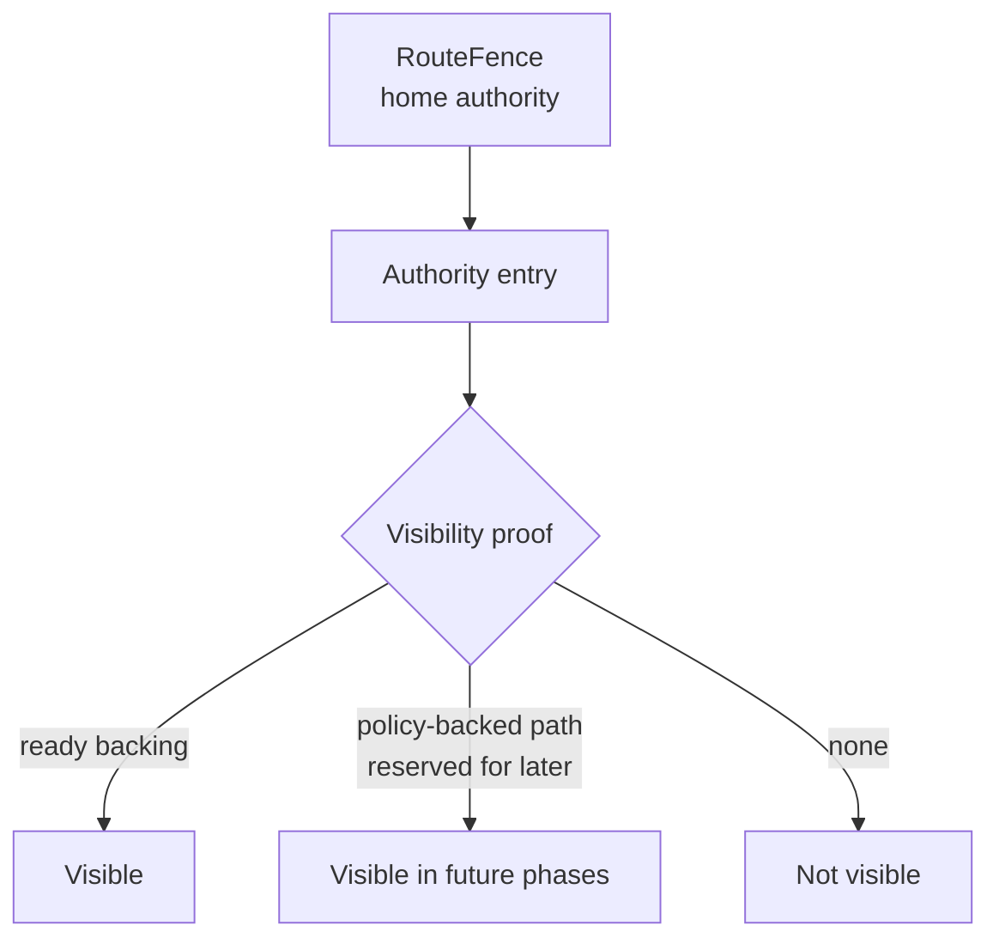

# Summary

After foundation `0092` defines the repository-wide split between profile authority, shared lowering, shared dataplane,
and truth layering, TensorCast must define the exact routed authority semantics for high-cardinality artifacts.

Phase 0 is intentionally narrow:

- it applies only to routed, high-cardinality artifact profiles,
- today that means routed `byte_artifact`,
- it does not redefine the authority model of ordinary GS-backed artifact flows,
- it realizes the high-cardinality routed `AuthorityRecord` defined by `0092`,
- it treats routed `byte_artifact` answers as home-epoch cache-claim answers, not durable per-blob catalog truth,
- it separates routed claim truth, visibility truth, and lifecycle-backed serving capability,
- it makes TTL expiry and explicit claim deletion distinct from mere visibility loss caused by backing failure,
- it states the phase-0 recovery boundary explicitly instead of implying full routed HA semantics that do not yet exist,
- it requires successful routed `HomeBatchGet` to mint a bounded serving capability rather than return optimistic
  metadata.

Phase 0 does not yet define repo-wide `ContentIdentity`, `VerifiedContentDescriptor`, or `BackingIdentity`. Those are
handled by `0091` and `0093`. This phase defines the routed authority semantics that those later phases must
respect.

# Implementation Status

Implemented on 2026-03-09.

Landed outcomes:

- routed claim truth and routed visibility truth are separated in daemon authority state,
- routed visibility is centralized around backing readability instead of daemon-local map presence,
- backing loss downgrades future visibility without erasing routed claim truth,
- daemon-kernel subscribes routed authority state to core runtime replica-eviction events,
- `HomeBatchGet` mints bounded serving capability through expiry-capped `payload_ref` issuance for large payloads,
- routed unreadable backings now surface as `MISS`, while conflicting re-put still observes surviving claim truth.

Verified with:

- `bazel test //daemon:grpc_service_impl_batch_runtime_test --test_env=TENSORCAST_CUDA_BACKEND=fake`
- `bazel test //daemon:grpc_service_impl_batch_redirect_e2e_test --test_env=TENSORCAST_CUDA_BACKEND=fake`
- `bash tools/lint/check_artifact_truth_guardrails.sh`

# Problem Statement

`0087`, `0088`, and `0089` moved TensorCast in the right direction:

- `Artifact` remains the value model,
- `ArtifactSelection` remains the selector contract,
- `byte_artifact` is a profile,
- shared execution is core-owned,
- retained bodies are core-backed instead of daemon heap strings.

However, the current routed byte-artifact implementation still blurs five different questions:

1. Which daemon currently owns the shard route?
2. Has this key already been accepted as the current home-epoch routed claim under join truth?
3. Does the current home daemon currently claim the blob is visible?
4. Is the selected backing actually readable in core/store?
5. Can this specific `HomeBatchGet` response still be served for a bounded lifetime?

Those questions have different authorities, but current behavior still lets daemon-local metadata answer too many of
them.

Today the routed implementation can diverge because:

- `ByteArtifactBodyStore` visibility is driven primarily by daemon-local maps and TTL or fence metadata,
- `BodyHandle` and `payload_ref` still read through core-backed runtime state,
- core can evict or retire replicas independently of daemon authority metadata,
- routed byte-artifact flows do not yet use `StorePolicy` or retention handles as an explicit rematerialization truth
  source,
- successful `HomeBatchGet` does not yet have an explicit semantic requirement to pin or lease the returned serving
  backing for the response lifetime,
- the current implementation has not yet made routed claim truth survive visibility loss as an explicit semantic
  guarantee,
- serving promises are still split between profile-local maps and transport-specific helper state instead of one shared
  lifecycle story.

That creates the long-term failure mode TensorCast must avoid:

- `BatchExists` or `HomeBatchGet` reports an entry as present because authority metadata still exists,
- but the backing is already unreadable in core, or becomes unreadable immediately after `OK`,
- so the real failure appears later on a local loader, `payload_ref` fetch, or body read.

That is architecturally wrong for four reasons:

1. it makes authority truth depend on stale daemon cache state,
2. it turns correctness into a late read-path failure instead of an authority decision,
3. it blurs route truth, routed claim truth, visibility truth, backing truth, and serving truth,
4. it opens the door to a second implicit lifecycle system beside the shared lease/finalizer model TensorCast should be
   converging to.

# Goals / Non-Goals

## Goals

- Define one exact meaning for routed byte-artifact `exists` and `get`.
- Keep Global Store out of the routed per-blob hot path while preserving a precise shard-home contract.
- Define routed `byte_artifact` authority as epoch-scoped cache-claim authority over immutable byte snapshots.
- Separate routed claim truth from routed visibility truth.
- Make routed authority visibility depend on a valid serving proof, not merely on descriptor or invariant metadata.
- Define routed claim-deletion semantics separately from physical backing-loss invisibility.
- Require successful routed `HomeBatchGet` to return a bounded serving capability, not just an optimistic lookup result.
- Define `BodyStore` as an authority-local index and remove any implication that it owns physical backing lifecycle.
- Require core runtime events or equivalent core-backed reconciliation to invalidate stale authority entries.
- Require serving promises to compose with the shared lifecycle kernel rather than grow a profile-private lease system.
- Leave a precise semantic slot for future policy-backed rematerialization without pretending it exists today.

## Non-Goals

- Redefine ordinary GS-backed artifact existence semantics.
- Make home-daemon authority the repo-wide model for every artifact profile.
- Redefine the repository-wide truth lattice from `0092`.
- Define repo-wide `VerifiedContentDescriptor`. That is phase 1.
- Define `BackingIdentity`. That is phase 2 in `0093`.
- Define the shared capability-resolution layer. That is phase 2 in `0093`.
- Provide durable routed claim-truth recovery across daemon restart or shard-home failover. That is a later phase.
- Push routed byte-artifact per-blob truth back into Global Store.
- Introduce a second user-facing policy surface beside `StorePolicy`.
- Redefine routed `byte_artifact` as durable repository catalog truth.

# Architecture & Interfaces

## 1. Scope and authority split

This design applies only to routed profiles whose per-blob authority mode is shard-home routed.

Today that means routed `byte_artifact`.

Ordinary artifact flows remain on their existing GS-backed metadata and replica paths. This design does not move them
onto home-daemon authority.

For routed `byte_artifact`, the authority split is:

| Question | Authority in phase 0 |
| --- | --- |
| which daemon currently owns shard `S` | Global Store shard-home lease |
| under the current `RouteFence`, has blob `B` already been accepted as the current home-epoch routed claim under join truth | current home daemon |
| under the current `RouteFence`, is blob `B` currently visible | current home daemon |
| is the retained backing for `B` currently readable | core/store lifecycle |
| can this specific `HomeBatchGet` response still be served for its promised lifetime | home daemon, by minting a lifecycle-backed serving capability or serve lease tied to core/store pin or lease semantics |

This is the key clarification:

- Global Store remains the authority for routed shard ownership,
- the home daemon remains the authority for routed per-blob cache-claim and visibility answers,
- core/store remains the only authority on physical backing readiness,
- a successful get response must bind those layers together through an explicit lifecycle-backed serving capability,
- none of the above implies that routed `byte_artifact` claims are durable repository catalog truth across epochs.

Later distributed-control protocol unification must preserve this split.
It may standardize routed request and reply shape, but it must not rewrite routed `byte_artifact` per-blob truth as
Global Store catalog truth.

## 1.1 Phase-0 recovery boundary

Phase 0 is a semantic hard-cut for routed answers, not a full routed-HA design.

Route truth is recoverable through Global Store shard-home lease state.

Per-blob routed claim truth and visibility truth are only guaranteed for the currently active home-authority process
state in phase 0 unless and until a later phase adds a recoverable routed authority index or explicit handoff log.

That means:

- if the current home daemon continues running, backing loss must not silently corrupt routed claim truth into optimistic
  visibility,
- if the daemon restarts or shard-home ownership changes without recovered per-blob authority state, phase 0 does not
  promise that prior per-blob routed claim truth survives,
- if a shard lease generation changes, the old generation's visible claim set may legitimately collapse to `MISS`,
- the design must state this limitation explicitly instead of implying restart or failover recovery that the current
  implementation does not provide.

## 2. Routed `AuthorityRecord`

Phase 0 realizes the high-cardinality routed `AuthorityRecord` introduced by `0092`.

Its semantic fields are:

| Routed authority field | Meaning in phase 0 |
| --- | --- |
| route truth | which daemon owns the shard under the active fence |
| claim truth | whether the key has already been accepted as the current home-epoch routed claim under routed join semantics |
| visibility truth | whether future `exists/get` should currently answer success |
| serving capability | whether an already-issued get response may continue serving for its promised lifetime through the shared lifecycle kernel |

Normative rules:

1. Routed claim truth is epoch-scoped cache-publication truth, not durable repository existence truth.
2. Claim truth survives loss of serving proof caused by backing loss or other non-deletion visibility failure.
3. Backing loss, physical eviction, or replica retirement may invalidate visibility truth without erasing claim truth.
4. TTL expiry and explicit claim deletion are separate semantics; they may erase claim truth in phase 0.
5. `BatchExists` and `HomeBatchGet` consult visibility truth, not claim truth alone.
6. `PutIfAbsentJoin` consults claim truth, not current visibility truth alone.
7. Serving capability is per-response lifecycle state and is distinct from future visibility truth.

## 2.1 Routed authority states

Phase 0 should be read as the following routed authority state machine:

| State | Meaning | Future `PutIfAbsentJoin` | Future `exists/get` |
| --- | --- | --- | --- |
| `unclaimed` | no routed claim exists in the current home epoch | may create | `MISS` |
| `claimed_visible` | a routed claim exists and currently has a supported visibility proof | join or conflict against routed claim truth | may return success if a serving capability is minted |
| `claimed_invisible` | a routed claim exists but currently has no supported visibility proof | join or conflict against routed claim truth | `MISS` |
| `claim_deleted` | the routed claim was explicitly deleted or expired in phase 0 | may create again | `MISS` |

Normative transitions:

1. Successful `PutIfAbsentJoin` creates `claimed_visible`.
2. Backing loss or other loss of visibility proof transitions `claimed_visible -> claimed_invisible`.
3. Successful `HomeBatchGet` mints a per-response serving capability over the current claimed state; it does not create
   a new claimed state.
4. TTL expiry or another explicit claim-deletion operation transitions `claimed_visible` or
   `claimed_invisible -> claim_deleted`.
5. Physical backing eviction or retirement alone is not claim deletion; it is a visibility-loss path.
6. Future policy-backed rematerialization may restore `claimed_invisible -> claimed_visible`, but phase 0 does not
   support that path yet.
7. Phase 0 does not define resurrection from `claim_deleted` without a new write; deletion is not the same thing as
   temporary invisibility.

## 3. Semantic contract

For routed `byte_artifact`:

- `exists` means: under the current `RouteFence`, the current home daemon can prove that the current home-epoch routed
  claim is currently servable,
- `get-visible` means: the home daemon can both prove current servability and return a bounded lifecycle-backed serving
  capability for the chosen response path.

This is an authority property, not a best-effort read attempt.

It is also not a durable-catalog statement. For routed `byte_artifact`, a `MISS` answers a current home-epoch cache
question, not a timeless content-existence question.

Normative rules:

1. `BatchExists` must be answered from routed home-authority visibility truth.
2. `HomeBatchGet` success requires both visibility truth and a bounded serving capability.
3. A descriptor, invariant, or digest record alone is not a serving proof.
4. A stale or unreadable retained backing is not a visible artifact.
5. Until explicit policy-backed rematerialization is implemented for routed byte artifacts, a live readable backing is
   the only supported visibility proof.

## 4. Authority visibility proofs

Phase 0 introduces the semantic concept of an authority visibility proof.

Visibility proof families:

| Proof family | Meaning | Phase 0 support |
| --- | --- | --- |
| `ready_backing` | a readable core-backed retained body exists now | required and supported |
| `policy_backed_path` | a policy-scoped rematerialization path exists under the same routed authority | reserved, not yet supported for routed byte artifacts |
| `none` | no current proof of servability | not visible |

Phase-0 hard cut:

- routed byte-artifact visibility is `ready_backing` only,
- if the backing becomes unreadable and there is no explicit future `policy_backed_path`, the entry becomes invisible,
- invisible entries must resolve to `MISS` after route and fence validation succeeds.

## 5. Serving capability

Phase 0 also introduces a distinct semantic concept: a serving capability.

Concrete response carriers may differ:

- a returned `BodyHandle`,
- a returned `payload_ref`,
- an inline payload already materialized into the response,
- a future shared capability type.

Compatibility note:

- a GET-issued `payload_ref` or copied-payload snapshot may preserve already-issued serving continuity for a bounded
  lifetime,
- but that compatibility carrier does not create new routed claim truth and must not be treated as the primary authority
  model for future requests.

But they must all satisfy the same phase-0 contract:

1. a successful routed `HomeBatchGet` must not return `OK` until the home daemon has minted a bounded serving
   capability,
2. the chosen response carrier must keep the selected backing servable for at least the lifetime promised by that
   carrier,
3. for an inline payload response, the promised lifetime is only the successful materialization of response bytes into
   RPC-owned transport memory; the backing may be released afterwards,
4. if the daemon cannot create that capability, `HomeBatchGet` must not return optimistic `OK`,
5. new route ownership or `RouteFence` turnover must stop issuance of new capabilities under the old fence, but must not
   retroactively invalidate an already issued capability before its promised expiry solely because shard ownership
   changed,
6. already issued capability failure must come from explicit lifecycle exhaustion, expiry, release, or backing failure,
   not from a silent profile-local map entry disappearing,
7. future shared capability-resolution work may change the mechanism, but not this semantic requirement.

Phase 0 does not define the long-term shared capability resolver. It does require the routed get path to behave as if
that capability already exists.

## 6. `BodyStore` boundary

`BodyStore` is an authority-local index.

It may cache:

- artifact-scoped authority metadata,
- routed-claim metadata,
- join projection metadata,
- fence scoping metadata,
- TTL metadata,
- a reference to the currently selected retained backing.

It must not be treated as:

- the canonical physical lifecycle ledger,
- a replacement for core backing readiness,
- proof that a body is still readable,
- proof that a serving capability is still valid,
- an independent retention, export, or serve-lease state machine.

Normative rules:

1. `BodyStore` may index backing references; it must not define backing liveness by itself.
2. A `BodyHandle` inside `BodyStore` is a reference into core-owned state, not authority truth by itself.
3. `BodyStore` may own authority metadata cleanup, but not physical backing semantics.
4. `BodyStore` must not become a second lifecycle kernel for serving promises.
5. If `BodyStore` co-locates claim and visibility metadata, loss of backing readability must invalidate visibility truth
   without erasing claim truth for an already claimed key.

## 7. Lifecycle reconciliation

Because core/store owns physical backing lifecycle and the shared lifecycle kernel owns bounded serving promises, routed
authority visibility must reconcile against both layers.

Minimum required behavior:

- core runtime must publish enough lifecycle signal for daemon authority to detect when a retained backing is no longer
  readable for routed serving,
- lifecycle-backed serving promises must pin or lease the returned backing through the promised serve window and release
  it through explicit finalization,
- daemon kernel or equivalent long-lived authority owner must subscribe to those signals or perform an equivalent
  strongly-consistent reconciliation step,
- on loss of the only supported visibility proof, the authority entry must transition to invisible before future
  `exists/get` answers report success.

Current grounding:

- `RuntimeContextEvents` already exposes `kReplicaLoaded`, `kReplicaEvicted`, and ingestion events,
- that is not yet a complete routed byte-artifact authority lifecycle vocabulary,
- phase 0 may add explicit `kReplicaRetired` or another equivalent signal if `kReplicaEvicted` alone is insufficient to
  preserve the semantic contract.

Additional rule:

- event-driven reconciliation keeps future routed visibility answers honest,
- it is not a substitute for pinning or leasing an already issued serving capability.

Normative rule:

- correctness must not depend on waiting for `BodyHandle::make_loader()`, `read_range()`, or a later `payload_ref`
  redemption to fail after authority already reported the artifact as visible or gettable.

## 8. API semantics

### 8.1 `HomeBatchExists` and external `BatchExists`

`HomeBatchExists` is the fenced authority primitive.

External `BatchExists` is a routed wrapper and, once route resolution succeeds, must preserve the same per-item truth.

If route and fence validation succeed:

- return `OK` only for visible entries,
- return `MISS` for entries with no current serving proof,
- do not return `OK` based only on stale authority metadata.

If route or fence validation fails:

- stale or mismatched fence remains a routing correctness error,
- route ambiguity or unavailable home authority remains `UNAVAILABLE`,
- these cases are separate from per-blob visibility truth.

### 8.2 `HomeBatchGet`

If route and fence validation succeed:

- return `OK` only for entries that are both visible and covered by a freshly minted serving capability,
- return `MISS` for entries with no current serving proof,
- return `UNAVAILABLE` when the daemon can identify the routed authority correctly but cannot materialize the promised
  serving capability because of a transient serving-path failure,
- do not let "authority says present but later body read failed" remain the steady-state error mode,
- treat the serving-capability mint point as the linearization point for routed get success.

### 8.3 `PutIfAbsentJoin`

Join and conflict semantics remain authority decisions over content projection and route scope.

Phase 0 does not change join truth itself. It changes only the visibility and serving contract after routed claim
acceptance:

- a claimed entry becomes visible only while it retains a valid visibility proof,
- successful get remains valid only while the returned serving capability remains in force,
- if the proof is lost later, the entry is no longer visible under future `exists/get`,
- if the proof is lost later because backing disappeared or serving readiness was lost, the entry still remains claimed
  for future routed conflict and join decisions,
- if the entry later expires by TTL or is explicitly claim-deleted, phase 0 treats that as deletion and future
  `PutIfAbsentJoin` may create again,
- physical backing eviction or retirement alone is not claim deletion,
- a future phase may reintroduce visibility through `policy_backed_path`, but only for claimed-not-deleted entries and
  only after that path is explicit and testable.

## 9. Relationship to `StorePolicy`, retention, and future rematerialization

`StorePolicy` remains the only durability and placement declaration in TensorCast.

Phase 0 does not yet make routed byte-artifact visibility depend on `StorePolicy`-backed rematerialization because that
integration is not complete today.

The semantic rule is therefore:

- `policy_backed_path` is reserved as the future mechanism by which routed byte-artifact visibility may remain true
  without a currently loaded backing,
- a future `policy_backed_path` must still terminate in a serving capability before `HomeBatchGet` returns `OK`,
- a future `policy_backed_path` may restore visibility for claimed-but-invisible entries, but it does not by itself
  change the phase-0 deletion semantics of TTL expiry or explicit claim deletion,
- until that path is implemented, routed byte-artifact existence remains a strict current-servability contract for the
  current home-epoch claim.

This later integration is now scoped by `0093`, which defines:

- when `policy_backed_path` becomes an actionable visibility proof,
- how `ServingCapability` is minted by the lifecycle kernel rather than by authority-local storage,
- how `StorePolicy` becomes the single declarative input to policy-backed restoration.

This is deliberate. It avoids pretending that stable retention, retention handles, or durable placement policy already
provide routed per-blob truth when the current implementation does not yet wire them into routed authority decisions.

## 10. Naming Compliance

Planned interface names introduced by this design:

| Interface | Language | Rule | Result |
| --- | --- | --- | --- |
| `AuthorityVisibilityKind` | C++ enum class | `PascalCase` | pass |
| `AuthorityRecord` | C++ struct | `PascalCase` | pass |
| `ServingCapability` | C++ struct | `PascalCase` | pass |
| `reconcile_authority_entry` | C++ function | `snake_case` | pass |
| `is_authority_entry_visible` | C++ function | `snake_case` | pass |
| `mint_serving_capability` | C++ function | `snake_case` | pass |

# Schema Changes

No persistent schema changes are required for phase 0.

This design changes only:

- routed byte-artifact authority semantics,
- the routed boundary between GS route truth, home-daemon claim and visibility truth, core backing truth, and
  capability,
- daemon-local lifecycle reconciliation behavior,
- the meaning of routed `exists/get` responses after backing loss.

# Trade-offs & Risks

- The design intentionally makes routed byte-artifact visibility stricter in the short term.
  Some current code paths that implicitly relied on stale metadata may now return `MISS` sooner.
- Requiring get-time serving capabilities adds short-term implementation cost because current routed paths do not yet have
  a fully unified capability layer.
- Event-driven reconciliation adds daemon complexity.
  That complexity is still preferable to keeping a second hidden lifecycle system in `BodyStore`.
- Phase 0 remains intentionally honest about recovery limits.
  Until a later phase adds a recoverable routed authority index or handoff mechanism, restart or failover cannot be
  described as preserving per-blob routed claim truth.
- Until policy-backed rematerialization is explicitly integrated, routed byte-artifact visibility remains a
  current-servability contract for the current home-epoch claim rather than a durable-reconstructability contract.
  This is a feature, not a regression: it makes the system honest about what it can prove today.

# Compatibility & Acceptance Criteria

This is a pre-launch hard-cut semantic clarification for routed `byte_artifact`. No compatibility shim is required.

Acceptance criteria:

- ordinary GS-backed artifact flows remain outside this design's authority contract,
- routed `byte_artifact` is explicitly described as immutable byte-value profile plus epoch-scoped routed cache claim,
- routed claim truth is explicitly distinct from routed visibility truth,
- the document explicitly scopes phase-0 recovery and does not imply restart or failover preservation of routed per-blob
  claim truth unless implementation adds it,
- later routed protocol designs may unify transport and owner-reply shape, but they do not change the GS/home-daemon/
  core-store/lifecycle authority split defined here,
- `BatchExists` and `HomeBatchGet` cannot report success for an entry whose only retained backing is no longer readable
  in core/store,
- `HomeBatchGet` cannot report `OK` unless it has also produced a bounded serving capability,
- route handoff or fence turnover stops new serving-capability issuance under the old fence without retroactively
  revoking already issued capabilities before their promised expiry,
- `BodyStore` is documented and implemented as an authority-local index, not as a physical lifecycle owner,
- routed byte-artifact visibility depends on a serving proof, not only on invariant or descriptor presence,
- daemon authority invalidation is driven by core runtime events or an equivalent core-backed reconciliation step,
- losing the only visibility proof does not by itself erase routed claim truth,
- physical backing eviction or retirement is documented as visibility loss rather than claim deletion,
- TTL expiry or explicit claim deletion is documented as deletion in phase 0 rather than as mere invisibility,
- tests cover:
  - visibility loss after `clear_mem` or explicit backing retirement,
  - visibility loss after route-stable backing cleanup,
  - TTL expiry plus backing cleanup,
  - a conflicting re-put after backing loss still observing existing routed claim truth,
  - a re-put after TTL expiry or explicit claim deletion being treated as a new create in phase 0,
  - a successful routed `HomeBatchGet` surviving immediate concurrent backing-retirement pressure until the returned
    capability expires or is released,
  - an already issued serving capability not being retroactively revoked solely by route handoff before expiry,
  - no late read-path failure because authority answered from stale metadata.

# References

- [0092 Artifact Profiles, Shared Dataplane, and Truth Layering](./0092-artifact-profiles-shared-dataplane-and-truth-layering.md)
- [0039 Artifact-First TensorCast SDK API](./0039-artifact-first-sdk.md)
- [0055 Programmable API Design (Artifact-First)](./0055-programmable-framework.md)
- [0078 Selection-First Artifact Retrieval And Materialization Hard Cut](./0078-selection-first-artifact-retrieval.md)
- [0087 Unified Artifact Runtime and Routed Byte Artifact Architecture](./0087-unified-artifact-runtime-and-routed-byte-artifact-architecture.md)
- [0088 Unified Artifact Profiles with Shared Dataplane](./0088-unified-artifact-profiles-with-shared-dataplane.md)
- [0089 Core-Backed Body Handles and Backing Policy](./0089-core-backed-body-handles-and-backing-policy.md)
- [StorePolicy And Persistence](../architecture/api/policy-persistence.md)
