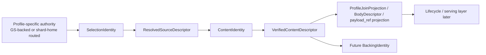

# Summary

After foundation `0092` defines the repository-wide selection, content, and lifecycle kernels plus the split between
backing truth and authority-local state, phase 1 defines the shared selection/content verification seam.

This design is repo-wide, but it sits below profile-specific authority models:

- it does not move all artifacts onto home-daemon authority,
- it does not redefine which profiles are GS-backed versus shard-home routed,
- it defines the shared truth chain that all profiles should use once content is selected, sourced, and verified.

Phase 1 introduces six shared seams:

- `SelectionIdentity`: the typed identity of a resolved artifact selection,
- `ResolvedSourceDescriptor`: the exact-size and provenance contract for a resolved byte source before lowering,
- `SemanticLayoutIdentity`: the stable semantic layout identity of the verified content,
- `ContentIdentity`: the stable selection-agnostic identity of the verified content,
- `VerifiedContentDescriptor`: the stable repo-wide content-truth descriptor that carries `ContentIdentity`,
- `VerificationRecord`: the companion provenance and audit record for how verification happened.

Stable content truth is minted only after canonicalization:

- multiple proof families may feed the shared seam,
- but only canonicalized semantic layout truth may enter `ContentIdentity`,
- proof-kind-specific or selection-relative evidence belongs in `VerificationRecord` unless it is explicitly
  canonicalized first.

The long-term rule is:

- profile authority decides whether an object should be accepted or served,
- exact source size is established before lowering,
- authoritative content truth is minted once through the shared seam,
- `SelectionIdentity` remains a sibling object, not a field collapsed into stable content equality,
- profile-specific join or conflict semantics derive from shared content truth through explicit projection instead of
  redefining content equality,
- downstream consumers such as `BodyStore`, `payload_ref`, retention, registration, seal, and future publish flows
  project from shared content truth or verify against it,
- downstream consumers do not mint parallel content-truth objects of their own.

Phase 1 does not yet define `BackingIdentity` or the shared serving-capability resolver. It unifies the truth chain that
those later phases must consume.

Implementation sequencing note:

- `0091A` may land first:
  - `SelectionIdentity`,
  - `ResolvedSourceDescriptor`,
  - the shared descriptor-producing seam and exact-size enforcement.
- `0091B` may then land:
  - `SemanticLayoutIdentity`,
  - `ContentIdentity`,
  - `VerifiedContentDescriptor`,
  - `VerificationRecord`,
  - and the canonicalization rules that make stable content equality repo-wide and cross-language.

These are implementation subphases of phase 1, not competing semantic targets.

Normative implementation rule:

- `0091A` may use transitional seam plumbing seeded by existing shared verification outputs, but it must not ossify a
  second long-term content-equality model beside the final `ContentIdentity`-based design.

# Implementation Status

Implemented on 2026-03-09.

Landed outcomes:

- typed `SelectionIdentity` is available in shared C++ and Python helpers,
- `ResolvedSourceDescriptor` is authoritative and exact-size equality is enforced in shared lowering,
- shared truth types now include `SemanticLayoutIdentity`, `ContentIdentity`, `VerifiedContentDescriptor`, and `VerificationRecord`,
- routed byte-artifact staging and GET metadata projection are descriptor-driven,
- ordinary registration and seal flows emit the same shared descriptor family,
- authoritative digest minting is constrained by `tools/lint/check_artifact_truth_guardrails.sh`.

Verified with:

- `bazel test //core/common:selection_identity_test --test_env=TENSORCAST_CUDA_BACKEND=fake`
- `bazel test //daemon:retention_registry_test --test_env=TENSORCAST_CUDA_BACKEND=fake`
- `bazel test //core/store/runtime/ingestion:materialization_facade_test --test_env=TENSORCAST_CUDA_BACKEND=fake`
- `bazel test //core/store/runtime/metadata:metadata_gateway_test --test_env=TENSORCAST_CUDA_BACKEND=fake`
- `bazel test //daemon:grpc_service_impl_batch_runtime_test --test_env=TENSORCAST_CUDA_BACKEND=fake`
- `bazel test //daemon:grpc_service_impl_batch_redirect_e2e_test --test_env=TENSORCAST_CUDA_BACKEND=fake`
- `bazel test //core/store:store_engine_test --test_env=TENSORCAST_CUDA_BACKEND=fake`
- `pytest tests/python/test_selection_identity_vectors.py`
- `bash tools/lint/check_artifact_truth_guardrails.sh`

# Problem Statement

TensorCast already has a strong selection model and a shared dataplane, but it still lacks a single typed repo-wide
proof family for "what content was authoritatively verified" that is distinct from both selection identity and backing
identity.

Current problems:

- `core/common/selection_identity.*` and `tensorcast/common/selection_identity.py` expose hash helpers, but not a typed
  repo-wide `SelectionIdentity`,
- `RetentionRegistry` keys retention state only by `{logical_layout_hash, selection_hash}` instead of including
  `artifact_id`, so it does not have the full selection identity,
- `ArtifactLoweringResult` currently carries only a narrow retained-body verification result, not a shared descriptor
  family,
- common-path lowering can still be shaped from request-side `byte_length` rather than from an exact source descriptor,
- routed `PutIfAbsentInvariant` is still too close to content truth in byte-artifact flows,
- `BodyDescriptor` remains a body-local truth carrier even though its fields are trying to express a more general
  content concept,
- `payload_ref` metadata still depends on caller-supplied digest plumbing rather than projecting directly from shared
  verified content,
- the repository does not yet have a stable `ContentIdentity` that is explicitly independent of `artifact_id`,
  `SelectionIdentity`, and backing-local state,
- the repository still lacks a fully canonical equality encoding for stable content identity across languages and proof
  families,
- registration, seal, and routed byte-artifact flows still have different proof structs for closely related questions.

That creates three long-term architectural risks:

1. TensorCast keeps one shared executor but multiple incompatible truth channels above it.
2. Request projections continue to over-constrain execution instead of being validated against a typed verified result.
3. Different artifact profiles keep drifting apart in proof language even when they are asking the same shared question.

# Goals / Non-Goals

## Goals

- Introduce a typed repo-wide `SelectionIdentity`.
- Introduce a shared `ResolvedSourceDescriptor` so common-path execution knows exact source size before lowering.
- Introduce a stable repo-wide `SemanticLayoutIdentity`, `ContentIdentity`, and `VerifiedContentDescriptor`.
- Separate stable content truth from verification provenance by introducing `VerificationRecord`.
- Keep stable content truth separate from `SelectionIdentity`.
- Require one canonical minting rule so the same verified content yields the same stable identity across proof families.
- Define a canonical cross-language equality encoding for `ContentIdentity`.
- Make routed byte-artifact invariant checks descriptor-driven rather than invariant-owned.
- Make `payload_ref` metadata projection descriptor-driven rather than caller-maintained.
- Map canonical artifact, selected/view artifact, registration, seal, and routed byte-artifact results into one shared
  descriptor family.
- Define the boundary between shared content truth and profile-specific join or conflict projection.

## Non-Goals

- Redefine profile authority modes or require every artifact to use home-daemon routing.
- Define `BackingIdentity`. That is a later phase.
- Define the shared capability-resolution layer. That is a later phase.
- Put residency, exportability, lease state, or wall-clock observation into `VerifiedContentDescriptor`.
- Put `SelectionIdentity` inside stable content equality.
- Keep a body-private descriptor model as a second long-term source of truth under `daemon/service`.
- Expose backing identity or low-level proof internals as new SDK user-facing APIs.
- Redefine profile-specific join equality by silently changing shared `ContentIdentity` equality.

# Architecture & Interfaces

## 1. Scope and layering

Phase 1 is the repo-wide shared truth layer below profile-specific authority.

That means:

- routed `byte_artifact` may keep home-daemon authority,
- ordinary artifact registration and materialization may keep GS-backed metadata authority,
- but once a profile has selected content and resolved a source, it should emit the same shared proof objects.

Shared question split:

| Question | Shared layer introduced or clarified here |
| --- | --- |
| which semantic object did the user select | `SelectionIdentity` |
| what exact source shape did lowering consume | `ResolvedSourceDescriptor` |
| what content was authoritatively verified independent of request context | `ContentIdentity` |
| what stable descriptor should downstream consumers project from | `VerifiedContentDescriptor` |
| how and when was that content verified | `VerificationRecord` |
| what join or conflict tuple a profile uses | profile-specific projection from shared descriptor, not shared content truth |
| where is it backed and how can it be served | later phases |

### 1.1 Implementation subphases

Phase 1 is intentionally implementable in two subphases.

`0091A` scope:

- land typed `SelectionIdentity`,
- land `ResolvedSourceDescriptor`,
- move exact-size enforcement into the shared seam,
- extend shared result plumbing so descriptor production is shared-seam-owned rather than daemon- or body-owned.

`0091B` scope:

- land `SemanticLayoutIdentity`,
- land canonical `ContentIdentity`,
- land final `VerifiedContentDescriptor`,
- land `VerificationRecord`,
- land explicit canonicalization rules for semantic layout and digest equality across proof families and languages.

Guardrail:

- `0091A` must be strictly preparatory for `0091B`; it must not introduce a temporary descriptor equality model that
  later competes with `ContentIdentity`.

## 2. `SelectionIdentity`

Phase 1 introduces a typed repo-wide `SelectionIdentity`.

Required fields:

- `artifact_id`
- `logical_layout_hash`
- `selection_hash`

Normative rules:

1. `SelectionIdentity` is the typed key for selection truth inside the repo.
2. Any internal key that currently uses only `{logical_layout_hash, selection_hash}` must migrate to include
   `artifact_id`.
3. `SelectionIdentity` must be constructible from a validated `ArtifactSelection` in both C++ and Python helper
   families.
4. `SelectionIdentity` is not `BackingIdentity`; it names the semantic object selected by the user.

## 3. `ResolvedSourceDescriptor`

Phase 1 makes exact source sizing a first-class shared seam.

Purpose:

- resolve the source before lowering,
- establish exact source size and source provenance,
- prevent request projections from silently truncating or reshaping the source.

Minimum required fields:

- `source_kind`
- `exact_size_bytes`
- `size_is_authoritative`
- optional provenance flags describing whether the source was resolved locally, remotely, or from an already-verified
  source

Normative rules:

1. Common-path lowering must not build an identity byte-range map from request-side size alone when the resolved source
   can provide authoritative exact size.
2. For identity-map body staging, request-side byte length must equal authoritative exact source size.
3. "source smaller than required" is insufficient validation for identity-map staging; exact-size equality is required
   in those flows.
4. `ResolvedSourceDescriptor` is not content truth. It describes source shape and provenance before verification.

## 4. `SemanticLayoutIdentity`

Phase 1 introduces a stable semantic layout identity as part of repo-wide content truth.

Minimum required fields:

- `kind`
- `value`

Recommended kinds:

- `kNamedLayoutId`
- `kCanonicalIndexDigest`
- `kFixedProfileLayout`
- `kCanonicalizedProjectionDigest`

Normative rules:

1. `SemanticLayoutIdentity` must be stable for the same semantic layout, independent of where or when verification ran.
2. It must be sufficient to project existing profile-level layout contracts.
3. For routed `byte_artifact`, the existing join `layout_id` must remain derivable from this identity.
4. `SemanticLayoutIdentity` is semantic truth, not an audit log of how that truth was established.
5. `SemanticLayoutIdentity` is distinct from `SelectionIdentity`: the former names the verified semantic layout, while the
   latter names the user-selected semantic object.
6. Selection-relative or flow-specific proof kinds may feed the shared verification seam, but they must be canonicalized
   before minting stable `SemanticLayoutIdentity`.
7. `kSelectedIndexDigest` and similar request-relative proof forms belong in `VerificationRecord` unless an explicit
   deterministic canonicalization rule proves they map to the same stable semantic layout across flows.

## 5. `ContentIdentity`

Phase 1 introduces a stable selection-agnostic content identity.

Minimum required fields:

| Field | Meaning |
| --- | --- |
| `semantic_layout_identity` | stable semantic layout identity of the verified content |
| `logical_size_bytes` | logical byte length of the verified content |
| `digest_alg` | canonical digest algorithm token |
| `digest_bytes` | canonical digest bytes |

Normative rules:

1. `ContentIdentity` is the stable equality key for verified content.
2. It must be independent of `artifact_id`, `SelectionIdentity`, `BackingIdentity`, runtime residency, exportability,
   and wall-clock observation.
3. The same verified content must yield the same `ContentIdentity` even if verification is repeated later through a
   different code path or under a different artifact id.
4. `ContentIdentity` equality must have one deterministic cross-language encoding; independent textual and binary
   encodings that can drift are forbidden.
5. `digest_alg` must come from a shared canonical registry and use one normalized spelling for equality.
6. `digest_bytes` are the canonical equality payload; any lowercase hex or debug string form is a derived projection,
   not a second equality channel.
7. The shared seam must define one canonical digest byte domain for the verified content it is naming. Different proof
   families must canonicalize to that same domain before minting `ContentIdentity`.
8. It must live in a shared core/common or store runtime namespace, not in a body-only namespace.
9. Verification method, proof family, and request-relative intermediate layout evidence must not change
   `ContentIdentity` once the semantic layout has been canonicalized.

## 6. `VerifiedContentDescriptor`

Phase 1 introduces the shared verified-content descriptor family.

Minimum required fields:

| Field | Meaning |
| --- | --- |
| `content_identity` | stable selection-agnostic identity of the verified content |

Normative rules:

1. `VerifiedContentDescriptor` is stable content truth only.
2. It must not embed `SelectionIdentity` as part of stable content equality.
3. It must not carry residency, export, lease, wall-clock observation, or runtime state fields.
4. Convenience accessors that mirror digest, size, or layout from `content_identity` are allowed, but a second
   driftable copy of those fields is not.
5. Only the shared verification seam may mint new authoritative `VerifiedContentDescriptor` instances.
6. Shared adapters such as `BodyDescriptor` may project from it, but they must not mint a second authoritative
   content-truth object with different stable equality.

## 6.1 Profile join-projection boundary

Phase 1 also fixes one repository boundary explicitly:

- shared content truth answers "what content was verified",
- profile authority answers "what join or conflict tuple does this profile use".

Normative rules:

1. If a profile needs join or conflict equality, it must define a deterministic projection from
   `VerifiedContentDescriptor` plus profile-local rules.
2. A profile join projection is not a second authoritative content-truth object.
3. Changing a profile's join projection is an authority-model change, not a change to shared content-kernel equality.
4. The shared seam must not silently absorb profile-specific join semantics into `ContentIdentity`.

## 7. `VerificationRecord`

Phase 1 introduces a companion provenance and audit record for the shared seam.

Minimum required fields:

| Field | Meaning |
| --- | --- |
| `verification_method` | how shared execution or shared verification produced the proof |
| `verified_at` | wall-clock time of verification |
| `layout_proof_kind` | how semantic layout identity was established |
| `layout_proof_value` | supporting value for that layout proof |

Recommended enums:

- `LayoutProofKind`
  - `kCanonicalIndexDigest`
  - `kSelectedIndexDigest`
  - `kFixedProfileDigest`
  - `kProjectionOnly`
- `VerificationMethod`
  - `kSharedExecutorFullReadDigest`
  - `kSharedExecutorStreamDigest`
  - `kRegistrationCommit`
  - `kSealCommit`

Normative rules:

1. `VerificationRecord` is provenance, not semantic content truth.
2. It may vary across repeated verification of the same content.
3. It must not be used as the equality key for content truth, join truth, or retention identity.

## 8. Shared seam production rules

Phase 1 extends the shared seam so `ArtifactLoweringResult` or the equivalent core-owned result family can return a
`VerifiedContentDescriptor` and, when needed, a companion `VerificationRecord`.

Normative rules:

1. Shared execution may still use a full reread implementation initially, but authoritative proof must be emitted by the
   shared seam, not by daemon/body-specific helpers.
2. The shared seam may ingest multiple proof families, but it must canonicalize semantic layout evidence before minting
   stable `SemanticLayoutIdentity`, `ContentIdentity`, and `VerifiedContentDescriptor`.
3. The shared seam is also responsible for canonical digest normalization:
   - canonical algorithm token,
   - canonical digest bytes,
   - deterministic equality encoding.
4. If a flow can only provide selection-relative or method-specific layout evidence, that evidence must remain in
   `VerificationRecord` until canonicalization is available; the flow must not mint a distinct stable descriptor merely
   because it used a different proof family.
5. Common-path digest or layout verification outside the shared seam is forbidden once the new descriptor is available
   if that path is attempting to mint new authoritative content truth.
6. Downstream components may still recompute digest or layout checks only to validate bytes against an existing
   descriptor for transport integrity, repair, or debug; those checks must not mint a second authoritative descriptor.
7. Registration and seal flows must map their completion proof into the same descriptor family rather than returning
   private one-off truth structs forever.
8. Shared result families may emit `SelectionIdentity` alongside `VerifiedContentDescriptor` when a caller needs both;
   they must not achieve that by embedding selection context into stable content equality.

## 9. Routed byte-artifact adaptation

Phase 1 changes routed byte-artifact semantics in one important way:

- `PutIfAbsentInvariant` becomes a profile join projection,
- `VerifiedContentDescriptor` becomes the canonical content truth,
- `BodyDescriptor` becomes a routed local projection or compatibility adapter, not the canonical truth object,
- `BodyStore` stores the shared descriptor or a one-to-one projection from it, not a second independent truth record.

That means:

- `ArtifactProfileRegistry` validates an invariant against a byte-artifact join projection derived from the descriptor,
- `BodyStore` derives routed join truth from shared descriptor truth instead of redefining content truth,
- `payload_ref` metadata is projected from the descriptor rather than hand-maintained in parallel,
- consumer-side `payload_ref` fetch may verify bytes against the descriptor digest for transport integrity,
- routed byte-artifact `layout_id` must remain derivable from `semantic_layout_identity`.

Additional rule:

- until `BackingIdentity` lands, `BodyDescriptor` may continue to carry temporary backing-local fields such as
  `physical_artifact_id`, but those fields are not shared content truth and must not redefine descriptor equality.
- in phase 1, routed byte-artifact join projection remains the current
  `{layout_id, byte_length, payload_digest_alg, payload_digest_hex}` tuple, but that tuple is explicitly a
  profile-specific projection from shared descriptor truth rather than the descriptor itself.

## 10. Ordinary artifact adoption

Phase 1 is not limited to routed byte artifacts.

Required long-term direction:

- canonical artifact materialization,
- selected or viewed artifact materialization,
- registration commit,
- seal results

must all be able to project into the same `VerifiedContentDescriptor` family.

This does not move those flows onto home-daemon authority. It only requires them to stop inventing incompatible proof
objects for the same shared question.

Current grounding:

- `VerifiedArtifactContent` in shared lowering is the seed of this direction,
- registration and seal should evolve to map into the shared family rather than continue returning flow-private truth
  structs.

## 11. Naming Compliance

Planned interface names introduced by this design:

| Interface | Language | Rule | Result |
| --- | --- | --- | --- |
| `SelectionIdentity` | C++/Python type | `PascalCase` | pass |
| `ResolvedSourceDescriptor` | C++/Python type | `PascalCase` | pass |
| `SemanticLayoutIdentity` | C++/Python type | `PascalCase` | pass |
| `ContentIdentity` | C++/Python type | `PascalCase` | pass |
| `VerifiedContentDescriptor` | C++/Python type | `PascalCase` | pass |
| `VerificationRecord` | C++/Python type | `PascalCase` | pass |
| `build_selection_identity` | C++/Python helper | `snake_case` | pass |
| `validate_exact_source_size` | C++ helper | `snake_case` | pass |
| `project_put_if_absent_invariant` | C++ helper | `snake_case` | pass |
| `verify_payload_against_descriptor` | C++ helper | `snake_case` | pass |

# Schema Changes

No persistent schema changes are required for phase 1.

This phase changes:

- internal typed truth and provenance models,
- shared ingestion and verification result shapes,
- routed byte-artifact invariant and payload-ref projection rules,
- the cross-profile contract for registration and seal proof outputs.

# Trade-offs & Risks

- Introducing typed identity and proof models will cause broad internal churn.
  That is acceptable because the current state is already carrying the same concepts in ad hoc untyped form.
- Introducing `ContentIdentity` adds one more named layer, but it removes the more dangerous ambiguity between
  selection-scoped identity and content-scoped identity.
- Splitting stable content truth from provenance introduces one more type, but it removes a more dangerous long-term
  ambiguity about whether timestamps and verification method belong in equality or join semantics.
- Canonicalizing multiple proof families before minting stable equality may require some flows to carry richer
  intermediate provenance.
  That is preferable to allowing proof-kind drift to leak into stable content equality.
- Exact-size validation may turn previously accepted truncated inputs into hard failures.
  That is a correctness fix, not a compatibility problem.
- A first implementation may still produce `VerifiedContentDescriptor` using a shared full reread path.
  That is acceptable only if authoritative proof stays centralized in the shared seam and later optimization can improve
  implementation without changing semantics.
- Migrating `BodyDescriptor` to a projection role may surface latent routed byte-artifact assumptions that were relying
  on body-local truth.

# Compatibility & Acceptance Criteria

This is a pre-launch hard cut for internal proof semantics. No compatibility shim is required.

Acceptance criteria:

- a typed `SelectionIdentity` exists and includes `artifact_id`,
- a stable selection-agnostic `ContentIdentity` exists,
- `RetentionRegistry` or equivalent internal consumers stop using hash-only selection keys,
- a shared `ResolvedSourceDescriptor` exists and exact-size equality is enforced for identity-map body staging,
- a stable `VerifiedContentDescriptor` exists, excludes wall-clock or runtime observation fields, and does not embed
  `SelectionIdentity` as part of stable content equality,
- `ContentIdentity` equality has one explicit cross-language canonical encoding, including normalized digest algorithm and
  canonical digest bytes,
- `VerificationRecord` or the equivalent provenance carrier exists separately from stable content truth,
- `ArtifactLoweringResult` or equivalent shared result family can carry `VerifiedContentDescriptor`,
- canonicalization rules are explicit so the same verified content yields the same `ContentIdentity` across artifact ids,
  verification methods, and layout-proof families,
- shared content truth and profile-specific join projection are explicitly separate concepts,
- routed byte-artifact invariant validation, `BodyDescriptor`, and `payload_ref` metadata are descriptor-driven
  projections rather than independent truth records,
- consumer-side transport verification may re-check bytes against an existing descriptor but must not mint a new
  authoritative descriptor,
- ordinary GS-backed artifact flows adopt the shared descriptor family without being moved onto home-daemon authority,
- at least one ordinary artifact path such as registration or seal and at least one routed byte-artifact path emit the
  same `VerifiedContentDescriptor` family,
- tests cover:
  - selection-identity construction and collision resistance with differing `artifact_id`,
  - same verified content under differing artifact ids producing the same `ContentIdentity`,
  - same verified content proven through different verification methods or proof families still producing the same stable
    `ContentIdentity` after canonicalization,
  - canonical digest normalization producing the same `ContentIdentity` across language boundaries and representation
    forms,
  - exact-size enforcement for routed byte-artifact staging,
  - stable descriptor equality across repeated verification of the same content,
  - descriptor-driven invariant validation using the routed byte-artifact join projection rather than descriptor equality
    by accident,
  - payload-ref metadata projection from descriptor,
  - shared seam descriptor emission for at least one ordinary artifact path and one routed byte-artifact path.

# References

- [0092 Artifact Profiles, Shared Dataplane, and Truth Layering](./0092-artifact-profiles-shared-dataplane-and-truth-layering.md)
- [0078 Selection-First Artifact Retrieval And Materialization Hard Cut](./0078-selection-first-artifact-retrieval.md)
- [0088 Unified Artifact Profiles with Shared Dataplane](./0088-unified-artifact-profiles-with-shared-dataplane.md)
- [0089 Core-Backed Body Handles and Backing Policy](./0089-core-backed-body-handles-and-backing-policy.md)
- [0090 Routed Existence Semantics and Single Authority Truth](./0090-existence-semantics-and-single-authority-truth.md)
