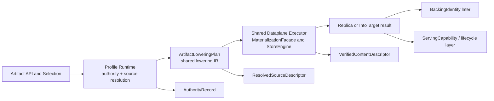

# Summary

TensorCast needs one repository-wide foundation for two artifact families:

- ordinary artifacts that already use selection-first, GS-backed retrieval and materialization,
- high-cardinality artifacts whose authority model may differ, but whose execution substrate must still be shared.

This foundation defines the hard architectural split that later phases must preserve:

- profile semantics and authority may differ,
- lowering and dataplane execution must converge,
- selection, content, and lifecycle are the three repository-wide semantic kernels,
- backing truth and authority-local state are distinct overlay layers on top of those kernels,
- serving capability belongs to the lifecycle kernel and composes over backing truth,
- routed `byte_artifact` remains an artifact value profile, but its routed authority semantics are epoch-scoped cache
  claims rather than durable per-blob catalog truth,
- any state that changes future join, idempotency, first-writer, or conflict outcomes must be recoverable truth or be
  explicitly scoped as ephemeral and non-HA,
- `0090` and `0091` are follow-on phases that refine this foundation rather than redefining it.

# Implementation Status

Implemented on 2026-03-09.

Landed outcomes:

- `ArtifactProfileRegistry` now exposes explicit artifact-family and authority-model traits,
- ordinary-profile classification no longer silently treats invalid artifact ids as ordinary artifacts,
- shared truth-layer types were introduced for source, content, verification, backing, authority, and serving seams,
- `lower_to_artifact_plan(...)` became the shared lowering helper for profile-specific staging into the common executor,
- daemon-side byte-artifact paths now project authority and serving state through the shared layering,
- GET-issued `payload_ref` capabilities are capped by the authority visibility window that minted them.

Verified with:

- `bazel test //core/store/runtime/ingestion:materialization_facade_test --test_env=TENSORCAST_CUDA_BACKEND=fake`
- `bazel test //daemon:grpc_service_impl_batch_runtime_test --test_env=TENSORCAST_CUDA_BACKEND=fake`

# Problem Statement

The repository already contains the beginnings of the target architecture:

- ordinary artifact retrieval is selection-first,
- `MaterializeReplica` and `MaterializeIntoTarget` already reuse the shared core executor,
- high-cardinality `byte_artifact` flows are already partially lowering into `ArtifactLoweringPlan`,
- `0088` and `0089` already reject a second profile-private copy engine.

However, the repository still lacks one explicit top-level contract for how ordinary and high-cardinality artifacts are
supposed to coexist.

Current tensions:

1. profile semantics are implicit and unevenly encoded,
2. identity kind (`mi2:` or `cgid:`) is too easy to confuse with profile,
3. high-cardinality routed flows still carry authority-specific transport and truth objects that are not yet cleanly
   separated,
4. routed `byte_artifact` still oscillates between "artifact" language and "cache" language instead of declaring its
   value layer and authority layer separately,
5. shared truth objects are not yet separated from backing-local, lifecycle-local, or request-local state,
6. some shared executor paths lower through a canonical IR while other paths still handcraft call arguments.

Without a foundation document, later phase docs can each fix a local problem while reintroducing a global one.

# Goals / Non-Goals

## Goals

- Define the repository-wide architecture for ordinary artifacts and high-cardinality artifacts.
- Make profile an explicit architectural dimension separate from artifact-id kind.
- Define one hard split between authority plane, lowering seam, and shared dataplane.
- Define the three repository-wide semantic kernels:
  - selection,
  - content,
  - lifecycle.
- Define the repository-wide layering between `SelectionIdentity`, source truth, content truth, backing truth, serving
  capability, and authority-local state.
- Define routed `byte_artifact` as:
  - an immutable byte-value artifact profile at the value layer,
  - an epoch-scoped cache-claim system at the routed authority layer.
- Define the recoverability boundary for truth objects that affect future semantic outcomes across requests.
- Define the execution order of follow-on work:
  - foundation first,
  - `0090` second,
  - `0091` third.

## Non-Goals

- Move ordinary GS-backed artifacts onto home-daemon routed authority.
- Put high-cardinality per-blob truth back into Global Store.
- Fully define every later-phase runtime type in implementation detail.
- Introduce a second steady-state copy engine beside the existing shared core dataplane.
- Collapse all internal keys and truth objects into one universal struct.
- Describe routed `byte_artifact` claims as if they were durable repository catalog truth.

# Architecture & Interfaces

## 1. Two artifact families, one repository

TensorCast must treat "artifact family" as a first-class architectural concern.

Current families:

| Family | Current example | Authority model | Selection shape | Dataplane expectation |
| --- | --- | --- | --- | --- |
| ordinary artifact | canonical and view-capable artifacts | GS-backed metadata and replica flows | full `ArtifactSelection` | shared |
| high-cardinality artifact | routed `byte_artifact` | shard-home routed authority | fixed-profile full selection | shared |

Key clarification:

- `mi2:` and `cgid:` are identity kinds,
- profile is a separate concept,
- a high-cardinality artifact may use `cgid:` today without implying every `cgid:` uses the same authority model.

### 1.1 Routed `byte_artifact` semantic position

Routed `byte_artifact` needs an explicit two-layer definition.

At the value layer, routed `byte_artifact` is still an artifact profile:

- it represents an immutable sealed byte snapshot,
- it uses `ArtifactSelection`,
- it lowers through the shared executor like any other artifact family.

At the routed authority layer, routed `byte_artifact` is not a durable per-blob metadata catalog:

- it is a shard-home, lease-fenced, epoch-scoped cache-claim system,
- `exists/get` answer whether the current home epoch can authoritatively serve the claim now,
- shard handoff, daemon restart without recovered authority state, or explicit claim expiry may cause the visible claim
  set to disappear without implying that the underlying immutable byte snapshot concept became invalid.

Normative rules:

1. Routed `byte_artifact` must not borrow durable-catalog language for authority outcomes it does not actually recover.
2. A routed `byte_artifact` `MISS` means "no current home-epoch claim can be served", not "the immutable byte value is
   impossible in principle".
3. Future durable byte-blob semantics, if needed, must be introduced as a distinct authority mode or profile, not by
   silently stretching routed `byte_artifact` semantics.

## 2. Layered architecture

Architectural rule:

- profile runtimes may differ above the lowering seam,
- shared execution begins at `ArtifactLoweringPlan` or a mechanically equivalent core-owned IR,
- no profile may own a second steady-state execution substrate below that seam.

## 3. Control-plane and dataplane split

| Layer | Primary responsibility | May differ by profile |
| --- | --- | --- |
| selection semantics | what semantic object the caller asked for | yes |
| authority semantics | who decides accept, visible, miss, join, redirect | yes |
| source resolution | what readable source or capability backs this request | yes |
| lowering | normalize request into shared execution IR | no |
| byte-range execution | read, map, write, verify, export | no |
| content verification seam | mint shared verified content truth | no |
| backing/export resolution | resolve local or remote backing/capability | shared family, profile-specific policy may choose which path |

This is the core repository invariant:

- authority may specialize,
- lowering may adapt,
- execution stays shared.

## 4. Shared dataplane contract family

The shared dataplane already exists and remains mandatory:

- `loader::SeekableSource`
- `loader::ByteRangeMap`
- `loader::ByteRangeMappedSource`
- `loading::IntoTargetLayout`
- `TargetLayoutGpuSink`
- `pump_ranges(...)`
- `ArtifactLoweringPlan`
- `MaterializationFacade`
- `StoreEngine` memory-backed ingest and into-target entrypoints

Normative rules:

1. No new profile-private primitive may be introduced below this layer unless it first becomes part of this shared
   contract family.
2. `payload_ref`, body handles, local memfd leases, CUDA IPC leases, and target publication capabilities are front
   doors into this shared execution stack, not separate copy engines.
3. Shared verification and hashing must run through the shared execution seam, not be reimplemented profile-by-profile.

## 5. Truth and capability layering

The repository needs one explicit truth lattice.

Constitutional rule:

- TensorCast has exactly three repository-wide semantic kernels:
  - selection kernel,
  - content kernel,
  - lifecycle kernel.
- Profile authority composes over these kernels; it does not replace them with profile-private substitutes.

| Object | Answers | Equality basis | Owner | Mutable |
| --- | --- | --- | --- | --- |
| `SelectionIdentity` | which semantic object was selected | artifact selection identity | shared selection layer | no |
| `ResolvedSourceDescriptor` | what exact source shape will be consumed | source identity and exact size | source resolution seam | no |
| `ContentIdentity` | what verified content exists independent of request context | semantic layout plus size plus digest | shared verification seam | no |
| `VerifiedContentDescriptor` | stable shared content descriptor carried by results and projections | `ContentIdentity` | shared verification seam | no |
| `VerificationRecord` | how and when verification happened | not an equality key | shared verification seam | yes across repeated verification |
| `BackingIdentity` | which backing or replica instance currently realizes the content | backing-local identity | later phase | yes |
| `ServingCapability` | what bounded serve, export, or use promise exists for this response path | capability identity and expiry | shared lifecycle kernel | yes |
| `AuthorityRecord` | what a profile currently believes about route scope, claim or join truth, visibility, ttl, and profile-local deletion semantics | profile-local semantic key | profile authority | yes |

Normative rules:

1. `SelectionIdentity` is not content truth.
2. `ContentIdentity` must not embed request-local selection context, runtime residency, or backing-local identity.
3. `VerifiedContentDescriptor` is the shared stable carrier of content truth and must derive from `ContentIdentity`.
4. `VerificationRecord` is provenance only and must not be used as the equality key for join, dedup, or retention.
5. `BackingIdentity` and `ServingCapability` are distinct from content truth and may change while content truth stays the
   same.
6. The lifecycle kernel owns bounded serve, export, use, and finalization semantics; profile runtimes must not invent a
   second independent lease or capability system for the same promises.
7. `AuthorityRecord` is profile-local state and may reference content, backing, or lifecycle facts, but it is not itself
   a repository-wide truth object.
8. If a profile needs join or conflict equality that differs from stable content equality, it must define a projection
   from shared content truth rather than mint a second authoritative content-truth object.
9. If a piece of state can change future join, idempotency, first-writer, or conflict outcomes across requests, it is
   semantic truth rather than a mere cache entry.
10. Daemon-local volatile maps may cache or index truth, but they must not be the only long-term source for such semantic
    decisions unless the design explicitly scopes the feature as process-local, ephemeral, or non-HA.

## 5.1 Recoverability boundary

This foundation draws one repo-wide constitutional line:

- recoverable truth and volatile cache are different things,
- a follow-on design must say which side of that line each truth object lives on.

Required rule:

- if a state transition changes future semantic outcomes such as join acceptance, idempotent replay, first-writer
  conflict, or durable deletion, the design must specify how that state is recovered after restart, handoff, or failover,
- if a phase intentionally does not provide such recovery yet, it must say so explicitly and scope the behavior as an
  implementation limitation rather than describing it as stable repository truth.

## 6. Profile-specific authority is allowed

### 6.1 Ordinary artifacts

Ordinary artifacts continue to use their existing GS-backed authority flows:

- key mapping,
- artifact metadata,
- replica registration,
- view-aware materialization and publication.

This foundation does not move them onto routed home-daemon per-blob authority.

### 6.2 High-cardinality artifacts

High-cardinality artifacts may continue to use profile-specific routed authority when the profile requires it.

Today that means routed `byte_artifact`.

Allowed differences:

- shard-home routing,
- fenced authority RPCs,
- join-only semantics,
- TTL, claim-expiry, and visibility rules,
- profile-specific first-writer and conflict rules.

Required interpretation:

- routed `byte_artifact` authority answers current home-epoch cache-claim questions,
- it does not create durable per-blob repository catalog truth merely by existing in a home daemon map,
- failover or generation cutover may invalidate visible claims for the old epoch by design.

Forbidden outcome:

- a second private dataplane under that authority model.
- a second profile-private lifecycle kernel for serve, export, or use promises.

## 7. Required lowering seam

Every artifact family must lower to one canonical internal execution shape:

- resolved source or capability-backed source,
- exact source descriptor,
- byte-range map,
- target layout or replica target,
- execution hints,
- selection and byte-space identity needed by observability, publish, or response shaping.

For high-cardinality `byte_artifact`, the lowering is often trivial:

- source is a body handle, inline buffer, or capability-backed source,
- byte-range map is identity,
- target layout is caller-provided region placement or a retained replica target,
- synthetic payload metadata is used only to drive shared execution.

Normative rule:

- daemon controllers may validate, batch, route, and authorize,
- they must stop before steady-state execution and pass through the lowering seam.

## 8. Relationship to `0090` and `0091`

This foundation is executed first.

`0090` is then responsible for one thing:

- define the high-cardinality routed `AuthorityRecord` realization, including epoch-scoped routed claim truth, visibility
  truth, lifecycle-backed serving-capability semantics, and the explicit recovery boundary of routed authority state.

`0091` is then responsible for one thing:

- define the shared selection/content verification seam, including `SelectionIdentity`, `ResolvedSourceDescriptor`,
  `ContentIdentity`, `VerifiedContentDescriptor`, and `VerificationRecord`,
- define how multiple proof families are canonicalized before they are allowed to mint stable content truth,
- define how profile-specific join or conflict projections derive from shared content truth without redefining it.

Neither follow-on phase may violate the foundation rules above.

## 9. Naming Compliance

Planned interface names introduced or clarified by this foundation:

| Interface | Language | Rule | Result |
| --- | --- | --- | --- |
| `ArtifactProfileRuntime` | C++ class | `PascalCase` | pass |
| `ResolvedSourceDescriptor` | C++/Python type | `PascalCase` | pass |
| `ContentIdentity` | C++/Python type | `PascalCase` | pass |
| `VerifiedContentDescriptor` | C++/Python type | `PascalCase` | pass |
| `VerificationRecord` | C++/Python type | `PascalCase` | pass |
| `BackingIdentity` | C++/Python type | `PascalCase` | pass |
| `ServingCapability` | C++/Python type | `PascalCase` | pass |
| `AuthorityRecord` | C++ struct | `PascalCase` | pass |
| `lower_to_artifact_plan` | C++ function | `snake_case` | pass |
| `resolve_serving_capability` | C++ function | `snake_case` | pass |

# Schema Changes

No persistent schema changes are required for the foundation itself.

This document defines architectural boundaries, not storage layout changes.

# Trade-offs & Risks

- The foundation adds more named layers. That is intentional; the repository is already carrying these concepts in ad hoc
  form, and naming them reduces future drift.
- Keeping authority specialized while forcing dataplane convergence can feel restrictive in the short term. That
  restriction is precisely what prevents high-cardinality flows from growing a private runtime.
- Distinguishing content truth from backing truth means some current compatibility structs will remain temporary adapters
  until later phases land. That is preferable to forcing one overloaded descriptor to do everything.

# Compatibility & Acceptance Criteria

This is a pre-implementation foundation doc. No compatibility shim is required.

Acceptance criteria:

- ordinary artifacts remain on their existing GS-backed authority path,
- high-cardinality routed artifacts remain allowed to specialize authority without owning a private dataplane,
- routed `byte_artifact` is explicitly defined as immutable artifact value plus epoch-scoped routed cache authority,
- the repository has one explicit split between authority plane, lowering seam, and shared dataplane,
- the repository has one explicit split between:
  - selection kernel,
  - content kernel,
  - lifecycle kernel,
  - backing truth,
  - authority-local state,
- any truth that affects future join, idempotency, or conflict semantics is either recoverable or explicitly declared
  ephemeral/non-HA in the follow-on design,
- `0090` and `0091` are updated to depend on this foundation and no longer redefine these boundaries independently,
- `0091` defines one canonical shared minting seam for stable content truth instead of allowing proof-kind-specific stable
  equalities,
- future implementation phases are rejected if they introduce:
  - a second steady-state copy engine,
  - a second profile-private lifecycle kernel for the same serve or export promises,
  - a second authoritative content-truth object beside the shared content kernel,
  - or a collapse of these layers back together.

# References

- [0039 Artifact-First TensorCast SDK API](./0039-artifact-first-sdk.md)
- [0055 Programmable API Design (Artifact-First)](./0055-programmable-framework.md)
- [0078 Selection-First Artifact Retrieval And Materialization Hard Cut](./0078-selection-first-artifact-retrieval.md)
- [0088 Unified Artifact Profiles with Shared Dataplane](./0088-unified-artifact-profiles-with-shared-dataplane.md)
- [0089 Core-Backed Body Handles and Backing Policy](./0089-core-backed-body-handles-and-backing-policy.md)
- [0090 Routed Existence Semantics and Single Authority Truth](./0090-existence-semantics-and-single-authority-truth.md)
- [0091 Selection Identity, Resolved Source, and Verified Content Descriptor](./0091-selection-identity-resolved-source-and-verified-content-descriptor.md)
- [StorePolicy And Persistence](../architecture/api/policy-persistence.md)
