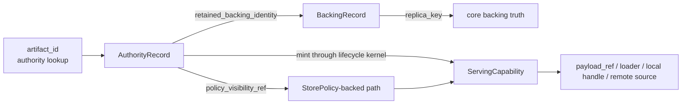
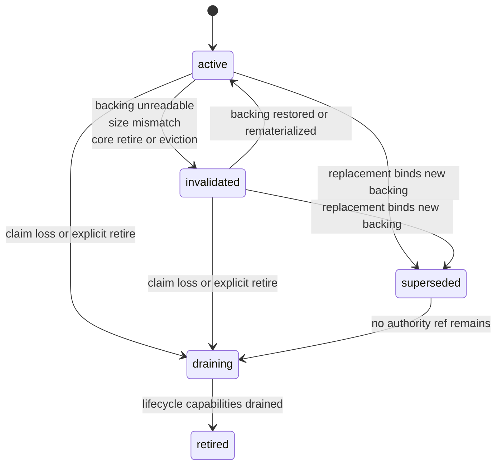
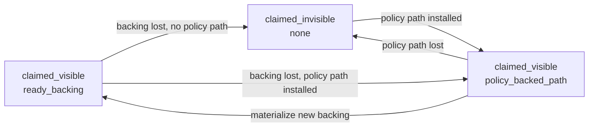

# Summary

After `0090` separates routed claim truth from visibility truth and `0091` makes content truth shared, TensorCast still
lacks one complete shared contract for the next two layers:

- backing truth,
- lifecycle-backed serving capability.

Current code already exposes `BackingIdentity`, `ServingCapability`, `AuthorityRecord`, and `BodyBackingIntent`, but
those names are still only partially defined:

- `BackingIdentity` does not yet carry the exact core subject identity,
- `AuthorityRecord` does not yet reference backing truth explicitly,
- `BodyStore` still mixes authority index state with backing-local handle state,
- `ServingCapability` is still an ad hoc response projection instead of the shared lifecycle contract promised by
  `0092`,
- high-cardinality routed artifacts still derive body-backing behavior mostly from local access-class heuristics instead
  of treating `StorePolicy` as their single policy input,
- `policy_backed_path` was reserved by `0090` but not yet defined precisely enough to drive `claimed_invisible ->
  claimed_visible`.

Phase 2 closes that gap.

This design defines:

- the exact relationship between `BackingIdentity` and `ReplicaKey`,
- the split between stable backing-subject identity and per-binding instance generation,
- how `AuthorityRecord` references retained backing truth,
- how `BodyStore` remains an authority-local index while pointing to backing truth rather than owning it,
- the authoritative state machine for backing replacement, invalidation, retirement, and claim loss in an executable
  phase-2 scope,
- `ServingCapability` as a real lifecycle-kernel contract rather than a body-store convenience struct,
- the lifecycle kernel as a shared adapter over existing lease and token owners in this phase rather than a brand-new
  physical registry cut,
- how high-cardinality routed artifacts derive `BodyBackingIntent` from `StorePolicy`, route role, locality, and access
  pattern,
- when policy-backed rematerialization is allowed to restore `claimed_invisible -> claimed_visible`,
- the recoverability boundary for authority records, backing records, policy visibility references, and serving
  capabilities.

# Implementation Status

Proposed only.

This document is the semantic target for the next implementation cut. It does not claim that the current `0090` /
`0091` code line already satisfies the contract below.

# Problem Statement

Current repository state has five structural ambiguities.

## 1. `BackingIdentity` is under-specified

Current `BackingIdentity` is only:

- `physical_artifact_id`,
- `device`.

That is not enough to answer the actual shared question:

- which exact core backing subject is authoritative right now.

It also leaves the relationship to the repository-wide `ReplicaKey` contract undefined.

## 2. `AuthorityRecord` cannot point to backing truth

Current `AuthorityRecord` can tell callers:

- claim state,
- visibility kind,
- route scope,
- expiry.

But it cannot answer:

- which retained backing it currently owns,
- whether visibility depends on that backing or on a policy-backed path,
- whether future lifecycle promises are being minted against a live backing or an on-demand rematerialization path.

That forces `BodyStore` internals and controller code to smuggle backing truth through `BodyHandle` fields instead of
through an explicit contract.

## 3. `BodyStore` still conflates authority index and backing truth

Current `ByteArtifactRuntimeState::AuthorityEntry` stores:

- authority metadata,
- verified content projection,
- last observation,
- the visible `BodyHandle`.

That means the authority index currently acts as:

- claim truth,
- visibility truth,
- retained-backing pointer,
- lifecycle staging cache.

This violates the `0092` layering rule that authority-local state may reference backing truth but must not replace it.

## 4. `ServingCapability` is not yet a real lifecycle contract

Current code synthesizes `ServingCapability` in at least two ad hoc places:

- `ByteArtifactBodyStore::get(...)`,
- `PayloadTransportBroker::resolve_payload_ref_capability(...)`.

Those projections are useful, but they are not yet the shared lifecycle kernel promised by `0092` because:

- `BodyStore` is minting a capability-shaped object without owning the lifecycle lease or pin semantics,
- the capability id is currently just a convenient carrier such as `artifact_id` or `payload_ref`,
- future capability front doors such as local memfd, CUDA IPC, publish handles, and policy-backed rematerialization are
  not yet terminating in one shared mint and finalization model.

## 5. Routed high-cardinality artifacts are not yet real `StorePolicy` clients

Current `BodyBackingManager::classify_intent(...)` mostly derives intent from:

- `BodyAccessClass`,
- a partially resolved local-stable policy.

That is not the final contract because the authoritative derivation must consider:

- resolved `StorePolicy`,
- route role,
- locality,
- access pattern,
- object shape or fanout hints when relevant.

Without that, `policy_backed_path` cannot become precise enough to restore visibility honestly.

# Goals / Non-Goals

## Goals

- Define `BackingIdentity` as the shared backing-truth projection for local retained backings.
- Define the exact relationship between `BackingIdentity` and `ReplicaKey`.
- Separate stable backing-subject identity from per-binding instance generation.
- Make `AuthorityRecord` reference backing truth explicitly instead of relying on hidden `BodyHandle` ownership.
- Keep `BodyStore` authority-local while splitting authority index from retained-backing truth.
- Define one backing lifecycle state machine covering replacement, invalidation, retirement, and claim loss.
- Make `ServingCapability` a real shared lifecycle contract for:
  - routed `HomeBatchGet`,
  - `payload_ref`,
  - local zero-copy handle paths,
  - remote source resolution,
  - future policy-backed rematerialization.
- Make the phase-2 lifecycle kernel implementable as one shared mint/release API over the existing lease and token
  registries rather than requiring immediate physical storage convergence.
- Keep `StorePolicy` as the single declarative policy surface for high-cardinality artifacts.
- Define how `BodyBackingIntent` is derived from `StorePolicy`, route role, locality, and access pattern.
- Define the exact rule for `claimed_invisible -> claimed_visible` under policy-backed rematerialization.
- Make the phase-2 recoverability boundary explicit instead of letting daemon-local maps silently become semantic truth.

## Non-Goals

- Redefine `SelectionIdentity`, `ContentIdentity`, or `VerifiedContentDescriptor`. `0091` remains authoritative there.
- Redefine routed claim truth or the phase-0 recovery boundary. `0090` remains authoritative there.
- Make high-cardinality routed claim truth durable across restart or failover beyond what `0090` already promises.
- Introduce a second user-declared policy surface beside `StorePolicy`.
- Put `ServingCapability` itself into persistent authority truth.
- Redefine the public SDK user-facing surface in this phase.
- Define the final shared remote-source ordering for every future capability kind; this phase defines the contract, not
  every transport optimization.
- Collapse every existing lifecycle owner (`payload_ref`, handle leases, retention handles, placement lease tokens) into
  one brand-new physical registry in this phase.
- Require `BackingIdentity` by itself to be globally unique across every retire and rematerialize cycle.

# Architecture & Interfaces

## 1. Phase role and layering

`0092` defines the repository-wide layering:

- selection kernel,
- content kernel,
- lifecycle kernel,
- backing truth,
- authority-local state.

`0090` then defines routed authority semantics.

`0091` then defines shared selection and content truth.

Phase 2 is the required next step:

- it defines backing truth precisely,
- it defines how authority points to that truth,
- it makes lifecycle-backed serving capability real,
- it makes routed high-cardinality artifacts consume `StorePolicy` as policy input rather than as an optional afterthought.



Constitutional rules:

1. `AuthorityRecord` is allowed to reference backing truth, but not to replace it.
2. `BodyStore` remains authority-local state, not a second physical lifecycle owner.
3. `ServingCapability` is lifecycle-kernel state, not authority truth.
4. `StorePolicy` remains the only declarative placement and durability surface.
5. `BodyBackingIntent` remains a derived lowering hint only.

### 1.1 Executable intermediate target

Phase 2 is intentionally a bridge, not the final convergence cut.

This phase must be implementable by:

- splitting authority-local indexing from backing-local truth,
- introducing one shared lifecycle-kernel API surface for mint and release,
- reusing existing lifecycle owners behind that API where appropriate, including:
  - `SessionLifecycleManager` use leases,
  - `HandleLeaseRegistry` handle leases,
  - `PayloadTransportBroker` payload records and tokens,
  - `RetentionRegistry` or persistence-backed control references when policy-backed visibility is added.

This phase does **not** require every existing lease or token system to collapse into one physical storage table
immediately. It does require one shared semantic mint/release contract over them.

## 2. `BackingIdentity` and `ReplicaKey`

### 2.1 Normative definition

Phase 2 defines `BackingIdentity` as the shared projection of the retained backing subject currently bound under routed
authority.

`BackingIdentity` identifies the exact core subject used for lookup, observation, export, and retirement. It does **not**
by itself guarantee a globally unique rematerialization instance across repeated retire and recreate cycles.

For local retained backings, `BackingIdentity` must carry:

- `physical_artifact_id`,
- the exact full `loading::ReplicaKey` that currently realizes that backing.

Required invariant:

- `backing_identity.physical_artifact_id == backing_identity.replica_key.artifact_id`.

For routed retained byte bodies in this phase:

- `backing_identity.replica_key.view_id` must be `nullopt`,
- `backing_identity.replica_key.replica` must be `0`,
- the key must be the exact key used for core lookup, retirement, export, and reconciliation.

### 2.2 Relationship to `ReplicaKey`

`ReplicaKey` remains the core/store subject identity.

`BackingIdentity` is not a competing identity system. It is the shared cross-layer projection of that exact core
subject with the stable `physical_artifact_id` carried explicitly for cross-layer reasoning and projection.

The relationship is therefore:

| Concept | Meaning |
| --- | --- |
| `ReplicaKey` | exact core/store subject used for readiness, export, retirement, and lookup |
| `BackingIdentity` | shared backing-truth projection that must carry that exact `ReplicaKey` plus `physical_artifact_id` |

Normative rules:

1. No code may reconstruct backing identity from `{physical_artifact_id, device}` alone after this phase.
2. Any code that needs to inspect or retire backing truth must use the full `ReplicaKey` carried by `BackingIdentity`.
3. `BackingIdentity` must not carry request-local fields, authority-local TTL, or lifecycle capability ids.
4. `BackingIdentity` may change while `ContentIdentity` stays the same.
5. `BackingIdentity` is a stable backing-subject identity, not a lifecycle-instance token.

### 2.3 Why the current `{physical_artifact_id, device}` form is insufficient

The current form is too weak because:

- it drops the repository-wide subject key that all core lifecycle APIs already use,
- it invites accidental reconstruction of keys instead of carrying the exact key,
- it makes backing truth weaker than the existing `ReplicaKey` discipline already used elsewhere in the repository.

Phase 2 therefore upgrades `BackingIdentity` to the full shared form instead of inventing another parallel locator.

### 2.4 Stable subject identity versus binding instance generation

The repository already uses deterministic retained backing ids for byte bodies. That determinism is desirable for core
lookup and observability, but it means `BackingIdentity` alone is not enough to distinguish every retire and
rematerialize cycle of the same retained backing subject.

Phase-2 executable rule:

- `BackingIdentity` identifies the stable retained backing subject,
- `BackingRecord` carries a monotonic `instance_generation` that distinguishes repeated bindings of that subject under
  the current routed authority scope,
- any `ServingCapability` bound to a live backing must bind to both:
  - `BackingIdentity`,
  - `instance_generation`.

Consequences:

1. A same-identity rematerialization may rebind the existing `BackingRecord` in place by bumping `instance_generation`.
2. Already minted capabilities survive because their lifecycle ownership is externalized through the lifecycle kernel,
   not because the backing table keeps multiple records with the same key alive forever.
3. Concurrent `active` and `superseded` records are required only when authority moves to a **different**
   `BackingIdentity`.

## 3. `AuthorityRecord` must reference backing truth explicitly

Phase 2 keeps `AuthorityRecord` as authority-local state, but extends it so the record can point at backing truth
without owning it.

Required authority-facing fields:

- route scope:
  - `shard_id`,
  - `lease_generation`,
  - `routing_epoch`,
  - `expires_at`,
- claim and visibility state:
  - `claim_state`,
  - `visibility_kind`,
- backing reference:
  - `retained_backing_identity`,
- optional policy visibility reference:
  - `policy_visibility_ref`,
- user-facing projection:
  - `visible`.

`retained_backing_identity` means:

- the claim currently owns this retained backing lineage as its authoritative local backing reference.

`policy_visibility_ref` means:

- the claim currently has a validated policy-backed rematerialization path that may restore or provide visibility under
  the current routed authority scope.

### 3.1 `PolicyVisibilityRef`

Phase 2 introduces `PolicyVisibilityRef` as the authority-local reference to an actionable rematerialization path.

Minimum required fields:

- `path_id`,
- `path_kind`,
- exact `verified_content_descriptor`,
- `control_ref`,
- `expires_at`.

Meaning:

- `path_id`
  - stable id for the current actionable path under this authority scope.
- `path_kind`
  - which policy-backed family is being used, such as shared disk, remote stable, or another explicitly modeled
    recoverable source.
- `verified_content_descriptor`
  - the exact shared content descriptor the path is expected to rematerialize.
- `control_ref`
  - the concrete control-plane or retention handle that proves the path is live now.
- `expires_at`
  - the latest time this path may still be treated as actionable without revalidation.

Path-family constraint in this phase:

- `path_kind` must identify an independent rematerialization family such as shared disk, remote stable, or another
  explicitly modeled recoverable source,
- pure local-stable retention of the same lost local backing does not qualify as a `policy_backed_path` by itself.

Normative rules:

1. `PolicyVisibilityRef` is not the `StorePolicy` itself.
2. `PolicyVisibilityRef` is not a `ServingCapability`.
3. A claim may become visible through `policy_backed_path` only while its `PolicyVisibilityRef` remains actionable.
4. `PolicyVisibilityRef` must carry the exact `VerifiedContentDescriptor`; weaker content anchors are forbidden here.
5. `control_ref` must resolve to concrete recoverable control-plane or retention truth that is live now.
6. Configured `StorePolicy` or pure local-stable retention alone is not actionable policy visibility proof.

Required invariants:

| Authority shape | `retained_backing_identity` | `policy_visibility_ref` |
| --- | --- | --- |
| `claimed_visible` + `ready_backing` | required | absent |
| `claimed_visible` + `policy_backed_path` | optional | required |
| `claimed_invisible` + `none` | optional | absent |
| `claim_deleted` + `none` | absent | absent |

Normative rules:

1. `AuthorityRecord` must not embed `BodyHandle` or any other lifecycle-carrier object as truth.
2. `AuthorityRecord` may reference backing truth, but must not inline backing observation or export state as if it were
   authoritative.
3. `AuthorityRecord` must not persist `ServingCapability`.

## 4. `BodyStore` stays an authority index and points to backing truth

Phase 2 keeps `BodyStore` as an authority-local module, but splits its logical content into two layers.

### 4.1 Required logical tables

`BodyStore` now has two logical maps:

- authority index:
  - `artifact_id -> AuthorityRecord` plus claim-scoped content projection,
- backing truth cache:
  - `BackingIdentity -> BackingRecord`.

`BackingRecord` is the local retained-backing truth object.

Required fields:

- `BackingIdentity identity`,
- `std::uint64_t instance_generation`,
- `VerifiedContentDescriptor verified_content_descriptor`,
- `VerificationRecord verification_record`,
- `BodyDescriptor` as a projection only,
- `BodyBackingObservation last_observation`,
- `BodyHandle retained_body_handle`,
- `BackingLifecycleState lifecycle_state`.

`BodyDescriptor` remains a projection from:

- shared content truth,
- `BackingIdentity`.

It must not become a second truth family beside `VerifiedContentDescriptor`.

`retained_body_handle` is permitted in `BackingRecord` in this phase as an implementation-local reference into
core-owned state. It is:

- not authority truth,
- not a serving capability,
- not a substitute for lifecycle ownership.

### 4.2 Required access path

The authority read path becomes:

1. `artifact_id -> AuthorityRecord`,
2. validate route scope and claim state,
3. inspect `visibility_kind`:
   - `ready_backing`: resolve `retained_backing_identity -> BackingRecord -> core backing truth`,
   - `policy_backed_path`: resolve `policy_visibility_ref` through the lifecycle kernel,
   - `none`: return invisible or `MISS`,
4. lifecycle kernel mints `ServingCapability`,
5. capability resolution yields loader, local handle path, or remote source.

The authority index therefore answers:

- should this claim currently be treated as visible,
- which backing or policy path future serving must bind to.

The backing table answers:

- what the current retained backing actually is,
- what exact core subject realizes it,
- what its latest observation and lifecycle state are.

### 4.3 Consequence for current code

Current `AuthorityEntry.visible_body_handle` is a phase-0 shortcut.

Phase 2 replaces that shortcut with:

- explicit `retained_backing_identity` on authority state,
- explicit `BackingRecord` ownership in the backing table.

That split is the core architectural correction in this phase.

## 5. Backing lifecycle state machine

Phase 2 introduces a backing-local state machine distinct from the routed claim-state machine of `0090`.

This state machine is record-scoped, not capability-scoped. For repeated rematerialization of the **same**
`BackingIdentity`, the record may advance by bumping `instance_generation` in place rather than by minting a second
record with the same key.

Required states:

- `active`
  - authoritative retained backing for the current claim and eligible to prove `ready_backing`.
- `invalidated`
  - claim still owns the backing lineage, but the current live backing is unreadable, mismatched, or otherwise not
    acceptable as visibility proof.
- `superseded`
  - the claim has rebound to a different retained backing; this backing is no longer authoritative for future serving.
- `draining`
  - the backing no longer has authority ownership, but outstanding lifecycle capabilities may still be using it.
- `retired`
  - no authority ownership and no outstanding lifecycle capabilities remain; cleanup may erase the record.



### 5.1 Event semantics

| Event | Authority effect | Backing effect |
| --- | --- | --- |
| successful create | `unclaimed -> claimed_visible` | new backing enters `active` |
| backing unreadable | `claimed_visible -> claimed_invisible` unless policy path is installed | backing enters `invalidated` |
| replacement with join-equivalent content and same `BackingIdentity` | claim remains claimed | same record bumps `instance_generation` and enters or remains `active`; old capabilities drain through lifecycle ownership |
| replacement with join-equivalent content and different `BackingIdentity` | claim remains claimed | old backing `active/invalidated -> superseded`, new backing enters `active` |
| policy-backed path installed | `claimed_invisible -> claimed_visible` or `claimed_visible` stays visible | current invalidated backing may remain `invalidated`; no new active local backing required yet |
| explicit claim deletion or TTL expiry | `claimed_visible/claimed_invisible -> claim_deleted` | authoritative backing enters `draining` |
| route mismatch on a single request | no mutation by itself | no mutation by itself |
| lifecycle drain complete | no authority effect | `draining -> retired` |

### 5.2 Claim loss versus backing invalidation

These are different events and must stay different:

- backing invalidation means the current local backing is no longer a valid visibility proof,
- claim loss means the authority no longer owns the claim for future semantic decisions.

Normative rules:

1. Backing invalidation must not silently erase claim truth.
2. Claim loss must remove future authority ownership even if old serving capabilities are still draining.
3. Replacement must never silently change content truth. A replacement is legal only when the claim remains
   join-equivalent to the same shared verified content.

## 6. `ServingCapability` and the lifecycle kernel

Phase 2 makes `ServingCapability` the real shared lifecycle contract promised by `0092`.

### 6.1 What `ServingCapability` means

`ServingCapability` is the bounded promise that a specific consumer path may:

- serve bytes,
- resolve a loader or source,
- resolve a local zero-copy handle,
- resolve a remote source,
- or resolve a policy-backed rematerialization path,

for a limited lifetime.

It is not:

- claim truth,
- backing truth,
- content truth,
- a stored authority field.

### 6.2 Required fields

Minimum required fields:

- `capability_id`,
- `expires_at`,
- `mode`,
- `local`,
- `subject_kind`,
- `lifecycle_owner_ref`,
- `backing_identity` and `backing_instance_generation` when the subject is a live backing,
- `policy_visibility_ref` when the subject is a policy-backed path.

`subject_kind` must distinguish at least:

- `backing`,
- `copied_payload`,
- `policy_backed_path`.

### 6.3 `LifecycleOwnerRef`

Phase 2 does not require one brand-new physical registry for every capability.

Instead, each `ServingCapability` must name exactly one lifecycle owner plus one release path.

Minimum required fields:

- `owner_kind`,
- `owner_id`.

`owner_kind` may initially project existing owners such as:

- `session_use_lease`,
- `handle_lease_token`,
- `payload_ref_token`,
- `inline_copy_window`,
- `retention_handle`.

Normative rules:

1. Every minted `ServingCapability` must terminate in exactly one concrete lifecycle owner.
2. Existing registries may remain physically separate in this phase, but mint and release must terminate in one shared
   lifecycle-kernel API.
3. `capability_id` is the consumer-facing capability identifier; `owner_id` is the underlying lifecycle owner reference,
   and they may differ.

### 6.4 Lifecycle-kernel ownership

The lifecycle kernel is responsible for:

- validating that a capability may be minted under the current routed authority scope,
- binding the capability either to a live backing or to a policy-backed path,
- adapting to the concrete existing lifecycle owner used in this phase,
- acquiring the lease, pin, finalizer, or other bounded lifecycle ownership needed for that promise,
- producing the actual consumer-facing resolution result:
  - loader,
  - `payload_ref`,
  - local handle lease,
  - remote source,
- releasing the backing once the capability expires or is explicitly released.

Executable phase-2 target:

- `SessionLifecycleManager`, `HandleLeaseRegistry`, `PayloadTransportBroker`, and `RetentionRegistry` may remain the
  physical owners of their current records,
- but the daemon must expose one shared lifecycle-kernel mint and release contract over them.

### 6.5 Required rule on minting

`ServingCapability` must be minted by the lifecycle kernel, not by `BodyStore`.

That means:

- `BodyStore::get(...)` may return authority and backing snapshots,
- the get path must then ask the lifecycle kernel to mint a capability,
- `PayloadTransportBroker` must consume the same kernel instead of being a second capability owner,
- `PayloadTransportBroker` may remain the physical holder of payload records in this phase, but not a second semantic
  lifecycle system,
- future CPU memfd, CUDA IPC, publish, or retention capability front doors must also use the same kernel.

### 6.6 Survival across replacement, invalidation, and claim loss

Normative rules:

1. Once minted, a `ServingCapability` may survive authority visibility loss or route handoff up to its promised expiry,
   provided the lifecycle kernel already acquired the necessary backing ownership.
2. Replacement or invalidation affects future capability minting, not already issued capabilities.
3. Claim deletion or route handoff must stop minting new capabilities under the old authority scope.
4. Old capabilities must drain through the lifecycle kernel; `BodyStore` must not become their hidden owner.
5. A capability bound to a live backing must bind to `{BackingIdentity, instance_generation}` rather than to
   `BackingIdentity` alone.

## 7. High-cardinality artifacts become real `StorePolicy` clients

### 7.1 `BodyBackingIntent` remains derived, not declarative

`BodyBackingIntent` stays an internal lowering hint only.

But Phase 2 defines the real derivation inputs explicitly.

Required derivation inputs:

- resolved `StorePolicy`,
- route role,
- locality,
- access pattern,
- object shape hints when they affect the access pattern classification.

Recommended normalized input carrier:

```cpp
struct BodyPlacementContext {
  RouteRole route_role;
  BodyConsumerLocality locality;
  BodyAccessPattern access_pattern;
  std::uint64_t size_bytes;
  std::uint32_t expected_fanout;
};
```

`BodyAccessClass` may remain as a convenience adapter, but it is no longer the authoritative derivation input by
itself. It must normalize into the richer placement context first.

### 7.2 Required derivation rules

The derivation must follow these rules:

| Input dimension | Required effect |
| --- | --- |
| `StorePolicy` local stable requirement | drives `stable_retention_requirement` |
| `StorePolicy` durability or persistence path | decides whether policy-backed rematerialization may exist at all |
| actionable persistence or retention proof | required before policy-backed visibility may actually be installed |
| route role `transient_forwarder` | forces ephemeral retention and forbids visibility from pretending the forwarder owns long-lived retained truth |
| locality `local_only` | may choose `LOCAL_READ_MOSTLY` or `PRIVATE_LOCAL` |
| locality `remote_or_mixed` | must prefer `REMOTE_SHAREABLE` |
| access pattern `local_gpu_hot` | may prefer GPU residency if policy does not require a conflicting stable-local backing path |
| access pattern `small_object` | may remain CPU-private or CPU-local unless policy explicitly requires a retained path |

Normative rules:

1. Route role may constrain intent, but may not invent a second policy surface.
2. Locality may influence sharing and residency, but may not silently override `StorePolicy` correctness requirements.
3. Access pattern may shape residency and sharing, but may not erase a required durable or rematerializable path.
4. A durable `StorePolicy` is necessary but not sufficient for `policy_backed_path`; a concrete actionable proof must
   also exist.

## 8. When policy-backed rematerialization restores visibility

Phase 0 reserved `policy_backed_path`.

Phase 2 defines when it is allowed to make a routed claim visible again.

### 8.0 Executable phase-2 scope

To keep Phase 2 executable, the first supported `policy_backed_path` families may be limited to path kinds that already
have explicit recoverable control-plane truth, such as:

- shared-disk persistence state,
- remote-stable persistence or retention state.

Pure local-stable retention of the same lost local backing is not enough.

### 8.1 `StorePolicy` alone is not enough

The existence of a `StorePolicy` object does not make a claim visible.

`claimed_invisible -> claimed_visible` is allowed only when the authority installs a live `policy_visibility_ref`.

That requires all of the following:

1. the claim is still owned under the current route fence and is not `claim_deleted`,
2. the resolved `StorePolicy` plus current persistence or retention truth provides an independent rematerialization path
   that is still live under current control-plane truth,
3. the rematerialization path is expected to produce the same `VerifiedContentDescriptor` as the claim,
4. the lifecycle kernel can mint a bounded `ServingCapability` from that path,
5. the path is not merely “configured in principle” but is current and actionable now.

### 8.2 Visibility transitions

Policy-backed rematerialization introduces these legal transitions:



Semantics:

- `claimed_visible + ready_backing`
  - visible because a readable live backing exists now.
- `claimed_visible + policy_backed_path`
  - visible because the authority has a validated policy-backed path that can still be turned into a serving
    capability under the current routed scope.
- `claimed_invisible + none`
  - no current live backing and no current actionable policy-backed path.

### 8.3 Hard limits

1. `claim_deleted` must never be resurrected by policy-backed rematerialization.
2. A policy-backed path may restore visibility only for a still-owned, not-deleted claim.
3. If the policy-backed path resolves to content that does not match the claim's `VerifiedContentDescriptor`, the
   outcome is corruption or conflict, not restoration.
4. A policy-backed path does not by itself mint a permanent new backing. It only authorizes visibility once the
   lifecycle kernel can bind it to a bounded serving result.
5. Pure local-stable retention of the same lost local backing is not a legal `policy_backed_path`.

## 9. Naming Compliance

Planned interface names introduced or clarified by this phase:

| Interface | Language | Rule | Result |
| --- | --- | --- | --- |
| `BackingIdentity` | C++/Python type | `PascalCase` | pass |
| `BackingRecord` | C++ struct | `PascalCase` | pass |
| `BackingLifecycleState` | C++ enum class | `PascalCase` | pass |
| `PolicyVisibilityRef` | C++ struct | `PascalCase` | pass |
| `ServingCapability` | C++/Python type | `PascalCase` | pass |
| `LifecycleOwnerRef` | C++ struct | `PascalCase` | pass |
| `BodyPlacementContext` | C++ struct | `PascalCase` | pass |
| `BodyConsumerLocality` | C++ enum class | `PascalCase` | pass |
| `BodyAccessPattern` | C++ enum class | `PascalCase` | pass |
| `derive_body_backing_intent` | C++ function | `snake_case` | pass |
| `mint_serving_capability` | C++ function | `snake_case` | pass |
| `release_serving_capability` | C++ function | `snake_case` | pass |
| `reconcile_backing_record` | C++ function | `snake_case` | pass |

# Schema Changes

No persistent schema changes are required for Phase 2.

This phase changes:

- shared in-memory truth and lifecycle contracts,
- daemon authority and backing layering,
- routed high-cardinality policy semantics,
- the internal minting and ownership model for serving capability.

# Recoverability Boundary

Phase 2 keeps the phase-0 routed authority recovery line from `0090`.

It therefore distinguishes durable source truth from daemon-local projections:

| Object | Owner | Recoverability in this phase |
| --- | --- | --- |
| `AuthorityRecord` | routed home-daemon authority | not recovered across daemon restart or route failover beyond `0090`; recomputed only for live in-process authority |
| `BackingRecord` | daemon-local backing registry over core runtime | not durably persisted; may be rebuilt from current authority and core state while the process lives; lost on restart |
| `PolicyVisibilityRef` | daemon-local projection from persistence, retention, or other control-plane truth | the record itself is ephemeral; after restart or handoff it must be revalidated and reinstalled from recoverable source truth or remain absent |
| `ServingCapability` | lifecycle owner state | never recovered; issued capabilities drain or expire only within the current daemon process |

Normative rules:

1. No daemon-local map introduced by this phase may silently become restart-recoverable semantic truth.
2. Any future phase that wants restart-surviving routed authority or capability state must add an explicit recovered
   index or handoff log.
3. `PolicyVisibilityRef` may only cite control refs that themselves survive or can be revalidated from the owning
   subsystem.

# Trade-offs & Risks

- Splitting `BodyStore` into authority and backing layers introduces more named state.
  That is intentional. The current single-map shape is smaller in code but larger in ambiguity.
- Upgrading `BackingIdentity` to carry the full `ReplicaKey` creates more churn in shared types.
  That churn is required because the repository already treats exact `ReplicaKey` identity as the only safe lifecycle
  subject.
- Keeping `BackingIdentity` as a stable backing-subject identity while adding `instance_generation` is a deliberate
  compromise.
  It makes Phase 2 implementable without pretending the current deterministic retained backing ids are per-instance
  unique.
- Making `ServingCapability` lifecycle-owned may temporarily widen the diff because multiple front doors currently mint
  capability-shaped objects independently.
  That is still preferable to letting each front door harden its own hidden lifecycle contract.
- Reusing existing lease and token registries behind one lifecycle-kernel API is intentionally incremental.
  It avoids a greenfield registry rewrite while still stopping semantic divergence at the API boundary.
- Allowing `policy_backed_path` to restore visibility is powerful.
  The guardrail is strict: configured policy alone is not enough; the path must be current, content-matching, and
  capable of minting a bounded serving result now.

# Compatibility & Acceptance Criteria

This is a hard-cut internal contract clarification. No compatibility shim should preserve the old ambiguous shapes as a
second long-term line.

Acceptance criteria:

- `BackingIdentity` carries the exact full `ReplicaKey` of the live retained backing it describes,
- the invariant `physical_artifact_id == replica_key.artifact_id` is explicit and enforced,
- `BackingIdentity` is explicitly documented as stable backing-subject identity rather than as a per-instance unique
  token,
- `BackingRecord` carries `instance_generation` or an equivalent monotonic binding generation for repeated bindings of
  the same `BackingIdentity`,
- `AuthorityRecord` explicitly references backing truth and no longer relies on embedded `BodyHandle` ownership,
- `BodyStore` is documented and implemented as:
  - an authority index over claims and visibility,
  - plus a backing-truth table keyed by `BackingIdentity`,
- the backing lifecycle state machine explicitly distinguishes:
  - invalidation,
  - replacement,
  - draining after claim loss,
  - final retirement,
- `ServingCapability` is minted only by the lifecycle kernel and is not stored as authority truth,
- `ServingCapability` binds to an explicit `lifecycle_owner_ref` and supports at least:
  - `backing`,
  - `copied_payload`,
  - `policy_backed_path`,
- `HomeBatchGet`, `payload_ref`, and future local or remote capability front doors share the same lifecycle contract,
- `BodyBackingIntent` derivation is defined in terms of `StorePolicy`, route role, locality, and access pattern rather
  than only in terms of body-local enums,
- `claimed_invisible -> claimed_visible` under policy-backed rematerialization occurs only when a live actionable
  `policy_visibility_ref` exists and the lifecycle kernel can mint a bounded serving result,
- `PolicyVisibilityRef` carries the exact `VerifiedContentDescriptor` and does not treat pure local-stable retention as
  an actionable rematerialization path,
- `claim_deleted` cannot be resurrected by policy-backed rematerialization,
- the recoverability boundary for `AuthorityRecord`, `BackingRecord`, `PolicyVisibilityRef`, and `ServingCapability` is
  explicit and matches `0090` / `0092`,
- no implementation is accepted if it:
  - reintroduces `BodyStore` as a hidden lifecycle owner,
  - keeps `ServingCapability` as a response-only convenience object with no lifecycle owner,
  - treats configured `StorePolicy` alone as sufficient proof of visibility,
  - reconstructs backing identity from `{physical_artifact_id, device}` instead of carrying the exact `ReplicaKey`,
  - binds live-backing capabilities to `BackingIdentity` alone without distinguishing repeated bindings of the same
    backing subject.
