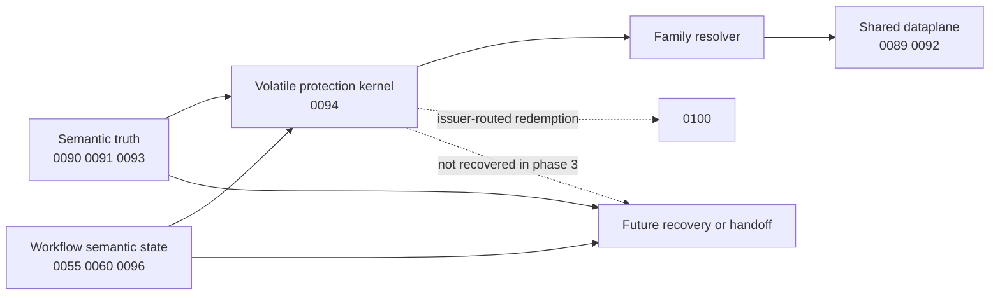
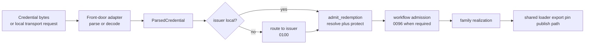
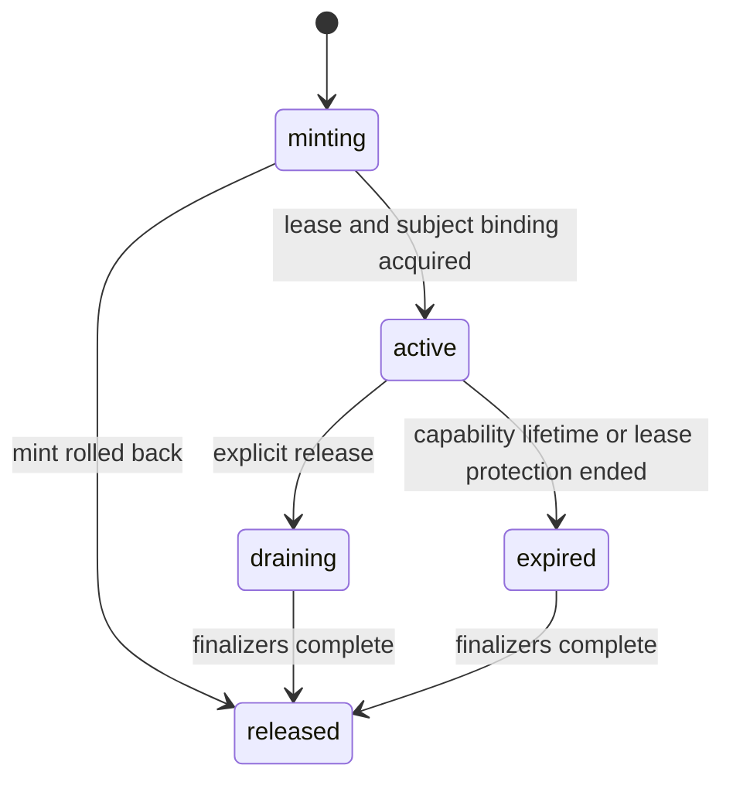

# Summary

`0092` already fixed the repository-wide constitution:

- semantic truth,
- workflow state,
- lifecycle promises,
- and shared execution

must remain separate.

`0011`, `0090`, and `0093` then established three additional facts:

- the bounded-lifetime substrate is already `SessionLifecycleManager`,
- routed authority and serving truth are intentionally not recovered from daemon-local capability maps,
- and a valid serving promise must bind to concrete runtime ownership rather than to a convenient response projection.

What Phase 3 still lacked was the long-term shape of the lifecycle layer itself.

The previous draft of `0094` correctly rejected a cluster-global capability table, but it still blurred four different
things:

1. issuer-local lifecycle state,
2. repo-wide redemption protocol,
3. front-door compatibility adapters,
4. workflow companion decisions such as currentness, replay, fencing, and status.

This rewrite tightens that split.

Phase 3 now standardizes five long-term rules:

1. there is one repo-wide lifecycle constitution, but the lifecycle kernel is issuer-local per daemon,
2. lifecycle identity is fencing-aware and adapter-neutral:
   - stable `route_principal`,
   - `subject_id`,
   - `subject_generation`,
   - optional `FencingContext`,
   - `capability_id`,
   - and optional `binding_id`
   are distinct and not interchangeable,
3. redemption is a shared protocol seam:
   - front-door parse or decode,
   - then one or more distributed stages declared by `0100` when the path is non-local,
   - with local lifecycle admission or adopted protection applied where the declared path family requires it,
   - then family realization into the shared dataplane,
4. the lifecycle kernel in this repository means the volatile protection kernel:
   - it protects a bounded runtime promise that truth or workflow already authorized,
   - it owns admission, renewal, draining, release, and finalization,
   - it does not own future semantic truth after restart, failover, or handoff,
5. front doors are compatibility adapters over shared family semantics; they are not long-term private lifecycle
   systems.

This design therefore makes three boundaries explicit:

1. `0094` owns the local kernel and local capability state machine,
2. `0100` owns distributed-authority ingress, issuer-routed redemption, endpoint resolution, and the handoff or
   recovery boundary for issued capabilities,
3. `0096` owns the workflow-companion protocol for replay, currentness, fencing, and status.

This document now serves as the accepted post-landing baseline for the `0094` cut.
For this phase, the canonical executable lifecycle object model is the code-adjacent surface in
`daemon/state/lifecycle_kernel.h`.
Follow-up designs may extend that surface, but they must not redefine shared lifecycle types independently in prose and
drift from the code.

# Implementation Status

Accepted and implemented for the `0094`-owned Phase-3 cut on 2026-03-10.

Landed outcomes:

- `SessionLifecycleManager` remains the only bounded-lifetime substrate for this cut.
- `LifecycleKernel` is implemented under `daemon/state/lifecycle_kernel.{h,cc}` and wired from `DaemonKernel`.
- `payload_ref`, local export handles, placement, retention, and publish all mint or redeem shared issuer-local lifecycle
  records through that kernel.
- local transport security, raw token parsing, opaque-token decode, and route resolution remain outside the kernel.
- publish bounded admission is lifecycle-owned, while `TargetPublicationRegistry::latest_by_target_` remains workflow
  currentness state.
- the landed executable baseline includes shared lifecycle types such as:
  - `LifecycleRoutePrincipal`
  - `FencingContext`
  - `WorkflowCompanionRef`
  - `LifecycleEpochs`
  - `LifecycleSubjectRecord`
  - `LifecycleCapabilityRecord`
  - `CapabilityBindingAddress`
  - `LifecycleBindingRecord`
  - `ParsedCredential`
  - `LifecycleUseGuard`
  - `AdmittedCapabilityUse`

Focused verification for the landed cut includes:

- `bazel test //daemon:lifecycle_kernel_test`
- `bazel test //daemon:grpc_service_impl_batch_redirect_e2e_test --test_env=TENSORCAST_CUDA_BACKEND=fake`
- `bazel test //daemon:grpc_service_impl_publish_target_replica_test --test_env=TENSORCAST_CUDA_BACKEND=fake`
- `bazel test //daemon:grpc_service_impl_placement_lease_test --test_env=TENSORCAST_CUDA_BACKEND=fake`
- `bazel test //daemon:grpc_service_impl_cpu_memfd_e2e_test --test_env=TENSORCAST_CUDA_BACKEND=fake`

What remains outside the completed `0094` cut is not the local kernel itself, but the higher-level protocol work around
it:

- `0100` still needs to finish the shared distributed-authority protocol, route-directory contract, and issuer handoff
  rules on top of the landed `LifecycleRoutePrincipal` boundary.
- `0096` still needs to finish the shared workflow gate and workflow outcome protocol on top of the landed
  `WorkflowCompanionRef` and lifecycle use-guard boundary.
- generic internal-record and standalone binding-issuance APIs remain reserved follow-up concepts; they are not part of
  the accepted executable `0094` baseline.

# Decision Record

Accepted decisions for the landed Phase-3 cut:

1. `0094` is the repository baseline for issuer-local volatile lifecycle state.
2. The lifecycle kernel is a daemon-local protection kernel over `SessionLifecycleManager`, not a second semantic-truth
   plane and not a cluster-global capability registry.
3. Route discovery, issuer handoff or recovery, and workflow semantic truth remain outside the kernel by design.
4. The accepted source of truth for the shared lifecycle object model is the executable surface in
   `daemon/state/lifecycle_kernel.h`; design prose must follow that surface unless a later change updates both together.
5. The final execution record for this cut is captured in this design; no companion plan is retained after completion.

# Problem Statement

Historical note:

The subsections below capture the pre-landing problem statement that motivated the accepted `0094` cut.
They remain useful as rationale, but the local lifecycle kernel itself is no longer hypothetical.

## 1. The repository has a shared lease substrate but not a shared lifecycle kernel

`0011` already defines the bounded-lifetime substrate:

- leases,
- guards,
- generations,
- renewal,
- expiry,
- finalizers,
- and PID-bound cleanup.

But higher-level promises still terminate in front-door-private or family-private owners:

- `PayloadTransportBroker`,
- `HandleLeaseRegistry`,
- `PlacementLeaseTokens`,
- `RetentionRegistry`,
- `TargetPublicationRegistry`,
- and internal registration or commit paths.

Without a real local kernel, Phase 3 would only rename those maps.

## 2. Generation and fencing semantics are still fragmented

Three adjacent designs already depend on explicit non-reuse or fencing semantics:

- `0011` uses lease and guard generations to prevent ABA,
- `0093` requires `{BackingIdentity, instance_generation}` for serving promises,
- `0060` requires epoch-fenced queue-issued tokens.

The previous `0094` draft acknowledged future fencing but did not make runtime generations part of the core object model.

That is not durable.

If lifecycle identity does not standardize:

- stable route principal,
- stable subject identity,
- runtime subject generation,
- optional fencing context,
- capability identity,
- and binding identity,

then each family will continue inventing its own stale-token and stale-owner logic.

## 3. Issuer-routed redemption is already real, but it is still an accidental protocol

Today `payload_ref` already behaves like an issuer-routed capability:

- the credential names an issuer daemon,
- the non-issuer side resolves the issuer endpoint,
- and the issuer performs the final capability validation and data realization.

`0060` already needs the same rule for issuer-scoped retention handles.

But the repository still lacks a first-class redemption protocol that says:

- what the front door must preserve from the original credential,
- what request facts must survive routing,
- what the non-issuer side may and may not rewrite,
- and what happens when the issuer disappears or leadership changes.

Without that seam, every remote-redeemable front door will continue to grow ad hoc routing behavior.

## 4. Workflow companion state is declared "out of lifecycle", but not yet modeled as a protocol

The old draft correctly said that:

- publish currentness,
- publish replay,
- `0055` operation replay and status,
- and future queue visibility or fencing

are not lifecycle truth.

But it only named that boundary.

It did not define a reusable admission protocol between:

- lifecycle capability resolution,
- and workflow-owned semantic checks.

As a result, current code still mixes them together in places such as publish admission.

## 5. Compatibility wire shapes are still being mistaken for long-term architecture

Some current front doors are already the right long-term shape:

- signed self-describing credentials such as `payload_ref`.

Some are only compatibility adapters:

- local opaque tokens,
- Unix-socket peer-credential flows,
- and mixed signed-token or opaque-token placement paths.

Those distinctions matter.

If the design treats every current wire shape as a permanent repository concept, then Phase 3 will overfit to today's
adapters instead of converging on stable family semantics.

# Goals / Non-Goals

## Goals

- Define one repo-wide lifecycle constitution that is implemented as issuer-local daemon kernel state.
- Define the lifecycle kernel as the issuer-local volatile protection kernel, not as a second semantic-truth plane.
- Reuse `SessionLifecycleManager` as the only bounded-lifetime substrate in this phase.
- Standardize the runtime identity hierarchy for lifecycle promises:
  - stable `route_principal`,
  - `subject_id`,
  - `subject_generation`,
  - optional `FencingContext`,
  - `capability_id`,
  - optional `binding_id`.
- Standardize structured workflow references through `WorkflowCompanionRef` rather than raw `workflow_ref` strings.
- Standardize one shared redemption seam:
  - front-door parse or decode,
  - then one or more `0100`-declared distributed stages when the path is non-local,
  - with lifecycle admission or adopted protection applied where the declared path requires it,
  - family realization into shared execution.
- Standardize an admission transaction that atomically checks active lifecycle state and acquires runtime protection
  before family realization starts.
- Keep raw token parsing, peer-credential checks, and local transport security in front-door adapters.
- Keep family-specific runtime realization and shared dataplane handoff outside the kernel.
- Distinguish stable family semantics from transient front-door compatibility profiles.
- Standardize both credential carriage kinds and binding-resolution modes.
- Preserve `0093` by treating `ServingCapability` as the `serve`-family projection of the shared lifecycle contract.
- Preserve `0089` and `0092` by keeping execution and transport ordering outside the lifecycle kernel.
- Preserve the explicit non-recoverability of issued capability state in this phase.
- Make the long-term split with `0100` and `0096` explicit instead of leaving it implicit.

## Non-Goals

- Introduce a cluster-global capability registry.
- Introduce recovered or transferred issued capabilities in this phase.
- Make raw token bytes, protobuf parsing, `SO_PEERCRED`, `SCM_RIGHTS`, or other local transport checks part of the
  lifecycle kernel.
- Turn workflow replay, currentness, leader fencing, wait, cancel, or status into lifecycle truth.
- Freeze today's front-door compatibility adapters forever.
- Force every profile onto one signed wire shape immediately.
- Move transport-path selection or shared copy execution into the lifecycle kernel.
- Replace `StorePolicy`, `SourcePolicy`, or existing shared dataplane contracts with a second policy surface.

# Architecture & Interfaces

## 1. Constitutional split

Phase 3 is the lifecycle layer between truth and realization.

In this repository, "lifecycle kernel" now means one very specific thing:

- the volatile protection kernel that turns a mintable truth decision into an active issuer-local runtime promise,
- the owner of admission, renewal, drain, release, and finalization for that promise,
- not the owner of replay, currentness, route discovery, or future truth after restart or handoff.



Phase 3 standardizes six adjacent categories:

| Category | Question answered | Owner after Phase 3 | Recoverable |
| --- | --- | --- | --- |
| semantic truth | may a future request honestly mint a promise | `0090`, `0091`, `0093`, persistence, Global Store | yes or explicitly phase-scoped |
| workflow semantic state | what is replayable, current, fenced, cancellable, or waiting | `0055`, `0060`, family workflow owners, `0096` | only if separately designed |
| local lifecycle subject | what runtime subject is protected now | issuer-local lifecycle kernel | no |
| local lifecycle capability | what bounded promise exists now | issuer-local lifecycle kernel over `SessionLifecycleManager` | no |
| redemption protocol context | how a credential is parsed, routed, and admitted | front-door adapters plus `0100` and `0096` seams | no |
| runtime realization | how an admitted capability becomes loader, export, pin, or publish admission | family resolvers plus shared dataplane | no |

Normative rules:

1. `0093` remains authoritative for whether a new promise may be minted honestly.
2. `0094` is authoritative for how a mintable promise is represented, admitted, renewed, drained, and released once it
   exists.
3. `0100` is authoritative for issuer-routed redemption and the handoff or recovery boundary for issued capabilities.
4. `0096` is authoritative for workflow admission, currentness, replay, fencing, and the declared recovery boundary for
   those semantic outcomes.
5. `0089` and `0092` remain authoritative for transport ordering, lowering, and execution seams.

## 2. Local kernel, shared redemption seam, and family realization

The lifecycle kernel is local by design.

There is:

- one repo-wide lifecycle constitution,
- one issuer-local lifecycle kernel per daemon process,
- one shared redemption seam used by all families,
- and zero cluster-global capability ledgers in Phase 3.

The long-term runtime shape is:



Responsibilities by layer:

| Layer | Owns | Does not own |
| --- | --- | --- |
| front-door adapter | raw credential bytes, local transport checks, opaque-token decode, request-local holder facts | capability truth, workflow truth, shared execution |
| lifecycle kernel | local capability records, subject records, binding records, redemption admission, use-guard release, renewal, release, finalization | raw credential parsing, remote routing, workflow semantic truth, shared copy execution |
| workflow semantic plane | replay, currentness, fencing, wait, cancel, status, other workflow-side semantic gates | capability lifetime, transport-path choice, finalizers |
| family resolver | runtime realization and shared dataplane handoff | durable truth, raw transport credentials, workflow truth |

Required kernel mission:

1. a family-facing lifecycle API must expose admission, not only naked lookup,
2. lifecycle admission must atomically validate active state and acquire runtime protection before family realization
   begins,
3. workflow semantic checks may still reject after lifecycle admission, but they must do so while that runtime
   protection remains held or after explicitly releasing it,
4. helper registries may remain physically separate in the first cut, but they must no longer define independent
   admission semantics.

Required implementation boundary in current daemon:

- the lifecycle kernel belongs under `daemon/state`,
- `DaemonKernel` remains the composition root,
- controllers and adapters consume the kernel through `DaemonKernel`,
- `WorkerDirectoryCache` or equivalent route caches remain routing helpers, not capability owners,
- local opaque-token decode tables remain compatibility adapters, not semantic truth owners.

## 3. Identity, fencing, and non-reuse rules

Phase 3 standardizes six separate identity or fencing carriers.

| Name | Scope | Answers | Mutation rule |
| --- | --- | --- | --- |
| `route_principal` | stable authority routing scope | which authority-owned lifecycle kernel is the canonical redemption owner | changes only when authority ownership itself changes |
| `subject_id` | issuer-local | which runtime subject is being protected | stable while the same logical runtime subject exists |
| `subject_generation` | issuer-local | which binding of that subject is current | increments when the same subject is rebound or reused in a way that old credentials must not silently follow |
| `fencing_context` | truth or workflow scoped | which fenced principal and epoch minted or admitted the promise | changes only when that principal's fenced epoch changes |
| `capability_id` | issuer-local | which bounded promise exists | new promise semantics require a new id |
| `binding_id` | issuer-local, binding-record mode only | which independently revocable or auditable binding is being redeemed | new independently revocable binding gets a new id |

Normative rules:

1. `route_principal` is the stable authority reference; it is not front-door identity.
2. `subject_id` is not a capability id.
3. `capability_id` is not a stable subject identifier.
4. `subject_generation` is required whenever the same `subject_id` may be rebound in place.
5. `FencingContext` is required whenever routed authority turnover, leader fencing, or workflow authority changes would
   otherwise let a stale credential keep mutating correctness-relevant state.
6. Distinct fenced principals remain distinct even when they all use an `epoch` field:
   - issuer authority fencing,
   - queue-leader fencing,
   - operation fencing,
   - and workflow-side fencing
   must not be collapsed into one anonymous counter.
7. A family may omit `FencingContext` only if its mint or admission authority is not fenced in Phase 3.
8. A redeemable credential must carry enough generation or fencing claims, directly or indirectly, to prevent silent
   rebinding when the family semantics require fencing.
9. If a family intentionally tolerates bounded overlap until credential expiry, that overlap must be stated explicitly
   in the profile contract and must not be described as revocation.
10. A profile may satisfy wire-level generation carriage either:
   - explicitly by serializing `subject_generation`,
   - or implicitly through a canonical locator that is guaranteed to be single-generation within one issuer.
   The profile contract must say which form it uses.
11. Structured workflow identity is separate from lifecycle identity:
    - `WorkflowCompanionRef` may be attached to lifecycle records,
    - but it does not replace `route_principal`, `subject_generation`, or `capability_id`.

Examples from adjacent designs:

- `0011` already uses lease and guard generations,
- `0093` already requires `{BackingIdentity, instance_generation}` for live backing capability binding,
- `0060` already requires queue epoch fencing for split-brain prevention.

Phase 3 does not collapse those into one physical counter.
It standardizes the vocabulary that all of them project into.

## 4. Core object model

### 4.1 `LifecycleRoutePrincipal`

`LifecycleRoutePrincipal` is the stable authority-routing identity used by the lifecycle layer.

Required fields:

- `principal_kind`
- `principal_id`

Notes:

- in the first cut, issuer-local lifecycle kernels primarily use `issuer_daemon` principals,
- front-door adapter kind is intentionally not part of this identity,
- future routed owners may extend principal kinds, but they must remain stable authority identities rather than
  endpoint-flavored adapter names.

### 4.2 `FencingContext` and `LifecycleEpochs`

`FencingContext` is the shared fencing carrier.

Required fields:

- `principal_kind`
- `principal_id`
- `epoch`

`LifecycleEpochs` remains the lifecycle-side generation carrier.

Required fields:

- `subject_generation`
- optional `fencing_context`

Notes:

- `subject_generation` is local runtime non-reuse state,
- kernel state materializes `subject_generation` explicitly even when a profile carries it only implicitly on the wire,
- `fencing_context` is minted by a truth owner or workflow owner when required,
- queue-leader fencing, issuer fencing, operation fencing, and workflow fencing remain distinct because
  `principal_kind/principal_id` are part of the contract.

### 4.3 `WorkflowCompanionRef`

`WorkflowCompanionRef` is the structured lifecycle-facing handle to workflow-owned semantic state.

Required fields:

- `owner_kind`
- `workflow_id`
- optional `currentness_key`
- optional `operation_id`
- optional `fencing_context`

Normative rules:

1. `WorkflowCompanionRef` replaces raw `workflow_ref` strings in lifecycle records.
2. The lifecycle kernel may carry this reference, but it does not own the semantic state it names.
3. `WorkflowCompanionRef` is structured precisely so publish, `0055`, and `0060` do not have to overload one
   free-form string with owner, replay, and fencing identity.

### 4.4 `LifecycleSubjectRecord`

`LifecycleSubjectRecord` is the issuer-local runtime anchor for a protected subject.

Required common fields:

- `subject_id`
- `epochs`
- `subject_kind`
- `created_at`
- `last_observed_at`
- optional `artifact_id`
- optional `verified_content_descriptor` when the subject is byte-producing
- optional `semantic_ref_id`
- optional `workflow_companion`
- `caller_visible`

Executable note:

- the landed `0094` baseline uses `semantic_ref_id` in `daemon/state/lifecycle_kernel.h`,
- a richer typed semantic projection remains a possible later follow-up only if multiple families need more than the
  current string carrier.

Required `subject_kind` values in this phase:

| `subject_kind` | Meaning | Typical truth or workflow anchor | Caller-visible family use |
| --- | --- | --- | --- |
| `backing` | live local retained backing | `BackingIdentity` from `0093` | `serve`, `export` |
| `policy_source` | actionable policy-backed source | `PolicyVisibilityRef` from `0093` | `serve` |
| `inline_snapshot` | explicitly ephemeral copied snapshot | local payload storage id plus descriptor | `serve` |
| `placement_target` | replica pinned for placement-sensitive work | `ReplicaKey` | `placement` |
| `selection_target` | retention target for one selection | `SelectionIdentity` plus resolved target | `retention` |
| `publication_target` | staged bounded publish-admission subject | publication staging record | `publish` |
| `commit_target` | device-unique commit or join ownership subject | commit key or registration ownership record | internal only |

Projection note:

- `LifecycleSubjectRecord.subject_kind` is the kernel's internal runtime taxonomy.
- It is not required to equal `ServingCapabilitySubjectKind` in `daemon/service/body_backing_types.h`.
- Current `serve`-family projection crosswalk is:
  - `backing` -> `ServingCapabilitySubjectKind::kBacking`
  - `policy_source` -> `ServingCapabilitySubjectKind::kPolicyBackedPath`
  - `inline_snapshot` -> `ServingCapabilitySubjectKind::kCopiedPayload`
- `placement_target`, `selection_target`, `publication_target`, and `commit_target` are lifecycle-subject kinds with no
  direct `ServingCapability` projection.

Normative rules:

1. Subject records are runtime anchors, not semantic truth objects.
2. `backing` and `policy_source` remain projections over `0093` truth.
3. `inline_snapshot` remains explicitly ephemeral and process-scoped.
4. `publication_target` is bounded admission subject state, not publish replay or currentness truth.
5. Future subject kinds are allowed only if the design states:
   - which truth or workflow authority they reference,
   - which family may use them,
   - what generation or fencing claims apply,
   - what recovery boundary applies,
   - and whether they are caller-visible.

### 4.5 `LifecycleCapabilityRecord`

`LifecycleCapabilityRecord` is the issuer-local bounded promise.

Required fields:

- `capability_id`
- `family`
- `subject_id`
- `epochs`
- `lease_id`
- optional `lease_generation_or_equivalent`
- `issuer_daemon_id`
- `issued_at`
- `capability_expires_at`
- `state`

Recommended scope and adapter-metadata fields:

- `front_door_kind`
- `workflow_companion`
- `holder_scope`
- `resolution_hints`
- `direction`
- `local_only`

Required meanings:

- `capability_id` is issuer-local opaque identity for one bounded promise,
- `capability_id` is not required to appear on the wire,
- reissuing a credential for the same bounded promise does not imply a new `capability_id`,
- changing the protected subject binding, family semantics, or fencing set requires a new `capability_id`,
- `front_door_kind` may be recorded for observability or adapter compatibility, but it is not part of route identity,
- the authoritative lifecycle object is the capability record, not the external credential.

Compatibility note:

- current `ServingCapability` in `daemon/service/body_backing_types.h` remains the `serve`-family projection of this
  shared record in Phase 3,
- current `backing_instance_generation` is the `serve` projection of `epochs.subject_generation`.

### 4.6 `CapabilityBindingAddress`

Every credential must locate a capability through one logical binding address.

Required fields:

- `route_principal`
- `family`
- `binding_space`
- `binding_key_kind`
- `binding_key`
- `epochs`

Optional fields:

- `binding_id`

`CapabilityBindingAddress` answers:

- which authority-owned lifecycle kernel owns the promise,
- which stable capability family and binding namespace are being resolved,
- what canonical key or binding id should be resolved,
- and which generation or fencing claims must match.

It intentionally does not include `front_door_kind`.

It does not by itself answer:

- whether the credential is within its own expiry,
- whether peer or holder constraints are satisfied,
- whether workflow companion state admits the request,
- whether a transport path should be local export, remote source, or chunk fallback.

### 4.7 `LifecycleBindingRecord`

`LifecycleBindingRecord` is the logical binding record used when a profile needs explicit binding state.

Required fields:

- `binding_id`
- `capability_id`
- `address`
- `issued_at`
- `credential_expires_at`
- `state`
- optional `binding_fencing_context`

Required `state` values:

- `active`
- `expired`
- `revoked`

Normative rules:

1. A binding record is not the capability record.
2. Binding expiry does not by itself expire the capability.
3. Capability release must invalidate all bindings that point at it.
4. Binding records are logical state, not necessarily a separate physical table.
5. A profile that promises:
   - per-binding revocation,
   - independent binding audit,
   - single-live reissue semantics,
   - or opaque-token compatibility that requires explicit decode state
   must use binding-record mode.

### 4.8 Deferred generalization: `LifecycleInternalRecord`

`LifecycleInternalRecord` remains a reserved follow-up concept.
It is not implemented in the accepted `0094` executable surface, and no `0094` completion criteria depend on it.

`LifecycleInternalRecord` is a non-tokenized bounded runtime record that still uses the same lifecycle vocabulary.

Required fields:

- `record_id`
- `record_kind`
- `subject_id`
- `epochs`
- `lease_id`
- `issuer_daemon_id`
- `issued_at`
- optional `expires_at`
- `state`

Examples if a later cut introduces this surface:

- commit ownership for `VRAM_LEASED`,
- join or staging drain guards,
- internal bounded publication or registration guards.

Normative rules:

1. Internal records are first-class lifecycle state.
2. Internal records must not silently become semantic truth.
3. Internal records must not silently become workflow replay or status truth.

### 4.9 Workflow semantic state

Workflow semantic state is explicitly outside lifecycle ownership.

Typical examples:

| Example | What it owns | Owner after Phase 3 |
| --- | --- | --- |
| publish current-for-target index | whether a publication is still the current winner | publish workflow companion |
| publish replay state | repeated call behavior for the same `publication_id` | publish workflow companion |
| `0055` operation records | wait, cancel, status, idempotent replay, join semantics | operation plane |
| future queue work state | delivery, visibility, attempts, redelivery, leader fencing | queue workflow owner |

Normative rules:

1. If state changes replay, currentness, idempotency, fencing, wait, cancel, or status semantics, it is not lifecycle
   state.
2. Capability records may point to workflow state through `WorkflowCompanionRef`, but they must not replace it.
3. No lifecycle table may become the only owner of publish replay, queue visibility, or `0055` operation replay.

## 5. Credential model and shared redemption seam

### 5.1 `ParsedCredential`

`ParsedCredential` is the output of the front-door adapter.

Required fields:

- `address`
- `front_door_kind`
- `credential_expires_at`
- `carriage_kind`
- `binding_mode`
- `constraint_claims`

`front_door_kind` remains adapter metadata.
It helps the issuer reason about profile-specific checks or observability, but it is not part of the binding address.

The front-door adapter is responsible for producing it from:

- signed token bytes,
- local opaque compatibility tokens,
- Unix-domain transport requests,
- or another front-door-specific request surface.

### 5.2 Credential carriage kinds

Phase 3 standardizes two carriage kinds.

#### `self_describing`

The adapter can recover the binding address directly from credential bytes plus local request facts.

Examples:

- signed capability envelopes such as `payload_ref`,
- signed placement envelopes,
- retention handle envelopes,
- target publication envelopes.

#### `opaque_local_compat`

The credential is a local opaque token that requires adapter-local decode state to recover the binding address or
binding id.

Examples:

- local Unix-domain export tokens,
- current local placement compatibility tokens.

Normative rules:

1. Opaque decode state is a front-door compatibility adapter, not semantic truth.
2. Opaque decode state must not become the long-term owner of lifecycle semantics.
3. Opaque compatibility profiles may remain in Phase 3 when required for wire compatibility or local transport
   security.

### 5.3 Binding-resolution modes

Phase 3 standardizes two binding-resolution modes.

#### `address_derived`

`address_derived` means:

- the credential yields a `CapabilityBindingAddress`,
- the kernel resolves that address directly to the active capability context,
- there is no independently revocable binding record.

`address_derived` is allowed only when all of the following are true:

1. the canonical binding key is sufficient to locate the live promise within one issuer,
2. the profile does not promise independent per-binding revocation,
3. any allowed overlap is explicitly documented,
4. the credential carries enough generation or fencing claims to prevent silent rebinding when the family requires it.

#### `binding_record`

`binding_record` means:

- the credential resolves to a `LifecycleBindingRecord`,
- the binding record points at the capability record,
- and the kernel uses binding-record state to apply revocation, single-live, or opaque-token decode semantics.

Required rules:

1. `binding_record` is mandatory when the public contract implies per-binding revocation or single-live semantics.
2. `address_derived` must never be described as revocable if the implementation does not provide revocation.
3. A profile may tolerate bounded overlap under `address_derived`, but must say so explicitly.

### 5.4 Remote redemption and issuer routing

Repository-wide redemption becomes a five-step contract:

1. front-door parse or decode:
   - raw credential or local transport request -> `ParsedCredential`,
2. distributed path-family execution when the path is non-local:
   - `0100` declares the legal owner stages, ordering, and reply transitions,
3. lifecycle admission or adopted protection:
   - the owning stage acquires `LifecycleUseGuard` or an explicit adopted equivalent before irreversible realization,
4. family realization or handoff:
   - admitted or adopted context -> loader, export, pin, or publish admission,
5. release or adopt the runtime protection:
   - explicit release on reject,
   - or handoff to the family-owned execution path.

Cross-daemon redemption is explicit:

- if the issuer is local, the local kernel resolves the address directly,
- if the issuer is remote, the caller routes redemption to the issuer according to `0100`,
- remote consumers do not become lifecycle co-owners of issuer-owned capability state.

Critical security rule:

- if a profile is remote-redeemable, the routed request must preserve the original credential or an equivalent
  authenticated parsed form plus all request facts needed for issuer revalidation.

The non-issuer side must not down-convert a remote redemption to only:

- `binding_key`,
- `route_principal`,
- or another lossy locator

if that would drop:

- digest claims,
- direction claims,
- operation ids,
- holder facts,
- or other security-relevant constraints.

That rule matches current `payload_ref` behavior and is deliberately part of the long-term design.

## 6. Shared lifecycle kernel surface

Recommended logical surface:

```cpp
struct LifecycleRoutePrincipal {
  LifecycleRoutePrincipalKind principal_kind;
  std::string principal_id;
};

struct FencingContext {
  FencingPrincipalKind principal_kind;
  std::string principal_id;
  std::uint64_t epoch;
};

struct LifecycleEpochs {
  std::uint64_t subject_generation;
  std::optional<FencingContext> fencing_context;
};

struct WorkflowCompanionRef {
  WorkflowOwnerKind owner_kind;
  std::string workflow_id;
  std::optional<std::string> currentness_key;
  std::optional<std::string> operation_id;
  std::optional<FencingContext> fencing_context;
};

struct CapabilityBindingAddress {
  LifecycleRoutePrincipal route_principal;
  LifecycleCapabilityFamily family;
  LifecycleBindingSpace binding_space;
  BindingKeyKind binding_key_kind;
  std::string binding_key;
  LifecycleEpochs epochs;
  std::optional<std::string> binding_id;
};

struct ParsedCredential {
  CapabilityBindingAddress address;
  LifecycleFrontDoorKind front_door_kind;
  absl::Time credential_expires_at;
  CredentialCarriageKind carriage_kind;
  LifecycleBindingMode binding_mode;
  ConstraintClaims constraint_claims;
};

struct BindingResolution {
  LifecycleCapabilityRecord capability;
  LifecycleSubjectRecord subject;
  std::optional<LifecycleBindingRecord> binding_record;
};

struct LifecycleUseGuard {
  std::string guard_id;
  std::string capability_id;
};

struct AdmittedCapabilityUse {
  LifecycleCapabilityRecord capability;
  LifecycleSubjectRecord subject;
  std::optional<LifecycleBindingRecord> binding_record;
  LifecycleUseGuard use_guard;
};

class LifecycleKernel {
 public:
  absl::StatusOr<LifecycleCapabilityRecord> mint_capability(const MintCapabilityRequest& request);
  absl::StatusOr<LifecycleCapabilityRecord> renew_capability(const RenewCapabilityRequest& request);
  absl::StatusOr<AdmittedCapabilityUse> admit_redemption(const ParsedCredential& credential);
  absl::Status release_use_guard(const LifecycleUseGuard& use_guard);
  absl::Status revoke_binding_record(std::string_view binding_id);
  absl::Status release_capability(std::string_view capability_id);
  absl::StatusOr<LifecycleCapabilityRecord> inspect_capability(std::string_view capability_id) const;
  absl::StatusOr<LifecycleBindingRecord> inspect_binding(std::string_view binding_id) const;
};
```

This is a logical contract, not a mandatory first-cut class shape.

Implementations may still factor pure lookup helpers internally.
The family-facing contract must nevertheless be admission, not naked resolve, because admission is the point where the
kernel turns current local state into protected runtime use.

Critical boundary rule:

- `LifecycleUseGuard` is owner-local runtime protection.
- It is not a public SDK object.
- It is not a distributed routing primitive.
- It is not serializable or forwardable across daemon hops.
- Cross-owner paths must convert admitted use into an explicitly adopted equivalent before returning to ingress.

Executable-scope note:

- the accepted `0094` baseline does not include a standalone generic `issue_binding_record(...)` API;
  binding-record profiles currently materialize binding state through `mint_capability(...)`,
- the accepted `0094` baseline also does not include a generic `LifecycleInternalRecord` API surface;
  internal-only guard convergence remains a later follow-up only if multiple subsystems require one shared shape.

Deliberate design points:

- raw token bytes stay outside the kernel,
- local peer-credential checks stay outside the kernel,
- remote routing stays outside the kernel and is specified by `0100`,
- workflow semantic ownership stays outside the kernel and is specified by `0096`,
- distributed stage ordering stays outside the kernel and is specified by `0100`,
- transport-path and loader choice stay outside the kernel,
- lifecycle record indexing, generation or fencing checks, admission, renewal, release, and finalization stay inside
  the kernel.
- family realization begins only after `admit_redemption` returns an active `LifecycleUseGuard` or an equivalent adopted
  protection.
- that adopted protection must be explicit; for byte-moving distributed paths, `0093` defines the canonical bridge as
  `ResolvedSourceCapability.serving_capability`.

## 7. State machines and clocks

### 7.1 Capability state machine

The accepted `0094` baseline standardizes this state machine for capability records.
Any later internal-record surface should reuse the same lifecycle progression rather than invent a second one.

Required states:

- `minting`
- `active`
- `draining`
- `expired`
- `released`



Required rules:

1. No credential may be handed out while a capability is `minting`.
2. `draining`, `expired`, and `released` capabilities must not admit new work.
3. Finalizers run under the shared lease substrate, not under front-door-private maps.
4. Generation or fencing mismatch must fail closed; it must not silently retarget an old credential to a new promise.

### 7.2 Admission and use-guard transaction

Lifecycle admission is not a naked read.

It is the transaction that:

1. validates active capability state and generation or fencing equality,
2. acquires or attaches runtime protection over the admitted use,
3. returns a stable runtime snapshot to the caller,
4. and guarantees that concurrent drain, expiry, or explicit release cannot silently turn that admitted use into an
   unprotected operation.

Required rules:

1. no family may start irreversible realization without an admitted `LifecycleUseGuard` or an equivalent protection that
   was explicitly adopted from it,
2. if admission races with drain, expiry, or release, exactly one side wins and the loser fails closed,
3. whether workflow semantic checks happen before or after lifecycle admission is path-family-owned by `0100`, not by
   `0094`,
4. workflow semantic checks that run after lifecycle admission must either:
   - keep the `LifecycleUseGuard` held while they decide,
   - or explicitly release it before returning a non-admit outcome,
5. the concrete implementation may map `LifecycleUseGuard` onto `SessionLifecycleManager` guards, lease refs, or an
   equivalent direct successor, but the semantic contract must be shared.
6. any equivalent adopted protection must be named by the owning design; it must not be implied by a private owner-local
   execution state.
7. `LifecycleUseGuard` itself must never cross a daemon hop; distributed designs return only an adopted equivalent.

### 7.3 Binding-record state machine

Binding records use:

- `active`
- `expired`
- `revoked`

`address_derived` profiles do not own an independent binding-record state machine.

Their effective redemption state is computed from:

- credential expiry,
- capability state,
- generation or fencing equality,
- and front-door or workflow checks.

### 7.4 Three clocks

Phase 3 standardizes three clocks:

| Clock | Owner | Meaning |
| --- | --- | --- |
| semantic validity window | truth owner | whether new capabilities may still be minted honestly |
| capability lifetime | lifecycle kernel | how long the bounded promise and finalizers remain active |
| credential lifetime | front-door profile or binding record | how long one credential remains redeemable |

`FencingContext.epoch` is not a clock.
It is a fence scoped by `principal_kind` and `principal_id`.

Required rules:

1. Capability lifetime is authoritative for resource protection and finalization.
2. Credential lifetime is authoritative only for one redeemable credential.
3. Credential expiry does not by itself expire the capability.
4. A credential must never remain usable after the capability it addresses becomes inactive.
5. Authority or workflow fencing must reject stale credentials even if their credential lifetime has not elapsed.
6. Renewal of a capability and reissue of a credential are separate lifecycle operations, even if one public API
   performs both.

## 8. Capability families and front-door profiles

### 8.1 Family summary

| Family | Allowed subject kinds | Primary runtime effect | Workflow companion requirement |
| --- | --- | --- | --- |
| `serve` | `backing`, `policy_source`, `inline_snapshot` | bounded source-producing promise | none by default |
| `export` | `backing` | bounded local zero-copy export | none by default |
| `placement` | `placement_target` | bounded placement pin | none in this phase |
| `retention` | `selection_target` | bounded retention intent | none in ordinary SDK paths; issuer-routed control workflows may add one |
| `publish` | `publication_target` | bounded publish admission | required |
| internal-only area | `commit_target` and similar | bounded internal ownership | workflow-specific and non-tokenized |

### 8.2 Phase-3 front-door profile matrix

| Front door | Family | Binding space | Carriage kind | Binding mode | Canonical locator | Generation / fencing claims | Remote redemption | Workflow companion | Phase-3 notes |
| --- | --- | --- | --- | --- | --- | --- | --- | --- | --- |
| `payload_ref` | `serve` | `payload` | `self_describing` | `address_derived` | `payload_id` | `subject_generation` implicit in unique `payload_id`; no ordinary `FencingContext` | yes, issuer-routed | none by default | remains GET/PUT aware; token does not dictate final transport mode |
| `local_cpu_memfd_export` | `export` | `export_handle` | `opaque_local_compat` | `binding_record` | local token or binding id | binding-record state; local-only | no | none | keeps `SO_PEERCRED` and `SCM_RIGHTS` outside kernel |
| `local_cuda_ipc_export` | `export` | `export_handle` | `opaque_local_compat` | `binding_record` | local token or binding id | binding-record state; local-only | no | none | keeps local transport checks outside kernel |
| `placement_lease_envelope` | `placement` | `placement_lease` | `self_describing` | `address_derived` | `lease_id` | `subject_generation` implicit in unique `lease_id`; no ordinary `FencingContext` | issuer-local only | none | explicit `bounded_overlap` when renewed credentials coexist until expiry |
| `placement_lease_local_token` | `placement` | `placement_lease` | `opaque_local_compat` | `binding_record` | local token | binding-record state; local-only | no | none | compatibility profile for current non-envelope path |
| `retention_handle_token` | `retention` | `retention_handle` | `self_describing` | `address_derived` | `handle_id` | `subject_generation` implicit in unique `handle_id`; no ordinary `FencingContext` in ordinary phase-3 control flows | yes, control-path issuer routing allowed | optional in higher-level workflows | refreshed credentials may overlap until old expiry |
| `target_publication_token` | `publish` | `publication` | `self_describing` | `address_derived` | `publication_id` | `subject_generation` implicit in unique `publication_id`; no ordinary `FencingContext` | issuer-local only in Phase 3 | required | currentness and replay stay in workflow companion, not in lifecycle tables |

Why this matrix matters:

- family semantics stay stable even if wire shapes evolve,
- binding space stays stable even if multiple front doors converge on the same authority-owned namespace,
- opaque compatibility profiles are treated as adapters rather than as permanent architecture,
- binding mode stays explicit,
- generation or fencing requirements stay explicit,
- workflow companion requirements stay explicit.

When a row says "implicit", it means the wire profile does not serialize a separate numeric generation field because the
canonical locator is itself single-generation within one issuer.
Kernel state still materializes `epochs.subject_generation` explicitly.

### 8.3 `serve` family resolver contract

The `serve` family owns bounded source production and adopts `0089`'s shared ordering after lifecycle resolution and any
required workflow admission.

Required resolution order:

1. standard local loader or source when valid and allowed,
2. local zero-copy path when the caller only needs an internal resolution mode and the path is valid,
3. communicator-backed remote source when allowed and a shared remote source exists,
4. chunk fallback only when no shared source path applies or the object is intentionally tiny.

Normative rules:

1. `payload_ref` is one `serve` front door, not a second lifetime system.
2. `payload_ref` may keep GET and PUT direction semantics.
3. The token does not permanently dictate the transport path.
4. A caller-visible reusable export handle is still an `export` capability, even if `serve` internally realizes through
   a local zero-copy path.
5. `SourcePolicy` remains the transport-policy input where current APIs expose it.

### 8.4 `export` family

CPU memfd, CUDA IPC, and other local zero-copy exposure are export overlays on one `backing` subject.

Required rules:

1. Export overlays do not create a second backing truth.
2. Local transport checks such as `SO_PEERCRED`, uid match, and `SCM_RIGHTS` handoff remain front-door adapter
   behavior.
3. `HandleLeaseRegistry` and `LocalHandleServer` may remain physical adapters in the first cut, but not long-term
   lifecycle owners.

### 8.5 `placement` and `retention`

Placement and retention remain distinct because they protect different subjects and different correctness concerns:

- `placement` protects residency pin intent over `placement_target`,
- `retention` protects bounded retention intent over `selection_target`.

Required rules:

1. Renewal routes through the shared lifecycle kernel.
2. Phase-3 profile contracts must make overlap semantics explicit:
   - placement renewed envelopes may overlap until old credential expiry,
   - retention refreshed credentials may overlap until old credential expiry.
3. Public APIs must not imply per-token revocation if the implementation does not provide it.
4. Long-term issuer-routed retention control flows must route by stable `route_principal`; they must not assume that the
   current workflow leader is also the retention issuer.

### 8.6 `publish`

`publish` protects bounded admission over a staged `publication_target`.

Required boundary:

- bounded admission and cleanup belong to lifecycle,
- current-for-target belongs to workflow companion state,
- replay by `publication_id` belongs to workflow companion state,
- operation-id and request-shape matching remain front-door or workflow checks,
- lifecycle release must not erase publish workflow truth.

No implementation in this phase may describe `publish` as "single-live binding revocation" if the actual rule is:

- unique `publication_id` admission plus workflow currentness.

### 8.7 Internal-only lifecycle area

Commit or join ownership remains allowed as internal lifecycle state without becoming caller-visible capability tokens.

## 9. Required subsystem integration

### 9.1 `PayloadTransportBroker`

After Phase 3:

- remains responsible for `payload_ref` parsing, inline snapshot cache, and chunk fallback,
- no longer remains the primary lifecycle owner for serving promises,
- continues supporting issuer-routed redemption through `WorkerDirectoryCache` or its `0100`-defined successor,
- broker-local maps become capability records or adapter caches rather than a second semantic lifecycle system.

Current grounding:

- `PayloadTransportBroker::resolve_payload_ref_capability(...)` already verifies the envelope and projects a
  `ServingCapability`,
- but that projection still behaves like a response helper, not like the shared lifecycle admission transaction defined
  above.

Required end state:

- `payload_ref` parse yields `ParsedCredential`,
- issuer-local lifecycle state owns capability validity,
- routed redemption preserves original credential claims and request facts,
- `0089` resolution order remains intact.

### 9.2 `HandleLeaseRegistry` and `LocalHandleServer`

After Phase 3:

- remain responsible for overlay activation, FD handoff, and local transport security,
- no longer remain authoritative lifecycle ledgers,
- local opaque export tokens are explicit compatibility front doors over shared lifecycle state.

### 9.3 `LeaseController`, `PlacementLeaseTokens`, and `RetentionRegistry`

After Phase 3:

- placement and retention RPCs remain front doors,
- placement explicitly documents both:
  - signed envelope profile,
  - local opaque compatibility profile,
- retention explicitly documents issuer-scoped validation and any issuer-routed control-path use,
- derived overlap behavior is documented instead of being described as revocation.

Current grounding:

- `LeaseController` already creates placement protection through `SessionLifecycleManager`,
- `RetentionRegistry` already creates, renews, and releases retention protection through `SessionLifecycleManager`,
- the remaining convergence work is shared lifecycle admission and shared family semantics, not a second lease
  substrate.

### 9.4 `TargetMaterializationService`, `TargetPublishService`, and `TargetPublicationRegistry`

After Phase 3:

- publication staging remains allowed,
- bounded publish admission becomes lifecycle-owned `publish` capability state,
- `latest_by_target_` remains workflow companion state,
- replay by `publication_id` remains workflow companion state,
- current code may remain physically co-located in one registry on the first cut, but the logical split must be explicit.

Current grounding:

- `TargetPublishService` already validates `publication_id` plus request-shape constraints,
- `TargetPublicationRegistry::lookup(...)` already answers "does this bounded admission subject still exist",
- `TargetPublicationRegistry::is_current_for_target(...)` already answers workflow currentness rather than lifecycle
  existence.

### 9.5 Registration or LIP commit paths

After the accepted `0094` cut:

- PID-bound cleanup continues to use `SessionLifecycleManager`,
- internal-only commit or join guards may remain on existing owners rather than on a generic `LifecycleInternalRecord`
  API,
- no internal-only guard state becomes a public capability merely to fit the model,
- a generic internal-record surface remains reserved follow-up work only if later cuts prove it is needed across
  multiple subsystems.

## 10. Relationship to `0055`, `0060`, `0100`, `0096`, and future recovery

`0055` remains authoritative for:

- wait,
- cancel,
- status,
- idempotency,
- operation replay,
- and other operation-plane semantics.

`0060` remains authoritative for:

- queue leadership leases,
- leader epochs,
- queue fencing,
- delivery semantics,
- and issuer-routing requirements for queue-managed issuer-scoped resources.

`0100` is the companion design for:

- distributed-authority ingress,
- portable credential or evidence routing rules,
- issuer-routed redemption,
- route directory semantics,
- stale-route refresh,
- and the handoff or recovery boundary for issued capabilities.

`0096` is the companion design for:

- workflow admission,
- currentness,
- replay,
- status projection,
- and workflow fencing.

Phase 3 therefore keeps future recovery honest:

- no issued capability or binding state becomes recoverable truth by implication,
- no remote daemon fabricates co-ownership of issuer-local capability state,
- any future recovered or transferred capability requires an explicit design for:
  - handoff log,
  - recovered capability registry,
  - or another durable authority.

## 11. Observability

Phase 3 requires one shared lifecycle observability vocabulary.

Minimum required dimensions:

- `record_projection`
  - `capability`
  - `binding_record`
  - `internal`
- `family`
- `binding_space`
- `route_principal_kind`
- `front_door_kind`
- `subject_kind`
- `state`
- `binding_mode`
- `carriage_kind`
- `resolution_route`
  - `issuer_local`
  - `issuer_remote`
- `workflow_gate`
  - `none`
  - `required`
- `reject_reason`

Minimum required events or metrics:

- capability mint, renew, release, expiry,
- binding-record issue, revoke, expiry,
- generation or fencing mismatch rejects,
- remote redemption routing success or failure,
- workflow-gate rejects by class,
- finalizer failures and cleanup lag,
- `serve` resolution mode chosen,
- export overlay activation and deactivation,
- token verification failures by audience, holder, or constraint type.

# Invariants & Error Model

Required invariants:

1. A lifecycle record must never be treated as semantic truth.
2. An external credential must never be treated as the authoritative capability record.
3. A capability must not outlive its underlying lease protection.
4. No family may start irreversible realization without an admitted use guard or an explicitly adopted equivalent.
5. Admission must fail closed if it races with drain, expiry, or release.
6. Subject reuse must not silently preserve capability validity unless the profile explicitly documents bounded overlap.
7. Authority turnover must not be approximated by "best effort" local routing; stale `FencingContext` values must
   reject stale credentials when the family requires fencing.
8. Remote redemption must not drop security-relevant claims while routing to the issuer.
9. Remote redemption must not forward `LifecycleUseGuard`; it may only return an explicitly adopted equivalent.
9. Workflow companion state must not be inferred from capability presence alone.
10. Family adapters may cache results, but authoritative validity must still come from issuer-local lifecycle state plus
   required workflow admission.
11. Opaque-token decode state must not become the hidden owner of long-term lifecycle semantics.

Required error split:

- raw credential parse failure
  - reject as invalid credential
- opaque compatibility token decode failure
  - reject as invalid or stale compatibility token
- holder or constraint-claim failure
  - reject as invalid holder or failed precondition, not lifecycle-not-found
- front door unavailable by configuration
  - reject as failed precondition
- issuer route unavailable
  - reject as unavailable
- lifecycle admission lost a race with drain, release, or expiry
  - reject as stale lifecycle reference or failed precondition
- binding address or binding record not found
  - reject as stale lifecycle reference or not found
- binding record expired or revoked
  - reject as expired or revoked credential
- derived credential expired
  - reject as expired credential
- subject-generation mismatch
  - reject as stale lifecycle reference or failed precondition
- fencing-context mismatch
  - reject as stale or fenced credential
- capability inactive
  - reject as expired or failed precondition
- subject no longer mintable under semantic truth
  - reject mint through the truth owner, not by inventing lifecycle truth
- workflow companion rejects the request
  - reject as workflow failure, replay, stale-current, or fenced outcome, not lifecycle-not-found, and release any
    lifecycle use guard acquired for that attempt
- finalizer failure
  - surface as lifecycle cleanup failure and metric event

# Alternatives & Rationale

- Introduce a cluster-global lifecycle registry for all issued capabilities.
  - Rejected because it conflicts with Phase-3 non-recoverability, issuer-local ownership, and the layering from
    `0090`, `0092`, and `0093`.
- Let each front door keep its own lifecycle ledger and merely share lease helpers.
  - Rejected because it preserves today's fragmentation and blocks new families from converging on one kernel.
- Omit generation and fencing fields from the shared lifecycle vocabulary.
  - Rejected because `0011`, `0093`, and `0060` already require anti-ABA or fencing semantics in adjacent layers.
- Make the lifecycle kernel own token protobuf parsing and raw credential bytes.
  - Rejected because token bytes and local transport security are front-door concerns, not core lifecycle concerns.
- Make the lifecycle kernel own remote routing and transport-path selection.
  - Rejected because routing belongs to `0100` and shared execution belongs to `0089` and `0092`.
- Force every compatibility profile onto one wire shape immediately.
  - Rejected because local opaque-token adapters are still required for local security and compatibility in Phase 3.
- Keep the public lifecycle API as pure lookup plus later use.
  - Rejected because it preserves a TOCTOU gap between resolution and use exactly where `0011` already gives the repo a
    shared guard substrate.

# Naming Compliance

Planned interface names introduced or clarified by this phase:

| Interface | Language | Rule | Result |
| --- | --- | --- | --- |
| `LifecycleKernel` | C++ class | `PascalCase` | pass |
| `LifecycleRoutePrincipal` | C++ struct | `PascalCase` | pass |
| `FencingContext` | C++ struct | `PascalCase` | pass |
| `LifecycleEpochs` | C++ struct | `PascalCase` | pass |
| `WorkflowCompanionRef` | C++ struct | `PascalCase` | pass |
| `LifecycleSubjectRecord` | C++ struct | `PascalCase` | pass |
| `LifecycleCapabilityRecord` | C++ struct | `PascalCase` | pass |
| `CapabilityBindingAddress` | C++ struct | `PascalCase` | pass |
| `LifecycleBindingRecord` | C++ struct | `PascalCase` | pass |
| `ParsedCredential` | C++ struct | `PascalCase` | pass |
| `ConstraintClaims` | C++ struct | `PascalCase` | pass |
| `BindingResolution` | C++ struct | `PascalCase` | pass |
| `LifecycleUseGuard` | C++ struct | `PascalCase` | pass |
| `AdmittedCapabilityUse` | C++ struct | `PascalCase` | pass |
| `CredentialCarriageKind` | C++ enum class | `PascalCase` | pass |
| `LifecycleBindingMode` | C++ enum class | `PascalCase` | pass |
| `LifecycleBindingSpace` | C++ enum class | `PascalCase` | pass |
| `LifecycleRoutePrincipalKind` | C++ enum class | `PascalCase` | pass |
| `FencingPrincipalKind` | C++ enum class | `PascalCase` | pass |
| `WorkflowOwnerKind` | C++ enum class | `PascalCase` | pass |
| `MintCapabilityRequest` | C++ struct | `PascalCase` | pass |
| `RenewCapabilityRequest` | C++ struct | `PascalCase` | pass |
| `mint_capability` | C++ function | `snake_case` | pass |
| `renew_capability` | C++ function | `snake_case` | pass |
| `admit_redemption` | C++ function | `snake_case` | pass |
| `release_use_guard` | C++ function | `snake_case` | pass |
| `revoke_binding_record` | C++ function | `snake_case` | pass |
| `release_capability` | C++ function | `snake_case` | pass |
| `inspect_capability` | C++ function | `snake_case` | pass |
| `inspect_binding` | C++ function | `snake_case` | pass |

# Schema Changes

No persistent schema changes are required for Phase 3 itself.

This phase standardizes:

- issuer-local in-memory subject state,
- issuer-local capability state,
- explicit route-principal, generation, and fencing vocabulary,
- binding-resolution and credential-carriage semantics,
- front-door adapter boundaries,
- and shared observability semantics.

Any future durable handoff or recovered-capability work belongs to `0100` or a later follow-up design and must define
its own schema changes explicitly.

# Trade-offs & Risks

- This rewrite makes the local-kernel versus shared-protocol split explicit.
  That is the right increase in precision because current code already behaves that way.
- Explicit route-principal, generation, and fencing vocabulary adds one more concept family.
  The trade-off is worthwhile because it prevents hidden ABA and hidden split-brain behavior from being reimplemented per
  family.
- Keeping opaque local compatibility profiles is intentionally incremental.
  The trade-off is extra adapter complexity, but it avoids pretending today's local security paths are already
  self-describing repository primitives.
- Splitting workflow admission into `0096` adds one more protocol seam.
  That seam already exists in practice; the rewrite just makes it reviewable and reusable.
- If this design overreaches into recovery, workflow replay, or transport execution, it will recreate the second control
  plane that `0092` explicitly forbids.

# Compatibility & Acceptance Criteria

This is an internal convergence phase.

Front-door RPCs and token envelopes may remain stable, but subsystem-private lifecycle ownership must not remain the
long-term contract.

Acceptance criteria:

- the repository has one shared lifecycle vocabulary for:
  - route principals,
  - subject records,
  - capability records,
  - fencing claims,
  - binding addresses,
  - optional binding records,
  - and workflow companion references
- `SessionLifecycleManager` or a direct successor remains the only bounded-lifetime substrate
- Phase 3 introduces issuer-local lifecycle kernel state rather than a cluster-global capability registry
- no implementation in this phase persists issued capabilities or binding records as recoverable truth
- front-door redemption flows use an admission transaction that atomically validates active lifecycle state and acquires
  runtime protection before family realization starts
- raw token bytes, local peer-credential checks, opaque-token decode, and remote routing remain outside the lifecycle
  kernel
- every Phase-3 front door declares:
  - family,
  - binding space,
  - carriage kind,
  - binding mode,
  - canonical locator,
  - required generation or fencing claims,
  - remote-redemption behavior,
  - and workflow-companion requirement
- `payload_ref` remains documented and implemented as an issuer-routed `serve` front door
- CPU memfd and CUDA IPC remain `export` capabilities over `backing` subjects while preserving local transport security
- placement explicitly documents both signed-envelope and local-token compatibility profiles
- placement and retention renew and release through shared lifecycle ownership and explicitly document their overlap
  semantics
- the kernel-internal `LifecycleSubjectRecord.subject_kind` taxonomy and the existing `ServingCapabilitySubjectKind`
  projection are explicitly cross-walked rather than being left to drift independently
- publish bounded admission is lifecycle-owned while currentness and replay remain workflow-owned
- the accepted `0094` baseline is the code-adjacent lifecycle surface in `daemon/state/lifecycle_kernel.h`; follow-up
  designs may extend it, but must not fork it in prose
- generic internal-record and standalone binding-issuance APIs are explicitly treated as reserved follow-up work rather
  than as hidden completion criteria for `0094`
- no implementation in this phase is accepted if it:
  - introduces a cluster-global capability registry,
  - makes remote daemons fabricate local capability truth for issuer-owned state,
  - strips security-relevant claims during issuer routing,
  - leaves front-door-private lifecycle maps as the long-term primary owner of bounded promise semantics,
  - turns the lifecycle kernel into token parsing or transport-path ownership,
  - erases the boundary between lifecycle state and workflow replay or currentness,
  - violates `0089`'s shared source-resolution rule.

# Post-0094 Follow-Ups

The accepted `0094` baseline is intentionally narrow.
The following work remains on top of it:

- `0100` must finish the daemon-owned distributed-authority protocol on top of `LifecycleRoutePrincipal`:
  - stable route identity must be expressed through the shared route-principal vocabulary rather than through an
    adapter-specific `issuer_daemon_id` shape,
  - route resolution must remain daemon-owned so SDK clients continue to connect only to their node-local daemon,
  - issuer-loss and stale-route behavior must remain explicit fail-closed outcomes rather than implicit recovery.
- `0096` must finish the workflow protocol on top of `WorkflowCompanionRef` and lifecycle use-guards:
  - workflow gate and workflow observation semantics should be separated cleanly enough to represent replay, currentness,
    fencing, join, wait, cancel, and status without collapsing them into lifecycle state,
  - any persisted workflow binding must be representable in the code-adjacent lifecycle surface rather than existing only
    as a prose-only concept,
  - owner and recovery boundaries must remain explicit for every workflow semantic state that changes future outcomes.
- If later work still needs a generic internal-record surface or richer semantic references, that work must extend the
  code-adjacent lifecycle object model directly and update this design in lockstep.
- Cross-layer error mapping and observability should continue converging so route, lifecycle, and workflow failures remain
  distinct all the way to RPC and SDK-visible outcomes.

# References

- `0011` for the shared lease, guard, generation, and finalizer substrate.
- `0055` for operation-plane replay, wait, cancel, status, and the current capability-token envelope context.
- `0060` for epoch-fenced workflow semantics and issuer-routed retention requirements.
- `0089` for shared body-source resolution ordering and `payload_ref` convergence.
- `0090` for routed authority semantics and phase-scoped recovery honesty.
- `0091` for shared selection and content truth.
- `0092` for the repository-wide lifecycle-versus-truth-versus-execution constitution.
- `0093` for backing truth, `PolicyVisibilityRef`, and `ServingCapability`.
- `0100` for distributed-authority ingress, issuer-routed redemption, route directories, and the handoff or recovery
  boundary for issued capabilities.
- `0096` for workflow-companion admission, currentness, replay, and fencing.
