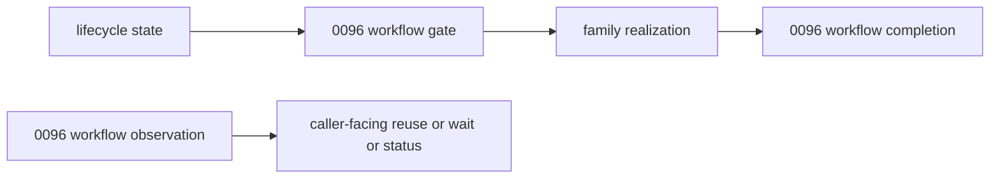

# Summary

`0100` now owns the full distributed-authority substrate:

- front-door credential context and routed-safe credential projection,
- routable authority identity,
- internal owner-stage return,
- transport-derived peer identity, authority binding, delegated disclosure, and handoff continuity,
- issuer-routed lifecycle validation and fail-closed handoff,
- and public continuation surface rules.

`0093` now defines the authority-to-dataplane bridge:

- `ResolvedSourceCapability` is the shared result shape used when a validated path is ready to lower into shared
  execution.

`0094` still defines the local lifecycle baseline:

- lifecycle state holds bounded runtime promises,
- `WorkflowCompanionRef` is the lifecycle-facing pointer to workflow state,
- and `LifecycleUseGuard` marks bounded active use.

With those boundaries established, `0096` is now intentionally semantic-only.
It owns the workflow plane itself:

- issue-time gate,
- redemption-time gate,
- observation,
- completion,
- recovery classes,
- structured workflow-owned outcomes,
- and `0055` operation-style replay, wait, cancel, and status as workflow-semantic owner behavior rather than a
  separate top-level authority plane.

`0096` does not own:

- routing to a non-local workflow owner,
- hop authentication,
- public continuation surface rules,
- the source-capability bridge into shared lowering,
- activation timing relative to long waits,
- or routed path-family composition.

Those belong to `0100` and `0093`.

# Implementation Status

Proposed follow-up design.

Current code now has the first local semantic-convergence baseline:

- shared local workflow-semantic carrier structs live in `lifecycle_kernel.h`,
- `TargetPublicationRegistry` keeps replay and currentness outside lifecycle state while storing explicit local
  workflow binding and replay projections,
- `TargetPublishService` binds lifecycle capabilities through `WorkflowBindingProjection -> WorkflowCompanionRef`,
- caller-visible long-lived continuation still relies on explicit public operation surfaces,
- and `target_publication` now also has its first routed workflow-owner path on the canonical `0100`
  `RouteAuthorityStage` seam:
  `workflow_gate -> continue_with_authority(workflow_to_issuer) -> issuer_validate`.

This document remains proposed because public continuation projection, queue mapping, and richer non-local workflow
owners are still incomplete, even though the grounding `publish` owner now has a first distributed route.

Current code provides one concrete local workflow owner and two calibration constraints:

- `publish` already separates lifecycle admission from current-for-target checks,
- `publish` now declares its local workflow recovery class explicitly as `ephemeral_process_local`,
- `TargetPublicationRegistry` already stores replay and currentness outside lifecycle state,
- `0055` already proves that replay, wait, status, and cancel semantics may require attachable outcomes,
- `0060` already proves that queue blocking and leader fencing are workflow semantics, not lifecycle semantics.

# Problem Statement

## 1. The repository still needs one workflow-semantic contract

The current architecture already knows that replay, currentness, wait, join, cancel, and status are not lifecycle state.
What it still lacks is one shared contract for how those answers are expressed.

## 2. Persisted lifecycle-facing workflow binding is not the same as distributed workflow ownership

`WorkflowCompanionRef` is the accepted lifecycle-facing binding carrier.
It is enough to persist which workflow state a capability refers to.

It is not, by itself, the long-term route or attach handle for non-local workflow ownership.
That distinction must now stay explicit.

## 3. Attach-target identity matters for replay and status reuse

Current code already proves that some existing outcomes are attach-target scoped.
For example:

- daemon-owned operations attach through a daemon runtime,
- GS-backed operations attach through daemon RPCs that proxy to Global Store.

Therefore a workflow replay result cannot rely on bare `operation_id` when attach semantics depend on authority target.

## 4. Recovery honesty is part of the workflow contract

`0092` already requires any state that changes future outcomes to declare its recovery boundary honestly.
Workflow currentness, replay, wait, and fencing are exactly that kind of state.

# Goals / Non-Goals

## Goals

- Define one shared workflow-semantic contract.
- Separate workflow gate, observation, and completion.
- Reuse `WorkflowCompanionRef` and `FencingContext` from `0094`.
- Reuse `AuthorityAttachmentRef` from `0100` for attachable outcomes.
- Map workflow-owned outcomes into `0100` owner-stage outcomes without redefining path-family order.
- Keep persisted lifecycle-facing workflow binding representable in the current `0094` surface.
- Make workflow recovery class and owner-loss behavior explicit.
- Support `publish` as the first landed owner without overfitting the protocol to it.
- Keep `0055` and `0060` as calibration constraints from the start.

## Non-Goals

- Define workflow-owner routing.
- Define daemon-hop auth or relay trust.
- Define lifecycle activation timing or long-wait admission windows.
- Replace `0055` or `0060` with a second workflow framework.
- Move workflow truth into lifecycle tables.
- Split operation-style replay, wait, cancel, or status into a second top-level authority plane.

# Architecture & Interfaces

## 1. Workflow Boundary

Workflow semantic state answers questions such as:

- is this request current,
- is this a replay or join,
- is this caller fenced,
- should the caller wait,
- what existing outcome should be reused,
- what status should be surfaced,
- what terminal semantic result should be recorded.

Lifecycle state answers a different question:

- does a bounded runtime promise currently exist and may it be activated or used.

Boundary rules:

1. Workflow truth remains outside lifecycle ownership.
2. `WorkflowCompanionRef` remains the lifecycle-facing binding carrier, not the workflow truth owner.
3. `0096` defines semantic result classes, not route resolution, hop security, or activation order.
4. `0100` owns path families, wait boundaries, and ingress-mediated composition; `0096` only defines the workflow-owned
   answer space.
5. `0093` owns `ResolvedSourceCapability`; workflow semantics may allow or deny later source-capability mint or return,
   but do not define that bridge.

## 2. Recovery Classes and Ownership

Every workflow semantic owner must declare a `WorkflowRecoveryClass`.

Required values:

| `WorkflowRecoveryClass` | Meaning | Required interpretation |
| --- | --- | --- |
| `ephemeral_process_local` | semantic state is lost with the owning process or daemon | the feature must fail honestly after that loss |
| `local_recoverable` | semantic state is recovered on restart from owner-local durable state | restart on the same authority may preserve semantics |
| `replicated_authority` | semantic state survives failover through an explicit replicated authority | the owning design must define reconciliation and fencing |

Required declaration per workflow semantic owner:

1. owner identity
2. fenced principal when applicable
3. recovery class
4. failure mapping after owner loss or restart

Current grounding:

| Workflow semantic state | Current owner | Recovery class today |
| --- | --- | --- |
| publish current-for-target | `TargetPublicationRegistry.latest_by_target_` | `ephemeral_process_local` |
| publish replay by `publication_id` | `TargetPublicationRegistry.records_` | `ephemeral_process_local` |
| `0055` operation replay or wait or status | operation plane | owner-defined |
| `0060` queue fencing or blocking | queue workflow owner | owner-defined |

## 3. Shared Baseline from `0094` and `0100`

Shared objects:

- `WorkflowCompanionRef`
- `FencingContext`
- `ResolvedSourceCapability`
- `AuthorityAttachmentRef`
- `OwnerStageReply`

Required interpretation:

- `WorkflowCompanionRef` is the only persisted lifecycle-facing workflow reference in this phase,
- `ResolvedSourceCapability` is the shared bridge used when a workflow-approved path later lowers into shared execution,
- any attachable replay or status outcome must use `AuthorityAttachmentRef`,
- bare `workflow_id` or bare `operation_id` is insufficient when the caller must attach to an existing authority-scoped
  outcome,
- `AuthorityAttachmentRef` is daemon-consumed attach identity and does not authorize SDK direct endpoint attachment,
- when a non-local workflow owner returns control to ingress daemon for a later wait, retry, or attach path, it does so
  through `OwnerStageReply` from `0100`,
- activation timing remains outside `0096`.

## 4. Gate Objects

### 4.1 `WorkflowIssueContext`

`WorkflowIssueContext` is the issue-time semantic input before capability mint.

Required fields:

- `family`
- optional `adapter_kind`
- optional `requested_workflow_ref`
- request-local semantic claims required by the workflow owner

Critical rule:

- issue-time workflow admission must not require fabricated lifecycle identifiers before lifecycle mint.

### 4.2 `WorkflowBindingProjection`

`WorkflowBindingProjection` is the workflow-owned result that may be persisted into lifecycle-facing state.

Required fields:

- `resolved_workflow_ref`

Required rules:

1. Persisted workflow binding must stay representable as `WorkflowCompanionRef`.
2. Owner-specific workflow metadata that does not fit that surface must remain in workflow-owned state.
3. Workflow binding projection is not a distributed route or attach handle by itself.

### 4.3 `WorkflowRedemptionContext`

`WorkflowRedemptionContext` is the semantic input after whatever `0100`-declared path-family-local preparation step has
produced the local context required by the workflow contract.

That preparation may follow lifecycle-owner precheck or activation, or it may precede later lifecycle adoption, depending
on the declared `0100` path family.

Required fields:

- `family`
- optional `adapter_kind`
- `workflow_ref`
- optional `capability_id`
- optional `subject_id`
- optional `binding_id`
- optional `lifecycle_fencing_context`
- request-local semantic claims needed by the workflow owner

### 4.4 `WorkflowGateDecision`

`WorkflowGateDecision` standardizes workflow-owned gate result classes.

Required fields:

- `decision_class`
- `resolved_workflow_ref`
- optional `binding_projection`
- optional `outcome_projection`
- optional `diagnostics`

Required result classes:

- `admit`
- `replay`
- `stale_current`
- `fenced`
- `cancelled`
- `failed_precondition`

Critical rules:

1. `WorkflowGateDecision` is a semantic gate result only.
2. Wait and status remain observation results.
3. If a replay result requires the caller to attach to an existing outcome, `outcome_projection` must carry
   `AuthorityAttachmentRef`.
4. `WorkflowGateDecision` does not itself define `ResolvedSourceCapability`; it authorizes, rejects, or redirects the
   later path that may mint or return that bridge.
5. `WorkflowGateDecision` does not itself define distributed stage order; it maps into `0100` path families and owner
   replies.

## 5. Observation Objects

### 5.1 `WorkflowObservationQuery`

`WorkflowObservationQuery` is the semantic input for replay lookup, join lookup, wait, status, or currentness.

Required fields:

- `workflow_ref`
- `observation_kind`
- optional `adapter_kind`
- optional `capability_id`
- optional `subject_id`
- optional `binding_id`
- optional `wait_deadline`
- request-local semantic claims needed by the owner

Required `observation_kind` values:

- `replay_lookup`
- `join_lookup`
- `status`
- `wait`
- `currentness`

### 5.2 `WorkflowOutcomeProjection`

`WorkflowOutcomeProjection` is the structured existing-outcome carrier.

Required fields:

- `projection_kind`
- `owner_workflow_id`
- optional `attachment_ref`
- optional `existing_capability_id`
- optional status projection
- optional current-winner hint
- optional family-defined payload

Required `projection_kind` values:

- `existing_capability`
- `existing_operation`
- `status_snapshot`
- `current_winner_hint`
- `family_defined`

Critical rules:

1. Any attachable outcome must carry `attachment_ref`.
2. Bare `existing_operation_id` is not a sufficient long-term replay projection when attach semantics depend on owner
   authority.
3. The projection must be sufficient for caller-facing reuse without an undocumented side table contract.

### 5.3 `WorkflowObservationResult`

`WorkflowObservationResult` is the carrier for workflow-owned observation answers.

Required fields:

- `observation_kind`
- `resolved_workflow_ref`
- optional `outcome_projection`
- optional `ready`
- optional `diagnostics`

Required rules:

1. Wait semantics belong here, not in gate decisions.
2. Observation may block or return not-ready according to the owning workflow contract.
3. Observation does not mutate lifecycle truth by itself.
4. Observation does not itself lower into shared dataplane execution.

### 5.4 `WorkflowCompletionContext`

`WorkflowCompletionContext` is the semantic write-back carrier after realization or terminal failure.

Required fields:

- `family`
- optional `adapter_kind`
- `workflow_ref`
- `completion_class`
- optional `capability_id`
- optional `subject_id`
- optional semantic completion facts required by the owner

Typical `completion_class` values:

- `completed`
- `failed`
- `cancelled`
- `released_without_realization`

## 6. Shared Workflow Protocol Stages

### 6.1 Issue-time gate

Used when semantic admission is required before mint.

Examples:

- publish admission,
- operation replay or join decision before mint,
- queue-owned authority checks before issuing a daemon-scoped capability.

Required rule:

- issue-time workflow results that later matter during redemption must be persisted through `WorkflowBindingProjection`.

### 6.2 Redemption-time gate

Used when a previously minted capability still needs workflow currentness, replay, or fencing checks.

Examples:

- publish current-for-target,
- queue leader-epoch checks,
- operation-scoped cancellation or replay checks.

Required rule:

- if a redemption path has already activated lifecycle use, any non-`admit` workflow result must release or avoid
  retaining that active use according to `0100`.
- if a later step will move bytes, `0093` owns the bridge into `ResolvedSourceCapability` and `0100` owns when ingress
  lowering begins.

Canonical mapping to `0100` in this phase:

- `admit`
  - maps to `OwnerStageReply(continue_with_authority)` only when the declared `0100` family is
    `gate, continue, then adopt`
- `replay`
  - maps to `OwnerStageReply(attach_existing)`
- `stale_current`, `fenced`, `cancelled`, `failed_precondition`
  - map to `OwnerStageReply(terminal)`

### 6.3 Observation

Used when the caller needs workflow-owned replay, join, wait, status, or currentness information.

Required rule:

- workflow observation must not be down-converted into lifecycle not-found or expiry.
- wait and not-ready observation outcomes map through `OwnerStageReply(retry_later)` or `attach_existing` only when the
  declared `0100` family and recovery class permit that projection honestly.

### 6.4 Completion

Used when realization or terminal failure must update workflow-owned state.

Required rule:

- workflow completion remains owner-specific semantic state, not lifecycle state.

## 7. Family Mappings

### 7.1 `publish`

`publish` is the first intended concrete owner.

Current grounded behavior:

- lifecycle admission is local,
- current-for-target and replay remain in `TargetPublicationRegistry`,
- current publish semantic state is explicitly `ephemeral_process_local`.

### 7.2 `0055` operation plane

Long-term interpretation:

- semantic replay, join, wait, cancel, and status remain operation-owned,
- attachable existing-operation outcomes must use `AuthorityAttachmentRef`,
- caller-visible long-lived reattach should surface as `Operation[T]` by default, with `AuthorityAttachmentRef`
  remaining
  the daemon-consumed attach identity underneath,
- paths that do not move bytes stop at attachment or observation results rather than fabricating a source-capability
  bridge,
- lifecycle state may point at operation-owned workflow state, but must not replace it.

### 7.3 `0060` queue workflows

Long-term interpretation:

- queue fencing, visibility, and blocking remain workflow-owned,
- queue blocking is not a workflow gate result class,
- queue outcomes must not be down-converted into lifecycle expiry or not-found.

### 7.4 `serve`, `export`, `placement`, `retention`

Ordinary flows may omit workflow ownership entirely unless a higher-level workflow attaches one.

# Error Model

Required semantic split:

- replay hit
  - workflow replay result with structured `WorkflowOutcomeProjection`
- stale current
  - workflow-owned stale or failed-precondition result
- fenced
  - workflow-owned fenced result
- cancelled
  - workflow-owned cancelled result
- wait not ready
  - workflow observation result, not lifecycle expiry
- owner loss
  - according to `WorkflowRecoveryClass`, not lifecycle expiry by default

# Observability

Minimum required dimensions:

- `family`
- `workflow_owner_kind`
- `workflow_recovery_class`
- `workflow_stage`
  - `issue_gate`
  - `redeem_gate`
  - `observe`
  - `completion`
- `workflow_decision_class`
- `workflow_observation_kind`
- `workflow_projection_kind`
- `workflow_attachment_kind`

# Naming Compliance

Planned interface names introduced or clarified by this phase:

| Interface | Language | Rule | Result |
| --- | --- | --- | --- |
| `WorkflowRecoveryClass` | C++ enum class | `PascalCase` | pass |
| `WorkflowIssueContext` | C++ struct | `PascalCase` | pass |
| `WorkflowBindingProjection` | C++ struct | `PascalCase` | pass |
| `WorkflowRedemptionContext` | C++ struct | `PascalCase` | pass |
| `WorkflowGateDecision` | C++ struct | `PascalCase` | pass |
| `WorkflowObservationQuery` | C++ struct | `PascalCase` | pass |
| `WorkflowOutcomeProjection` | C++ struct | `PascalCase` | pass |
| `WorkflowObservationResult` | C++ struct | `PascalCase` | pass |
| `WorkflowCompletionContext` | C++ struct | `PascalCase` | pass |

# Schema Changes

No persistent schema changes are required in this design itself.

Future implementation may require additive workflow-RPC or SDK payload fields for:

- `AuthorityAttachmentRef`,
- structured replay projections,
- and explicit workflow-owner diagnostics.

# Trade-offs & Risks

- Narrowing `0096` makes it less self-sufficient than the previous version.
  That is intentional because route and activation concerns do not belong in the workflow-semantic contract itself.
- Requiring `AuthorityAttachmentRef` for attachable outcomes adds another carrier.
  That cost is justified because current code already proves attach-target identity matters.
- Keeping `WorkflowCompanionRef` as the only persisted lifecycle-facing workflow binding is stricter than allowing
  arbitrary metadata.
  That strictness preserves the current accepted `0094` surface.

# Compatibility & Acceptance Criteria

Acceptance criteria:

- `0096` depends on `0100` for attachable outcome handles instead of inventing private replay routing
- `0096` maps workflow-owned outcomes into `0100` owner-stage outcomes instead of defining repository-wide path order
- any future non-local workflow routing consumes `0100` distributed-authority semantics instead of defining workflow-private trust policy
- `WorkflowCompanionRef` remains the only persisted lifecycle-facing workflow binding in this phase
- workflow replay, join, wait, status, and currentness remain outside lifecycle state
- attachable existing outcomes require `AuthorityAttachmentRef`
- operation-style replay, wait, cancel, and status remain within the workflow-semantic plane instead of becoming a new
  top-level authority plane
- workflow owner loss is mapped through `WorkflowRecoveryClass`
- `publish` remains the first landed owner without becoming the protocol's shape center
- `0055` and `0060` remain representable without forcing one storage backend or one route backend

# References

- `0100` for front-door context, distributed authority routing, trust semantics, attach refs, owner-stage reply,
  path-family composition, and public continuation surfaces.
- `0093` for `ResolvedSourceCapability` and the authority-to-dataplane bridge.
- `0094` for lifecycle-facing workflow binding and active-use boundaries.
- `0055` for operation replay, wait, status, and attach-target semantics.
- `0060` for queue fencing and blocking semantics.
