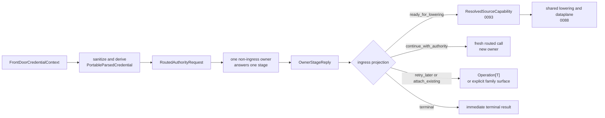

# Summary

`0092`, `0088`, `0090`, `0093`, and `0094` already define the repository-wide constitution:

- one artifact object model,
- one shared dataplane,
- one truth lattice,
- one authority-to-dataplane bridge,
- one local lifecycle kernel,
- and multiple valid authority modes.

The staged follow-up work originally split that next layer across:

- front-door credential sanitization,
- routed protocol algebra,
- distributed security kernel semantics,
- and issuer-routed lifecycle handoff.

Those pieces only make sense as one system.
`0100` is now the single active design for that full distributed-authority line above authority truth and below shared
lowering.

It defines:

- the ingress-local front-door seam and routed-safe credential projection,
- one canonical routed owner request,
- one canonical owner reply algebra,
- one shared distributed security kernel for peer identity, authority binding, delegated disclosure, and continuity,
- one issuer-stage lifecycle validation and fail-closed handoff contract for remote-redeemable capabilities,
- one canonical set of path families and stage-order rules,
- ingress-mediated multi-stage composition,
- strict request/reply identity matching plus fail-closed reply admissibility,
- and one public projection rule that converges on `Operation[T]` or another explicit family surface.

The former staged drafts `0095`, `0099`, and `0101` are superseded and folded into this design so the repository has
one active distributed-authority design rather than several overlapping ones.

Long-term repository rule:

- `0096` may define workflow semantics on top of this substrate,
- but child designs must not mint private routed request or reply dialects,
- they must not define repository-wide cross-owner stage order outside `0100`,
- they must not redefine peer identity, authority binding, or disclosure policy outside `0100`,
- and any byte-moving success path must still end in `ResolvedSourceCapability` and ingress-owned lowering into the
  shared dataplane from `0088` and `0093`.

# Implementation Status

Proposed umbrella design with most lower layers already landed.

Current code now includes:

- `FrontDoorCredentialContext`, `PortableParsedCredential`, `ForwardableCredentialEvidence`, and explicit local
  observations on active routed fronts,
- canonical routed protocol types plus additive daemon-internal `RouteAuthorityStage` RPCs,
- `DistributedSecurityKernel` for transport-derived peer identity, authority binding, delegated disclosure, and
  fail-closed reply admission,
- and the first routed issuer path using `RoutedAuthorityRequest` plus `OwnerStageReply(ready_for_lowering)`.

This document remains proposed because the last active gap is still above those landed layers:
the first end-to-end projection of non-terminal owner replies into the public `Operation[T]` continuation surface is not
fully closed yet.

# Problem Statement

## 1. The repository still risks multiple distributed-control dialects

issuer-stage paths, workflow-stage paths, and front-door-specific paths all need to talk about:

- what a non-ingress owner receives,
- what that owner may return,
- what may cross a daemon hop,
- and what later becomes public to callers.

If each child design keeps defining its own partial carriers, TensorCast will keep one shared dataplane but multiple
control protocols above it.

## 2. Front-door parse output is ingress-local unless proven portable

`0094` correctly makes `ParsedCredential` the front-door parse result.
That does not make every parsed fact safe to forward.

Without a routed-safe projection boundary, ingress-local transport facts or opaque decode state can leak across hops
inside what looks like a semantic credential object.

## 3. Authority continuity must be fail-closed, not best-effort

`AuthorityLocator` may be stale by design.
That is acceptable only if the protocol makes reply admissibility fail-closed.

If a reply from a stale, retired, or wrong owner can be treated as valid because the carrier is well-formed, the
repository has no real authority handoff boundary.

## 4. Multi-owner paths need ingress-mediated composition, not owner chaining

Some long-term paths require more than one non-ingress semantic owner.
That is compatible with the repository only if:

- each routed call still has exactly one answering owner,
- ingress remains the only composer of later stages,
- and no owner turns into a generic transit runtime.

## 5. The owner reply algebra must be typed enough to be complete

The repository needs more than `ready_for_lowering`.
It also needs:

- typed continuation,
- typed attach,
- and typed terminal results.

If those outcomes are not first-class in the canonical reply algebra, child designs will keep inventing their own
terminal or continuation carriers.

# Goals / Non-Goals

## Goals

- Define one repository-wide distributed-authority protocol algebra above authority truth and below shared lowering.
- Require routed requests to carry a routed-safe portable credential projection rather than raw ingress-local parse
  state.
- Require strict ingress request/reply shape checks and keep authority binding or continuity enforcement inside the
  shared security-kernel layer defined here.
- Support ingress-mediated multi-stage composition without allowing owner-to-owner chaining.
- Define the canonical path families and make `0100` the only owner of repository-wide cross-owner stage order.
- Make `OwnerStageReply` a tagged union with typed payload requirements.
- Keep `Operation[T]` as the default public continuation surface for long-lived wait, retry, attach, replay, cancel,
  or status.
- Keep backend authority source pluggable by authority mode instead of flattening all truth into one fake global owner.

## Non-Goals

- Move ordinary GS-backed artifacts onto shard-home routed authority.
- Move routed `byte_artifact` per-blob truth back into Global Store.
- Redefine the local front-door parse boundary from `0094`.
- Split front-door sanitization, issuer-stage lifecycle validation, or distributed trust back into separate active
  designs.
- Redefine workflow semantic gate, observation, or completion classes. `0096` remains authoritative there.
- Redefine `ResolvedSourceCapability` or shared lowering. `0093` and `0088` remain authoritative there.
- Expose daemon-internal routing or attachment carriers directly as new SDK primitives.

# Architecture & Interfaces

## 1. Canonical protocol algebra and ownership

Normative rules:

1. Every distributed authority path begins from ingress-local front-door state produced by the unified front-door seam
   defined here.
2. A routed request must carry only routed-safe semantic state plus explicit forwardable evidence and explicit forwarded
   claims.
3. A non-ingress owner answers at most one stage per routed call.
4. Only ingress may compose more than one non-ingress stage.
5. Any byte-moving success path must return `ResolvedSourceCapability` before lowering begins.
6. Child designs must reuse this algebra instead of defining private routed-control vocabularies.
7. `0100` is the only owner of repository-wide cross-owner stage order and legal path-family composition in this phase.

Carrier reuse is necessary but not sufficient here.
The canonical distributed-control line is the combination of routed request or reply shape, reply admissibility, legal
path families, and public projection.

### 1.1 `path_family` and `stage_ref`

`path_family` names which canonical `0100` family from section 9 the routed call is executing.
`stage_ref` names the current stage inside that family.

Critical rules:

1. Child designs may choose their concrete stage names, but those names must live inside one declared `path_family`.
2. `stage_ref` is part of the protocol contract checked at ingress, not a transport hint.
3. `continue_with_authority` is legal only when the current `stage_ref` has a declared outgoing edge in its
   `path_family`.

## 2. Authority identity, locator, and reply matching

### 2.1 `AuthorityRef`

`AuthorityRef` is the correctness identity of the owner for one stage.

Minimum required fields:

- `authority_kind`
- `authority_id`
- optional `fencing_context`

Critical rules:

1. `AuthorityRef` names who owns this stage's truth, not which endpoint is currently routable.
2. Endpoint address belongs in locator results, not in `AuthorityRef`.
3. Different authority modes may mint `AuthorityRef` differently:
   - GS-backed catalog owners,
   - shard-home routed owners,
   - workflow or operation owners,
   - issuer-local lifecycle owners.

### 2.2 `AuthorityLocator`

`AuthorityLocator` resolves `AuthorityRef` to a current transport target with bounded staleness.

Required operations:

- `warm_authorities(authority_refs, now, staleness_budget)`
- `resolve_authority(authority_ref, now, staleness_budget)`

Critical rules:

1. `AuthorityLocator` is backend-agnostic at the protocol layer.
2. The implementation may read from:
   - Global Store lease or registry data,
   - daemon directory caches,
   - workflow-specific registries,
   - or another explicit owner-defined resolver.
3. `AuthorityLocator` must not collapse distinct authority modes into one fake global authority store.

### 2.3 Reply matching and continuity handoff boundary

Reply validity begins with ingress shape matching; the shared security-kernel layer then verifies authority binding and
continuity against authenticated peer state.

Required rules in this phase:

1. `RoutedAuthorityRequest.authority_ref`, `path_family`, and `stage_ref` together define the requested owner and stage
   contract.
2. `OwnerStageReply.answered_by` must exactly equal the requested `authority_ref`.
3. `OwnerStageReply.path_family` and `stage_ref` must exactly match the requested values.
4. If `answered_by`, `path_family`, or `stage_ref` does not exactly match the request, ingress must reject the reply
   fail-closed.
5. A stale locator, retired owner, or owner-turnover event must surface as `unavailable`, `failed_precondition`, or
   another explicit fail-closed error, not as optimistic success from the wrong owner.
6. Any future successor-proof or continuity extension stays inside this design's shared security-kernel layer; the
   request/reply shape must remain strict enough for that verification to be fail-closed.

This exact-match rule is intentionally strict.
It keeps authority handoff semantics honest until the repository defines a stronger verified successor protocol.

## 3. Hop-auth projection

### 3.1 `DaemonHopAuthContext`

`DaemonHopAuthContext` carries the protocol-visible projection of the current daemon hop's authenticated state.
Its authoritative meaning is defined by the shared security-kernel layer in this design, not by sender-reported payload
fields alone.

Required `auth_class` values:

- `legacy_unauthenticated`
- `deployment_trusted_channel`
- `daemon_mutual_auth`

Critical rules:

1. `legacy_unauthenticated` is never sufficient for forwarding redeemable credential evidence or relay-authenticated
   semantic claims.
2. New routed designs that forward redeemable evidence or relay semantic claims must default to `daemon_mutual_auth`.
3. `deployment_trusted_channel` is transitional only. Any design that uses it must document why its confidentiality,
   integrity, and replay assumptions are equivalent for that deployment boundary.
4. Hop security never upgrades the semantic provenance of an ingress-local fact into authority truth by itself.

## 4. Forwarded claims

### 4.1 `ForwardedClaimProvenance`

Required values:

- `authority_authenticated`
- `relay_authenticated`
- `ingress_local`

Critical rules:

1. `ingress_local` claims are never silently equivalent to owner-authenticated semantic truth.
2. `relay_authenticated` claims remain invalid on `legacy_unauthenticated` hops.
3. A child design that accepts forwarded claims must state which claim kinds it accepts at which provenance class.

### 4.2 `ForwardedClaim`

`ForwardedClaim` is the only protocol-level carrier for a routed semantic claim that is neither front-door evidence nor
an owner reply.

Minimum required fields:

- `claim_kind`
- `provenance`
- `claim_payload`
- `minted_by_authority_ref`
- `audience_authority_ref`
- `bound_root_request_id`
- optional `bound_credential_binding_digest`
- optional `bound_path_family`
- optional `bound_edge`
- optional `claim_expires_at`
- optional `claim_authenticator`

Normative rules:

1. Local observations from the front-door seam must first be consumed, rejected, or explicitly translated before they may
   appear here.
2. `authority_authenticated` and `relay_authenticated` claims must carry enough authenticator or binding material for the
   receiving owner to validate provenance honestly.
3. Claims forwarded across multiple stages must remain bound to the root request and, when available, the credential
   binding digest used for that path.

## 5. Canonical routed owner request

### 5.1 `RoutedAuthorityRequest`

`RoutedAuthorityRequest` is the only canonical routed owner request shape in this phase.

Required fields:

- `authority_ref`
- `path_family`
- `stage_ref`
- `portable_credential`
- optional `forwardable_evidence`
- `hop_auth_context`
- `forwarded_claims`
- `request_metadata`

Required interpretation:

1. `portable_credential` is the routed-safe credential projection from the front-door seam in this design, not raw
   ingress-local parse state.
2. `forwardable_evidence` comes from that same front-door seam; absence of `forwardable_evidence` means the path has no cross-hop
   revalidation material.
3. `forwarded_claims` is explicit and provenance-labeled; it is not a dumping ground for request-local side facts.
4. `path_family` and `stage_ref` identify which canonical `0100` family and stage this routed call is executing.
5. `request_metadata` carries deadline, tracing, retry, idempotency, root-request identity, credential binding digest
   when available, and bounded hop-budget context only; it must not smuggle owner-private workflow decisions or copy
   instructions.

## 6. Canonical owner reply algebra

### 6.1 `AuthorityAttachmentRef`

`AuthorityAttachmentRef` is the daemon-consumed attach identity for an authority-scoped ongoing or existing outcome.

Minimum required fields:

- `authority_ref`
- `attachment_kind`
- `attachment_id`
- optional `fencing_context`

Critical rules:

1. `AuthorityAttachmentRef` is daemon-internal choreography state.
2. It is not a public SDK routing primitive.
3. It may be used for attach-existing or retry-later flows when the owner exposes a stable reentry target.

### 6.2 `AuthorityContinuation`

`AuthorityContinuation` is the ingress-consumed instruction to continue the distributed semantic path with another
authority in a fresh routed call.

Minimum required fields:

- `next_authority_ref`
- `edge_ref`
- `forwarded_claims`
- optional `continuation_reason`

Critical rules:

1. `AuthorityContinuation` does not authorize owner-to-owner chaining; it authorizes ingress to make the next routed
   call.
2. Claims added through `AuthorityContinuation` must be explicit and provenance-labeled; claims minted by the answering
   owner for later stages must be `authority_authenticated` for that owner and audience-bound to the declared next edge.
3. `edge_ref` must identify one declared outgoing edge inside the current `path_family`; it is not a free-form next-hop
   escape hatch.
4. The next owner must still validate the shared security-kernel trust inputs, evidence sufficiency, and accepted claim
   provenance for itself.
5. `AuthorityContinuation` must not carry copy instructions or owner-private execution handles.

### 6.3 `TerminalProjection`

`TerminalProjection` is the canonical daemon-internal terminal result payload for a stage that ends without lowering or
public continuation.

Minimum required fields:

- `projection_kind`
- optional `status_code`
- optional `family_payload`

Required `projection_kind` values in this phase:

- `semantic_success`
- `semantic_reject`
- `status_snapshot`
- `family_defined`

Critical rules:

1. `TerminalProjection` must be self-contained enough for ingress to project a public immediate result without a hidden
   side-table contract.
2. `TerminalProjection` is not a raw SDK primitive.
3. A child design that needs richer terminal payloads must extend this type, not bypass it.

### 6.4 `OwnerStageReply`

`OwnerStageReply` is the only canonical daemon-internal reply from a non-ingress owner in this phase.

Required fields:

- `answered_by`
- `path_family`
- `stage_ref`
- `reply_kind`
- optional `resolved_source_capability`
- optional `continuation`
- optional `attachment_ref`
- optional `terminal_projection`
- optional `diagnostics`

Required `reply_kind` values:

- `ready_for_lowering`
- `continue_with_authority`
- `retry_later`
- `attach_existing`
- `terminal`

Critical rules:

1. `OwnerStageReply` is a tagged reply family. Each `reply_kind` has exclusive payload constraints, and payload
   families not applicable to that kind must be absent.
2. `path_family` and `stage_ref` must echo the requested values from `RoutedAuthorityRequest`.
3. `ready_for_lowering` must carry `ResolvedSourceCapability`.
4. `continue_with_authority` must carry `AuthorityContinuation`.
5. `attach_existing` must carry `AuthorityAttachmentRef`.
6. `retry_later` may carry `AuthorityAttachmentRef` when the owner exposes a stable reentry target; otherwise ingress
   must treat it as an observe-then-retry public continuation with no raw owner handle crossing the SDK boundary.
7. `terminal` must carry `TerminalProjection`.
8. `OwnerStageReply` must not be exposed as a raw SDK primitive.

## 7. Adoption boundary

This protocol line must remain compatible with `0094`'s lifecycle admission rules and `0093`'s source-capability
bridge.

Critical rules:

1. `LifecycleUseGuard` is owner-local and does not cross a daemon hop.
2. The adoption point is the exact moment where owner-local admission becomes cross-owner adopted protection.
3. For byte-moving paths, `OwnerStageReply(reply_kind=ready_for_lowering)` is legal only after that adoption has
   happened.
4. In this phase, the canonical adopted-protection bridge is `ResolvedSourceCapability.serving_capability`.
5. A distributed design must not return a half-admitted, owner-private pre-execution state as if it were a stable
   bridge.

## 8. Ingress-mediated composition and public projection

### 8.1 Ingress reentry rules

Ingress remains the only legal composer of multi-owner distributed paths.

Required rules:

1. Every owner-to-owner transition must first return to ingress through `OwnerStageReply`.
2. `continue_with_authority` causes ingress to build a fresh `RoutedAuthorityRequest` for the next owner, preserving:
   - the same root request metadata,
   - the same `portable_credential`,
   - the same forwardable evidence,
   - and only the forwarded claims that are still valid for the declared `path_family`, next `edge_ref`, audience, and
     request or credential bindings.
3. Ingress must reject loops, undeclared stage graphs, or unbounded continuation depth.
4. A non-ingress owner must not directly invoke another non-ingress owner as a generic transit runtime in the same
   phase.

### 8.2 Public continuation and terminal surfaces

Allowed public result families in this phase:

- immediate terminal result,
- `Operation[T]`,
- another explicit family-defined public surface with an equally strong attachment and recovery contract.

Critical rules:

1. `Operation[T]` is the default public continuation surface for long-lived wait, retry, attach, replay, cancel, or
   status.
2. Bare `AuthorityAttachmentRef` and bare `OwnerStageReply` must not cross the SDK boundary.
3. Bare `operation_id` is not a sufficient public attach contract unless the public surface explicitly defines authority
   identity and recovery semantics.

## 9. Canonical path families

These families are not illustrative examples.
They are the canonical repository-wide owners of legal cross-owner stage order in this phase.

### 9.1 Required declaration for every multi-authority path

Every multi-authority path must declare:

| Declaration | Meaning |
| --- | --- |
| ingress owner | external ingress and local observation boundary |
| authority mode | GS-backed, shard-home routed, issuer-local, or another explicit owner-defined mode |
| stage graph | ordered owner stages and legal `continue_with_authority` edges |
| evidence source | which front-door evidence kind the path requires |
| security-kernel input requirement | minimum auth projection and disclosure policy consumed by the shared security kernel |
| accepted forwarded claims | claim kinds plus required provenance plus required audience or request bindings |
| owner reply kinds | which `OwnerStageReply.reply_kind` values are legal |
| adoption point | exact point where owner-local admission becomes cross-owner adopted protection |
| lowering owner | who constructs shared lowering |
| blocking model | non-blocking, observe-then-retry, continue-then-adopt, or attach-existing |
| public projection | immediate, `Operation[T]`, or another explicit family surface |
| completion owner | who owns terminal semantic completion |
| recovery class | what survives owner loss, restart, or failover |
| error mapping | how stage-local failures are surfaced |

Critical rule:

- if a design cannot fill this table honestly, the path is not ready to implement safely.

### 9.2 Path family: immediate lowering

Use when one owner stage can validate and adopt protection immediately.

Shape:

- ingress builds `RoutedAuthorityRequest`
- owner validates and adopts protection
- owner returns `OwnerStageReply(ready_for_lowering)`
- ingress lowers through `ResolvedSourceCapability`
- shared dataplane executes

Critical rule:

- this family has no legal outgoing `continue_with_authority` edge.

### 9.3 Path family: gate, continue, then adopt

Use when one non-ingress semantic owner must answer before the lifecycle owner may adopt protection.

Shape:

- ingress builds routed request to workflow or policy owner
- first owner validates its semantic gate
- first owner returns `OwnerStageReply(continue_with_authority)` with explicit forwarded claims for the next stage
- ingress builds a fresh routed request to the lifecycle owner
- lifecycle owner adopts protection
- lifecycle owner returns `OwnerStageReply(ready_for_lowering)`
- ingress lowers

Critical rules:

1. The first owner does not directly call the lifecycle owner.
2. Long waits must not happen under active lifecycle admission unless the owning design defines a bounded adopted
   protection that survives that wait.
3. A child design may use this family only if it explicitly declares the gate owner, the adoption owner, and the exact
   forwarded-claim bindings accepted on the continuation edge.

### 9.4 Path family: observe or retry later

Use when the owner may return not-ready or observation outcomes.

Shape:

- ingress builds routed request
- owner answers `OwnerStageReply(retry_later)`
- ingress projects to `Operation[T]` or another explicit public continuation
- ingress later re-enters with a fresh routed request or attach flow

Critical rule:

- this family is legal only when the owner declares a recovery class and a public reentry contract honestly.

### 9.5 Path family: attach existing

Use when the owner points ingress at an already-existing authority-scoped outcome.

Shape:

- ingress builds routed request
- owner answers `OwnerStageReply(attach_existing)`
- ingress projects to `Operation[T]` or another explicit public surface
- no new byte movement starts unless a later routed call returns `ready_for_lowering`

Critical rule:

- this family is legal only when the owner can expose an existing outcome with an honest attachment and recovery contract.

### 9.6 Path family: immediate terminal

Use when the owner can answer the semantic question completely in this stage.

Shape:

- ingress builds routed request
- owner answers `OwnerStageReply(terminal)`
- ingress projects `TerminalProjection` to an immediate public result

### 9.7 Global blocking rules

Normative rules:

1. Non-ingress owners remain one-owner-per-routed-call.
2. All multi-owner composition is ingress-mediated.
3. Long waits do not hold active lifecycle admission unless the owning design explicitly defines a bounded adopted
   protection that survives that wait.
4. Any path that will move bytes must re-enter ingress before lowering begins.

## 10. Relationship to adjacent designs

- `0100` owns the front-door seam, routed request and owner reply protocol line, issuer-stage lifecycle validation, and
  distributed trust semantics for non-local authority paths.
- `0096` owns workflow-semantic gate, observation, and completion classes.
- `0093` owns `ResolvedSourceCapability` as the bridge into shared lowering.
- `0094` owns lifecycle admission and owner-local `LifecycleUseGuard`.
- `0088` owns shared dataplane convergence.
- `0055` owns `Operation[T]` as the default public continuation surface.

# Error Model

- routed request contains non-portable credential facts
  - invalid argument or failed precondition
- forwardable redeemable evidence attempted on insufficient hop auth
  - unauthenticated or failed precondition
- routed owner request missing required forwardable evidence
  - failed precondition
- forwarded claim uses insufficient provenance for the owning design
  - invalid argument or failed precondition
- `answered_by` does not match requested `authority_ref`
  - failed precondition, unauthenticated, or unavailable
- `path_family` or `stage_ref` does not match the request
  - failed precondition or invalid argument
- forwarded claim is missing required audience or request or credential binding
  - failed precondition or unauthenticated
- owner returns a reply kind without its required payload
  - internal error or failed precondition
- owner attempts to transit semantic work directly to a third authority in the same phase
  - failed precondition or unimplemented
- owner returns half-admitted private execution state instead of adopted protection
  - failed precondition or internal error
- daemon-internal attachment handle leaked as a public primitive
  - failed precondition or unimplemented

# Observability

Minimum required dimensions:

- `authority_mode`
- `authority_kind`
- `reply_kind`
- `hop_auth_class`
- `forwarded_claim_provenance`
- `authority_match_result`
- `path_family`
- `continuation_kind`
- `public_projection_kind`
- `recovery_class`
- `hop_depth`

# Naming Compliance

| Interface | Language | Rule | Result |
| --- | --- | --- | --- |
| `AuthorityRef` | C++ struct | `PascalCase` | pass |
| `AuthorityLocator` | C++ class | `PascalCase` | pass |
| `DaemonHopAuthContext` | C++ struct | `PascalCase` | pass |
| `ForwardedClaim` | C++ struct | `PascalCase` | pass |
| `ForwardedClaimProvenance` | C++ enum class | `PascalCase` | pass |
| `RoutedAuthorityRequest` | C++ struct | `PascalCase` | pass |
| `AuthorityAttachmentRef` | C++ struct | `PascalCase` | pass |
| `AuthorityContinuation` | C++ struct | `PascalCase` | pass |
| `TerminalProjection` | C++ struct | `PascalCase` | pass |
| `OwnerStageReply` | C++ struct | `PascalCase` | pass |
| `warm_authorities` | C++ function | `snake_case` | pass |
| `resolve_authority` | C++ function | `snake_case` | pass |

# Schema Changes

No persistent schema changes are required in this design itself.

# Trade-offs & Risks

- This rewrite makes `0100` the explicit parent design for distributed authority protocol shape.
  That centralization is intentional because protocol ownership must converge somewhere.
- The exact-match authority continuity rule is stricter than allowing optimistic owner turnover.
  That strictness is correct until the repository lands a verified successor protocol.
- Adding `continue_with_authority` increases the explicit protocol surface.
  That cost is justified only if `0100` keeps path-family ownership strict enough that continuation cannot become a
  generic transit escape hatch.
- Requiring `portable_credential` instead of raw parsed state may force some current front doors to admit they are local
  only.
  That is a feature, not a regression.

# Compatibility & Acceptance Criteria

Acceptance criteria:

- child designs stop inventing separate routed request and owner reply vocabularies,
- all routed owner requests use `portable_credential` plus explicit evidence and explicit forwarded claims,
- `0100` is the only owner of repository-wide cross-owner stage order and canonical path families,
- `answered_by` must exactly match the requested `authority_ref` in this phase,
- `path_family` and `stage_ref` must exactly match the request in this phase,
- all multi-owner semantic paths are ingress-mediated and use `continue_with_authority` rather than owner chaining,
- all multi-owner semantic paths declare one of the canonical `0100` path families honestly,
- forwarded claims carry sufficient audience and request or credential binding to be admissible at the next stage,
- all byte-moving distributed success paths return `OwnerStageReply(ready_for_lowering)` with `ResolvedSourceCapability`,
- long-lived public continuation converges on `Operation[T]` or another explicit family surface,
- `OwnerStageReply` is treated as a tagged union with typed payload requirements,
- bare `AuthorityAttachmentRef` and bare `OwnerStageReply` never cross the SDK boundary,
- path-family composition ownership is fully subsumed here.

# References

- `0092` for the repository-wide split between artifact families, truth layers, and authority modes.
- `0088` for shared dataplane convergence.
- `0090` for routed `byte_artifact` authority split and recovery boundary.
- `0093` for `ResolvedSourceCapability`.
- `0094` for lifecycle admission and `LifecycleUseGuard`.
- `0096` for workflow semantics.
- `0055` for `Operation[T]` as the public continuation surface.
- This design absorbs the formerly split staged drafts `0095`, `0099`, and `0101`.
