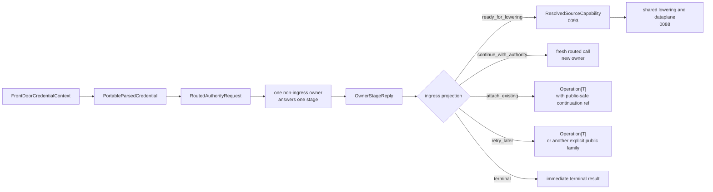

# Summary

`0092`, `0088`, `0090`, `0093`, and `0094` already define the repository-wide constitution:

- one artifact object model,
- one shared dataplane,
- one truth lattice,
- one authority-to-dataplane bridge,
- one local lifecycle kernel,
- and multiple valid authority modes.

`0100` remains the single active design for the distributed-authority line above authority truth and below shared
lowering.

It owns:

- the ingress-local front-door seam and routed-safe credential projection,
- the canonical routed request and owner-reply algebra,
- the shared distributed security kernel,
- canonical path-family ownership and legal cross-owner stage order,
- and the public continuation rule that converges on `Operation[T]` or another explicit family surface.

This rewrite narrows the active closeout goal.
Most lower layers are already landed.
The remaining repository-critical gap is now specific:

- the first honest end-to-end projection from a non-terminal `OwnerStageReply` into a caller-visible `Operation[T]`.

Long-term repository rule:

- child designs may define semantic owners on top of this substrate,
- but they must not invent private routed request or reply dialects,
- they must not define repository-wide cross-owner stage order outside `0100`,
- and they must not expose raw daemon-internal attachment carriers at the SDK boundary.

# Implementation Status

Implemented first public continuation closeout on top of the already landed lower layers.

Current code now includes:

- `FrontDoorCredentialContext`, `PortableParsedCredential`, and `ForwardableCredentialEvidence`,
- canonical routed protocol types plus additive daemon-internal `RouteAuthorityStage` RPCs,
- `DistributedSecurityKernel` for transport-derived peer identity, authority binding, delegated disclosure, and
  fail-closed reply admission,
- the first routed issuer path using `RoutedAuthorityRequest` plus `OwnerStageReply(ready_for_lowering)`,
- additive public-safe continuation metadata on `OperationRef`,
- and the first real `attach_existing -> Operation[T]` closeout via `0096` publish replay.

# Dependency Readiness

`0100` now declares both protocol shape and dependency readiness.
Those are not the same thing.

| Capability | Protocol shape | Dependency readiness |
| --- | --- | --- |
| `ready_for_lowering` | defined | ready |
| `terminal` | defined | ready |
| `continue_with_authority` followed by later `ready_for_lowering` | defined | ready for child designs that end in immediate lowering |
| `attach_existing` public projection | defined | ready |
| `retry_later` public projection | defined | not yet dependency-ready |

Repository rule:

- child designs may depend on `0100` for immediate lowering paths and the first `attach_existing -> Operation[T]`
  continuation today,
- but they must not depend on `retry_later` public continuation until that closeout path and tests are complete,
- and they may reuse `attach_existing` only when the child owner keeps public
  observation side-effect-free and binds continuation scope to durable owner
  truth rather than to a mutable workspace alias.

# Problem Statement

## 1. The repository still risks multiple distributed-control dialects

issuer-stage paths, workflow-stage paths, and front-door-specific paths all need to talk about:

- what a non-ingress owner receives,
- what that owner may return,
- what may cross a daemon hop,
- and what later becomes public to callers.

If each child design keeps defining its own partial carriers, TensorCast will keep one shared dataplane but multiple
control protocols above it.

## 2. Public continuation is still underspecified at the SDK boundary

`0100` already states that bare daemon-internal carriers must not cross the SDK boundary.
It also states that bare `operation_id` is insufficient for distributed attach semantics.

That leaves one practical gap:

- what exact public-safe metadata accompanies `Operation[T]`
- so that status, wait, cancel, and reattach remain honest under authority-scoped ownership.

## 3. Declared path families are ahead of activated dependency-ready paths

The design already defines canonical path families such as:

- immediate lowering,
- gate then continue then adopt,
- observe or retry later,
- and attach existing.

But only some of those are dependency-ready for child designs today.
Without a readiness split, dependent designs keep treating declared future capability as ready-to-build substrate.

# Goals / Non-Goals

## Goals

- Keep `0100` as the only active design for routed authority protocol shape, trust, and public continuation rules.
- Freeze one dependency-ready public continuation contract for long-lived distributed paths.
- Keep `Operation[T]` as the default public continuation surface.
- Define the minimum public-safe continuation metadata needed beyond bare `operation_id`.
- Close one first end-to-end `attach_existing` path before activating additional non-terminal public continuation paths.
- Keep immediate lowering paths and terminal paths fully compatible with the current landed code.

## Non-Goals

- Redefine workflow semantic gate, observation, or completion classes. `0096` remains authoritative there.
- Redefine `ResolvedSourceCapability` or shared lowering. `0093` and `0088` remain authoritative there.
- Expose `AuthorityAttachmentRef`, `OwnerStageReply`, or other daemon-internal routed carriers directly as SDK
  primitives.
- Activate every declared path family at once.
- Define more child routed owners before the first public continuation closeout is complete.

# Architecture & Interfaces

## 1. Canonical protocol line

Normative rules:

1. Every distributed authority path begins from ingress-local front-door state produced by the unified front-door seam
   defined here.
2. A routed request carries only routed-safe semantic state plus explicit forwardable evidence and explicit forwarded
   claims.
3. A non-ingress owner answers at most one stage per routed call.
4. Only ingress may compose more than one non-ingress stage.
5. Any byte-moving success path must return `ResolvedSourceCapability` before lowering begins.
6. Child designs must reuse this algebra instead of defining private routed-control vocabularies.
7. `0100` is the only owner of repository-wide cross-owner stage order and legal path-family composition.

## 2. Public continuation contract

### 2.1 Design rule

`Operation[T]` remains the default public continuation surface for:

- wait,
- retry,
- attach,
- replay,
- cancel,
- and status.

Critical rules:

1. bare `AuthorityAttachmentRef` and bare `OwnerStageReply` must never cross the SDK boundary,
2. bare `operation_id` is not a sufficient distributed attach contract,
3. public continuation must carry enough authority-scope and recovery metadata for honest reentry.

### 2.2 Minimum public-safe continuation metadata

The first closeout path requires a public-safe continuation descriptor carried by `OperationRef` or an equivalent public
surface.

Minimum required fields:

- `operation_id`
- `kind`
- `target_artifact_id`
- `authority_scope_kind`
- `authority_scope_id`
- `attachment_kind`
- `recovery_class`
- optional `fencing_digest`

Rules:

1. this descriptor is public-safe projection metadata, not a raw daemon-internal attachment handle,
2. it exists to let the SDK route `status`, `wait`, and `cancel` honestly through the correct owner contract,
3. it must be sufficient for fail-closed owner-loss handling,
4. it must not become a second user-facing routing DSL.

### 2.3 First closeout path

The first dependency-ready non-terminal public continuation path is:

- child owner: `0096` publish workflow replay or join path,
- owner reply kind: `attach_existing`,
- public surface: `Operation[T]`,
- reentry contract: public-safe continuation descriptor plus existing `Operation` methods.

Repository rule:

- `attach_existing` is the first closeout target,
- `retry_later` is declared but remains non-ready for dependency use until the first `attach_existing` path is closed and
  hardened.

### 2.4 Follow-on child-owner rule

After the first `attach_existing` path is closed, later child owners may reuse
that continuation contract only if they preserve the same public-safety
discipline.

Required rules:

1. `authority_scope_id` must name durable semantic owner truth,
2. `target_artifact_id` may name a mutable workspace or structural target, but
   it must not replace the durable authority scope,
3. any transition that creates the attachable outcome must be explicit and
   owner-scoped,
4. public `wait/status/cancel` must observe an existing outcome rather than
   advance workflow state,
5. a child owner must not smuggle `retry_later` semantics into `attach_existing`
   or into bare observation calls.

Assembly-attempt consequence:

- continuation scope should be the durable `attempt_id`,
- structural workspace identity may appear separately as the target artifact id,
- and `wait_assembly_attempt(...)` must not double as the API that initiates
  sealing.

## 3. Owner reply to public projection mapping

| `OwnerStageReply.reply_kind` | Public projection in this phase | Readiness |
| --- | --- | --- |
| `ready_for_lowering` | immediate success path through `ResolvedSourceCapability` and lowering | ready |
| `terminal` | immediate terminal result | ready |
| `continue_with_authority` | internal ingress-mediated fresh routed call, not a public continuation by itself | ready |
| `attach_existing` | `Operation[T]` with public-safe continuation descriptor | first closeout target |
| `retry_later` | `Operation[T]` or another explicit family surface | declared but not dependency-ready |

Rules:

1. a child design may not claim dependency on `attach_existing` or `retry_later` public continuation until the path is
   marked ready here,
2. a child design may still use immediate lowering or terminal paths today,
3. `continue_with_authority` never grants owner-to-owner chaining.

## 4. Canonical path families and readiness

These path families are repository-wide.
But readiness is tracked separately.

### 4.1 Path family: immediate lowering

Use when one owner stage can validate and adopt protection immediately.

Status:

- active and dependency-ready.

### 4.2 Path family: gate, continue, then adopt

Use when one non-ingress semantic owner must answer before the lifecycle owner may adopt protection.

Status:

- active and dependency-ready for child designs that end in `ready_for_lowering`.

### 4.3 Path family: attach existing

Use when the owner points ingress at an already-existing authority-scoped outcome.

Status:

- the protocol shape is defined,
- the first end-to-end `Operation[T]` projection is landed and tested,
- dependency-ready for child designs that reuse the same public continuation contract.

### 4.4 Path family: observe or retry later

Use when the owner may return not-ready or observation outcomes.

Status:

- protocol shape is declared,
- not the first closeout target,
- not dependency-ready yet.

### 4.5 Path family: immediate terminal

Use when the owner can answer the semantic question completely in this stage.

Status:

- active and dependency-ready.

## 5. Relationship to adjacent designs

- `0100` owns front-door projection, routed request and owner-reply protocol line, shared distributed trust semantics,
  canonical path-family ownership, and public continuation rules.
- `0096` owns workflow-semantic gate, observation, replay, currentness, and completion classes.
- `0093` owns `ResolvedSourceCapability` as the bridge into shared lowering.
- `0094` owns lifecycle admission and owner-local `LifecycleUseGuard`.
- `0055` owns `Operation[T]` as the default public continuation surface and already requires enough target metadata for
  honest attach behavior.
- `0056` may depend on immediate ingress execution today, but it must not depend on long-lived public continuation from
  `0100` until the first closeout path is complete.

# Proto and SDK Changes

Additive follow-up changes owned by this design:

- `proto/tensorcast/daemon/v2/store_daemon.proto`
  - keep daemon-internal `AuthorityAttachmentRef` and `OwnerStageReply` internal-facing,
  - do not expose them directly at the SDK boundary.
- `proto/tensorcast/operation/v1/operation.proto`
  - extend `OperationRef` or an equivalent public continuation descriptor with authority-scope and recovery metadata,
  - keep the public surface aligned with `Operation[T]`.
- `tensorcast/api/operation.py`
  - retain and consume the public-safe continuation descriptor,
  - do not assume bare `operation_id` is sufficient for distributed reattach.

No persistent schema changes are required by this design itself.

# Error Model

- routed request contains non-portable credential facts
  - invalid argument or failed precondition
- forwarded claim uses insufficient provenance for the owning design
  - invalid argument or failed precondition
- `answered_by` does not match requested `authority_ref`
  - failed precondition, unauthenticated, or unavailable
- `path_family` or `stage_ref` does not match the request
  - failed precondition or invalid argument
- owner returns a reply kind without its required payload
  - internal error or failed precondition
- owner attempts direct owner chaining
  - failed precondition or unimplemented
- raw daemon-internal attachment carriers leak as public primitives
  - failed precondition or unimplemented
- public continuation ref is insufficient to reattach honestly
  - failed precondition
- attached owner is lost and recovery class does not preserve the outcome
  - unavailable or another explicit fail-closed error according to the child design and recovery contract

# Observability

Minimum required dimensions:

- `authority_mode`
- `authority_kind`
- `reply_kind`
- `path_family`
- `public_projection_kind`
- `attachment_kind`
- `recovery_class`
- `authority_match_result`
- `hop_auth_class`

# Naming Compliance

| Interface | Language | Rule | Result |
| --- | --- | --- | --- |
| `AuthorityRef` | C++ struct | `PascalCase` | pass |
| `AuthorityAttachmentRef` | C++ struct | `PascalCase` | pass |
| `AuthorityContinuation` | C++ struct | `PascalCase` | pass |
| `OwnerStageReply` | C++ struct | `PascalCase` | pass |
| `RoutedAuthorityRequest` | C++ struct | `PascalCase` | pass |
| `resolve_authority` | C++ function | `snake_case` | pass |
| `warm_authorities` | C++ function | `snake_case` | pass |

# Trade-offs & Risks

- This rewrite narrows active scope to the first public continuation closeout.
  That is intentional because the repository now needs one dependency-ready parent layer more than it needs more
  declared future surface area.
- Requiring authority-scope and recovery metadata in the public continuation descriptor makes `OperationRef` richer.
  That cost is justified because bare `operation_id` is not a sound distributed attach contract.
- Keeping `retry_later` out of the first closeout scope slows feature breadth, but it prevents two partially finished
  continuation paths from drifting at once.

# Compatibility & Acceptance Criteria

Acceptance criteria:

- `0100` remains the only active design for distributed-authority ingress, routed protocol, issuer handoff, trust, and
  public continuation rules,
- immediate lowering and terminal paths remain dependency-ready,
- the first `attach_existing` path is closed end to end into `Operation[T]`,
- public continuation carries enough authority-scope and recovery metadata to reattach honestly,
- bare `AuthorityAttachmentRef` and bare `OwnerStageReply` never cross the SDK boundary,
- long-lived public continuation still converges on `Operation[T]` or another explicit family surface,
- child designs stop depending on declared-but-not-ready continuation paths,
- byte-moving distributed success still terminates in `ResolvedSourceCapability` plus ingress-owned lowering.

# References

- `0055` for `Operation[T]` as the public continuation surface.
- `0093` for `ResolvedSourceCapability`.
- `0094` for lifecycle admission and adopted protection boundaries.
- `0096` for workflow-semantic owner behavior on top of this substrate.
