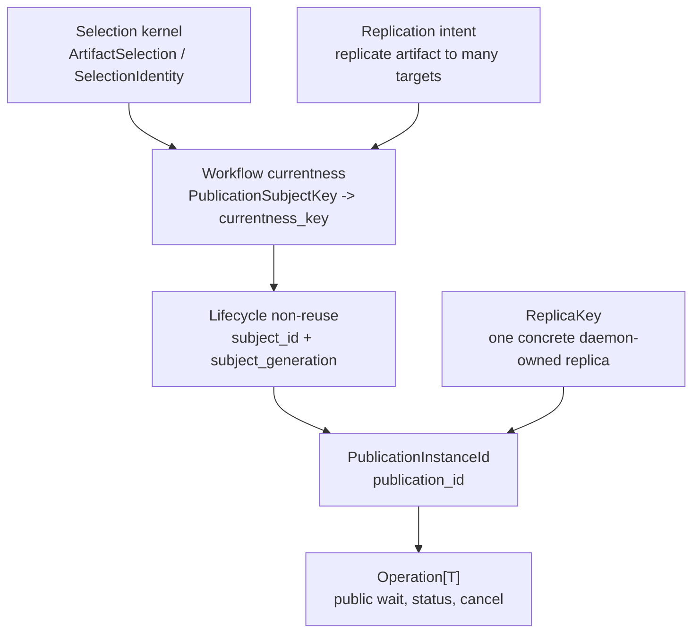
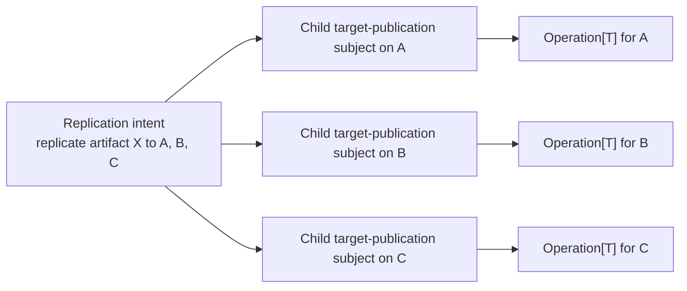

# Summary

TensorCast already supports a real target-backed volatile publication path:

- bytes are written into caller-owned target memory,
- binding current-value commit/promote paths mint
  `binding_current_value_publication_token`,
- and `PublishTargetReplica` or `StartPublishTargetReplica` promotes that target into a routable replica.

What is still missing is the stable object model underneath that landed path.

This document narrows `0103` deliberately.
When this design says `publish`, it means the target-publication family exposed today by:

- `binding_current_value_publication_token`,
- `PublishTargetReplica`,
- `StartPublishTargetReplica`,
- and the SDK helpers that observe those operations.

It does **not** retake repository-wide ownership of the bare word `publish`.
Across the repo, artifact truth, worker-local realization, instance hydration, and cluster rollout remain separate scopes
owned by other designs.
`0103` owns only the target-publication family:

- the volatile subject promoted by target-backed materialization,
- the currentness domain for that target,
- the concrete issued publication instance,
- and the owner-local fail-closed fence that keeps same-subject attach honest.

What is missing is **not** a new repository-wide semantic kernel.
What is missing is the target-publication specialization that maps this landed path onto the existing repository-wide
kernels from `0092`, `0094`, `0096`, and `0100`.

The long-term projection is:

- `Artifact`, `ArtifactSelection`, and `SelectionIdentity` answer **what bytes**,
- `ReplicaKey` answers **which concrete daemon-owned replica exists in core/store**,
- `PublicationSubjectKey` answers **which stable target-domain currentness key is being discussed**,
- logical `PublicationOwnerFence` answers **whether same-subject attach is still honest**, but dependency-ready carriage
  reuses `LifecycleEpochs.subject_generation` and, only when needed, `FencingContext`,
- `PublicationInstanceId` answers **which concrete issued target publication currently owns that subject**,
- and `Operation[T]` answers **how callers later observe that chosen instance**.

`0103` therefore does **not** introduce:

- a fourth repository-wide identity lattice,
- a second lifecycle non-reuse mechanism beside `subject_generation` and `fencing_context`,
- or a second continuation family beside `Operation[T]`.

The current dependency-ready mode is only:

- `local_ephemeral`

A future low-cardinality coordinated mode may exist, but it is a follow-up seam, not a second co-equal branch in this
design.

Finally, this design fixes the multi-daemon case explicitly:

- the same artifact may legally be promoted into multiple distinct target-publication subjects at once,
- those are many child subject domains, not one artifact-global publish workflow,
- and higher-level "replicate this artifact to N places" intent belongs to orchestration in `0056`, `0102`, and `0104`,
  not to one publication subject.

# Current Landed Reality

Current code already implements a concrete target-publication closeout path.

That landed path should be described honestly before future cleanup is proposed:

- target-domain currentness is tracked by `TargetPublicationRegistry::latest_by_target_`,
- the concrete issued publication instance is `publication_id`,
- the current implementation precursor for target-domain identity is `publication_key`,
- `WorkflowCompanionRef.currentness_key` already mirrors that target-domain precursor,
- lifecycle capability minting for `publication_target` already exists but currently fixes `subject_generation = 1`,
- public continuation already projects through `OperationRef`,
- and the recovery class is `ephemeral_process_local`.

Current `OperationRef` projection for target publication already carries:

- `operation_id`,
- `kind`,
- `target_artifact_id`,
- `authority_scope_kind`,
- `authority_scope_id`,
- `attachment_kind`,
- `recovery_class`,
- and optional `fencing_digest`.

This design therefore does not reopen or replace the first landed `attach_existing -> Operation[T]` closeout path from
`0096` and `0100`.

Its job is narrower:

- explain the semantic object model underneath that path,
- split stable subject identity from owner-local fence facts without pretending every refactor already landed,
- keep currentness and multi-replica behavior conceptually correct,
- and guide cleanup of implementation-shaped names without overclaiming substrate that does not exist yet.

# Problem Statement

## 1. Target publication still lacks a stable object model

Current code already has meaningful publish primitives:

- `BindingCurrentValuePublicationScope`
- `binding_current_value_publication_token`
- `TargetPublicationRegistry`
- `StartPublishTargetReplica`
- and the SDK `publish_replica_operation()` helpers

But the repository still lacks one explicit answer to:

- what exact semantic object is current for target publication?

Today the implementation implicitly mixes:

- target memory placement facts,
- owner-local process facts,
- per-target currentness,
- attach or replay semantics,
- and operation tracking.

That is workable for a local sample path, but not durable enough as a repository-wide architectural contract.

## 2. Same artifact, same target subject, and same issued publication are different questions

In realistic serving and engine-integration flows, the same artifact may be published:

- on daemon A and daemon B,
- onto different devices,
- into different serving slots,
- or as different temporary warm replicas.

If the repository treats `artifact_id` as the publish conflict domain, valid multi-replica behavior is falsely
serialized.

If the repository treats every publish as independent, it cannot express:

- "this slot already has an in-flight publish",
- "this target is stale",
- or "attach to the current publish for this target."

The missing abstraction is the publication subject:

- more specific than artifact identity,
- broader than one concrete `operation_id`,
- and scoped to target-domain currentness.

## 3. Owner-local fencing is real, but it is not the same as subject identity

Current code still uses owner-local facts, especially `owner_pid`, in both publication-key precursors and token
validation.

That behavior is not accidental noise.
It provides honest fail-closed behavior for `local_ephemeral` publication today.

But owner-local facts answer a different question:

- "is this still the same attachable owner?"

They do **not** answer:

- "is this still the same target-publication domain?"

If the repository keeps those two questions merged forever, a replacement owner on the same target will be mistaken for a
brand-new semantic subject.
That distorts `owner_lost`, `stale_current`, and same-subject attach semantics.

If the repository responds by inventing a second publication-private rebinding or fencing carrier, it will merely move
the ambiguity:

- `0094` already owns `subject_generation` and `fencing_context`,
- target publication would then have a second non-reuse dialect,
- and attach honesty would become split between lifecycle truth and publication-private state.

That would make the system broader, not deeper.

## 4. `Operation[T]` is a continuation surface, not publication truth

`0055` correctly defines `Operation[T]` as the caller-visible continuation surface for long-tail control-plane work.

But `Operation[T]` alone does not answer:

- whether this request belongs to the same publication subject,
- whether another daemon publishing the same artifact is a conflict or an independent child publish,
- or whether stale-current and owner-loss should attach to this operation at all.

Without a publication-subject model, the implementation starts forcing semantic decisions into:

- operation lease behavior,
- public continuation metadata,
- or transport-layer errors.

That is the wrong layer.

## 5. The repository cannot afford another global meaning of `publish`

`0056`, `0102`, and `0104` already separate:

- high-cardinality set orchestration,
- engine integration action vocabulary,
- worker-local stable realization,
- instance hydration,
- and cluster rollout.

If `0103` is read as retaking repository-wide ownership of the bare word `publish`, the repository falls back into the
same ambiguity it is trying to remove.

This design therefore must define one narrow family contract for target publication, not a second repository-wide verb.

## 6. Not every target publication should become a globally coordinated workflow

The published object here is a block of volatile memory.
That makes target publication valuable for short-lived reuse, warmup, and routing, but it does not automatically justify:

- a durable per-blob truth record,
- cluster-global replay for every publication,
- or a Global Store hot path for all target-backed publish traffic.

The repository therefore needs:

- one mode that matches today's local-ephemeral publish reality,
- and one explicitly separate future seam for low-cardinality coordinated slots.

# Goals / Non-Goals

## Goals

- Define target publication as a publication-subject model over volatile target memory.
- Define `0103` as a composition over existing repository-wide kernels rather than as a new parallel semantic system.
- Separate artifact identity, replica identity, publication subject currentness, lifecycle non-reuse, publication
  instance, and operation continuation.
- Make the publish conflict domain and currentness domain explicit.
- Support multiple daemons publishing the same artifact into different target-publication subjects without false
  conflicts.
- Keep today's target-backed publish path valid as `local_ephemeral` publication.
- Reuse `0094` carriers for same-subject non-reuse:
  - `LifecycleSubjectRecord.subject_id`,
  - `LifecycleEpochs.subject_generation`,
  - and optional `FencingContext` when a future authority mode genuinely needs it.
- Keep `0096` semantic algebra and `0100` public continuation algebra unchanged in ownership while clarifying their
  target-publication binding.
- Keep orchestration of multiple child publications in `0056`, `0102`, and `0104` rather than overloading one publish
  subject.
- Give one explicit cross-layer projection from:
  - stable target-domain identity,
  - to workflow `currentness_key`,
  - to lifecycle runtime anchor and generation,
  - to publication instance,
  - to public continuation.
- Reuse existing repository primitives where possible, especially:
  - `TargetPublicationRegistry::latest_by_target_`
  - `ReplicaKey`
  - `Operation[T]`
  - and `MetadataGateway` publish-context idempotency patterns
- Keep the current public continuation surface instance-scoped unless a separate proposal proves a need to widen it.

## Non-Goals

- Redefine `Artifact`, `ArtifactSelection`, `SelectionIdentity`, or sealed byte-artifact publication units from `0078`
  and `0087`.
- Retake ownership of the repository-wide action vocabulary from `0102` or `0104`.
- Turn volatile publish into a durability feature.
- Replace `ReplicaKey` as the replica identity.
- Make every publish path globally coordinated.
- Push high-cardinality target publication truth into Global Store.
- Introduce a second user-visible continuation family beside `Operation[T]`.
- Introduce a second repository-wide owner-fence or rebinding carrier beside `subject_generation` and
  `fencing_context`.
- Collapse multi-daemon replication intent into one artifact-global publish workflow.
- Define the final coordinated-slot storage schema in this document.
- Require an immediate public proto change just to adopt the subject model.

# Architecture & Interfaces

## 1. Repository-wide kernels and `0103` position

| Concern | Canonical object | Owner |
| --- | --- | --- |
| What bytes are being discussed | `Artifact`, `ArtifactSelection`, `SelectionIdentity` | `0055`, `0078`, `0087` |
| One concrete daemon-owned replica | `ReplicaKey` | `0055`, `0093` |
| One stable target-domain currentness key | `PublicationSubjectKey` lowering to workflow `currentness_key` | `0103` over `0096` / `0094` |
| One issuer-local runtime anchor for bounded publication admission | `LifecycleSubjectRecord.subject_id` | `0094` |
| One same-subject non-reuse carrier | `LifecycleEpochs.subject_generation` and optional `FencingContext` | `0094` |
| One concrete issued publish instance | `PublicationInstanceId` | `0103` |
| Caller-visible continuation | `Operation[T]` | `0055`, `0100` |
| Replicate this artifact to many targets | orchestration or manifest-backed replication intent | `0056`, `0102`, `0104` |

Normative rules:

1. `artifact_id` is never, by itself, the publish conflict domain.
2. `ReplicaKey` is the replica identity and remains distinct from operation identity.
3. `0103` does not introduce a new repository-wide semantic kernel; it specializes existing workflow and lifecycle
   carriers for target publication.
4. `PublicationSubjectKey` is workflow currentness truth for target publication; it is not a competing replacement for
   `ReplicaKey`, `subject_id`, or `operation_id`.
5. Logical `PublicationOwnerFence` in dependency-ready `local_ephemeral` mode is carried by existing lifecycle
   `subject_generation`; if a future coordinated mode needs authority-turnover fencing, it must use existing
   `fencing_context`.
6. `Operation[T]` is a public continuation contract, not publication semantic truth.
7. A multi-target replication workflow is a parent orchestration concept and must not be collapsed into one publish
   subject.
8. `0103` owns only target-publication semantics; it must not be read as redefining every repository use of bare
   `publish`.

## 2. Publication subject, owner fence, publication instance, and projection crosswalk

This design introduces three explicit concepts plus one required cross-layer projection rule.

### 2.1 `PublicationSubjectKey`

`PublicationSubjectKey` names the stable target-domain currentness key whose replay and replacement behavior are being
decided.

It is a **structured workflow truth object**.
It is not a second repository-wide subject system beside `SelectionIdentity`, `ReplicaKey`, or lifecycle `subject_id`.

Long-term required contents:

- stable target-domain scope,
- resolved selection identity,
- normalized byte-space identity,
- and stable target-domain identity sufficient to distinguish different target domains.

Expected target-scope inputs include:

- daemon or worker identity when that identity is part of the target domain,
- device identity,
- target layout or serving-slot identity when relevant,
- and any explicit integration-owned slot or role id.

`PublicationSubjectKey` must **not** contain:

- `publication_id`,
- `operation_id`,
- `owner_pid`,
- `subject_generation`,
- capability ids,
- lease ids or TTL,
- or fresh retry UUIDs.

Current-code grounding:

- today's `TargetPublicationRegistry::publication_key` is a precursor to this concept,
- `latest_by_target_` already expresses per-target currentness rather than artifact-global currentness,
- but the current key is still too tied to immediate owner-local facts such as `owner_pid`.

Normative rules:

1. `PublicationSubjectKey` answers stable target-domain identity, not current owner identity.
2. If two requests claim the same `PublicationSubjectKey`, they are claiming the same currentness domain.
3. `PublicationSubjectKey` must be defined as a structured semantic object before any hash or string encoding is chosen.
4. Dependency-ready carriage of this subject truth must lower through `WorkflowCompanionRef.currentness_key`; new code
   must not invent a second parallel currentness carrier.
5. Source-replica identity and source-side publication barriers remain separate concerns:
   - `ReplicaKey` continues to identify a concrete daemon-owned replica,
   - source-side `publish` in `0102` remains a different scope,
   - target-domain currentness must not silently turn into a second source-replica identity system.
6. Current code may temporarily materialize a composite precursor string, but that precursor is implementation detail,
   not the canonical contract.

### 2.2 `PublicationOwnerFence`

`PublicationOwnerFence` is a **logical relation**, not a new persisted repository-wide carrier.

It names the facts that make same-subject attach or replay honest in `local_ephemeral` mode.
Dependency-ready carriage of those facts reuses existing `0094` mechanisms:

- `LifecycleSubjectRecord.subject_id` anchors the issuer-local runtime subject,
- `LifecycleEpochs.subject_generation` carries same-subject rebinding or non-reuse,
- and optional `FencingContext` remains reserved for future authority-turnover modes that truly need routed fencing.

Current-code grounding:

- today's `owner_pid` checks already contribute to token validation,
- today's `publication_key` also folds owner-local facts into the currentness precursor,
- and the landed workflow recovery class is `ephemeral_process_local`.

Current dependency-ready interpretation:

- `owner_pid` is a local observation that helps token validation fail closed,
- same-subject rebinding should ultimately advance `subject_generation`,
- and a future mode that requires authority-turnover fencing must use `fencing_context` rather than invent a parallel
  anonymous epoch.

Normative rules:

1. `PublicationOwnerFence` is documentation shorthand over existing lifecycle and fencing carriers; it is not a second
   persisted identity or wire contract.
2. Same subject with a replaced owner fence is a subject-local replacement, not evidence of a brand-new target domain.
3. In dependency-ready `local_ephemeral`, same-subject replacement must be represented as stable subject anchor plus a
   newer `subject_generation`, not as a silent reuse of old attach semantics.
4. Local observations such as `owner_pid` may participate in token admission and fail-closed checks, but they do not
   define stable subject identity and do not become public continuation identity.
5. If a future coordinated mode requires authority-turnover fencing beyond local rebinding, it must reuse
   `FencingContext`.
6. Owner loss or replacement must fail closed for old continuations and old tokens.
7. This split mirrors the `0094` rule that stable subject identity and local reuse or fencing state are different
   objects.

### 2.3 `PublicationInstanceId`

`PublicationInstanceId` names one concrete issued publication under a subject.

Current-code grounding:

- today's `publication_id` already behaves like a concrete issued publication instance.

Rules:

1. One `PublicationSubjectKey` may have many publication instances over time.
2. At most one instance may be current for a subject at a time.
3. Replay and attach decisions are evaluated within a subject, not across unrelated subjects.
4. In the current landed implementation, dependency-ready semantics are current-instance semantics; richer non-current
   history remains future work unless an explicit bounded-history substrate lands.

### 2.4 Canonical cross-layer projection

The design is only useful if target-publication semantics lower into the existing carriers unambiguously.

| Concern | Canonical semantic object | Dependency-ready carrier today | Current code grounding |
| --- | --- | --- | --- |
| Stable target-domain currentness | `PublicationSubjectKey` | `WorkflowCompanionRef.currentness_key` | `publication_key` precursor |
| Issuer-local runtime anchor for bounded publication admission | same target-domain runtime anchor | `LifecycleSubjectRecord.subject_id` | `publication-target:<publication_key precursor>` |
| Same-subject non-reuse or rebinding | logical `PublicationOwnerFence` | `LifecycleEpochs.subject_generation`; optional `FencingContext` only for future authority turnover | currently fixed at `1` |
| Concrete issued publication instance | `PublicationInstanceId` | `publication_id`, `WorkflowCompanionRef.workflow_id`, `OperationRef.authority_scope_id` | `publication_id` |
| Caller-visible continuation | chosen publication instance | `OperationRef` | current `attach_existing -> Operation[T]` path |
| Request-local owner observation | local admission-only fact | `BindingCurrentValuePublicationScope.owner_pid` and local observations | current owner PID checks |

Normative rules:

1. This table is the only dependency-ready cross-layer projection for target publication in this phase.
2. New code must not create an ad hoc second semantic id when one of the carriers above already owns that role.
3. `LifecycleSubjectRecord.semantic_ref_id` may remain a runtime anchor for implementation convenience, but it must not
   redefine publication currentness truth.
4. `BindingCurrentValuePublicationScope` is the ingress credential scope and
   request-shaping carrier; it is not the canonical repository-wide subject
   schema.

### 2.5 Current-code bridge

Current code still uses owner-local facts, especially `owner_pid`, in both publication-key precursors and token
validation.

That is not purely accidental implementation noise.
For `local_ephemeral` publish today, those facts contribute to honest fail-closed behavior:

- they help distinguish one volatile owner from another,
- they prevent a replacement process from being mistaken for the same still-attachable owner,
- and they align with the current `ephemeral_process_local` recovery class.

Current-reality rule:

- this design does not require immediate removal of `owner_pid` from the landed implementation precursor,
- but it interprets that precursor as a temporary encoding of:
  - stable `PublicationSubjectKey`,
  - plus request-local owner observation,
  - plus the not-yet-extracted same-subject rebinding relation that should converge on `subject_generation`,
- not as the long-term semantic definition of target-domain identity itself.

## 3. Dependency-ready mode and future extension seam

### 3.1 `local_ephemeral`

This is the default mode and the mode that matches today's landed code.

Properties:

- publication truth lives on the issuer daemon,
- target-domain currentness projects through workflow `currentness_key`,
- bounded publication admission projects through lifecycle `publication_target` subject state,
- same-subject rebinding should converge on lifecycle `subject_generation`,
- owner loss fails closed,
- attach and replay are only as strong as the daemon-local publication state,
- and the mode is suitable for short-lived warm replicas and target-backed reuse.

Examples:

- `MaterializeIntoTarget` followed by publish on the same daemon
- mapped binding publish
- slot-backed local warm replica promotion

Normative rules:

1. `local_ephemeral` publication is a valid repository feature and should remain supported.
2. `local_ephemeral` is not, by itself, proof that repo-wide distributed continuation is dependency-ready.
3. If owner state is lost or same-subject generation advances, later observation must surface explicit owner loss or
   unavailable semantics rather than reopening the subject silently.
4. The dependency-ready semantics in this mode are the triple:
   - same `currentness_key`,
   - same `subject_generation`,
   - and same current `publication_id`.
5. That triple yields the following dependency-ready outcomes:
   - same-currentness plus same-generation plus same-current in-flight instance -> attach,
   - same-currentness plus same-generation plus same-current terminal instance -> terminal reuse,
   - same-currentness plus newer generation -> owner loss or replacement fail-closed,
   - same-currentness plus older non-current instance -> stale-current reject.
6. Current-instance terminal reuse is dependency-ready only for the same current instance already identified through the
   currentness, generation, and instance chain.
7. Richer non-current historical replay or reusable-terminal semantics must not be overclaimed unless an explicit
   bounded-history substrate is added.

### 3.2 Future extension seam: `coordinated_slot`

A future low-cardinality coordinated target-publication mode may exist where coordination is worth the cost.
That possibility is intentionally a follow-up seam, not a second co-equal dependency-ready branch in this design.

Potential examples:

- serving slot activation
- explicit "current source replica" slot for a managed worker role

Normative rules:

1. No current code or adjacent design may depend on `coordinated_slot` to justify present-day `0103` claims.
2. If pursued, `coordinated_slot` must not become a high-cardinality Global Store hot path.
3. If pursued, `coordinated_slot` truth must remain separate from `Operation[T]` rows.
4. Any adoption of this mode must separately define subject owner, storage schema, and recovery claims before it
   becomes dependency-ready.
5. Any fencing or authority-turnover rule in this mode must reuse existing `FencingContext`; it must not create a
   parallel publication-private fence dialect.

## 4. Workflow and continuation mapping

For the landed target-publication workflow, `0096` continues to own the workflow-semantic answer space:

- `admit_new`
- `replay_attachable`
- `replay_terminal`
- `stale_current`
- `fenced`
- `cancelled`
- `owner_lost`
- `wait_not_ready`

`0100` continues to own the public projection algebra:

- `continue_with_authority`
- `attach_existing`
- `terminal`
- `retry_later`
- and `Operation[T]` as the default public continuation surface

`0103` owns the target-publication object-model binding between those two layers:

- what counts as the same target-domain currentness key,
- what counts as the same currentness key with a newer lifecycle generation,
- what counts as a different target domain for the same artifact,
- and which currentness, generation, and instance combinations are dependency-ready in `local_ephemeral`.

### 4.1 Required subject-level outcomes

| Situation | `currentness_key` relation | lifecycle relation | instance relation | Required semantic answer |
| --- | --- | --- | --- | --- |
| Same subject, same current in-flight instance | same | same `subject_generation` | same current instance | `replay_attachable` |
| Same subject, same current terminal instance | same | same `subject_generation` | same current terminal instance | `replay_terminal` |
| Same stable subject, but owner was replaced or lost in `local_ephemeral` mode | same | newer or unavailable generation | any old instance | `owner_lost` |
| Same subject, request targets older non-current instance | same | same or recoverably comparable generation | older non-current instance | `stale_current` |
| Different subject, same artifact, different daemon or target scope | different | irrelevant | irrelevant | independent publish; no attach |

Current dependency-ready floor:

- `replay_attachable` for same-currentness, same-generation, same-current publish,
- `replay_terminal` for same-currentness, same-generation, same-current terminal reuse,
- `stale_current` reject for non-current instance under the same currentness domain,
- and `owner_lost` fail-closed observation for same currentness domain with replaced or unavailable generation.

Non-current historical `replay_terminal` reuse is conceptually valid but must not be treated as dependency-ready unless
the implementation grows an explicit bounded-history contract.

Normative rules:

1. Attach, replay, and stale-current are defined by currentness key plus lifecycle generation plus instance relation,
   not by artifact id alone.
2. In `local_ephemeral`, the same subject remains attachable only if both currentness and same-subject generation still
   match.
3. Different daemons publishing the same artifact into different replica domains must not be forced into one shared
   subject.
4. `Operation[T]` is per chosen publication instance, not per artifact and not per multi-target replication intent.
5. Public continuation remains instance-scoped. Current `OperationRef` may therefore keep identifying the chosen
   `publication_id`, while daemon-side admission must recover currentness and generation truth from that instance and
   validate currentness fail-closed.
6. `owner_pid` or other local observations are admission hints only; they do not become public continuation identity.

## 5. Multi-replica orchestration

When a higher-level workflow wants the same artifact published to multiple places, the intended structure is:

Rules:

1. Multi-daemon or multi-slot publication is orchestration over many child target-publication subjects.
2. One child publish succeeding must not imply that every sibling publish succeeded.
3. `0056`, `0102`, and `0104` own the parent orchestration layer for this fanout; `0103` does not define the parent
   set carrier, rollout barrier, or source-retention semantics.
4. `0103` does not retake ownership of bare repo-wide `publish`; adjacent designs must use explicit scope terms when
   they mean source issue, worker realization, target publication, or rollout.
5. `0103` supplies only the child target-publication semantics used inside those parents.

## 6. Evolution strategy for adjacent designs

This design evolves the existing design set; it does not replace it.

### 6.1 `0094`

Required amendment:

- keep `0094` as the owner of lifecycle runtime anchors, `subject_generation`, `fencing_context`, and
  `WorkflowCompanionRef`,
- treat `PublicationOwnerFence` as the target-publication interpretation of those carriers rather than as a parallel
  persisted model,
- require same-subject rebinding in target publication to converge on `subject_generation`,
- and keep `WorkflowCompanionRef.currentness_key` as the lifecycle-facing carrier for target-domain currentness.

No deletion is required.

### 6.2 `0096`

Required amendment:

- keep `0096` as the owner of workflow-semantic algebra,
- keep its first landed target-publication closeout path intact,
- and use `0103` only to clarify the object model underneath that path.

No deletion is required.

### 6.3 `0100`

Required amendment:

- keep `0100` as the owner of routed/public continuation algebra,
- keep the landed target-publication `attach_existing -> Operation[T]` projection intact,
- keep current public continuation instance-scoped unless a separate proposal proves a need to widen it,
- and use `0103` only to clarify what semantic object that continuation refers to.

No deletion is required.

### 6.4 `0102`

Required amendment:

- keep `0102` as the owner of canonical engine action vocabulary and manifest bridge semantics,
- do not read `0103` as retaking the repository-wide word `publish` from `0102`,
- when `0102` or integration docs mean the specific `0103` child action, spell it as target publication, volatile
  target promotion, or another explicit scope term,
- and keep target-publication replay, currentness, and continuation semantics owned by `0103`, `0096`, and `0100`.

### 6.5 `0104`

Required amendment:

- keep `0104` as the owner of worker-local `realize_set`, cluster rollout, and source-retention closeout,
- allow `0104` to compose child target-publication subjects from `0103` when needed,
- and do not let `0103` expand into rollout barriers, cluster readiness, or source-retention semantics.

### 6.6 `0087`

Recommended amendment:

- add a cross-link from target publication tokens and publication barriers to `0103`,
- keep `0087` authoritative for artifact value model and publication unit,
- do not move publication workflow truth into `0087`.

# Proto and SDK Implications

This design does not introduce a new public continuation family.
It also does not require an immediate `OperationRef` schema change.

Implications:

- current SDK `publish_replica_operation()` may remain additive,
- current `StartPublishTargetReplica` may remain additive,
- both should be interpreted as `local_ephemeral` publication with current-instance dependency-ready semantics,
- current `BindingCurrentValuePublicationScope` is the ingress credential scope,
  and must be interpreted as request-local credential material rather than as
  the canonical long-term publication subject schema,
- current `OperationRef` remains publication-instance scoped,
- and daemon-side public-operation admission must resolve `publication_id` back to publication instance, target-domain
  currentness, and lifecycle generation before it grants attach, wait, or status semantics.

Future implementation work should ensure:

- internal subject matching is derived from canonical target-domain identity and lowered through
  `WorkflowCompanionRef.currentness_key` rather than from `artifact_id` or a fresh ad hoc request string alone,
- same-subject rebinding and fail-closed attach are carried by `LifecycleEpochs.subject_generation` rather than by a
  parallel publication-private owner-fence id,
- `owner_pid` may remain a local observation during migration, but it must not become the canonical semantic identity of
  a target domain,
- idempotency, when requested, is derived from stable target-domain identity plus stable action inputs plus binding
  generation:
  - retries with the same generation may join,
  - same-subject rebinding must fork,
- operation-scoped observation never becomes a substitute for publication truth,
- and any additive subject diagnostics in continuation metadata remain exactly that: diagnostics, not a second public
  routing DSL.

Grounding reuse:

- `MetadataGateway::begin_publish_for_context(...)` already provides a useful pattern for publish-context idempotency
  against `ReplicaKey`.
- That pattern should be reused or generalized before introducing an unrelated second publish-idempotency contract.

No persistent schema changes are required by this design itself.

# Schema Changes

None.

This design intentionally avoids introducing a persistent per-blob publication table.
If future `coordinated_slot` work needs durable truth, that must be proposed as a separate low-cardinality schema change
scoped to explicit slot domains.

# Error Model

- caller retries the same publish for the same currentness key while the same generation and current instance are still
  active
  - `replay_attachable`
  - public projection should attach, not reopen
- caller retries the same publish for the same currentness key and same generation after current-instance terminal
  completion
  - `replay_terminal`
  - current-instance terminal result may be reused
- caller targets the same stable subject but the same-subject generation was replaced or lost in `local_ephemeral`
  - explicit owner-loss or unavailable fail-closed result
  - must not silently reattach to the replacement owner
- caller publishes the same artifact on a different daemon or target scope
  - independent child publish
  - must not be rejected merely because the artifact matches
- caller tries to observe a non-current older publication instance for a subject
  - `stale_current`
- continuation metadata points at an instance that no longer proves the claimed currentness or generation relation
  - failed precondition or unavailable depending on loss mode
- implementation tries to use a globally coordinated path for high-cardinality target publish by default
  - rejected by design review; not a valid steady-state contract

# Observability

Minimum required dimensions:

- `publication_mode`
- `publication_subject_kind`
- `publication_target_scope_kind`
- `publication_subject_match_result`
- `publication_currentness_result`
- `publication_binding_generation_relation`
- `publication_owner_observation_relation`
- `publication_instance_relation`
- `workflow_decision_class`
- `public_projection_kind`

# Naming Compliance

| Interface | Language | Rule | Result |
| --- | --- | --- | --- |
| `PublicationSubjectKey` | C++ struct or logical type | `PascalCase` | pass |
| `PublicationOwnerFence` | C++ struct or logical type | `PascalCase` | pass |
| `PublicationInstanceId` | C++ struct or logical type | `PascalCase` | pass |
| `PublicationTargetScope` | C++ struct or logical type | `PascalCase` | pass |
| `PublicationMode` | C++ enum class | `PascalCase` | pass |
| `begin_publication_subject` | C++ function | `snake_case` | pass |
| `evaluate_publication_subject` | C++ function | `snake_case` | pass |
| `PUBLICATION_MODE_LOCAL_EPHEMERAL` | C++ constant or proto enum value | `ALL_CAPS` | pass |

# Trade-offs & Risks

- Introducing `PublicationSubjectKey` and `PublicationInstanceId` adds another layer of naming.
  That cost is justified because the repository is already paying the price of not separating artifact, replica, and
  publish identities cleanly.
- Keeping `PublicationOwnerFence` as a logical relation over existing `0094` carriers may feel less self-contained than
  inventing a standalone publication-private fence object.
  That restraint is intentional because the repository already has one lifecycle non-reuse vocabulary and should not grow
  a second one.
- Requiring an explicit cross-layer projection from subject currentness to lifecycle generation to instance to public
  continuation is more work than letting each layer improvise its own string key.
  That cost is justified because it prevents target publication from becoming another parallel control dialect.
- Keeping `local_ephemeral` as a first-class mode may feel less ambitious than claiming full distributed continuation
  readiness today.
  That restraint is intentional and better matches the actual recovery properties of volatile target memory.
- Keeping public continuation instance-scoped may feel less expressive than embedding subject identity directly into the
  public operation contract.
  That restraint is intentional because current code already has a working instance-scoped path and the daemon can
  recover subject and fence truth fail-closed behind that surface.
- Keeping `coordinated_slot` as a future extension seam slows down "global attach for everything" stories.
  That is the correct trade because the repository has repeatedly rejected high-cardinality Global Store hot paths and
  should not add a second branch before the first one is deep enough.
- Narrowing `0103` to target publication only may feel smaller than owning repo-wide `publish`.
  In practice it makes the module deeper and removes one of the repository's most persistent cross-document ambiguities.

# Compatibility & Acceptance Criteria

Acceptance criteria:

- the same artifact may be published concurrently into multiple distinct target-publication domains without false
  conflict,
- publish replay, attach, and stale-current decisions are scoped by publication currentness key plus generation plus
  instance relation rather than by artifact id,
- `0103` is realized as a composition over existing workflow and lifecycle carriers rather than as a new parallel
  identity or fence lattice,
- stable subject identity is not silently defined by owner-local observations even if current code still stores a
  composite precursor during migration,
- same-subject replacement or loss fails closed for old continuations rather than being mistaken for the same attachable
  owner,
- same-subject rebinding converges on lifecycle `subject_generation` and does not invent a second publication-private
  rebinding carrier,
- current landed target-backed publish remains valid as `local_ephemeral` publication,
- same-current terminal reuse remains valid for the current instance while non-current historical replay is not
  overclaimed,
- `Operation[T]` remains the public continuation surface and does not become publication truth,
- public continuation remains instance-scoped with daemon-side currentness and generation validation,
- one explicit cross-layer projection exists between target-domain currentness, lifecycle subject anchor, lifecycle
  generation, publication instance, and public continuation,
- `0103` is interpreted as target-publication semantics only and not as repository-wide ownership of every use of
  `publish`,
- `0102` and `0104` continue to orchestrate multiple child publish actions without owning their continuation semantics,
- no new per-blob Global Store hot path is introduced by this design,
- `0094`, `0096`, `0100`, `0102`, and `0104` are amended by narrowing or clarifying ownership rather than deleting
  them,
- idempotency aligns with stable target-domain identity plus binding generation instead of ad hoc retry-local ids,
- a future coordinated publish mode is allowed only through separate low-cardinality closeout with explicit truth
  ownership.

# References

- `0055` for `Operation[T]`, deterministic idempotency guidance, and `ReplicaKey` versus operation identity.
- `0056` for plan/runtime orchestration boundaries.
- `0078` for `SelectionIdentity` and resolved selection semantics.
- `0087` for artifact value model, publication units, and target-backed runtime grounding.
- `0092` for repository-wide semantic kernels and layering between selection, lifecycle, truth, and authority.
- `0093` for backing truth and `ResolvedSourceCapability`.
- `0094` for lifecycle kernel boundaries and subject-vs-fence separation patterns.
- `0096` for workflow-semantic publish algebra.
- `0100` for public continuation algebra.
- `0102` for canonical action vocabulary and multi-target orchestration layering.
- `0104` for worker-local realization and cluster rollout layering above target publication.
