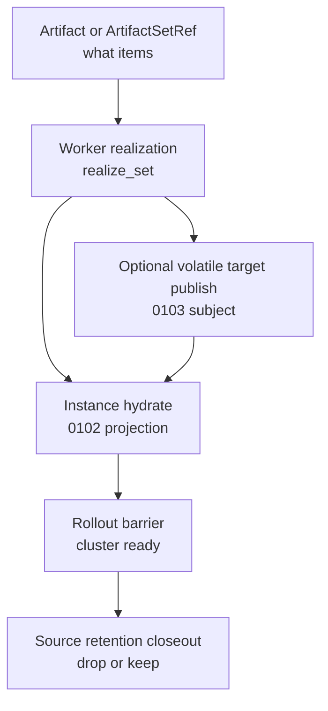

# Summary

`0056` now cleanly owns:

- `Runtime`,
- daemon ingress,
- daemon-served low-cardinality signals,
- `ArtifactSetRef`,
- and the scalable worker-set warmup substrate.

`0102` now cleanly owns:

- engine-side manifest production,
- the bridge from engine carriers into `ArtifactSetRef`,
- and canonical instance-side `manifest/publish/hydrate/evict_local` projection.

`0103` now cleanly owns:

- volatile publication-subject semantics,
- per-target publish currentness,
- and the rule that multi-target replication intent is not one publish subject.

What the repository still lacks is the layer between them:

- a worker-local realization contract stronger than `prefetch_set`,
- a cluster rollout contract that composes worker realization and instance realization without redefining
  publication-subject truth,
- and a source-retention model that allows training clusters to act as transient issuers rather than long-lived owners
  of full replicas.

This design introduces that missing layer.

The core model is:

- `Artifact` and `ArtifactSetRef` remain the value and set-control units,
- `realize_set` becomes the worker-local stable-realization action,
- cluster rollout composes many child worker realizations and optional child publication subjects,
- and `publish` keeps its `0103` meaning as volatile target promotion rather than becoming the name for all
  cross-worker replication.

Long-term rule:

- `put/register/seal` still define artifact truth,
- `realize_set` defines worker-local readiness,
- `publish` defines volatile subject promotion,
- `hydrate` defines instance-local realization,
- and cluster rollout is the orchestration layer that composes those scopes honestly.

# Problem Statement

## 1. `ArtifactSetRef` exists, but worker-local stable readiness does not

`0056` correctly introduced `ArtifactSetRef` as the high-cardinality control unit.
It also intentionally kept `prefetch_set` narrow:

- it is worker-layer data-plane warmup,
- it reports worker-local readiness only,
- and it must not silently claim `local_stable_ready`.

That restraint is correct, but it leaves a real gap for scenarios that require more than warmup:

- weight rollout to inference workers,
- training-cluster issue then remote steady-state retention,
- and any cluster workflow that needs a true worker-local stable barrier before instance hydration or activation.

The repository therefore needs an explicit worker-local realization contract rather than overloading `prefetch_set`.

## 2. `publish` is now correctly narrow, so replication needs a different owner

`0103` correctly narrows `publish`:

- it is a publication subject over volatile target memory,
- it is not artifact-global truth,
- and multi-target replication intent belongs to orchestration above it.

That means the repository can no longer use the word "publish" to ambiguously mean:

- source-side artifact issue,
- worker-local stable placement,
- target-side volatile slot promotion,
- and cluster-wide version rollout.

Those are different scopes and need different contracts.

## 3. Current remote stable persistence is not the same thing as rollout readiness

Current `policy` and `StartPersistence` semantics already talk about remote stable DRAM, but today's implementation is
still persistence-oriented:

- placement planning,
- memory-tier lease planning,
- status reporting,
- and remote-presence style metadata publication.

That is not yet the same contract as:

- target daemon has a real local CPU DRAM replica,
- stable admission is complete,
- and the worker is ready to serve as a local source for the next wave or for instance hydration.

The repository must keep those two contracts separate:

- persistence remains a backing and durability workflow,
- rollout realization is an execution-readiness workflow.

## 4. Training clusters should be issuers, not forced steady-state owners

For weight rollout, the common desired behavior is:

- weights exist in trainer CPU or GPU memory,
- a source artifact is issued,
- target inference workers realize local stable replicas,
- and the training side drops its transient backing once rollout readiness is reached.

If the repository keeps assuming that source issue implies long-lived local full-replica retention, it will continue to
optimize the wrong steady state for this class of deployments.

The missing abstraction is a source model that explicitly separates:

- source artifact truth,
- transient source backing,
- and target steady-state worker-local replicas.

# Ownership Boundary

## Layer split

| Concern | Canonical object or contract | Owner |
| --- | --- | --- |
| artifact value and selection truth | `Artifact`, `ArtifactSelection`, `SelectionIdentity` | `0055`, `0078`, `0087` |
| source capability and backing truth | `ResolvedSourceCapability`, backing truth | `0093` |
| lifecycle capability and protection | lifecycle kernel, capability families | `0094` |
| workflow gate, replay, wait, and completion | workflow semantic plane | `0096` |
| public continuation and routed attach surfaces | `Operation[T]` and public continuation algebra | `0100` |
| engine manifest production and bridge into `ArtifactSetRef` | engine integration layer | `0102` |
| volatile target publication subject | `PublicationSubjectKey`, `PublicationInstanceId`, `publish` modes | `0103` |
| set transport, runtime, ingress, signals | `ArtifactSetRef`, `Runtime`, daemon ingress | `0056` |
| worker-local stable realization and cluster rollout over sets | `realize_set`, rollout intent, rollout barrier, rollout path diagnostics | `0104` |

Normative rules:

1. `0104` must not redefine `ArtifactSetRef`; it consumes the set contract from `0056`.
2. `0104` must not redefine `publish`; it composes child publication-subject actions from `0103`.
3. `0104` must not invent a new attach or status family; it reuses `Operation[T]` and `0096`/`0100`.
4. `0104` owns worker-local stable realization and cluster rollout semantics only.
5. `0104` may recommend new plan actions or result carriers, but they must remain canonical artifact-first actions
   rather than engine- or business-specific aliases.

# Goals / Non-Goals

## Goals

- Define one explicit worker-local stable realization contract for `ArtifactSetRef`.
- Define one cluster rollout contract that composes worker realization, optional volatile publication, and instance
  hydration without collapsing those scopes.
- Keep the rollout control unit artifact-first and set-first rather than weight- or KV-specific.
- Allow training clusters to issue source artifacts without requiring long-lived local full-replica retention.
- Reuse the existing shared dataplane for source selection, transport, and stable admission.
- Make path selection largely automatic and diagnostics-rich rather than parameter-heavy.
- Keep `WeightPublisher` and similar helpers as thin callers on top of this generic rollout layer.

## Non-Goals

- Redefine `put`, `register`, `seal`, or assembly semantics.
- Redefine `prefetch_set` as silently stronger than its current readiness floor.
- Redefine `publish` to mean cross-worker replication.
- Turn current persistence remote stable semantics into rollout semantics by documentation fiat.
- Introduce a second high-cardinality set model beside `ArtifactSetRef`.
- Introduce a second public continuation family beside `Operation[T]`.
- Define low-level RDMA protocol or communicator behavior beyond existing shared dataplane rules.
- Make Global Store a high-cardinality per-item rollout hot path.

# Architecture & Interfaces

## 1. Conceptual stack



Key rule:

- rollout composes scoped realizations; it does not flatten them into one meaning of `publish`.

## 2. Worker-local realization

### 2.1 Realization scope

`0104` introduces a worker-local action stronger than warmup:

- `realize_set`

`realize_set` means:

- resolve each item in the `ArtifactSetRef`,
- materialize it on the target worker,
- and satisfy an explicit worker-local readiness contract.

Current dependency-ready readiness kinds:

- `local_replica_ready`
- `local_stable_ready`

Repository rule:

- `prefetch_set` remains warmup-oriented and defaults to `local_replica_ready`,
- `realize_set` is the action that may claim `local_stable_ready`.

### 2.2 `realize_set` contract

Suggested plan-layer shape:

```python
@dataclass(frozen=True, slots=True)
class ArtifactSetRealizationResult:
    set_digest_hex: str
    readiness_kind: str
    outcomes: Sequence["ArtifactSetItemResult"]
    selected_path_profile: str | None = None
    degraded_reason: str | None = None

class WorkerStepBuilder:
    def realize_set(
        self,
        art_set: ArtifactSetRef,
        *,
        placement: str | int = "dram",
        readiness_kind: str = "local_stable_ready",
        policy: "StorePolicy | None" = None,
        depends_on: Sequence[PlanStepRef[Any]] | None = None,
    ) -> PlanStepRef[ArtifactSetRealizationResult]: ...
```

Normative rules:

1. `realize_set` consumes `ArtifactSetRef` directly; it does not invent another set carrier.
2. `placement="dram"` and `readiness_kind="local_stable_ready"` is the first dependency-ready profile.
3. `local_stable_ready` requires actual worker-local stable admission, not just a daemon-owned CPU replica.
4. `realize_set` must not succeed with `local_stable_ready` if the daemon only reached `local_replica_ready`.
5. Partial per-item outcomes remain visible in the result; the step-level failure policy remains action-specific.
6. `policy` remains a storage and retention contract, not a rollout-governance contract.

### 2.3 Relation to current local stable tier code

The worker-local stable contract should converge on existing local stable machinery instead of inventing a second
concept:

- `LocalStableTierService`
- `StoreEngine::admit_stable_cache_policy(...)`
- existing local stable tier result vocabulary

Normative rules:

1. `realize_set(..., readiness_kind="local_stable_ready")` must reuse the daemon's stable admission path.
2. Worker-local stable realization is a local decision and must not require a Global Store round trip in the success
   path.
3. The result should project local stable success or degradation honestly rather than silently downgrading to replica
   warmup.

## 3. Cluster rollout

### 3.1 `ArtifactRolloutIntent`

`0104` introduces a parent orchestration concept:

```python
@dataclass(frozen=True, slots=True)
class ArtifactRolloutIntent:
    artifact_set_ref: ArtifactSetRef
    worker_targets: Sequence[str]
    instance_targets: Sequence[str] = ()
    worker_readiness_kind: str = "local_stable_ready"
    include_target_publication: bool = False
    source_retention_mode: str = "drop_on_rollout_ready"
    allow_partial: bool = False
```

This is not a second truth object.
It is a workflow input that compiles into canonical actions.

Normative rules:

1. `artifact_set_ref` is the semantic payload of the rollout; worker and instance target lists are target scope only.
2. `worker_readiness_kind` names the worker-local barrier required before instance hydration or source closeout.
3. `include_target_publication` means target-side volatile publication subjects may be created, but those remain child
   `0103` publishes.
4. `source_retention_mode` governs transient source-backing closeout only; it does not alter artifact truth.
5. `allow_partial=False` means rollout-ready requires the declared barrier to be fully satisfied.

### 3.2 Rollout phases

The canonical rollout phases are:

1. source issue or source resolve
2. worker realization
3. optional child target publication
4. instance hydration
5. rollout barrier satisfaction
6. source closeout and old-version retirement

Normative rules:

1. rollout barrier is a cluster workflow concept, not a worker-local readiness kind.
2. optional target publication is never the same thing as worker realization.
3. instance hydration is never inferred from worker realization.
4. source closeout must happen after the rollout barrier selected by the intent, not before.

## 4. Source model

### 4.1 Source artifact truth vs transient source backing

`0104` explicitly separates:

- source artifact truth
- transient source backing
- target steady-state worker-local replicas

Recommended source-retention modes:

- `drop_on_rollout_ready`
- `keep_until_ttl`
- `best_effort`

Training-weight rollout should default to:

- `drop_on_rollout_ready`

Normative rules:

1. source issue does not imply long-lived local full-replica retention.
2. rollout may depend on transient source backing while child worker realizations are running.
3. once the selected rollout barrier is satisfied, source backing may be dropped according to the intent.
4. source closeout must not mutate artifact truth or set identity.

### 4.2 Relationship to persistence

Current persistence remote stable semantics remain distinct:

- persistence is a backing and durability workflow,
- rollout realization is an execution-readiness workflow.

Normative rules:

1. current `StartPersistence` or remote stable policy success must not, by itself, be interpreted as `local_stable_ready`
   on a target worker.
2. rollout may reuse placement and memory-tier signals from persistence-oriented code, but not its semantics.
3. if future persistence work gains real remote materialization, the shared pieces may converge, but the workflow
   contracts remain separate.

## 5. Automatic path selection

### 5.1 Path families

The system should choose data paths automatically and report them diagnostically.

Recommended diagnostic path families:

- `cpu_memfd_local_ingress`
- `cpu_stream_local_ingress`
- `gpu_staging_local_ingress`
- `gpu_direct_rdma_pull_to_cpu_stable`
- `gpu_staged_rdma_pull_to_cpu_stable`
- `cpu_direct_write_pull_to_cpu_stable`
- `cpu_staged_pull_to_cpu_stable`
- `disk_fallback_pull`

These are diagnostics and observability labels, not user-facing identity.

### 5.2 Selection rules

Path selection should be split into two stages.

#### Source ingress

Source process or instance to issuer daemon:

- CPU local source with memfd publish available
  - prefer `cpu_memfd_local_ingress`
- CPU local source without memfd publish
  - fall back to `cpu_stream_local_ingress`
- GPU local source
  - prefer existing local GPU-backed ingress path

#### Worker realization

Issuer or source backing to target worker:

- if source backing is GPU and RDMA direct read plus target CPU direct write are available
  - prefer `gpu_direct_rdma_pull_to_cpu_stable`
- else if source backing is GPU and RDMA staged transfer is available
  - prefer `gpu_staged_rdma_pull_to_cpu_stable`
- else if source backing is CPU and direct write is available
  - prefer `cpu_direct_write_pull_to_cpu_stable`
- else use staged communicator or MTCP pull
- if the source path is unavailable but a policy-backed disk path exists
  - allow `disk_fallback_pull`

Normative rules:

1. automatic selection must reuse the existing shared dataplane rather than creating a second rollout-private copy
   engine.
2. direct RDMA and staged RDMA are transport profiles, not different rollout semantics.
3. the preferred steady state is target-local readiness, not source-local long-lived retention.
4. path selection may consider source capabilities, target placement, and local stable headroom, but it must not
   require many caller-specified tuning knobs in the default path.

## 6. Relationship to `publish` from `0103`

`publish` remains optional in rollout and keeps its `0103` meaning:

- one child publish subject over one target domain

Typical rollout compositions:

- source `publish` only
  - source-side publication barrier before worker realization
- worker `realize_set`
  - target workers gain `local_stable_ready`
- optional target `publish`
  - target daemon or instance creates volatile routable subjects
- target `hydrate`
  - target engine realizes local execution state

Normative rules:

1. rollout to many workers is many child worker realizations, not one publish subject.
2. same artifact realized on multiple workers is legal and expected.
3. optional target publication on many workers is many child publication subjects, not one shared publish workflow.

## 7. Relationship to `WeightPublisher`

`WeightPublisher` and similar deployment helpers should become thin wrappers over rollout.

Recommended shape:

1. issue source artifact or source set
2. compile rollout intent
3. wait for worker-local stable barrier
4. execute target hydration or reload
5. trigger version switch only after the selected barrier is met
6. retire source backing and old versions per policy

Normative rules:

1. `WeightPublisher` must not become a second semantic owner for cross-worker replication.
2. rollout is generic; weights are one important caller, not the owning domain.

## 8. Public SDK surface

The repository needs two layers of public SDK surface:

1. an issue-time convenience surface on `put/register`,
2. and the fuller rollout-orchestration surface above it.

The reason for the split is consistency:

- `put/register` are already the canonical issue surfaces,
- they are a natural place to request remote worker steady-state realization,
- but they should not be overloaded with the full cluster workflow vocabulary for instance hydration, activation, and
  multi-phase orchestration.

### 8.1 Canonical issue-time surface

The canonical issue-time surface should be:

- top-level sugar:
  - `tensorcast.put(..., strategy=...)`
  - `tensorcast.register(..., strategy=...)`
- canonical typed options field:
  - `RegisterArtifactOptions.realization_strategy`

Recommended shape:

```python
class RealizationStrategy(BaseModel):
    model_config = ConfigDict(frozen=True)

    mode: Literal["local_only", "worker_rollout"] = "worker_rollout"
    worker_targets: tuple[str, ...] = ()
    placement: Literal["dram"] = "dram"
    worker_readiness: Literal[
        "local_replica_ready",
        "local_stable_ready",
    ] = "local_stable_ready"
    source_mode: Literal[
        "transient",
        "local_steady_state",
    ] = "transient"
    source_retention: Literal[
        "drop_on_ready",
        "keep_until_ttl",
        "best_effort",
    ] = "drop_on_ready"
    wait_for: Literal["issued", "workers_ready"] = "workers_ready"
```

Recommended convenience usage:

```python
artifact = tensorcast.put(
    tensors,
    key="model:llama:v123",
    strategy=tensorcast.RealizationStrategy(
        worker_targets=("daemon-a", "daemon-b"),
    ),
)
```

Normative rules:

1. `strategy=` on `put/register` is convenience syntax only; the canonical typed surface should live in
   `RegisterArtifactOptions`.
2. `plan` in `RegisterArtifactOptions` keeps its existing meaning:
   - local ingress and registration plan selection
   - such as `dram_stable`, `lease`, or `coalesced`
3. `realization_strategy` is a different layer:
   - it governs the post-issue worker steady-state realization target
   - and must not be conflated with `plan`
4. `policy` also remains distinct:
   - `policy` is backing and retention semantics,
   - `realization_strategy` is issue-time orchestration and steady-state placement intent.
5. the first dependency-ready strategy profile is:
   - `mode="worker_rollout"`
   - `placement="dram"`
   - `worker_readiness="local_stable_ready"`
   - `source_mode="transient"`
   - `source_retention="drop_on_ready"`
   - `wait_for="workers_ready"`

### 8.2 Why `put/register(strategy=...)` is the right convenience layer

This surface is more consistent than:

- overloading `policy`,
- overloading `plan`,
- or moving the entire scenario into a new top-level "weight publish" API.

Rationale:

1. from the user's point of view, this is still "issue an artifact", but with a different steady-state realization
   strategy,
2. source-side local stable retention is no longer the desired steady state in this profile,
3. the issue-time surface is therefore the right place to select:
   - local-only issue,
   - or issue plus remote worker realization.

### 8.3 What `put/register(strategy=...)` does and does not own

`put/register(strategy=...)` should own only:

- source issue,
- worker target selection,
- worker-local realization barrier,
- and source transient-backing closeout.

It should not become the owner of:

- instance hydration,
- target volatile publication subjects,
- or version activation semantics.

Those remain in:

- rollout-orchestration helpers above this layer,
- `Runtime.rollout(...)`,
- `WeightPublisher`,
- or other higher-level deployment workflows.

Repository rule:

- `put/register(strategy=...)` is the ergonomic shortcut for issue plus worker realization,
- not the universal surface for every rollout phase.

### 8.4 Full rollout surface remains above issue-time strategy

The fuller orchestration surface is still needed for:

- instance `hydrate`,
- optional child `publish`,
- activation barriers,
- and old-version retirement.

That fuller surface should remain above the issue APIs:

- either `Runtime.rollout(...)`,
- or a helper that compiles into the same canonical plan spine.

Normative rules:

1. `put/register(strategy=...)` and `Runtime.rollout(...)` must compile to the same underlying worker realization
   semantics.
2. the issue-time strategy surface is a subset convenience layer, not a second semantic owner.
3. higher-level rollout helpers may accept a pre-issued artifact, an `ArtifactSetRef`, or a manifest bridge from
   `0102`, but the issue-time strategy should stay focused on source issue plus worker realization.

### 8.5 Return type and observation

`put/register(strategy=...)` should continue returning `RegisteredArtifact`.

Recommended additive fields:

- `realization_operation_id: str | None`
- `realization_result: ArtifactSetRealizationResult | None`

Recommended helper:

```python
op = artifact.realization_operation()
result = op.result(timeout_s=...)
```

Normative rules:

1. `RegisteredArtifact` remains the return type; do not introduce a second issue-result top-level type.
2. the realization follow-up must reuse `Operation[T]`, not a rollout-private continuation family.
3. if `wait_for="workers_ready"` and the strategy completes inline, `realization_result` may be populated eagerly.
4. if `source_mode="transient"` and local steady-state stable admission is intentionally skipped, the issuer-local
   `local_stable_tier` result must report that honestly rather than implying local steady-state readiness.

### 8.6 Path selection and user knobs

The issue-time strategy must remain light on user knobs.

Users should choose:

- target workers,
- desired worker readiness,
- and source retention behavior.

Users should not normally choose:

- direct RDMA vs staged RDMA,
- source ingress memfd vs stream,
- or communicator-level transport modes.

Those remain automatic path-selection concerns with diagnostic projection.

Normative rules:

1. the default strategy profile must strongly prefer remote worker steady-state DRAM placement with transient source
   backing when users provide worker targets.
2. transport and ingress profile selection remain automatic and diagnostics-rich.
3. advanced tuning, when needed, should remain in unified config and daemon transport settings, not as a large new
   put/register parameter family.

# Proto & Surface Implications

## Plan surface

`0104` recommends extending `plan.proto` with one worker-layer set action:

- `RealizeSetAction`

This action should:

- take `ArtifactSetRef`,
- carry explicit placement and readiness kind,
- and return a typed worker-local realization result.

`0056` remains the owner of:

- `ArtifactSetRef`,
- ingress,
- signals,
- and plan transport.

`0104` only owns the semantics of the new realization action and rollout composition.

## Registration surface

`0104` recommends extending the registration options family with:

- `RegisterArtifactOptions.realization_strategy: RealizationStrategy | None`

and adding top-level sugar:

- `put(..., strategy=...)`
- `register(..., strategy=...)`

Normative rules:

1. `strategy` and `realization_strategy` are aliases for the same semantic object.
2. if both `strategy` and `options.realization_strategy` are provided, the SDK must either:
   - require them to be semantically identical, or
   - fail fast on mismatch.
3. the SDK must reject contradictory combinations such as:
   - `mode="worker_rollout"` with empty `worker_targets`,
   - or `worker_readiness="local_stable_ready"` with non-DRAM placement in this phase.
4. first-phase documentation should make clear that issue-time strategy covers worker realization only; fuller rollout
   orchestration remains above it.

## Runtime and helpers

The long-term public shape may be either:

- explicit plan building with `realize_set`, or
- a helper that compiles `ArtifactRolloutIntent` into canonical plan fragments.

Repository rule:

- any helper must compile to the same canonical action family rather than inventing a second orchestration substrate.

# Naming Compliance

The interfaces proposed by this design follow repository naming rules.

| Symbol | Kind | Required style | Result |
| --- | --- | --- | --- |
| `ArtifactRolloutIntent` | Python dataclass / C++ struct | `PascalCase` | pass |
| `ArtifactSetRealizationResult` | Python dataclass / proto message | `PascalCase` | pass |
| `RealizeSetAction` | proto message | `PascalCase` | pass |
| `realize_set` | Python method / C++ helper | `snake_case` | pass |
| `compile_rollout_plan` | Python helper / C++ helper | `snake_case` | pass |
| `REALIZATION_READINESS_LOCAL_STABLE_READY` | enum value | `ALL_CAPS` | pass |

# Schema Changes

None.

This design intentionally avoids introducing:

- a high-cardinality rollout table in Global Store,
- a per-item rollout truth store,
- or a second continuation registry beside existing operation and workflow owners.

# Trade-offs & Risks

- Adding `realize_set` creates another worker action, but this is preferable to silently overloading `prefetch_set`.
- Keeping persistence and rollout separate may feel repetitive, but conflating durability and readiness would be worse.
- Automatic path selection improves operator ergonomics, but it requires strong diagnostics so degraded paths remain
  understandable.
- Source-transient rollout can increase pressure on source transport windows while rollout is active; that is an
  operational trade, not a semantic flaw.
- If rollout helpers are overgrown, they could start competing with `0056` itself; helpers must remain thin compilers to
  canonical actions.

# Compatibility & Acceptance Criteria

- `ArtifactSetRef` remains the only framework-owned set carrier consumed by the new layer.
- `prefetch_set` semantics remain unchanged and do not silently claim `local_stable_ready`.
- `realize_set(..., readiness_kind="local_stable_ready")` converges on actual worker-local stable admission.
- current `publish` semantics from `0103` remain unchanged and are only composed as child actions.
- current persistence remote stable semantics remain distinct from rollout readiness semantics.
- rollout may drop transient source backing after the selected barrier without changing artifact truth.
- automatic path selection reuses the existing shared dataplane and does not introduce a rollout-private copy engine.
- `WeightPublisher`-style workflows can be expressed as source issue plus rollout plus hydrate without redefining
  framework ownership boundaries.

# References

- `0055` for artifact-first programmable substrate and `Operation[T]`.
- `0056` for `Runtime`, ingress, signals, and `ArtifactSetRef`.
- `0078` and `0087` for value and selection semantics.
- `0082` for CPU memfd local ingress optimization.
- `0093` for source capability and backing truth.
- `0094` for lifecycle capability families.
- `0096` for workflow gate and completion semantics.
- `0100` for public continuation and routed authority surfaces.
- `0102` for engine manifest production and bridge into `ArtifactSetRef`.
- `0103` for volatile publication subjects and multi-replica publish semantics.
- `policy-persistence.md` for current persistence contract and why it must remain separate from rollout readiness.
- `p2p-transfer-strategies.md` for the shared dataplane path family reused by rollout realization.
