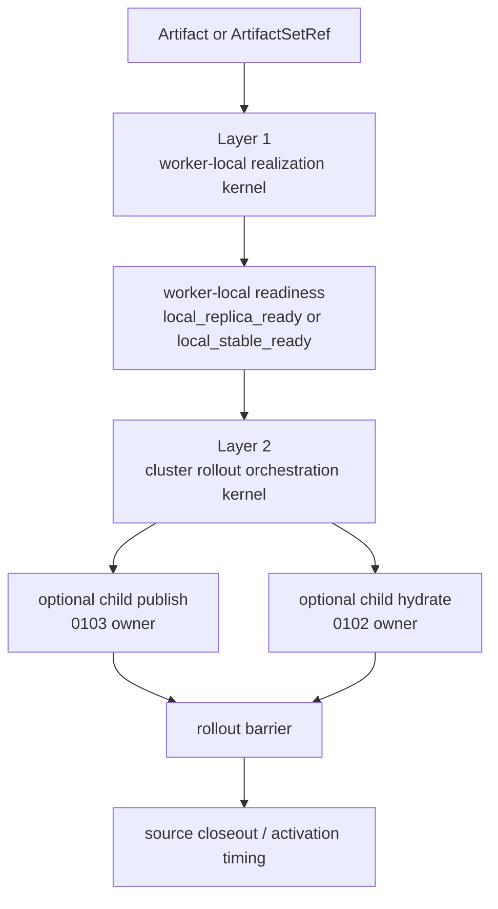

# Summary

`0104` adopts a two-layer kernel for artifact rollout.

Layer 1 is the worker-local realization kernel:

- it consumes `ArtifactSetRef`,
- it introduces `realize_set` as the explicit worker action that may claim
  `local_stable_ready`,
- and it reuses the shared TensorCast dataplane and stable-tier machinery rather
  than inventing a rollout-private copy path.

Layer 2 is the cluster rollout orchestration kernel:

- it compiles worker realization plus optional child publication and hydration
  stages into canonical `PlanSpec` fragments,
- it exposes rollout observation through `Operation[T]`,
- and it keeps rollout barriers, source closeout, and version-switch timing
  outside `0056`, `0102`, and `0103` rather than redefining their contracts.

Long-term repository rule:

- `Artifact` and `ArtifactSetRef` remain the value and set-control units,
- `realize_set` defines worker-local readiness,
- `publish` keeps its `0103` meaning as one volatile target-publication family,
- `hydrate` keeps its `0102` meaning as one instance-local realization family,
- and rollout is the orchestration layer that composes those scopes honestly.

This design is explicitly depth-first rather than branch-first:

- it strengthens the existing programmable framework,
- it does not introduce a second execution substrate,
- it does not create a second set carrier beside `ArtifactSetRef`,
- and it does not create a second continuation family beside `Operation[T]`.

First dependency-ready landing rule:

- Wave 1 closes only worker-local stable realization plus a worker-only
  `workers_ready` barrier,
- multi-daemon rollout ownership, optional child instance stages, and issue-time
  strategy sugar remain explicit follow-on scope,
- and `0104` must not claim whole-cluster closure before those prerequisites are
  genuinely landed.

# Current Grounding and Dependency Readiness

The repository already has most of the substrate that `0104` needs, but not all
of the closure.

| Capability | Current grounding | Dependency readiness |
| --- | --- | --- |
| `ArtifactSetRef` and scalable worker-set warmup | `0056`, `prefetch_set`, daemon ingress | ready |
| explicit worker readiness floor for `prefetch_set` | `0056` says `local_replica_ready` only | ready |
| canonical instance verbs | `manifest/publish/hydrate/evict_local` from `0102` | ready |
| volatile target publication and `attach_existing -> Operation[T]` | `0103`, `0096`, `0100` | ready |
| shared dataplane for source selection and transport | materialize orchestrator, remote key source, export registry | ready |
| daemon-served `list_workers/list_instances/get_worker_capacity` | only partially landed today | not ready |
| reusable worker-local stable admission outside registration | current code is registration-bound | not ready |
| inter-daemon control-plane subplan dispatch | current peer-daemon helpers are data-plane-only | not ready |
| `ExecutePlan(public_continuation_required)` | reserved but not supported in daemon ingress | not ready |
| issue-time rollout strategy on `register/put` | not landed | not ready |
| cluster-durable rollout observation on top of generic `Operation[T]` | generic operation substrate exists; rollout owner does not | not ready |

Repository rule:

- `0104` may depend on the ready rows above,
- it must not assume the non-ready rows are already closed,
- and it must stage its first implementation around the ready worker-realization
  slice before claiming full cluster-workflow closure.

# Problem Statement

## 1. `prefetch_set` is intentionally narrow, but rollout needs a stronger worker contract

`0056` correctly defines `prefetch_set` as scalable worker-set warmup over
`ArtifactSetRef`.

It also correctly constrains that action:

- worker scope only,
- readiness floor only,
- and no silent upgrade from `device="dram"` to `local_stable_ready`.

That contract is sound, but it leaves a missing worker-level primitive for:

- weight rollout to inference workers,
- source issue followed by target steady-state retention,
- and any barrier that requires a real worker-local stable placement before
  hydration or activation.

The repository therefore needs an explicit worker-local realization action
instead of overloading `prefetch_set`.

## 2. Stable admission already exists, but it is still registration-bound

Current local stable semantics are real and valuable:

- registration resolves `StorePolicy`,
- the daemon may admit a local stable tier synchronously,
- and callers already receive `local_stable_tier` results.

However, the implementation is still wired through registration metadata and
registration commit flow.

That is not yet the same abstraction as:

- materialize an already-issued artifact on a target worker,
- admit a target-local stable replica,
- and report worker-local steady-state readiness independently of source issue.

The missing piece is a reusable stable-realization kernel that sits below both:

- registration-time local stable admission,
- and rollout-time worker realization.

## 3. Rollout target identity is still too implicit

`0055` and `0056` already treat stable target identity as config-derived and
artifact-external:

- workers are identified by `daemon_id`,
- instances are identified by `instance_id`,
- and addresses are transport details rather than stable workflow identity.

But the repository does not yet expose a fully consistent daemon-served target
directory for rollout callers:

- `WorkerDirectoryCache` exists internally for routed paths,
- SDK signals expose only `get_worker_status()` today,
- and instance directory caching is not yet mirrored on the daemon side.

If rollout intent accepts bare strings without a canonical resolution path, the
project will grow a second target-selection dialect.

## 4. Persistence remote stable and rollout readiness are not the same contract

Current `StartPersistence` and remote stable tiers are durability-oriented:

- placement planning,
- lease planning,
- degraded-vs-required status,
- and remote presence or policy satisfaction.

Rollout worker readiness asks a different question:

- did the target worker actually materialize a local DRAM replica,
- did that target finish local stable admission,
- and can that worker now act as a steady-state local source or hydration base.

The repository must continue treating those as separate contracts even if they
reuse some of the same machinery.

## 5. Current deployment helpers are persistence-driven rather than rollout-driven

`WeightPublisher` today still centers on:

- source-side `put/register`,
- optional persistence waiting,
- key mapping verification,
- external reload trigger,
- and GC.

That is useful, but it does not make rollout semantics first-class:

- there is no explicit worker-local stable barrier,
- there is no rollout-owned source closeout contract,
- and persistence state is too close to being treated as rollout completion.

`0104` needs to define the generic rollout substrate first so deployment helpers
become thin wrappers over canonical rollout contracts rather than the semantic
owner of cross-worker replication.

## 6. The repository should deepen the framework, not fork it

The core design pressure here is architectural, not only API-shaped.

After `0055`, `0056`, `0102`, and `0103`, the right move is:

- deepen worker realization,
- deepen orchestration,
- and keep all execution paths on the same programmable spine.

The wrong move would be:

- a rollout-private transport engine,
- a rollout-private attach family,
- a rollout-private target directory,
- or a "weights publish" control plane that bypasses `PlanSpec`.

# Ownership Boundary

## Layer split

| Concern | Canonical object or contract | Owner |
| --- | --- | --- |
| artifact value and selection truth | `Artifact`, `ArtifactSelection`, `SelectionIdentity` | `0055`, `0078`, `0087` |
| set transport and runtime front door | `ArtifactSetRef`, `Runtime`, daemon ingress, signals | `0056` |
| source capability and backing truth | `ResolvedSourceCapability`, backing truth | `0093` |
| lifecycle capability and protection | lifecycle kernel and capability families | `0094` |
| workflow gate and attach semantics | workflow semantic plane | `0096` |
| public continuation contract | `Operation[T]`, `OperationRef`, continuation algebra | `0100` |
| instance-side artifact verbs | `manifest/publish/hydrate/evict_local` | `0102` |
| volatile target publication subject | `PublicationSubjectKey`, `PublicationInstanceId`, `publish` | `0103` |
| worker-local stable realization kernel | `realize_set`, worker readiness, path diagnostics | `0104` |
| cluster rollout orchestration kernel | rollout intent, rollout barrier, source closeout, typed child-stage composition | `0104` |

Normative rules:

1. `0104` consumes `ArtifactSetRef` directly and must not define a second
   high-cardinality set carrier.
2. `0104` may add `RealizeSetAction` because `0056` explicitly reserved the
   stronger worker-readiness seam, but it must not change the meaning of
   `prefetch_set`.
3. `0104` must not redefine `publish`; optional publication is composed from
   child `0103` actions.
4. `0104` must not redefine `hydrate`; optional hydration is composed from child
   `0102` actions.
5. `0104` must reuse `Operation[T]` for public observation and must not create a
   rollout-private continuation family.
6. `0104` must compile to the canonical `PlanSpec -> daemon / NodeAgent /
   EngineAdapter` execution spine rather than inventing a second execution
   substrate.
7. `0104` must not require direct SDK connections to Global Store; rollout
   target discovery and directory access remain daemon-served.

# Goals / Non-Goals

## Goals

- Define one explicit worker-local stable realization kernel over
  `ArtifactSetRef`.
- Define one rollout orchestration kernel above that realization kernel rather
  than flattening all replication into `publish`.
- Keep rollout target identity stable and config-derived:
  - workers by `daemon_id`
  - instances by `instance_id`
- Reuse the existing shared dataplane for source selection, transport,
  materialization, and stable admission.
- Introduce additive daemon-served directory surfaces needed by rollout:
  - `list_workers`
  - `list_instances`
  - `get_worker_capacity`
- Keep rollout observation on `Operation[T]`.
- Make `WeightPublisher` and similar helpers thin callers on top of the same
  realization and rollout kernels.
- Expose a typed rollout barrier contract that later designs such as `0105` may
  depend on.

## Non-Goals

- Redefine `prefetch_set` as silently stronger than `local_replica_ready`.
- Redefine `publish` to mean cross-worker replication.
- Redefine persistence remote stable success as rollout success.
- Introduce a second execution substrate beside `PlanSpec`.
- Introduce a rollout-private engine adapter verb such as `engine.rollout(...)`.
- Turn the reserved `cluster_action` slot into the v1 owner of rollout truth.
- Add a per-item rollout hot path or per-item rollout table to Global Store.
- Make `put(..., strategy=...)` dependency-ready before source semantics are
  made honest for transient-source rollout.

# Architecture & Interfaces

## 1. Two-layer kernel



Kernel split:

- Layer 1 owns worker-local placement and readiness.
- Layer 2 owns cluster barrier, optional child-stage composition, and source
  closeout timing.

Long-term rule:

- worker realization is not cluster truth,
- cluster rollout is not target-publication truth,
- and target publication is not artifact truth.

## 2. Canonical target identity and resolution

### 2.1 Stable target ids

Recommended typed inputs:

```python
@dataclass(frozen=True, slots=True)
class WorkerRealizationIntent:
    artifact_set_ref: ArtifactSetRef
    worker_daemon_ids: tuple[str, ...]
    desired_readiness: Literal[
        "local_replica_ready",
        "local_stable_ready",
    ] = "local_stable_ready"
    placement: Literal["dram"] = "dram"
    source_closeout: Literal[
        "keep_source",
        "drop_on_barrier",
        "keep_until_ttl",
        "best_effort",
    ] = "drop_on_barrier"
    source_closeout_ttl_ms: int | None = None


@dataclass(frozen=True, slots=True)
class PublicationStageIntent:
    instance_ids: tuple[str, ...]
    engine_request_id: str
    ttl_ms: int | None = None


@dataclass(frozen=True, slots=True)
class HydrationStageIntent:
    instance_ids: tuple[str, ...]
    engine_request_id: str


@dataclass(frozen=True, slots=True)
class ArtifactRolloutIntent:
    worker_realization: WorkerRealizationIntent
    publication: PublicationStageIntent | None = None
    hydration: HydrationStageIntent | None = None
    barrier_kind: Literal[
        "workers_ready",
        "targets_published",
        "instances_hydrated",
    ] = "workers_ready"
    allow_partial: bool = False
```

Normative rules:

1. worker targets are identified by `daemon_id`, not by address and not by a
   caller-defined alias.
2. instance targets are identified by `instance_id`, not by an ad hoc string.
3. rollout inputs must not overload one string field to mean:
   - stable target identity,
   - transport address,
   - and user-facing label.
4. if `source_closeout="keep_until_ttl"`, `source_closeout_ttl_ms` is required.
5. `barrier_kind` names rollout-owned cluster progression, not worker-local
   readiness.

### 2.2 Directory substrate

`0104` depends on the daemon-served directory direction from `0056`.

Required additions:

- `DirectoryController` on the daemon front door,
- `InstanceDirectoryCache` alongside existing `WorkerDirectoryCache`,
- and SDK signal methods that resolve through the connected daemon:
  - `runtime.signals().list_workers(...)`
  - `runtime.signals().list_instances(...)`
  - `runtime.signals().get_worker_capacity(...)`

Normative rules:

1. rollout callers query workers and instances through the connected daemon, not
   by opening direct SDK connections to Global Store.
2. daemon caches may be bounded-staleness, but they must expose freshness
   evidence and fail closed when the budget is exceeded.
3. rollout compilation may resolve addresses from those caches, but addresses are
   transport details and must not become rollout identity.
4. `0104` must not define a second target directory surface beside the `0056`
   signals and directory model.

## 3. Worker-local stable realization kernel

### 3.1 Public contract

`0104` adopts a distinct worker action:

- `realize_set`

Preferred `plan.proto` shape:

```proto
enum RealizationPlacement {
  REALIZATION_PLACEMENT_UNSPECIFIED = 0;
  REALIZATION_PLACEMENT_DRAM = 1;
}

enum RealizationReadinessKind {
  REALIZATION_READINESS_KIND_UNSPECIFIED = 0;
  REALIZATION_READINESS_KIND_LOCAL_REPLICA_READY = 1;
  REALIZATION_READINESS_KIND_LOCAL_STABLE_READY = 2;
}

message RealizeSetAction {
  ArtifactSetRef artifact_set = 1;
  RealizationPlacement placement = 2;
  RealizationReadinessKind desired_readiness = 3;
}
```

Recommended SDK surface:

```python
class WorkerStepBuilder:
    def realize_set(
        self,
        art_set: ArtifactSetRef,
        *,
        placement: Literal["dram"] = "dram",
        readiness_kind: Literal[
            "local_replica_ready",
            "local_stable_ready",
        ] = "local_stable_ready",
        depends_on: Sequence[PlanStepRef[Any]] | None = None,
    ) -> PlanStepRef[ArtifactSetResult]: ...
```

Normative rules:

1. `prefetch_set` remains the normative scalable warmup action from `0056`.
2. `realize_set` is the explicit stronger worker action when the caller needs a
   stronger contract than warmup.
3. in the first implementation wave, `placement="dram"` is the only
   dependency-ready target placement for stable realization.
4. `realize_set(..., readiness_kind="local_stable_ready")` must not succeed if
   the worker only reached `local_replica_ready`.
5. the public action remains artifact-first and set-first; there is no
   weight-specific alias in proto or framework core.

### 3.2 Result family

`0104` should extend the existing batch result family rather than creating a
second rollout-private result tree.

Recommended additive shape:

```python
@dataclass(frozen=True, slots=True)
class ArtifactSetResult:
    set_digest_hex: str
    outcomes: tuple[ArtifactSetItemResult, ...]
    observed_readiness_kind: str | None = None
    path_profile: str | None = None
    degraded_reason: str | None = None
```

Normative rules:

1. partial per-item outcomes remain visible.
2. readiness and path diagnostics are additive fields on the existing set-result
   family.
3. the step-level status must report degradation or failure honestly; it must
   not silently downgrade success from `local_stable_ready` to
   `local_replica_ready`.

### 3.3 Internal decomposition

`0104` should not treat current registration-time stable admission as the final
reuse point.

Recommended internal split:

- `ReplicaMaterializationService`
  - remains responsible for allocation, source selection, and data loading.
- `StableRealizationService`
  - new reusable kernel responsible for:
    - materialize target-local DRAM replica
    - request stable admission
    - project readiness and path diagnostics
- `LocalStableTierService`
  - becomes a registration adapter over that reusable kernel rather than the
    only owner of stable-realization logic.

Normative rules:

1. registration-time local stable admission and rollout-time worker realization
   must converge on the same stable-realization kernel.
2. `LocalStableTierService` should remain the registration-facing adapter because
   registration still has its own policy-resolution and commit semantics.
3. `0104` must not duplicate the materialization dataplane in a rollout-private
   service.

### 3.4 Path selection and diagnostics

Rollout path selection remains automatic and diagnostics-rich.

Recommended diagnostic path profiles:

- `cpu_memfd_local_ingress`
- `cpu_stream_local_ingress`
- `gpu_staging_local_ingress`
- `gpu_direct_rdma_pull_to_cpu_stable`
- `gpu_staged_rdma_pull_to_cpu_stable`
- `cpu_direct_write_pull_to_cpu_stable`
- `cpu_staged_pull_to_cpu_stable`
- `disk_fallback_pull`

Selection rule:

- stage 1 chooses source ingress into the issuer daemon,
- stage 2 chooses worker realization into target-local stable DRAM.

Normative rules:

1. these are diagnostics, not semantic identity.
2. default callers should not choose direct-RDMA vs staged-RDMA manually.
3. path selection must reuse:
   - `MaterializeOrchestrator`
   - `RemoteKeySource`
   - export capability flags from `MemoryExportRegistry`
4. disk fallback may be used when source capability is unavailable and an honest
   disk source exists, but that does not change rollout semantics.

### 3.5 Relation to persistence

Persistence remains separate.

Normative rules:

1. current remote stable persistence success must not be interpreted as
   `local_stable_ready` on a worker.
2. rollout may reuse capacity signals, placement hints, and durability metadata
   from persistence-oriented code, but not its semantic meaning.
3. stable-realization failure and persistence degradation must remain separately
   visible in results and telemetry.

## 4. Cluster rollout orchestration kernel

### 4.1 Compiler model

Rollout is a compiler over canonical actions, not a second execution substrate.

Recommended internal carrier:

```python
@dataclass(frozen=True, slots=True)
class RolloutBarrierRef:
    rollout_id: str
    barrier_kind: Literal[
        "workers_ready",
        "targets_published",
        "instances_hydrated",
    ]
    artifact_set_digest_hex: str
    target_scope_digest_hex: str


@dataclass(frozen=True, slots=True)
class CompiledRollout:
    plan: plan_pb2.PlanSpec
    barrier_ref: RolloutBarrierRef


@dataclass(frozen=True, slots=True)
class ArtifactRolloutResult:
    rollout_id: str
    barrier_ref: RolloutBarrierRef
    worker_realization: ArtifactSetResult
    publication_steps: tuple[PlanStepResult, ...] = ()
    hydration_steps: tuple[PlanStepResult, ...] = ()
    satisfied_barrier_kind: str | None = None
    degraded_reason: str | None = None
```

Compiler phases:

1. compile worker realization from `WorkerRealizationIntent`
2. compile optional child publication stages
3. compile optional child hydration stages
4. compute rollout barrier
5. execute source closeout only after the selected barrier is satisfied

Normative rules:

1. worker realization, publication, and hydration remain separate scopes even if
   one rollout orchestrator composes them.
2. rollout truth lives at cluster scope, not at worker scope and not at one
   publication subject scope.
3. the compiler must lower to canonical `PlanSpec` fragments and child action
   families rather than inventing a rollout-private byte-moving primitive.

### 4.2 Dispatch and observation

Recommended public front door:

```python
class Runtime:
    def rollout(
        self,
        intent: ArtifactRolloutIntent,
        *,
        ctx: CallContext | None = None,
    ) -> Operation[ArtifactRolloutResult]: ...
```

Recommended daemon front door:

- add `RolloutController`
- add `StartRollout` RPC returning a public-safe `OperationRef`
- persist rollout progress through the generic operation plane already used for
  long-tail cluster-durable work

Implementation staging rule:

- `Runtime.rollout(...)` and `StartRollout` remain the intended end-state front
  door,
- but the first code landing does not need to ship them before worker-local
  realization, directory closure from `0106`, and inter-daemon control-plane
  dispatch substrate are real,
- otherwise `0104` would overclaim cluster rollout closure on top of missing
  infrastructure.

Critical rule:

- rollout observation must reuse `Operation[T]`; `0104` does not create a new
  wait/status/cancel family.

Important dependency split:

- `0104` v1 should not depend on `ExecutePlan(public_continuation_required)` or
  on new inter-daemon control-plane dispatch,
- because daemon ingress still supports `terminal_only` only and current
  peer-daemon transport helpers are data-plane-only,
- and `0104` does not need either substrate to close the first worker-local
  realization plus worker-only barrier wave.

### 4.3 Optional child publication and hydration stages

Optional child stages remain owner-specific:

- publication is still one `0103` child subject per target domain,
- hydration is still one `0102` child instance realization per target instance.

Normative rules:

1. rollout to many workers is many child worker realizations, not one publish
   subject.
2. optional publication on many instances is many child publishes, not one
   artifact-global publish workflow.
3. optional hydration on many instances is many child hydrations, not one
   implicit consequence of worker realization.
4. `0104` must not add `EngineAdapter.rollout(...)`; it composes existing
   `manifest/publish/hydrate` delegates only.

Dependency-ready scope:

- the worker-only rollout barrier (`workers_ready`) is the first dependency-ready
  rollout slice,
- remote child publication and hydration through daemon ingress remain follow-on
  work until local instance-target execution is supported on that front door.

### 4.4 Source closeout

`0104` explicitly separates:

- source artifact truth,
- source backing,
- and target steady-state worker-local replicas.

Recommended closeout modes:

- `keep_source`
- `drop_on_barrier`
- `keep_until_ttl`
- `best_effort`

Default for transient training issuer flows:

- `drop_on_barrier`

Normative rules:

1. source closeout never mutates artifact truth or set identity.
2. source closeout is gated by rollout barrier, not by persistence status alone.
3. `keep_until_ttl` requires an explicit TTL field and must not inherit an
   implicit timeout from unrelated retention settings.
4. source closeout may release transient source backing after the selected
   barrier without implying that the source daemon still owns steady-state
   replicas.

### 4.5 Rollout barrier contract and `0105`

`0104` must expose a typed barrier contract, not just prose.

Barrier contract:

- `RolloutBarrierRef`
- `barrier_kind`
- `artifact_set_digest_hex`
- target-scope digest

Why this matters:

- `0105` already reserves `rollout_gated_publish`,
- and that closeout kind needs a typed child barrier contract rather than an
  untyped hidden dependency.

Normative rules:

1. rollout barrier identity is separate from publication-subject identity.
2. rollout barrier identity is separate from closeout-contract digest.
3. later designs may depend on `RolloutBarrierRef`, but they must not reconstruct
   rollout truth from an untyped string or from operation metadata alone.

## 5. Public SDK surface

### 5.1 Issue-time strategy

Long-term ergonomic surface:

```python
class RealizationStrategy(BaseModel):
    model_config = ConfigDict(frozen=True)

    mode: Literal["local_only", "worker_realization"] = "local_only"
    worker_daemon_ids: tuple[str, ...] = ()
    placement: Literal["dram"] = "dram"
    desired_readiness: Literal[
        "local_replica_ready",
        "local_stable_ready",
    ] = "local_stable_ready"
    source_closeout: Literal[
        "keep_source",
        "drop_on_barrier",
        "keep_until_ttl",
        "best_effort",
    ] = "drop_on_barrier"
    source_closeout_ttl_ms: int | None = None
    wait_for: Literal["issued", "workers_ready"] = "issued"
```

Normative rules:

1. `strategy=` is convenience syntax over a typed field in
   `RegisterArtifactOptions`.
2. `policy` remains backing and durability semantics.
3. `plan` remains local ingress and registration-plan semantics.
4. `strategy` is neither a replacement for `policy` nor a replacement for
   explicit `Plan`.
5. `mode="worker_realization"` requires non-empty `worker_daemon_ids`.
6. `wait_for="workers_ready"` is only valid when worker realization is actually
   requested.
7. `source_closeout="keep_until_ttl"` requires `source_closeout_ttl_ms`.

Dependency-ready first wave:

- `register(..., strategy=...)`

Declared but not dependency-ready first wave:

- `put(..., strategy=...)`

Reason:

- `register()` is already the more honest surface for transient or externally
  backed source issuance,
- while `put()` still implies a local stable source commit path today.

### 5.2 Issue result and observation

Recommended additive fields on `RegisteredArtifact`:

- `realization_operation_ref: OperationRef | None`
- `realization_result: ArtifactSetResult | None`

Recommended helper:

```python
op = artifact.realization_operation()
result = op.result(timeout_s=...)
```

Normative rules:

1. `RegisteredArtifact` remains the single top-level issue result type.
2. realization observation reuses `Operation[T]`.
3. if issue-time strategy completes inline, `realization_result` may be
   populated eagerly.
4. if realization continues asynchronously, `realization_operation_ref` must be
   sufficient to reattach through the generic operation plane.

## 6. Delegate and Controller Topology

`0104` does not need a new engine delegate family, but it does need a clearer
control-plane split.

Recommended additions and adjustments:

- `DirectoryController`
  - daemon-served worker and instance directory plus worker-capacity snapshots
- `InstanceDirectoryCache`
  - daemon-side companion to `WorkerDirectoryCache`
- `StableRealizationService`
  - reusable worker-local stable realization kernel
- `LocalStableTierService`
  - narrowed into a registration adapter over `StableRealizationService`
- `RolloutController`
  - front door for `StartRollout` and rollout compilation / dispatch

Recommended no-op by design:

- do not add `EngineAdapter.rollout(...)`
- do not add a rollout-private transport controller
- do not add a rollout-private target-publication controller

## 7. Proto and Surface Implications

### 7.1 Plan and NodeAgent

Required additive changes:

- add `RealizeSetAction` to `plan.proto`
- add realization enums for placement and readiness kind
- extend `node_agent.v1.ArtifactSetResult` with:
  - `observed_readiness_kind`
  - `path_profile`
  - `degraded_reason`
- add SDK `WorkerStepBuilder.realize_set(...)`
- add local runner and daemon-ingress execution support for `realize_set`

### 7.2 Daemon front door

Required additive changes:

- add daemon-served directory RPCs:
  - `ListWorkers`
  - `ListInstances`
  - `GetWorkerCapacity`
- add `StartRollout` RPC returning an `OperationRef`

Repository rule:

- generic operation wait/status/cancel stay on the existing operation plane;
  `0104` should not add rollout-specific wait/status RPCs if generic
  `Operation[T]` already covers them.

### 7.3 SDK registration and runtime

Required additive changes:

- add `RegisterArtifactOptions.realization_strategy`
- add top-level `register(..., strategy=...)`
- add `RegisteredArtifact.realization_operation()`
- add `Runtime.rollout(...)`

Follow-on changes:

- `put(..., strategy=...)` once source semantics are made honest for that path

## 8. Naming Compliance

The interfaces proposed here follow repository naming rules.

| Symbol | Kind | Required style | Result |
| --- | --- | --- | --- |
| `RealizeSetAction` | proto message | `PascalCase` | pass |
| `WorkerRealizationIntent` | Python dataclass / C++ struct | `PascalCase` | pass |
| `ArtifactRolloutIntent` | Python dataclass / C++ struct | `PascalCase` | pass |
| `RolloutBarrierRef` | Python dataclass / proto message | `PascalCase` | pass |
| `realize_set` | Python method / C++ helper | `snake_case` | pass |
| `start_rollout` | RPC / helper name | `snake_case` | pass |
| `REALIZATION_READINESS_KIND_LOCAL_STABLE_READY` | enum value | `ALL_CAPS` | pass |

# Schema Changes

None are required for the first worker-realization wave if rollout observation
reuses the generic operation plane.

Repository rule:

- `0104` must not introduce a per-item rollout table.
- If a later phase needs rollout-owned durable summary state beyond generic
  operation snapshots, it may introduce a low-cardinality rollout summary record,
  not a high-cardinality item truth store.

# Trade-offs and Risks

- Adding `realize_set` increases worker action surface area, but that is cleaner
  than silently overloading `prefetch_set`.
- Requiring daemon-served directory closure adds prerequisite work, but skipping
  it would create a second target-resolution dialect.
- Making `register(..., strategy=...)` the first dependency-ready issue-time
  surface is narrower than exposing both `put` and `register` at once, but it is
  more honest about current source semantics.
- Deferring rollout use of `ExecutePlan(public_continuation_required)` reduces
  short-term cleverness, but it keeps `0104` aligned with current readiness in
  `0100`.
- If `RolloutController` starts executing bespoke transport logic instead of
  compiling to canonical actions, the design will fork the framework rather than
  deepen it.

# Compatibility and Acceptance Criteria

- `ArtifactSetRef` remains the only framework-owned set carrier.
- `prefetch_set` semantics remain unchanged and continue to mean
  `local_replica_ready` only.
- `realize_set(..., readiness_kind="local_stable_ready")` converges on actual
  worker-local stable admission.
- worker targets are named by `daemon_id`; instance targets are named by
  `instance_id`.
- rollout target discovery and capacity queries flow through daemon-served
  directory and signals surfaces rather than direct SDK-to-GS calls.
- rollout compiles to canonical `PlanSpec` fragments and child action families
  instead of a new execution substrate.
- `publish` from `0103` remains optional child composition only.
- persistence remote stable semantics remain distinct from rollout readiness.
- `register(..., strategy=...)` is the first dependency-ready issue-time
  strategy surface; `put(..., strategy=...)` is not implied by that first wave.
- `WeightPublisher`-style workflows can be expressed as issue plus worker
  realization plus optional external reload without becoming the semantic owner
  of cross-worker replication.
- `0105` can depend on a typed rollout barrier child contract rather than an
  untyped rollout string.

# References

- `0055` for artifact-first programmable primitives, stable target identity, and
  `Operation[T]`.
- `0056` for `ArtifactSetRef`, runtime / ingress / signals, and the explicit
  `prefetch_set` readiness floor.
- `0078` and `0087` for artifact value and selection semantics.
- `0082` for CPU memfd local ingress optimization.
- `0093` for source capability and backing truth.
- `0094` for lifecycle capability families.
- `0096` for workflow-semantic boundary and attach semantics.
- `0100` for public continuation and routed-authority rules.
- `0102` for canonical instance action vocabulary and manifest bridge.
- `0103` for volatile publication-subject semantics.
- `0105` for rollout-gated closeout that depends on a typed rollout barrier
  contract.
- `policy-persistence.md` for durability semantics that must remain distinct from
  rollout readiness.
- `p2p-transfer-strategies.md` for the shared dataplane reused by realization.
