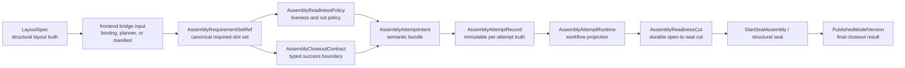

# Summary

`0085` established the right parent thesis:

- one structural assembly trunk,
- one frontend-agnostic attempt domain above that trunk,
- and one workflow and closeout line above immutable attempt truth.

`0105` is the executable hard cut for that attempt domain.

This rewrite treats assembly attempt as a first-class strong-consistency domain.
It removes the remaining phase-1 tendency to let compatibility carriers answer
semantic questions they do not actually own.

It introduces eight non-negotiable rules:

1. `AssemblyRequirementSetRef` is the only canonical required-slot carrier.
2. `AssemblyReadinessPolicy` is separate from requirement identity.
3. `AssemblyCloseoutContract` is typed and separate from runtime or workspace
   identity.
4. `AssemblyAttemptIntent` is the semantic bundle and owns
   `attempt_intent_digest`.
5. `AssemblyAttemptRecord` is immutable per-attempt truth and separates
   `attempt_id` from `workspace_assembly_id`.
6. `AssemblyAttemptRuntime` is workflow projection only and is carried by
   `Operation[T]`.
7. `AssemblyReadinessCut` is a first-class durable cut captured after an
   explicit attempt transition.
8. `wait` observes; explicit transition APIs advance workflow.

`operation.proto` remains the public continuation and observation surface from
`0055`, `0096`, and `0100`.
It does not replace the attempt domain model.
It projects that model honestly.

# Goals / Non-Goals

## Goals

- Keep `0085`'s one-trunk structural direction unchanged.
- Make the attempt domain follow the same strong-consistency constitution already
  used elsewhere in the repository:
  - semantic truth is durable,
  - workflow is a projection over durable truth,
  - lifecycle protects bounded runtime promises only.
- Replace binding-shaped attempt carriers with frontend-agnostic requirement,
  readiness, and closeout contracts.
- Separate semantic digest, attempt identity, and structural workspace identity.
- Make public continuation honest by binding it to durable attempt scope rather
  than to a mutable workspace alias.
- Remove implicit state transitions from observation APIs.
- Keep binding-backed contribution, direct `register_view`, and future frontends
  on the same structural commit helper path.
- Make the closeout boundary explicit relative to `0111` and `0104`.

## Non-Goals

- Redefine the local binding plane from `0084`.
- Redefine structural piece or canonical registration rules already owned by
  `view_state_service` and the registration trunk.
- Introduce `TP > 1` assembly semantics in this cut.
- Invent a repo-wide generic set abstraction beyond this domain. `0056` remains
  the owner of `ArtifactSetRef`.
- Force `0111` or `0104` closeout semantics into the first dependency-ready
  implementation if their typed child contracts are not yet ready.
- Remove `Store.seal_assembly(...)` as the low-level structural primitive below
  the attempt surface.

# Problem Statement

The repository already has the structural substrate:

- `LayoutSpec` and deterministic `view_id`,
- `view_state_service` as structural coverage and proof authority,
- one assembly workspace trunk,
- `artifact_bindings` as post-seal authority,
- and `Operation[T]` plus `OperationRef` as the public workflow surface.

The remaining design bug is at the attempt-domain join points.

## 1. Canonical attempt contract is still binding-shaped

Current `ContributionContractSnapshot` still carries binding-local concepts such
as `BindingContributionKind`.

That is not deep enough for the repository's long-term direction:

- binding publish is only one frontend,
- future planners and other frontends need to lower to the same canonical
  requirement kernel,
- and a strong-consistency domain must not make one frontend's lowering enum the
  authoritative attempt truth.

## 2. Requirement identity is still mixed with readiness policy

Current attempt contract carries
`require_live_contributions_until_readiness_cut`.

That folds two different questions into one object:

- which requirements must be satisfied,
- and which liveness condition must still hold when transitioning to seal.

Those questions belong to different kernels and should not share one digest.

## 3. Semantic digest is still mixed with attempt instance identity

Current `attempt_spec_hash` is computed from an object that still embeds
`assembly_id`.

That means the digest names one attempt instance, not purely the semantic intent
that the attempt claims to realize.

This is inconsistent with the repository's existing digest discipline:

- `SelectionIdentity` does not collapse into `ContentIdentity`,
- `ArtifactSetRef.set_digest_hex` does not collapse into one execution window,
- and attempt intent should likewise stay separate from attempt instance.

## 4. Durable attempt truth is still projected through workflow storage

Current direction still tolerates `operations.snapshot_proto` as the durable
store for immutable attempt truth and readiness cut.

That is backwards for a strong-consistency domain:

- workflow runtime should project durable truth,
- not replace it,
- and operations storage should not remain the only durable attempt record.

## 5. Observation still performs transition

Current SDK flow lets `wait_assembly_attempt(...)` implicitly trigger sealing.

That violates the repository boundary already set by `0096`:

- observation is workflow-owned,
- transition is workflow-owned,
- but the two are not the same API.

If `wait` performs `seal`, the attempt domain grows a private workflow dialect.

## 6. Closeout contract is still JSON-shaped

Current `CloseoutPolicySnapshot` still relies on `policy_json`.

That is not a strong long-term contract for a repository that already splits:

- semantic truth,
- workflow truth,
- backing truth,
- and closeout truth.

If attempt closeout depends on `0111` representation or `0104` rollout
contracts, those dependencies must appear as typed child references.
For `0104`, that means a typed rollout barrier child contract such as
`RolloutBarrierRef`, not an ambient rollout alias or implicit workflow name.
If they are not dependency-ready yet, `0105` must narrow scope rather than hide
those semantics in JSON.

# Repository Alignment

`0105` is not a local dialect.
It is the attempt-domain specialization of repository rules already landed
elsewhere.

## One authority root per question

`0092` and `0090` require one authority root per question.

For assembly attempts:

- structural layout truth belongs to `LayoutSpec`,
- structural target truth belongs to `ViewSpec` plus deterministic `view_id`,
- requirement truth belongs to `AssemblyRequirementSetRef`,
- readiness-policy truth belongs to `AssemblyReadinessPolicy`,
- closeout-contract truth belongs to `AssemblyCloseoutContract`,
- immutable per-attempt truth belongs to `AssemblyAttemptRecord`,
- workflow currentness belongs to `AssemblyAttemptRuntime`,
- live occupancy belongs to durable slot occupancy plus lifecycle-backed
  liveness,
- final published success belongs to `PublishedModelVersion`, including future
  serving-representation lineage when typed `0111`
  `RepresentationPublishContract` closeout becomes dependency-ready.

No row, proto, or helper may silently answer more than one of those questions by
accident.

## Lifecycle is a protection kernel, not semantic truth

`0094` and `0011` require lifecycle to stay a bounded-lifetime protection
kernel.

Therefore:

- contribution leases protect live occupancy,
- finalizers accelerate release and cleanup,
- but lifecycle state does not replace requirement truth,
- does not replace readiness policy,
- and does not replace workflow phase or final closeout truth.

## Workflow semantics stay above lifecycle

`0096` requires replay, wait, currentness, fencing, and completion to remain
workflow semantics.

Therefore:

- the attempt coordinator remains the workflow owner,
- explicit transition APIs create or advance workflow state,
- observation APIs report workflow state,
- and `wait` must not become an implicit transition helper.

## Public continuation follows `0100`

`0100` requires public continuation to converge on `Operation[T]` or another
explicit public family surface with public-safe metadata.

Therefore:

- `AssemblyAttemptRef` must carry durable attempt scope,
- `OperationRef.authority_scope_id` must name `attempt_id`,
- `OperationRef.target_artifact_id` may name `workspace_assembly_id`,
- and `retry_later` remains out of dependency-ready scope for this design.

# Architecture & Interfaces

## Naming Compliance

This design introduces or hardens the following public interface families, and
they conform to repository naming rules:

- C++ controller/helper entrypoints are `snake_case`:
  `start_assembly_attempt`, `seal_assembly_attempt`,
  `capture_seal_readiness_snapshot`.
- Proto/Python model types are `PascalCase`:
  `AssemblyRequirementSetRef`, `AssemblyReadinessPolicy`,
  `AssemblyCloseoutContract`, `AssemblyAttemptIntent`,
  `AssemblyAttemptRecord`, `AssemblyAttemptRuntime`,
  `AssemblyReadinessCut`, `PublishedModelVersion`.
- Enum constants remain `ALL_CAPS`:
  `ASSEMBLY_CLOSEOUT_KIND_SOURCE_PUBLISH_ONLY`,
  `ASSEMBLY_CONTRIBUTOR_LIVENESS_MODE_REQUIRE_LIVE_UNTIL_CUT`.

No new interface introduced by this design relies on mixed-case method names,
binding-local enum names, or overloaded identifiers such as using
`workspace_assembly_id` as attempt identity.

## Canonical Domain Line



Normative split:

- `LayoutSpec` answers structural layout truth.
- frontend bridge input answers what one frontend family is lowering at attempt
  creation time.
- `AssemblyRequirementSetRef` answers which requirements must be satisfied.
- `AssemblyReadinessPolicy` answers which liveness predicates must still hold at
  transition time.
- `AssemblyCloseoutContract` answers which closeout contract final success must
  satisfy.
- `AssemblyAttemptIntent` answers the semantic bundle for one attempted publish.
- `AssemblyAttemptRecord` answers immutable per-attempt truth.
- `AssemblyAttemptRuntime` answers who currently owns progression.
- `AssemblyReadinessCut` answers what exact evidence the seal transition
  consumed.
- `PublishedModelVersion` answers final externally visible lineage.
- runtime materialization or builder semantic contracts may feed closeout, but
  they do not replace closeout lineage.
- attempt success also implies that the returned source artifact is readable
  through the owning daemon's ordinary artifact-read path.

No one object replaces the others.

## 1. Requirement Kernel

`AssemblyRequirementSetRef` is the only canonical required-slot carrier.

It follows the same design pattern used elsewhere in the repository:

- canonical semantic identity is digested independently from transport or
  execution,
- carrier form is explicit,
- and bridge-local enums do not become repository-wide truth.

### Requirement model

Each `AssemblyRequirement` must carry:

- `slot_id`
- `AssemblyTargetRef target`
- `coverage_contract`

`AssemblyTargetRef` is typed and does not collapse into `slot_id`.
Recommended dependency-ready target kinds are:

- `structural_view`
- `canonical_layout`

### Requirement-set reference

`AssemblyRequirementSetRef` must carry:

- `requirements_digest`
- `requirement_count`
- `carrier_form`
- `inline_requirements` for the first dependency-ready form
- optional manifest-backed or template-backed carrier fields for later phases

Normative rules:

1. requirement identity is rooted in canonical requirement entries, not in
   `LayoutSpec.expected_view_ids`,
2. `slot_id` is required-slot identity, not structural `view_id`,
3. requirement-set digest excludes readiness policy, closeout contract,
   attempt instance ids, and workflow state,
4. binding, planner, and future frontends must lower to the same canonical
   requirement-set contract before the attempt exists,
5. `LayoutSpec.expected_view_ids` may remain one bridge input for a
   `piece_partial`-style frontend, but it is not canonical attempt truth,
6. the first dependency-ready carrier form is `inline`,
7. a manifest-backed carrier may be declared for later phases, but it is not
   dependency-ready until its owner and fail-closed resolution contract are
   defined.

### Proto sketch

```proto
message AssemblyTargetRef {
  string kind = 1;               // "structural_view" or "canonical_layout"
  string structural_view_id = 2; // set only when kind == "structural_view"
}

message AssemblyRequirement {
  string slot_id = 1;
  AssemblyTargetRef target = 2;
  string coverage_contract = 3;
}

message AssemblyRequirementSetRef {
  string requirements_digest = 1;
  uint64 requirement_count = 2;
  string carrier_form = 3; // "inline" in the first dependency-ready phase
  repeated AssemblyRequirement inline_requirements = 4;
}
```

## 2. Readiness Policy

`AssemblyReadinessPolicy` is not part of requirement identity.

Minimum dependency-ready fields:

- `contributor_liveness_mode`

Recommended initial values:

- `require_live_until_cut`
- `allow_durable_occupancy_only`

Normative rules:

1. readiness policy answers the liveness rule for transition correctness,
2. it is part of attempt intent, not requirement-set identity,
3. it must not be folded into lifecycle ownership,
4. it must not be represented only as a boolean on the requirement kernel.

## 3. Closeout Contract

`AssemblyCloseoutContract` is typed closeout truth.

Minimum dependency-ready fields:

- `kind`
- `closeout_contract_digest`

Declared contract kinds:

- `source_publish_only`
- `representation_publish`
- `rollout_gated_publish`

Dependency-ready rule:

- `source_publish_only` is the only required kind for the first implementation
  wave.

Follow-on rule:

- `representation_publish` becomes dependency-ready only when `0111` exposes a
  typed `RepresentationPublishContract` child contract that carries
  representation-specific publication facts such as serving-artifact identity,
  manifest reference, and builder-layer publication digest,
- `rollout_gated_publish` becomes dependency-ready only when `0104` exposes a
  dependency-ready typed rollout barrier child contract such as
  `RolloutBarrierRef`.

Builder relation:

- future source-to-serving builder work should resolve its semantic transform
  below this layer, then surface externally visible serving lineage through
  `representation_publish` rather than inventing a second publication truth.

Normative rules:

1. if a child closeout dependency is not typed and fail-closed, it must not be
   hidden inside `policy_json`,
2. closeout-contract digest is separate from requirement-set digest,
3. the parent closeout contract remains generic; representation-specific fields
   must live in the `0111` child contract rather than being reintroduced as
   untyped top-level payload,
4. final success must be checked against the closeout contract that the attempt
   actually snapped at creation time.

## 4. Intent And Immutable Attempt Record

`AssemblyAttemptIntent` is the semantic bundle for one attempted publish.

It must carry:

- `layout_id`
- `AssemblyRequirementSetRef requirements`
- `AssemblyReadinessPolicy readiness_policy`
- `AssemblyCloseoutContract closeout_contract`
- `attempt_intent_digest`

`AssemblyAttemptRecord` is immutable per-attempt truth.

It must carry:

- `attempt_id`
- `workspace_assembly_id`
- `AssemblyAttemptIntent intent`

Normative rules:

1. `attempt_intent_digest` names semantic intent only,
2. `attempt_intent_digest` must not include `attempt_id` or
   `workspace_assembly_id`,
3. `attempt_id` is workflow and semantic instance identity,
4. `workspace_assembly_id` is structural workspace identity,
5. `AssemblyAttemptRecord` is created before contributors are accepted,
6. submit, seal, wait, and closeout validate against the same immutable record.

### Proto sketch

```proto
message AssemblyAttemptIntent {
  string layout_id = 1;
  AssemblyRequirementSetRef requirements = 2;
  AssemblyReadinessPolicy readiness_policy = 3;
  AssemblyCloseoutContract closeout_contract = 4;
  string attempt_intent_digest = 5;
}

message AssemblyAttemptRecord {
  string attempt_id = 1;
  string workspace_assembly_id = 2;
  AssemblyAttemptIntent intent = 3;
}
```

## 5. Workflow Runtime And Explicit Transitions

`AssemblyAttemptRuntime` is not immutable attempt truth.
It is the workflow projection carried by `operation.proto`.

Minimum runtime state:

- coordinator `OperationRef`
- current lease generation
- current phase
  - `open`
  - `sealing`
  - terminal

Normative rules:

1. `start_assembly_attempt(...)` creates durable immutable attempt truth and an
   open workflow runtime,
2. contributors are accepted only while runtime phase is `open`,
3. `seal_assembly_attempt(...)` is the explicit attempt transition API,
4. `wait_assembly_attempt(...)` and `status` observe only,
5. observation APIs must not trigger `seal_assembly_attempt(...)` implicitly,
6. low-level `Store.seal_assembly(...)` remains the structural primitive below
   the attempt surface.

### Public continuation metadata

For attempt workflow:

- `kind = "assembly_attempt"`
- `target_artifact_id = workspace_assembly_id`
- `authority_scope_kind = "assembly_attempt"`
- `authority_scope_id = attempt_id`
- `attachment_kind = "assembly_attempt"`
- `fencing_digest = attempt_intent_digest`

`recovery_class = "cluster_durable"` is honest only after immutable attempt
truth, readiness cut, and closeout result are all durably reconstructible from
shared state.

## 6. Durable Readiness Cut

`AssemblyReadinessCut` captures the exact evidence cut consumed by the seal
transition.
It is not workflow runtime, and it is not immutable attempt intent.

Minimum contents:

- `attempt_id`
- `attempt_intent_digest`
- `coordinator_generation`
- `workspace_layout_binding_version`
- full structural evidence for all required structural targets:
  - `structural_view_id`
  - `view_spec_json`
  - `view_size_bytes`
  - `view_data_hash`
  - `canonical_size_bytes`
  - `canonical_bytes_covered`
  - `canonical_ranges`
  - `meta_digest` computed from that same full evidence
- accepted live slot occupancies at the cut

Seal correctness must consume the captured cut directly.
It must not reread live workspace structural state after the cut is captured in
order to reconstruct authoritative seal inputs.

Ordering rule:

1. acquire or validate the same coordinator lease,
2. move runtime phase to `sealing`,
3. reject further contributions,
4. capture one durable readiness cut,
5. perform structural seal against that cut,
6. perform closeout against that cut and the snapped closeout contract only.

This is the hard cut that keeps replacement coherent.

## 7. Structural Lowering Rules Stay Shared

All frontends must lower onto one structural commit helper path for:

- deterministic structural identity computation,
- canonical coverage derivation,
- proof digest generation,
- `view_state_service` updates,
- structural validation,
- and the existing structural seal substrate.

Binding-specific bridge rules:

- `SealedBindingValue` remains a valid frontend input,
- binding-local enums or coverage hashes may exist inside the bridge,
- but they must not become the canonical requirement kernel,
- SDK or other frontend code must not own final contribution lowering into
  structural registration payloads,
- daemon-side attempt owners must resolve the current binding value, active
  layout policy, replicated-tensor participation, and canonical coverage before
  any workspace registration is committed,
- and durable slot occupancy may be recorded only after that daemon-owned
  lowering succeeds.

Attempt semantics sit above this helper path.
They do not replace it.

## 8. Closeout Scope Relative To `0111` And `0104`

This design must stay explicit about the current dependency-ready closeout
boundary.

Recommended first implementation wave:

- attempt closeout is `source_publish_only`,
- final success means source published lineage exists and matches the snapped
  closeout contract.

Optional follow-on wave:

- if the repository chooses to absorb representation or rollout closeout in the
  same program, `0111` and `0104` must expose typed child references first,
  where the `0104` child ref is a typed rollout barrier contract rather than an
  untyped rollout string,
- `0105` may then extend `AssemblyCloseoutContract.kind`,
- and representation-facing publication should consume a typed semantic child
  contract from `0111` rather than rebuilding semantic or builder-publication
  truth inside closeout helpers,
- but it must not do so through untyped JSON or mutable post-start policy.

## Public Surface

The public surface should converge on the following shape:

```python
class AssemblyAttemptRef:
    attempt_id: str
    workspace_assembly_id: str
    attempt_intent_digest: str
    coordinator_operation: OperationRef


class Store:
    def start_assembly_attempt(
        self,
        *,
        layout_id: str,
        requirements: AssemblyRequirementSetRef,
        readiness_policy: AssemblyReadinessPolicy | None = None,
        closeout_contract: AssemblyCloseoutContract | None = None,
        ctx: CallContext | None = None,
    ) -> AssemblyAttemptRef: ...

    def seal_assembly_attempt(
        self,
        attempt: AssemblyAttemptRef,
        *,
        ctx: CallContext | None = None,
    ) -> Operation[PublishedModelVersion]: ...

    def wait_assembly_attempt(
        self,
        attempt: AssemblyAttemptRef | Operation[PublishedModelVersion],
        *,
        ctx: CallContext | None = None,
    ) -> PublishedModelVersion: ...
```

Surface rules:

1. callers must not reconstruct attempt semantics from layout hints,
2. `wait_assembly_attempt(...)` must not perform an implicit transition,
3. bare string `operation_id` remains only a low-level `wait_operation(...)`
   escape hatch outside the attempt contract,
4. low-level `Store.seal_assembly(...)` remains for callers who intentionally
   operate below the attempt surface.

# Invariants And Error Model

## Invariants

- one immutable `AssemblyAttemptRecord` exists per attempt,
- one semantic `AssemblyAttemptIntent` digest exists per attempt record,
- one workflow projection exists per attempt,
- one durable readiness cut exists at most once per attempt,
- requirement identity, readiness policy, closeout contract, attempt identity,
  structural workspace identity, and contributor identity remain distinct,
- submit, seal, wait, and closeout validate against the same immutable attempt
  record,
- `wait` is observation only,
- public continuation aligns with `0100`,
- final success is reported only through the attempt workflow result and
  `PublishedModelVersion`,
- daemon-owned bridge lowering is authoritative for binding-backed attempt
  contributions,
- and final success requires both closeout-contract satisfaction and readable
  result-artifact availability.

## Error Model

- `INVALID_ARGUMENT`
  - malformed attempt reference
  - malformed requirement-set carrier
  - invalid readiness-policy input
  - invalid closeout-contract input
- `FAILED_PRECONDITION`
  - attempt-intent mismatch
  - layout mismatch
  - requirement or slot is occupied by another live contributor
  - readiness cut is unavailable or malformed
  - required closeout metadata is absent
- `ABORTED`
  - coordinator generation advanced
  - required live occupancy was lost before the readiness cut
  - explicit attempt abort occurred
- `DATA_LOSS`
  - structural evidence or seal bytes are inconsistent after safe recovery is no
    longer possible
- `DEADLINE_EXCEEDED`
  - wait, seal, or closeout exceeded the budget

# Schema Changes

Strong-consistency phase requirements:

- add a first-class `assembly_attempts` durable table keyed by `attempt_id`,
- store immutable `AssemblyAttemptRecord` or its typed fields there,
- add a first-class `assembly_readiness_cuts` durable table keyed by
  `attempt_id`,
- replace `assembly_contributions` with a first-class slot-occupancy model keyed
  by `(attempt_id, slot_id)` and keeping `structural_view_id` separate,
- remove `assembly_runtime_policies` as the authoritative source of attempt
  semantics,
- if a mutable pre-attempt profile source is still needed, key it by `layout_id`
  or another explicit pre-attempt profile identifier,
- keep `operations` as workflow runtime and continuation projection only,
- stop using `operations.snapshot_proto` as the only durable attempt truth store.

The next schema shape should therefore converge on:

- `assembly_attempts`
- `assembly_readiness_cuts`
- `assembly_slot_occupancies`
- optional pre-attempt closeout profile storage keyed by pre-attempt scope

This is the preferred hardening step.
No compatibility-only storage alias is part of the target end state.

# Trade-offs & Risks

- **More named domain objects**
  - The attempt domain becomes more explicit.
  - That is preferable to continuing to let one carrier answer several
    semantic questions.
- **Explicit transition API**
  - Callers lose the convenience of `wait` secretly performing `seal`.
  - That is intentional because side-effect-free observation is a repository
    invariant, not a convenience detail.
- **New durable tables**
  - The implementation grows schema and repository surface area.
  - That is intentional because a strong-consistency domain cannot keep durable
    truth only in workflow snapshots.
- **Narrow first closeout scope**
  - Deferring `0111` or `0104` child contracts keeps the first implementation
    wave smaller.
  - That is preferable to hiding not-yet-typed child contracts inside JSON.

# Compatibility & Acceptance Criteria

Acceptance requires:

- `0085` remains true at the structural-trunk level,
- attempt truth is frontend-agnostic and no longer binding-shaped,
- `AssemblyRequirementSetRef` is the canonical requirement kernel,
- readiness policy is separate from requirement identity,
- closeout contract is typed and separate from runtime state,
- semantic digest is separate from attempt identity and workspace identity,
- one immutable attempt record exists per attempt,
- one durable readiness cut exists at most once per attempt,
- `wait_assembly_attempt(...)` is observation only,
- explicit transition APIs advance attempt workflow,
- public continuation uses durable `attempt_id` scope and aligns with `0100`,
- `operations` is no longer the only durable store for immutable attempt truth,
- binding-backed contribution, direct `register_view`, and future frontends all
  still lower onto the same structural helper path,
- the first dependency-ready closeout scope is explicit,
- and any broader closeout scope depends on typed child contracts from `0111`
  and `0104`, with rollout-gated closeout consuming a typed rollout barrier
  contract rather than ambient rollout metadata.

# References

- `docs/designs/0085-distributed-binding-assembly-and-coordinator.md`
- `docs/plans/0085-distributed-binding-assembly-and-coordinator.md`
- `docs/designs/0084-binding-unified-model-and-contract.md`
- `docs/designs/0011-unified-session-lifecycle-leases.md`
- `docs/designs/0055-programmable-framework.md`
- `docs/designs/0111-source-to-serving-builder-and-representation-publication.md`
- `docs/designs/0090-existence-semantics-and-single-authority-truth.md`
- `docs/designs/0092-artifact-profiles-shared-dataplane-and-truth-layering.md`
- `docs/designs/0094-unified-lifecycle-kernel-and-capability-families.md`
- `docs/designs/0096-workflow-companion-admission-and-fencing.md`
- `docs/designs/0100-distributed-authority-handoff-security-and-public-surfaces.md`
- `docs/designs/0102-engine-artifact-integration-and-high-cardinality-manifest-orchestration.md`
- `docs/designs/0104-artifact-realization-and-cluster-rollout.md`
