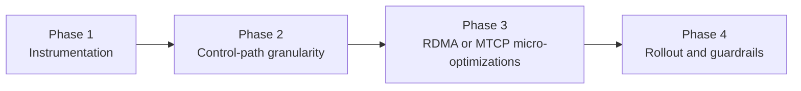

# Summary

`2026-03-16` 对比数据显示，communicator 在单次逻辑请求规模较小（`32 MiB`、`64 MiB`）时，仍明显落后于相关工作（Mooncake Transfer Engine），而在 `256 MiB+` 时已进入同一性能等级。

在 `0105` 的复盘中，发现此前“带宽下降”有一部分来自测量区间内非数据传输成本（如初始化、buffer clear/verify、校验拷贝等）抬高了分母；这与最初想回答的“任务过程中非数据面成本占比”不完全一致。

因此本设计将目标调整为：

1. 优先量化任务过程中的非数据传输代价。
2. 区分“一次性可均摊成本”与“每次传输重复成本”。
3. 在上述可归因前提下，再推进控制面/数据面优化决策。

本设计给出一个分阶段方案：

1. 先补齐可归因观测，量化每个开销项，并明确 amortizable vs recurring 分类。
2. 优化控制路径与窗口/ACK 粒度，降低每个逻辑请求的控制往返成本。
3. 优化 RDMA/MTCP 热路径中的每 WR bookkeeping、future/wait 和日志噪声。
4. 在严格回归和可回滚前提下渐进上线。

## Baseline

来自 [20260316-communicator-vs-transfer-engine-comparison.md](../benchmarks/20260316-communicator-vs-transfer-engine-comparison.md)：

| Logical request size | Communicator | Transfer Engine | Gap |
| --- | --- | --- | --- |
| `32 MiB` | `18.56 GB/s` | `22.49 GB/s` | `-17.5%` |
| `64 MiB` | `20.56 GB/s` | `22.75 GB/s` | `-9.6%` |
| `256 MiB` | `23.17 GB/s` | `23.02 GB/s` | same class |
| `1 GiB` | `23.96 GB/s` | `23.69 GB/s` | same class |

# Problem Statement

## 1. 控制线程串行导致小包固定开销放大

当前 `Communicator` 仅启动一个请求线程处理 `request_queue_`：

- 请求线程启动点：`core/communicator/engine/engine.cc` (`request_thread_`)
- 主循环：`do_read_request_loop()`
- 队列定义：`core/communicator/engine/engine.h` (`request_queue_`)

单线程串行在大量短请求、混合 peer 场景下会放大排队等待；即使单 peer 场景，也会在 control send/pending 维护路径上叠加额外抖动。

## 2. RDMA 窗口推进由 ACK 驱动，回填节奏偏保守

RDMA 路径中，source 侧在 `resume_rdma_reads()` 一次 pass 内只要“有进展”就 break，等待 ACK 再继续：

- `resume_rdma_reads()` break-on-progress：`core/communicator/engine/engine.cc`
- ACK 回调触发继续推进：`ENGINE_OP_RDMA_READ_DONE_EX` 处理分支内调用 `resume_rdma_reads()`

该机制在中小逻辑请求下会增加“窗口-ACK-窗口”往返轮次，放大控制路径占比。

## 3. RDMA 每 WR 级别队列操作与 completion bookkeeping 成本偏高

当前 `read_multi()` 为每个 posted WR 执行一次 request enqueue，并在 CQ completion 为每个 WR pop：

- `read_multi()`：`core/communicator/transport/rdma_transport.cc`
- `do_process_wc()`：`core/communicator/transport/rdma_transport.cc`
- request completion/ACK 队列：`core/communicator/transport/request.h`

小包/中包下 WR 数较多时，这类原子与队列操作会成为不可忽略的固定成本。

## 4. MTCP staged 路径存在单线程信用等待 + future 串行等待

MTCP staging 使用单线程循环消费，并在资源不足时退避 sleep：

- 线程入口：`core/communicator/engine/engine.cc` (`mtcp_staging_loop()`)
- 退避等待：`process_mtcp_read_task()` 中 `absl::SleepFor(backoff)`

MTCP transport 侧存在大量 `std::async` 与 `future.get()/wait()` 等待链：

- send path async/release：`core/communicator/transport/mtcp_transport.cc`
- recv path 按 future 顺序等待：`core/communicator/transport/mtcp_transport.cc`

在 fallback 或混合流量下，这些等待与调度开销会放大尾延迟。

## 5. 热路径 `LOG(INFO)` 频率过高

`rdma_resume`、`READ_RESPONSE_EX`、`read_multi` completion 等热路径存在高频 `LOG(INFO)`，在高请求率下会产生额外 CPU 与锁竞争负担。

# Goals / Non-Goals

## Goals

1. 量化 communicator benchmark 中非数据传输代价，并提供可复现的字段化输出。
2. 将开销拆分为“一次性可均摊成本”（初始化、预热）与“每次传输重复成本”（clear、enqueue、wait、verify）。
3. 显式覆盖用户关注项：数据拷贝成本、内存分配成本、校验成本。
4. 在保持 `256 MiB+` direct RDMA 路径无明显回退的前提下，为后续优化提供归因基线。
5. 方案默认可控、可回滚，不引入隐式环境变量开关。
6. 所有新调优项进入统一 runtime 配置（`communicator_config.proto`），遵循 [0004-unified-runtime-config.md](./0004-unified-runtime-config.md)。

## Non-Goals

1. 不重写 communicator 为另一套传输引擎。
2. 不改变 Global Store / Store Daemon 架构语义。
3. 不在本阶段追求 full-8 ceiling 与 TE 完全一致（本设计聚焦小包/中包）。
4. 不引入破坏兼容的协议语义变更。

# Architecture & Interfaces

## 优化分层

## Phase 1: 观测与归因基线

新增 request/batch 级性能快照（以统计为主，不在默认热路径打印）：

- `control_queue_wait_us`
- `control_send_us`
- `first_window_emit_us`
- `rdma_windows_total`
- `rdma_ack_rounds_total`
- `rdma_wr_posted_total`
- `rdma_cq_completion_total`
- `mtcp_staging_wait_us`
- `mtcp_future_wait_us`
- `amortizable_init_*`（init / buffer allocation / warmup）
- `recurring_*`（clear / issue / wait / verify）
- `verify_buffer_alloc_us`
- `verify_copy_us`
- `verify_checksum_us`
- `amortized_per_iteration_us`
- `amortized_per_request_us`

落点：

- request 生命周期：`core/communicator/transport/request.h`
- engine 控制路径：`core/communicator/engine/engine.cc`
- transport 数据路径：`core/communicator/transport/rdma_transport.cc`、`core/communicator/transport/mtcp_transport.cc`
- benchmark 输出层：`core/communicator/bench/communicator_bench.cc`

原则：

1. 默认仅聚合指标，不逐请求 `INFO` 输出。
2. `ITER` 输出用于定位单轮瓶颈，`SUMMARY` 输出用于 amortizable/recurring 归因。
3. 允许按采样率输出 debug 详情，避免常态噪声。

## Phase 2: 控制路径与窗口/ACK 粒度

### 2.1 请求分发并行化（保持每 peer 顺序）

将单请求线程升级为“分片队列 + 固定 worker 池”：

- 按 `dst_url` 哈希分片，保证同 peer 请求顺序。
- 不改变 `pending_requests_` 语义。
- 默认 worker 数为 `1`，与旧行为一致。

### 2.2 RDMA refill budget

在 `resume_rdma_reads()` 引入每次 pass 的推进预算，不再“有进展即 break”：

- 预算维度：`window` 数或 `bytes`。
- 保持 credit 安全边界（不突破 `FlowCreditLedger`）。
- 当达到预算后再等待 ACK，减少频繁控制往返。

### 2.3 ACK 批处理窗口

在保持 lease 生命周期正确性的前提下，允许同一 request 的多个已完成 window 合并 ACK（受上限和超时约束）：

- 限制最大延迟，避免 source 侧 credit 长时间不归还。
- 保持最终窗口完成语义与失败语义不变。

## Phase 3: RDMA / MTCP 微优化

### 3.1 RDMA inflight bookkeeping 批化

将“每 WR 入队一个 request 指针”优化为“每 post 批次一个 inflight 记录 + remaining 计数”，减少队列 push/pop 次数。

### 3.2 RDMA completion signal 间隔化（可控）

引入可配置的 signaled WR 间隔（默认 `1` 保持旧行为），在稳定场景下降低 CQ 事件密度。

### 3.3 MTCP staged 路径去阻塞化

减少 `std::async + wait/get` 串行等待链，优先复用已有 async task 跟踪机制；把 credit 不足等待从“主动 sleep 退避”向“事件驱动唤醒”收敛。

### 3.4 热路径日志降噪

将高频 `LOG(INFO)` 下沉到 `VLOG(1/2)` 或采样日志，保留 `WARNING/ERROR` 与关键一次性 `INFO`。

## Phase 4: 渐进上线

1. 先启用观测，不改行为。
2. 启用控制粒度优化（默认保守值）。
3. 在小规模灰度中启用 RDMA/MTCP 微优化。
4. 达到阈值后将新参数作为推荐默认值写入文档。

# Proposed Config Additions

以下字段属于统一 runtime 配置扩展，目标文件为 `proto/tensorcast/communicator/v1/communicator_config.proto`：

- `TransportConfig.request_worker_count`
- `RdmaConfig.resume_max_windows_per_pass`
- `RdmaConfig.ack_batch_max_windows`
- `RdmaConfig.ack_batch_max_delay_us`
- `RdmaConfig.unsignaled_wr_interval`
- `TransportConfig.hotpath_log_sample_rate`

默认值全部保持兼容旧行为（`1` 或 `0` 表示关闭新策略）。

# Invariants & Error Model

1. `pending_requests_` 生命周期不变，结果回调仍负责清理。
2. 不允许因为 ACK 批处理导致 credit 永久不归还。
3. refill budget 不能突破 `FlowCreditLedger` 上限。
4. 发生 transport 错误时，`ReadRequest::set_result()` 仍保持幂等完成。
5. 任何优化都不允许引入“静默 fallback + 吞错”。

# Schema Changes

无数据库 schema 变更，不涉及 `schema.sql`。

# Naming Compliance

本设计新增接口/字段遵循仓库命名规则：

- C++ class / struct（PascalCase）
  - `SmallPacketPerfSnapshot`
  - `RdmaInflightBatch`
- C++ functions / methods（snake_case）
  - `resume_rdma_reads_with_budget`
  - `flush_pending_rdma_ack_batch`
  - `enqueue_request_shard`
- Proto fields（snake_case）
  - `request_worker_count`
  - `resume_max_windows_per_pass`
  - `ack_batch_max_windows`
  - `ack_batch_max_delay_us`
  - `unsignaled_wr_interval`
  - `hotpath_log_sample_rate`
- 常量（ALL_CAPS）
  - `kDefaultResumeMaxWindowsPerPass`
  - `kDefaultAckBatchMaxDelayUs`

# Trade-offs & Risks

1. 并行 request worker 增加并发复杂度，若分片策略不当可能引入顺序回归。
2. ACK 批处理可能提升吞吐但加大短时内存占用；需要严格 TTL 与上限。
3. unsignaled WR 间隔化会降低 CQ 压力，但错误可见性变慢；需保留保守默认值。
4. MTCP 去阻塞化涉及线程模型调整，必须先由观测数据证明收益再扩大范围。

# Compatibility & Acceptance Criteria

## 功能正确性

1. 现有 API 与 wire 语义保持兼容。
2. `bazel test //core/communicator:rdma_engine_test`、`//core/communicator:staging_flow_controller_test`、`//core/communicator:request_test`、`//core/communicator:mtcp_transport_lane_test` 全通过。

## 性能验收

在与 [20260316 baseline](../benchmarks/20260316-communicator-vs-transfer-engine-comparison.md) 同口径的单 NIC 严格 direct RDMA 读测下：

1. `ITER` 与 `SUMMARY` 必须同时给出 amortizable 与 recurring 字段，且覆盖 clear/issue/wait/verify 子项。
2. `verify` 需明确拆分 `buffer_alloc`、`copy`、`checksum`，可判断是否每轮重复发生。
3. 必须给出 `amortized_per_iteration_us` 与 `amortized_per_request_us`，支持“一次性成本均摊后”的读法。
4. `256 MiB+` 相对 baseline 吞吐不回退超过 `3%`（带宽保留为护栏指标，而非唯一目标）。
5. 新增指标可用于判定小包瓶颈是否主要落在控制面与重复开销，而非纯数据面极限。

## 可运维性

1. 热路径 `INFO` 日志量显著下降（以请求数归一化统计）。
2. 所有调优项可通过配置单独关闭并回退旧行为。

# References

- [Communicator vs Transfer Engine Comparison (2026-03-16)](../benchmarks/20260316-communicator-vs-transfer-engine-comparison.md)
- [Communicator RDMA NIC / GDR Structured Summary (2026-03-15)](../benchmarks/20260315-communicator-rdma-nic-gdr-progress.md)
- [core/communicator/engine/engine.cc](../../core/communicator/engine/engine.cc)
- [core/communicator/engine/staging_flow_controller.cc](../../core/communicator/engine/staging_flow_controller.cc)
- [core/communicator/transport/rdma_transport.cc](../../core/communicator/transport/rdma_transport.cc)
- [core/communicator/transport/request.h](../../core/communicator/transport/request.h)
- [core/communicator/transport/mtcp_transport.cc](../../core/communicator/transport/mtcp_transport.cc)
- [proto/tensorcast/communicator/v1/communicator_config.proto](../../proto/tensorcast/communicator/v1/communicator_config.proto)
