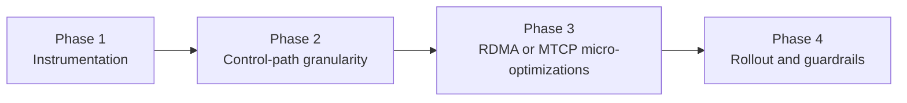

# Summary

The `2026-03-16` comparison shows that communicator still lags related work
(Mooncake Transfer Engine) when one logical request is relatively small
(`32 MiB`, `64 MiB`), while it already reaches the same performance class at
`256 MiB+`.

During the `0105` retrospective, we found that part of the previous
"bandwidth drop" came from non-transfer costs inside the measurement window
(for example initialization, buffer clear/verify, and verification copy), which
inflated the denominator. This is not fully aligned with the original question:
"what share of total task time is non-data-plane cost?"

Therefore, this design adjusts the objective to:

1. Prioritize quantifying non-transfer cost during task execution.
2. Separate one-time amortizable cost from recurring per-transfer cost.
3. Make control-plane and data-plane optimization decisions only after costs are
   attributable.

This design provides a phased plan:

1. Fill the observability gap first, quantify each cost term, and classify
   amortizable vs recurring costs.
2. Optimize control-path behavior and window/ACK granularity to reduce
   round-trip overhead per logical request.
3. Optimize per-WR bookkeeping, future/wait chains, and log noise on
   RDMA/MTCP hot paths.
4. Roll out incrementally with strict regression checks and clear rollback.

## Baseline

From [20260316-communicator-vs-transfer-engine-comparison.md](../benchmarks/20260316-communicator-vs-transfer-engine-comparison.md):

| Logical request size | Communicator | Transfer Engine | Gap |
| --- | --- | --- | --- |
| `32 MiB` | `18.56 GB/s` | `22.49 GB/s` | `-17.5%` |
| `64 MiB` | `20.56 GB/s` | `22.75 GB/s` | `-9.6%` |
| `256 MiB` | `23.17 GB/s` | `23.02 GB/s` | same class |
| `1 GiB` | `23.96 GB/s` | `23.69 GB/s` | same class |

# Problem Statement

## 1. Single-threaded control loop amplifies fixed overhead for small packets

Today `Communicator` starts only one request thread to consume
`request_queue_`:

- request-thread entry: `core/communicator/engine/engine.cc`
  (`request_thread_`)
- main loop: `do_read_request_loop()`
- queue definition: `core/communicator/engine/engine.h` (`request_queue_`)

This single-threaded serialization increases queueing delay under many short
requests and mixed-peer traffic. Even in single-peer traffic, it adds jitter on
control-send and pending-maintenance paths.

## 2. RDMA window refill is ACK-driven and currently conservative

On the RDMA path, source-side `resume_rdma_reads()` breaks a pass as soon as it
sees "some progress," then waits for ACK before continuing:

- `resume_rdma_reads()` break-on-progress:
  `core/communicator/engine/engine.cc`
- ACK callback triggers follow-up refill: `resume_rdma_reads()` is called inside
  `ENGINE_OP_RDMA_READ_DONE_EX`

For small and medium logical requests, this creates extra
"window -> ACK -> window" rounds and increases control-path share.

## 3. RDMA per-WR queue operations and completion bookkeeping are expensive

Today `read_multi()` enqueues once per posted WR, and CQ completion pops once
per WR:

- `read_multi()`: `core/communicator/transport/rdma_transport.cc`
- `do_process_wc()`: `core/communicator/transport/rdma_transport.cc`
- request completion/ACK queue: `core/communicator/transport/request.h`

When small/medium packets require many WRs, these atomics and queue operations
become non-trivial fixed cost.

## 4. MTCP staged path has single-thread credit waits plus serial future waits

MTCP staging currently consumes work in a single-thread loop and backs off with
sleep when resources are insufficient:

- thread entry: `core/communicator/engine/engine.cc` (`mtcp_staging_loop()`)
- backoff wait: `absl::SleepFor(backoff)` in `process_mtcp_read_task()`

MTCP transport also has many `std::async` chains and `future.get()/wait()`
waits:

- send-path async/release: `core/communicator/transport/mtcp_transport.cc`
- recv-path ordered waits on futures:
  `core/communicator/transport/mtcp_transport.cc`

Under fallback or mixed traffic, this waiting/scheduling overhead inflates tail
latency.

## 5. `LOG(INFO)` frequency is too high on hot paths

Hot paths such as `rdma_resume`, `READ_RESPONSE_EX`, and `read_multi`
completion currently emit high-frequency `LOG(INFO)`, adding avoidable CPU and
lock contention at high request rates.

# Goals / Non-Goals

## Goals

1. Quantify non-transfer cost in communicator benchmark and output reproducible
   structured fields.
2. Split cost into one-time amortizable cost (init/warmup) and recurring
   per-transfer cost (clear/enqueue/wait/verify).
3. Explicitly cover user-prioritized cost types: data-copy cost,
   memory-allocation cost, and verification cost.
4. Preserve `256 MiB+` direct RDMA throughput (no obvious regression) while
   building an attribution baseline for further optimization.
5. Keep the plan controllable and rollback-safe with no implicit environment
   toggles.
6. Add all new tuning knobs to unified runtime config
   (`communicator_config.proto`) and follow
   [0004-unified-runtime-config.md](./0004-unified-runtime-config.md).

## Non-Goals

1. Do not rewrite communicator into a different transport engine.
2. Do not change Global Store / Store Daemon architectural semantics.
3. Do not target TE full-8 ceiling in this phase (this design focuses on
   small/medium packets).
4. Do not introduce protocol-level incompatible semantic changes.

# Architecture & Interfaces

## Optimization Layers

## Phase 1: Observability and attribution baseline

Add request/batch-level performance snapshots (primarily aggregated metrics;
no default hot-path printing):

- `control_queue_wait_us`
- `control_send_us`
- `first_window_emit_us`
- `rdma_windows_total`
- `rdma_ack_rounds_total`
- `rdma_wr_posted_total`
- `rdma_cq_completion_total`
- `mtcp_staging_wait_us`
- `mtcp_future_wait_us`
- `amortizable_init_*` (init / buffer allocation / warmup)
- `recurring_*` (clear / issue / wait / verify)
- `verify_buffer_alloc_us`
- `verify_copy_us`
- `verify_checksum_us`
- `amortized_per_iteration_us`
- `amortized_per_request_us`

Instrumentation landing points:

- request lifecycle: `core/communicator/transport/request.h`
- engine control path: `core/communicator/engine/engine.cc`
- transport data path:
  `core/communicator/transport/rdma_transport.cc` and
  `core/communicator/transport/mtcp_transport.cc`
- benchmark output layer: `core/communicator/bench/communicator_bench.cc`

Principles:

1. Aggregate by default; no per-request `INFO` output.
2. Use `ITER` output for single-run bottleneck localization and `SUMMARY` output
   for amortizable/recurring attribution.
3. Allow sampled debug details to avoid steady-state noise.

## Phase 2: Control path and window/ACK granularity

### 2.1 Parallel request dispatch while preserving per-peer order

Upgrade the single request thread into "sharded queues + fixed worker pool":

- shard by `dst_url` hash to preserve in-order behavior per peer
- keep `pending_requests_` semantics unchanged
- default worker count remains `1` for backward-compatible behavior

### 2.2 RDMA refill budget

Add per-pass progress budget in `resume_rdma_reads()`, replacing
"break on any progress":

- budget dimension: number of `window`s or `bytes`
- keep credit safety boundary (must not exceed `FlowCreditLedger`)
- wait for ACK after budget is consumed to reduce frequent control round trips

### 2.3 ACK batching window

While preserving lease lifecycle correctness, allow one request to batch ACKs
for multiple completed windows (bounded by max count and timeout):

- bound max ACK delay to avoid long credit retention at source side
- keep final-window completion semantics and failure semantics unchanged

## Phase 3: RDMA / MTCP micro-optimizations

### 3.1 Batch RDMA inflight bookkeeping

Optimize from "one request pointer enqueued per WR" to
"one inflight record per post batch + remaining counter" to reduce queue
push/pop operations.

### 3.2 RDMA completion signaling interval (configurable)

Add configurable signaled-WR interval (default `1` for compatibility) to reduce
CQ event density in stable scenarios.

### 3.3 De-block MTCP staged path

Reduce `std::async + wait/get` serial wait chains, reuse existing async task
tracking when possible, and move insufficient-credit waits from
"active sleep backoff" toward "event-driven wakeup."

### 3.4 Reduce hot-path log noise

Downgrade high-frequency `LOG(INFO)` to `VLOG(1/2)` or sampled logging while
keeping `WARNING/ERROR` and key one-time `INFO` logs.

## Phase 4: Incremental rollout

1. Enable observability first without behavior changes.
2. Enable control-granularity optimizations with conservative defaults.
3. Enable RDMA/MTCP micro-optimizations in small-scale canary.
4. Promote recommended defaults into docs after thresholds are met.

# Proposed Config Additions

The following fields are unified runtime config extensions in
`proto/tensorcast/communicator/v1/communicator_config.proto`:

- `TransportConfig.request_worker_count`
- `RdmaConfig.resume_max_windows_per_pass`
- `RdmaConfig.ack_batch_max_windows`
- `RdmaConfig.ack_batch_max_delay_us`
- `RdmaConfig.unsignaled_wr_interval`
- `TransportConfig.hotpath_log_sample_rate`

All default values remain backward-compatible (`1` or `0` means new behavior is
off).

# Invariants & Error Model

1. `pending_requests_` lifecycle stays unchanged and result callbacks still own
   cleanup.
2. ACK batching must never cause permanent credit leak.
3. Refill budget must not exceed `FlowCreditLedger` limits.
4. On transport errors, `ReadRequest::set_result()` must remain idempotent.
5. No optimization may introduce silent fallback or swallowed errors.

# Schema Changes

No database schema changes; `schema.sql` is not involved.

# Naming Compliance

New interfaces/fields in this design follow repository naming rules:

- C++ classes/structs (PascalCase)
  - `SmallPacketPerfSnapshot`
  - `RdmaInflightBatch`
- C++ functions/methods (snake_case)
  - `resume_rdma_reads_with_budget`
  - `flush_pending_rdma_ack_batch`
  - `enqueue_request_shard`
- Proto fields (snake_case)
  - `request_worker_count`
  - `resume_max_windows_per_pass`
  - `ack_batch_max_windows`
  - `ack_batch_max_delay_us`
  - `unsignaled_wr_interval`
  - `hotpath_log_sample_rate`
- constants (ALL_CAPS)
  - `kDefaultResumeMaxWindowsPerPass`
  - `kDefaultAckBatchMaxDelayUs`

# Trade-offs & Risks

1. Parallel request workers increase concurrency complexity; bad sharding may
   regress ordering behavior.
2. ACK batching can improve throughput but may increase short-term memory usage;
   strict TTL and limits are required.
3. Unsignaled-WR interval reduces CQ pressure but delays error visibility;
   conservative defaults are required.
4. MTCP de-blocking changes concurrency behavior and must be scaled only after
   observed benefit is proven.

# Compatibility & Acceptance Criteria

## Functional correctness

1. Existing API and wire semantics remain compatible.
2. `bazel test //core/communicator:rdma_engine_test`,
   `//core/communicator:staging_flow_controller_test`,
   `//core/communicator:request_test`, and
   `//core/communicator:mtcp_transport_lane_test` all pass.

## Performance acceptance

Under the same single-NIC strict direct-RDMA read setup as the
[20260316 baseline](../benchmarks/20260316-communicator-vs-transfer-engine-comparison.md):

1. `ITER` and `SUMMARY` must both output amortizable and recurring fields,
   including clear/issue/wait/verify subitems.
2. `verify` must be split into `buffer_alloc`, `copy`, and `checksum` so we can
   determine whether they recur each iteration.
3. `amortized_per_iteration_us` and `amortized_per_request_us` must be provided
   to support amortized interpretation.
4. `256 MiB+` throughput must not regress by more than `3%` relative to
   baseline (bandwidth remains a guardrail, not the only objective).
5. New metrics must be sufficient to judge whether small-packet bottlenecks are
   mainly on control path and recurring overhead, not pure data-plane limits.

## Operability

1. Hot-path `INFO` log volume drops significantly (normalized by request
   count).
2. All new tuning behaviors can be disabled independently and rolled back.

# References

- [Communicator vs Transfer Engine Comparison (2026-03-16)](../benchmarks/20260316-communicator-vs-transfer-engine-comparison.md)
- [Communicator RDMA NIC / GDR Structured Summary (2026-03-15)](../benchmarks/20260315-communicator-rdma-nic-gdr-progress.md)
- [core/communicator/engine/engine.cc](../../core/communicator/engine/engine.cc)
- [core/communicator/engine/staging_flow_controller.cc](../../core/communicator/engine/staging_flow_controller.cc)
- [core/communicator/transport/rdma_transport.cc](../../core/communicator/transport/rdma_transport.cc)
- [core/communicator/transport/request.h](../../core/communicator/transport/request.h)
- [core/communicator/transport/mtcp_transport.cc](../../core/communicator/transport/mtcp_transport.cc)
- [proto/tensorcast/communicator/v1/communicator_config.proto](../../proto/tensorcast/communicator/v1/communicator_config.proto)
