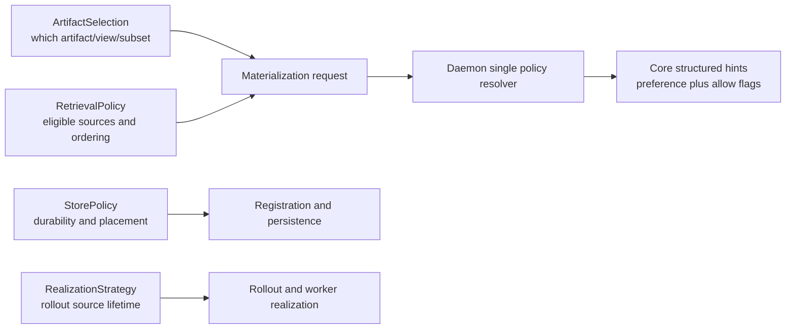

# Summary

Clean up retrieval policy as its own architectural plane.

Current repository state mixes four different concerns:

- `ArtifactSelection` chooses which artifact/view/subset is requested.
- `StorePolicy` chooses durability and placement outcomes after registration.
- retrieval source policy chooses which already-existing source categories are eligible during materialization.
- rollout strategy chooses source-side lifecycle and worker realization behavior.

This design separates those planes, moves retrieval policy to execution scope,
keeps one structured transport contract, and converges replica, target,
mapped-target, and owned-binding flows on the same daemon/core policy model.

The key correction is architectural:

- retrieval policy must not be modeled as artifact-handle identity
- retrieval policy must not reuse the `source_mode` name already used by rollout
- public preset sugar must not be the canonical wire contract

# Problem Statement

The current repository has one real problem expressed in several local forms:
retrieval policy does not have a clean ownership boundary.

## P1. Handle Plane Drift

`FallbackOptions` currently mixes:

- source selection (`prefer`, `allow_p2p`, `allow_disk`)
- replica reuse hint (`replica_uuid`)
- integrity behavior (`verify_checksums`)

and that bundle is carried on `Artifact`, serialized via `Artifact.to_dict()`,
and cloned via `with_fallback(...)`.

This is the wrong plane. Retrieval source choice is execution-time policy, not
artifact identity.

## P2. Transport Duplication

Current daemon requests duplicate the same decision through two channels:

- request-level `preference`
- `source_policy.preference` plus allow flags

The client merges them once, then the daemon merges them again, and binding
flows repeat the same pattern.

## P3. Plane Collisions

The name `source_mode` is already used in `0104` for rollout source lifetime
(`transient` vs `local_steady_state`), which is a different state machine from
retrieval source ordering.

Reusing `source_mode` for retrieval would merge rollout semantics and
materialization semantics under one public name.

## P4. Canonical Form Mismatch

Current core execution already reasons over a structured policy:

- `SourcePreference`
- `allow_p2p`
- `allow_disk`

This structured form is what the orchestrator and ingestion facade actually
consume. Replacing that canonical form with a narrow four-value mode would push
compatibility and internal edge cases into ad hoc side channels.

# Goals / Non-Goals

## Goals

- Define retrieval policy as a distinct architectural plane.
- Keep `ArtifactSelection` as the only selection/identity contract for
  materialization.
- Keep `StorePolicy` as the only durability/placement declaration.
- Keep rollout source lifetime semantics owned by `0104`, not by retrieval APIs.
- Move retrieval policy to execution scope.
- Use one transport policy channel only across:
  - `MaterializeReplica`
  - `MaterializeIntoTarget`
  - `MaterializeIntoMappedTarget`
  - `CreateOwnedBinding`
  - `RefillOwnedBinding`
- Keep the canonical daemon/core policy structured, not preset-shaped.
- Allow a smaller public preset surface without constraining the wire model.

## Non-Goals

- Redefine `ArtifactSelection`.
- Redefine `StorePolicy`.
- Change persistence schema in `schema.sql`.
- Change rollout strategy semantics from `0104`.
- Change transport scheduler design from `0083`.
- Preserve artifact-handle-owned fallback semantics long term.

# Architecture & Interfaces



## Plane Boundaries

Normative rules:

1. `ArtifactSelection` owns artifact/view/subset identity only.
2. `StorePolicy` owns durability and placement outcomes only.
3. Retrieval policy owns source-category eligibility and ordering during
   materialization only.
4. Rollout strategy owns source-side issuance and worker-realization behavior
   only.
5. No public field name may represent more than one of those planes.

## Decision Set

- D1: retrieval policy is execution-scoped, not artifact-handle-scoped.
- D2: public retrieval preset names must not define the wire contract.
- D3: transport requests carry one structured source-policy field only.
- D4: replica, target, mapped-target, and owned-binding flows share one daemon
  normalization path.
- D5: core keeps structured source hints as the canonical execution form.
- D6: artifact-handle serialization must not persist retrieval policy in the
  target state.
- D7: `source_mode` is not used for retrieval public APIs.

## Canonical Retrieval Policy Model

Target-state canonical policy:

```python
class SourcePreference(StrEnum):
    AUTO = "auto"
    PREFER_P2P = "prefer_p2p"
    PREFER_DISK = "prefer_disk"


class RetrievalPolicy(BaseModel):
    preference: SourcePreference = SourcePreference.AUTO
    allow_p2p: bool = True
    allow_disk: bool = True
```

This is the canonical semantic form across SDK normalization, transport, daemon
resolution, and core execution.

Why this form is canonical:

- it matches current engine/orchestrator execution semantics
- it can represent compatibility-only shapes without inventing fake public modes
- it keeps `p2p_only` and `p2p_preferred` representable internally during
  migration

## Public Preset Sugar

Public sugar may be smaller than the canonical form.

Recommended first-class presets:

| Preset | Canonical lowering |
| --- | --- |
| `auto` | `preference=auto`, `allow_p2p=true`, `allow_disk=true` |
| `local_only` | `preference=auto`, `allow_p2p=false`, `allow_disk=false` |
| `disk_first` | `preference=prefer_disk`, `allow_p2p=true`, `allow_disk=true` |
| `disk_only` | `preference=prefer_disk`, `allow_p2p=false`, `allow_disk=true` |

Important rule:

- public presets are convenience syntax only
- transport and core must still normalize to structured `RetrievalPolicy`

Compatibility implication:

- internal and transitional code may still need `p2p_preferred` or `p2p_only`
  shaped policies
- those are represented through the canonical structured form, not through extra
  public preset names

## SDK Surface Target State

Retrieval policy moves to execution-time options.

Recommended target state:

```python
class RetrievalPreset(StrEnum):
    AUTO = "auto"
    LOCAL_ONLY = "local_only"
    DISK_FIRST = "disk_first"
    DISK_ONLY = "disk_only"


class GetArtifactOptions(BaseModel):
    source: RetrievalPolicy | RetrievalPreset | None = None
    replica_uuid: str | None = None
    verify_checksums: bool = True
    enable_verification: bool = True
    wait_for_shared_disk_ms: int = 0
    wait_for_completion: bool = True
    region_backed_mode: RegionBackedMode = RegionBackedMode.AUTO
    pinned_allocation_timeout_ms: int = DEFAULT_PINNED_TIMEOUT_MS
    transport_hold_ms: int | None = None
```

Normative rules:

1. source selection belongs in `GetArtifactOptions` or an execution-scoped
   equivalent, not in `Artifact`.
2. `replica_uuid` reuse hint is execution-scoped.
3. disk verification choice is execution-scoped.
4. `FallbackOptions` is compatibility-only and is removed after migration.
5. string shortcuts such as `fallback="disk"` are compatibility-only and are
   removed after migration.

Store-level defaults:

- if process-wide defaults are retained, they must lower into the same
  execution-scoped retrieval helper
- they must not restore artifact-handle ownership of retrieval policy

## Artifact Handle Contract

Target-state `Artifact` owns:

- artifact identity
- selection identity
- cached metadata useful for selection and materialization

Target-state `Artifact` does not own:

- retrieval source policy
- disk verification preference
- process-local fallback strings

Required cleanup:

- remove `Artifact.with_fallback(...)`
- remove retrieval-policy fields from `Artifact.to_dict()/from_dict()`
- stop treating serialized handle state as a source-policy carrier

## Transport Contract

Target-state daemon transport keeps one field only:

```proto
message SourcePolicy {
  SourcePreference preference = 1;
  optional bool allow_p2p = 2;
  optional bool allow_disk = 3;
}
```

Target-state request rule:

- keep `source_policy`
- remove top-level request `preference`

This applies to:

- `MaterializeReplicaRequest`
- `MaterializeIntoTargetRequest`
- `MaterializeIntoMappedTargetRequest`
- `CreateOwnedBindingRequest`
- `RefillOwnedBindingRequest`

## Daemon And Core Convergence

One daemon normalization path must be shared across:

- replica materialization
- region-backed target materialization
- mapped target materialization
- owned binding create/refill

Normalized output must lower to one core hint shape:

- `SourcePreference`
- `allow_p2p`
- `allow_disk`

No per-RPC alternate state machines are allowed.

## Wait-For-Shared-Disk Contract

`wait_for_shared_disk_ms` is execution policy and remains on
`GetArtifactOptions`.

Normative rule:

- the wait path is valid only when the effective retrieval policy allows disk

The wait path may lower the retry attempt to a stricter disk-only structured
policy, but that retry behavior is an execution detail derived from the
canonical policy, not a second public surface.

# Invariants And Error Model

## Invariants

1. Retrieval requests carry one structured source-policy field only.
2. Retrieval public naming must not reuse rollout `source_mode`.
3. Artifact handles do not own retrieval policy in the target state.
4. Replica/target/mapped-target/owned-binding flows share one daemon
   normalization contract.
5. Core execution consumes structured policy hints only.
6. Public presets, when present, lower losslessly into structured canonical
   retrieval policy.

## Error Model

- `INVALID_ARGUMENT`
  - invalid retrieval preset
  - invalid structured source policy
  - invalid compat combination during migration
- `FAILED_PRECONDITION`
  - no eligible source category is usable in the current environment
- `NOT_FOUND`
  - no eligible source instance exists for a strict policy
- source-specific runtime errors
  - disk or P2P load failure from the selected eligible path

# Naming Compliance

| Proposed symbol | Kind | Required style | Result |
| --- | --- | --- | --- |
| `RetrievalPolicy` | Python/C++ class | `PascalCase` | pass |
| `RetrievalPreset` | Python enum | `PascalCase` | pass |
| `SourcePreference` | Python/proto enum | `PascalCase` | pass |
| `resolve_retrieval_policy_compat` | Python/C++ function | `snake_case` | pass |
| `source` | Python field | `snake_case` | pass |
| `SOURCE_PREFERENCE_PREFER_DISK` | proto constant | `ALL_CAPS` | pass |

# Schema Changes

None. `schema.sql` is unchanged.

# Compatibility And Migration

Migration should be architectural, not cosmetic.

## Stage 1: Introduce Canonical Retrieval Helper

- add one shared normalization helper in SDK
- map legacy `FallbackOptions` and string shortcuts into structured
  `RetrievalPolicy`
- route all SDK materialization call sites through that helper

## Stage 2: Single Transport Channel

- remove request-level `preference`
- keep only `source_policy`
- update daemon materialization and owned-binding flows to consume the same
  normalized contract

## Stage 3: Execution-Scope SDK Migration

- add execution-scoped retrieval policy on `GetArtifactOptions` or equivalent
- move `replica_uuid` and disk verification behavior into execution scope
- keep compatibility adapters from legacy `FallbackOptions`

## Stage 4: Artifact Handle Cleanup

- stop serializing retrieval policy on `Artifact`
- remove `with_fallback(...)`
- remove handle-level retrieval ownership from public docs and tests

## Stage 5: Hard Cut

- remove `FallbackOptions`
- remove fallback string shortcuts
- keep public preset sugar only if it still lowers into the same canonical
  structured policy

# Alternatives And Rationale

Alternative A: keep `0080` and rename fields around a four-value `source_mode`.

- Rejected because it preserves the wrong plane boundary and collides with
  rollout terminology from `0104`.

Alternative B: keep current structured transport but continue owning retrieval
policy on `Artifact`.

- Rejected because retrieval policy remains serialized and identity-adjacent,
  which conflicts with the selection-first direction from `0078`.

Alternative C: collapse everything into `StorePolicy`.

- Rejected because registration durability/placement and retrieval source choice
  are different state machines with different timing and failure semantics.

Chosen approach:

- separate retrieval policy into its own execution-time plane
- keep structured policy canonical
- keep public presets as optional sugar only

# Trade-offs And Risks

- This is a larger doc and migration than the narrower `0080` proposal.
- SDK migration touches public Python surface, serialization, and tests.
- Some callers currently rely on artifact-level fallback cloning and will need
  migration.
- Short-term compatibility logic remains necessary for legacy p2p-shaped inputs.

Mitigations:

- introduce one shared compatibility helper first
- migrate daemon and binding transport before removing SDK adapters
- keep the canonical transport structured so compatibility states do not distort
  the final model

# Acceptance Criteria

1. Retrieval public semantics no longer use the name `source_mode`.
2. Retrieval policy is execution-scoped rather than artifact-handle-scoped.
3. Materialization and owned-binding requests carry only `source_policy`, not a
   second top-level `preference`.
4. Replica, target, mapped-target, and owned-binding flows share one daemon
   normalization path.
5. Core execution continues to consume structured hints
   (`preference` plus `allow_*`) as the canonical form.
6. `Artifact.to_dict()/from_dict()` no longer persists retrieval policy in the
   target state.
7. `FallbackOptions` is removed after migration.

# References

- `docs/designs/0071-managed-shared-disk-persistence.md`
- `docs/designs/0078-selection-first-artifact-retrieval.md`
- `docs/designs/0084-binding-unified-model-and-contract.md`
- `docs/designs/0104-artifact-realization-and-cluster-rollout.md`
- `docs/architecture/api/api-design.md`
- `docs/architecture/api/materialization-flow.md`
- `docs/architecture/api/policy-persistence.md`
