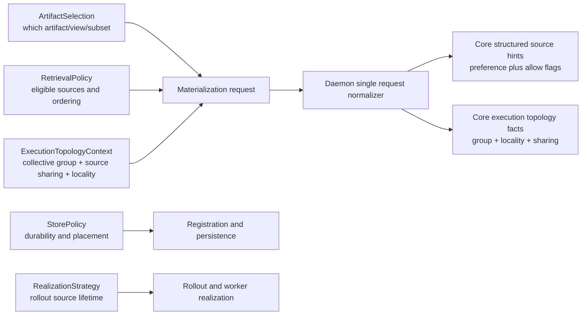

# Summary

Clean up retrieval policy as its own architectural plane.

Implementation status:

- landed as a hard cut rather than a long-lived compatibility migration
- `GetArtifactOptions` owns retrieval policy and execution topology
- `Artifact` no longer owns or serializes retrieval policy
- retrieval-related daemon RPCs carry `source_policy` only
- temporary compatibility helpers (`FallbackOptions`, `with_fallback(...)`,
  top-level request `preference`) are removed from the steady-state SDK surface

Current repository state mixes five different concerns:

- `ArtifactSelection` chooses which artifact/view/subset is requested.
- `StorePolicy` chooses durability and placement outcomes after registration.
- retrieval source policy chooses which already-existing source categories are eligible during materialization.
- execution topology context chooses whether the request carries collective
  group, source-sharing, and locality context for executor selection.
- rollout strategy chooses source-side lifecycle and worker realization behavior.

This design separates those planes, moves retrieval policy to execution scope,
keeps one structured transport contract for retrieval policy, gives topology
context its own explicit boundary, and converges replica, target, mapped-target,
and owned-binding flows on the same daemon/core policy model.

The key correction is architectural:

- retrieval policy must not be modeled as artifact-handle identity
- retrieval policy must not reuse the `source_mode` name already used by rollout
- public preset sugar must not be the canonical wire contract
- retrieval policy must not become the carrier for collective topology or
  shared-filesystem execution context

# Sequencing Note

This design now has two execution slices:

- runtime-critical request normalization:
  - freeze one daemon-side internal request contract that separates retrieval
    policy from execution topology context,
  - remove request-merge drift before strategy planning begins.
- public API and compatibility cleanup:
  - migrate SDK execution options,
  - retire artifact-handle fallback ownership,
  - remove compatibility-only surfaces after migration.

Only the first slice is a hard prerequisite for the remaining `0108`
convergence work and for any default-routing work from `0109`. The later
SDK/public hard cut may continue after the internal normalizer boundary is
stable, but no new collective strategy should become default before the
runtime-critical slice lands.

Compatibility policy:

- TensorCast does not yet have an external production compatibility burden for
  this retrieval-policy surface.
- This landed with the target-state hard cut, so compatibility-only fallback
  ownership and redundant request merge paths are deleted rather than preserved.

Residual execution tracking:

- the retrieval-policy and execution-topology split defined here is already
  landed and remains authoritative;
- downstream strategy-plane, owner-file collective, representation-publication,
  and Step3p5 closeout work is now consolidated under
  `0113-step3p5-closure-and-sot-convergence`;
- the deleted `0108`-series execution notes are no longer active SOT.

# Problem Statement

The current repository has one real problem expressed in several local forms:
retrieval policy does not have a clean ownership boundary.

## P1. Handle Plane Drift

`FallbackOptions` currently mixes:

- source selection (`prefer`, `allow_p2p`, `allow_disk`)
- replica reuse hint (`replica_uuid`)
- integrity behavior (`verify_checksums`)

and that bundle is carried on `Artifact`, serialized via `Artifact.to_dict()`,
and cloned via `with_fallback(...)`.

This is the wrong plane. Retrieval source choice is execution-time policy, not
artifact identity.

## P2. Transport Duplication

Current daemon requests duplicate the same decision through two channels:

- request-level `preference`
- `source_policy.preference` plus allow flags

The client merges them once, then the daemon merges them again, and binding
flows repeat the same pattern.

## P3. Plane Collisions

The name `source_mode` is already used in `0104` for rollout source lifetime
(`transient` vs `local_steady_state`), which is a different state machine from
retrieval source ordering.

Reusing `source_mode` for retrieval would merge rollout semantics and
materialization semantics under one public name.

## P4. Canonical Form Mismatch

Current core execution already reasons over a structured policy:

- `SourcePreference`
- `allow_p2p`
- `allow_disk`

This structured form is what the orchestrator and ingestion facade actually
consume. Replacing that canonical form with a narrow four-value mode would push
compatibility and internal edge cases into ad hoc side channels.

## P5. Topology Context Drift

The current repository already carries collective execution context:

- `collective_load_group`
- shared-disk retry behavior
- integration-owned TP topology decisions

But that context does not belong to retrieval source preference.

If collective group or shared-source hints are treated as retrieval policy, the
system loses an explicit boundary between:

- which source categories are allowed,
- which participants are cooperating,
- and whether the source media is host-local, shared, or unknown.

That boundary is now important because the strategy-plane work from `0108` and
`0109` needs a clean topology/context input for executor choice without
polluting `ArtifactSelection`, `RetrievalPolicy`, or rollout semantics.

# Goals / Non-Goals

## Goals

- Define retrieval policy as a distinct architectural plane.
- Define execution topology context as a distinct execution-scoped plane.
- Keep `ArtifactSelection` as the only selection/identity contract for
  materialization.
- Keep `StorePolicy` as the only durability/placement declaration.
- Keep rollout source lifetime semantics owned by `0104`, not by retrieval APIs.
- Move retrieval policy to execution scope.
- Use one transport policy channel only across:
  - `MaterializeReplica`
  - `MaterializeIntoTarget`
  - `MaterializeIntoMappedTarget`
  - `CreateOwnedBinding`
  - `RefillOwnedBinding`
- Keep the canonical daemon/core policy structured, not preset-shaped.
- Allow a smaller public preset surface without constraining the wire model.
- Keep collective topology, participant group, and source-sharing hints out of
  retrieval policy.

## Non-Goals

- Redefine `ArtifactSelection`.
- Redefine `StorePolicy`.
- Change persistence schema in `schema.sql`.
- Change rollout strategy semantics from `0104`.
- Change transport scheduler design from `0083`.
- Preserve artifact-handle-owned fallback semantics long term.
- Auto-infer collective topology from ambient process state in the generic SDK.

# Architecture & Interfaces



## Plane Boundaries

Normative rules:

1. `ArtifactSelection` owns artifact/view/subset identity only.
2. `StorePolicy` owns durability and placement outcomes only.
3. Retrieval policy owns source-category eligibility and ordering during
   materialization only.
4. Execution topology context owns participant/group, source-sharing, and
   locality context for executor selection only.
5. Rollout strategy owns source-side issuance and worker-realization behavior
   only.
6. No public field name may represent more than one of those planes.

## Decision Set

- D1: retrieval policy is execution-scoped, not artifact-handle-scoped.
- D2: public retrieval preset names must not define the wire contract.
- D3: transport requests carry one structured source-policy field only for
  retrieval policy.
- D4: replica, target, mapped-target, and owned-binding flows share one daemon
  normalization path.
- D5: core keeps structured source hints as the canonical execution form.
- D6: artifact-handle serialization must not persist retrieval policy in the
  target state.
- D7: `source_mode` is not used for retrieval public APIs.
- D8: collective topology and source-sharing context are modeled separately from
  retrieval policy.
- D9: daemon normalization must produce one internal request context with
  retrieval policy and execution topology as separate fields before core
  strategy planning begins.

## Canonical Retrieval Policy Model

Target-state canonical policy:

```python
class SourcePreference(StrEnum):
    AUTO = "auto"
    PREFER_P2P = "prefer_p2p"
    PREFER_DISK = "prefer_disk"


class RetrievalPolicy(BaseModel):
    preference: SourcePreference = SourcePreference.AUTO
    allow_p2p: bool = True
    allow_disk: bool = True
```

This is the canonical semantic form across SDK normalization, transport, daemon
resolution, and core execution.

Why this form is canonical:

- it matches current engine/orchestrator execution semantics
- it can represent compatibility-only shapes without inventing fake public modes
- it keeps `p2p_only` and `p2p_preferred` representable internally during
  migration

## Public Preset Sugar

Public sugar may be smaller than the canonical form.

Recommended first-class presets:

| Preset | Canonical lowering |
| --- | --- |
| `auto` | `preference=auto`, `allow_p2p=true`, `allow_disk=true` |
| `local_only` | `preference=auto`, `allow_p2p=false`, `allow_disk=false` |
| `disk_first` | `preference=prefer_disk`, `allow_p2p=true`, `allow_disk=true` |
| `disk_only` | `preference=prefer_disk`, `allow_p2p=false`, `allow_disk=true` |

Important rule:

- public presets are convenience syntax only
- transport and core must still normalize to structured `RetrievalPolicy`

Compatibility implication:

- internal and transitional code may still need `p2p_preferred` or `p2p_only`
  shaped policies
- those are represented through the canonical structured form, not through extra
  public preset names

## Canonical Execution Topology Context Model

Target-state topology context is distinct from retrieval policy:

```python
class SourceLocalityHint(StrEnum):
    AUTO = "auto"
    HOST_LOCAL = "host_local"
    SHARED_SOURCE = "shared_source"


class ExecutionTopologyContext(BaseModel):
    collective_group: CollectiveLoadGroup | None = None
    source_locality: SourceLocalityHint = SourceLocalityHint.AUTO
    source_sharing_domain: str | None = None
```

This context is intentionally separate because it answers different questions:

- should ranks coordinate,
- do they see the same backing source media,
- and which locality assumptions are safe for the strategy plane to use.

Normative rules:

- topology context is execution-scoped, not artifact-handle-scoped,
- topology context is not part of `RetrievalPolicy`,
- topology context is not part of `ArtifactSelection`,
- generic SDK paths must not infer topology from ambient process state,
- integrations with explicit TP knowledge may synthesize topology context.

## Canonical Daemon Normalization Boundary

The daemon/core boundary needs one internal-only normalized request family:

```cpp
struct NormalizedMaterializationRequestContext {
  RetrievalPolicy retrieval_policy;
  ExecutionTopologyContext execution_topology;
  std::optional<std::string> replica_uuid;
  bool verify_checksums{true};
  int32_t wait_for_shared_disk_ms{0};
};
```

This object is not a new public SDK or proto contract. It is the internal
normalization target that all retrieval-related RPCs must lower into before
materialization orchestration or strategy planning begins.

Normative rules:

- replica, target, mapped-target, and owned-binding RPCs all lower into one
  normalized internal request context,
- legacy request-level `preference` may exist only as compatibility input to the
  normalizer and must not survive as a second canonical field,
- execution topology facts remain separate from retrieval policy inside that
  normalized object,
- executor-private planning hints do not belong in this boundary.

## SDK Surface Target State

Retrieval policy moves to execution-time options.

Recommended target state:

```python
class RetrievalPreset(StrEnum):
    AUTO = "auto"
    LOCAL_ONLY = "local_only"
    DISK_FIRST = "disk_first"
    DISK_ONLY = "disk_only"


class GetArtifactOptions(BaseModel):
    source: RetrievalPolicy | RetrievalPreset | None = None
    execution_topology: ExecutionTopologyContext | None = None
    replica_uuid: str | None = None
    verify_checksums: bool = True
    enable_verification: bool = True
    wait_for_shared_disk_ms: int = 0
    wait_for_completion: bool = True
    region_backed_mode: RegionBackedMode = RegionBackedMode.AUTO
    pinned_allocation_timeout_ms: int = DEFAULT_PINNED_TIMEOUT_MS
    transport_hold_ms: int | None = None
```

Normative rules:

1. source selection belongs in `GetArtifactOptions` or an execution-scoped
   equivalent, not in `Artifact`.
2. execution topology belongs in execution-scoped options, not in `Artifact`.
3. `replica_uuid` reuse hint is execution-scoped.
4. disk verification choice is execution-scoped.
5. `FallbackOptions` is compatibility-only and is removed after migration.
6. string shortcuts such as `fallback="disk"` are compatibility-only and are
   removed after migration.

Store-level defaults:

- if process-wide defaults are retained, they must lower into the same
  execution-scoped retrieval helper
- they must not restore artifact-handle ownership of retrieval policy

## Artifact Handle Contract

Target-state `Artifact` owns:

- artifact identity
- selection identity
- cached metadata useful for selection and materialization

Target-state `Artifact` does not own:

- retrieval source policy
- disk verification preference
- process-local fallback strings

Required cleanup:

- remove `Artifact.with_fallback(...)`
- remove retrieval-policy fields from `Artifact.to_dict()/from_dict()`
- stop treating serialized handle state as a source-policy carrier

## Transport Contract

Target-state daemon transport keeps one field only:

```proto
message SourcePolicy {
  SourcePreference preference = 1;
  optional bool allow_p2p = 2;
  optional bool allow_disk = 3;
}
```

Target-state request rule:

- keep `source_policy`
- keep topology context in a separate field family, currently
  `collective_load_group` where collective execution is supported
- remove top-level request `preference`

This applies to:

- `MaterializeReplicaRequest`
- `MaterializeIntoTargetRequest`
- `MaterializeIntoMappedTargetRequest`
- `CreateOwnedBindingRequest`
- `RefillOwnedBindingRequest`

Normative clarification:

- `collective_load_group` is execution topology context, not retrieval policy,
- future protocol cleanup may normalize topology fields into an explicit
  `ExecutionTopologyContext` message, but the architectural boundary is already
  fixed now.

## Daemon And Core Convergence

One daemon normalization path must be shared across:

- replica materialization
- region-backed target materialization
- mapped target materialization
- owned binding create/refill

Normalized output must lower to one core hint shape:

- `SourcePreference`
- `allow_p2p`
- `allow_disk`

and one separate topology/context shape:

- collective group when present
- locality/source-sharing facts when present

No per-RPC alternate state machines are allowed.

## Wait-For-Shared-Disk Contract

`wait_for_shared_disk_ms` is execution policy and remains on
`GetArtifactOptions`.

Normative rule:

- the wait path is valid only when the effective retrieval policy allows disk

The wait path may lower the retry attempt to a stricter disk-only structured
policy, but that retry behavior is an execution detail derived from the
canonical policy, not a second public surface.

# Invariants And Error Model

## Invariants

1. Retrieval requests carry one structured source-policy field only.
2. Retrieval public naming must not reuse rollout `source_mode`.
3. Artifact handles do not own retrieval policy in the target state.
4. Replica/target/mapped-target/owned-binding flows share one daemon
   normalization contract.
5. Core execution consumes structured policy hints only.
6. Public presets, when present, lower losslessly into structured canonical
   retrieval policy.
7. Collective topology and source-sharing context are never encoded as
   retrieval policy.

## Error Model

- `INVALID_ARGUMENT`
  - invalid retrieval preset
  - invalid structured source policy
  - invalid compat combination during migration
- `FAILED_PRECONDITION`
  - no eligible source category is usable in the current environment
- `NOT_FOUND`
  - no eligible source instance exists for a strict policy
- source-specific runtime errors
  - disk or P2P load failure from the selected eligible path

# Naming Compliance

| Proposed symbol | Kind | Required style | Result |
| --- | --- | --- | --- |
| `RetrievalPolicy` | Python/C++ class | `PascalCase` | pass |
| `RetrievalPreset` | Python enum | `PascalCase` | pass |
| `SourcePreference` | Python/proto enum | `PascalCase` | pass |
| `ExecutionTopologyContext` | Python/C++ class | `PascalCase` | pass |
| `SourceLocalityHint` | Python enum | `PascalCase` | pass |
| `NormalizedMaterializationRequestContext` | C++ struct | `PascalCase` | pass |
| `resolve_retrieval_policy_compat` | Python/C++ function | `snake_case` | pass |
| `resolve_materialization_request_context` | Python/C++ function | `snake_case` | pass |
| `source` | Python field | `snake_case` | pass |
| `execution_topology` | Python field | `snake_case` | pass |
| `SOURCE_PREFERENCE_PREFER_DISK` | proto constant | `ALL_CAPS` | pass |

# Schema Changes

None. `schema.sql` is unchanged.

# Compatibility And Migration

Migration should be architectural, not cosmetic.

## Stage 1: Freeze The Internal Request Normalizer

- add one shared daemon-side normalized request context for retrieval-related
  flows,
- map legacy request `preference`, `source_policy`, and topology hints into that
  internal contract,
- keep executor-private details out of the normalized boundary.

## Stage 2: Single Policy Channel And Separate Topology Context

- remove request-level `preference` from the canonical transport model,
- keep only `source_policy` for retrieval policy,
- keep `collective_load_group` or a successor topology field outside
  `source_policy`,
- make daemon normalization produce separate retrieval-policy and
  execution-topology outputs.

Sequencing rule:

- Stages 1 and 2 are the runtime-critical prerequisite for `0108` convergence
  and for `0109` default-routing work.

## Stage 3: Align Core Consumers To The Normalized Contract

- make orchestrator and ingestion facade consume the normalized contract rather
  than re-deriving it from per-RPC inputs,
- keep wait-for-shared-disk retry behavior derived from canonical retrieval
  policy, not from a second public state machine.

## Stage 4: Execution-Scope SDK Migration

- add execution-scoped retrieval policy on `GetArtifactOptions` or equivalent,
- move `replica_uuid` and disk verification behavior into execution scope,
- complete the public cut without preserving `FallbackOptions` adapters in the
  steady state.

## Stage 5: Artifact Handle Cleanup And Hard Cut

- stop serializing retrieval policy on `Artifact`,
- remove `with_fallback(...)`,
- remove `FallbackOptions` and fallback string shortcuts,
- keep public preset sugar only if it still lowers into the same canonical
  structured policy.

Hard-cut rule:

- when the normalized request boundary and execution-scoped SDK path are proven,
  temporary compatibility helpers, duplicate request fields, and artifact-owned
  fallback state should be deleted rather than preserved behind flags.

## User Migration Guide

This section is the normative migration map for callers that still use the
removed fallback surface.

### Migration Rules

1. Keep `Artifact` handles identity-only. Do not attach retrieval policy to the
   handle.
2. Pass retrieval/source behavior through `GetArtifactOptions(...)` at the
   materialization call site, or set `StoreOptions(get=...)` once for process
   defaults.
3. Use `tensorcast.from_disk(path)` for explicit disk imports. Disk paths are
   not part of retrieval policy anymore.
4. Move `replica_uuid` and `verify_checksums` into `GetArtifactOptions`; they
   are execution-scoped, not fallback-owned.
5. Use structured `RetrievalPolicy(...)` whenever you need `prefer_p2p` or
   explicit allow-flag control. Public presets are only convenience sugar.

### Old To New Surface Map

| Old surface | New surface |
| --- | --- |
| `StoreOptions(fallback="local")` | `StoreOptions(get=GetArtifactOptions(source="local_only"))` |
| `StoreOptions(fallback="disk")` | `StoreOptions(get=GetArtifactOptions(source="disk_first"))` |
| `fallback="local"` on a read call | `options=GetArtifactOptions(source="local_only")` |
| `fallback="disk"` on a read call | `options=GetArtifactOptions(source="disk_first")` |
| `FallbackOptions(prefer="p2p")` | `GetArtifactOptions(source=RetrievalPolicy(preference="prefer_p2p"))` |
| `FallbackOptions(prefer="disk", allow_p2p=False)` | `GetArtifactOptions(source="disk_only")` |
| `FallbackOptions(prefer="local")` | `GetArtifactOptions(source="local_only")` |
| `FallbackOptions.for_disk(path)` or `fallback="disk:/path"` | `handle = tensorcast.from_disk(path)` |
| `Artifact.with_fallback(...)` | keep `Artifact` unchanged; pass `options=...` when calling `tensor_dict(...)`, `tensor_dict_into(...)`, `prefetch(...)`, or set `StoreOptions(get=...)` |
| `Artifact.to_dict()/from_dict()` carrying fallback state | no replacement; retrieval policy is not serialized on handles anymore |

### Copy-Paste Examples

Prefer one-off execution-scoped retrieval policy:

```python
import tensorcast as tc

handle = tc.artifact(key="model:latest")
weights = handle.tensor_dict(
    device="cuda:0",
    options=tc.GetArtifactOptions(source="disk_first"),
)
```

Set a process-wide default for all reads through one `Store`:

```python
import tensorcast as tc

store = tc.store(
    opts=tc.StoreOptions(
        get=tc.GetArtifactOptions(source="local_only"),
    )
)
handle = store.artifact(key="model:latest")
weights = handle.tensor_dict(device="cuda:0")
```

Use structured policy when you need `prefer_p2p` or explicit gating:

```python
import tensorcast as tc

handle = tc.artifact(artifact_id="mi2:...")
weights = handle.tensor_dict(
    device="cuda:0",
    options=tc.GetArtifactOptions(
        source=tc.RetrievalPolicy(
            preference="prefer_p2p",
            allow_p2p=True,
            allow_disk=False,
        ),
        replica_uuid="prefetched-replica-uuid",
        verify_checksums=False,
    ),
)
```

Use explicit disk import instead of path-shaped fallback:

```python
import tensorcast as tc

handle = tc.from_disk("/mnt/models/model_a")
weights = handle.tensor_dict(
    device="cuda:0",
    options=tc.GetArtifactOptions(source="disk_first"),
)
```

# Alternatives And Rationale

Alternative A: keep `0080` and rename fields around a four-value `source_mode`.

- Rejected because it preserves the wrong plane boundary and collides with
  rollout terminology from `0104`.

Alternative B: keep current structured transport but continue owning retrieval
policy on `Artifact`.

- Rejected because retrieval policy remains serialized and identity-adjacent,
  which conflicts with the selection-first direction from `0078`.

Alternative C: collapse everything into `StorePolicy`.

- Rejected because registration durability/placement and retrieval source choice
  are different state machines with different timing and failure semantics.

Chosen approach:

- separate retrieval policy into its own execution-time plane
- keep structured policy canonical
- keep public presets as optional sugar only

# Trade-offs And Risks

- This is a larger doc and migration than the narrower `0080` proposal.
- SDK migration touches public Python surface, serialization, and tests.
- Some callers currently rely on artifact-level fallback cloning and will need
  migration.
- Short-term compatibility logic may remain necessary for legacy p2p-shaped
  inputs during ordered migration only.

Mitigations:

- introduce one shared compatibility helper first
- migrate daemon and binding transport before removing SDK adapters
- keep the canonical transport structured so compatibility states do not distort
  the final model
- delete compatibility helpers and duplicate fallback ownership in the hard-cut
  phase instead of preserving them as stable abstraction layers

# Acceptance Criteria

1. Retrieval public semantics no longer use the name `source_mode`.
2. Retrieval policy is execution-scoped rather than artifact-handle-scoped.
3. Collective topology context is execution-scoped and is not modeled as
   retrieval policy.
4. Materialization and owned-binding requests carry only `source_policy` for
   retrieval policy, not a second top-level `preference`.
5. Replica, target, mapped-target, and owned-binding flows share one daemon
   normalization path.
6. Core execution continues to consume structured hints
   (`preference` plus `allow_*`) as the canonical form.
7. `Artifact.to_dict()/from_dict()` no longer persists retrieval policy in the
   target state.
8. `FallbackOptions` is removed after migration.
9. Compatibility-only request merge paths and artifact-owned fallback helpers do
   not survive as steady-state architecture.

# References

- `docs/designs/0071-managed-shared-disk-persistence.md`
- `docs/designs/0078-selection-first-artifact-retrieval.md`
- `docs/designs/0084-binding-unified-model-and-contract.md`
- `docs/designs/0108-tensor-aware-materialization-strategy-plane.md`
- `docs/designs/0109-batched-owner-file-collective-executor.md`
- `docs/designs/0113-step3p5-closure-and-sot-convergence.md`
- `docs/plans/0114-collective-first-binding-realization-for-tp-serving-startup.md`
- `docs/designs/0104-artifact-realization-and-cluster-rollout.md`
- `docs/architecture/api/api-design.md`
- `docs/architecture/api/materialization-flow.md`
- `docs/architecture/api/policy-persistence.md`
