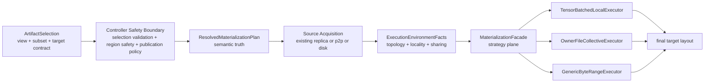

# Summary

Introduce a tensor-aware materialization strategy plane as one layer inside a
long-term, selection-first materialization architecture.

The final model is:

- `ArtifactSelection` remains the only public selection contract.
- `tensor_dict`, `materialize_view`, `bind_into`, and
  `MaterializeIntoMappedTarget` keep the same public API shapes.
- semantic truth remains separate from execution strategy:
  - resolved selection and view identity,
  - resolved representation-transform contract,
  - target layout and verification or publication requirements.
- source acquisition remains separate from execution strategy:
  - existing replica or local alias,
  - P2P transport,
  - disk or local file source.
- execution environment facts remain separate from both semantic truth and
  retrieval policy:
  - collective group or topology context,
  - source locality and source-sharing domain,
  - planner cache and budget-relevant capabilities.
- `MaterializationFacade` becomes the lowering boundary from resolved semantic
  truth plus acquired source capabilities into executor strategy for ordinary
  replica loads, target-backed materialization, and mapped-target flows.
- common runtime lowers into one shared `ExecutionStrategyPlan` before executor
  choice.
- one request may use mixed execution:
  - tensor-aware local ops,
  - owner-file collective ops,
  - residual generic byte-range fallback ops.
- `ByteRangeMap` remains the canonical fallback IR and residual explainability
  surface, but no longer acts as the mandatory primary IR for all retrievals.
- executor-private planning artifacts do not become SDK, proto, or generic
  `MaterializeHints` contract.

This design is driven by actual loader experiments on the Step3p5 weight set
and exists to close the remaining host-local gap against `fastsafetensors`
while preserving TensorCast's selection-first, artifact-first, and
binding-aware architecture.

# Plan Ownership

This design remains the authoritative architectural record for the strategy
plane, but execution is now intentionally split:

- `docs/plans/0108-tensor-aware-materialization-strategy-plane.md` records the
  already-landed mapped-target, semantic-contract, and typed-config extraction
  work.
- `docs/plans/0107-retrieval-policy-plane-cleanup.md` owns the request
  normalization prerequisite that separates retrieval policy from execution
  topology context.
- `docs/plans/0108-01-pre-109-strategy-plane-convergence.md` is the active
  convergence plan for remaining ordinary-replica strategy ownership,
  coordinator seams, typed budgets, and diagnostics.
- `docs/plans/0109-batched-owner-file-collective-executor.md` starts only after
  those prerequisites are complete and adds a new executor on top of the stable
  strategy-plane boundary.

# Implementation Status

Partially implemented in this repository:

- core-owned internal strategy-plane contracts now live in
  `core/store/runtime/ingestion/materialization_strategy_types.h`:
  - `ResolvedMaterializationPlan`
  - `RepresentationTransformContract`
  - `RepresentationWorkPlan`
  - `ResolvedSourceBinding`
  - `ExecutionCommitReport`
- ordinary `materialize_replica` disk startup still chooses collective,
  local-batched, and generic execution primarily through replica-layer wiring in
  `core/store/replica/replica.cc` and
  `core/store/replica/replica_load_controller.cc`; full common-runtime
  convergence is not complete yet.
- mapped-target controller lowering now builds the internal resolved plan and
  passes it directly into the common runtime as the authoritative semantic
  contract, with the runtime validating request hints against that plan instead
  of accepting duplicate semantic inputs.
- source-bound binding startup/refill and ordinary `into_target` lowering now
  reuse the same semantic-core family instead of carrying a separate
  mapped-only builder path.
- typed rollout config now lives under
  `engine.materialization_strategy` in
  `proto/tensorcast/config/v1/daemon_config.proto` and is mapped into
  `StoreEngineOptions::MaterializationStrategyConfig`.
- env-gated mapped/local-batched/owner-file strategy toggles have been removed
  from the common runtime and replica hot paths.
- partial `engine.materialization_strategy` config now preserves the documented
  0108 defaults instead of silently disabling local batched disk load.
- the common-runtime mapped-target path currently lands:
  - source acquisition selection,
  - shared `RepresentationWorkPlan` derivation,
  - owner-file collective handoff,
  - residual generic byte-range fallback.
- ordinary replica local-batched and collective executors now consume shared
  work-plan items instead of recovering semantic truth in executor-local code.
- the current owner-file collective implementation still lives as a replica-side
  prototype with eager `owned_payload` preload and optional root whole-source
  preload, so it does not yet satisfy the long-term strategy-plane memory model.
- ordinary non-collective `into_target` still executes through the generic
  byte-range backend after shared lowering.
- `ExecutionCommitReport` currently exists mostly as a mapped-target reporting
  surface and does not yet express batch-level commit/failure semantics for all
  ordinary disk startup executors.
- public SDK retrieval APIs remain unchanged.

Remaining follow-up work after this implementation is operational validation on
the Step3p5 benchmark, full vLLM serving matrix described in the companion
plan, and landing the common-runtime local tensor-aware executor that fully
reabsorbs the remaining replica-side prototype behavior.

Normative sequencing rule:

- no owner-file collective executor may become the default `AUTO` choice until
  request normalization, execution-environment facts, ordinary replica strategy
  ownership, and typed cost-model policy have all converged on the common
  runtime boundary.

# Problem Statement

Current TensorCast runtime is too eager to lower selection-aware retrieval into
generic byte-range execution. This loses tensor semantics early and leaves
performance on the table for local-disk model loading.

Observed behavior on the current Step3p5 workload:

- Exact `879` source-tensor workload on host-local SSD, current TensorCast
  common collective path: about `47s` wall at TP=8.
- The same exact `879` workload in the benchmark's batched-optimal
  tensor-aware model: about `7.2s` average ready time, `8.4s` makespan.
- Exact `879` single-rank TensorCast common path: about `7.1s`, already near
  `fastsafetensors` exact subset at about `7.5s`.
- Exact `614` sliced tensors on host-local SSD:
  - TensorCast non-collective exact subset is about `10.0s`.
  - `fastsafetensors` exact subset is about `8.7s`.
- Real target-layout subset experiments show:
  - materialization dominates,
  - copy-plan apply is only a few milliseconds,
  - current common path still hits `disk_fallback -> ByteRangeMappedSource ->
    pump_ranges`, meaning late replica-layer hooks do not intercept the real
    hot path.

These results imply:

- TensorCast's single-rank data plane is not the limiting factor.
- The largest host-local gap comes from common-path execution shape:
  - repeated disk or view materialization across ranks,
  - early lowering to generic byte-range form,
  - loss of tensor-aware opportunities such as direct writes, staged 2D pack,
    and deduplicated source reads.

There is a second structural issue for mapped-target paths:

- current controller-side `build_copy_plan(...)` already captures important
  copy-contract semantics,
- but common runtime still receives executor-shaped hints through
  `MaterializeHints`,
- while replica-layer and runtime env-gated prototypes each own different parts
  of the hot path.

There is a third structural issue for ordinary replica startup:

- the long-term design says strategy selection belongs in common runtime,
- but current `GPU <- DISK` ordinary startup still makes key executor choices
  inside replica-layer `collective -> local_batched -> generic` branches,
- and the current owner-file prototype remains embedded in
  `collective_disk_loader.cc` rather than consuming a shared strategy-plan IR.

This makes the project inconsistent with its broader architecture:

- `0078` requires one selection contract,
- `0084` separates binding plane from artifact plane,
- `0087` separates `ArtifactSelection` from copy contract and placement,
- `0004` requires typed runtime config instead of ambient env switches.

# Goals / Non-Goals

## Goals

- Keep `ArtifactSelection` as the only public selection contract.
- Keep `tensor_dict`, `materialize_view`, `bind_into`, and mapped-target APIs
  unchanged.
- Move execution strategy selection into the common runtime before irreversible
  generic byte-range lowering.
- Preserve TensorCast's selection identity, view identity, artifact-first
  semantics, and binding or target safety boundaries.
- Keep semantic truth separate from:
  - source acquisition,
  - executor lowering,
  - execution topology context,
  - rollout policy,
  - publication side effects.
- Converge ordinary replica GPU<-DISK startup and target materialization onto
  the same strategy-plane architecture.
- Make executor choice depend on explicit execution environment facts and typed
  cost-model policy rather than replica-layer branch order or ambient state.
- Reach host-local performance at or below `fastsafetensors` for the same
  end-to-end workload, while preserving current JFS advantages.
- Make the optimization reusable across TensorDict, region-backed materialize,
  binding-backed loads, and mapped-target flows.
- Retain one generic fallback path with byte-exact semantics.
- Converge rollout controls onto typed runtime config consistent with `0004`.

## Non-Goals

- Add framework-specific special cases in vLLM.
- Introduce model-name or tensor-name hardcoding into runtime strategy
  selection.
- Collapse source acquisition and execution strategy into one opaque planner.
- Treat topology/group context as semantic truth or retrieval policy.
- Remove `ByteRangeMap`, `ByteRangeProgram`, or `ByteRangeMappedSource`.
- Redefine selection identity, `view_id`, `view_subset_hash`,
  `selection_hash`, or `logical_layout_hash`.
- Change Global Store persistence, routing semantics, or binding-plane
  authority.
- Permit remote daemons to write directly into caller-owned CUDA regions.

# Current State

## Current layering

Current retrieval and materialization flows already have strong semantic
boundaries, but implementation ownership is split across the wrong layers.

The relevant path today is:

1. SDK and daemon build one `ArtifactSelection`.
2. daemon controller code resolves view identity, selected index bytes,
   target layout, and mapped-target copy plan shape.
3. common runtime often lowers too early into `ByteRangeMap`,
   `ByteRangeCompiler`, and `ByteRangeMappedSource`.
4. late runtime or replica-layer helpers then try to recover tensor-aware or
   owner-file opportunities.
5. ordinary replica startup still performs final executor selection in
   replica-layer code after common-runtime lowering has already split.

Important current sites:

- selection-first and target-layout resolution:
  - `daemon/service/controllers/materialization_target_plan_utils.cc`
- representation-transform shaping:
  - `daemon/service/controllers/representation_transform_builder.cc`
- source acquisition for replica materialization:
  - `core/store/runtime/ingestion/materialization_service.cc`
- generic lowering and mapped-target execution:
  - `core/store/runtime/ingestion/materialization_facade.cc`
- late prototype collective and local-batched paths:
  - `core/store/replica/collective_disk_loader.cc`
- ordinary replica branch ordering and fallback:
  - `core/store/replica/replica.cc`
  - `core/store/replica/replica_load_controller.cc`

## Why the current shape is insufficient

`ByteRangeMap` is the correct canonical fallback IR, but it does not preserve
enough high-level information to choose the most efficient data path for common
weight-loading cases. In particular it does not naturally express:

- tensor boundaries,
- contiguous dim0 slices,
- staged 2D dim1 pack opportunities,
- repeated-source dedup opportunities,
- owner-file or owner-segment collective ownership,
- direct-write-to-final-layout opportunities as first-class plan items.

The ordinary replica path has a parallel problem:

- shared `RepresentationWorkPlan` lowering already exists,
- but the final strategy decision still depends on replica-layer branch order,
- so cost-model-driven `AUTO` selection cannot yet evaluate all executors from
  one shared planning boundary.

The mapped-target prototype has a second issue:

- current `BuildCopyPlanResult` usefully captures copy-contract truth and
  compatibility analysis in one place,
- but it also mixes semantic information with executor-candidate artifacts such
  as tensor-job and concat-job compatibility,
- and those executor artifacts are then serialized through generic
  `MaterializeHints`.

By the time requests reach replica or load-controller hooks, the runtime has
already committed to a generic execution path or to a prototype-specific hint
shape.

# Architecture & Interfaces

## 1. Long-term layered model

TensorCast should make the following layers explicit.

### 1.1 Controller safety boundary

The daemon controller layer remains authoritative for:

- request validation,
- selection parsing and response shaping,
- caller-owned region safety,
- capability-token and publication-token policy,
- target poison or retire semantics,
- local-only enforcement for external targets.

Normative rule:

- strategy-plane work must not move external-target safety, publication-token
  minting, or region-poison semantics out of controller-owned boundaries.

### 1.2 Semantic resolution plane

The runtime must consume one resolved semantic plan before strategy selection.

Introduce one core-owned internal semantic plan family:

- `ResolvedMaterializationPlan`

This is an internal core/runtime construct. It is not a public SDK or proto
contract.

`ResolvedMaterializationPlan` carries semantic truth only:

- resolved `ArtifactSelection`,
- resolved `view_id`,
- optional `ViewPlan`,
- selected index bytes,
- target placement contract,
- copy contract,
- verification and publication requirements that affect correctness.

Normative rules:

- semantic truth remains separate from executor choice,
- semantic truth remains separate from source acquisition,
- semantic truth remains separate from rollout policy.

## 2. Representation-transform boundary

This design aligns with `0087`, which treats transform semantics as distinct
from selection and placement.

### 2.1 Canonical or view into-target

For `MaterializeIntoTarget`, the semantic contract may be trivial:

- resolved selected ByteSpace,
- coalesced `IntoTargetLayout`,
- exact destination coverage.

### 2.2 Mapped-target

For `MaterializeIntoMappedTarget`, the semantic contract must preserve more than
flat target storage spans.

- `RepresentationTransformContract`

The long-term semantic family must preserve:

- source and destination tensor specs,
- range and dim semantics,
- view-narrow context when applicable,
- exact destination coverage,
- canonical residual fallback coverage.

Normative rules:

- flattening mapped-target requests to `IntoTargetLayout` alone is insufficient,
- mapped-target semantic truth must stay richer than executor hints,
- executor-private tensor or concat candidate jobs must not be the long-term
  shared runtime contract.

Required migration interpretation:

- current daemon `TargetMaterializationPlan` and
  `MappedTargetMaterializationPlan` are useful prototypes of semantic
  resolution,
- current `BuildCopyPlanResult` is a useful prototype but mixes two concerns:
  - semantic transform contract,
  - executor compatibility analysis,
- long term, normalized representation-transform semantics belong in a
  core-owned internal contract library, while executor compatibility analysis
  belongs in the strategy plane.

Phase boundary rule:

- physical topology, participant assignment, communicator routing, and
  topology-scoped reshard execution remain follow-on work above this semantic
  seam rather than part of the first `0108` convergence wave.

## 3. Source acquisition plane

Source acquisition remains a distinct phase.

Introduce one internal runtime source-binding concept:

- `ResolvedSourceBinding`

`ResolvedSourceBinding` represents an acquired source and its capabilities:

- local existing replica or alias,
- P2P transport,
- disk or local file source,
- source-layout availability,
- direct-write capability,
- verification facts already attached to the source.

Normative rules:

- source acquisition must happen before execution strategy lowering,
- source acquisition must not depend on tensor-name heuristics alone,
- `MaterializationService` remains the owner of the existing source-acquisition
  chain for replica materialization,
- short term, `MaterializationFacade` may still own some source-acquisition
  mechanics for into-target flows, but the architecture must make the boundary
  explicit.

Required interpretation:

- selection and copy contract describe what bytes are needed,
- source acquisition describes where those bytes will come from,
- strategy selection describes how those bytes will be moved and packed.

### 3.1 Execution environment facts

Introduce one internal runtime context family:

- `ExecutionEnvironmentFacts`

`ExecutionEnvironmentFacts` captures executor-relevant context that is neither
semantic truth nor retrieval policy:

- collective group or equivalent topology context when present,
- whether the source media is host-local, shared-source, or unknown,
- source-sharing domain or dedup domain when known,
- planner-cache and budget-relevant capabilities,
- coordinator availability and executor-specific memory budgets.

Normative rules:

- execution environment facts are derived after request normalization and source
  acquisition,
- execution environment facts must not modify selection identity or copy truth,
- execution environment facts are separate from `RetrievalPolicy` as described
  by `0107`,
- `AUTO` executor choice must consume explicit environment facts rather than
  ambient process state.

## 4. Strategy plane placement

The strategy plane lives in `MaterializationFacade`, not in client code and not
in late replica-layer helpers.

`MaterializationFacade` owns lowering from:

- `ResolvedMaterializationPlan`,
- `ResolvedSourceBinding`,
- `ExecutionEnvironmentFacts`,
- typed rollout policy,

into one internal executor-lowered family:

- `ExecutionStrategyPlan`

Normative rule:

- strategy selection must happen before the request is irreversibly lowered into
  generic `ByteRangeMap` / `ByteRangeMappedSource` execution for all ranges.

Required convergence rule:

- ordinary `materialize_replica` GPU<-DISK startup, `MaterializeIntoTarget`,
  and `MaterializeIntoMappedTarget` must all reach the same strategy-plane
  boundary before executor choice,
- current replica-layer `collective -> local_batched -> generic` ordering is
  temporary migration scaffolding, not the long-term owner of `AUTO`
  selection.

### 4.1 Cost model and plan cache

`AUTO` strategy choice must be an explicit cost-model decision, not executor
trial order.

The planner may estimate at least:

- requested source bytes,
- unique source bytes after dedup,
- dim1 or staging amplification,
- peer-transfer bytes,
- owner skew or per-rank load skew,
- planner overhead and batch count,
- peak temporary memory for each candidate.

Normative rules:

- typed config may influence thresholds, budgets, and preference ordering,
- cost-model policy may change executor candidacy but must not change semantic
  truth,
- strategy planning may use cacheable derived state keyed by semantic identity
  plus execution environment facts,
- planner cache is an optimization only; cache miss must not change semantics.

## 5. Execution model

### 5.1 Mixed execution is allowed, but it must be explicit

This design rejects the assumption that every request must choose exactly one
executor for all bytes.

One request may use mixed execution:

- tensor-aware local execution for ranges proven safe,
- owner-file collective execution for ranges where cross-rank source ownership
  wins,
- residual generic byte-range execution for all remaining ranges.

This is the preferred long-term model because it preserves correctness while
allowing near-optimal execution on irregular workloads.

Current phase rule:

- mixed execution is only valid when the strategy plane emits explicit generic
  fallback ops or residual accounting before execution begins,
- executors must not partially execute a request and then implicitly reconstruct
  the remaining generic fallback ranges at runtime,
- if a current executor cannot consume a request without such implicit widening,
  that executor is not eligible for that request.

### 5.2 Internal execution ops

`ExecutionStrategyPlan` contains typed execution ops:

- `DirectReadOp`
  - read one contiguous source span directly into final target layout.
- `Staged2DPackOp`
  - read a contiguous row-block into staging, then GPU-pack into final layout.
- `DedupCopyOp`
  - reuse one already-read source slice and duplicate into other destinations.
- `CollectiveScatterOp`
  - assign source ownership and scatter to peers when cross-rank dedup is
    beneficial.
- `FallbackByteRangeOp`
  - represent the residual ranges that must still use generic byte-range
    execution.

The common runtime may still expose dominant executor labels for diagnostics:

- `TensorBatchedLocalExecutor`
- `OwnerFileCollectiveExecutor`
- `GenericByteRangeExecutor`

But those labels are diagnostic summaries, not an architectural requirement that
all bytes in a request use only one executor.

A future topology-scoped or group-reshard executor may later be added to this
family, but it must still consume the same normalized semantic contract rather
than recreate a second semantic stack.

## 6. Single semantic truth and residual coverage

The strategy plane introduces new internal contracts, but it does not introduce
a second semantic truth.

Normative rules:

- `ArtifactSelection`, resolved `view_id`, resolved `ViewPlan`, resolved copy
  contract, and final target layout remain the only semantic truth for what
  bytes must appear in the destination.
- executor plans are derived artifacts. They do not replace the resolved
  selection or copy-contract truth.
- every execution strategy plan must carry explicit residual accounting:
  - which destination byte ranges are proven equivalent and assigned to a
    non-generic op,
  - which destination byte ranges remain residual and must be executed via
    `FallbackByteRangeOp`.
- the planner may exclude a byte range from generic fallback only if it has
  emitted a semantically equivalent internal op for that range.
- the runtime may mark a byte range as completed only after the chosen executor
  has successfully committed that range.

Introduce one internal reporting contract:

- `ExecutionCommitReport`

`ExecutionCommitReport` exists to report:

- committed ranges,
- residual fallback ranges,
- executor path actually used,
- explicit fallback work chosen during planning.

Commit semantics must also be explicit:

- each non-generic executor must define its commit unit,
- a commit unit is complete only when all destination bytes in that unit are
  visible and semantically equivalent to the resolved request,
- temporary staging lifetime must extend until commit of the covered unit,
- failed units remain uncommitted and must follow explicit retry, poison, or
  fallback policy.

Required interpretation:

- feature gating or rollout gating may change executor candidacy,
- feature gating may not change requested byte semantics,
- disabling one executor path must only increase explicitly planned fallback
  work, never suppress required bytes,
- runtime execution must not invent new fallback ranges that were not already
  present in the emitted execution plan.

### 6.1 Coordinator boundary

Group assembly, clique lifecycle, and participant synchronization are part of a
shared runtime coordination boundary, not executor-private semantic truth.

Normative rules:

- executor planning may depend on coordinator capabilities,
- coordinator state must not redefine what bytes are required,
- group timeout and fail-open or fail-closed behavior must be typed policy, not
  hard-coded runtime folklore,
- future owner-file collective and topology-scoped reshard executors should
  reuse one coordination surface rather than open-coding their own group state
  machines.

## 7. Relationship to `ByteRangeMap`

`ByteRangeMap` remains part of the architecture, but its role changes:

- it remains the canonical generic fallback IR,
- it remains the verification and explainability surface for residual ranges,
- it remains the execution IR for rare or irregular cases,
- it remains the canonical fallback for mapped-target residual coverage,
- it is no longer the mandatory primary IR for every common weight-loading
  request.

This is consistent with `docs/internals/byte-range-mapping-and-execution.md`,
which already defines `ByteRangeMap` as a generic byte-level IR rather than the
only possible planning abstraction.

## 8. Relationship to current staged mapped-target fast path

This design rejects the experimental boundary shape where controller-derived
tensor jobs or concat jobs are propagated through generic runtime hints and
consumed by one backend-specific executor.

That experimental shape has three structural problems:

- it makes backend-specific execution jobs look like shared request truth,
- it loses the richer mapped-target copy-contract semantics needed for long-term
  reuse,
- it encourages coverage subtraction at the wrong layer, which can make rollout
  or debug switches accidentally suppress fallback bytes.

Normative rules:

- executor-private plan items must not be serialized into SDK-visible or
  daemon-wire-visible request contracts,
- generic runtime contracts such as `MaterializeHints` must carry source,
  placement, transport, verification, and policy facts, not executor-lowered
  tensor jobs,
- mapped-target controller code may still validate copy-plan coverage and
  normalize request-local facts,
- but long-term mapped copy-contract truth must move into core-owned internal
  contracts,
- tensor-aware lowering must happen in the strategy plane inside
  `MaterializationFacade`.

## 9. Public API and safety invariants

The following public invariants remain unchanged:

- `ArtifactSelection` is still the only selection envelope.
- `view_id`, `view_subset_hash`, `selection_hash`, and
  `logical_layout_hash` semantics do not change.
- `tensor_dict`, `materialize_view`, `bind_into`, and
  `MaterializeIntoMappedTarget` retain their current public API shapes.
- planner and executor selection are daemon or runtime-owned and are not
  exposed to the caller.

### 9.1 External-target and binding safety

The following safety invariants remain mandatory:

- caller-owned CUDA regions remain a local external-target boundary,
- remote or home daemons never write directly into caller-owned CUDA regions,
- `DataLoss` during target materialization continues to poison the target
  region,
- `target_publication_token` may be minted only after local target write
  success and any configured verification gate has passed,
- binding-plane authority and assembly-plane promotion semantics from `0084`
  and `0087` do not change.

## 10. Runtime configuration and rollout controls

Runtime adoption still needs rollout controls, but those controls must follow
the repository's unified configuration direction from `0004`.

Normative rules:

- production strategy-plane controls must use typed runtime configuration and
  explicit policy fields, not ad-hoc environment variables,
- benchmark binaries may expose ad-hoc experimental toggles locally, but common
  daemon or runtime process behavior must not depend on ambient environment for
  semantic decisions,
- rollout controls may gate executor eligibility, diagnostics verbosity, and
  default preference ordering, budgets, and topology-related thresholds,
- rollout controls must not alter selection identity, copy-contract semantics,
  target-layout semantics, or residual fallback correctness.

Recommended configuration direction:

- extend `tensorcast.config.v1.DaemonConfig.engine` with one typed strategy
  subsection, for example `MaterializationStrategy`,
- keep executor enablement, mixed-execution policy, diagnostics verbosity,
  owner-collective policy, and cost-model budgets under that typed config,
- remove common-runtime dependency on ambient env switches once the typed
  controls exist.

## 11. Observability

The strategy plane must integrate with the existing runtime observability model
rather than invent a second ad-hoc logging channel.

Required diagnostics:

- resolved selection and copy-contract summary,
- acquired source kind and source-layout facts,
- execution environment facts and topology/locality summary,
- dominant executor label,
- op mix,
- residual fallback bytes,
- committed bytes by executor,
- reason for widened fallback.

Normative rule:

- strategy-plane observability should reuse existing ingestion and target
  materialization event surfaces wherever possible, with additional structured
  decision fields rather than parallel bespoke logs.

## 12. Naming Compliance

This design introduces internal interfaces only. The proposed names follow the
repository style rules.

- Classes or structs:
  - `ResolvedMaterializationPlan`
  - `RepresentationDescriptor`
  - `RepresentationTensorBinding`
  - `RepresentationTransformContract`
  - `ResolvedSourceBinding`
  - `ExecutionEnvironmentFacts`
  - `ExecutionStrategyPlan`
  - `ExecutionCommitReport`
  - `TensorBatchedLocalExecutor`
  - `OwnerFileCollectiveExecutor`
  - `GenericByteRangeExecutor`
  - `MaterializationStrategy`
- Functions or methods:
  - `build_resolved_materialization_plan`
  - `build_representation_transform_contract`
  - `acquire_resolved_source_binding`
  - `build_execution_environment_facts`
  - `build_execution_strategy_plan`
  - `estimate_execution_strategy_cost`
  - `emit_execution_commit_report`
  - `execute_owner_file_collective`
- Config fields:
  - `enable_local_tensor_execution`
  - `enable_owner_file_collective`
  - `allow_mixed_execution`
  - `diagnostics_verbosity`

## 13. Migration Constraints

The first implementation wave should treat the current mapped-target fast-path
and replica-layer execution hooks as prototypes to be reabsorbed, not as the
permanent interface.

Required migration order:

1. define core-owned internal semantic contracts,
2. replace mapped-target prototype copy-contract naming with normalized
   representation-transform semantics,
3. split executor compatibility analysis out of the shared semantic contract,
4. make source-acquisition inputs explicit,
5. introduce `ExecutionEnvironmentFacts` as a separate strategy input,
6. converge ordinary replica executor choice into `MaterializationFacade`,
7. add strategy-plane lowering in `MaterializationFacade`,
8. keep `ByteRangeMap` fallback exact and always available,
9. re-express current useful fast-path ideas as internal executor behavior,
10. remove executor-private request hints from shared runtime contracts,
11. defer topology-scoped participant execution to a follow-on design until the
   semantic core is authoritative.

### 13.1 Mapped-target specific rules

- controller keeps request validation, region safety, capability handling, and
  target-publication policy,
- core-owned semantic contracts carry mapped-target copy-contract truth,
- strategy plane derives tensor-aware execution from resolved metadata, copy
  contract, and source capabilities,
- generic fallback remains explainable in terms of canonical residual lowering.

### 13.2 Hard-cut cleanup policy

TensorCast does not yet have a production compatibility burden for these
experiments. Therefore `0108` should end in cleanup, not in permanent
coexistence.

Normative rules:

- late-hook and prototype execution paths are temporary migration scaffolding,
  not long-term architecture,
- once the strategy plane is authoritative for a workload family, the old
  prototype path for that family should be removed rather than kept behind
  compatibility switches,
- ambient env toggles used only to preserve prototype coexistence must be
  removed from common runtime code after the new path is proven.

Required cleanup sequence:

1. retire replica-layer local-batched late hooks once equivalent behavior exists
   in the strategy plane,
2. retire naive owner-file preload prototypes once owner-file collective is
   represented as a real planner plus executor path,
3. retire root whole-source preload and eager `owned_payload` preload from the
   default collective candidate set once batched owner execution exists,
4. retire mapped fast-path env policy switches after mapped-target lowering is
   reabsorbed into common runtime planning,
5. converge any remaining generic fallback execution overrides only after the
   new strategy plane has replaced prototype coexistence,
6. remove executor-shaped fields from `MaterializeHints` once core-owned
   semantic contracts are authoritative.

# Trade-offs & Risks

## Benefits

- Preserves TensorCast's artifact-first, selection-first, and binding-aware
  abstractions.
- Makes tensor-aware execution reusable across retrieval surfaces.
- Aligns with `0087` copy-contract semantics instead of creating a parallel
  planner object model.
- Avoids framework-local patches.
- Enables a principled path to match or exceed `fastsafetensors` on host-local
  block devices while preserving existing JFS wins.

## Costs

- Introduces new internal contract boundaries.
- Requires moving some semantic contracts out of daemon-controller ownership and
  into core-owned internal modules.
- Requires careful equivalence validation against the generic path.
- Requires runtime diagnostics that distinguish semantic resolution, source
  acquisition, planner choice, and executor performance.

## Risks

- planner may be integrated too late and fail to intercept the real hot path,
- contract extraction may stop halfway and leave semantic truth split across
  daemon utilities and runtime hints,
- collective ownership may reduce read bytes but still lose on end-to-end
  latency if it overuses staging or synchronization,
- planner complexity could creep into model-specific heuristics if naming or
  shape shortcuts are allowed,
- external-target safety could regress if collective execution is allowed to
  bypass local-daemon write boundaries.

Mitigations:

- planner must be expressed purely in terms of metadata, normalized
  representation-transform semantics, and source facts, not model names,
- semantic contract extraction must precede hint cleanup,
- planner must emit explicit fallback ops for anything not proven safe,
- executor coverage reporting must be derived from actual committed plan items,
  not from feature-flag intent,
- all new executors must be benchmarked against the current common path and
  `fastsafetensors` on exact workloads before becoming default,
- external-target regressions must be covered with explicit local-only, poison,
  and publication-token tests.

# Compatibility & Acceptance Criteria

## Compatibility

- No persistence or Global Store schema changes.
- Public retrieval and target-materialization APIs do not change.
- Selection identity semantics do not change.
- Existing generic materialization remains the correctness fallback.
- A runtime config proto extension is expected for typed rollout policy.

## Acceptance Criteria

- Correctness:
  - tensor-aware execution produces byte-identical outputs to the current
    generic path on exact trace workloads and real target-layout subsets,
  - disabling any one executor or rollout control leaves byte-correct residual
    fallback coverage intact,
  - one request may mix tensor-aware and generic fallback execution without
    semantic drift,
  - end-to-end `vllm serve` responses remain correct on both host-local SSD and
    JFS.
- Architecture:
  - strategy selection occurs in common runtime, not in vLLM integration code
    and not as a late replica-layer patch,
  - source acquisition remains explicit and distinct from execution strategy,
  - execution environment facts remain explicit and distinct from both
    retrieval policy and semantic truth,
  - common runtime consumes a core-owned semantic plan instead of
    controller-private or hint-private execution artifacts,
  - ordinary replica GPU<-DISK startup no longer performs final `AUTO`
    strategy choice in replica-layer branch ordering,
  - mapped-target copy-contract truth no longer relies on
    `MaterializeHints.mapped_tensor_jobs` or
    `MaterializeHints.mapped_concat_jobs`,
  - `ByteRangeMap` remains the fallback IR, not the only planner IR,
  - executor-private plan items do not become public SDK, proto, or generic
    runtime request contract,
  - prototype-only late hooks, preload paths, and env compatibility switches are
    removed once the strategy plane is authoritative.
- Safety:
  - caller-owned external-target writes remain local-daemon only,
  - `DataLoss` on target materialization still poisons target regions,
  - `target_publication_token` is minted only after successful local write and
    any configured verification gate.
- Rollout:
  - common runtime strategy controls use typed config, not ambient env,
  - decision and residual coverage diagnostics are emitted through the existing
    runtime observability model.
- Performance:
  - host-local first-load end-to-end TensorCast must reach parity with
    `fastsafetensors` for the same workload,
  - JFS end-to-end TensorCast must not regress relative to the current best
    common-path behavior.

# References

- [`docs/designs/0001-docs-system-design.md`](/data/workspace/tensorcast-280/docs/designs/0001-docs-system-design.md)
- [`docs/designs/0004-unified-runtime-config.md`](/data/workspace/tensorcast-280/docs/designs/0004-unified-runtime-config.md)
- [`docs/designs/0107-retrieval-policy-plane-cleanup.md`](/data/workspace/tensorcast-280/docs/designs/0107-retrieval-policy-plane-cleanup.md)
- [`docs/designs/0078-selection-first-artifact-retrieval.md`](/data/workspace/tensorcast-280/docs/designs/0078-selection-first-artifact-retrieval.md)
- [`docs/designs/0084-binding-unified-model-and-contract.md`](/data/workspace/tensorcast-280/docs/designs/0084-binding-unified-model-and-contract.md)
- [`docs/designs/0087-unified-artifact-runtime-and-routed-byte-artifact-architecture.md`](/data/workspace/tensorcast-280/docs/designs/0087-unified-artifact-runtime-and-routed-byte-artifact-architecture.md)
- [`docs/plans/0108-tensor-aware-materialization-strategy-plane.md`](/data/workspace/tensorcast-280/docs/plans/0108-tensor-aware-materialization-strategy-plane.md)
- [`docs/plans/0108-01-pre-109-strategy-plane-convergence.md`](/data/workspace/tensorcast-280/docs/plans/0108-01-pre-109-strategy-plane-convergence.md)
- [`docs/architecture/api/materialization-flow.md`](/data/workspace/tensorcast-280/docs/architecture/api/materialization-flow.md)
- [`docs/architecture/api/region-backed.md`](/data/workspace/tensorcast-280/docs/architecture/api/region-backed.md)
- [`docs/internals/byte-range-mapping-and-execution.md`](/data/workspace/tensorcast-280/docs/internals/byte-range-mapping-and-execution.md)
- [`docs/internals/model-loading.md`](/data/workspace/tensorcast-280/docs/internals/model-loading.md)
- [`core/store/runtime/ingestion/materialization_facade.cc`](/data/workspace/tensorcast-280/core/store/runtime/ingestion/materialization_facade.cc)
- [`core/store/runtime/ingestion/materialization_service.cc`](/data/workspace/tensorcast-280/core/store/runtime/ingestion/materialization_service.cc)
- [`daemon/service/controllers/materialization_target_plan_utils.cc`](/data/workspace/tensorcast-280/daemon/service/controllers/materialization_target_plan_utils.cc)
- [`daemon/service/controllers/representation_transform_builder.cc`](/data/workspace/tensorcast-280/daemon/service/controllers/representation_transform_builder.cc)
