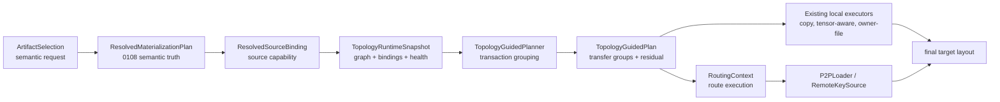
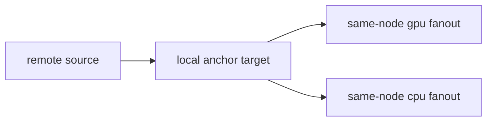

# Summary

TensorCast already has the ingredients for topology-guided communication, but
they do not yet form one strategy-plane concept:

- `0058` introduced a searchable topology graph plus `RoutingContext`.
- `0059` introduced host-local LLDP/NVLINK discovery.
- `0108` introduced a materialization strategy plane that selects execution
  shape after semantic truth and source capabilities are known.
- the communicator and tests now support topology-guided direct routing,
  rail-aware cross-node fallback, and same-node fanout.

What is still missing is the layer that converts a resolved materialization
request into **topology-aware transfer transactions**.

This design introduces a **strategy-guided topology plane** as an internal
lowering layer between `ResolvedMaterializationPlan` /
`ResolvedSourceBinding` and the concrete data-plane executors
(`P2PLoader`, `RemoteKeySource`, local copy executors, and residual
byte-range fallback).

The core rule is:

- topology remains a resource graph and route-selection substrate,
- strategy remains the owner of execution-shape decisions,
- the new plane binds them by constructing transfer groups such as:
  - direct remote per target,
  - remote bootstrap then same-node fanout,
  - owner-file collective,
  - exact residual fallback.

This design is explicitly grounded in two external implementation patterns:

1. **ByteCheckpoint**: request work is decomposed into stable, plan-driven
   transactions; communication is used to coordinate reshard and ownership
   rather than hard-coded inside one storage path.
2. **fastsafetensors**: source bytes are staged first, then tensor
   instantiation, sharding, broadcast, scatter, and push are executed as a
   second layer over that staged residency.

TensorCast should adopt the same separation: **first decide the transaction
shape, then execute each leg through the existing routed or local transports**.

# Goals / Non-Goals

## Goals

- Make topology a first-class **strategy input** rather than a transport-only
  implementation detail.
- Decide when one cross-node bootstrap plus same-node fanout is cheaper and
  safer than multiple independent remote pulls.
- Reuse the existing `0108` semantic boundary:
  - `ArtifactSelection`,
  - target layout or copy contract,
  - source acquisition,
  - executor selection.
- Reuse the existing `0058` topology graph and `RoutingContext` instead of
  inventing a parallel routing stack.
- Preserve current correctness semantics:
  - selection identity,
  - view identity,
  - verification and publication behavior,
  - routed-first then direct fallback,
  - disk fallback.
- Bootstrap a live runtime topology object into product paths instead of
  leaving topology-guided communication as test-only or smoke-only behavior.
- Expose planner and route observability so operators can see:
  - why a transfer group was chosen,
  - which local anchor was selected,
  - how many bytes were bootstrapped remotely,
  - how many bytes were fanned out locally,
  - when the plan degraded to direct or residual fallback.

## Non-Goals

- Implement global optimal cluster routing inside Global Store in v1.
- Require multi-hop data paths in v1.
- Rewrite `communicator::engine::Communicator`, RDMA/TCP internals, or the
  `RemoteKeySource` fallback contract.
- Introduce new SDK public APIs for topology policy.
- Introduce direct SDK connectivity to Global Store.
- Replace `0108` with a second planner stack.

# Problem Statement

TensorCast currently has a layering gap.

The communicator can already resolve a one-hop route based on topology and
endpoint bindings, but the materialization strategy plane does not decide
**which transfer topology should exist for a request**.

Today the system can answer:

- "given `src_endpoint_id` and `dst_endpoint_id`, which route should I use?"

but it does not yet answer:

- "for this request, should I create one remote bootstrap leg and then local
  fanout, or should I pull all targets independently, or should I use an
  owner-file collective, or should I stay on generic byte-range fallback?"

That missing decision point creates four practical issues:

1. topology-guided communication exists, but topology-guided **transaction
   planning** does not;
2. store and daemon product paths carry optional route metadata, but a live
   `RoutingContext` is not bootstrapped in non-test code;
3. executor choice in `0108` sees source capability and target shape, but not
   the incremental value of route reuse or local fanout;
4. older planner experiments such as `ChunkAwareLoadingStrategy` sit outside
   the `0108` semantic boundary and are too concrete to become the long-term
   planner surface.

# Current State

## What already works

### Communicator topology and route selection

`RoutingContext` already supports:

- direct topology links,
- cross-node rail-matched NIC fallback,
- same-node protocol preference:
  - NVLINK first,
  - PCIE second,
  - engine `AUTO` fallback,
- per-route observability,
- cross-node bootstrap followed by same-node fanout in routing tests.

The current route wrapper is intentionally one-hop only, which is acceptable
for v1 because the immediate need is not general multi-hop search but
**transaction-level grouping around direct and local-fanout legs**.

### Data path consumption seam already exists

`P2PSource` and `RemoteKeySource` already carry:

- `local_endpoint_id`,
- `remote_endpoint_id`,
- `routing_context`,
- `comm_engine`,
- direct fallback to `ip/port`.

This means the data plane can already execute routed reads when routing inputs
exist, and safely degrade when they do not.

### Materialization strategy plane already exists

`0108` already made the correct architectural move:

- semantic truth and copy contract are resolved first,
- source acquisition is separate,
- executor choice is delayed until enough context is available,
- mixed execution is permitted.

This is precisely the right insertion point for a topology-guided planner.

## What does not work yet

### Live topology bootstrap is incomplete

The repository contains `CommunicationManager::set_routing_context(...)`, but
there is no non-test callsite that constructs and injects a `RoutingContext`.

As a result:

- `host_topology_builder` is effectively test/tool code today,
- product `P2PSource` objects often carry `routing_context == nullptr`,
- routed-first read support exists in code but is not a normal product path.

### Strategy does not own transaction shape

`0108` can choose between executor families, but it does not yet build an
internal plan that says:

- which target becomes the remote ingress anchor,
- which local consumers are served by same-node fanout,
- when grouped remote ingress is better than per-target remote reads,
- how route health or topology affinity should bias the choice.

### The older chunk-aware planner is the wrong long-term seam

`ChunkAwareLoadingStrategy` proves the need for source-aware planning, but it
predates the current architecture:

- it owns concrete `P2PSource`,
- it queries Global Store directly from planner logic,
- it mixes planning and execution concerns,
- it is not aligned with the `0108` resolved-plan boundary.

This design narrows that older path rather than expanding it.

# Prior Constraints Reviewed

## `0058` Communicator Topology Model and Routing

Kept:

- `Topology` as the canonical graph,
- `RoutingContext` as the route executor and connection cache,
- one-hop route resolution as a stable v1 runtime surface.

Revised:

- topology should not directly decide materialization shape;
  it is an input to the strategy plane, not a replacement for it.

## `0059` Host Topology Discovery from LLDP and NVLINK

Kept:

- typed communicator config,
- deterministic host-local discovery,
- rail-switch and NVLINK endpoint generation,
- endpoint binding enrichment fields.

Revised:

- discovery is not useful unless its result is bootstrapped into product
  runtime objects.

## `0083` Group-Aware Replica Transport Scheduling

Kept:

- transport scheduling and topology strategy are different concerns,
- request grouping matters for tail latency and utilization.

Revised:

- `0083` remains source-side scheduling and dispatch policy,
  while this design is daemon-local transaction topology after a source is
  already selected.
- Global Store should not be forced to solve daemon-local fanout selection in
  v1.

## `0087` Unified Artifact Runtime and Routed Byte Artifact Architecture

Kept:

- one artifact-first model,
- one selection contract,
- authority boundaries between semantic truth and transport details.

Revised:

- routed byte-artifact capabilities must remain reusable, but topology-guided
  materialization should sit below artifact semantics and above concrete route
  execution.

## `0108` Tensor-Aware Materialization Strategy Plane

Kept:

- semantic truth first,
- source acquisition separate from strategy,
- executor-private plans stay internal,
- mixed execution is allowed.

Revised:

- strategy must now see topology/runtime route reuse as part of execution-shape
  choice.
- this new topology plane belongs inside `0108`, not beside it.

# Architecture & Interfaces

## 1. Layered model



Normative rules:

- `ResolvedMaterializationPlan` stays the semantic truth layer.
- `ResolvedSourceBinding` stays the source-acquisition truth layer.
- `TopologyRuntimeSnapshot` is a runtime input and must not redefine semantic
  truth.
- `TopologyGuidedPlan` is executor-private and must not become SDK or generic
  proto API.
- `RoutingContext` remains the execution adapter for routed legs, not the owner
  of transaction-shape policy.

## 2. New internal plan artifacts

This design introduces the following internal concepts.

### `TopologyRuntimeSnapshot`

Runtime snapshot of topology-relevant state:

- immutable `Topology`,
- `EndpointBinding` table,
- link and route health snapshot,
- local node identity,
- local device inventory needed for anchor selection.

It is built at daemon startup and refreshed only by explicit rebuild, not by
per-request ad-hoc probing.

### `TopologyStrategyInput`

Planner input created inside the common runtime from:

- `ResolvedMaterializationPlan`,
- `ResolvedSourceBinding`,
- request target set,
- local topology snapshot,
- strategy config.

This is where the planner sees both:

- semantic request shape,
- transport and route opportunity.

### `RouteIntent`

Planner-owned route preference, not yet a concrete channel:

- source endpoint id,
- destination endpoint id,
- route kind,
- preferred protocol family,
- optional local ingress anchor id,
- health and cost annotations,
- fallback policy.

### `TransferLeg`

One executable leg inside a larger transfer transaction.

Examples:

- remote bootstrap into one local anchor,
- same-node NVLINK fanout from one GPU to sibling GPUs,
- GPU-to-CPU local fanout into a memory target,
- generic residual remote read,
- exact disk fallback.

### `TransferGroup`

A partially ordered group of legs that share a topology decision.

Examples:

- one remote bootstrap plus seven same-node GPU fanout legs,
- one remote bootstrap plus one CPU materialization leg,
- one owner-file collective leg plus one residual byte-range leg.

### `TopologyGuidedPlan`

The final planner output:

- ordered `TransferGroup` list,
- residual generic fallback work,
- diagnostics and scoring explanation,
- execution-lane level byte counts.

## 3. Supported transaction shapes

V1 supports four transaction shapes.

### Shape A: `DIRECT_REMOTE_PER_TARGET`

The compatibility baseline.

- each target independently pulls remote bytes,
- route selection may still be topology-aware,
- no cross-target reuse is assumed.

This remains the exact degrade path.

### Shape B: `REMOTE_BOOTSTRAP_THEN_LOCAL_FANOUT`

The primary new topology-guided transaction shape.



Use when:

- one remote source feeds multiple same-node targets,
- a local fabric is available,
- the grouped plan saves cross-node ingress or route setup work,
- executor and target layout allow staged reuse.

This is the TensorCast analogue of the staged-source-then-shuffle pattern used
in `fastsafetensors`.

### Shape C: `OWNER_FILE_COLLECTIVE`

Existing `0108` owner-file execution remains valid when the source layout and
ownership structure justify it.

This shape remains strategy-owned and topology-aware:

- owner choice may consider route health and local anchor suitability,
- but ownership logic is not moved into the communicator.

### Shape D: `GENERIC_BYTE_RANGE_FALLBACK`

The exact semantic fallback.

- any bytes not safely covered by a guided transaction remain on the generic
  path,
- disabling a guided shape expands residual fallback; it never suppresses
  requested bytes.

## 4. Cost model and route grouping

The planner cost model must combine three categories of signal.

### Materialization value

- bytes deduplicated across targets,
- tensor-job or concat-job compatibility,
- direct-write opportunity,
- source-ordered read opportunity,
- verification and target-layout constraints.

### Topology value

- cross-node ingress reuse,
- local fanout bandwidth,
- rail match quality,
- same-node NVLINK or PCIE availability,
- anchor affinity to target devices.

### Health and degrade penalties

- unhealthy or degraded links,
- missing bindings,
- route fallback likelihood,
- extra residual fallback bytes introduced by the guided plan.

The planner must not use a pure network-only shortest path. The objective is
execution-shape quality, not graph-theoretic optimality.

## 5. Product wiring

### Startup and bootstrap

At daemon startup:

1. build a host topology from:
   - `simple_numa`,
   - optional LLDP,
   - optional NVLINK discovery;
2. create a `RoutingContext` backed by the live communicator engine;
3. install local endpoint bindings immediately;
4. populate remote bindings from directory or transport metadata already used by
   product control paths;
5. inject the resulting runtime snapshot into `CommunicationManager`.

This is the minimum work required to turn current routing support into a real
product capability.

### Common runtime integration

Inside `MaterializationFacade` and related common-runtime entrypoints:

1. resolve semantic truth and source binding as in `0108`;
2. if topology-guided mode is enabled and a live snapshot exists,
   build `TopologyGuidedPlan`;
3. lower each transfer group into existing executors:
   - routed P2P legs,
   - local tensor-aware or copy legs,
   - owner-file collective legs,
   - generic residual fallback;
4. aggregate the execution outcome into the existing
   `ExecutionCommitReport`.

### Data-plane execution

The plan uses existing executors.

- routed remote legs continue to use `P2PLoader` and `RemoteKeySource`;
- same-node fanout legs continue to use local copy or tensor-aware execution;
- disk fallback remains mux-capable and exact.

This design does not require a second remote-loader stack.

## 6. Configuration additions

Topology discovery remains under `CommunicatorConfig`.

Strategy behavior must remain under the typed runtime config introduced by
`0108`. Additive config is proposed under
`tensorcast.config.v1.Engine.MaterializationStrategy`:

```proto
message MaterializationStrategy {
  ...
  optional bool enable_topology_guided_transfer = 17;

  enum TopologyGuidedMode {
    TOPOLOGY_GUIDED_MODE_UNSPECIFIED = 0;
    TOPOLOGY_GUIDED_MODE_DISABLED = 1;
    TOPOLOGY_GUIDED_MODE_OBSERVE_ONLY = 2;
    TOPOLOGY_GUIDED_MODE_PREFER_GUIDED = 3;
  }

  TopologyGuidedMode topology_guided_mode = 18;
  optional bool enable_remote_bootstrap_local_fanout = 19;
}
```

Field semantics:

- `enable_topology_guided_transfer=false` preserves current behavior.
- `OBSERVE_ONLY` builds and logs the plan but executes the current baseline.
- `PREFER_GUIDED` executes guided groups when the planner can prove a valid
  fallback path.
- `enable_remote_bootstrap_local_fanout` gates the new grouped ingress shape
  independently from other future topology-guided shapes.

No new environment variables are allowed.

## 7. Interaction with Global Store scheduling

V1 keeps source selection and topology-guided transaction planning separate.

- Global Store continues to choose a candidate remote replica.
- the daemon-local strategy plane then decides whether that remote source should
  be consumed:
  - directly per target,
  - via one bootstrap plus local fanout,
  - or via an owner-file collective.

This is intentional.

Strictly coupling this design to `0083` would force Global Store to understand
daemon-local target sets, local topology, and local fanout cost before the
runtime has even resolved the final materialization shape.

Follow-up integration is still valid:

- `0083` may later accept optional topology or anchor hints,
- but that is a scheduler refinement, not a blocker for this design.

# Error Model & Invariants

- Guided topology planning must never change:
  - `selection_hash`,
  - `view_id`,
  - target layout truth,
  - verification or publication requirements.
- If no valid topology snapshot exists, the request must degrade to the current
  non-guided execution path.
- If a guided leg fails before commit, the request may:
  - retry with direct routed or direct `ip/port` read,
  - or fall back to disk,
  - but it must not silently drop requested bytes.
- V1 route intents must remain one-hop only.
- A `TransferGroup` is an execution planning unit, not a durable database
  transaction.
- Strategy must use node-local daemon endpoints only and must not create
  direct SDK-to-Global-Store or app-to-remote-daemon shortcuts.

# Schema Changes

None.

This design does not require persistent database schema changes in v1.

The only additive interface changes are typed runtime-config fields in
`daemon_config.proto`.

# Naming Compliance

- Classes and structs (PascalCase):
  - `TopologyRuntimeSnapshot`
  - `TopologyStrategyInput`
  - `RouteIntent`
  - `TransferLeg`
  - `TransferGroup`
  - `TopologyGuidedPlan`
- Functions and methods (snake_case):
  - `build_topology_guided_plan`
  - `select_bootstrap_anchor`
  - `rank_route_intents`
  - `lower_transfer_group`
  - `emit_topology_guided_diagnostics`
- Enum values and constants (ALL_CAPS):
  - `TOPOLOGY_GUIDED_MODE_DISABLED`
  - `TOPOLOGY_GUIDED_MODE_OBSERVE_ONLY`
  - `TOPOLOGY_GUIDED_MODE_PREFER_GUIDED`
  - `TRANSFER_GROUP_KIND_REMOTE_BOOTSTRAP`
  - `TRANSFER_GROUP_KIND_LOCAL_FANOUT`

# Alternatives and Rationale

## Alternative A: keep topology logic inside `RoutingContext`

Rejected.

`RoutingContext` can answer route questions, but it does not own:

- target-layout semantics,
- source acquisition semantics,
- executor compatibility,
- residual fallback accounting.

Pushing transaction-shape policy into the communicator would collapse the
`0108` separation that is already correct.

## Alternative B: extend `ChunkAwareLoadingStrategy`

Rejected.

That older planner is concrete in the wrong ways:

- it reaches into `P2PSource`,
- it assumes direct Global Store query involvement,
- it mixes planning and execution too early.

The right move is to absorb the useful intent into the `0108` strategy plane,
not to promote the older planner to the canonical interface.

## Alternative C: solve topology guidance only in Global Store

Rejected for v1.

Global Store does not currently have the daemon-local information needed to
decide:

- local anchor choice,
- same-node fanout opportunity,
- executor compatibility with mapped targets,
- local route health snapshots.

Global scheduling and local transaction topology should remain separate layers.

# Trade-offs & Risks

- **More planner complexity**: the strategy plane now reasons about route reuse
  and fanout, not just executor compatibility.
- **Bootstrap risk**: building a live `RoutingContext` in product runtime is
  the highest-risk implementation step because it touches startup and directory
  data flow.
- **Anchor misprediction**: the chosen local ingress anchor may be suboptimal if
  route health or target pressure changes quickly.
- **Observability burden**: without strong diagnostics the planner will be hard
  to trust or tune.
- **Partial rollout risk**: if topology bootstrap lands without strategy
  grouping, or vice versa, the system gains complexity without enough user
  value.

# Compatibility & Acceptance Criteria

- With topology-guided transfer disabled, runtime behavior remains unchanged.
- With topology-guided transfer enabled but no valid runtime snapshot, the
  request degrades to the current baseline with no correctness regression.
- Product runtime can bootstrap a live `RoutingContext` from typed config and
  inject it into `CommunicationManager`.
- For a multi-target same-node retrieval where one remote replica feeds several
  local targets, the planner can emit one `REMOTE_BOOTSTRAP_THEN_LOCAL_FANOUT`
  group.
- Same-node fanout can reuse current NVLINK or PCIE route selection where
  available.
- Routed remote legs preserve current routed-first then direct fallback
  semantics.
- Diagnostics expose:
  - selected group kind,
  - anchor target,
  - route endpoints,
  - grouped byte counts,
  - residual fallback bytes,
  - degrade reason when guidance is skipped.
- Existing communicator-level topology-guided smoke remains valid, and new
  store or daemon integration tests cover the same grouped-bootstrap intent.

# References

- `docs/designs/0058-communicator-topology-model.md`
- `docs/designs/0059-host-topology-discovery-lldp-nvlink.md`
- `docs/designs/0083-group-aware-transport-scheduling.md`
- `docs/designs/0087-unified-artifact-runtime-and-routed-byte-artifact-architecture.md`
- `docs/designs/0108-tensor-aware-materialization-strategy-plane.md`
- `docs/architecture/p2p-transfer-strategies.md`
- ByteCheckpoint: *A Unified Checkpointing System for Large Foundation Model Development*
- fastsafetensors: *Speeding up Model Loading with fastsafetensors*
