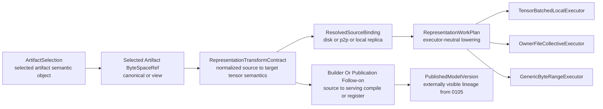

# Summary

Introduce one common semantic core for representation-changing tensor work inside
TensorCast common runtime.

- `Artifact` remains the only persisted public representation object.
- `ArtifactSelection` remains the only public selection contract.
- ByteSpace semantics remain the only coordinate-system truth.
- a new `RepresentationTransformContract` family becomes the common semantic
  truth for:
  - mapped binding,
  - mapped-target materialization,
  - ordinary tensor-aware materialization lowering,
  - source-bind startup lowering,
  - source-to-serving builder lowering.
- executor choice remains downstream of semantic truth and source binding.

This design intentionally narrows the first hard cut to the semantic core.

- It removes mapped-only semantic islands and executor-local semantic recovery.
- It does **not** make phase-1 common runtime own group-scoped TP4<->TP8 reshard
  execution.
- It does **not** make phase-1 own communicator or routing-aware participant
  planning.
- It does **not** make phase-1 standardize durable artifact-catalog metadata for
  every future representation family.

Those follow-on concerns remain part of the long-term direction, but they should
consume the semantic core defined here instead of being folded into the first
contract cut.

# Execution Tracking

The semantic-core hard cut defined here is already landed in repo-local runtime.

- the deleted `0110` companion plan is no longer an active execution note;
- remaining producer-boundary convergence, topology-scoped follow-on extraction,
  and Step3p5 closure dependencies now live in the `0113` design/plan pair;
- no future work should reintroduce executor-local semantic truth or a second
  integration-private semantic stack under the banner of "finishing 0110".



# Goals / Non-Goals

## Goals

- Keep `Artifact` as the only persisted public representation object.
- Keep `ArtifactSelection` as the only public selection contract.
- Keep ByteSpace semantics explicit and unchanged in role.
- Introduce one common semantic contract for representation-changing tensor work.
- Replace `MappedCopyContract` as the long-term shared semantic family.
- Make `0108` strategy lowering operate on one executor-neutral semantic family.
- Make `0109` owner-file collective consume shared lowering output rather than a
  bespoke semantic recovery path.
- Define tensor-level semantic normalization for copy, slice, concat, scalar
  fill-from-source, and constant fill forms.
- Define the boundary between:
  - semantic transform truth,
  - publication lineage,
  - execution-time topology and participant planning.
- Preserve a clean path for future source-to-serving builder work and future
  topology-scoped reshard execution without forcing those scopes into phase 1.
- Preserve the distinction between:
  - selection identity,
  - ByteSpace identity,
  - representation identity,
  - artifact content identity.

## Non-Goals

- Introduce a second public checkpoint shard object beside `Artifact`.
- Replace `ArtifactSelection` with a second public selector model.
- Treat representation identity as a substitute for `selection_hash` or
  `logical_layout_hash`.
- Make executor-private ownership, batching, rank assignment, or routing
  decisions part of semantic truth.
- Define the physical topology or communicator plan for future group-scoped
  reshard execution.
- Define a durable artifact-catalog schema for all future representation
  metadata in this phase.
- Collapse view transforms and compute transforms into one overloaded concept.
- Require one universal executor for all materialization requests.
- Force every runtime to consume raw source artifacts directly.
- Define the complete serving-publication contract for `internal-vllm`; this
  design only defines the TensorCast-side semantic core that later builder and
  publication work will consume.

# Prior Constraints Reviewed

## `0055` Programmable framework

Kept:

- `TransformSpec` remains the public control-plane request for compute
  transforms.
- compute transforms must still execute at a node-local safety boundary rather
  than a central controller direct data-plane RPC.

Revised:

- `0055` stops at the request shape.
- this design adds the missing common resolved semantic layer below
  `TransformSpec` and above executor choice.
- physical topology-aware reshard execution remains a later specialized executor
  concern, not part of the phase-1 semantic core.

## `0078` Selection-first retrieval

Kept:

- `ArtifactSelection` remains the only public selection contract.
- selection identity still answers which semantic object was selected.

Revised:

- selection no longer needs to carry representation-changing semantics
  indirectly through target-layout or integration-private side channels.
- representation change resolves after selection and before strategy lowering.

## `0084` Binding unified model

Kept:

- the artifact plane, binding plane, and assembly plane remain distinct.
- `Binding` continues to represent a stable local target location.
- artifact-backed and local-only sealed values remain different categories.

Revised:

- `mapping=copy_plan` is no longer treated as a mapped-binding-only semantic
  world.
- binding mapping becomes one producer into the common representation contract
  family.

## `0085` and `0105` assembly and closeout lineage

Kept:

- `PublishedModelVersion` remains the right externally visible lineage carrier.
- closeout truth remains separate from runtime transform semantics.

Revised:

- this design does not try to replace closeout lineage with runtime materialize
  contracts.
- source-to-serving builder and publication follow-on work should reuse the
  semantic core defined here, then surface externally visible results through
  `0105` closeout and `PublishedModelVersion`.
- any builder- or framework-versioned publication identity above the semantic
  core must be introduced as a separate `0111`-owned digest rather than by
  widening `representation_contract_hash`.

## `0088` and `0092` artifact profiles and truth layering

Kept:

- artifact profiles remain the repository-wide way to express persisted artifact
  families.
- recoverable truth and volatile execution planning remain different categories.

Revised:

- phase 1 defines internal semantic contracts first and does not yet standardize
  new durable artifact-catalog metadata for every representation family.
- any later promotion of representation metadata into durable artifact truth
  must come with its own schema and recovery design.

## `0108` Tensor-aware materialization strategy plane

Kept:

- the layered split between semantic truth, source acquisition, strategy
  selection, and executor lowering.
- mixed execution remains the preferred execution model.
- executor-private planning artifacts remain executor-private.

Revised:

- `MappedCopyContract` is no longer the long-term target semantic family.
- the common runtime should consume a representation-transform contract that
  applies to ordinary loads, mapped-target, binding mapping, and builder-side
  lowering.
- topology-scoped group execution remains follow-on work above the same semantic
  seam rather than part of the first `0108` convergence wave.

## `0109` Batched owner-file collective executor

Kept:

- owner-file collective remains one executor choice inside the strategy plane.
- file ownership remains execution strategy, not semantic truth.

Revised:

- owner-file collective should no longer depend on a bespoke semantic recovery
  path.
- it should consume the same common work items produced for the local tensor
  executor and generic fallback.
- it is not the future topology-scoped reshard executor; that remains a
  separate follow-on scope.

## `0058` Communicator topology model

Kept:

- topology reachability, routing, and transport execution are separate from
  semantic transform intent.

Revised:

- this design only carries logical topology assumptions that affect target
  representation identity.
- physical topology mapping, route choice, and communicator orchestration remain
  future execution-layer work that will consume this semantic core.

# Architecture & Interfaces

## 0. Phase boundary and ownership split

This design draws three boundaries that must remain explicit.

| Layer | Canonical question answered | Owner |
| --- | --- | --- |
| semantic transform core | how source bytes become target tensors or target layout | `0110` |
| publication lineage | what externally visible source or serving result was published | `0105` / follow-on builder docs |
| execution topology | how the current node or rank group executes the transform | `0108` plus future topology-scoped executor design |

Repository rule:

- later layers may consume the semantic transform core,
- later layers must not redefine the semantic core in ad hoc local forms,
- and the semantic transform core must not absorb publication or communicator
  topology responsibilities just because later layers depend on it.

## 1. Relationship to `ArtifactSelection` and ByteSpace

### 1.1 `ArtifactSelection` remains unchanged in role

`ArtifactSelection` still answers:

- which artifact id,
- which view identity,
- which subset identity.

It does not answer:

- whether the target runtime expects TP4 or TP8 serving layout,
- how one fused checkpoint tensor becomes two runtime tensors,
- how a source artifact lowers into a serving artifact,
- or whether the result should later be published as a serving artifact.

### 1.2 ByteSpace remains explicit coordinate truth

ByteSpace still answers where byte offsets are interpreted:

- canonical ByteSpace,
- view ByteSpace,
- or a future persisted representation artifact's canonical ByteSpace.

The new contract must always name its input ByteSpace explicitly.

Normative rules:

1. representation identity must not replace ByteSpace identity,
2. byte ranges are only meaningful relative to an explicit ByteSpace,
3. a published representation artifact gets its own canonical ByteSpace and
   ordinary artifact identity,
4. `representation_contract_hash` is not a ByteSpace identifier.

### 1.3 Durable artifact metadata is follow-on, not phase-1 scope

`Artifact` remains the only persisted public representation object.

However, this phase only defines the internal semantic contract family and the
builder or publication boundary around it.

Required interpretation:

- persisted semantic objects still remain artifacts,
- phase-1 semantic contracts may describe target representation metadata without
  forcing an immediate artifact-catalog schema cut,
- if a later design promotes any representation field into durable artifact or
  profile truth, that later design must specify schema, recovery, and
  compatibility explicitly.

## 2. New common semantic family

### 2.1 `RepresentationDescriptor`

`RepresentationDescriptor` describes the target representation metadata that an
ephemeral realization or future publishable artifact produces or expects.

It answers:

- representation family,
- target tensor schema,
- logical topology assumptions when they affect target schema,
- representation identity.

Representative fields:

```cpp
struct RepresentationDescriptor {
  std::string family;
  std::string tensor_schema_hash;
  std::string representation_contract_hash;
  std::optional<TopologyContract> logical_topology;
  RealizationKind realization_kind;
};
```

Semantics:

- `family` names the representation class such as source, runtime_serving, or
  builder_intermediate.
- `tensor_schema_hash` captures destination tensor names, dtype, shape, and
  stride after semantic normalization.
- `representation_contract_hash` is the canonical digest of normalized
  representation-transform inputs and any pipeline-family assumptions that
  affect resulting target bytes or tensor schema.
- `representation_contract_hash` is owned entirely by this semantic layer. A
  later builder or publication design may consume it and may define an
  additional builder-identity digest above it, but must not silently redefine
  or widen it with framework-adapter or publication-lineage fields.
- `logical_topology` captures logical representation assumptions such as
  tensor-parallel, pipeline-parallel, or expert-parallel world sizes and a
  topology-family version when relevant.
- `logical_topology` does **not** capture physical rank mapping, routing,
  communicator channels, or device placement.
- `realization_kind` distinguishes:
  - `ephemeral_into_target`
  - `artifact_publishable`
  - `local_seal_then_promote`

### 2.2 `RepresentationTensorBinding`

`RepresentationTensorBinding` is the per-destination-tensor semantic rule.

It answers:

- which target tensor is being produced,
- which operation kind is semantically required,
- which source tensors or source fragments participate,
- whether the result has exact coverage or explicit residual fallback.

Representative fields:

```cpp
enum class BindingOpKind : std::uint8_t {
  kExactCopy = 0,
  kSliceCopy = 1,
  kConcat = 2,
  kScalarFromSource = 3,
  kConstFill = 4,
};

struct RepresentationTensorBinding {
  std::string dst_name;
  TensorSpec dst_spec;
  BindingOpKind op_kind;
  std::vector<SourceFragment> sources;
  std::optional<FillRule> fill_rule;
  CoverageKind coverage_kind;
};
```

`SourceFragment` must support:

- source tensor name,
- source range spec,
- source ByteSpace-relative coordinates,
- destination range spec,
- optional fragment role for concat or broadcast-equal assembly.

Range specs must support:

- single-dimension range,
- multi-dimension range,
- exact scalar selection.

This is required because existing mapped plans and builder traces already need:

- single-range copy,
- multi-range copy,
- scalar fill-from-source,
- fill-const operations.

Normative rules:

1. bindings for the same destination tensor must normalize into a stable order,
2. normalized bindings for the same destination tensor must not overlap on the
   destination coordinate space,
3. `kConstFill` requires `fill_rule` and no source fragments,
4. copy or concat forms require at least one source fragment,
5. exact coverage versus residual fallback must remain explicit rather than
   inferred separately inside executors.

### 2.3 `RepresentationTransformContract`

`RepresentationTransformContract` is the common semantic object resolved after
selection and before executor choice.

Representative fields:

```cpp
struct RepresentationTransformContract {
  ByteSpaceRef source_byte_space;
  RepresentationDescriptor target_representation;
  std::vector<RepresentationTensorBinding> tensor_bindings;
  loader::ByteRangeMap residual_fallback_map;
};
```

Normative rules:

1. this contract becomes the only common semantic truth for
   representation-changing materialization in the phase-1 scope,
2. executor-private candidate shapes must not live in this contract,
3. residual generic fallback coverage must remain explicit,
4. every byte removed from residual fallback must be covered by a semantically
   equivalent normalized tensor binding or a derived work item,
5. semantically equivalent producer outputs must normalize to the same
   `RepresentationTransformContract` before `representation_contract_hash` is
   computed.

## 3. Logical topology versus physical execution topology

### 3.1 Logical topology may affect representation identity

Some target representations are different because the target schema depends on
logical topology assumptions such as:

- tensor-parallel world size,
- pipeline-parallel world size,
- expert-parallel world size,
- topology family version.

Repository rule:

- if target tensor schema depends on logical topology, that logical topology
  participates in `representation_contract_hash`,
- but logical topology still must not participate in `selection_hash`.

### 3.2 Physical execution topology is follow-on work

This phase does **not** define:

- source participant sets,
- target participant sets,
- rank-to-device mapping,
- communicator or routing choices,
- group-scoped collective commit protocol,
- or cross-rank failure handling for topology-scoped reshard execution.

Those concerns belong to a future specialized execution design that will consume
the semantic core defined here together with `0108` strategy lowering and `0058`
communicator topology facilities.

## 4. Control-plane transform contract

`0055` already defines `TransformSpec`.

This design keeps that public request and clarifies its relation to the new
semantic layer:

- `TransformSpec` is the public request,
- `RepresentationTransformContract` is the resolved semantic truth,
- builder or publication workflows may later consume the same resolved semantic
  truth without changing the public request family.

Two long-term execution shapes remain valid:

1. `transform_register(...)`
   - resolve `TransformSpec`,
   - build `RepresentationTransformContract`,
   - execute it,
   - register or seal the result as a new artifact.
2. `transform_into(...)`
   - resolve `TransformSpec`,
   - build `RepresentationTransformContract`,
   - execute it directly into a local target layout or binding.

This keeps reshard, source-to-serving compile, and future layout-seeded local
execution on one programmable spine instead of inventing multiple request
families.

## 5. `0108` strategy-plane convergence

### 5.1 Replace mapped-only semantic truth

`MappedCopyContract` is currently the closest thing to a common semantic
contract, but it is too narrow and still mixed with executor-oriented artifacts.

Hard-cut target:

- remove `MappedCopyContract` as the repository-wide semantic family,
- replace it with `RepresentationTransformContract`,
- treat mapped binding, mapped-target, source-bind startup, and builder lowering
  as producers of that contract.

### 5.2 Introduce one executor-neutral typed work inventory

The strategy plane should lower the resolved representation contract plus source
binding into one executor-neutral typed work inventory, for example:

```cpp
struct RepresentationWorkItem {
  WorkItemKind kind;
  std::string dst_name;
  std::vector<WorkSourceFragment> sources;
  uint64_t committed_bytes;
};
```

Representative work kinds:

- `tensor_copy`
- `concat_assemble`
- `scalar_broadcast_fill`
- `const_fill`
- `pad_fill`
- `residual_byte_range`

Normative rules:

- these work kinds describe target-semantic intent, not transport shape,
- executor-shaped forms such as direct span reads, staged pack, peer scatter,
  or batch-local dedup remain strategy- or executor-private lowerings below this
  shared work inventory,
- `pad_fill` is derived during work-plan construction from coverage closure
  implied by the semantic contract plus target layout, not by widening
  `RepresentationTransformContract` into executor-shaped padding artifacts,
- a typed work item that a preferred executor cannot currently admit remains
  typed in shared planning and diagnostics until a later lane or
  executor-private lowering decides how to execute it,
- semantic contract hash stays attached to
  `RepresentationTransformContract`, while plan hash may reflect derived
  work-plan artifacts such as `pad_fill`,
- only bytes with no typed execution equivalent may remain
  `residual_byte_range`.

### 5.3 Executors simplify rather than multiply

This design does not collapse all execution into one executor.

It simplifies the system by making executors consume the same work IR:

- tensor-batched local executor,
- owner-file collective executor,
- generic byte-range executor.

What disappears is duplicated semantic recovery:

- no second semantic parser in `build_tensor_jobs(...)`,
- no mapped-only semantic island in
  `materialization_mapped_copy_plan_utils.cc`,
- no need for executors to rediscover transform truth from
  `source_index_json + view_index_json + variant_identity`.

Future topology-scoped reshard execution may add another executor family, but it
must still consume this semantic core rather than recreate a second semantic
stack.

## 6. Source-to-serving builder boundary

This design promotes a repository-wide distinction:

Follow-on builder and publication details are owned by `0111`.

- **source artifact**
  - checkpoint or training representation,
  - may require representation-changing build steps to become runtime-serving
    bytes.
- **serving artifact**
  - postprocess-complete runtime representation,
  - intended for steady-state runtime bind or swap.

The semantic core defined here is the bridge between them.

Normative rules:

1. source-to-serving builder work is a producer of
   `RepresentationTransformContract`,
2. final externally visible publish lineage remains owned by `0105`
   `PublishedModelVersion` and typed closeout contracts,
3. mapped binding or copy-plan lowering may remain useful builder-side
   mechanisms, but they must not remain the long-lived serving-runtime semantic
   truth.
4. builder- or framework-version identity needed for serving publication must be
   modeled as a distinct layer above `RepresentationTransformContract`; it must
   not be retrofitted into `representation_contract_hash`.

The detailed builder and publication-lineage design for this bridge is defined in
`0111`.

# Invariants And Error Model

## Invariants

- one canonical owner answers each kind of truth,
- `ArtifactSelection`, ByteSpace, representation identity, publication lineage,
  and execution strategy remain distinct,
- semantically equivalent transform inputs normalize to the same representation
  contract before hashing,
- typed work inventory and later lane planning remain distinct from
  executor-private transport ops,
- executor-private shapes do not appear in the common semantic contract,
- destination coverage is either exact or has explicit residual fallback,
- physical topology planning does not leak into the phase-1 semantic core,
- and publication lineage is not inferred from materialization executor state.

## Error Model

- `INVALID_ARGUMENT`
  - malformed source or destination range spec
  - overlapping normalized destination coverage
  - invalid binding op form such as source-less copy or source-plus-const fill
  - inconsistent hash input fields during normalization
- `FAILED_PRECONDITION`
  - selected ByteSpace is inconsistent with required target layout semantics
  - a requested transform depends on source schema facts that are absent from the
    resolved selection or builder lowering
  - publication is requested from a non-publishable realization kind
- `UNIMPLEMENTED`
  - group-scoped participant planning
  - communicator or routing-aware physical topology lowering
  - topology-scoped collective commit logic outside existing executor families
- `ABORTED` or `UNAVAILABLE`
  - execution-time source acquisition, routing, or node-local executor failures
    remain owned by `0108`, `0055`, and follow-on execution designs rather than
    by the semantic contract definition itself

# Alternatives And Rationale

## Alternative 1: keep mapped-target semantics separate and add a second reshard IR later

Rejected.

- It preserves the exact duplication this design exists to remove.
- It keeps builder integrations and executors free to maintain private semantic
  truth.

## Alternative 2: fold topology executor design into the first semantic-core cut

Rejected for phase 1.

- It mixes logical representation identity with physical execution topology.
- It forces communicator, participant, and failure-model concerns into a
  contract that should stay executor-neutral.
- It would likely stall the more urgent cleanup of mapped-only and
  executor-local semantic duplication.

## Alternative 3: solve source-to-serving publication inside materialization runtime docs only

Rejected.

- publication lineage already has a separate semantic home in `0105`.
- collapsing builder or publication semantics back into runtime materialization
  would repeat the same cross-layer drift the repository is trying to remove.

# Schema Changes

None in this phase.

This design defines the internal semantic contract family and the builder or
publication boundary around it. It does not yet standardize new durable
artifact-catalog schema for representation metadata.

If a later design promotes any representation field into durable artifact or
profile truth, that design must include explicit schema, recovery, and
compatibility rules.

# Naming Compliance

Proposed interface names follow repository naming rules.

| Symbol | Kind | Required style | Result |
| --- | --- | --- | --- |
| `RepresentationDescriptor` | C++ struct | `PascalCase` | pass |
| `RepresentationTensorBinding` | C++ struct | `PascalCase` | pass |
| `RepresentationTransformContract` | C++ struct | `PascalCase` | pass |
| `RepresentationWorkItem` | C++ struct | `PascalCase` | pass |
| `TopologyContract` | C++ struct | `PascalCase` | pass |
| `BindingOpKind` | C++ enum | `PascalCase` | pass |
| `pad_fill` | work-item field/value | `snake_case` | pass |
| `transform_register` | Python method | `snake_case` | pass |
| `transform_into` | Python method | `snake_case` | pass |
| `representation_contract_hash` | field | `snake_case` | pass |
| `tensor_schema_hash` | field | `snake_case` | pass |
| `logical_topology` | field | `snake_case` | pass |
| `realization_kind` | field | `snake_case` | pass |

# Trade-offs & Risks

## Advantages

- one semantic layer for mapped binding, mapped-target, ordinary tensor-aware
  lowering, and builder-side source-to-serving lowering,
- cleaner separation between semantic truth, publication lineage, and execution
  topology,
- simpler long-term executor architecture under `0108`,
- clearer integration boundary for `internal-vllm` and other framework builders,
- preserves a forward path to future reshard execution without forcing
  communicator planning into the first hard cut.

## Risks

- the contract could still be over-generalized if normalization rules are left
  vague,
- source-to-serving builder and publication follow-on work could drift if this
  semantic core is not adopted quickly enough,
- future topology executor work will still need an additional design for
  participant and failure semantics,
- accepted docs may drift if `0055`, `0108`, `0105`, and `0109` are not updated
  together.

## Mitigations

- keep the phase-1 contract explicitly tensor-semantic and executor-neutral,
- define normalization and coverage rules now rather than leaving them implicit,
- keep publication lineage anchored in `0105`,
- keep physical topology planning explicit follow-on work instead of letting it
  leak into semantic structs by accident.

# Compatibility & Acceptance Criteria

Compatibility strategy:

- hard cut only for the semantic core,
- no long-lived `MappedCopyContract` compatibility layer,
- no dual semantic stacks inside common runtime,
- explicit follow-on designs for durable publication metadata and topology-scoped
  execution rather than undocumented scope creep.

This design is accepted only when all of the following are true:

1. common runtime semantic truth is expressed through
   `RepresentationTransformContract` rather than `MappedCopyContract`,
2. mapped-target, mapped binding, and ordinary tensor-aware lowering all resolve
   through the same semantic family,
3. `0108` executor choice operates on one shared work IR rather than duplicate
   semantic recovery code,
4. owner-file collective remains executor-private and no longer carries a
   bespoke semantic planner,
5. `TransformSpec` remains the public request and lowers into the same semantic
   core,
6. source-to-serving builder and publication work have an explicit boundary to
   reuse this semantic core without overloading it,
7. group-scoped topology execution is explicitly deferred to follow-on design
   work rather than left as an ambiguous hole in the semantic layer.

# References

- `docs/designs/0055-programmable-framework.md`
- `docs/designs/0078-selection-first-artifact-retrieval.md`
- `docs/designs/0084-binding-unified-model-and-contract.md`
- `docs/designs/0085-distributed-binding-assembly-and-coordinator.md`
- `docs/designs/0105-assembly-attempt-hard-cut-spec-runtime-slot-closeout.md`
- `docs/designs/0108-tensor-aware-materialization-strategy-plane.md`
- `docs/designs/0109-batched-owner-file-collective-executor.md`
- `docs/designs/0111-source-to-serving-builder-and-representation-publication.md`
- `docs/designs/0058-communicator-topology-model.md`
- `docs/architecture/api/materialization-flow.md`
- `docs/internals/disk-load-strategy.md`
- `docs/internals/model-loading.md`
- `tensorcast/api/store/mapped_binding.py`
- `tensorcast/types.py`
- `proto/tensorcast/daemon/v2/store_daemon.proto`
- `daemon/service/controllers/representation_transform_builder.cc`
- `daemon/service/controllers/representation_layout_types.h`
- `core/store/replica/collective_disk_loader.cc`
- external integration grounding:
  - `/data/workspace/internal-vllm/vllm/model_executor/model_loader/tensorcast_loader.py`
  - `/data/workspace/internal-vllm/docs/design/tensorcast_torch_framework_integration.md`
  - `/data/workspace/internal-vllm/docs/design/tensorcast_loader_bind_swap_upgrade_plan.md`
  - `/data/workspace/internal-vllm/docs/design/tensorcast_serving_artifact_bind_swap_decision.md`
