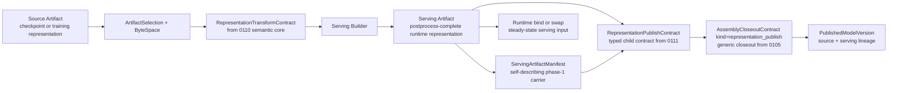

# Summary

Define the follow-on design that turns `0110` semantic-core contracts into
durable serving artifacts and a typed representation-publication bridge for
`0105` lineage.

- `0110` remains the sole owner of normalized transform semantics.
- `0105` remains the sole owner of externally visible publish lineage through
  `PublishedModelVersion`.
- this design defines the bridge between them:
  - source-to-serving builder modes,
  - binding-hosted serving-artifact realization shape for bootstrap and
    difficult families,
  - serving-artifact identity and manifest rules,
  - a builder-layer publication digest that stays separate from `0110`
    semantic identity,
  - a typed `RepresentationPublishContract` child contract for `0105`,
  - self-describing serving-artifact manifest rules,
  - correctness and admission gates,
  - and the publication handshake that feeds `0105` closeout without creating a
    second publication truth.

The design is intentionally Torch-first in grounding, but not Torch-layer-owned.

- current real integrations are Torch ecosystem integrations,
- the current highest-value grounding is `/data/workspace/internal-vllm`,
- and the right first cut is to keep this design narrow:
  TensorCast owns serving-artifact identity and the representation-publication
  bridge, while a separate shared Torch integration layer owns trace capture,
  binding orchestration, and thin framework-adapter surfaces. In particular, a
  node-local builder may host the future serving representation on
  binding-managed storage before closeout, but artifact identity and externally
  visible lineage still arise only through `0105`.



# Goals / Non-Goals

## Goals

- Keep `0110` semantic transform truth, `0105` publication lineage, and `0084`
  binding state as separate layers with explicit ownership.
- Define how a source artifact becomes a serving artifact without forcing that
  publication logic back into materialization runtime docs.
- Define builder modes that cover both:
  - families whose serving representation is fully expressible by `0110`
    transform contracts,
  - families that still need binding-managed finalize on framework-owned
    runtime storage.
- Standardize a TensorCast-owned serving-artifact manifest so runtime preflight
  and publication lineage do not depend on integration-private JSON shapes.
- Keep `representation_contract_hash` as the `0110` semantic-core input and add
  a separate `0111`-owned `serving_build_digest` for builder/publication
  identity.
- Define a typed `RepresentationPublishContract` so `representation_publish`
  becomes dependency-ready without overloading generic closeout carriers.
- Define correctness gates for:
  - structural tensor contract,
  - semantic-core representation identity,
  - builder/publication identity,
  - runtime-only finalize safety,
  - semantic validation before publication.
- Allow a node-local builder to attach a framework model onto a serving-layout
  binding before closeout, fill that binding directly from a source artifact,
  and complete serving publication without introducing a second model-sized copy
  of canonical serving bytes on the success path.
- Preserve a bootstrap path where a node-local builder may compile source bytes
  into serving bytes before steady-state runtime has switched to plain serving
  artifact bind or swap.

## Non-Goals

- Redefine `RepresentationTransformContract`; that remains `0110` scope.
- Move externally visible publish lineage out of `0105`.
- Make `binding.publish_replica()` mean "publish a new serving artifact".
- Redefine the canonical `publish` verb that `0103` and `0104` already use for
  volatile target publication and rollout composition.
- Define the topology-scoped executor or communicator plan for TP4<->TP8 group
  execution.
- Standardize broad durable artifact-catalog metadata in `schema.sql` for every
  future representation family in this phase.
- Require every framework to implement a custom TensorCast data plane.
- Define the shared Torch integration layer in this phase; this design only
  states the facts that layer must supply.
- Define non-Torch framework adapters in this phase.

# Problem Statement

The repository now has a cleaner semantic-core split after `0110`, but the
builder or publication bridge still needs a repository-owned design.

Current repository and integration facts:

- `0110` now defines one semantic-core transform family and explicitly defers
  publication lineage and topology-scoped execution.
- `0105` already reserves the right externally visible result carrier:
  `PublishedModelVersion`.
- `0084` already makes a strict distinction between:
  - artifact-backed current values,
  - local-only sealed values.
- current `internal-vllm` integration already contains practical
  binding-hosted serving realization, serving bind, swap, manifest, and
  invariant-validation logic:
  - direct serving-artifact startup,
  - binding-hosted bootstrap realization on serving-layout storage,
  - swap-based reload,
  - integration-private serving-manifest JSON,
  - integration-private builder/publication identity logic.

What is still missing is not "more materialization executor design". The missing
piece is a repository-owned answer to:

- when a source artifact is merely a runtime input versus when it is being
  compiled into a serving artifact,
- how framework-specific finalize steps stay framework-friendly without
  reintroducing a second integration-owned identity layer,
- how the resulting serving artifact self-describes its representation identity,
- how `0110` semantic identity, `0111` builder/publication identity, artifact
  content identity, and `0105` published lineage stay distinct,
- and how closeout of that serving artifact feeds `0105` lineage without
  abusing `publish_replica()` or creating a second publish plane.

# Prior Constraints Reviewed

## `0110` semantic core

Kept:

- `RepresentationTransformContract` remains the only common semantic truth for
  representation-changing tensor work.
- logical topology that affects target schema remains part of semantic identity.

Revised:

- this design does not redefine semantic normalization or hashing inputs.
- `representation_contract_hash` remains owned by `0110` and is consumed here
  unchanged.
- it consumes the normalized semantic core and defines the builder or
  publication boundary above it.

## `0105` assembly closeout lineage

Kept:

- `PublishedModelVersion` remains the only externally visible source or serving
  lineage carrier.
- final success still requires closeout-contract satisfaction and readable
  result-artifact availability.

Revised:

- this design defines the typed `RepresentationPublishContract` child contract
  and the serving-publication handshake that feeds `0105`.
- it does not create a second publication result family.

## `0102` engine integration and high-cardinality manifest orchestration

Kept:

- `0102` owns engine-side projection into canonical instance actions such as
  `manifest`, `publish`, `hydrate`, and `evict_local`.
- `0102` remains the instance-bound execution and integration layer rather than
  a closeout owner.

Revised:

- this design consumes, but does not own, the shared Torch integration layer
  that current real integrations need.
- serving-representation publication lineage and the typed
  `RepresentationPublishContract` remain outside `0102`.

## `0103` volatile target publication

Kept:

- `0103` owns volatile target publication currentness and the target-scoped
  meaning of bare `publish`.

Revised:

- this design uses explicit terms such as `representation_publish closeout`,
  `promote`, and `activate serving_version_key` instead of widening bare
  `publish`.

## `0084` binding unified model

Kept:

- artifact-backed current values and local-only sealed values remain different
  categories.
- `publish_replica()` remains legal only for artifact-backed current values.

Revised:

- a builder may use artifact-backed `bind(...)` or layout-seeded
  `begin_update(...)` plus `seal_current(...)` internally,
- but `seal_current(...)` alone is never a publication-ready result,
- and serving-artifact publication must still flow through explicit artifact or
  assembly promotion semantics rather than through `binding.publish_replica()`.

## `0055` programmable framework

Kept:

- `TransformSpec` remains the public request family for compute transforms.
- node-local execution remains the safety boundary for transform execution.

Revised:

- source-to-serving builder work is one concrete consumer of the same
  `TransformSpec` -> `RepresentationTransformContract` spine,
- but this design does not require a new public request family beyond `0055`.

## External integration grounding from `/data/workspace/internal-vllm`

Kept:

- runtime should converge on consuming a serving artifact via bind or swap.
- node-local bootstrap remains a useful builder path when it still converges onto
  a serving artifact.
- runtime-only finalize must be rerunnable after startup and swap.

Revised:

- integration-private serving-manifest JSON and builder/publication identity
  computation should move under a TensorCast-defined contract,
- the shared Torch layer should own common trace/binding/validation plumbing,
- node-local bootstrap is best modeled as binding-hosted serving-artifact
  realization rather than a second long-lived source-runtime path,
- and the per-framework adapter should keep ownership only of semantic
  declarations and framework-only validation hooks.

# Architecture & Interfaces

## 0. Ownership split

This design depends on the repository maintaining five explicit ownership
boundaries.

| Layer | Canonical question answered | Owner |
| --- | --- | --- |
| semantic transform core | how source bytes become target tensors or target layout | `0110` |
| shared framework integration layer | how Torch-family integrations capture trace, binding, and validation plumbing without redefining publication truth | follow-on Torch-layer design grounded in `0102` |
| framework semantic declaration | which tensors are canonical serving tensors and what finalize semantics are allowed | thin framework adapter above the shared Torch layer |
| builder or publication bridge | how semantic-core output becomes a self-describing serving artifact, a builder publication digest, and a closeout-ready child contract | `0111` |
| volatile target publication currentness | which target-local publish instance is current for a volatile subject | `0103` |
| externally visible publish lineage | what source or serving result was published | `0105` |

Repository rule:

- lower layers must not synthesize a replacement truth for higher layers,
- higher layers must not redefine lower-layer truth in private ad hoc forms,
- and the builder or publication bridge must remain a bridge rather than a
  second semantic-core or publication-core stack.

## 1. Serving artifact lifecycle

### 1.1 Artifact categories

This design uses three categories.

- **source artifact**
  - checkpoint or training representation selected through ordinary
    `ArtifactSelection`
  - may require semantic transform plus builder-specific execution before it is a
    valid runtime input
- **serving artifact**
  - postprocess-complete runtime representation
  - directly intended for steady-state bind or swap
  - carries a TensorCast-defined serving manifest in phase 1
- **builder intermediate**
  - optional ephemeral or local-only builder realization
  - may be hosted on binding-managed continuous device storage
  - may exist during build execution
  - must not be treated as a published serving artifact unless it is later
    sealed or registered and then passed through publication lineage

Repository rule:

- persisted source and serving results remain ordinary artifacts,
- the builder intermediate may be local-only,
- and publication lineage must state explicitly when a serving artifact exists
  and is externally visible.

### 1.2 Builder modes

The repository should support two builder modes.

```python
class BuilderMode(StrEnum):
    PURE_TRANSFORM = "pure_transform"
    BINDING_FINALIZE = "binding_finalize"
```

`PURE_TRANSFORM` means:

- the source-to-serving change is fully captured by the normalized
  `RepresentationTransformContract`,
- execution may use ordinary transform lowering plus registration or assembly
  promotion,
- no framework finalize step is required to mutate canonical serving bytes after
  TensorCast has materialized the target representation.

`BINDING_FINALIZE` means:

- the family still requires framework-owned finalize logic that changes
  canonical serving bytes, storage identity, or parameter layout,
- finalize runs on binding-managed storage under TensorCast orchestration,
- publication is only legal after finalize completes, invariants pass, and the
  result has been promoted into a durable serving artifact.

Normative rules:

1. builder mode is part of build intent, not an implicit executor guess,
2. `BINDING_FINALIZE` is legal only when the finalize path is explicitly
   classified and admitted,
3. runtime steady-state bind or swap should consume the resulting serving
   artifact only, regardless of which builder mode created it.

## 2. Shared Torch integration layer (follow-on, not owned here)

### 2.1 Torch-first boundary

This design is Torch-first in grounding because current real integrations are
Torch integrations. However, the shared Torch integration layer is not owned
here.

Repository rule:

- a separate shared Torch layer should own trace capture, trace cache, binding
  orchestration, and common validation harnesses,
- a thin framework adapter above that layer should own framework-specific
  semantic declarations,
- and `0111` should consume the resulting facts without turning itself into a
  second integration-framework design.

This matches the direction already emerging in `/data/workspace/internal-vllm`:
TensorCast core stays artifact-first, a shared Torch layer owns common
plumbing, and per-framework adapters stay thin.

### 2.2 Required framework-declared facts

Even though the shared Torch layer is owned elsewhere, this design requires it
to supply one stable set of publication-relevant facts.

Representative facts:

```python
@dataclass(frozen=True)
class FrameworkServingFacts:
    framework_name: str
    adapter_version: str
    serving_abi_version: str
    canonical_serving_tensor_names: tuple[str, ...]
    runtime_only_tensor_names: tuple[str, ...]
    finalize_class: "FinalizeClass"
```

Required interpretation:

- `canonical_serving_tensor_names` is authoritative for the canonical serving
  tensor set; TensorCast must not guess it,
- `runtime_only_tensor_names` is authoritative for tensors that must not enter
  the serving artifact's canonical schema,
- `adapter_version` and `serving_abi_version` are builder/publication identity
  inputs above the `0110` semantic core,
- and `finalize_class` answers whether builder or runtime may rely on any
  framework-owned finalize step.

### 2.3 Finalize classification

Representative enum:

```python
class FinalizeClass(StrEnum):
    RUNTIME_ONLY = "runtime_only"
    REPRESENTATION_CHANGING = "representation_changing"
    UNKNOWN_BLOCKED = "unknown_blocked"
```

Rules:

- `RUNTIME_ONLY`
  - may remain on the runtime side only if it does not mutate canonical serving
    bytes or replace canonical serving storage
  - must be safe to rerun after both startup and swap
- `REPRESENTATION_CHANGING`
  - belongs to the builder side
  - requires `PURE_TRANSFORM` support or `BINDING_FINALIZE`
- `UNKNOWN_BLOCKED`
  - blocks serving-artifact publication and steady-state runtime admission
  - may still allow source-bind bootstrap under explicit non-serving fallback
    modes if the integration chooses to keep that migration path

This keeps `0111` focused: it owns builder/publication consequences of finalize
classification, not the full shared Torch adapter API.

## 3. Build intent, manifest, and self-description

### 3.1 `ServingBuildIntent`

Representative internal intent:

```python
@dataclass(frozen=True)
class ServingBuildIntent:
    source_selection: object
    transform_contract: object
    builder_mode: BuilderMode
    framework_name: str
    adapter_version: str
    serving_abi_version: str
    build_pipeline_version: str
```

Semantics:

- `source_selection` points at the source artifact input,
- `transform_contract` is the normalized `0110` semantic core,
- `builder_mode` states whether framework finalize is part of the build,
- `representation_contract_hash` is read from `transform_contract` and remains
  the `0110` semantic-core hash,
- `adapter_version` and `serving_abi_version` are explicit builder/publication
  identity inputs and admission facts,
- `build_pipeline_version` captures builder-side representation-changing pipeline
  versioning such as quantization or packing family revisions,
- and `serving_build_digest` is derived from build-intent fields above the
  semantic core rather than by widening `representation_contract_hash`.

### 3.2 `ServingArtifactManifest`

Phase-1 serving artifacts should be self-describing even before the repository
adds broad durable artifact-catalog metadata.

Representative manifest:

```python
@dataclass(frozen=True)
class ServingArtifactManifest:
    schema_version: int
    artifact_kind: str
    framework_name: str
    adapter_version: str
    serving_abi_version: str
    representation_contract_hash: str
    serving_build_digest: str
    tensor_schema_hash: str
    canonical_tensor_count: int
    source_artifact_ref: str | None
    builder_mode: str
    build_pipeline_version: str
    logical_topology_json: str | None
```

Phase-1 carrier rule:

- `serving_manifest_ref` must identify a typed manifest carrier and must leave
  room for carriers beyond one tensor name,
- phase 1 prefers an explicit sidecar or attachment carrier referenced by
  `serving_manifest_ref`,
- if the repository temporarily uses `tensor:__tensorcast_meta__.manifest_json`
  as the concrete carrier, that tensor participates in artifact content
  identity and therefore must contain only identity-bearing and
  admission-bearing fields,
- any reserved manifest tensor must still be excluded from:
  - canonical serving tensor enumeration,
  - `tensor_schema_hash`,
  - runtime canonical attach sets.

Required interpretation:

- the manifest is a publication and preflight carrier, not the canonical source
  of transform semantics,
- the canonical source of transform semantics remains the normalized `0110`
  contract used during build,
- the manifest records builder/publication identity and guards runtime preflight
  and lineage observation,
- and if the chosen carrier participates in artifact bytes, the design must
  explicitly accept that metadata changes affecting the manifest also affect
  `artifact_id`.

### 3.3 Semantic-core versus builder-publication digests

Repository rule:

- `representation_contract_hash` remains the `0110` semantic-core digest over
  normalized transform inputs,
- `serving_build_digest` is the `0111`-owned digest over builder/publication
  identity fields above the semantic core,
- the framework layer supplies semantic declarations and versions,
- but the framework must not privately define a second canonical semantic hash
  algorithm or a second canonical builder/publication digest.

In particular:

- logical topology facts that affect target schema remain hash inputs,
- physical execution topology, routing, communicator channels, and rank-to-device
  placement remain out of scope,
- runtime-only derived state that does not affect canonical serving bytes must
  not perturb either digest,
- and if a field already participates in `representation_contract_hash`, it must
  not be silently renormalized under a different meaning in
  `serving_build_digest`.

## 4. Build execution shapes

### 4.1 Offline or pipeline builder

The preferred long-term path is an offline or build-pipeline path:

1. select source artifact,
2. resolve `RepresentationTransformContract`,
3. execute `PURE_TRANSFORM` or `BINDING_FINALIZE` build,
4. register or promote the resulting durable serving artifact,
5. complete `representation_publish` closeout through `0105`.

Advantages:

- runtime stays on plain serving bind or swap,
- publication happens before serving traffic depends on the artifact,
- semantic validation can run before key activation.

### 4.2 Node-local bootstrap builder

A node-local bootstrap builder remains valid as a migration or bootstrap path:

1. start from source artifact,
2. create or resolve a serving-layout binding on the local target device,
3. attach canonical serving tensors or framework views onto that binding before
   bytes are ready,
4. fill the binding directly from the source artifact through the resolved
   semantic transform,
5. run any admitted builder-side finalize on that same binding-hosted storage,
6. seal the resulting local current value,
7. complete `representation_publish` closeout so the same bytes gain durable
   serving-artifact identity,
8. keep runtime on the same serving-binding current rather than doing a second
   model-sized bind or copy on success.

Repository rule:

- bootstrap build is a builder mode, not steady-state runtime truth,
- bootstrap may use a long-lived local binding as the host of the future
  serving representation, but that binding remains binding-plane state until
  closeout succeeds,
- any temporary target publication or local attach helper used during bootstrap
  remains volatile internal state owned by `0103`, not external serving
  lineage,
- after publication, runtime should still consume the serving artifact rather
  than continuing to reinterpret the source artifact on reload.

### 4.3 `PURE_TRANSFORM` execution

`PURE_TRANSFORM` may use:

- `transform_register(...)`,
- direct builder-side lowering into `transform_into(...)`,
- or TensorCast-owned builder helpers that still resolve through the same
  semantic core.

The key requirement is not the helper name. The key requirement is that:

- the produced serving artifact corresponds to the normalized transform contract,
- and runtime later consumes it through ordinary serving bind or swap.

### 4.4 `BINDING_FINALIZE` execution

`BINDING_FINALIZE` should run in a TensorCast-owned orchestration shape:

1. create or resolve binding-managed storage,
2. derive one serving-layout binding that is already the future canonical
   serving target,
3. attach canonical serving tensors or framework-owned views onto that storage
   before the bytes are ready,
4. materialize source bytes directly into that same binding-hosted target,
5. run framework finalize on that same binding-hosted storage,
6. validate canonical serving tensor invariants and semantic probes against the
   resulting binding-backed bytes,
7. seal the current value,
8. promote the same finalized bytes into a durable serving artifact by ordinary
   registration or assembly promotion,
9. complete `representation_publish` closeout through `0105`.

This is the key compromise that keeps framework intrusion bounded:

- the framework does not have to reimplement TensorCast data movement,
- TensorCast does not have to hardcode every family-specific finalize kernel,
- and representation-changing finalize remains explicit rather than hidden inside
  a runtime reload path.

Normative rule:

- `seal_current(...)` alone is never a publication-ready result. It is scratch
  state until a durable serving artifact exists.
- the success path should avoid creating a second model-sized copy of canonical
  serving bytes after finalize completes.

## 5. Publication handshake and lineage

### 5.1 `publish_replica()` is not serving-artifact publication

`binding.publish_replica()` remains what `0084` says it is:

- publication of a routable replica for an existing artifact-backed current
  value.

It is **not**:

- publication of a new serving artifact identity,
- publication of builder-generated serving lineage,
- or an alternative to `0105` closeout.

This distinction is mandatory because artifact-backed current values and
local-only sealed values remain different truth categories.

### 5.2 `0105` remains the publication trunk

Serving publication must remain anchored in `0105` closeout.

Required shape:

1. builder produces a serving artifact plus validated serving manifest,
2. builder produces a typed `RepresentationPublishContract`,
3. closeout contract uses `ASSEMBLY_CLOSEOUT_KIND_REPRESENTATION_PUBLISH`,
4. closeout validates source or serving lineage inputs and readable serving
   artifact availability,
5. `PublishedModelVersion` returns:
   - source descriptor,
   - serving descriptor,
   - `representation_contract_hash`,
   - `serving_build_digest`,
   - `source_version_key`,
   - `serving_version_key`,
   - `serving_manifest_ref`.

Additional interpretation for binding-hosted builder paths:

- the builder may start from a layout-seeded binding whose current value is
  still local-only,
- closeout may upgrade that same current value from local-only to
  artifact-backed serving current without inventing a second publication truth,
- and this upgrade remains an assembly / closeout action rather than a
  binding-local publish shortcut.

### 5.3 `RepresentationPublishContract`

Representative typed child contract:

```python
@dataclass(frozen=True)
class RepresentationPublishContract:
    serving_artifact_id: str
    serving_manifest_ref: str
    representation_contract_hash: str
    serving_build_digest: str
```

Required interpretation:

- the parent `AssemblyCloseoutContract` remains generic and owns closeout kind
  plus version-key activation policy,
- `RepresentationPublishContract` owns representation-specific publication
  inputs,
- and phase-1 implementations may mechanically transport these facts through an
  existing proto shell, but the semantic owner remains this typed child
  contract rather than the generic parent record.

### 5.4 Phase-1 `representation_publish` interpretation

This means phase 1 can standardize serving publication semantics without first
requiring a broad new relational metadata schema.

Required interpretation:

- `serving_artifact_id`
  - identifies the already registered or promoted serving artifact
- `serving_manifest_ref`
  - identifies the manifest carrier beside or inside that serving artifact
- `representation_contract_hash`
  - is copied from the validated `0110` semantic-core contract
- `serving_build_digest`
  - is copied from the validated serving manifest or equivalent TensorCast-owned
    publication metadata
  - and is then surfaced alongside `representation_contract_hash`

### 5.5 Source or serving version-key activation

Closeout policy may activate:

- `source_version_key`,
- `serving_version_key`,
- or both.

Repository rule:

- the active serving key must not move until the serving artifact, manifest, and
  closeout validation all succeed,
- publication failure must not partially advance externally visible serving
  lineage,
- and `0111` defines only the preconditions for serving-key activation while
  `0104` remains the owner of broader rollout timing and cluster barrier
  semantics.

## 6. Correctness, admission, and runtime consistency

### 6.1 Structural gate

Before publication, the builder must validate:

- canonical serving tensor set,
- canonical tensor count,
- dtype, shape, stride contract,
- full target coverage,
- and any binding-owned invariant that runtime bind or swap will rely on.

### 6.2 Runtime-only finalize gate

Any family admitted to steady-state serving bind or swap with runtime-side
`post_bind_finalize(...)` must satisfy:

1. finalize does not mutate canonical serving bytes,
2. finalize does not replace canonical serving storage,
3. finalize does not change canonical serving tensor shape, stride, dtype, or
   identity,
4. finalize is safe to rerun after both startup and swap.

If any of these are false, the family is not runtime-only and must move to a
builder path.

### 6.3 Representation gate

Before serving runtime accepts a serving artifact, TensorCast runtime preflight
must validate:

- manifest schema version,
- artifact kind `serving`,
- framework name and adapter version,
- `representation_contract_hash`,
- `serving_build_digest`,
- `tensor_schema_hash`,
- logical topology assumptions when relevant,
- canonical tensor count,
- and any carrier-kind rule required by `serving_manifest_ref`.

### 6.4 Semantic validation gate

New framework families, changed builder pipelines, and families that rely on
`BINDING_FINALIZE` should pass an explicit semantic validation gate before broad
serving publication is admitted.

Representative forms:

- native-vs-builder differential compare,
- logits compare,
- hidden-state compare,
- or framework-owned semantic probes.

### 6.5 Admission levels

Framework or family rollout should progress through explicit admission levels.

```python
class ServingSupportLevel(StrEnum):
    BLOCKED = "blocked"
    SOURCE_BIND_BOOTSTRAP_ONLY = "source_bind_bootstrap_only"
    BUILDER_PUBLICATION_READY = "builder_publication_ready"
    RUNTIME_BIND_SWAP_READY = "runtime_bind_swap_ready"
```

Interpretation:

- `BLOCKED`
  - finalize or semantic validation is not understood well enough
- `SOURCE_BIND_BOOTSTRAP_ONLY`
  - source-bind migration paths may exist
  - no durable serving-artifact closeout guarantee yet
- `BUILDER_PUBLICATION_READY`
  - builder may complete `representation_publish` closeout for serving artifacts
  - runtime may still not be admitted to pure serving bind or swap everywhere
- `RUNTIME_BIND_SWAP_READY`
  - runtime may consume serving artifacts directly at startup and reload

This keeps framework intrusion proportional:

- most frameworks only need to declare semantics and pass admission,
- only difficult families need custom builder plugins or `BINDING_FINALIZE`
  implementation work.

# Invariants And Error Model

## Invariants

- `0110` remains the only owner of normalized transform semantics,
- `representation_contract_hash` remains the `0110` semantic-core digest and is
  consumed here unchanged,
- `serving_build_digest` is the `0111` builder/publication digest above the
  semantic core,
- `0105` remains the only owner of externally visible publication lineage,
- `0103` continues to own volatile target publication currentness and the bare
  `publish` verb in that scope,
- `publish_replica()` is not used as a substitute for serving-artifact
  publication,
- every serving artifact published through this design is self-describing in
  phase 1 through a TensorCast-owned manifest carrier,
- manifest fields and `PublishedModelVersion` lineage must agree on serving
  artifact identity, `representation_contract_hash`, and
  `serving_build_digest`,
- runtime-only finalize preserves canonical serving tensor invariants,
- and steady-state runtime reload must consume serving artifacts rather than
  reinterpreting source artifacts once a family reaches
  `RUNTIME_BIND_SWAP_READY`.

## Error Model

- `INVALID_ARGUMENT`
  - malformed manifest payload
  - malformed `serving_manifest_ref`
  - malformed `RepresentationPublishContract`
  - inconsistent adapter or build intent inputs
- `FAILED_PRECONDITION`
  - publication requested from `UNKNOWN_BLOCKED` finalize class
  - serving-artifact manifest disagrees with descriptor schema or tensor count
  - `representation_contract_hash` or `serving_build_digest` disagrees with the
    validated manifest or typed child contract
  - runtime-only finalize changes canonical serving tensor invariants
  - serving publication attempted through `publish_replica()` semantics rather
    than closeout lineage
- `UNIMPLEMENTED`
  - non-Torch framework adapter support in this phase
  - external manifest carriers beyond the phase-1 typed manifest contract set
  - family-specific builder plugin that has not yet been implemented
- `DATA_LOSS`
  - serving-artifact manifest is missing from an artifact that claims to be a
    serving artifact
  - closeout result is missing required serving lineage fields after successful
    publication
- `ABORTED` or `UNAVAILABLE`
  - build execution, assembly closeout, or key activation failure remains owned
    by the underlying builder executor and `0105` workflow machinery

# Alternatives And Rationale

## Alternative 1: keep source-to-serving builder logic entirely inside framework repos

Rejected.

- It preserves private semantic and publication logic in each integration.
- It makes semantic-core and builder/publication identity semantics drift by
  framework.
- It weakens the repository's ability to enforce publication correctness.

## Alternative 2: require every family to be `PURE_TRANSFORM` before shipping any builder path

Rejected.

- Current Torch integrations still contain many `REPRESENTATION_CHANGING`
  finalize families.
- Forcing all of them into `PURE_TRANSFORM` first would either stall migration or
  push more intrusive rewrites into frameworks than necessary.
- `BINDING_FINALIZE` is the pragmatic bridge that keeps control in TensorCast
  while acknowledging real framework behavior.

## Alternative 3: publish new serving artifacts through `binding.publish_replica()`

Rejected.

- It violates `0084` artifact-backed versus local-only boundaries.
- It collapses "routable replica of an existing artifact" and "publication of a
  new representation identity" into one overloaded operation.
- It would silently create a second publication truth outside `0105`.

## Alternative 4: wait for broad durable artifact-catalog schema before standardizing serving publication

Rejected for phase 1.

- `0110` explicitly defers broad artifact-catalog expansion.
- serving runtime still needs a self-describing artifact and publication lineage
  contract now.
- a typed manifest carrier plus `0105` lineage is sufficient to standardize the
  bridge without pretending the catalog question is solved.

# Schema Changes

None in `schema.sql` for this phase.

This design standardizes:

- builder intent,
- serving manifest semantics,
- publication-lineage interpretation,
- and runtime preflight.

It does **not** yet require:

- broad new artifact-catalog relational tables,
- or repository-wide durable storage of every representation field beyond the
  existing `PublishedModelVersion` and serving-artifact manifest carriers.

If a later design promotes serving-representation metadata into durable artifact
catalog truth, that later design must specify schema, recovery, and
compatibility explicitly.

# Naming Compliance

Proposed interface names follow repository naming rules.

| Symbol | Kind | Required style | Result |
| --- | --- | --- | --- |
| `ServingBuildIntent` | Python dataclass | `PascalCase` | pass |
| `ServingArtifactManifest` | Python dataclass | `PascalCase` | pass |
| `FrameworkServingFacts` | Python dataclass | `PascalCase` | pass |
| `RepresentationPublishContract` | Python dataclass | `PascalCase` | pass |
| `BuilderMode` | Python enum | `PascalCase` | pass |
| `FinalizeClass` | Python enum | `PascalCase` | pass |
| `ServingSupportLevel` | Python enum | `PascalCase` | pass |
| `representation_contract_hash` | field | `snake_case` | pass |
| `serving_build_digest` | field | `snake_case` | pass |
| `serving_manifest_ref` | field | `snake_case` | pass |
| `build_pipeline_version` | field | `snake_case` | pass |

# Trade-offs & Risks

## Advantages

- cleanly reuses `0110` semantic contracts without overloading them with
  publication or topology logic,
- preserves the repository rule that different identity questions have
  different authority roots,
- preserves `0105` as the single publication-lineage trunk,
- keeps framework intrusion focused on semantic declaration rather than data
  movement while leaving the shared Torch layer out of this design's scope,
- gives the repository a practical bridge for current Torch integrations that
  still need builder-side finalize,
- and standardizes runtime preflight and serving-artifact identity before broad
  catalog work lands.

## Risks

- framework adapters may under-classify representation-changing finalize logic,
- the manifest contract could drift if the typed child contract is not enforced
  consistently,
- `BINDING_FINALIZE` can become a dumping ground if admission gates are weak,
- bootstrap builder paths may linger too long if steady-state serving bind or
  swap is not pushed to completion,
- and node-local builder paths may accidentally grow a second model-sized serving
  copy if binding-hosted realization and closeout are not kept on the same byte
  path.

## Mitigations

- require explicit `FinalizeClass` and admission levels,
- make TensorCast own manifest schema, semantic-core identity import, and
  builder/publication identity semantics,
- keep `BINDING_FINALIZE` behind semantic validation and explicit publication
  gates,
- keep binding-hosted bootstrap paths on one attach / one canonical-byte path
  through closeout,
- and keep runtime steady-state contracts clear:
  serving artifact bind or swap is the target, and bootstrap remains only a
  builder-time realization path.

# Compatibility & Acceptance Criteria

Compatibility strategy:

- Torch-first,
- allow node-local bootstrap builders to realize serving artifacts on
  binding-managed storage,
- but do not preserve a second long-lived serving-publication truth outside
  `0105`.

This design is accepted only when all of the following are true:

1. `0110` semantic-core contracts are the only transform truth consumed by the
   builder bridge,
2. `representation_contract_hash` remains the semantic-core digest and
   `serving_build_digest` is defined as a distinct `0111`-owned digest above
   it,
3. a TensorCast-owned serving manifest exists and is sufficient for runtime
   preflight in phase 1,
4. serving publication flows through `0105` closeout and
   `PublishedModelVersion`, not through `publish_replica()` shortcuts,
5. `RepresentationPublishContract` is typed and owned by `0111` rather than by
   generic closeout fields or integration-private JSON,
6. the shared framework layer only needs to provide semantic facts and does not
   require frameworks to reimplement TensorCast materialization plumbing,
7. builder mode and finalize classification are explicit and participate in
   admission,
8. runtime-only finalize safety is validated through canonical serving tensor
   invariants,
9. binding-hosted bootstrap realization and steady-state serving bind or swap
   are documented as different operational modes with different correctness
   guarantees,
10. successful node-local bootstrap may leave runtime attached to the same
    binding-hosted bytes after closeout rather than forcing a second
    model-sized bind or copy.

# References

- `docs/designs/0110-artifact-representation-contract-and-transform-unification.md`
- `docs/designs/0105-assembly-attempt-hard-cut-spec-runtime-slot-closeout.md`
- `docs/designs/0102-engine-artifact-integration-and-high-cardinality-manifest-orchestration.md`
- `docs/designs/0103-volatile-publication-subjects-and-multi-replica-semantics.md`
- `docs/designs/0104-artifact-realization-and-cluster-rollout.md`
- `docs/designs/0084-binding-unified-model-and-contract.md`
- `docs/designs/0085-distributed-binding-assembly-and-coordinator.md`
- `docs/designs/0055-programmable-framework.md`
- `docs/internals/model-loading.md`
- `tensorcast/types.py`
- `proto/tensorcast/daemon/v2/store_daemon.proto`
- `tensorcast/api/store/owned_binding_slot.py`
- external integration grounding:
  - `/data/workspace/internal-vllm/docs/design/tensorcast_loader_integration.md`
  - `/data/workspace/internal-vllm/docs/design/tensorcast_from_disk_bootstrap_to_serving.md`
  - `/data/workspace/internal-vllm/docs/design/tensorcast_from_disk_bootstrap_to_serving_plan.md`
  - `/data/workspace/internal-vllm/docs/design/tensorcast_family_readiness_matrix.md`
  - `/data/workspace/internal-vllm/vllm/model_executor/model_loader/tensorcast_loader.py`
