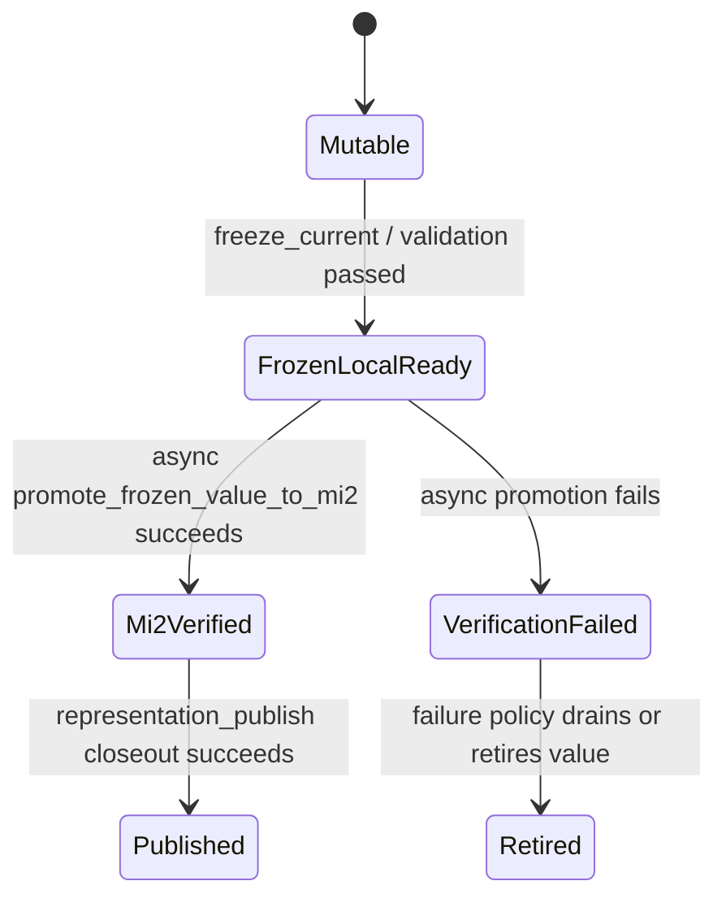

# Summary

Define the long-term TensorCast design for `BINDING_FINALIZE` and related
bootstrap flows so that:

- a daemon-owned binding is the single realization host for the future serving
  representation,
- TensorCast owns source-to-target data movement into binding-backed CUDA
  memory,
- serving-artifact identity is minted from the sealed binding current value
  rather than from a second `put(tensors)` registration path,
- optimistic local-ready serving may activate a frozen same-daemon binding
  value before that value has been promoted to `mi2`, provided the value remains
  visibly pending verification and local-only,
- `representation_publish` is completed from a first-class serving publication
  subject instead of requiring a pre-existing serving artifact id in all cases,
- and `canonical_full` assembly sealing consumes explicit canonical source
  evidence instead of reconstructing or backfilling bytes from
  `workspace_assembly_id`.

This design intentionally changes several current assumptions.

The main correction is not "make the current slow path faster."
The main correction is:

- remove the second publication truth,
- remove workspace-driven canonical backfill,
- and make the serving realization subject explicit and first-class.

Execution-policy note:

- `0112` owns shipped public ingress, same-binding correctness, and the audited
  same-binding serving-path closure,
- `0108` now owns the shared strategy and explicit lane-planning rules that the
  source-bound path consumes,
- `0115` now owns the long-term mounted-source artifact attestation contract,
  including format-aware mounted-source resolve, `msa1:` identity, and typed
  trusted policy,
- `0115` also owns the authority boundary that lets trusted `msa1:` evidence
  admit optimistic same-daemon local-ready serving without making `msa1:` a
  content-verified publication identity,
- and the mounted closure evidence now tracks directly through this design plus
  `docs/benchmarks/20260415-qwen2.5-32b-mounted-collective-first-v4-serving-evidence.md`.

Group realization note:

- `0117` may coordinate a multi-member serving version before runtime injection,
  but it must enter this path through staged retained values, serving prefetch,
  or explicit group-aware acquire;
- `0117` does not replace the same-binding publication subject or create a
  second publication truth;
- live in-place group replacement of an already current binding value remains
  outside the shipped `0112` scope until a separate cutover design defines the
  required double-buffering, admission fences, and traffic switch semantics.

# Implementation Status

As of `2026-04-10`, the repository has landed the main repo-local contract and
ingress pieces for `0112`, and the audited Step3p5 same-binding mounted path is
closed end-to-end:

- `RepresentationPublishContract` is no longer artifact-id-only; it now carries
  a first-class `ServingPublicationSubject` / `BindingValueRef` union in proto
  and typed Python models.
- binding-native `complete_*_publication_from_binding(...)` helpers now emit a
  binding-value publication subject directly instead of helper-layer
  "promote then rebuild old contract" adaptation.
- daemon representation-publish closeout now consumes that subject directly and
  performs binding-value promotion inside the serving-publication domain.
- canonical-full cut-driven seal is fail-closed in repo-local code:
  `seal_from_cut.materialize_cpu_canonical_fallback` is gone, and missing local
  canonical source now raises an invariant failure.
- public disk ingress now exists through `PublicDiskSourceHandle`,
  `ResolvePublicDiskSource`, `Store.resolve_public_disk_source(...)`, and
  `Store.realize_into_binding(...)`.
- follow-up direction from `0115`: this ingress should converge from a public
  source-handle-shaped contract to daemon-attested mounted-source artifacts
  (`msa1:`), so binding-native flows stay artifact-first without requiring
  cold-path `mi2:` hashing.
- same-binding README guidance now points users at the binding-native path
  rather than presenting tensor-publication helpers as the preferred surface.
- the audited Step3p5 path now reaches `stage=ready` through public disk
  ingress, `BindingRealizationPlan`, binding-subject publication, and
  fail-closed canonical-full seal without taking runtime fallback.
- the ready service also serves a real validation completion request, so the
  path is no longer blocked on correctness.
- the audited mounted operator packet now includes collective-dominant
  realization evidence:
  - `collective_handled=1`,
  - `actual_collective_committed_bytes=25550556928`,
  - `dominant_executor=OwnerFileCollectiveExecutor`,
  - `publish_hash_rounds=0`,
  - `publish_hash_location=seal`,
  - `publish_hash_backend=gpu`,
  - and `publish_hash_identity_forming=True`.

`0112` is now complete at its shipped scope.

That shipped scope is explicit:

- binding-native publication is the preferred same-binding path for
  `canonical_full`,
- tensor-entry publication helpers remain available only as explicit
  `*_bridge(...)` surfaces,
- and `BindingRealizationPlan` is the public work-item-list contract that the
  repo now ships.

The remaining work after this design closeout is no longer shipped-correctness
blocker work. It is:

- shared strategy-plane follow-up owned by `0108`,
- owner-file collective executor rollout owned by `0109`,
- and retained mounted evidence recorded directly in this design plus
  `docs/benchmarks/20260415-qwen2.5-32b-mounted-collective-first-v4-serving-evidence.md`.

In particular:

- `0112` closed the correctness path for binding-native same-binding serving
  startup and now also records the audited Step3p5 same-binding closure result,
- while the shared runtime strategy trunk that feeds that path is owned by
  `0108`,
- and the remaining mounted operator evidence is now captured directly in the
  surviving design and benchmark record rather than in a standalone companion
  plan.

# Target-State Alignment With `0120` / `0121`

`0112` remains the binding-native realization and publication correctness
record. Under `0120` and `0121`, the same behavior becomes one binding-backed
target kind inside artifact realization.

The target interpretation is:

- same-binding startup is a binding target realization with representation
  admission, not a separate serving loader;
- `BindingRealizationPlan` remains valid as an execution/representation plan,
  but the public entry should converge to `ArtifactRealizationSpec` and
  `ArtifactRealizationHandle`;
- local-ready values stay non-durable until explicit representation publication;
- runtime replica publication remains an action on an artifact-backed binding
  value and must not become a second publication truth.

## Additional mounted closure evidence

The `2026-04-15` local qwen2.5 TP4 mounted rerun on the current public operator
path adds the second representative `BINDING_FINALIZE` family that was still
missing when this design first narrowed its scope.

The current `/weight_version` packet shows:

- `bootstrap_source_bound_contract_version=4`
- `bootstrap_source_bound_contract_path=collective_first_v4`
- `bootstrap_realize_collective_policy=collective_first`
- `bootstrap_realize_collective_used=true`
- `bootstrap_realize_actual_collective_committed_bytes=16382928896`
- `bootstrap_realize_actual_generic_backend_bytes=0`
- `bootstrap_realize_dominant_executor=OwnerFileCollectiveExecutor`
- `bootstrap_publish_hash_rounds=0`
- `bootstrap_publish_hash_location=seal`
- `bootstrap_publish_hash_backend=gpu`
- `bootstrap_publish_hash_identity_forming=true`

The same live run also reached:

- `GET /health = 200`
- `GET /v1/models = 200`
- `POST /v1/completions = 200`

This means the second-family `BINDING_FINALIZE` packet is no longer deferred.
What remains outside `0112` scope is performance interpretation and broader
defaulting policy, not same-binding correctness or missing operator evidence.

# Closure Summary

## 1. Publication subject model is now sunk into proto and closeout contracts

This repo-local blocker is now closed.

`RepresentationPublishContract` and `RepresentationPublishSpec` now carry a
first-class `ServingPublicationSubject` / `BindingValueRef`, and daemon
closeout consumes that subject directly. Binding-native publication no longer
has to fabricate an artifact-id-only contract at the SDK helper layer.

The remaining work is no longer "sink the model." The remaining work is
integration semantic closure on top of the sunk model.

## 2. The remaining `canonical_full` CPU fallback has been removed

This repo-local blocker is now closed.

`core/store/runtime/ingestion/materialization_facade.cc` no longer retains
`seal_from_cut.materialize_cpu_canonical_fallback`. Canonical-full seal now
uses either explicit binding-backed canonical evidence or an already-available
local canonical source; otherwise it fails closed with an invariant message.

The remaining work here is test cleanup and broader ingestion-suite noise, not
restoring or redesigning fallback behavior.

## 3. Public disk-source ingress now exists

This repo-local blocker is now closed.

TensorCast now exposes a metadata-first public disk ingress, and
`Binding.realize_from(...)` / `Store.realize_into_binding(...)` can consume it
directly. Integrations no longer need to call `from_disk()` just to re-enter
the ordinary target materialization path.

What remains is audited integration migration onto that ingress, not the
absence of the ingress itself.

## 4. Audited Step3p5 integration semantics are now closed to same-binding

For the audited Step3p5 path, this blocker is now closed in practice.

The validated cold-start chain is:

1. resolve public disk source,
2. lower the recipe into `BindingRealizationPlan`,
3. realize directly into the daemon-owned binding host,
4. finalize on the same bound runtime tensors,
5. publish from the same binding value subject,
6. seal canonical-full from explicit binding-backed source evidence,
7. reach ordinary serving runtime without runtime fallback.

The broader repo now uses the same rule for all `BINDING_FINALIZE` families:
same-binding publication is the only admitted path. The audited Step3p5 family
therefore no longer routes through tensor-publication helpers or runtime bridge
behavior.

## 5. Remove tensor-publication helpers for `BINDING_FINALIZE`

This blocker is now closed.

Tensor-entry `BINDING_FINALIZE` helper names have been removed from the public
surface. Same-binding code no longer has a path back to the older
register-then-closeout model.

## 6. Step3p5 runtime bridge is now closed

This blocker is now closed for the audited Step3p5 path.

The public realization contract and the admitted Step3p5 trace plan now meet
without a late runtime bridge. The path either lowers into
`BindingRealizationPlan` or fails earlier; it no longer drops at runtime to
legacy `tensor_dict/materialize_subset(...)`.

What remains after this closure is not "remove one more bridge." What remains
is optimize the slow but now-correct path.

## 7. Audited mounted closure and remaining follow-up

For the audited Step3p5 same-binding path, the old "generic-dominant mounted
baseline" is no longer the current state. The closure packet now shows:

- collective-dominant realization on the audited operator path,
- same-binding serving readiness through the binding-native publication subject,
- one surviving identity-forming seal hash on the audited path,
- and operator-visible typed execution plus hash facts sufficient to treat the
  audited closure as complete.

What remains after that audited closure is not new `0112` architecture work.
The remaining work is:

- retained mounted evidence in the benchmark note cited above,
- shared strategy or local-executor follow-up under `0108`,
- and owner-file collective executor rollout under `0109`.

## Secondary closure items

These scope mismatches are now closed by explicit narrowing.

- binding-native publication is the completed same-binding path for
  `canonical_full`; `pp` / `ep` remain available through the repo-owned
  structural publication trunk rather than through binding-native publication.
- `BindingRealizationPlan` is now the documented public work-item-list
  contract (`entries[]` with copy/fill operations). It is no longer described
  here as a placeholder for a richer subject-bound public plan.

# Why This Design Exists

The current repository already points toward a binding-native serving builder
shape, but the execution path is still split across two inconsistent models.

`0111` already says the preferred `BINDING_FINALIZE` path is:

1. create the future serving binding,
2. materialize source bytes directly into binding-hosted target storage,
3. run finalize on that same binding-hosted storage,
4. seal the current value,
5. promote the same finalized bytes into a durable serving artifact,
6. complete `representation_publish`.

See `0111` section 4.4 for the required same-binding path.

The old implementation combined that intended shape with an older
tensor-entry publication flow:

- vLLM and the SDK could build finalized serving tensors in memory, register a
  new serving artifact from those tensors, and only then perform
  `representation_publish`.
- canonical-full contribution still re-materializes publication tensors into a
  temporary binding-backed contribution object instead of contributing the
  original serving realization host.
- `seal_from_cut(canonical_full)` still contains a fallback path that tries to
  materialize a CPU replica for `workspace_assembly_id` when no local canonical
  source is found.

These shapes are individually understandable, but together they violate the
separation that `0084`, `0105`, and `0111` are trying to preserve.

# Problem Statement

The present code path mixes four different truths that should not be conflated.

## 1. Binding current value and serving artifact are not aligned

`0084` is explicit:

- `Binding` is local binding-plane state,
- `seal_current(...)` produces a local sealed value,
- and global artifact identity is an explicit promotion concern, not an
  automatic side effect of sealing.

That boundary is correct.

What is missing is a first-class promotion path from
`SealedBindingValue -> serving artifact` inside the serving publication domain.

Instead, the old `BINDING_FINALIZE` helper path commonly did this:

1. realize bytes into binding-backed tensors and then rebuild a tensor mapping,
2. finalize,
3. build a second tensor mapping,
4. `put(...)` or register those finalized tensors,
5. treat that newly registered artifact as the serving artifact,
6. separately use canonical-full assembly closeout.

That means the canonical serving bytes exist twice on the same node:

- once in the binding host that runtime may already be attached to,
- once in the newly registered serving artifact path.

This duplication is not merely an optimization concern.
It means the serving artifact identity is no longer obviously anchored in the
same subject that runtime actually uses.

## 2. `representation_publish` requires a pre-existing serving artifact id

The current `RepresentationPublishContract` assumes the serving artifact
already exists and carries `serving_artifact_id`.

That is correct for:

- offline builders,
- pipeline builders,
- and already-materialized durable serving artifacts.

It is incomplete for same-binding bootstrap builders.

In the same-binding case the authoritative subject immediately after finalize is
not "an existing serving artifact."
It is "a sealed binding current value that now contains final serving bytes."

Forcing same-binding bootstrap to fabricate a serving artifact first by
registering another tensor mapping collapses the distinction between:

- realization host,
- publication subject,
- and durable serving artifact.

## 3. `workspace_assembly_id` is being treated like a data host

`0105` explicitly says:

- `workspace_assembly_id` is structural workspace identity,
- it is not semantic attempt identity,
- and correctness after cut capture must not depend on live workspace
  reconstruction.

The current fallback in `seal_assembly_from_cut(canonical_full)` conflicts with
that model.

If the seal worker cannot find a local canonical source for
`workspace_assembly_id`, it falls back to:

- `materialize_replica(CPU, hints.artifact_id = workspace_assembly_id)`,
- which may trigger P2P or transport backfill,
- and which turns a contract failure into a late and expensive runtime wait.

That fallback does not merely cost time.
It hides an invariant violation:

- canonical-full contribution admission succeeded,
- but the coordinator still cannot resolve a sealable canonical source.

## 4. The public target-materialization contract is too weak

Current public mapped-binding / mapped-target flows expose `CopyPlan v1`,
which only represents copy and range selection.

But the internal TensorCast representation system already supports:

- tensor copy,
- const fill,
- scalar broadcast fill,
- concat assembly,
- and residual byte-range fallback.

`BINDING_FINALIZE` recipes frequently need more than "copy these tensor slices."
If the public realization surface remains fixed to `CopyPlan v1`, the system
either:

- keeps copy in Python forever,
- or grows ad-hoc escape hatches next to the real internal contract.

Neither is acceptable as a long-term design.

# Design Goals

- Make the binding-backed current value the single authoritative realization
  subject for same-binding source-to-serving flows.
- Keep `0084`'s local/global boundary intact: sealing does not automatically
  mint global identity, but promotion from the sealed value is explicit and
  first-class.
- Keep `0105`'s cut-driven seal model intact: seal consumes snapped attempt
  truth and explicit source evidence, not workspace reconstruction or fallback.
- Preserve `0111`'s distinction between builder mode, same-binding admission,
  semantic identity, and publication lineage.
- Push source-to-target copy and fill into TensorCast whenever the operation is
  representable by TensorCast's internal realization contracts.
- Reuse existing `DiskLoader`, `materialize_into_target`,
  `materialize_mapped_into_target`, and collective mapped-target disk paths
  rather than introducing a parallel bootstrap-only disk implementation.
- Leave framework-specific finalize logic in the integration layer when it is
  not expressible by TensorCast contracts, but keep that finalize anchored on
  TensorCast-owned binding-backed storage.

# Non-Goals

- This design does not make local `seal_current(...)` itself routable or
  publishable.
- This design does not collapse `binding.publish_replica()` into
  `representation_publish`; ordinary replica routing remains distinct from
  source-to-serving publication lineage.
- This design does not require every framework-specific finalize kernel to move
  into TensorCast immediately.
- This design does not preserve tensor-entry or scratch-host
  `BINDING_FINALIZE` publication.
- This design does not redefine offline builder publication.

# Core Principles

## Principle 1: One realized byte owner

For a same-binding serving build there must be exactly one authoritative owner
of finalized serving bytes on the local node before durable publication:

- the daemon-owned serving binding current value.

If another full serving byte copy exists solely to mint serving identity, the
design has already drifted.

## Principle 2: Promotion is explicit, but subject-first

Promotion from binding-plane state into artifact-plane state remains explicit.
However, the promotion must operate on the sealed binding value itself.

That means the subject of promotion is not "a new tensor dict."
It is "this sealed binding current value."

## Principle 3: `workspace_assembly_id` is coordination state, not data truth

Attempt-domain coordination may name `workspace_assembly_id`, but canonical-full
seal correctness must not rely on materializing bytes out of that workspace id.

Canonical-full seal must instead consume explicit canonical source evidence from
the readiness cut.

## Principle 4: Public realization contracts must converge on internal truth

The long-term public realization surface must align with the internal
`RepresentationWorkPlan`, not with a weaker one-off copy-only contract.

## Principle 5: Disk bootstrap must use ordinary TensorCast loaders

Local bootstrap from checkpoint directories should still use the same disk
materialization primitives that ordinary target materialization uses:

- `DiskLoader`,
- `materialize_into_target`,
- `materialize_mapped_into_target`,
- and collective mapped-target disk execution.

Bootstrap is not allowed to permanently fork its own disk data plane.

# Proposed Model

## 1. Introduce a first-class serving publication subject

`representation_publish` must no longer require that every caller already has a
durable serving artifact id.

Instead, `RepresentationPublishContract` should carry a serving publication
subject:

```proto
message BindingValueRef {
  string binding_id = 1;
  string binding_layout_id = 2;
  string binding_value_id = 3;
  uint64 seal_generation = 4;
}

message ServingPublicationSubject {
  oneof ref {
    string serving_artifact_id = 1;
    BindingValueRef binding_value = 2;
  }
}
```

Then `RepresentationPublishContract` should use:

- `subject = serving_artifact_id` for offline or pre-registered serving
  artifacts,
- `subject = binding_value_ref` for same-binding bootstrap publication.

This preserves one publication truth while allowing the binding-native path to
avoid the extra register step.

## 2. Make `SealedBindingValue` promotable to a serving artifact

Add an explicit promotion API at the engine/daemon/SDK layers.
This API belongs to the builder/publication domain, not to ordinary binding
lifecycle semantics.

Possible surfaces:

- C++ / daemon concept: `promote_binding_current_value`
- Python helper: `Store.promote_binding_current_value(...)`
- integration-facing helper:
  `Store.complete_binding_finalize_from_binding(...)`

This operation:

1. validates that the referenced current value is still current and immutable,
2. validates that the supplied serving canonical index matches the binding
   layout contract,
3. computes `index_multihash` from the final serving canonical index,
4. computes `data_multihash` from the sealed binding-hosted bytes,
5. mints or joins the serving MI2 id,
6. registers/publishes the resulting serving artifact descriptor,
7. returns a durable `RegisteredArtifact` or equivalent descriptor.

This is the key architectural replacement for the current
tensor-entry `BINDING_FINALIZE` publication path.

Normative rules:

1. promotion from a sealed binding current value is not a second publication
   truth; it is the serving-subject resolution step that precedes
   `representation_publish` closeout,
2. promotion must remain fail-closed and typed,
3. and plain `Binding` lifecycle semantics from `0084` remain unchanged:
   `seal_current(...)` alone still does not create a durable artifact.

## 3. Distinguish realization host from durable serving artifact

The same-binding flow must expose three distinct states:

- mutable daemon-owned binding host,
- local sealed binding current value,
- durable serving artifact promoted from that current value.

Optimistic local-ready serving adds one visibility state without changing those
objects:

- `FROZEN_LOCAL_READY`: the daemon has frozen the realized binding current value
  and the integration has passed structural, manifest, representation-contract,
  and family semantic validation, but `mi2` promotion has not completed yet.

Normative rules:

1. runtime may attach to binding-backed tensors before promotion completes.
   In strict canonical mode, serving-only activation still waits for the durable
   serving artifact. In optimistic mode, same-daemon serving-only activation may
   proceed from `FROZEN_LOCAL_READY`, but final publication success, durable key
   activation, Global Store routing, and cross-daemon reuse still depend on the
   promoted `mi2` serving artifact.
2. `seal_current(...)` is not enough for serving publication success.
3. promotion must not require a second model-sized byte registration path.
4. optimistic promotion must start only after local-ready runtime state is
   installed and all local tensor-parallel ranks admitted to the bootstrap have
   crossed the local-ready barrier. A fast rank must not begin identity-forming
   hash or commit work while slower ranks are still refilling, freezing, or
   finalizing their binding current values.
5. no serving artifact config, canonical bootstrap cache entry, durable key
   activation, or Global Store route may be written from `FROZEN_LOCAL_READY`.
   Those updates happen only after promotion has produced `mi2` and
   `representation_publish` closeout has succeeded.

The optimistic state machine is:



`freeze_current` is a mutation fence and local-readiness operation. It must not
mint a content identity. `seal_current` remains available as the strict helper
that freezes and performs identity-forming promotion on the blocking path.
Implementations may expose `FROZEN_LOCAL_READY` as `READY_LOCAL` plus explicit
verification metadata rather than adding a new flattened daemon state enum.

## 4. Canonical-full contribution becomes source-evidence contribution

For repo-owned canonical-full publication, TensorCast should contribute explicit
canonical source evidence derived from the sealed binding current value.

That means:

- canonical-full contribution no longer implies "workspace has a separate local
  canonical artifact registration",
- and `SubmitBindingContribution` must capture a subject ref that the
  coordinator can later seal from.

The source-evidence record can initially be narrow:

- `binding_value_ref`
- `contributor_daemon_id`
- byte-space kind = canonical
- layout or index digest needed for validation

Future versions may admit additional source kinds, but canonical-full
bootstrap should start with the binding-value path only.

## 5. Readiness cut must carry canonical source evidence

`AssemblyReadinessCut` already carries structural evidence for view-backed
paths.

It must be extended so the canonical-full slot carries explicit canonical
source evidence. Seal workers must consume that evidence directly.

This makes the cut, not the workspace, the authority root for canonical-full
seal.

## 6. `seal_from_cut` must not backfill canonical bytes

The fallback path in `seal_assembly_from_cut` that calls
`materialize_replica(CPU)` when no local source is found must be removed.

If canonical-full seal cannot resolve a canonical source from the snapped cut,
the attempt has violated its contract and must fail closed.

This is not an optimization.
It is a correctness rule.

# Realization Data Flow

## Required same-binding flow

For `BINDING_FINALIZE`:

1. compile recipe into:
   - final serving canonical layout
   - public binding realization plan
   - framework finalize requirements
2. create a daemon-owned binding for that layout
3. TensorCast realizes source bytes directly into the binding-backed CUDA
   storage
4. the integration layer attaches framework views onto the binding tensors
5. framework-specific finalize runs in-place on the binding-backed tensors
6. TensorCast freezes or seals the binding current value
7. strict mode promotes the frozen current value into a durable serving artifact
   before readiness; optimistic mode schedules that promotion asynchronously
   after local-ready state is installed and the local-ready barrier completes
8. TensorCast completes `representation_publish` after promotion produces
   `mi2`
9. canonical-full contribution uses the same current-value-derived source
   subject
10. runtime handoff continues to use the same binding-backed tensors without a
    second model-sized copy

## Removed bridge flow

Builder-local scratch realization followed by commit into a serving target is
not admitted for `BINDING_FINALIZE`. A family that cannot validate the
same-binding path must fail admission rather than publish through a slower
generic bridge.

# Public Realization Contract

## Why `CopyPlan v1` is insufficient

The current public mapped binding contract only exposes:

- source tensor name,
- source range,
- destination tensor name,
- destination range.

That is enough for a narrow subset of copy-only mapped writes.
It is not enough for full `BINDING_FINALIZE` recipe execution because it cannot
express:

- const fills,
- scalar broadcast fills,
- concat or generalized representation work,
- or other future work items already modeled by `0110`.

## `BindingRealizationPlan` as the shipped public contract

The shipped public realization contract is a stable work-item list:

- `BindingRealizationPlan = Sequence[BindingRealizationEntry]`
- each entry names one destination tensor and one operation kind,
- the currently admitted public operation kinds are tensor copy, const fill,
  and scalar fill,
- and the target canonical index bytes remain binding-layout owned rather than
  embedded again inside the plan payload.

This is intentionally narrower than TensorCast's internal
`RepresentationWorkPlan`.

That narrowing is now explicit design scope rather than an unfinished gap.
`0112` requires that the public plan preserve the meaning of admitted work
items, not that it surface every internal representation-work knob.

## Naming Compliance

The interfaces proposed here follow the repository naming rules.

- Proto messages / Python models use `PascalCase`:
  `BindingValueRef`, `ServingPublicationSubject`,
  `RepresentationPublishContract`, `BindingRealizationPlan`,
  `BindingRealizationEntry`.
- Functions and methods use `snake_case`:
  `promote_binding_current_value`, `realize_from`,
  `realize_into_binding`, `complete_binding_finalize_publication_from_binding`.
- Enum constants remain `ALL_CAPS`:
  `BINDING_REALIZATION_OP_KIND_COPY`,
  `BINDING_REALIZATION_OP_KIND_CONST_FILL`,
  `BINDING_REALIZATION_OP_KIND_SCALAR_FILL`.

## Execution surface

Add a public SDK method:

- `Binding.realize_from(source, plan, ...)`
  or
- `Store.realize_into_binding(binding, source, plan, ...)`

Execution responsibility:

- TensorCast resolves the source,
- TensorCast selects disk / local / p2p transport,
- TensorCast executes work into the binding target layout,
- TensorCast owns pinned staging, target sinks, and collective load decisions.

The integration layer only prepares the plan and invokes framework finalize.

Normative execution rule for the same-binding builder path:

- `Binding.realize_from(...)` / `Store.realize_into_binding(...)` are
  execution-only ingress points;
- they write source bytes into binding-backed target storage but do not
  implicitly seal, mint identity, or return a publication-ready current value;
- audited `BINDING_FINALIZE` flows must therefore use
  the explicit binding update window:
  `begin_update(...) -> realize_from(...) -> framework finalize -> seal_current(...)`;
- the public ingress remains one ingress, but its correct long-term semantics
  are direct target-state semantics rather than compatibility-preserving
  implicit sealing.

# Disk and Source Resolution

## Long-term disk model

Bootstrap from checkpoint directories should not require a permanent detour
through a fully materialized source artifact in Python memory.

Long-term, TensorCast should expose and consume a metadata-first mounted-source
artifact attestation path, not a permanent public source-handle plane and not
an import-style artifact minting detour.

That mounted-source artifact should carry:

- primary `artifact_id = msa1:...`,
- optional `trusted_content_artifact_id = mi2:...` when already known from a
  trusted descriptor or explicit verification path,
- canonical index bytes,
- format-aware mounted-source facts,
- explicit metadata capability (`TENSOR_AWARE` or `BYTE_ONLY`),
- stable daemon-local validation and mutation policy inputs,
- and enough source provenance to feed the shared lowering truth seam.

`realize_into_binding(...)` can then accept either:

- an artifact-backed source ref,
- or a mounted-source artifact resolved from a local path.

`0115` now defines the detailed mounted-source resolve contract for that
artifact, including partitioned vs safetensors source semantics, the
daemon-session-local authority boundary for `msa1:`, strict snapshot
revalidation before read, and the rule that default mounted resolve stays
lightweight instead of hashing payload bytes into primary `mi2:` identity.

`Store.from_disk(...)` remains an artifact-import bridge, not the intended
`0112` ingress model.

## Reuse current disk loaders

The new path must be built on the existing target materialization stack:

- `DiskLoader`
- `materialize_into_target`
- `materialize_mapped_into_target`
- collective mapped-target disk execution

This is already the correct daemon data plane for source-to-target writes.

When disk metadata is complete, the daemon already prefers direct disk materialization
for target-layout writes.
The new API should surface that path rather than bypassing it.

# Assembly and Attempt Semantics

## Current mismatch

Today canonical-full contribution admission can succeed even though the seal
worker later cannot resolve a local canonical source and falls back to
transport-backed CPU materialization.

This means slot `accepted` is too weak.

## New rule for canonical-full

For canonical-full:

- `accepted` means the authoritative attempt domain now contains explicit,
  cut-snapshottable canonical source evidence.
- seal correctness later depends only on that source evidence and immutable
  attempt truth.
- seal is not allowed to perform best-effort workspace backfill.

Initial scope:

- canonical-full source evidence from daemon-owned sealed binding current values
  on the coordinator daemon.

Future extensions can introduce routed or remote canonical source subjects, but
those must be explicit and versioned, not implicit fallbacks.

# Promotion and Identity

## Serving identity source

For same-binding serving builds:

- `index_multihash` comes from the final serving canonical index bytes,
- `data_multihash` comes from the finalized serving bytes hosted by the sealed
  binding current value,
- therefore serving MI2 identity is derived from the same bytes runtime is
  already using.

This is the long-term answer to the current `registration_commit` cost.

The binding-native path should not need:

- stable-dram D2H copy,
- stable-dram CPU data hash,
- or a second tensor registration only for identity minting.

## GPU hash rule

If the promoted binding current value corresponds to the final canonical serving
byte space, TensorCast must hash those bytes directly on GPU.

If a future promoted target layout is not identical to canonical logical byte
order, TensorCast must hash the logical canonical byte stream implied by the
target layout and canonical index, not the raw storage order.

Raw-storage hashing is only valid when raw storage order and canonical byte
order are the same contract.

For the audited same-binding `canonical_full` startup path, this rule is
mandatory rather than opportunistic:

- the single surviving identity-forming full-data hash must execute on GPU;
- D2H/CPU hashing is not an equivalent success mode for that audited path;
- if TensorCast cannot prove the GPU-hash preconditions for that path, the
  operation must fail closed rather than silently downgrading.

## Same-Binding Seal-Reuse Metadata Convergence

The same-binding seal-reuse closeout contract also requires one canonical-index
byte truth after the surviving seal identity already exists.

Normative rules:

- when same-binding `canonical_full` closeout reuses a sealed binding identity,
  the canonical-index bytes carried by that reused identity are the single
  canonical-index truth for closeout metadata;
- artifact descriptor materialization and GS memory-replica registration must
  agree with the reused `artifact_id` / `index_multihash`;
- and if TensorCast cannot prove that agreement, closeout must fail closed
  rather than publishing mixed metadata.

Implemented on `2026-04-10`:

- same-binding closeout now resolves one registration canonical-index payload
  from the reused sealed identity when present, rather than falling back to
  `snapshot.target_index_json`;
- closeout now rejects:
  - reused seal identities missing `canonical_index_json`,
  - canonical-index bytes whose recomputed `index_multihash` would diverge
    from the published artifact identity,
  - and any closeout result that mutates the reused
    `artifact_id` / `index_multihash` / `data_multihash`;
- repo coverage for this invariant now lives in:
  - [assembly_closeout_identity_utils_test.cc](/data/workspace/tensorcast-280/daemon/service/assembly_closeout_identity_utils_test.cc)
  - [grpc_service_impl_start_seal_assembly_test.cc](/data/workspace/tensorcast-280/daemon/service/grpc_service_impl_start_seal_assembly_test.cc)
  - [test_assembly_attempt.py](/data/workspace/tensorcast-280/tests/python/test_assembly_attempt.py)

# Compatibility and Migration

## Keep existing offline publication path

The existing `serving_artifact_id`-based publication contract remains valid for:

- offline builders,
- pipeline builders,
- pre-registered serving artifacts.

No behavior change is required for those callers.

## Reclassify current helper paths

The current helpers should be classified as follows:

- `Store.complete_pure_transform_publication_from_binding(...)`
  - preferred same-binding closeout entry for `PURE_TRANSFORM`
  - subject-first closeout on the sealed binding current value
- `Store.complete_binding_finalize_publication_from_binding(...)`
  - required same-binding closeout entry for `BINDING_FINALIZE`
  - subject-first closeout on the sealed binding current value
- `Store.from_disk(...)`
  - remains an import-oriented API
  - not the intended Phase 5 public realization ingress for same-binding
    bootstrap
- `binding.publish_replica()`
  - unchanged
  - ordinary artifact-backed replica routing only

## Migration sequence

1. sink the serving publication subject into both proto layers and the typed
   SDK contract.
2. remove the remaining canonical-full CPU fallback and make missing local
   canonical source fail closed.
3. complete the public metadata-first mounted-source artifact semantics from
   `0115` and route `realize_into_binding(...)` through that artifact-first
   contract rather than through artifact-id-only assumptions.
4. switch audited integrations such as `/data/workspace/internal-vllm` to the
   same-binding host-and-publication model end to end.
5. rename tensor-entry publication helpers to explicit `*_bridge(...)`
   surfaces and stop exposing the old ambiguous names.
6. narrow the shipped `0112` scope explicitly:
   binding-native publication is `canonical_full`, and
   `BindingRealizationPlan` is the public work-item-list contract.

# Risks and Constraints

## Framework finalize is still integration-owned

This design intentionally does not require TensorCast to own every
framework-specific finalize kernel.

The integration layer may still:

- build the runtime model,
- attach binding-backed tensors,
- run `process_after_load`,
- and run semantic probes.

That is acceptable as long as:

- the bytes being finalized live on TensorCast-owned binding storage,
- and publication is derived from the resulting sealed current value.

## Public plan design must avoid overfitting to one integration

The first consumer is `/data/workspace/internal-vllm`, but the public
`BindingRealizationPlan` must not hardcode vLLM-specific naming or framework
assumptions.

## Promotion must be fail-closed on layout mismatch

Promotion from binding current value to serving artifact must validate:

- binding layout vs supplied canonical index,
- manifest tensor carrier presence and shape,
- serving artifact preflight invariants,
- and subject freshness (`binding_value_id`, seal generation, currentness).

# Validation Strategy

## Required acceptance outcomes

The final preferred same-binding path must satisfy all of the following:

- `RepresentationPublishContract` no longer forces `serving_artifact_id` as
  the only serving publication subject,
- the audited Step3p5 loading chain completes without runtime fallback or
  bridge behavior,
- same-binding / binding-finalize audited families no longer route to tensor
  entry or bridge publication,
- no `registration_commit.stable_dram.stage_gpu_copy` on the binding-finalize
  publication critical path,
- no `registration_commit.hash.data.cpu` on the same path,
- no `seal_from_cut.materialize_cpu_canonical_fallback`,
- no required `from_disk()` artifact import before disk-backed target
  materialization,
- no second model-sized canonical-byte copy whose sole purpose is serving
  identity minting,
- and serving MI2 identity derived from the final binding-hosted bytes.

## Tests

Required test areas:

- publication-subject proto / SDK round-trip for artifact subject vs
  binding-value subject,
- binding current-value promotion correctness and idempotency,
- canonical-full contribution and cut-driven seal without fallback,
- direct disk -> binding target materialization,
- collective mapped-target disk load for TP bootstrap,
- same-binding serving handoff preserving tensor pointer stability,
- manifest and representation contract preflight during promotion,
- optimistic local-ready barrier ordering before async promotion starts,
- no canonical cache/config/key update while verification is pending,
- Step3p5 trace-plan gap lowering vs early rejection,
- explicit bridge helper naming and bridge-path coverage.

# Review Checklist

Before implementation starts, reviewers should explicitly check the following.

- Does the design preserve `0084`'s local/global separation while still giving
  same-binding flows a first-class promotion path?
- Does the design remove workspace-driven canonical backfill instead of hiding
  it?
- Does the design avoid making `CopyPlan v1` the long-term public contract?
- Does the design ensure disk bootstrap reuses ordinary TensorCast disk loaders?
- Does the design keep offline publication intact while changing same-binding
  publication semantics?
- Does the design keep `representation_publish` as the only publication trunk
  instead of inventing another serving-publication truth?

# Decision

TensorCast should adopt a binding-native source-to-serving architecture for the
preferred `BINDING_FINALIZE` path.

The binding current value remains binding-plane state, but it becomes the
first-class serving publication subject for same-binding builders.

This is the architectural correction required to:

- remove the duplicate publication path,
- remove workspace-driven fallback,
- and align serving identity with the actual finalized serving bytes.
