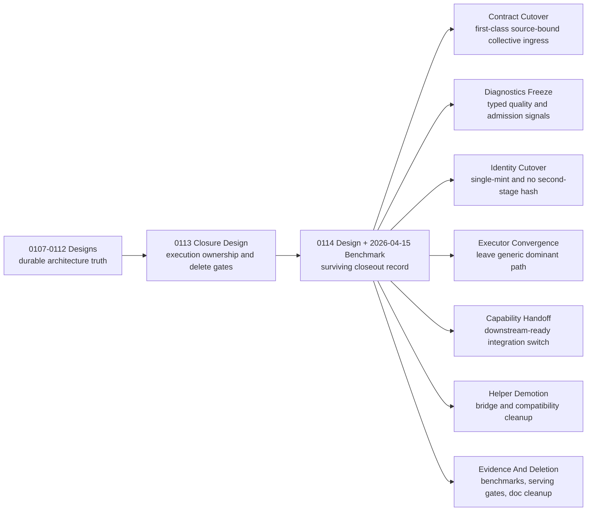

# Summary

Define the closure strategy for the remaining Example TP Model-facing work after the
architectural cuts from `0107` through `0112`.

This design does not replace those designs. It defines how to finish them
cleanly, how to keep documentation authoritative while doing so, and which
TensorCast-side contracts must be frozen before downstream `vllm`
follow-up code should start.

The key policy is:

- `0107` through `0112` remain the architectural source of truth for the
  planes, contracts, and invariants they introduced;
- the remaining undo items, delete gates, capability handoff rules, and
  execution-order constraints remain owned by this `0113` closure design;
- the historical `0114` execution checklist is now retired and the surviving
  closeout evidence lives in:
  - `docs/designs/0114-collective-first-binding-realization-for-tp-serving-startup.md`
  - `docs/benchmarks/20260415-qwen2.5-32b-mounted-collective-first-v4-serving-evidence.md`
- `docs/plans/0113-example-tp-model-closure-and-sot-convergence.md` remains a historical
  closure-handoff record rather than an active total plan;
- the old split execution notes under `0108` through `0112` are folded back
  into their owning designs and deleted so they do not continue to compete as
  parallel SOT.

The remaining closure work has seven slices:

1. source-bound collective contract cutover,
2. diagnostics and admission-signal freeze,
3. single-mint identity and closeout hashing cutover,
4. source-bound executor convergence,
5. downstream capability handoff,
6. builder/helper demotion and acceptance hardening,
7. evidence-driven legacy deletion.

# Goals / Non-Goals

## Goals

- Keep one active execution SOT for the remaining `0107`-`0112` closure work.
- Keep the base architecture in the existing designs instead of reopening it in
  a new plan-only document.
- Explicitly track the residual undo items that still matter for Example TP Model:
  - source-bound collective ingress still relying on side-channel lowering,
  - missing typed collective policy and typed fallback reasons,
  - missing stable execution/hash/identity diagnostics for downstream
    integrations,
  - second-stage closeout hashing and lack of single-mint effect,
  - source-bound mapped execution staying on generic dominant executor,
  - and prototype or compatibility scaffolding that should be deleted once the
    new path is proven.
- Freeze the TensorCast-side contracts that downstream `vllm`
  follow-up code needs before it can safely switch from compatibility bridges to
  first-class source-bound APIs.
- Treat unlaunched-project status as a design constraint: `0113` should optimize
  for the final contract and final code shape, not for preserving broad
  historical compatibility inside this repository.
- Make delete gates explicit so compatibility-only scaffolding does not become
  permanent.
- Use the docs-system rule from `0001` as intended:
  plans may be deleted once their landed results are folded back into the
  design and one active plan remains.

## Non-Goals

- Redesign retrieval-policy ownership from `0107`.
- Move strategy ownership back into `Replica`, `ReplicaLoadController`, or
  replica-layer branch order.
- Claim `0109` rollout graduation before mixed-residual policy, benchmark
  evidence, and serving evidence are explicit.
- Reintroduce a second semantic truth outside `0110`.
- Reintroduce helper-layer or runtime bridge semantics as the preferred path
  after `0112`.
- Define `vllm`-specific profile or summary field names; `0113` freezes
  TensorCast-facing typed facts and capability surfaces, while downstream docs
  remain free to expose additive fields derived from them.
- Preserve multiple long-lived plan documents for the same residual work.

# Prior Constraints Reviewed

## `0001` documentation system design

Kept:

- designs are the durable architectural record;
- plans are optional execution notes and may be removed after completion;
- final implementation state should be folded back into the design.

Revised:

- the repo should not keep seven partially overlapping in-flight plan documents
  open after most of their work has already landed;
- one closure plan is better SOT than many stale companion plans.

## `0107` retrieval policy and topology separation

Kept:

- retrieval policy and execution topology remain separate planes;
- any source-bound contract cutover must preserve that split.

Revised:

- the remaining work is not "finish 0107";
- the remaining work is to make source-bound APIs consume that split through a
  first-class contract rather than a side-channel bridge.

## `0108` and `0109` strategy and collective execution

Kept:

- `MaterializationFacade` remains the strategy owner;
- `ExecutionEnvironmentFacts`, `ExecutionStrategyPlan`, and typed config remain
  the correct seam;
- `OwnerFileCollectiveExecutor` remains evidence-driven.

Revised:

- the residual work is not another strategy-plane redesign;
- the residual work is to make the source-bound Example TP Model path actually consume
  the converged seam and to delete prototype debt after proof.

## `0110`

Kept:

- `RepresentationTransformContract` remains the semantic core;
- integrations must not reintroduce a private semantic truth.

Revised:

- remaining producer-boundary convergence and topology-scoped follow-on
  extraction should not live in a separate active plan once the hard cut has
  landed; they now belong to this closure record.

## `0111`

Kept:

- builder/publication identity remains distinct from semantic-core identity;
- binding-native publication remains preferred over tensor-entry bridge flows.

Revised:

- repo-local hardening and external rollout closure are tracked here as
  residual debt deletion rather than as a second active `0111` plan.

## `0112`

Kept:

- binding-native publication, public disk ingress, and fail-closed
  `canonical_full` remain the shipped correctness model.

Revised:

- the remaining work is performance and deletion work, not semantic blocker
  work;
- the remaining work needs explicit ownership over single-mint identity and
  closeout hashing, which `0112` intentionally left open.

# Architecture & Interfaces

## Document Ownership

Normative rules after this change:

1. `0107` through `0112` remain the design-level architecture authority.
2. `0113` remains the closure-design authority for capability handoff, identity
   constraints, and delete gates across those designs.
3. `0114` design plus the mounted `2026-04-15` benchmark note are the
   surviving closeout record for the residual work that previously depended on
   the standalone `0114` execution checklist.
4. The deleted `0108`-`0112` companion plans, the retired `0114` plan, and the
   retained `0113` plan are historical only; they are no longer active total
   SOT.
5. New closure work should update the owning designs and benchmark evidence
   rather than creating another sibling active plan unless the architecture
   itself changes.
6. Later architecture-correction designs may still revise the target shape of
   the shared trunk when new evidence shows the accepted architecture is not yet
   globally optimal.
   - those designs must explicitly say which accepted designs remain the
     long-term owners of the shared abstractions they touch,
   - and they must not replace `0113` as the cross-design execution-tracking
     SOT unless `0113` itself is revised.

## Downstream-Ready Completion Contract

`0113` is not complete merely because TensorCast has "improved performance."
It is complete only when the TensorCast-side contracts needed by downstream
integration work are frozen enough that `vllm` follow-up code can start
without rediscovering or redefining upstream behavior.

Normative completion rules:

1. source-bound collective, topology, and policy facts must be expressible
   through first-class request fields on daemon-owned binding ingress;
2. the same path must expose stable typed execution, hash, and identity facts
   without requiring downstream code to parse daemon logs or inspect
   `operation_id` payloads;
3. same-binding closeout must have one chosen single-mint end state for steady
   bytes instead of an open-ended "remove some hash later" direction;
4. `same_binding_fast_path_validated` must have one stable meaning across `0111`, `0113`,
   TensorCast code, and downstream docs;
5. TensorCast must expose a stable capability or version surface that lets
   downstream integrations switch to the new contract without guessing repo
   state from incidental behavior;
6. compatibility-only bridges and tests may remain temporarily, but they must be
   explicitly marked as short-lived and tied to delete gates;
7. because the project has not launched yet, `0113` completion must leave the
   repository in the intended end-state shape rather than preserving broad
   compatibility scaffolding "just in case."

## Closure Workstreams

### A. Contract Cutover

- `RefillOwnedBindingRequest` must get first-class source-bound collective and
  topology ingress instead of treating them as `operation_id` metadata.
- `GetArtifactOptions.execution_topology` must be plumbed end-to-end into the
  source-bound daemon request and normalized through the same request-context
  boundary used by target materialization.
- daemon-owned binding helpers must require first-class
  `GetArtifactOptions.execution_topology`; `CallContext.collective` is no
  longer a valid source-bound collective ingress once the cutover is complete.
- if a narrow bridge is temporarily required to stage bring-up, it must stay
  local to the cutover and be deleted before `0113` is considered complete.
- `operation_id` remains valid for tracing, transport grouping, and operation
  continuity, but once the first-class source-bound contract exists it must not
  carry source-bound collective policy or execution-topology semantics.
- any transition period that accepts both first-class fields and compatibility
  lowering must fail closed on contradictory values rather than silently picking
  one interpretation.

### B. Diagnostics And Admission Semantics

- typed collective policy must become part of the contract:
  - `require_collective`
  - `allow_not_eligible_fallback`
  - `disable_collective`
- policy semantics are normative:
  - `require_collective` means preflight, ingress, or execution failure is fatal
    for this request;
  - `allow_not_eligible_fallback` means only an admitted
    `collective_failure_class=not_eligible` outcome may fall back;
  - `disable_collective` means collective is not requested and no fallback
    reason should be synthesized.
- typed collective outcomes must at least distinguish:
  - `not_eligible`
  - `execution_failed`
- silent fallback is forbidden; any non-collective result on a request that
  asked for collective must be represented through typed policy and typed
  outcome facts.
- `same_binding_fast_path_validated` remains a correctness and admission fact for the
  same-binding path only. It does not certify collective use, direct-write use,
  dominant executor quality, or GPU-only or single-round hash behavior.
- execution-quality and identity-quality facts must travel through a separate
  typed diagnostics surface rather than through `ServingAdmissionFacts`.
- the exact carrier may be an extended `ExecutionCommitReport` or another typed
  response or report surface, but the following fact set is mandatory for
  downstream consumers:
  - `collective_requested`
  - `collective_acknowledged`
  - `collective_used`
  - `collective_policy`
  - `collective_failure_class`
  - `dominant_executor`
  - `direct_write_supported`
  - `fallback_bytes`
  - `residual_bytes`
  - `hash_rounds`
  - `hash_location`
  - `identity_mint_strategy`
- `identity_mint_strategy` must distinguish at least:
  - `not_applicable` for already-existing artifacts where the current operation
    did not mint or reuse same-binding identity,
  - `seal_mint` when same-binding identity is minted at seal or local-ready
    time,
  - `seal_reuse` when promotion or binding-subject closeout reuses that
    seal-produced identity,
  - `closeout_mint` only for transitional fallback closeout minting.
- logs may mirror these facts for debugging, but log strings are non-normative
  and must not be the only stable downstream interface.

### C. Identity Cutover

- the chosen steady-state end model for same-binding closeout is seal-mint
  reuse:
  - sealing is the only stage allowed to mint content identity for the finalized
    same-binding byte image,
  - binding-subject closeout may validate, publish, attach layout, or register
    metadata, but it must reuse the seal-produced identity and descriptor rather
    than reminting full-data identity from the same immutable bytes;
- binding-subject closeout and promote must therefore achieve single-mint
  effect;
- second-stage full-data hashing must disappear from the steady same-binding
  path;
- if any transitional hash remains, it must be explicit, GPU-local where
  applicable, observable, and non-identity-forming for the steady path;
- `0113` does not require immediate deletion of any separate GS-visible seal
  slot if one still exists internally, but it does require that downstream
  runtime truth and serving publication no longer depend on a second identity
  mint from identical bytes.
- any transitional closeout-only helper or duplicated identity path that exists
  solely to bridge old and new implementations must be deleted before `0113`
  closes; it is not part of the intended long-term architecture.

### D. Executor Convergence

- the Example TP Model source-bound mapped path must stop living indefinitely on
  `GenericByteRangeExecutor(source_ordered)` as the dominant executor;
- the path must consume either owner-file collective or a non-generic local
  tensor-aware executor through the converged common-runtime seam.
- the non-collective fallback shape is not left open for plan-time invention:
  it must be a typed non-generic local executor path that preserves the same
  diagnostics contract above, rather than leaving generic byte-range execution
  as the indefinite dominant steady path.

### E. Capability Handoff

- TensorCast must expose a stable capability or version surface that tells
  downstream integrations when the following are ready:
  - first-class source-bound collective contract,
  - typed execution and hash diagnostics,
  - same-binding single-mint closeout;
- additive semantic changes to that readiness surface must advance
  `source_bound_contract_version`.
- the current readiness surface for the collective-first binding-realization
  convergence tracked in the surviving `0114` design and mounted benchmark note
  is version `4`, covering true residual
  semantics, split planner/execution diagnostics, and strict source-bound
  preflight.
- downstream integrations must switch against that stable surface instead of
  inferring readiness from encoded `operation_id` tags, benchmark comments, or
  repo-version folklore;
- compatibility lowering may remain only until that stable readiness surface is
  present and consumed by the downstream integration.
- once the readiness surface exists, retaining large compatibility branches or
  duplicate helper paths is a design bug, not rollout caution.

### F. Helper Demotion And Hardening

- same-binding preferred flows must continue to use binding-native APIs only;
- bridge helpers stay explicit legacy surfaces;
- legacy or compatibility helpers are tolerated only as narrowly scoped
  cutover aids; they must not survive as a second maintained path in the final
  repo shape;
- repo-local hardening and acceptance tests must stop drifting from the shipped
  contract.

### G. Evidence-Driven Deletion

- delete side-channel ingress as the preferred contract only after first-class
  source-bound ingress is live;
- delete temporary bridge logic, compatibility-only helper layers, and duplicate
  executor or closeout paths before calling `0113` complete; unlike a launched
  product, this repo does not need to preserve broad pre-cutover compatibility;
- delete or demote compatibility tests that assert `operation_id`-encoded
  collective hints only after first-class request-field tests cover the same
  behavior and downstream capability handoff is complete;
- delete second-stage hashing only after single-mint identity is proven;
- delete prototype collective scaffolding only after serving and benchmark
  evidence exists;
- delete stale plan docs only after their landed outcomes are folded back into
  the owning designs.

## Naming Compliance

This closure design proposes contract changes, but it does not yet freeze final
symbol names. The following naming constraints are mandatory for any API,
proto, or helper added while implementing `0113`:

- proto message / enum type names use `PascalCase`
  - examples for the planned source-bound contract family:
    - `CollectivePolicy`
    - `CollectiveFailureClass`
    - `RefillOwnedBindingCollectiveContext`
    - `ExecutionDiagnostics`
    - `IdentityMintStrategy`
- proto fields use `snake_case`
  - examples:
    - `collective_policy`
    - `collective_failure_class`
    - `collective_context`
    - `hash_rounds`
    - `hash_location`
    - `identity_mint_strategy`
- C++ function and method names use `snake_case`
  - examples:
    - `resolve_collective_policy(...)`
    - `lower_refill_collective_context(...)`
    - `commit_binding_subject_with_identity_override(...)`
    - `build_execution_diagnostics(...)`
- Python function and method names use `snake_case`
  - examples:
    - `build_collective_policy(...)`
    - `coerce_collective_failure_class(...)`
    - `coerce_identity_mint_strategy(...)`
- constants and macro-like names use `ALL_CAPS`
  - examples:
    - `DEFAULT_REQUIRE_COLLECTIVE`
    - `MAX_HASH_PROFILE_FIELDS`
    - `SOURCE_BOUND_COLLECTIVE_CONTRACT_V1`

No implementation under `0113` should introduce mixed-style compatibility names
or helper-only aliases that bypass these conventions.

# Current Closure Status

As of 2026-04-28, the current closure packet is
`docs/benchmarks/20260427-example-tp-model-fp8-mounted-tp8-cold-start-evidence.md`.

That packet proves:

- first-class `collective_first_v4` source-bound ingress is the active mounted
  TP8 contract;
- strict collective failures now surface through typed trailing metadata rather
  than compatibility string markers;
- same-binding closeout remains on the single-mint `seal_reuse` path; and
- the latest same-host follow-up moved the dominant `w13_weight` family into
  `expert_dim0_concat`, improving TensorCast ready time to `326.319s`, but
  broader Example TP Model TP8 performance signoff is still open because same-host
  `safetensors` reached `158.172s` and `fastsafetensors` reached `162.179s`.

# Trade-offs & Risks

- Deleting old plans reduces local phase-by-phase history in one place.
  This is acceptable because the landed implementation state is already folded
  into the designs and because leaving many active-looking plans is a worse SOT
  failure.
- A single closure plan creates a larger document, but it removes ambiguity
  about ownership and execution order.
- Freezing a downstream-ready diagnostics contract creates more explicit API
  surface than "just keep the logs good enough," but that extra upfront
  structure is preferable to making downstream integrations depend on log text
  or `operation_id` encoding details.
- The biggest technical risk is accidental scope creep: `0113` must not become
  a stealth redesign of `0107`-`0112`.

# Compatibility & Acceptance Criteria

- `0107` through `0112` keep their existing architectural commitments.
- One active closure pair exists for the remaining Example TP Model work:
  `0113` design plus `0113` plan.
- The deleted `0108`-`0112` companion plans are folded back into design text
  and removed from the repo.
- Internal and external docs no longer claim stale current-state facts such as
  "source-bound calls do not pass collective context" when the code already
  does.
- The closure plan explicitly owns:
  - first-class source-bound collective ingress,
  - typed collective policy and typed failure class,
  - stable execution, hash, and identity diagnostics for downstream consumers,
  - correctness-only `same_binding_fast_path_validated` semantics,
  - single-mint closeout,
  - source-bound executor convergence,
  - capability or version handoff for downstream integration switching,
  - evidence-driven deletion of legacy scaffolding.

# References

- [`docs/designs/0001-docs-system-design.md`](./docs/designs/0001-docs-system-design.md)
- [`docs/designs/0107-retrieval-policy-plane-cleanup.md`](./docs/designs/0107-retrieval-policy-plane-cleanup.md)
- [`docs/designs/0108-tensor-aware-materialization-strategy-plane.md`](./docs/designs/0108-tensor-aware-materialization-strategy-plane.md)
- [`docs/designs/0109-batched-owner-file-collective-executor.md`](./docs/designs/0109-batched-owner-file-collective-executor.md)
- [`docs/designs/0110-artifact-representation-contract-and-transform-unification.md`](./docs/designs/0110-artifact-representation-contract-and-transform-unification.md)
- [`docs/designs/0111-source-to-serving-builder-and-representation-publication.md`](./docs/designs/0111-source-to-serving-builder-and-representation-publication.md)
- [`docs/designs/0112-binding-native-serving-realization-and-publication.md`](./docs/designs/0112-binding-native-serving-realization-and-publication.md)
- [`docs/plans/0113-example-tp-model-closure-and-sot-convergence.md`](./docs/plans/0113-example-tp-model-closure-and-sot-convergence.md)
- [`docs/designs/0114-collective-first-binding-realization-for-tp-serving-startup.md`](./docs/designs/0114-collective-first-binding-realization-for-tp-serving-startup.md)
- [`docs/benchmarks/20260415-qwen2.5-32b-mounted-collective-first-v4-serving-evidence.md`](./docs/benchmarks/20260415-qwen2.5-32b-mounted-collective-first-v4-serving-evidence.md)
- [`/opt/vllm/docs/design/tensorcast_example-tp-model_from_disk_cold_start_performance_followup.md`](/opt/vllm/docs/design/tensorcast_example-tp-model_from_disk_cold_start_performance_followup.md)
