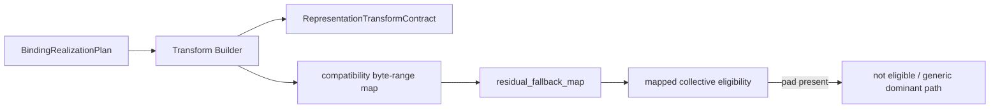
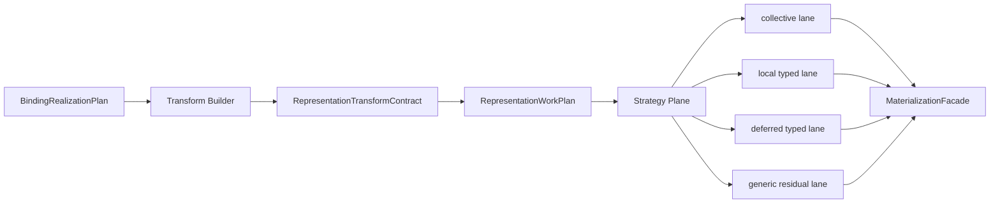

# Summary

Define how `Binding.realize_from(...)` should converge to a
`collective-first` TP serving-startup path without introducing a second
execution stack.

This design does **not** replace `0107` through `0112`.
It closes one remaining mismatch inside their shared trunk:

- `BindingRealizationPlan` is already the semantic ingress,
- `RepresentationTransformContract` and `RepresentationWorkPlan` are already
  the semantic and execution-core abstractions,
- `ExecutionStrategyPlan` is already the strategy seam,
- `IntoTargetLayout` and `MaterializationFacade` are already the shared target
  execution substrate,
- but `binding.realize_from(...)` still lowers too much of the request into a
  byte-range compatibility map and then treats that map as the de facto primary
  execution path.

The new policy is:

- TP shared-source startup should default to **collective-first mixed
  execution**, not to `pure collective or fail`;
- `ByteRangeMap` remains the canonical fallback and explainability surface, but
  it must stop acting as the hidden primary execution graph for
  `binding.realize_from(...)`;
- a binding-hosted target byte space may still be informally described as a
  "target arena", but it remains a binding-plane local current value, not an
  artifact-plane replica until publish/closeout succeeds;
- strict `pure collective` remains supported, but only as an explicit
  execution-scoped mode with fail-fast semantics.

The intended steady state is:

1. `BindingRealizationPlan` stays the public semantic input.
2. TensorCast lowers it into one shared `RepresentationWorkPlan`.
3. Strategy selection derives explicit execution lanes from that work plan:
   - collective lane,
   - local typed lane for pad/fill-like work,
   - deferred typed lane for typed work that is not yet admitted to a preferred
     executor,
   - and true generic residual fallback.
4. `MaterializationFacade` executes those lanes through the existing shared
   target substrate.
5. Diagnostics surface the lane split explicitly so downstream operators do not
   have to infer it from side effects or logs.

This design is an architecture correction, not a new long-term owner for the
shared abstractions it touches:

- `0110` remains the owner of the shared semantic core and typed work inventory,
- `0108` remains the owner of lane planning and mixed-execution strategy,
- `0109` remains the owner of the owner-file collective executor,
- `0113` remains the owner of the cross-design closure constraints, capability
  and version handoff, and delete-gate invariants for the residual Example TP Model
  work,
- and the closure evidence for this path now lives directly in this design plus
  `docs/benchmarks/20260415-qwen2.5-32b-mounted-collective-first-v4-serving-evidence.md`.

# Target-State Alignment With `0121`

`0114` remains the evidence and design record for collective-first binding
startup. Its long-term owner is the `0121` target-set realization model.

The target interpretation is:

- TP startup is not a separate TP loader;
- collective-first behavior is a realization strategy over a target set;
- each TP member has a member-local target plan, layout, device facts, and
  runtime profile;
- group barriers, staged values, and per-member diagnostics are lifecycle and
  report facts of the shared realization plan.

## Implementation Status

`0114` is now closed at its owner boundary.

What this design needed from the live system is now present:

- downstream `vllm` `/weight_version` summary records
  `source_bound_contract_version=4`,
  `source_bound_contract_path=collective_first_v4`,
  `execution_plan_kind=collective_first_mixed`,
  `planner_version=source_bound_collective_first.v4`,
  and the realized collective policy and executor facts,
- the mounted qwen2.5 TP4 packet is current rather than a stale `v3` or
  generic-dominant sample,
- `planned_collective_admitted_bytes` and
  `actual_collective_committed_bytes` align at `16382928896`,
- `actual_generic_backend_bytes=0`,
- `dominant_executor=OwnerFileCollectiveExecutor`,
- and the same-binding serving path reaches `/health`, `/v1/models`, and
  `/v1/completions`.

The standalone `0114` plan is therefore retired. No separate "active total
execution plan" document is still needed for this path family.

## Current vs Target Flow

Current effective flow on the problematic TP path:

Target flow after this design:

The critical change is not a second executor tree.
The critical change is to make the shared execution-core truth explicit before
executor selection begins.

# Goals / Non-Goals

## Goals

- Keep one execution trunk for `binding.realize_from(...)`.
- Make TP shared-source startup `collective-first` by default.
- Preserve `RepresentationTransformContract` /
  `RepresentationWorkPlan` /
  `ExecutionStrategyPlan` as the main architecture seam.
- Make the binding-hosted target byte space exact-size and coalesced with
  respect to `IntoTargetLayout.total_size`.
- Ensure model tensors alias that target byte space once it is realized into
  the binding.
- Keep `ByteRangeMap` as fallback and explainability truth, not as the hidden
  main path.
- Make `pad`, `const fill`, and `scalar fill` first-class typed local work
  instead of accidental collective blockers.
- Make strict `pure collective` fail fast before running an expensive generic
  path.
- Surface planner and lane diagnostics explicitly through daemon responses and
  SDK types.
- Keep downstream `vllm` integration on the common TensorCast runtime,
  not on a vLLM-private fast path.

## Non-Goals

- Redefine `ArtifactSelection`.
- Move topology context into `ArtifactSelection` or into binding identity.
- Reopen `0110` and define a second semantic-core abstraction.
- Replace `IntoTargetLayout` / `TargetLayoutGpuSink` with a profile-private
  serving-only write substrate.
- Remove `ByteRangeMap` from the project.
- Require every TP startup request to execute on a `pure collective` executor.
- Introduce a second public API beside `Binding.realize_from(...)`.
- Create a model-family-specific or integration-specific execution fork.

# Prior Constraints Reviewed

## `0084` binding contract

Kept:

- binding is a local stable target byte space,
- a `SealedBindingValue` is the immutable local current value,
- publish/key activation remain artifact-backed operations.

Applied here:

- the "target arena" described by this design is only an informal name for the
  binding-hosted target byte space;
- it must not be described or modeled as an artifact-plane replica before
  publication.

## `0107` plane separation

Kept:

- `ArtifactSelection` owns artifact/view/subset identity only,
- execution topology remains execution-scoped,
- rollout and executor choice must not be encoded into selection identity.

Applied here:

- collective policy and strict-mode semantics remain execution-scoped,
- no new public field name may collapse artifact identity and topology intent
  into one plane.

## `0108` strategy plane

Kept:

- `ExecutionEnvironmentFacts`,
- `ExecutionStrategyPlan`,
- mixed execution as the preferred long-term model,
- and the rule that execution must not implicitly widen to generic fallback
  after a partial executor attempt.

Applied here:

- the new design strengthens `0108` rather than replacing it;
- the missing piece is to make `binding.realize_from(...)` actually consume the
  mixed-execution model instead of hiding behind a compatibility byte map.

## `0109` owner-file collective

Kept:

- collective execution is evidence-driven,
- shared-source TP startup is the right target domain,
- `ByteRangeMap` remains the canonical fallback and explainability surface.

Applied here:

- `0114` does not delete `ByteRangeMap`;
- it narrows it back to its intended role by removing it from the hidden main
  lane for binding-native realization.

## `0110` semantic core

Kept:

- `RepresentationTransformContract` is the common semantic truth,
- residual fallback coverage must remain explicit,
- executor-private candidates must not become the semantic contract.

Applied here:

- `0114` keeps `RepresentationTransformContract` and
  `RepresentationWorkPlan` as the public/shared semantic and execution-core
  truth;
- executor-private collective lowering remains a strategy-plane concern.

## `0112` binding-native realization

Kept:

- `BindingRealizationPlan` remains the public work-item-list ingress,
- binding-native publication and same-binding realization stay on the mainline,
- downstream integrations should not route back through legacy tensor-publication
  bridges.

Applied here:

- `0114` is not a second binding-native model;
- it is the convergence design for making that mainline truly
  `collective-first`.

# Current Mismatch

Current `binding.realize_from(...)` behavior has five structural problems.

## 1. Semantic plan and byte-range execution are conflated

Today the controller path around
`representation_transform_builder::BuildRepresentationTransformResult`
produces both:

- a semantic `RepresentationTransformContract`,
- and a `generic_fallback_map`.

In practice, many copy-compatible bytes are inserted into that byte-range map,
even when they already have typed semantic coverage.

This makes the "fallback" map behave like a primary execution graph.

## 2. `residual_fallback_map` is misnamed on this path

During execution-plan construction, the compatibility byte map is injected into
`RepresentationWorkPlan.residual_fallback_map`.

For `binding.realize_from(...)`, this means:

- the field name says "residual",
- but the field may represent most of the request's bytes,
- including the bytes that should have been carried by typed work items.

That naming drift causes both implementation mistakes and operator confusion.

## 3. Collective eligibility is evaluated against the wrong thing

Current mapped collective execution reads
`work_plan.residual_fallback_map` and requires every segment to be `kData`.

As a result:

- `kPad` segments,
- or any other byte-range artifact that should have lived in a local typed lane,

turn into a collective blocker for the whole request.

## 4. Strict collective currently fails slow

In the current flow, a request may already run an expensive non-collective
source-ordered byte-range path and only afterwards be rejected as
`not_eligible` by a strict collective policy.

That is the wrong product behavior.

Strict policy must be decided before the expensive generic path runs.

## 5. Diagnostics are too compressed

`ExecutionDiagnostics` currently reports high-level outcome bits such as:

- `collective_requested`,
- `collective_used`,
- `dominant_executor`,
- `fallback_bytes`,
- `residual_bytes`.

Those fields are necessary but insufficient.

They do not tell the operator:

- how many bytes were collective-capable,
- how many bytes were lowered into local pad/fill work,
- how many bytes remained true generic residual,
- or why bytes were rejected from collective lowering.

# Design Principles

## 1. One trunk, no execution fork

`0114` must not create:

- a vLLM-private executor,
- a TP-only serving loader branch,
- or a second target-write substrate.

Everything stays inside the shared TensorCast runtime trunk:

`BindingRealizationPlan` ->
`RepresentationTransformContract` ->
`RepresentationWorkPlan` ->
`ExecutionStrategyPlan` ->
`MaterializationFacade` ->
shared target sinks and transports.

## 2. Collective is the default main lane, not the only lane

For TP shared-source startup, the default should be:

- collective-first,
- mixed execution allowed,
- pure collective optional and explicit.

This is how TensorCast can be both high-performance and general.

## 3. Every byte belongs to one explicit lane

For a realized binding target byte space, each target byte must belong to
exactly one of:

- collective typed work,
- local typed work,
- deferred typed work,
- or generic residual fallback.

No byte may be "implicitly re-derived later" by an executor.

## 4. Explainability must survive optimization

The design must keep:

- exact coverage accounting,
- typed reject reasons,
- and stable diagnostics summaries,

so that higher performance does not come at the cost of opaque behavior.

# Document Ownership

`0114` is intentionally narrow in ownership.

It defines how binding-native TP startup must consume the shared strategy trunk
correctly.

It does not become the repository-wide owner of:

- `RepresentationTransformContract`,
- `RepresentationWorkPlan`,
- `ExecutionStrategyPlan`,
- or `OwnerFileCollectiveExecutor`.

Normative rule:

- if `0114` discovers that those shared abstractions need to be tightened for
  the whole repository, the accepted owner designs (`0110`, `0108`, `0109`)
  should be revised accordingly rather than leaving `0114` as a path-scoped
  shadow owner.

# Architecture & Interfaces

## Planner Inputs And Performance Objective

For this path, the planner must treat the following inputs as authoritative:

- source artifact/view metadata
- target `IntoTargetLayout`
- target tensor schema and logical topology
- source layout metadata
- execution topology context
- collective policy
- typed work plan items
- lane allocation over typed work plan items
- residual byte-range fallback map

The planner objective is not "minimize copy count" in isolation.
It is to minimize end-to-end startup critical path under the actual shared-source
TP environment.

The primary cost dimensions are:

- unique disk bytes
- owner skew
- GPU peer transfer bytes
- peak temporary bytes
- target write amplification
- control-plane assembly cost

Normative rule:

- a strategy choice that adds cheap GPU peer traffic in order to reduce unique
  shared-disk reads is allowed and often preferred;
- the planner must optimize total startup latency and bounded peak memory, not
  just per-rank local read simplicity.

## Shared Abstractions That Stay

The following abstractions remain authoritative and shared:

- `ArtifactSelection`
  - artifact/view/subset identity only.
- `ByteSpaceRef`
  - source byte-space identity.
- `BindingRealizationPlan`
  - public semantic ingress for binding-native realization.
- `RepresentationTransformContract`
  - semantic truth after normalization.
- `RepresentationWorkPlan`
  - shared execution-core truth.
- `ExecutionStrategyPlan`
  - strategy-plane output.
- `IntoTargetLayout`
  - shared target-byte-space layout.
- `MaterializationFacade`
  - execution owner.
- `ByteRangeMap`
  - fallback and explainability surface.

`0114` does not add a second semantic core and does not bypass these seams.

## Binding-Hosted Target Byte Space

For same-binding TP startup, the target object is:

- the binding-hosted target byte space described by `IntoTargetLayout`,
- sized exactly to `IntoTargetLayout.total_size`,
- and backed by one local current value on one device.

Informally this may be called a "target arena", but it remains a binding-plane
object, not an artifact-plane replica.

Normative rules:

1. the target byte space size must be deterministic from target layout
   resolution;
2. runtime tensor aliases must refer into that byte space rather than causing a
   second model-sized steady-state allocation;
3. the design does not require every transient implementation stage to avoid
   temporary memory, but it does require the binding-hosted target byte space to
   be the final steady-state serving host.

## Execution-Core Normalization

`RepresentationWorkPlan` remains the execution-core contract.

The new rule is:

- typed work items are the primary execution intent,
- `residual_fallback_map` is only for bytes that truly remain generic after
  lowering.

Normative derivation rule:

- `pad fill` is derived during work-plan construction from the coverage-closure
  gaps implied by the normalized semantic contract plus the target layout;
- it is part of work-plan identity and plan diagnostics,
- but it does not widen `RepresentationTransformContract` or
  `representation_contract_hash` into executor-shaped padding artifacts.

### Required work-item set

The common work-item vocabulary for this path must cover:

- tensor copy
- concat assemble
- scalar broadcast fill
- const fill
- pad fill
- residual byte-range

`pad fill` is new at the execution-core level.

Rationale:

- `kPad` today already has deterministic semantics: zero-fill target bytes;
- keeping it only inside `ByteRangeMap` makes it invisible to the typed planner
  and wrongly turns it into a collective blocker;
- promoting it to an explicit local typed work item keeps the semantics inside
  the shared execution core rather than inside executor-specific side logic.

### Coverage rule

For this path:

1. every byte covered by a typed work item must be absent from
   `residual_fallback_map`;
2. `residual_fallback_map` may only cover bytes with no typed execution
   equivalent in the current lowering phase;
3. duplicate coverage between typed work and residual byte-range fallback is an
   invariant violation.

### Lane assignment rules

Default lowering intent for each execution-core work item is:

| Work item kind | Default lane | Notes |
| --- | --- | --- |
| `kTensorCopy` replicated | collective | primary TP startup lane |
| `kTensorCopy` dim0 | collective | primary TP startup lane |
| `kTensorCopy` dim1 | collective when admitted, else deferred typed | must not silently become true residual |
| `kConcatAssemble` | collective when admitted, else deferred typed | no implicit widening |
| `kConstFill` | local typed | must not block collective bytes |
| `kScalarBroadcastFill` | local typed | must not block collective bytes |
| `pad fill` | local typed | zero-fill semantics |
| `kResidualByteRange` | generic residual | true fallback only |

Normative rule:

- if a typed work item is not yet admitted to the collective lane, the planner
  must record that as an explicit typed reject reason;
- it must not silently erase the typed work identity and only expose the final
  generic byte-range effect;
- typed work may later lower into a generic executor backend as an
  executor-private implementation detail, but that does not make it true
  `residual_fallback_map` coverage in the shared contracts.

### Transitional note

The current controller field
`BuildRepresentationTransformResult.generic_fallback_map` may remain temporarily
for rollout compatibility, but it must be demoted to an explicitly transitional
bridge field and must not continue to define the meaning of
`RepresentationWorkPlan.residual_fallback_map`.

Its long-term replacement is:

- typed work items for collective/local executable lanes plus non-admitted typed
  accounting,
- plus true generic residual fallback only.

## Strategy-Plane Lowering

`ExecutionStrategyPlan` remains the strategy owner.

Steady state planning still admits four semantic categories, but the first
contract landing does not need to expose all four as executor-visible public
lanes.

For collective-first TP startup, the planner must at least derive:

- `collective lane`
  - collective-capable typed items
- `local typed lane`
  - pad/fill and other cheap local typed work
- `generic residual lane`
  - true `ByteRangeMap` residual fallback
- `non-admitted typed accounting`
  - typed items that remain typed in shared planning even when a preferred
    executor cannot yet admit them

No executor may reinterpret a generic lane as primary semantic truth when typed
items already exist.

### Collective lane

This lane is the default main lane for TP shared-source startup.

Its target set includes:

- replicated tensor copy
- dim0 partitioned tensor copy
- dim1 partitioned tensor copy
- concat work once its execution form is admitted

Collective lane eligibility must be computed from typed work items and topology
facts, not from the historical shape of `residual_fallback_map`.

The lane may still use byte-range internals for executor implementation, but
those internals must be derived from lane-local typed work rather than treated
as the public/shared semantic truth.

### Local typed lane

This lane is for:

- pad fill
- const fill
- scalar fill
- and any future cheap local typed work that does not justify generic byte-range
  execution

This lane is still part of the same execution plan.
It is not a fallback in the product sense.

### Deferred typed / non-admitted typed accounting

This category is for typed work that the shared planner still understands
semantically, but that a preferred executor does not yet admit directly.

Normative rules:

- these bytes remain typed in shared planning and diagnostics,
- they may later lower into a generic executor backend as an executor-private
  implementation detail,
- but they do not become true generic residual in the shared contracts.
- the first source-bound contract landing may surface them as a planner-owned
  accounting bucket rather than as a fourth executor-visible public lane, so
  long as typed identity is preserved.

### Generic residual lane

This lane is only for bytes that remain unsupported by the current typed
lowering.

It keeps `ByteRangeMap` as:

- the canonical fallback encoding,
- the explainability surface,
- and the final safety net.

Normative rule:

- generic residual bytes must be explainable as the set difference between the
  target byte space and the union of admitted collective/local/deferred typed
  work.

## Policy Model

On the current public wire, the collective policy model should converge to
three stable meanings:

- existing `ALLOW_NOT_ELIGIBLE_FALLBACK`
  - means collective-first mixed execution
  - collective is the preferred main lane, but local typed and true residual
    execution remain admitted when required
- existing `REQUIRE_COLLECTIVE`
  - means strict pure collective
  - request must be fully consumable by the admitted collective execution shape
- existing `DISABLE_COLLECTIVE`
  - remains explicit debug or regression mode

Normative rollout rules:

- `UNSPECIFIED` must not silently change meaning during mixed-version rollout;
- this design corrects the semantics of the shipped policy family before any
  public rename cleanup is attempted;
- a later API cleanup may rename these modes to
  `collective_first` / `require_pure_collective` / `disable_collective`, but
  that rename is not part of this design's required cutover.

## Interface Changes Required

This design intentionally keeps the main abstractions, but it still requires
explicit interface additions and clarifications.

### Public / typed diagnostics

`ExecutionDiagnostics` must not become the permanent catch-all owner of both
source-bound planner state and actual execution state.

Long-term rule:

- cross-path and actual execution summary facts may remain on
  `ExecutionDiagnostics`,
- but source-bound planner, lane, and reject-bucket detail should live in a
  source-bound-scoped child diagnostics contract such as
  `SourceBoundPlanDiagnostics`.

During rollout, additive fields may temporarily live on `ExecutionDiagnostics`,
but the target architecture is a scoped diagnostics model.

Required surfaced facts for the source-bound path include:

- planner surface
  - execution-plan kind
  - planned byte counts per lane
  - typed reject-reason buckets
  - planner version and plan hash
  - planner cost estimates that materially affect executor choice
- actual execution surface
  - actual byte counts by backend family
  - dominant executor
  - direct-write support
  - hash and identity facts on the realized path

These additions are additive and must not remove existing fields during rollout.

### Controller internal output

`BuildRepresentationTransformResult` must stop implying that
`generic_fallback_map` is the stable primary execution artifact for this path.

The controller output must make the following distinction explicit:

- typed work admitted to execution-core plan
- local typed work
- deferred typed work
- true generic residual fallback

Whether this happens by renaming, by additive fields, or by a new transitional
wrapper type is an implementation choice, but the semantic distinction is
mandatory.

### Runtime strategy input

`ExecutionStrategyPlan` must gain enough structured input to derive lanes from
typed work rather than reverse-engineering them from residual bytes.

This may be additive to existing fields, but the final semantics must be:

- lane selection is typed and explicit,
- typed work rejected by a preferred executor remains typed in shared planning,
- residual fallback remains residual.

### Runtime config binding

This path must remain bound to the unified runtime configuration model.

Normative rules:

- source-bound binding startup obeys the same
  `engine.materialization_strategy` controls as the ordinary path,
- collective budgets, mixed-execution enablement, and shared-source proof stay
  under the existing typed config family,
- and `0114` must not introduce a binding-path-private environment toggle or a
  second strategy-policy namespace.

## Failure Semantics

### Default collective-first mode

The request may still execute successfully when:

- collective handles the dominant typed bytes,
- local typed work handles pad/fill bytes,
- deferred typed work preserves typed identity for work not yet admitted to a
  preferred executor,
- generic residual handles the remaining bytes with no typed equivalent.

This is not "fallback" in the operator-facing sense.
This is the intended execution plan.

### Strict pure-collective mode

If the request is not eligible for the strict mode:

- the daemon must reject it before running the expensive generic path,
- and must return typed reject reasons.

Failing only after a source-ordered generic execution has completed is
forbidden.

## Observability

The observability model must distinguish planned lane truth from actual
execution truth.

Required surfaced facts include:

- planner / lane facts
  - `execution_plan_kind`
  - `planned_collective_candidate_bytes`
  - `planned_collective_admitted_bytes`
  - `planned_local_typed_bytes`
  - `planned_non_admitted_typed_bytes`
  - `planned_generic_residual_bytes`
  - `collective_lowered_bytes`
  - `planner_reject_reason_buckets`
  - `planner_version`
  - `plan_hash`
- actual execution facts
  - `actual_collective_committed_bytes`
  - `actual_local_typed_bytes`
  - `actual_generic_backend_bytes`
  - `dominant_executor`
  - `direct_write_supported`

Existing controller-side compatibility counters such as:

- `compatible_candidates`
- `compatible_bytes`
- `concat_candidates`
- `rejected_mixed_src_or_dim`
- `rejected_non_contiguous`
- `rejected_unsupported_distribution`

must no longer remain log-only on this path.

They must be exposed through typed daemon diagnostics so downstream integrations
and operators can distinguish:

- collective planner limitations,
- target-layout pad/fill effects,
- and true generic residual.

## Debugging Contract

The implementation must make the following questions answerable without source
inspection:

1. Did the request enter `collective-first` or strict `pure collective` mode?
2. How many bytes were eligible for collective lowering?
3. How many bytes actually committed through collective execution?
4. How many bytes were executed as local pad work?
5. How many bytes were executed as local fill work?
6. How many bytes remained in deferred typed coverage?
7. How many bytes remained true generic residual?
8. Why were bytes rejected from collective lowering?
9. Did strict mode fail before expensive generic execution began?

This contract must hold across:

- daemon structured diagnostics,
- SDK typed diagnostics,
- downstream integration summaries.

# Example TP Model As The Motivating Example

Example TP Model is not a special one-off exception.
It is simply a representative example of a TP startup request that exercises the
current mismatch.

What happens today:

- the source-bound path uses `subset(...).view(slices=...)`-style narrowing;
- target byte-space composition introduces pad coverage for holes in the target
  byte space;
- controller lowering encodes large amounts of copy-compatible work into a
  compatibility byte-range map;
- mapped collective reads `residual_fallback_map` as if it were the primary
  execution graph;
- the presence of `kPad` then makes the whole request appear collectively
  ineligible.

What should happen instead:

- the bulk TP shard copy bytes become collective typed work;
- pad bytes become explicit local `pad fill`;
- manifest or other typed fill bytes become explicit local fill work;
- typed but not-yet-admitted items remain typed in shared planning and
  diagnostics;
- only truly unsupported leftovers remain in generic residual fallback.

This is the intended generic solution for TP startup, not a Example TP Model-only
special case.

# Module Coordination

## SDK / API layer

Kept:

- `Binding.realize_from(...)` remains the public ingress.

Changed:

- collective policy semantics are clarified,
- diagnostics become additive,
- no new public realization API is introduced.

## Controller / transform-builder layer

Kept:

- `BindingRealizationPlan -> RepresentationTransformContract` normalization.

Changed:

- compatible typed work must stop being encoded as primary
  `generic_fallback_map` bytes,
- `pad fill` becomes explicit typed work,
- controller compatibility stats become typed outputs instead of log-only hints.

## Strategy / runtime layer

Kept:

- `ExecutionStrategyPlan` owns executor choice.

Changed:

- collective lane is derived from typed work items,
- local typed lane is explicit,
- non-admitted typed accounting is explicit,
- generic residual lane is kept narrow and true to its name,
- strict mode rejects pre-execution when ineligible.

## Dataplane / executor layer

Kept:

- `IntoTargetLayout`,
- `TargetLayoutGpuSink`,
- shared direct-write/pump infrastructure.

Changed:

- collective executor must stop assuming that the only meaningful input is the
  generic residual byte-range map,
- pad/fill handling must no longer be modeled as "collective blocker for the
  whole request".

# Testing And Evidence Requirements

This design is not considered implemented by unit green alone.

Required evidence classes are:

- controller/unit evidence
  - typed coverage accounting
  - lane-assignment correctness
  - strict fail-fast behavior
- executor/runtime evidence
  - collective/local/generic lane composition
  - no duplicate byte coverage
  - no implicit widening after partial execution
- mounted serving evidence
  - representative TP startup cases such as Example TP Model / Mixtral
  - lane byte breakdown
  - dominant executor shift away from generic-only path
- downstream integration evidence
  - typed diagnostics visible in integration summaries and APIs

The implementation is incomplete if the new semantics exist only in controller
tests but are not visible in mounted diagnostics.

# Naming Compliance

The new interface and field names proposed by this design follow repository
style rules.

| Proposed symbol | Kind | Required style | Result |
| --- | --- | --- | --- |
| `COLLECTIVE_POLICY_ALLOW_NOT_ELIGIBLE_FALLBACK` | proto enum value | `ALL_CAPS` | pass |
| `COLLECTIVE_POLICY_REQUIRE_COLLECTIVE` | proto enum value | `ALL_CAPS` | pass |
| `SourceBoundPlanDiagnostics` | proto/message name | `PascalCase` | pass |
| `execution_plan_kind` | field | `snake_case` | pass |
| `planned_collective_admitted_bytes` | field | `snake_case` | pass |
| `planned_non_admitted_typed_bytes` | field | `snake_case` | pass |
| `planner_reject_reason_buckets` | field | `snake_case` | pass |

# Rollout & Compatibility

Rollout should proceed in phases:

1. diagnostics and terminology freeze
2. true residual semantics
3. collective-first lane derivation
4. downstream default-policy adoption
5. legacy bridge deletion

Compatibility rules:

- new diagnostics fields are additive,
- this design keeps the current wire policy family and corrects its semantics
  before any public rename cleanup,
- and the execution semantics must converge to the new model rather than
  preserving the old mislabeling.

Delete gates:

- any later public rename aliases may only be deleted after downstream
  integrations have adopted the new names;
- transitional controller bridge fields may only be deleted after true residual
  semantics are proven in mounted evidence;
- residual-map-based collective gating may only be deleted after the collective
  lane is derived from typed work and the debugging contract remains satisfied.

# Acceptance Criteria

This design is complete only when all of the following are true.

1. `binding.realize_from(...)` on TP shared-source startup no longer routes the
   majority of collectively-executable bytes through a field named
   `residual_fallback_map`.
2. `pad` bytes are represented as explicit local typed work rather than as a
   whole-request collective blocker.
3. strict pure-collective mode fails before generic execution begins.
4. default collective-first mode succeeds on mixed requests without being
   described as a runtime fallback path.
5. typed work rejected by a preferred executor remains typed in shared planning
   and diagnostics until a later lowering decides how to execute it.
6. planner and actual execution diagnostics are split clearly enough that
   downstream operators can distinguish lane intent from backend reality.
7. `source_bound_contract_version = 4` marks the additive contract landing for
   true residual semantics, strict preflight, and split planner/execution
   diagnostics on this path.
8. downstream `vllm` integration remains on the shared TensorCast
   runtime trunk and does not introduce a private execution fork.
