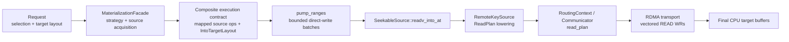
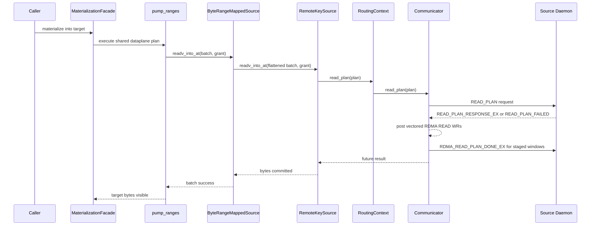
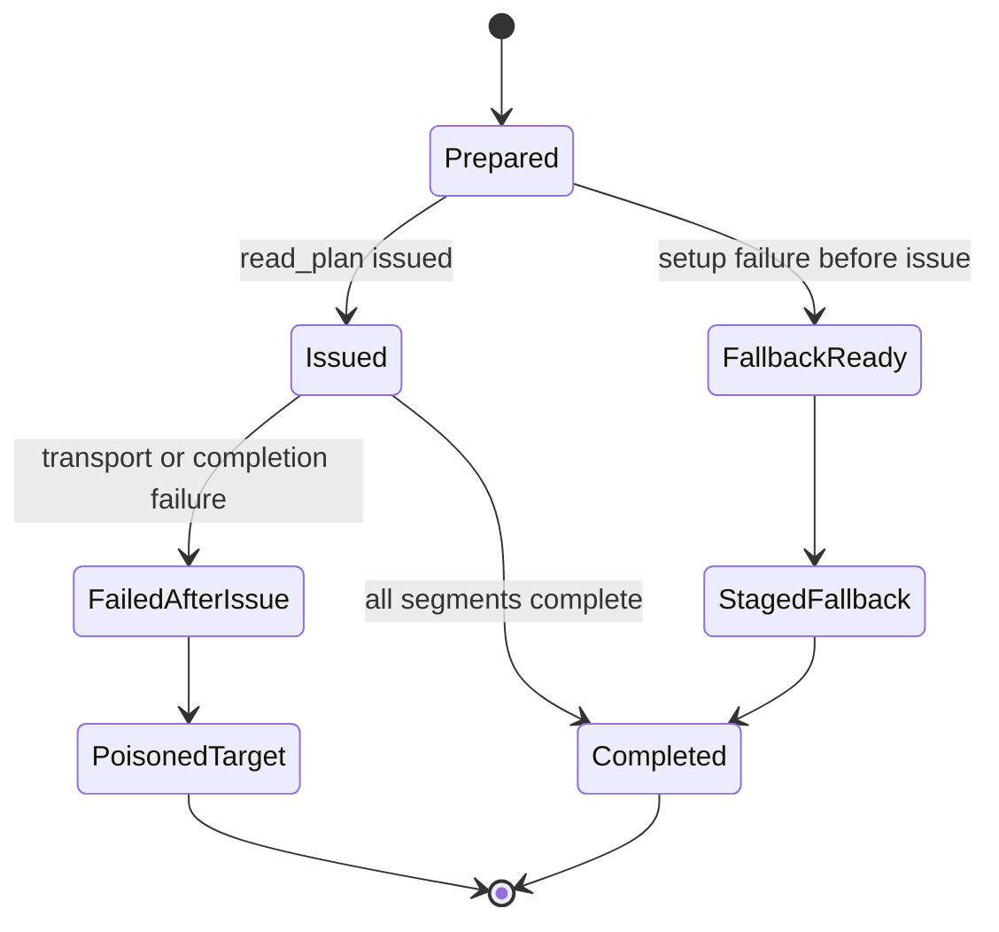

# Summary

Add one generic shared capability below the existing strategy plane:

- first-class composite source -> composite target materialization in the shared
  dataplane,
- and one routed, protocol-neutral vectored pull fast path that RDMA can
  realize efficiently.

The intent is to stop treating multi-item RDMA direct-write as a
byte-artifact-specific optimization. Instead:

- `MaterializationFacade` and the shared dataplane own composite execution
  semantics,
- communicator owns efficient execution of a vectored pull plan,
- RDMA transport owns chained WR realization,
- and byte-artifact batch-get becomes only one consumer of that shared
  capability.

This design keeps the repository's current architectural boundaries:

- `0088` still owns the "one shared dataplane" rule,
- `0108` still owns semantic truth, source acquisition, and strategy placement
  in `MaterializationFacade`,
- `0087` and `0089` still own byte-artifact authority and `BodyHandle`
  lifetimes,
- and `0115` owns the new common execution contract below that seam.

# Implementation Status

As of `2026-04-20`, the generic capability owned by `0115` is implemented in
the repository.

Landed outcomes:

- `DirectWriteOp`, default `SeekableSource::readv_into_at(...)`,
  `supports_batched_direct_write_at()`, bounded `pump_ranges(...)` batching,
  and typed batch byte or op-count config are live in the shared dataplane.
- `ByteRangeMappedSource`, `RemoteKeySource`, and fallback-bearing mux paths
  now implement pre-issue batched lowering, explicit branch freeze semantics,
  and deterministic capability-miss-before-issue behavior for the vectored
  direct-write path.
- routed communicator `ReadPlan`, `PreparedReadPlan`, request-scoped
  `LocalRegion` registration, additive wire ops, and centralized validation of
  one-authority, one-route-context, non-overlap, and CPU-first-cut invariants
  are landed across routing, engine, and transport code.
- RDMA realizes `ReadPlan` with per-segment `local_lkey`, multi-local-region
  placement splitting, multi-QP posting, and request-local ACK and staged
  credit bookkeeping. MTCP intentionally returns a pre-issue capability miss
  in the first cut rather than hiding many-scalar emulation inside
  communicator.
- `MaterializationFacade` now owns a private
  `materialize_mapped_sources_into_target(...)` helper, internal
  single-source blockers required for composite execution are removed, and the
  public materialization API shape remains unchanged.
- routed byte-artifact batch-get already consumes this generic capability on
  the get path. Current RDMA share-remote reruns log
  `materialize_mode=single_source_composite batched_direct_write=true`,
  confirming that the consumer uses the shared `0115` seams rather than a
  byte-artifact-private communicator API.

Remaining follow-on work outside `0115`:

- future MTCP native vectored direct-write, if pursued, must implement the
  same shared contract rather than introducing a transport-private API.



# Goals / Non-Goals

## Goals

- Add one shared dataplane execution contract for multiple source spans into
  multiple target spans.
- Preserve `ByteRangeMap` and `ByteRangeMappedSource` as the exact fallback IR
  and explainability surface.
- Keep all public SDK materialization APIs unchanged.
- Keep the target-side authority abstraction as `IntoTargetLayout` and
  `DirectWriteGrant`, not transport-specific destination keys.
- Add one routed, protocol-neutral communicator API that can execute a vectored
  pull plan against one selected remote endpoint.
- Let RDMA implement that API as one request that posts many WRs without
  forcing source pack copy or sink full-pack mirror.
- Preserve MTCP and staged fallback behavior as valid fallback realizations.

## Non-Goals

- Add a byte-artifact-only RDMA batch transport API.
- Introduce `local_memory_keys[]` as a new destination publication abstraction.
- Change `ArtifactSelection`, `MaterializeIntoTarget`, or
  `MaterializeIntoMappedTarget` public shapes.
- Teach communicator about `ByteRangeMap`, `IntoTargetLayout`, or
  byte-artifact-specific routing semantics.
- Solve multi-endpoint striping or multi-source load balancing inside
  communicator in this cut.
- Add remote direct writes into caller-owned CUDA regions.

# Prior Constraints Reviewed

## `0088`: one shared dataplane

Keep.

This design extends the shared dataplane rather than adding another copy
runtime. `byte_artifact` and future profiles must consume the same execution
contract.

## `0108`: strategy belongs in `MaterializationFacade`

Keep.

`0115` does not move strategy out of `MaterializationFacade`. It only defines
the execution contract that a chosen plan may use after source acquisition and
lane selection are complete.

## `0087` and `0089`: `BodyHandle` stays transport-neutral

Keep.

`BodyHandle` remains the source-side export seam for routed byte artifacts, but
the new generic capability is not defined in terms of `BodyHandle`. `BodyHandle`
is one producer of compatible sources, not the owner of transport behavior.

## Current `DirectWriteGrant` shape

Keep and narrow.

`DirectWriteGrant` remains transport-neutral. It must continue to carry only
target windows plus keepalive state. It must not grow RDMA-specific `lkey`,
communicator session ids, or destination publication keys in the first cut.

# Architecture & Interfaces

## 1. Ownership Boundary

The new capability is split across four layers.

1. `MaterializationFacade` and shared dataplane own semantic lowering into a
   composite execution contract.
2. `SeekableSource` implementations own source-side execution of batched
   direct-write operations.
3. communicator routing and engine own a routed vectored pull API.
4. RDMA transport owns efficient realization of that API with many WRs and
   request-scoped destination registration.

Normative rules:

1. Strategy chooses whether a request uses this path. Communicator does not.
2. Communicator executes a plan. It does not derive semantic coverage.
3. One `ReadPlan` targets one resolved remote endpoint and one selected routed
   channel. Multi-hop or multi-endpoint striping remains higher-level planner
   work.
4. Destination memory remains initiator-local and request-scoped. It is not
   published as a new global key family.
5. Generic execution semantics remain strict. Narrower profile-specific retry
   or overwrite policies may only layer above this seam; they do not relax the
   generic communicator or materialization contract.

## 2. Shared Dataplane Contract

The shared dataplane needs a first-class batched direct-write operation shape.

Minimal C++ contract:

```cpp
struct DirectWriteOp {
  uint64_t src_offset = 0;
  uint64_t dest_va_offset = 0;
  uint64_t bytes = 0;
};

class SeekableSource : public Source {
 public:
  virtual bool supports_batched_direct_write_at() const;
  virtual absl::StatusOr<size_t> readv_into_at(
      absl::Span<const DirectWriteOp> ops,
      const DirectWriteGrant& grant);
};
```

Semantics:

1. `DirectWriteOp` is expressed in source byte-space and target VA byte-space.
2. The default `readv_into_at(...)` implementation loops through
   `read_into_at(...)` to preserve compatibility.
3. `supports_batched_direct_write_at()` is a stricter hint than
   `supports_direct_write_at()`. It means the source owns a real pre-issue
   batch prepare boundary, so `Unimplemented` or `FailedPrecondition` from
   `readv_into_at(...)` may be treated as a capability miss before any writes
   are assumed committed.
4. Sources that inherit the default `readv_into_at(...)` loop must keep
   `supports_batched_direct_write_at()` disabled because the loop may already
   have executed earlier ops when a later op fails.
5. `pump_ranges(...)` remains the shared entrypoint, but its direct-write path
   now groups bounded batches of `DirectWriteOp` and issues one source call per
   batch instead of one source call per window.
6. `TargetLayoutHostSink::plan_direct_write(...)` remains the target authority
   seam. The sink already supports multiple windows, so no target abstraction
   split is needed.
7. `supports_direct_write_at()` is only a coarse, context-free hint. It must
   not be treated as the final fast-path eligibility decision.
8. Final fast-path eligibility is decided during pre-issue prepare and lowering
   when route, protocol, source shape, and fallback topology are known.
9. Route-dependent capability must not be permanently cached during source
   construction. Construction-time helpers may cache only context-free facts.
10. A source that advertises `supports_batched_direct_write_at()` must reject
    deterministic batch validation errors before issuing any target writes.
    Partial target mutation is only permitted after the batch has crossed the
    issue boundary and a real execution failure occurs.

Bounded batching is mandatory:

- one batch must be capped by bytes and op count,
- grant lifetime must remain bounded,
- and future config must live under typed runtime config rather than ambient
  environment.

Recommended typed config names:

- `engine.materialization_strategy.direct_write_batch_bytes`
- `engine.materialization_strategy.direct_write_batch_ops`

## 3. Internal Materialization Entry

The shared runtime needs an internal multi-source helper rather than a
byte-artifact-specific execution path.

Minimal internal helper:

```cpp
absl::StatusOr<loading::MaterializeIntoTargetResult>
materialize_mapped_sources_into_target(
    const DeviceKey& target_device,
    const loading::IntoTargetLayout& target_layout,
    std::vector<std::shared_ptr<loader::SeekableSource>> sources,
    const loader::ByteRangeMap& mapping,
    const loading::MaterializeHints& hints,
    loading::MaterializationSource source_kind);
```

Rules:

1. `IArtifactLoader` may remain a single-source opening interface. This design
   does not require a public multi-source loader API.
2. Existing single-source helpers become wrappers around the internal
   multi-source helper.
3. `mapping.num_sources == 1` convenience restrictions must be retired where
   they block internal composite execution.
4. `ByteRangeMappedSource` remains the generic composite-source executor and
   fallback surface.

## 4. `ByteRangeMappedSource` and `RemoteKeySource`

`ByteRangeMappedSource` and `RemoteKeySource` must both become batch-aware.

### `ByteRangeMappedSource`

Responsibilities:

1. flatten composite `DirectWriteOp` batches into underlying source runs,
2. zero-fill PAD runs directly into the grant,
3. group contiguous runs by underlying source when possible,
4. delegate grouped batches to underlying `readv_into_at(...)`,
5. fall back to per-op `read_into_at(...)` only when the underlying source does
   not advertise `supports_batched_direct_write_at()`, or when a batched source
   returns a pre-issue capability miss,
6. never infer safe batched fallback from the default `readv_into_at(...)`
   compatibility loop.

### `RemoteKeySource`

Responsibilities:

1. accept a batch of `DirectWriteOp`,
2. intersect those ops with grant windows and the remote
   `memory_keys[]/buffer_sizes[]` layout,
3. lower the result into one routed communicator `ReadPlan`,
4. execute that plan through communicator when the fast path is available,
5. fall back to the existing single-read path only before the new plan has been
   issued.

### Capability Freeze and Fallback-bearing Sources

The shared contract needs one explicit pre-issue freeze point for sources whose
runtime topology includes fallback branches.

Normative rules:

1. A fallback-bearing source may enter vectored direct-write only after the
   current batch has been frozen to one concrete execution branch such as
   `primary_only` or `fallback_only`.
2. If that freeze cannot be completed before issue, the source must return a
   pre-issue capability miss and let the caller use the existing staged path.
3. This rule preserves the generic `no fallback after issue` contract while
   still allowing higher-level consumers such as byte-artifact batch-get to use
   vectored RDMA when the batch has been frozen to the primary branch.
4. The generic contract does not define in-place branch switching after issue.
   If a narrower profile later wants whole-request overwrite retry semantics,
   it must prove stronger invariants and own that behavior above `0115`.

This preserves an important layering rule:

- composite source semantics remain in the materialization layer,
- communicator sees only a vectored pull plan,
- and byte-artifact batch-get consumes the result without defining it.

## 5. Routed Communicator Read Plan

The communicator fast path must be protocol-neutral and routed, not an RDMA
helper hidden inside `RemoteKeySource`.

Minimal API shape:

```cpp
struct ReadRouteContext {
  std::string local_endpoint_id;
  std::string remote_endpoint_id;
  ConnectionProtocol protocol = ConnectionProtocol::kAuto;
  int16_t rail_id = -1;
};

struct LocalRegion {
  uint64_t addr = 0;
  uint64_t bytes = 0;
  int dev_type = base::COMMUNICATE_ENGINE_DEV_CPU;
  int dev_id = 0;
};

struct SourceSlice {
  std::string authority_id;
  ReadRouteContext route;
  std::string tensor_key;
  uint64_t remote_offset = 0;
  uint64_t bytes = 0;
};

struct ReadPlanSlice {
  uint32_t source_slice_index = 0;
  uint32_t local_region_index = 0;
  uint64_t source_slice_offset = 0;
  uint64_t local_region_offset = 0;
  uint64_t bytes = 0;
};

struct ReadPlan {
  std::vector<LocalRegion> local_regions;
  std::vector<SourceSlice> source_slices;
  std::vector<ReadPlanSlice> slices;
};

transport::future_read_result_t read_plan(const ReadPlan& plan);
```

First-cut note:

- `SourceSlice` carries explicit `authority_id` and repeated
  `ReadRouteContext`. This is intentionally redundant so one-authority and
  one-route-context invariants stay explicit and centrally validated before the
  request crosses the issue boundary. Later prepared-plan lowering may collapse
  the shared route context after validation.

Rules:

1. `ReadPlan` is request-scoped and local. It is not persisted or published.
2. `ReadPlan` must target one resolved remote endpoint and one selected routed
   channel.
3. All `SourceSlice` entries in one `ReadPlan` must belong to one remote export
   authority and execute on one selected route / protocol / rail context.
4. `ReadPlan` may describe many source slices and many local regions.
5. `local_regions` are the correct abstraction for destination memory.
   `local_memory_keys[]` is explicitly rejected because destination memory is
   not a globally published source capability.
6. The `LocalRegion` API remains extensible enough for future CPU, GPU, or
   mixed-region implementations.
7. The first cut only accepts CPU `local_regions`, and all accepted regions
   must share one local registration / memory domain and one selected rail.
8. Routing owns `read_plan(...)` selection just as it owns `read_tensor(...)`
   selection today.
9. MTCP may initially return a pre-issue capability miss such as
   `Unimplemented` for `read_plan(...)`. Callers may then fall back to the
   existing staged path.
10. MTCP's first-cut capability miss is not a permanent semantic limit. A
    future MTCP implementation may realize native vectored direct-write under
    the same contract.
11. Unsupported transports must not hide a many-single-read emulation inside
    communicator `read_plan(...)`; unsupported fast paths must fail before
    issue.
12. `ReadPlan` construction and validation are still pre-issue. Mixed
    authority, mixed route context, overlapping destination spans, invalid
    `LocalRegion` coverage, and unsupported transport or region types must be
    rejected before the plan crosses the issue boundary.
13. The issue boundary is not `ReadPlan` creation. The issue boundary is when a
    validated logical plan has been prepared into a transport-ready,
    request-scoped prepared object and the routed request is handed to
    communicator / engine for execution.

### Request-scoped Prepared Object

`ReadPlan` is the logical execution intent. The runtime still needs a prepared,
request-scoped object that owns realized destination registration and
transport-ready segment lowering.

Minimal internal direction:

```cpp
struct PreparedSourcePlacement {
  uint32_t local_region_index = 0;
  uint64_t local_region_offset = 0;
  uint64_t source_slice_offset = 0;
  uint64_t bytes = 0;
};

struct PreparedLocalRegion {
  LocalRegion logical_region;
  int16_t rail_id = -1;
  std::string nic_name;
  tensor_t tensor;
};

struct PreparedReadPlan {
  ReadPlan logical_plan;
  std::string remote_endpoint_id;
  ConnectionProtocol protocol = ConnectionProtocol::kAuto;
  int16_t rail_id = -1;
  std::string local_nic;
  uint64_t total_bytes = 0;
  std::vector<PreparedLocalRegion> local_regions;
  std::vector<std::vector<PreparedSourcePlacement>> placements_by_source_slice;
};
```

Rules:

1. `PreparedReadPlan` is request-scoped and local. It is never published as a
   reusable destination capability.
2. `PreparedReadPlan` is the intended replacement seam for vectored requests
   that do not fit the single `(addr, bytes)` ownership model of
   `PartitionTensor`.
3. Engine owns preparation, local-region registration, transport-specific
   lowering, and cleanup for this object.
4. `PartitionTensor` may remain the owner of the legacy single-region path, but
   it is not the long-term abstraction for vectored plan execution.
5. `PreparedReadPlan` is the first object that may cross from pre-issue setup
   into issue. Deterministic preparation failures here remain pre-issue and
   must not imply any target mutation.
6. `ReadPlanSlice` carries `source_slice_offset`, and prepared placement
   coverage for each `SourceSlice` must exactly cover `[0, source.bytes)`
   without gaps or overlap before the plan crosses the issue boundary.
7. The current first cut also requires all accepted local regions to resolve to
   one selected RDMA NIC / rail so the request owns one transport-local memory
   domain.

### Minimal wire schema

The wire shape should remain internal and additive. A minimal internal protocol
family is:

```cpp
enum {
  ENGINE_OP_READ_PLAN_REQUEST,
  ENGINE_OP_READ_PLAN_RESPONSE_EX,
  ENGINE_OP_READ_PLAN_FAILED,
  ENGINE_OP_RDMA_READ_PLAN_DONE_EX,
};

struct ProtoReadPlanRequestHeader {
  uint8_t transport_type = 0;
  int16_t rail_id = -1;
  uint8_t reserved = 0;
  uint64_t request_id = 0;
  uint32_t num_source_slices = 0;
};

struct ProtoReadPlanSourceSlice {
  char tensor_key[kMaxTensorNameLen];
  uint32_t source_slice_index = 0;
  uint64_t remote_offset = 0;
  uint64_t bytes = 0;
};

struct ProtoReadPlanResponseExHeader {
  uint8_t transport_type = 0;
  uint8_t staged = 0;
  char nic_name[kMaxDevName];
  uint64_t request_id = 0;
  uint32_t num_segments = 0;
  uint32_t window_seq = 0;
  uint32_t credit_granted = 0;
  uint8_t more_segments = 0;
  uint8_t zero_copy = 0;
  int16_t rail_id = -1;
};

struct ProtoReadPlanResponseExSeg {
  uint32_t source_slice_index = 0;
  uint64_t source_slice_offset = 0;
  uint64_t addr = 0;
  uint32_t bytes = 0;
  uint32_t rkey = 0;
};

struct ProtoReadPlanFailed {
  uint64_t request_id = 0;
  uint32_t reason = 0;
};

struct ProtoRdmaReadPlanDoneExHeader {
  uint64_t request_id = 0;
  uint32_t num_segments = 0;
  uint32_t window_seq = 0;
  uint8_t final_window = 0;
  uint8_t reserved[3] = {};
};
```

The source daemon does not need local addresses. It only needs the source slice
set and must return staged or direct segments keyed by request id, window, and
slice identity.

Normative rules:

1. `source_slice_index` and `source_slice_offset` are sink-side placement
   metadata. They do not replace request-local ACK or staged-lease identity.
2. Source-side staged credit release remains keyed by request-local
   `window_seq + segment_idx`.
3. `READ_PLAN_FAILED` is additive and keyed by `request_id`; it does not change
   legacy tensor-key / offset failure decoding.
4. `READ_PLAN_RESPONSE_EX` carries transport, NIC, rail, staged, and zero-copy
   metadata so the sink can route the response through the same handshake and
   profiling machinery as legacy RDMA reads.
5. `RDMA_READ_PLAN_DONE_EX` carries request-local staged credit release for
   plan windows and remains keyed by `window_seq + segment_idx` rather than
   semantic slice identity.

## 6. RDMA Transport Realization

RDMA can already post many WRs, but the current transport contract assumes one
request-scoped local MR. That is too narrow.

Required widening:

```cpp
struct RdmaReadSeg {
  uint64_t local_addr = 0;
  uint32_t local_lkey = 0;
  uint32_t length = 0;
  uint64_t remote_addr = 0;
  uint32_t rkey = 0;
  uint32_t window_seq = 0;
  uint32_t segment_idx = 0;
};
```

Rules:

1. engine owns request-scoped registration of `local_regions` on the selected
   rail,
2. transport consumes resolved `local_addr + local_lkey` pairs,
3. one RDMA request may post many WRs whose SGEs use different `lkey` values,
4. request progress, completion, and profiling remain aggregated at the engine
   layer.
5. The additive `local_lkey` field has already landed on the existing
   `RdmaReadSeg` type instead of introducing a parallel `RdmaReadSegEx`
   transport shape.
6. RDMA lowering may split one response segment into multiple WRs when the
   response range overlaps multiple prepared placements. All resulting WRs keep
   the same logical `window_seq + segment_idx` metadata while carrying the
   resolved `local_addr + local_lkey` for each overlap chunk.
7. Partial `ibv_post_send` failure is a hard request failure: already-posted
   WRs remain inflight and may still complete locally, but the request result
   becomes terminally failed and unposted WRs are not counted.

`PartitionTensor` is not the long-term owner of this path because it is a
single `(addr, bytes)` abstraction. The vectored path should use a separate
request-scoped prepared object and local region set.

## 7. Control and Data Flow



## 8. Failure Model

The key rule is that fallback is only allowed before a vectored direct-write
batch has been issued.



Normative rules:

1. If batching, source-freeze, routing, registration, or transport selection
   fails before the plan is issued, callers may fall back to the existing
   staged path.
2. A batch is considered issued once the routed plan request has been handed
   off such that destination memory may subsequently be dirtied.
3. Once a vectored direct-write batch is issued, in-place staged fallback is
   forbidden.
4. Destination spans in one issued plan must be non-overlapping. Overlap must
   be rejected before issue.
5. Post-issue failure must surface as a hard request failure and follow the
   existing poisoned-target semantics of the caller.
6. The generic contract does not define hidden branch switching, hidden
   transport emulation, or hidden overwrite retry after issue.
7. A narrower profile may layer whole-request retry or overwrite-retry above
   this contract only if it proves stronger invariants such as immutable
   sources, equivalent fallback bytes, and private unpublished targets.
8. These rules avoid silent double-write, partial overwrite, and ambiguous
   commit semantics.

## 9. Configuration and Observability

Required direction:

1. batch sizing must be typed config, not environment variables,
2. communicator must expose read-plan counters and latency,
3. materialization must expose whether a request used:
   - `direct_write_mode=single_op`
   - `direct_write_mode=batched_ops`
   - `direct_write_mode=read_plan`
   - `direct_write_mode=staged_fallback`
4. fallback cause must be explicit:
   - unsupported_source
   - unsupported_transport
   - registration_failure
   - routing_failure
   - pre_issue_setup_failure

Recommended metrics:

- `tc_tx_direct_batch_ops_total`
- `tc_tx_direct_batch_bytes_total`
- `tc_comm_read_plan_requests_total`
- `tc_comm_read_plan_segments_total`
- `tc_comm_read_plan_fallback_total`

## 10. Naming Compliance

The proposed interface family follows repository naming rules.

- `DirectWriteOp`, `LocalRegion`, `SourceSlice`, `ReadPlanSlice`, `ReadPlan`,
  and `RdmaReadSegEx` are `PascalCase` types.
- `readv_into_at(...)`, `materialize_mapped_sources_into_target(...)`, and
  `read_plan(...)` are `snake_case` functions or methods.
- future config fields such as `direct_write_batch_bytes` and
  `direct_write_batch_ops` remain `snake_case`.
- existing constants such as `ENGINE_OP_*` remain `ALL_CAPS`.

# Trade-offs & Risks

- This design adds one more internal contract family and a new communicator
  wire path.
- Request-scoped destination registration may add overhead until coalescing and
  caching rules are tuned.
- Strict "no in-place fallback after issue" semantics make failures louder, but
  that is preferable to silent target corruption.
- MTCP may lag behind RDMA in immediate benefit because the first optimized
  production implementation is RDMA.

# Compatibility & Acceptance Criteria

Compatibility rules:

1. Public SDK and daemon request APIs do not change.
2. `ByteRangeMap` remains the exact fallback IR.
3. `DirectWriteGrant` stays transport-neutral in the first cut.
4. MTCP and staged paths remain valid fallbacks.
5. `0087` byte-artifact batch-get may consume this capability later but may not
   redefine it.
6. Stronger profile-level retry policy, if ever added, must layer above this
   contract rather than weaken the generic failure model.

Acceptance criteria:

1. shared dataplane can execute bounded batched direct-write without going
   through byte-artifact-specific loops,
2. `RemoteKeySource` can lower a batch into one routed communicator plan after
   pre-issue source freeze,
3. communicator can execute one vectored pull plan against one remote
   authority, one endpoint, and one selected route context,
4. RDMA can post many WRs across a request-scoped prepared local region set,
5. the `LocalRegion` interface remains extensible while the first cut accepts
   CPU regions only,
6. pre-issue fallback works,
7. post-issue failure never silently falls back in place,
8. source-side staged ACK and lease release remain keyed by request-local
   `window_seq + segment_idx`,
9. MTCP behavior remains functionally unchanged when the fast path is
   unavailable.

# References

- [0088 Shared Dataplane](./0088-unified-artifact-profiles-with-shared-dataplane.md)
- [0087 Routed Byte Artifact Architecture](./0087-unified-artifact-runtime-and-routed-byte-artifact-architecture.md)
- [0089 Core-Backed Body Handles](./0089-core-backed-body-handles-and-backing-policy.md)
- [0108 Strategy Plane](./0108-tensor-aware-materialization-strategy-plane.md)
