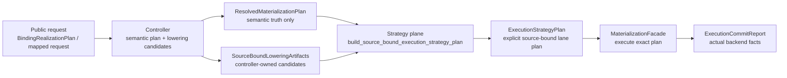
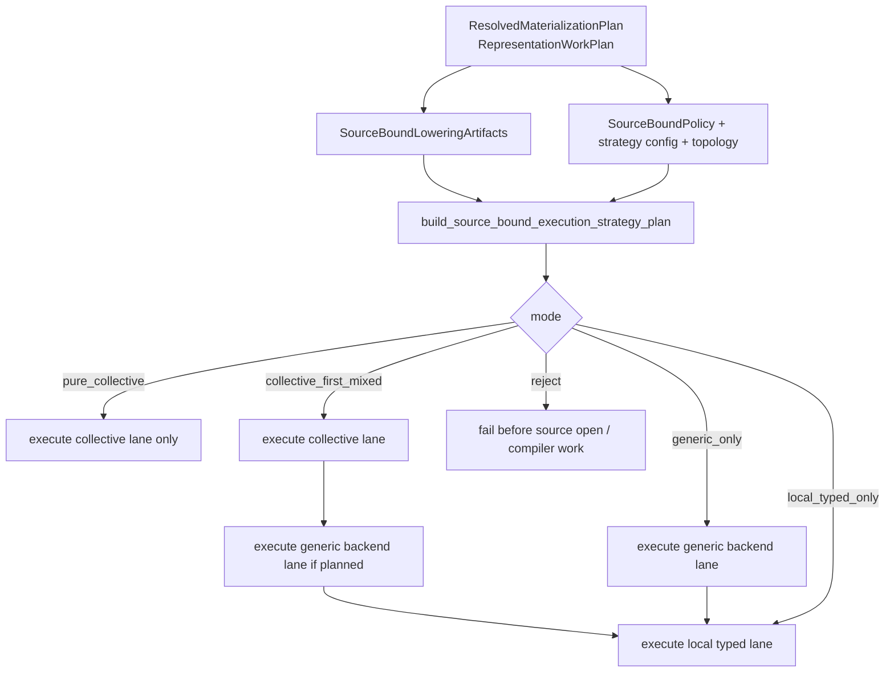

# Summary

Define the missing runtime-strategy closure for source-bound mapped and binding
materialization:

- the controller continues to build semantic truth and lowering candidates,
- the strategy plane must choose one explicit execution plan before any
  expensive executor work begins,
- the runtime must execute that plan exactly,
- and no executor may silently widen to a slower generic path because a more
  specialized lane failed to admit or declined to handle the request at
  runtime.

The core rule of this design is:

- explicit mixed execution is allowed,
- explicit generic execution is allowed,
- implicit fallback is forbidden.

This preserves the accepted `0108` and `0114` architecture while removing the
remaining ambiguity from the current source-bound implementation, where
optional maps and `value_or(...)` decisions still let runtime behavior drift
away from planner intent.

# Goals / Non-Goals

## Goals

- Keep `ResolvedMaterializationPlan` semantic-only.
- Keep `RepresentationWorkPlan` as the shared execution-core truth for typed
  work and true residual.
- Move source-bound executor selection onto one explicit strategy-owned plan.
- Make every successful source-bound execution explainable as a precomputed lane
  decision:
  - collective lane,
  - local typed lane,
  - deferred typed accounting,
  - generic backend lane,
  - and true residual accounting.
- Fail before expensive generic work when no explicit plan satisfies policy.
- Reuse the existing unified runtime configuration family under
  `engine.materialization_strategy`.
- Preserve or improve hot-path performance versus the current implementation.

## Non-Goals

- Rename the public daemon `CollectivePolicy` enum on this change.
- Introduce binding-path-private environment variables or a second policy
  namespace.
- Rebuild byte-range lowerings from scratch on every request when an equivalent
  lowering already exists.
- Replace `RepresentationWorkPlan`, `IntoTargetLayout`, or
  `MaterializationFacade`.
- Remove generic execution from the project.
- Require source-bound startup to be pure collective in all modes.

# Prior Constraints Reviewed

## `0108` semantic truth vs executor choice

Kept.

`ResolvedMaterializationPlan` must continue to carry semantic truth only, not
executor choice, runtime heuristics, or rollout policy.[^0108-semantic]

Revised application:

- the current source-bound path stores
  `collective_compatibility_map` and
  `executor_private_generic_fallback_map` on
  `ResolvedMaterializationPlan`;
- this design moves those back out of the semantic plan and into strategy- or
  controller-owned execution artifacts.

## `0110` shared execution-core vocabulary

Kept.

`RepresentationWorkPlan` remains the shared execution-core contract. Typed work
items still define semantic coverage, and `residual_fallback_map` remains
reserved for bytes with no typed execution equivalent.[^0114-work-plan]

## `0114` collective-first mixed execution

Kept, but narrowed.

`0114` correctly establishes that source-bound startup may succeed through a
mixed plan that includes collective, local typed, deferred typed, and true
generic residual lanes.[^0114-controller] What `0114` leaves open is the final
runtime handoff: the current code still derives executor behavior from optional
maps and post-hoc runtime handling results.

This design closes that gap by making lane choice explicit and fail-fast.

## Unified runtime configuration rule

Kept.

The source-bound path must stay under the existing
`engine.materialization_strategy` controls. No new environment-only or
binding-only execution toggles are introduced.

# Problem Statement

The current source-bound path has the right semantic pieces but the wrong final
runtime ownership.

Today the pipeline is effectively:

1. daemon controller builds `RepresentationTransformContract`,
2. controller also emits compatibility and generic byte-range maps,
3. `build_resolved_mapped_materialization_plan(...)` copies those maps into
   `ResolvedMaterializationPlan`,
4. runtime chooses behavior from the presence or absence of those maps,
5. collective execution may still yield `handled=false`,
6. runtime then continues into a generic path.

That creates three concrete system-level problems.

## 1. The semantic plan is polluted by executor-private state

`ResolvedMaterializationPlan` currently stores executor-facing maps that do not
represent semantic truth. This conflicts with the layering that `0108`
established.

## 2. Runtime behavior is not fully planner-owned

The current implementation still contains hidden branch points such as:

- compatibility map absent -> use generic map,
- collective map absent -> use executor-private map,
- collective attempt not handled -> continue generic execution.

Those are implementation conveniences, not explicit strategy decisions.

## 3. Hidden generic execution is bad for optimization

When runtime silently reaches a generic backend:

- operators cannot reliably distinguish “planner explicitly chose generic” from
  “specialized executor declined and runtime improvised”;
- performance regressions can hide behind successful requests;
- and future optimizer work lacks a trustworthy signal telling it which bytes
  really needed a generic backend.

This design treats that as an architecture bug, not merely an observability
gap.

# Architecture & Interfaces

## Target Ownership Model



The module split after this design is:

| Layer | Responsibility | Must not own |
| --- | --- | --- |
| daemon controller | request normalization, semantic lowering, lowering candidates, public policy normalization | runtime fallback behavior |
| core strategy plane | explicit lane assignment and executor selection | public wire parsing |
| runtime executor | source acquisition, byte-range composition, backend execution, actual commit facts | policy decisions or fallback invention |
| SDK/diagnostics | typed plan facts and actual execution facts | local heuristics |

## Internal Policy Normalization

The daemon proto keeps the current public wire enum:

- `REQUIRE_COLLECTIVE`
- `ALLOW_NOT_ELIGIBLE_FALLBACK`
- `DISABLE_COLLECTIVE`

The source-bound runtime must not depend on daemon proto enums directly.

This design adds one internal core/runtime enum:

```cpp
enum class SourceBoundPolicy : std::uint8_t {
  kRequirePureCollective = 0,
  kCollectiveFirst = 1,
  kDisableCollective = 2,
};
```

Controller mapping:

- `REQUIRE_COLLECTIVE` -> `kRequirePureCollective`
- `ALLOW_NOT_ELIGIBLE_FALLBACK` -> `kCollectiveFirst`
- `DISABLE_COLLECTIVE` -> `kDisableCollective`

This keeps public API compatibility while making runtime policy independent
from daemon headers.

## Proposed Internal Types

The new strategy/runtime types are:

```cpp
enum class SourceBoundExecutionMode : std::uint8_t {
  kPureCollective = 0,
  kCollectiveFirstMixed = 1,
  kGenericOnly = 2,
  kLocalTypedOnly = 3,
};

struct SourceBoundLoweringStats {
  std::uint64_t compatible_candidates{0};
  std::uint64_t compatible_bytes{0};
  std::uint64_t concat_candidates{0};
  std::uint64_t concat_bytes{0};
  std::uint64_t rejected_mixed_src_or_dim{0};
  std::uint64_t rejected_mixed_src_or_dim_bytes{0};
  std::uint64_t rejected_non_contiguous{0};
  std::uint64_t rejected_non_contiguous_bytes{0};
  std::uint64_t rejected_unsupported_distribution{0};
  std::uint64_t rejected_unsupported_distribution_bytes{0};
};

struct SourceBoundLoweringArtifacts {
  loader::ByteRangeMap collective_candidate_map;
  loader::ByteRangeMap generic_candidate_map;
  SourceBoundLoweringStats lowering_stats;
};

struct SourceBoundLanePlan {
  SourceBoundExecutionMode mode{SourceBoundExecutionMode::kGenericOnly};
  loader::ByteRangeMap collective_lane_map;
  loader::ByteRangeMap generic_backend_map;
  loader::ByteRangeMap true_residual_map;
  std::uint64_t local_typed_bytes{0};
  std::uint64_t local_pad_bytes{0};
  std::uint64_t local_fill_bytes{0};
  std::uint64_t deferred_typed_bytes{0};
  bool require_collective_success{false};
  std::string selection_reason;
  absl::flat_hash_map<std::string, std::uint64_t> reject_reason_buckets;
};
```

`ExecutionStrategyPlan` gains:

- `std::optional<SourceBoundLanePlan> source_bound_lane_plan`

`PreparedSourceBoundExecution` gains:

- `std::optional<strategy::ExecutionStrategyPlan> strategy_plan`

The build entrypoint is:

```cpp
absl::StatusOr<ExecutionStrategyPlan> build_source_bound_execution_strategy_plan(
    const ResolvedMaterializationPlan& resolved_plan,
    const SourceBoundLoweringArtifacts& lowering_artifacts,
    SourceBoundPolicy policy,
    const StoreEngineOptions::MaterializationStrategyConfig& strategy_config,
    const loading::ExecutionTopologyContext& execution_topology,
    bool disk_source_available);
```

## Naming Compliance

The proposed interfaces follow repository naming rules:

- `SourceBoundPolicy`, `SourceBoundExecutionMode`,
  `SourceBoundLoweringStats`, `SourceBoundLoweringArtifacts`, and
  `SourceBoundLanePlan` are `PascalCase` structs or enums.
- `build_source_bound_execution_strategy_plan` is `snake_case`.
- No new constants or macros are introduced here; any later constants must use
  `ALL_CAPS`.

## Strategy Decision Rules

The planner must emit exactly one of the following outcomes.

| Mode | When allowed | Runtime behavior |
| --- | --- | --- |
| `kPureCollective` | `SourceBoundPolicy::kRequirePureCollective` and the full request is collective-admissible with zero local typed, zero deferred typed, and zero true residual bytes | collective lane only; any unhandled or failed collective attempt is fatal |
| `kCollectiveFirstMixed` | policy is `kCollectiveFirst`, planner can prove complete coverage, and the request has at least one collective-admitted byte | collective lane first, then explicit generic backend lane if planned, then local typed work |
| `kGenericOnly` | planner can prove complete coverage through explicit generic backend bytes plus local typed work, and collective is disabled, rejected, or not beneficial | no collective attempt |
| `kLocalTypedOnly` | no data bytes are required; only fill or pad work remains | no collective and no generic backend |
| reject | none of the above covers the request | fail before executor setup |

Normative rules:

1. runtime may execute only the lane plan it receives;
2. runtime may not upgrade or downgrade the mode after execution starts;
3. if `require_collective_success` is true and collective returns
   `handled=false`, the request fails;
4. if the planner emits `kGenericOnly`, that is not a fallback, it is the
   chosen plan;
5. `true_residual_map` remains semantic truth;
6. `generic_backend_map` is executor-private implementation detail and may
   cover:
   - true residual bytes,
   - and explicitly lowered deferred typed bytes;
7. bytes must not become “true residual” merely because a preferred executor
   did not admit them.

## Coverage Invariants

For source-bound execution:

1. `ResolvedMaterializationPlan` plus `RepresentationWorkPlan` remain the
   semantic source of truth.
2. `SourceBoundLanePlan` must prove complete target coverage before execution.
3. `collective_lane_map` and `generic_backend_map` must be disjoint in target
   byte coverage.
4. `true_residual_map` must be a semantic subset of the bytes assigned to the
   generic backend lane.
5. `local_typed_bytes` must come from explicit work items, never from executor
   side effects.
6. Runtime source-byte-space finalization may rewrite source offsets, but it
   must not change lane ownership.

Any violation is a planner bug and must fail with `FAILED_PRECONDITION` or
`INTERNAL`, not with silent fallback.

## Transitional Use of Existing Lowerings

This design does not require an immediate rewrite of
`representation_transform_builder`.

During rollout:

- `compatibility_lowered_map` remains a controller-side lowering candidate;
- `generic_fallback_map` remains a controller-side transitional generic-backend
  lowering candidate;
- but neither map may define runtime behavior by defaulting or absence checks.

Instead, controller normalizes them into `SourceBoundLoweringArtifacts`, and
the strategy plane decides whether either map is used.

This preserves hot-path performance by reusing already-computed segment maps
while still restoring explicit execution ownership.

## Execution Flow



# Performance Model

This design must not trade clarity for throughput.

## Performance Requirements

1. No extra source opens on rejected requests.
   - Planner rejection must happen before `IArtifactLoader::initialize()`,
     `open_source()`, or `ByteRangeCompiler::Compile(...)`.
2. No mandatory second lowering pass.
   - Existing controller-produced byte-range lowerings are reused as planner
     inputs during rollout.
3. No deep-copy amplification of segment vectors on the hot path.
   - Implementation should move or share immutable `ByteRangeMap` storage
     between controller normalization, strategy planning, and executor use.
4. No loss of current fast paths when they are explicitly selected.
   - `source_ordered` generic execution remains available for explicit generic
     plans.
   - collective executor still receives a precomputed lane-local map.
5. No planner-side quadratic overlap work.
   - Coverage verification must remain linear or `O(n log n)` over normalized
     spans and segments.

## Why Explicit Planning Helps Performance

Explicit planning is not only for correctness.
It improves optimization quality because:

- the runtime stops compiling and running generic plans when a strict policy
  already proves the request should fail;
- collective bytes, local typed bytes, deferred typed bytes, and true residual
  bytes become measurable as distinct buckets;
- performance regressions stop hiding behind “successful but generic-dominant”
  executions;
- and future optimizer work can attack the exact rejected or residual buckets
  rather than reverse-engineering behavior from logs.

## Interaction with Current Fast Paths

This design preserves current backend mechanics:

- collective path still consumes a byte-range lane map after source finalization;
- generic path still uses existing mapped-target source-ordered or streaming
  backends;
- local typed execution still uses `RepresentationWorkPlan` fill and pad work
  items.

What changes is not the low-level backend implementation.
What changes is that backend entry becomes explicit and preplanned.

# Failure Model

## Fail-Fast Rule

If no explicit execution plan satisfies:

- policy,
- topology,
- strategy config,
- semantic coverage,
- and available lowering artifacts,

the daemon must fail before expensive executor setup.

## Runtime Rule

Once execution begins:

- collective may fail,
- generic backend may fail,
- local typed execution may fail,

but runtime may not respond by inventing a new lane plan.

Allowed outcomes are:

- complete success according to the precomputed plan,
- or explicit failure.

## Operator Meaning

After this design:

- “generic backend bytes” means the planner chose generic backend bytes;
- “true residual bytes” means no typed execution equivalent existed;
- “collective not used” means either:
  - the planner chose a non-collective mode,
  - or the request failed because a collective mode was required and unhandled.

It no longer means “runtime tried something else and then quietly moved on.”

# Interface and Module Changes

## Daemon controller

`materialization_target_plan_utils` must stop writing executor-private maps into
`ResolvedMaterializationPlan`.

Instead it produces:

- `ResolvedMaterializationPlan`
- `SourceBoundLoweringArtifacts`

`owned_binding_service` becomes responsible for:

- public policy normalization,
- calling `build_source_bound_execution_strategy_plan(...)`,
- and deriving planner diagnostics from the returned lane plan.

## Core strategy plane

`materialization_strategy_types.h` gains the source-bound policy and lane-plan
types above.

`ExecutionStrategyPlan` remains the common strategy owner.
This keeps source-bound execution aligned with the same strategy abstraction
used by the ordinary path rather than introducing a parallel planning stack.

## Runtime executor

`MaterializationFacade::materialize_mapped_into_target(...)` and the
corresponding `StoreEngine` entrypoints must consume the explicit
`ExecutionStrategyPlan` for source-bound requests.

The executor must remove runtime decisions of the form:

- “if collective map missing, use executor-private map”,
- “if collective attempt not handled, continue generic”,
- “if compatibility map absent, fall back to generic map”.

## Diagnostics

`SourceBoundPlanDiagnostics` should become plan-derived rather than
`ResolvedMaterializationPlan`-derived.

This design also recommends additive planner fields so operators can answer the
questions `0114` already requires:

- selected execution mode,
- planned generic-backend bytes,
- planned deferred typed bytes,
- planned local pad bytes,
- planned local fill bytes.

These are additive compatibility-safe proto and SDK changes.

# Schema Changes

None.

# Trade-offs & Risks

## Trade-offs

- Short term: one more explicit strategy structure exists during rollout.
- Long term: runtime logic becomes simpler because execution stops making
  policy decisions.

## Risks

- Incomplete coverage partitioning could turn legitimate requests into early
  failures.
- Transitional coexistence of old lowering fields and new explicit planning can
  create temporary duplication.
- Diagnostics expansion touches daemon proto and SDK typed wrappers.

## Mitigations

- Land planner coverage tests before executor cutover.
- Keep existing lowerings as transitional planner inputs to avoid a large
  semantic rewrite.
- Make diagnostics additive first; remove transitional fields only after
  strategy and runtime cutover is stable.

# Compatibility & Acceptance Criteria

## Compatibility

- Public wire policy names remain unchanged.
- Existing strategy config names remain unchanged.
- Existing semantic contracts remain unchanged.
- Proto or SDK diagnostics changes must be additive only.

## Acceptance Criteria

1. `ResolvedMaterializationPlan` no longer stores source-bound executor-private
   maps.
2. Source-bound execution always has one explicit strategy plan or an explicit
   pre-execution failure.
3. `REQUIRE_COLLECTIVE` failures occur before generic compiler or source-open
   work begins.
4. Runtime contains no `value_or(...)`-style executor fallback for the
   source-bound mapped path.
5. `collective_handled=false` in a collective-required or collective-selected
   mode becomes explicit failure, not generic continuation.
6. `actual_generic_backend_bytes > 0` is explainable from a precomputed lane
   plan.
7. `true_residual_bytes` remain semantically distinct from lowered deferred
   typed bytes.
8. Current source-ordered and collective fast paths remain available when
   explicitly selected.

# References

- `0108` strategy-plane layering and semantic-truth separation
- `0109` owner-file collective executor constraints
- `0110` representation contract and execution-core vocabulary
- `0114` collective-first source-bound execution goals and diagnostics

[^0108-semantic]: [Tensor-Aware Materialization Strategy Plane](/data/workspace/tensorcast-280/docs/designs/0108-tensor-aware-materialization-strategy-plane.md#L396)
[^0114-work-plan]: [Collective-First Binding Realization for TP Serving Startup](/data/workspace/tensorcast-280/docs/designs/0114-collective-first-binding-realization-for-tp-serving-startup.md#L758)
[^0114-controller]: [Collective-First Binding Realization for TP Serving Startup](/data/workspace/tensorcast-280/docs/designs/0114-collective-first-binding-realization-for-tp-serving-startup.md#L758)
