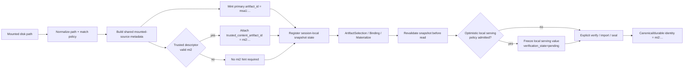

# Summary

`ResolvePublicDiskSource` should stop behaving like a partial import path and
should stop returning a public source-handle-shaped object whose semantics
depend on whether `artifact_id` happened to be known.

The long-term contract should instead be:

- mounted trusted disk sources are attested into a daemon-session-local artifact
  profile,
- successful mounted resolve always mints `msa1:` as the **primary** public
  artifact id,
- `mi2:` remains the only content-verified identity and is formed only by
  explicit verification, import, or seal,
- and any already-known `mi2:` from a trusted descriptor is surfaced as an
  optional content hint rather than replacing the mounted artifact's primary
  identity.
- optimistic binding-native serving may use an `msa1:`-backed local-ready
  serving value before `mi2:` promotion, but that local-ready value is
  same-daemon, session-local, and not a canonical publication identity.

This is the correct long-term optimization boundary:

- default mounted resolve is lightweight and does not hash payload bytes,
- binding-native serving can remain artifact-first without inventing `disksrc:`
  or a parallel source-handle plane,
- and the repository keeps one artifact-centric model while preserving strict
  consistency and explicit authority boundaries.

The key correction is therefore not "sometimes return `mi2:` faster."

The key correction is:

- keep mounted resolve lightweight by default,
- keep mounted resolve artifact-first through `msa1:`,
- keep source freshness and source authority explicit through mounted snapshot
  validation,
- allow local-ready serving to proceed on trusted `msa1:` evidence when a
  binding-native family has been admitted for optimistic startup,
- and keep canonical, durable, or cross-daemon content truth explicit through
  later `mi2:` promotion rather than by overloading the resolve path.



# Goals / Non-Goals

## Goals

- Make trusted mounted sources first-class artifact subjects instead of a
  special public source-handle contract.
- Keep the default mounted-source identity lightweight:
  - successful mounted resolve returns `msa1:`,
  - and default cold-path resolve does not hash payload bytes.
- Support existing on-disk formats explicitly and deterministically:
  - partitioned `tensor.data` / `tensor.data_N`
  - `*.safetensors`
- Remove `disksrc:` and any future artifact-shaped local-source fallback ids.
- Keep `mi2:` strict and unchanged as the only content-verified identity.
- Introduce a lightweight mounted-source artifact identity family (`msa1:`)
  with narrower guarantees than `mi2:` but stronger semantics than a bare local
  path or public handle.
- Keep mounted-source profile, authority, and validation semantics explicit.
- Make snapshot revalidation a hard invariant so mounted bytes cannot silently
  drift underneath an artifact id.
- Permit a separately configured optimistic local-ready serving mode where an
  admitted same-daemon binding-native flow may serve from frozen realized bytes
  while `msa1 -> mi2` promotion runs asynchronously.
- Keep trust and policy in typed daemon config under `0004`.
- Reuse the repository's existing profile/authority split from `0092` rather
  than introducing a second long-term object model.
- Introduce one shared core metadata seam for mounted-source resolve, import,
  hashing, and disk loading.

## Non-Goals

- Do not redefine `mi2:` from `0007`.
- Do not make `msa1:` a Global Store catalog identity or a cross-daemon routing
  contract.
- Do not make resolve-time mounted attestation a durable registration path.
- Do not mint primary `mi2:` identity from the default mounted resolve fast
  path.
- Do not treat optimistic local-ready serving as Global Store publication,
  durable key activation, cross-daemon routing, or content verification.
- Do not preserve compatibility shims such as `disksrc:` or
  `cgid:disk_source~...`.
- Do not keep long-term request-level trust toggles that bypass typed mounted
  policy.
- Do not promise tensor-aware semantics for every mounted directory shape when
  the repository does not have authoritative tensor metadata for that format.

# Prior Constraints Reviewed

## `0004` Unified Runtime Config

Kept and strengthened.

Trusted mounted-source behavior must be modeled as typed daemon config with
explicit defaults, validation, and restart-time semantics.

Long-term rule:

- mounted-source trust, descriptor reuse, lightweight attestation, and
  revalidation are daemon config concerns,
- not per-call ambient behavior.

## `0007` Content-Addressed Artifact ID

Kept exactly.

`mi2:` remains the only verified content identity.
`msa1:` is not a weaker `mi2:`; it is a different identity family with a
different authority contract.

## `0009` Safetensors Loader Integration

Kept and made normative for mounted attestation.

Safetensors attestation must preserve the existing source-layer rules:

- payload byte space excludes headers,
- canonical index is rebuilt from headers,
- filename ordering is lexicographic,
- and descriptor absence is permitted.

## `0017` Client-Generated Artifact ID

Kept by exclusion rather than reused.

`cgid:` remains the client-generated identity family.
Mounted-source attestation should not overload `cgid:` because the source of
authority is different:

- `cgid:` is client-asserted,
- `msa1:` is daemon-attested under trusted mounted-source policy.

## `0077` Unified Reference-Only Disk Import

Kept with a sharper boundary.

`ImportArtifactFromPath` remains the explicit durable `mi2:` path.
Mounted-source attestation is separate:

- it may reuse format-aware metadata builders,
- but it does not share import semantics,
- it does not durably register the mounted source at resolve time,
- and it does not promote the mounted source to primary `mi2:` identity in the
  fast path.

## `0084` Binding Unified Model

Strengthened.

Bindings should not need a second public source-handle plane.
A mounted source that has been attested to `msa1:` is already an artifact
subject in the binding sense, even though it is not yet a published or globally
routable `mi2:`.

## `0091` Selection Identity / Resolved Source / Verified Content

Applied directly.

Mounted-source attestation must feed the existing shared truth layering:

- exact source size and provenance still belong in `ResolvedSourceDescriptor`,
- `msa1:` is an artifact identity family, not content truth,
- mounted snapshot validation is source-shape consistency, not content
  verification,
- and final `mi2:` still comes only from content verification or explicit
  durable promotion.

## `0092` Artifact Profiles / Truth Layering

Applied directly.

Mounted-source artifacts are best modeled as:

- a distinct artifact profile,
- with daemon-session-local authority,
- lowering into the shared executor like any other artifact family.

## `0112` Binding-Native Serving Realization And Publication

Cleaned up.

The long-term missing piece was not "invent a fake artifact id when
`artifact_id` is empty."
The missing piece was "attest mounted trusted sources into a lightweight
artifact profile so binding-native serving can stay artifact-first without
forcing `mi2:` hashing on the cold path."

# Architecture & Interfaces

## 1. Public Contract: Attested Mounted Artifact, Not Source Handle Resolution

The long-term public contract is:

- resolve a local mounted path,
- attest it under daemon policy,
- return a mounted-source artifact subject whose `artifact_id` is always
  non-empty,
- and use `msa1:` as that subject's primary public identity.

The public result may still temporarily travel through a message named
`PublicDiskSourceHandle` in the first cut, but its semantics should change:

- `artifact_id` is required on success,
- `artifact_id` is always `msa1:`,
- any known `mi2:` is returned only as optional content truth metadata,
- and any daemon-local snapshot token is internal state, not the public
  identity.

Required result facts:

| Field | Meaning |
| --- | --- |
| `artifact_id` | required; always `msa1:` on successful mounted resolve |
| `trusted_content_artifact_id` | optional `mi2:` already known from a trusted descriptor or explicit verification path |
| `path` | normalized local path under daemon policy |
| `canonical_index_bytes` | canonical source bytes used for planning and selection |
| `source_index_bytes` | optional physical-layout bytes when the format has distinct source layout |
| `format_kind` | `PARTITIONED` or `SAFETENSORS` |
| `metadata_capability` | `TENSOR_AWARE` or `BYTE_ONLY` |
| `resolution_strategy` | `ATTESTED_ONLY` or `ATTESTED_WITH_TRUSTED_DESCRIPTOR_HINT` |
| `policy_id` | stable trusted-source policy id |
| `validation_mode` | how every later mounted-source read revalidates the snapshot |
| `exact_size_bytes` | authoritative logical byte length for lowering |
| `generation` | derived from canonical index bytes only |

Design rules:

- successful public mounted resolve must no longer mean
  "`artifact_id` maybe empty but here is some other source-plane token,"
- resolve-time mounted attestation must no longer use `mi2:` as the mounted
  artifact's primary identity,
- and default mounted resolve must not hash payload bytes to form identity.

## 2. New Identity Family: `msa1:`

### 2.1 Meaning

`msa1:` is a daemon-attested mounted-source artifact id.

It means:

- this daemon session resolved a mounted source under a trusted policy,
- the mounted source passed format-aware metadata construction,
- the mounted snapshot evidence matched policy at resolve time,
- and the daemon is willing to treat that snapshot as an artifact subject for
  same-daemon artifact APIs and binding-native execution.

It does **not** mean:

- payload bytes were fully hashed,
- the object is globally routable,
- the object is GS-cataloged,
- the object is durable across daemon restart,
- or the object is exempt from later revalidation before read.

### 2.2 Stable shape

Suggested shape:

```text
msa1:<daemon_session_enc>~<policy_id_enc>~<format_kind>~<snapshot_digest_hex>
```

Where `snapshot_digest_hex` is computed from:

- normalized path,
- policy id,
- format kind,
- metadata capability,
- canonical index digest,
- optional source index digest,
- exact size,
- and format-aware snapshot evidence.

### 2.3 Generation semantics

`generation` remains derived from canonical index bytes.

It is useful for:

- lowering,
- metadata cache coherence,
- and request/result compatibility checks tied to layout.

It must **not** be used as:

- a mounted-source freshness token,
- a mutation detector,
- or a substitute for snapshot revalidation.

Mounted-source freshness is determined by mounted snapshot evidence and the
`msa1:` snapshot digest, not by `generation`.

### 2.4 Identity strength

`artifact_id` identity families now have different authority strengths:

| Identity family | Authority strength | Typical owner |
| --- | --- | --- |
| `mi2:` | content-verified | shared verification seam |
| `msa1:` | daemon-attested mounted-source artifact | local daemon policy + mounted snapshot registry |
| `cgid:` | client-asserted runtime artifact | client / profile-specific authority |

This keeps the repository artifact-first without pretending every artifact id
implies the same proof level.

## 3. Internal Mounted Source Snapshot Registry

The daemon still needs local snapshot state, but that state should be internal.

The mounted-source registry should be keyed by `artifact_id` for `msa1:` and
record:

- normalized source path,
- policy id,
- format kind,
- metadata capability,
- canonical index bytes,
- optional source index bytes,
- exact size,
- snapshot evidence and file fingerprints,
- validation mode,
- optional trusted descriptor facts,
- optional `trusted_content_artifact_id`,
- optional promoted `mi2:` if later explicitly verified or imported,
- and last validation result / timestamp for diagnostics.

Normative rules:

1. The same mounted path may re-resolve to the same `msa1:` only if the daemon
   session, policy, metadata, and snapshot evidence all still match.
2. If snapshot evidence changes, resolve must mint a different `msa1:`.
3. After daemon restart, prior `msa1:` values are invalid regardless of path
   equality.
4. An internal `source_snapshot_ref` may still exist for implementation
   convenience, but it is not the public contract.

## 4. Profile And Authority Model

Mounted-source attestation should become an explicit artifact profile in the
`0092` sense:

- profile: `mounted_source_artifact`
- family: ordinary artifact family
- authority model: `daemon_session_local`

Implications:

- it uses `ArtifactSelection` like ordinary artifacts,
- it lowers through the shared executor,
- it is not GS-backed metadata authority,
- and it does not opt into routed or cross-daemon retrieval merely by being an
  artifact id.

This is the core reason `msa1:` is better than a public source-handle plane:

- it keeps one artifact-centric object model,
- while still preserving narrower authority semantics than `mi2:`.

### 4.1 Surface admission matrix

| Surface | `msa1:` behavior |
| --- | --- |
| same-daemon `Store.artifact(msa1)` | allowed |
| same-daemon materialization / target realization | allowed |
| binding-native realization | allowed |
| tensor-aware view planning | allowed only when `metadata_capability=TENSOR_AWARE` |
| Global Store artifact-info RPCs | rejected |
| key activation / durable key mapping | rejected |
| cross-daemon retrieval as if GS-backed | rejected |
| optimistic same-daemon local serving | allowed only by typed policy, with pending `mi2` verification |
| canonical / durable publication identity | rejected until explicit promotion to `mi2:` |

The profile and authority model, not just the string prefix, must control
surface admission.

## 5. Metadata Capability And Format Support

Mounted-source attestation must be explicit about metadata capability.

### 5.1 Capability levels

- `TENSOR_AWARE`
  - canonical tensor metadata is authoritative,
  - view planning and tensor-aware binding realization are allowed.
- `BYTE_ONLY`
  - only byte-space semantics are authoritative,
  - tensor-aware view or binding flows are not allowed.

### 5.2 First-cut support matrix

Required:

- safetensors directories: `TENSOR_AWARE`
- partitioned directories with `tensor_index.json|cbor`: `TENSOR_AWARE`

Optional first cut:

- partitioned directories without `tensor_index.json|cbor`: `BYTE_ONLY`

Explicit non-goal for this design:

- do not silently treat partitioned-without-index as tensor-aware just because
  payload files exist.

## 6. Shared Core Metadata Seam

The repository should introduce one shared core metadata builder for mounted
disk sources and reuse it across:

- mounted-source attestation,
- import,
- disk hashing,
- and disk loading.

Suggested shared output object:

- `MountedSourceMetadata`

Suggested core builder:

- `build_mounted_source_metadata(...)`

That builder should produce:

- format kind,
- metadata capability,
- canonical index bytes,
- optional source index bytes,
- exact size,
- canonical index digest,
- optional source index digest,
- descriptor metadata,
- and format-aware snapshot evidence.

### 6.1 Directory scope rule

Detection and snapshot evidence must match loader semantics.

Normative rule:

- the mounted artifact directory is the normalized path passed to resolve,
- detection is **non-recursive** and inspects top-level files in that directory
  only,
- nested files or nested subdirectories must not participate in format
  detection, snapshot evidence, hashing, or loading.

Policy root matching is separate from artifact directory scope:

- policy roots may allow a parent directory tree,
- but the resolved mounted artifact directory still has one concrete,
  non-recursive scope.

This avoids the current drift risk where one caller recursively discovers files
that the loader and hash path would ignore.

### 6.2 Detection rules

Detection must match loader semantics:

1. if top-level `tensor.data` or any top-level `tensor.data_N` is present,
   format is `PARTITIONED`,
2. else if any top-level `*.safetensors` file is present, format is
   `SAFETENSORS`,
3. else fail with source-format error.

Mixed top-level directories resolve as `PARTITIONED`.

## 7. Format-Specific Rules

### 7.1 Partitioned format

Payload-bearing files:

- `tensor.data`
- `tensor.data_0`, `tensor.data_1`, ...

Rules:

- multipart ordering is numeric by suffix, not lexicographic,
- `tensor_index.json|cbor` are metadata sidecars, not payload bytes,
- no-index partitioned support, if shipped in the first cut, is `BYTE_ONLY`,
- a valid trusted descriptor may populate
  `trusted_content_artifact_id = mi2:...`,
- but it must not replace primary `artifact_id = msa1:...`.

Snapshot evidence:

- numeric-ordered payload file list,
- relative path, size, and `mtime_ns`,
- daemon-local stronger fingerprints such as `(inode, size, mtime_ns)`.

### 7.2 Safetensors format

Payload-bearing files:

- all `*.safetensors` files, ordered lexicographically by filename

Rules:

- payload byte space excludes headers,
- canonical index is rebuilt from the headers,
- descriptor absence is allowed,
- filename ordering is lexicographic,
- source layout is physical metadata only and does not define identity,
- a valid trusted descriptor may populate
  `trusted_content_artifact_id = mi2:...`,
- but it must not replace primary `artifact_id = msa1:...`.

Snapshot evidence:

- lexicographic `*.safetensors` order,
- relative path, payload size, and `mtime_ns`,
- header-derived canonical/source layout facts,
- no header bytes treated as payload identity bytes.

## 8. Attestation And Verification Paths

Mounted-source resolve should follow this order:

1. normalize path and validate policy scope,
2. build shared mounted-source metadata,
3. load descriptor metadata if present,
4. mint primary `artifact_id = msa1:...` from metadata and snapshot evidence,
5. if a trusted descriptor is present, self-consistent, and names a valid
   `mi2:`, attach `trusted_content_artifact_id = mi2:...`,
6. register or refresh internal mounted snapshot state for later same-daemon
   reuse.

Critical rules:

- `ResolvePublicDiskSource` must no longer call import-style hashing as its
  primary implementation,
- successful mounted resolve must no longer switch primary identity from
  `msa1:` to `mi2:` just because a trusted descriptor was present,
- and default mounted resolve must not hash payload bytes.

Any strong content-verification path is separate:

- explicit import,
- explicit verify,
- or seal from realized bytes.

Those paths may produce `mi2:`, but that is later promotion, not the default
resolve contract.

## 9. Runtime Integration

### 9.1 Local artifact APIs

Within the same daemon session, generic local artifact surfaces should accept
`msa1:`:

- `Store.artifact(msa1)`
- artifact selection and metadata caching
- local materialization paths
- binding-native realization

These surfaces resolve `msa1:` through the daemon's mounted-source registry
rather than through Global Store.

### 9.2 Required mounted snapshot revalidation

Mounted-source attestation is only safe if every later read revalidates the
snapshot according to policy.

Normative rules:

1. Before any disk read or lowering that consumes `msa1:`, the daemon must
   revalidate current mounted snapshot evidence against the stored registry
   entry according to `validation_mode`.
2. Snapshot mismatch must fail closed and invalidate or poison the mounted
   snapshot registry entry for that `msa1:`.
3. The daemon must not silently auto-refresh a mismatched `msa1:` during the
   same request.
4. Callers must obtain a fresh resolve result to continue after mismatch.

Recommended default:

- `validation_mode = VALIDATE_BEFORE_READ`

Compatibility-only weaker modes, if any, must be explicitly typed, narrowly
scoped, and not be the default for trusted mounted-source policy.

### 9.3 Rejected surfaces

The following remain closed to `msa1:`:

- Global Store artifact-info RPCs
- key activation and durable key mapping
- cross-daemon retrieval as though `msa1:` were GS-backed
- canonical or durable final publication identity

This keeps authority boundaries explicit.

### 9.4 Binding-native serving

Binding-native serving should consume a mounted-source artifact directly.

That means:

- no fabricated `disksrc:` id,
- no parallel source-handle-only execution carrier,
- and no requirement that mounted ingress produce `mi2:` before realization.

If the source is attested as `msa1:`, the binding current value is already
artifact-backed in the profile sense, even though it is not yet content-verified
or globally routable.

### 9.5 Optimistic local-ready serving

Optimistic local-ready serving is a performance mode layered above the mounted
source contract. It does not change what `msa1:` means.

An admitted binding-native flow may mark a realized serving value ready before
`mi2:` promotion only when all of the following are true:

- the source artifact is a trusted `msa1:` and its snapshot evidence has been
  revalidated for the read;
- the model family and topology are explicitly admitted for same-binding
  optimistic startup;
- the realized value is frozen against further mutation;
- serving schema, representation contract, serving build digest, and family
  semantic validation have passed;
- the daemon records `verification_state=pending` and either schedules
  asynchronous promotion to `mi2:` or explicitly marks the value local-only by
  policy.

For tensor-parallel local bootstrap, the integration must not start `mi2`
promotion when the first rank freezes. All local ranks in the serving TP group
must first finish their local-ready transition: realization, tensor attachment,
runtime-only allocation, finalize/validation, `freeze_current`, and local
runtime-state installation. The local-ready barrier is therefore part of the
optimistic serving contract, not merely a profiling convenience.

While verification is pending, the value is not content-verified, not GS
routable, not durable-key activatable, and not a canonical publication result.

## 10. Promotion To `mi2:`

`mi2:` remains the only content-verified identity.

Mounted-source artifacts may later promote from `msa1:` to `mi2:` through:

- explicit import,
- explicit verification,
- or seal from realized bytes.

For optimistic local-ready serving, this promotion may run asynchronously after
the serving value is already live. Success may attach a canonical
`serving_artifact_id = mi2:...` and complete normal publication closeout.
Failure must not be silently ignored: the daemon must record a failed
verification state and apply the configured failure policy.

Starting promotion and running promotion are separate scheduling events.
`StartPromoteBindingCurrentValue` must create or return an observable idempotent
job for the frozen `binding_id + binding_value_id`; the daemon may delay actual
hash/commit work until critical load operations such as binding refill,
freeze, or large binding allocation are no longer active. Status polling must
remain cheap and must not perform promotion work itself.

A trusted descriptor may also populate `trusted_content_artifact_id = mi2:...`
earlier, but that hint does not change the mounted artifact's primary identity.

The daemon may record an internal alias from `msa1:` to the resulting `mi2:`
for session-local reuse, but `msa1:` and `mi2:` remain different identity
families with different guarantees.

# Schema Changes

## Identity helpers

Add `MSA1` to shared identity helpers and validators in:

- `tensorcast/common/identity.py`
- `core/common/artifact_identity.{h,cc}`

## Artifact profile registry

Add a mounted-source profile with daemon-session-local authority.

## Public mounted resolve schema

First cut:

- keep the existing RPC name if desired,
- but require non-empty `artifact_id` on success,
- require `artifact_id` to be `msa1:` on success,
- add optional `trusted_content_artifact_id`,
- remove public dependence on `source_snapshot_ref`,
- and add explicit fields for format kind, metadata capability,
  resolution strategy, validation mode, policy id, and exact size.

Longer term:

- rename the result object away from `PublicDiskSourceHandle` once the contract
  no longer behaves like a handle,
- suggested long-term type name: `MountedSourceArtifactRef`.

## Config

Add typed trusted mounted-source policy under unified runtime config, including:

- `policy_id`
- `root_path`
- `allowed_formats`
- `allowed_metadata_capabilities`
- `descriptor_reuse_mode`
- `lightweight_attestation_mode`
- `validation_mode`

Normative policy ownership rules:

- daemon config decides whether lightweight `msa1` attestation is allowed,
- daemon config decides whether trusted descriptors may populate
  `trusted_content_artifact_id`,
- and daemon config decides mounted snapshot validation mode.

Recommended defaults:

- lightweight attestation enabled for trusted mounted-source roots,
- `validation_mode = VALIDATE_BEFORE_READ`.

### Transition rule for existing request flags

The existing request-level `verify_checksums` flag may survive briefly during
transition, but only under a compatibility rule:

- it may request stricter descriptor checking than policy,
- it must not weaken mounted-source policy,
- it must not disable required mounted snapshot revalidation,
- and it must not be the long-term source of mounted trust semantics.

Long-term mounted-source trust behavior belongs in typed config only.

## No Global Store schema change in the first cut

`msa1:` is daemon-session-local authority, so the primary design does not
require GS schema changes.

## Naming Compliance

Proposed interface names in this design follow repository naming rules.

Classes / structs:

- `MountedSourceMetadata`
- `MountedSourceSnapshot`
- `MountedSourceArtifactRef`

Functions / methods:

- `build_mounted_source_metadata(...)`
- `mint_msa1_artifact_id(...)`
- `revalidate_mounted_source_snapshot(...)`
- `resolve_mounted_source_artifact(...)`
- `promote_mounted_source_to_mi2(...)`

Enums / constants:

- `VALIDATE_BEFORE_READ`
- `ATTESTED_ONLY`
- `ATTESTED_WITH_TRUSTED_DESCRIPTOR_HINT`

# Observability

Emit structured fields:

- `disk_source.format_kind`
- `disk_source.metadata_capability`
- `disk_source.policy_id`
- `disk_source.resolution_strategy`
- `disk_source.validation_mode`
- `disk_source.artifact_id_kind = msa1`
- `disk_source.trusted_content_hint_kind = none | mi2`
- `disk_source.hash_data_skipped = true | false`

Mounted evidence should report:

- safetensors vs partitioned separately,
- tensor-aware vs byte-only separately,
- attested-only vs trusted-descriptor-hint separately,
- and same-daemon snapshot revalidation success vs mismatch separately.

# Trade-offs & Risks

## Trade-offs

- This design intentionally broadens "artifact" beyond "already content
  verified" by adding a daemon-attested mounted-source artifact family.
- In return, it removes the long-term need for a parallel public source-handle
  object model.
- `msa1:` is intentionally narrower than `mi2:` and narrower than ordinary
  GS-backed artifact semantics.
- Keeping primary identity as `msa1:` even when `mi2:` is already hinted makes
  the authority model explicit at the cost of exposing two related ids in some
  responses.

## Risks

- Treating `msa1:` as a first-class artifact may tempt callers to assume GS or
  cross-daemon behavior that the profile does not provide.
  - Mitigation: profile-specific validation, authority traits, and explicit API
    rejection outside local daemon-session surfaces.
- Mounted bytes may drift after resolve.
  - Mitigation: required fail-closed snapshot revalidation before read.
- Format-specific metadata helpers may drift from loader rules.
  - Mitigation: one shared core mounted-source metadata builder.
- Partitioned-without-index support can blur byte-only and tensor-aware
  semantics.
  - Mitigation: explicit `metadata_capability` and fail-closed tensor-aware
    gating.
- Optional `trusted_content_artifact_id` may be mistaken for the mounted
  artifact's primary identity.
  - Mitigation: keep public `artifact_id` always `msa1:` and make the hint
    field explicit.

# Compatibility & Acceptance Criteria

## Compatibility Policy

This design assumes a hard cut at the contract level:

- no new `disksrc:` ids,
- no compact `cgid:disk_source~...` shims,
- no "success with empty `artifact_id`" semantics,
- no long-term public `source_snapshot_ref` dependency,
- and no long-term default hashing requirement in mounted resolve.

## Acceptance Criteria

- successful mounted-source resolve always returns non-empty `artifact_id`,
- successful mounted-source resolve returns `artifact_id = msa1:...`,
- trusted descriptor-backed sources may return
  `trusted_content_artifact_id = mi2:...` without re-hashing,
- trusted descriptorless sources can return `msa1:` without full payload
  hashing,
- default mounted resolve does not require full payload hashing,
- binding-native mounted flows no longer synthesize `disksrc:`,
- `Store.artifact(msa1)` and local same-daemon realization are valid,
- same-daemon `msa1:` reads revalidate snapshot evidence and fail closed on
  mutation,
- GS-backed or cross-daemon-only surfaces reject `msa1:` cleanly,
- partitioned source evidence honors numeric `tensor.data_N` ordering,
- safetensors source evidence honors lexicographic `*.safetensors` ordering and
  excludes headers from payload identity,
- mounted artifact directory scope is top-level-only and consistent across
  resolve, hash, and load code paths,
- mounted serving evidence shows reduced cold resolve latency on audited trusted
  mounts,
- optimistic local-ready serving, when enabled, reports pending verification
  until asynchronous promotion succeeds or fails,
- and canonical/durable publish or seal still converges to `mi2:` as the only
  content identity.

# References

- [0004 Unified Runtime Configuration System](./0004-unified-runtime-config.md)
- [0007 Content-Addressed Artifact ID](./0007-content-addressed-artifact-id.md)
- [0009 Safetensors Loader Integration](./0009-safetensors-loader-integration.md)
- [0017 Client-Generated Artifact ID](./0017-client-generated-artifact-id.md)
- [0077 Unified Reference-Only Disk Import](./0077-unified-reference-only-disk-import.md)
- [0084 Binding Unified Model and Contract](./0084-binding-unified-model-and-contract.md)
- [0091 Selection Identity, Resolved Source, and Verified Content](./0091-selection-identity-resolved-source-and-verified-content-descriptor.md)
- [0092 Artifact Profiles, Shared Dataplane, and Truth Layering](./0092-artifact-profiles-shared-dataplane-and-truth-layering.md)
- [0112 Binding-Native Serving Realization and Publication](./0112-binding-native-serving-realization-and-publication.md)
- [proto/tensorcast/daemon/v2/store_daemon.proto](/data/workspace/tensorcast-280/proto/tensorcast/daemon/v2/store_daemon.proto:694)
- [daemon/service/controllers/disk_artifact_service.cc](/data/workspace/tensorcast-280/daemon/service/controllers/disk_artifact_service.cc:479)
- [daemon/service/controllers/materialization_disk_resolve_utils.cc](/data/workspace/tensorcast-280/daemon/service/controllers/materialization_disk_resolve_utils.cc:239)
- [daemon/service/controllers/materialization_index_source_utils.cc](/data/workspace/tensorcast-280/daemon/service/controllers/materialization_index_source_utils.cc:139)
- [daemon/service/controllers/owned_binding_service.cc](/data/workspace/tensorcast-280/daemon/service/controllers/owned_binding_service.cc:1395)
- [daemon/service/artifact_profile_registry.cc](/data/workspace/tensorcast-280/daemon/service/artifact_profile_registry.cc:285)
- [daemon/state/artifact_source_registry.h](/data/workspace/tensorcast-280/daemon/state/artifact_source_registry.h:17)
- [core/store/materialization/dataplane/metadata/disk_dir_hash.cc](/data/workspace/tensorcast-280/core/store/materialization/dataplane/metadata/disk_dir_hash.cc:102)
