# Summary

TensorCast already has the control-plane pieces required for a soft model
weight broadcast:

- `RequestReplicaTransport` requires request idempotency,
- Global Store queues transport requests through group dispatch,
- group dispatch tracks group progress and source spread,
- replica selection filters liveness, availability, and capacity,
- and successful materialization registers a new daemon-local replica that can
  later serve P2P requests.

The missing Phase 1 link is the daemon-owned prefetch path. `Artifact.prefetch`
currently allocates a daemon replica through `MaterializeReplicaRequest`, but
that request does not carry transport request ids or scheduling group hints.
The result is that simultaneous model-weight prefetches cannot reliably enter
Global Store as one transport group, even though the scheduler already knows
how to dispatch such a group.

This design adds a first-class transport scheduling hint to the SDK and daemon
materialization API, then reuses the existing Global Store scheduler and P2P
data plane. It deliberately does not introduce an independent broadcast
control plane and does not move model-weight distribution to NCCL.

```mermaid
flowchart LR
  A["Model version prefetch<br>same broadcast group"] --> B["SDK CallContext<br>transport group + request id"]
  B --> C["Store Daemon<br>MaterializeReplicaRequest"]
  C --> D["StoreEngine<br>MaterializeHints"]
  D --> E["Global Store<br>group dispatch"]
  E --> F["Selected source replica<br>source spread"]
  F --> G["P2P materialization<br>RDMA / MTCP / routing"]
  G --> H["Target daemon<br>registers replica"]
  H --> I["New source candidate<br>for later requests"]
```



# Goals / Non-Goals

## Goals

- Let one model version prefetch fanout produce stable transport request ids
  and a shared `weight_broadcast` scheduling group.
- Preserve `replica_uuid` as a pure daemon replica/session identifier.
- Reuse existing Global Store group dispatch, pending request queues,
  idempotency checks, source spread, and completion outcome accounting.
- Reuse existing P2P materialization and replica registration/export paths.
- Keep ordinary `tensorcast.artifact(...).tensor_dict()` and ungrouped
  `Artifact.prefetch()` behavior unchanged.
- Provide an API shape that can evolve into explicit broadcast sessions and
  tree plans without rewriting the data plane.

## Non-Goals

- Do not implement strict parent-child tree scheduling in Phase 1.
- Do not add chunk-level pipeline broadcast in Phase 1.
- Do not introduce NCCL as the cross-cluster model-weight broadcast control
  plane.
- Do not add a Global Store schema migration for Phase 1.
- Do not change `MaterializeIntoTarget`, binding, or mapped-binding transport
  semantics in the first cut.

# Prior Constraints Reviewed

## Group-aware transport scheduling

`docs/plans/0083-group-aware-transport-scheduling.md` and the current Global
Store code already define queue-based dispatch, group fairness, completion
bias, starvation aging, and source spread. This design keeps that scheduler as
the Phase 1 control-plane primitive instead of adding a parallel scheduler.

## Strategy-plane ownership

`0108` keeps semantic materialization strategy in the daemon/core
materialization path. This design follows that boundary: the SDK only sends
request-level coordination hints, while Store Daemon and StoreEngine decide how
to acquire sources and execute the transfer.

## Same-host collectives

`0114` focuses on same-host collective-first binding realization. That work is
complementary but not a cluster-level broadcast replacement. This design keeps
cluster-wide model-weight dissemination under Global Store coordination and
leaves NCCL or local collectives as later locality-specific optimizations.

## Replica identity purity

Current API docs state that `replica_uuid` remains a pure operation/session id.
This design keeps that rule. Transport group metadata must travel in explicit
transport hint fields, not in `replica_uuid`.

# Architecture & Interfaces

## SDK context

Add a typed transport scheduling context:

```python
@dataclass(frozen=True, slots=True)
class TransportSchedulingGroup:
    group_id: str
    group_kind: str
    total_parts: int
    part_id: str
    priority: int = 0
    epoch: int = 0
    request_id: str | None = None
```

`CallContext` gains:

```python
transport_group: TransportSchedulingGroup | None = None
```

`tensorcast.context(...)` accepts the same optional argument. Existing
`ctx.tags["tc.transport.group.*"]` remains a compatibility path because
binding and mapped target paths already use those tags to build
`operation_id#tcg:...` strings. The typed field is the preferred API for new
prefetch callers.

Programmable plans serialize the same typed group through `plan.v1.CallContext`
so node-agent prefetch steps can preserve group membership when a cluster plan
fans out work to multiple daemons.

For model weights, callers should use:

```python
ctx = tensorcast.context(
    idempotency_key="load:model-a:v42",
    transport_group=tensorcast.TransportSchedulingGroup(
        group_kind="weight_broadcast",
        group_id="model-a:v42",
        epoch=42,
        total_parts=128,
        part_id="daemon-17",
    ),
)
store.artifact(artifact_id=artifact_id).prefetch(device="cuda:0", ctx=ctx)
```

When a group exists and no explicit transport request id is provided, SDK code
generates a deterministic id from artifact id, selection hash, daemon id,
device id, group kind, group id, epoch, and part id. This makes retries
idempotent while avoiding collisions between different target daemons or
devices.

## Daemon proto

Extend `MaterializeReplicaRequest` with explicit transport scheduling fields:

```proto
message TransportSchedulingGroupHint {
  string group_id = 1;
  string group_kind = 2;
  uint32 total_parts = 3;
  string part_id = 4;
  uint32 priority = 5;
  uint64 epoch = 6;
}

message MaterializeReplicaRequest {
  // existing fields...
  string transport_request_id = 21;
  TransportSchedulingGroupHint transport_scheduling_group = 22;
}
```

The daemon proto owns this request shape so `store_daemon.proto` does not need
to import the Global Store service proto just for one scheduling hint. The C++
daemon maps it into `store::loading::TransportSchedulingGroupHint`, which is
already the type consumed by `MaterializeHints`.

## DaemonCtl and SDK materialization

`DaemonCtl.materialize_by_artifact_id_v2(...)` receives
`transport_request_id` and `transport_scheduling_group` keyword arguments and
copies them into `MaterializeReplicaRequest`.

`materialize_artifact_v2(...)` resolves the transport hints from `CallContext`
and passes them through `DaemonCtl`. `Artifact.prefetch()` continues to call
`pipeline.materialize_subset(...)`, but grouped prefetches now reach the
daemon as explicit transport hints.

Ungrouped materialization sends no hints. Global Store request ids for
ordinary paths continue to be generated by existing C++ fallback logic.

## Store Daemon to StoreEngine

`ReplicaMaterializationService::materialize_replica(...)` reads the new request
fields and applies them to `MaterializeHints` before calling
`StoreEngine::materialize_replica(...)`.

The existing request path already passes `MaterializeHints` into:

- `MaterializeOrchestrator`,
- `MaterializationFacade`,
- `GlobalStoreClient::request_replica_transport(...)`,
- `GlobalStoreClient::request_view_transport(...)`.

Those paths already convert `TransportSchedulingGroupHint` into
`RequestReplicaTransportRequest.scheduling_group` and pass
`transport_request_id` as `request_id`.

## Global Store behavior

Phase 1 does not change Global Store schema or scheduler semantics. Grouped
prefetch requests enter the existing queue and are dispatched by:

- group fairness floor,
- completion bias,
- starvation aging,
- source-balance scoring,
- group source spread,
- heartbeat and accepting-new-request filters,
- replica and worker concurrency limits.

Only `TRANSPORT_COMPLETION_OUTCOME_SUCCESS` contributes to group progress, as
the current transport service already requires.

## Replica export

Prefetch remains daemon-owned and uses `LEASE_MODE_NO_LEASE`. To make successful
prefetch replicas useful as later sources, callers may request
`GetArtifactOptions(export_policy="auto")` or `force` where appropriate. The
daemon and StoreEngine continue to own export eligibility and remote memory key
registration.

# Future Tree Broadcast

Phase 2 can add explicit Global Store concepts without replacing the Phase 1
data path:

```text
BroadcastSession(session_id, artifact_id, view_id, epoch, fanout, state)
BroadcastEdge(session_id, parent_worker_id, child_worker_id, level, state, attempt)
```

The scheduler would select parent-child edges, then instruct each child to run
the same P2P materialization path with a preferred parent. A child only enters
the parent pool after materialization succeeds and exportable transport
metadata is registered.

Phase 3 can make parent selection topology-aware. Phase 4 can consider
chunk-level pipeline forwarding, which requires partial residency and
per-chunk verification state and is intentionally outside Phase 1.

# Naming Compliance

| Interface | Language | Compliance |
| --- | --- | --- |
| `TransportSchedulingGroup` | Python class | PascalCase, matching existing dataclass style such as `CollectiveLoadGroup`. |
| `transport_group` | Python field | snake_case field name. |
| `transport_request_id` | Python/proto/C++ field | snake_case field name. |
| `TransportSchedulingGroupHint` | Proto/C++ message mapping | PascalCase type name. |
| `resolve_transport_scheduling_hints` | Python helper | snake_case function name. |
| `apply_materialize_replica_transport_hints` | C++ helper | snake_case function name. |

# Schema Changes

Phase 1 has no Global Store database schema changes. It only extends the daemon
RPC request shape and threads already-existing scheduler metadata into existing
Global Store transport tables.

Phase 2 `BroadcastSession` and `BroadcastEdge` would require a separate design
or plan section with migrations and recovery semantics before implementation.

# Error Model

- Invalid typed groups fail client-side where possible:
  - `group_kind`, `group_id`, and `part_id` must be non-empty,
  - `total_parts` must be positive,
  - `priority` and `epoch` must be non-negative.
- If both typed `transport_group` and legacy `ctx.tags` group keys are present,
  the typed group wins for `MaterializeReplica` prefetch. This avoids
  ambiguous request ids.
- A repeated `transport_request_id` with a different payload is rejected by the
  existing Global Store idempotency checks.
- Failed, expired, or cancelled transports release capacity but do not count as
  group success.
- If no exportable source is available, materialization follows existing
  fallback behavior, including MTCP/disk fallback when allowed by source policy.

# Compatibility & Acceptance Criteria

## Compatibility

- Existing callers that do not pass `transport_group` see no behavior change.
- `tensor_dict`, `tensor_dict_into`, `Binding.swap`, and mapped binding paths
  keep their current transport hint behavior.
- Existing `ctx.tags` group keys remain recognized for compatibility.
- The new proto fields are additive and optional.

## Phase 1 Acceptance Criteria

- Multiple daemon prefetches for the same model version can carry the same
  `group_kind`, `group_id`, `epoch`, and `total_parts`.
- Each target daemon can carry a distinct `part_id` and stable
  `transport_request_id`.
- Global Store `pending_transport_requests` and `artifact_transports` show the
  requests in one group.
- Source selection uses existing group source spread instead of concentrating
  all requests on one root when alternatives are available.
- Successful target materialization still registers local replicas.
- Exportable replicas still publish remote memory keys when export policy and
  local state allow it.
- Failed, expired, or cancelled transports do not advance group success.
- Single-node, no-RDMA, and ordinary ungrouped materialization paths keep
  working through existing fallback paths.

# Testing

- Python SDK unit tests:
  - typed `TransportSchedulingGroup` validates fields,
  - `Artifact.prefetch()` forwards transport hints to the materialization
    pipeline,
  - deterministic transport request ids are stable for the same group part,
  - ungrouped prefetch sends no hint.
- Python daemon client tests:
  - `DaemonCtl.materialize_by_artifact_id_v2()` fills the new proto fields.
- C++ daemon tests:
  - `MaterializeReplicaRequest.transport_scheduling_group` becomes
    `MaterializeHints.transport_scheduling_group`.
  - `transport_request_id` becomes `MaterializeHints.transport_request_id`.
- Global Store regression tests:
  - existing group dispatch, request idempotency, group progress, and source
    spread tests continue to pass.

# References

- `tensorcast/global_store/services/transport_service.py`
- `tensorcast/global_store/repositories/replica_repository.py`
- `tensorcast/global_store/repositories/transport_repository.py`
- `core/store/materialization/contracts/loading_spec.h`
- `core/store/components/global_store_client.cc`
- `core/store/runtime/ingestion/materialization_facade.cc`
- `daemon/service/controllers/replica_materialization_service.cc`
- `tensorcast/api/store/artifact.py`
- `proto/tensorcast/daemon/v2/store_daemon.proto`
