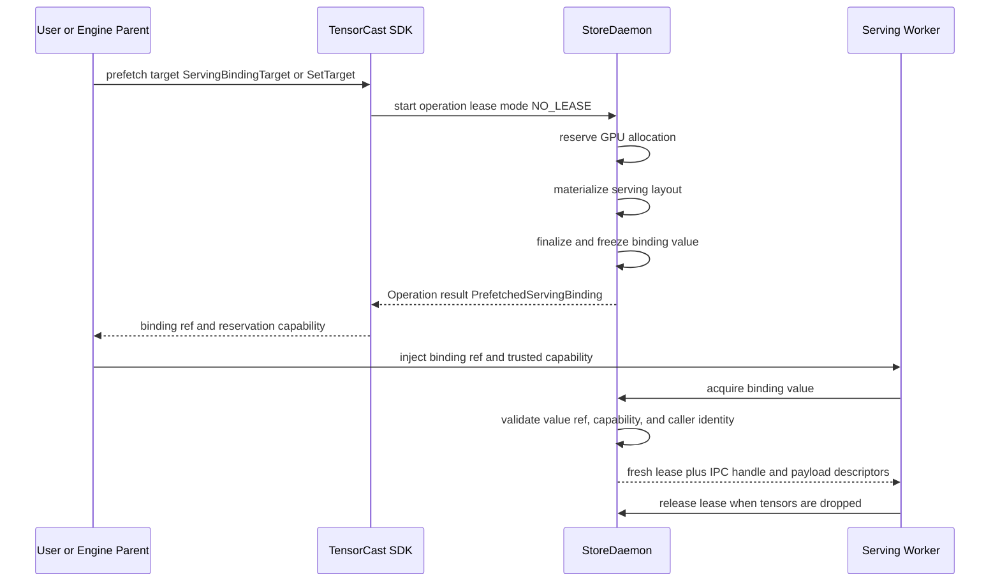
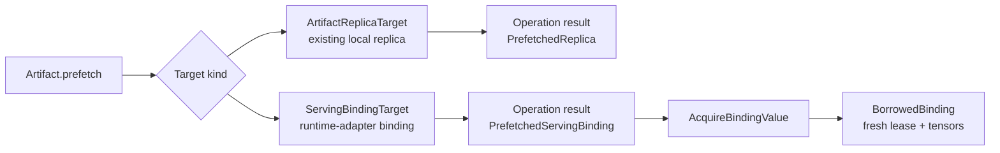
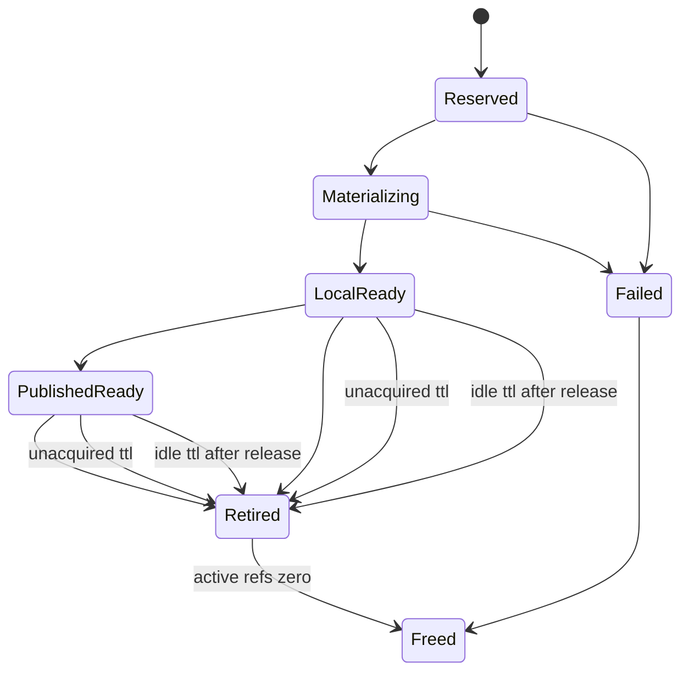

# Summary

TensorCast should expose serving preloading as an explicit `prefetch` target,
not as a parallel "preload" API family.

The user-level contract is:

```python
op = artifact.prefetch(
    target=ServingBindingTarget(...),
    readiness="serving_local_ready",
    retention=PrefetchRetentionPolicy(...),
)
binding = op.result(timeout_s=...)
```

When the source is a partitioned serving artifact set rather than one
checkpoint artifact, the SDK may expose the same daemon operation through a
store/plan-level helper. In both forms, the operation payload carries an
explicit `ServingBindingSourceRef`; the daemon must not infer source semantics
from the receiver object used to start the operation.

The daemon-level contract remains stricter:

- `prefetch` prepares a daemon-owned retained resource and remains `NO_LEASE`,
- `acquire` attaches a later serving worker and mints a fresh worker lease,
- retained GPU memory has explicit TTL, idle, and pin/keepalive semantics,
- ordinary artifact replica prefetch keeps its existing `local_replica_ready`
  readiness floor,
- and serving binding identity is always the complete binding value identity:
  `binding_id`, `binding_layout_id`, `binding_value_id`, and
  `seal_generation`.



# Goals / Non-Goals

## Goals

- Unify serving preload under the existing programmable `prefetch` operation
  surface.
- Keep ordinary `prefetch(device=...)` and `prefetch_set(...)` behavior
  unchanged.
- Make serving binding readiness explicit:
  - `serving_reserved`
  - `serving_local_ready`
  - `serving_published_ready`
  - `serving_group_prepared` when a staged value is ready but its group publish
    barrier has not admitted it
  - `serving_group_published_ready` when a staged group value is eligible for
    explicit acquire
- Separate retained resource lifetime from worker attachment lifetime.
- Provide a minimal GPU memory retention model:
  - expire if never acquired,
  - expire after last attachment release,
  - fail/free if materialization stalls,
  - allow explicit pin/keepalive for longer residency.
- Make acquired IPC tensors safe by requiring fresh caller leases and full
  binding value validation.

## Non-Goals

- Do not make prefetch export IPC handles to the prefetch caller.
- Do not silently upgrade ordinary artifact replica prefetch to serving preload.
- Do not make local-ready serving values durable or cross-daemon routable.
- Do not introduce a pressure-based GPU cache eviction policy in the first
  implementation.
- Do not reopen the old source-runtime or bridge-path serving model.

# Prior Constraints Reviewed

- `0055-programmable-framework` defines `prefetch` as a daemon-owned operation
  that defaults to `NO_LEASE`; this design keeps that rule.
- `0056-programmable-framework-adv` says `prefetch_set` guarantees only
  `local_replica_ready` unless stronger readiness is explicit; this design adds
  explicit serving readiness instead of overloading `prefetch_set`.
- `0084-binding-unified-model-and-contract` defines binding identity and value
  layering; this design uses the full binding value ref and does not invent a
  weaker identity.
- `0111-source-to-serving-builder-and-representation-publication` and
  `0112-binding-native-serving-realization-and-publication` define source to
  serving builder, local-ready, and artifact-backed publication. This design
  reuses those phases and does not add a parallel publication path.
- `0111` also defines generic serving topology references; this design uses
  `ServingTopologyRef` and `ServingBindingMemberRef` instead of exposing
  framework-specific topology fields in daemon APIs.
- `0115-trusted-disk-source-format-aware-source-handle-and-metadata-first-resolve`
  allows optimistic local-ready serving on trusted mounted source evidence; this
  design keeps local-ready same-daemon and requires later promotion for durable
  artifact-backed serving.
- `0117-group-realization-transaction` may wrap serving prefetch in a
  version-set publish barrier. This design is the v1 landing zone for that work:
  group-prepared retained values remain staged and non-acquirable until `0117`
  reports the transaction published.

# Architecture & Interfaces

## Conceptual Model



There are three distinct concepts:

- **Prefetch intent**: user or engine parent asks TensorCast to prepare a
  daemon-owned resource.
- **Retained resource**: daemon-owned GPU memory plus binding value metadata.
- **Attachment**: worker-owned IPC view with a fresh lease and tensor lifetime.

For grouped serving prefetch, a retained resource can also carry a
`GroupRealizationTransaction` and `GroupVersionSetPart` identity. That does not
change the prefetch/attach split: the resource is prepared first, and attachment
is allowed only after the group publish barrier admits the staged value.

The names should preserve this separation. `prefetch` must not mean "attach",
and `release` must not mean "close the whole binding".

## SDK Types

```python
class ServingTopologyRef(BaseModel):
    model_config = ConfigDict(frozen=True)

    schema_version: int = 1
    schema_topology_digest: str
    admission_topology_digest: str | None = None
    logical_topology_ref: str | None = None
    runtime_topology_diagnostics_ref: str | None = None


class ServingBindingMemberRef(BaseModel):
    model_config = ConfigDict(frozen=True)

    member_id: str
    member_index: int
    member_count: int
    group_id: str | None = None


class BlobRef(BaseModel):
    model_config = ConfigDict(frozen=True)

    path: str
    sha256: str
    size_bytes: int


class ServingBindingSourceMemberRef(BaseModel):
    model_config = ConfigDict(frozen=True)

    member: ServingBindingMemberRef
    artifact_ref: str
    serving_manifest_ref: str | None = None
    tensor_schema_hash: str | None = None
    target_layout_hash: str | None = None


class ServingBindingSourceRef(BaseModel):
    model_config = ConfigDict(frozen=True)

    source_kind: Literal[
        "checkpoint_artifact",
        "serving_artifact",
        "serving_artifact_set",
    ]
    artifact_selection_digest: str
    source_artifact_ref: str | None = None
    source_schema_hash: str
    representation_contract_hash: str | None = None
    serving_build_digest: str | None = None
    tensor_schema_hash: str | None = None
    topology: ServingTopologyRef | None = None
    members: tuple[ServingBindingSourceMemberRef, ...] = ()


class ServingBindingSourceReuseDecision(BaseModel):
    model_config = ConfigDict(frozen=True)

    mode: Literal[
        "checkpoint_to_serving",
        "serving_direct_member_copy",
        "serving_transform_required",
        "unsupported",
    ]
    representation_contract_hash: str | None = None
    work_plan_hash: str | None = None
    reason: str | None = None


class ServingBindingResolvedLayout(BaseModel):
    model_config = ConfigDict(frozen=True)

    binding_layout_id: str
    source: ServingBindingSourceRef
    source_reuse: ServingBindingSourceReuseDecision
    topology: ServingTopologyRef
    member: ServingBindingMemberRef
    target_layout: bytes
    target_index_bytes: bytes
    target_layout_hash: str
    tensor_schema_hash: str
    spec_digest: str
    source_schema_hash: str | None = None
    copy_plan_bytes: bytes | None = None
    dst_specs_bytes: bytes | None = None


class ServingBindingTarget(BaseModel):
    model_config = ConfigDict(frozen=True)

    runtime: str
    device: str | int
    device_uuid: str | None = None
    source: ServingBindingSourceRef
    topology: ServingTopologyRef
    member: ServingBindingMemberRef
    model_config_digest: str
    load_config_digest: str | None = None
    serving_build_digest: str
    resolved_layout: ServingBindingResolvedLayout


class ServingBindingSetTarget(BaseModel):
    model_config = ConfigDict(frozen=True)

    runtime: str
    source: ServingBindingSourceRef
    topology: ServingTopologyRef
    group_id: str
    members: tuple[ServingBindingTarget, ...]


class ServingBindingResolvedSpecCacheEntry(BaseModel):
    model_config = ConfigDict(frozen=True)

    schema_version: int
    cache_key_digest: str
    spec_digest: str
    runtime: str
    source: ServingBindingSourceRef
    source_reuse: ServingBindingSourceReuseDecision
    topology: ServingTopologyRef
    member: ServingBindingMemberRef
    source_schema_hash: str
    model_config_digest: str
    load_config_digest: str | None = None
    serving_build_digest: str
    binding_layout_id: str
    target_layout_hash: str
    tensor_schema_hash: str
    blob_refs: Mapping[str, BlobRef]


class PrefetchRetentionPolicy(BaseModel):
    model_config = ConfigDict(frozen=True)

    expire_if_unacquired_after_ms: int | None = None
    idle_ttl_after_last_release_ms: int | None = None
    materialization_timeout_ms: int | None = None
    allow_acquire_after_creator_exit: bool = True


class BindingReservationCapability(BaseModel):
    model_config = ConfigDict(frozen=True)

    capability_id: str
    binding_value_ref: BindingValueRef
    daemon_id: str
    daemon_session_id: str
    device_uuid: str
    member: ServingBindingMemberRef
    reservation_bytes: int
    scope_digest: str
    expires_at_ms: int | None = None


class PrefetchedServingBinding(BaseModel):
    model_config = ConfigDict(frozen=True)

    local_serving_ref: str | None = None
    binding_value_ref: BindingValueRef
    daemon_id: str
    daemon_session_id: str
    device_uuid: str
    member: ServingBindingMemberRef
    reservation_bytes: int
    reservation_capability: BindingReservationCapability
    readiness: Literal[
        "serving_reserved",
        "serving_local_ready",
        "serving_published_ready",
    ]
    verification_state: BindingValueVerificationState
    serving_artifact_id: str | None
    expires_at_ms: int | None


class PrefetchedServingBindingSet(BaseModel):
    model_config = ConfigDict(frozen=True)

    runtime: str
    topology: ServingTopologyRef
    group_id: str
    members: tuple[PrefetchedServingBinding, ...]
    readiness: Literal[
        "serving_reserved",
        "serving_local_ready",
        "serving_published_ready",
    ]
    expires_at_ms: int | None
```

`Artifact.prefetch(...)` should be overloaded or typed so:

- `prefetch(device=...) -> Operation[PrefetchedReplica]`
- `prefetch(target=ServingBindingTarget(...)) -> Operation[PrefetchedServingBinding]`
- `prefetch(target=ServingBindingSetTarget(...)) -> Operation[PrefetchedServingBindingSet]`

`PrefetchedServingBinding` is not a tensor handle. A worker still calls acquire.

## Parameter Availability And Layout Determinism

`ServingBindingTarget` is a user-facing intent, not enough by itself to derive
the runtime's concrete GPU tensor layout. A serving binding prefetch can go
directly to GPU memory only after a runtime adapter, engine parent, or
node-agent executor supplies a concrete, per-member resolved layout:

- model/load config digest,
- tokenizer/model revision and source selection,
- dtype, quantization, adapter, and loader options that affect module shape,
- `ServingTopologyRef` with schema and admission topology digests,
- `ServingBindingMemberRef` with stable member id/index/count,
- local device UUID,
- target layout,
- target index bytes,
- copy plan / mapped tensor specs,
- tensor schema hash,
- serving build digest.

The source side must also be explicit. `ServingBindingSourceRef` is not a new
parallel source model; it is a small reference wrapper over existing TensorCast
truth:

- checkpoint sources are ordinary `ArtifactSelection` / ByteSpace inputs,
- serving sources are already published serving artifacts with a
  `ServingArtifactManifest`,
- partitioned serving sources are sets of serving artifact members tied by
  `ServingTopologyRef` and `ServingBindingMemberRef`,
- representation identity remains
  `RepresentationTransformContract` / `representation_contract_hash`,
- serving publication identity remains `ServingArtifactManifest` /
  `serving_build_digest`,
- and routing/P2P still moves only concrete artifact or view ByteSpaces.

The prefetch planner must decide how the source can feed the target before GPU
reservation:

| Source and target relationship | Decision | First implementation |
| --- | --- | --- |
| Checkpoint or trusted disk source to serving binding | `checkpoint_to_serving` | supported through existing source-to-serving builder lowering |
| Serving artifact member to same representation, same topology, same member layout | `serving_direct_member_copy` | supported by ordinary artifact/view materialization and P2P routing |
| Serving artifact set to different topology or different member layout | `serving_transform_required` | fail closed before allocation until a topology-scoped reshard executor exists |
| Local-ready retained binding from another daemon | `unsupported` | require promotion to a durable serving artifact first |

This rule is important for scale-out. A serving artifact can be a source for a
later serving prefetch, but only when its representation and topology are
compatible with the target. Ordinary P2P may copy an artifact/view ByteSpace; it
must not infer that TP4 serving bytes can directly satisfy a TP8 target member.
When source and target serving topology differ, the future implementation must
build a `RepresentationTransformContract` and a topology-scoped work plan first;
P2P is then one transport lane beneath that plan, not the semantic operation.

The first implementation supports only the explicit resolved-layout mode:
the runtime adapter or engine parent builds the meta model, binding recipe,
target layout, target index, copy plan, and schema digest before asking the
daemon to reserve/materialize GPU memory. A future executor-generated mode may
hide more plumbing, but it must still produce the same explicit
`ServingBindingResolvedLayout` before GPU reservation and must not change the
daemon contract.

The daemon must not infer a runtime-specific serving layout from only
`artifact + device`.
If the serving binding spec cannot be resolved, the operation must fail before
claiming `serving_reserved` or `serving_local_ready`. It may fall back to
ordinary artifact replica prefetch only if the caller explicitly requested that
fallback; it must not silently downgrade a serving binding target.

Direct GPU prefetch is therefore valid under a narrow condition:

```text
explicit source representation reference
  + source reuse decision
  + resolved per-member serving binding layout
  + concrete device UUID
  + retention policy
  -> daemon-owned GPU allocation and materialization
```

Without the resolved spec, TensorCast can warm an ordinary replica, but it
cannot honestly report a runtime-ready serving binding.

## Resolved Spec Cache

The expensive part of serving binding prefetch is not the steady-state daemon
copy itself. It is discovering the runtime-adapter-specific target layout and
copy plan. For a fixed model family, source schema, loader contract, and
partitioned serving topology, that resolved spec can be stable. The first cold
start may trace/compile the model load and persist a
`ServingBindingResolvedLayout`; later starts can reuse it and prefetch directly
into the cached target memory layout.

The resolved spec cache key must include every input that can change layout or
copy semantics:

- source artifact identity and source schema hash,
- source kind, artifact-selection digest, and source representation identity,
- source serving topology/member identity when the source is a serving artifact
  set,
- source reuse decision mode,
- runtime adapter id/version or TensorCast serving builder contract version,
- model config and load config digest,
- dtype, quantization, adapter, revision, and trust-remote-code relevant bits,
- `schema_topology_digest`,
- `admission_topology_digest` when it gates an admitted builder/publication
  path,
- `member_id`, `member_index`, and `member_count`,
- target runtime name and serving build digest.

It should not rely on process pid. Device UUID belongs to placement/admission
for a concrete prefetch execution; the layout spec itself may be reused across
equivalent devices if the target runtime permits it.

Cache value:

- `binding_layout_id`,
- `target_layout`,
- `target_index_bytes`,
- copy plan / mapped tensor specs,
- target layout hash,
- tensor schema hash,
- source schema hash,
- `spec_digest`,
- serving build digest,
- producer version and validation diagnostics.

The steady-state path is:

```text
first cold start:
  trace or compile runtime load
  build per-member ServingBindingResolvedLayout
  persist spec_digest-keyed cache entry
  materialize and validate

later start with same key:
  load cached ServingBindingResolvedLayout
  daemon reserves target GPU memory
  daemon materializes source directly into cached target layout
  worker recomputes or validates expected digests before attach
```

If the worker validation detects that cached spec, source schema, target layout,
serving build digest, or binding value identity does not match the current
runtime run, the result is fatal/fail-closed for that external prefetch path.
The worker must not silently reinterpret the cached tensors or fall back to a
normal load after trusted reservation was applied.

## Resolved Spec Cache Format And Directory Layout

The resolved spec cache is CPU metadata. It is not a GPU memory cache and does
not extend retained GPU residency. GPU memory lifetime remains governed by the
prefetch operation and `PrefetchRetentionPolicy`.

The cache should be rooted at an explicit operator-controlled directory. The
recommended layout is:

```text
<cache_root>/
  serving_binding_specs/
    v1/
      keys/
        sha256/
          <cache_key_digest>.json
      groups/
        sha256/
          <group_key_digest>.json
      specs/
        sha256/
          <spec_digest>/
            manifest.json
            target_layout.bin
            target_index.bin
            copy_plan.bin
            dst_specs.bin
      locks/
        <cache_key_digest>.lock
      tmp/
```

The split is intentional:

- `keys/.../<cache_key_digest>.json` is a small lookup entry. It stores the
  normalized key fields, the selected `spec_digest`, and a copy of the hashes
  needed for fast validation.
- `specs/.../<spec_digest>/manifest.json` is the content-addressed spec
  manifest. It records the canonical cache key, all blob hashes, all blob
  sizes, producer versions, and optional validation diagnostics.
- `target_layout.bin`, `target_index.bin`, `copy_plan.bin`, and
  `dst_specs.bin` are exact runtime bytes. Each must be referenced by size and
  SHA-256 hash from `manifest.json`.
- `groups/.../<group_key_digest>.json` is optional. It maps a partitioned
  serving binding set key to per-member `cache_key_digest` and `spec_digest`
  entries. It is a group index, not a combined layout blob.

`cache_key_digest` is the SHA-256 of canonical JSON containing only
layout-affecting inputs. Required fields:

```json
{
  "schema_version": 1,
  "runtime": "vllm",
  "source": {
    "source_kind": "checkpoint_artifact",
    "artifact_selection_digest": "...",
    "source_artifact_ref": "...",
    "source_schema_hash": "...",
    "representation_contract_hash": null,
    "serving_build_digest": null,
    "topology": null,
    "members_digest": null
  },
  "source_reuse": {
    "mode": "checkpoint_to_serving",
    "representation_contract_hash": "..."
  },
  "builder_contract_version": "...",
  "model_config_digest": "...",
  "load_config_digest": "...",
  "shape_config_digest": "...",
  "topology": {
    "schema_version": 1,
    "schema_topology_digest": "...",
    "admission_topology_digest": "...",
    "logical_topology_ref": "..."
  },
  "member": {
    "group_id": "...",
    "member_id": "member-0",
    "member_index": 0,
    "member_count": 8
  },
  "serving_build_digest": "..."
}
```

The digest must not include process id, timestamps, cache path, operation id, or
current device UUID. Device UUID is checked when executing a concrete prefetch;
it is not a stable layout input unless the runtime declares it shape-affecting.

`spec_digest` is the SHA-256 of the manifest's deterministic `spec_core`
section. It contains:

- the complete canonical cache key,
- source representation digest and source reuse decision,
- `binding_layout_id`,
- `target_layout_hash`,
- `tensor_schema_hash`,
- `source_schema_hash`,
- `serving_build_digest`,
- hash and size for each blob,
- spec format version,
- producer versions.

Diagnostics, timestamps, last-access metadata, trace duration, operation id,
temporary paths, and other mutable fields must live outside `spec_core` and
must not affect `spec_digest`.

The daemon or prefetch executor must verify both levels before using the cache:

1. read the key entry by `cache_key_digest`;
2. confirm the embedded key exactly matches the current normalized key;
3. read the spec manifest by `spec_digest`;
4. confirm the manifest embeds the same key and digest fields;
5. verify every referenced blob hash and size;
6. only then reserve GPU memory and materialize into the cached layout.

Any mismatch, missing required field, unsupported `schema_version`, missing
blob, or blob hash failure is a cache miss before GPU allocation. In external
prefetch mode, a worker-side mismatch after trusted reservation is fatal and
fail-closed.

Writers must use atomic publication:

- acquire a per-key lock under `locks/`,
- write blobs and manifest into `tmp/<random-or-op-id>/`,
- verify the just-written files,
- rename the completed spec directory into `specs/sha256/<spec_digest>/`,
- write the key entry through a temp file and atomic rename,
- release the lock.

Readers ignore `tmp/`. Concurrent writers for the same key are idempotent when
they produce the same `spec_digest`; if they produce different specs, the later
writer must fail with diagnostics instead of overwriting the key silently.

## Partitioned Serving Binding Sets

Partitioned serving preload is a set of per-member serving binding prefetches,
not one global GPU allocation. Tensor parallel, pipeline parallel, data
parallel, expert parallel, or future runtime-specific dimensions are lowered by
the runtime adapter into `ServingTopologyRef` plus `ServingBindingMemberRef`.
Each member has its own:

- device UUID,
- stable member id, member index, and member count,
- schema/admission topology reference,
- target layout/index,
- `BindingValueRef`,
- reservation capability and reservation bytes,
- readiness state.

The user-level API may expose a group form:

```python
op = artifact.prefetch(
    target=ServingBindingSetTarget(
        runtime="vllm",
        source=ServingBindingSourceRef(...),
        topology=ServingTopologyRef(...),
        members=(ServingBindingTarget(...), ...),
        group_id=...,
    ),
    readiness="serving_local_ready",
    retention=PrefetchRetentionPolicy(...),
)
binding_set = op.result(timeout_s=...)
```

Group semantics:

- the set has one explicit `ServingBindingSourceRef`; per-member source
  artifacts for serving-to-serving reuse are listed inside that source ref,
- all per-member specs must derive from the same model/config/topology
  reference,
- direct serving-to-serving P2P is legal only when the source reuse decision is
  `serving_direct_member_copy`,
- `serving_transform_required` is not a partial success state; the first
  implementation must fail before allocation until a reshard executor is
  available,
- member/device assignments must be explicit and stable before reservation,
- a group session id ties per-member records together,
- parent may start workers after all members are `serving_reserved`,
- worker `load_model()` waits for its own member to reach requested readiness,
- any member failure must retire/free sibling records that have no active refs,
- and partial success must not be reported as a serviceable binding set.

Runtime-specific labels such as TP rank or PP rank may appear in the
adapter-owned logical topology descriptor or diagnostics, but they must not be
required fields on daemon lifecycle, acquire, retention, or operation-result
APIs. If a materialization strategy needs collective execution, the adapter
lowers the generic member index/count into the existing
`CollectiveLoadGroup.rank` and `CollectiveLoadGroup.world_size` execution hint;
that remains an execution detail, not the semantic identity of the serving
binding.

## Daemon Control Plane

The minimal daemon capability can be implemented as either:

- a new `PrefetchServingBinding` operation kind under the existing operation
  plane, plus one `AcquireBindingValue` RPC, or
- internal helper RPCs lowered from SDK prefetch plus one public acquire RPC.

The stable semantics should be:

```text
prefetch serving binding:
  input:
    source representation ref
    source reuse decision
    serving binding target
    requested readiness
    retention policy
  output:
    operation id
    PrefetchedServingBinding or PrefetchedServingBindingSet when ready

acquire binding value:
  input:
    BindingValueRef
    reservation capability
    expected daemon id and daemon session id
    expected device UUID and serving member
    expected layout/schema/build digests
    caller process identity from the local handle plane
  output:
    fresh lease token
    cuda ipc handle
    payload descriptors
    target index bytes
    reservation bytes
```

`AcquireBindingValue` should internally perform resolve and open:

- reject requests that provide only `local_serving_ref`; that field is a
  lookup/diagnostic hint, not an authority root,
- validate that the `BindingReservationCapability` binds the exact
  `BindingValueRef`, daemon id, daemon session id, device UUID, member,
  reservation bytes, and expiry,
- reject stale `binding_value_id` or stale `seal_generation`,
- reject wrong daemon/session, device, member, layout, schema, build digest, or
  retired state,
- validate local peer credentials and caller pid when the transport provides
  them,
- mint a fresh external CUDA lease for the authenticated local caller,
- increment attachment refs,
- and return tensor payload metadata.

The first implementation is same-daemon only: a `serving_local_ready` binding is
acquired through the local daemon and local handle plane that owns the retained
GPU allocation. Cross-daemon or remote acquire requires promotion to
`serving_published_ready` or a later explicit routing design.

Operation status should carry typed results. `OperationStatus.result` and
`GetOperationResponse.snapshot` already use `google.protobuf.Any`; 0116 should
add proto messages such as `PrefetchServingBindingResult` and
`PrefetchServingBindingSetResult`, then pack them into the operation result
instead of relying on ad-hoc status strings.

## Retention State

Each retained serving binding records:

- `binding_value_ref`
- `daemon_id`
- `daemon_session_id`
- `device_uuid`
- `member`
- `reservation_capability_id`
- `control_lifetime`: `pid_bound` or `daemon_retained`
- `creator_pid`
- `retained_ref`
- `active_attachment_refs`
- `created_at_ms`
- `reserved_at_ms`
- `ready_at_ms`
- `first_acquired_at_ms`
- `last_acquired_at_ms`
- `last_released_at_ms`
- `unacquired_deadline_ms`
- `idle_deadline_ms`
- `materialization_deadline_ms`
- `retired`
- `retired_reason`
- `retention_policy`

Retention is an extension of the existing binding lifecycle authority, not a
parallel cleanup system. The implementation should integrate with the daemon's
`LifecycleKernel`, `BindingRegistry`, and handle-lease/capability tracking so
pid exit, lease release, sweeps, and manual retire all observe one state
machine.

Retention rules:

- `expire_if_unacquired_after_ms`: after local/published ready, retire and free
  if no acquire happened before the deadline.
- `idle_ttl_after_last_release_ms`: after the last attachment release, retire
  and free after the deadline.
- `materialization_timeout_ms`: if reserved or materializing does not reach
  readiness by the deadline, fail and release the allocation.
- Active attachments prevent free. They do not prevent retire.
- Explicit pin or keepalive is binding-value-scoped retained-resource
  capability, not an artifact replica placement pin. Existing replica residency
  pins from `0055` remain orthogonal and must not be overloaded to keep a
  serving binding alive.
- Prefetch alone does not imply permanent residency.



## Error Model

- Stale value: `FAILED_PRECONDITION`.
- Layout/schema/build digest mismatch: `FAILED_PRECONDITION`.
- Retired binding: `FAILED_PRECONDITION`.
- Wrong daemon, daemon session, device, or member: `FAILED_PRECONDITION`.
- Missing, expired, or tampered reservation capability: `PERMISSION_DENIED` or
  `FAILED_PRECONDITION`, depending on whether the failure is authentication or
  state freshness.
- `local_serving_ref`-only acquire: `FAILED_PRECONDITION`.
- Caller identity mismatch: `PERMISSION_DENIED` or `FAILED_PRECONDITION`,
  depending on transport policy.
- Materialization timeout: operation failure with structured diagnostics.
- TTL expiry before acquire: operation result remains observable, but acquire
  fails with a retired/expired reason.

# Naming Compliance

| Interface | Kind | Compliance |
| --- | --- | --- |
| `ServingTopologyRef` | Python class | `PascalCase` |
| `ServingBindingMemberRef` | Python class | `PascalCase` |
| `ServingBindingTarget` | Python class | `PascalCase` |
| `ServingBindingSetTarget` | Python class | `PascalCase` |
| `ServingBindingSourceRef` | Python class | `PascalCase` |
| `ServingBindingSourceMemberRef` | Python class | `PascalCase` |
| `ServingBindingSourceReuseDecision` | Python class | `PascalCase` |
| `PrefetchRetentionPolicy` | Python class | `PascalCase` |
| `PrefetchedServingBinding` | Python class | `PascalCase` |
| `PrefetchedServingBindingSet` | Python class | `PascalCase` |
| `BindingReservationCapability` | Python class | `PascalCase` |
| `PrefetchServingBindingResult` | Proto message candidate | `PascalCase` |
| `PrefetchServingBindingSetResult` | Proto message candidate | `PascalCase` |
| `AcquireBindingValue` | Proto RPC candidate | Existing proto RPC style uses `PascalCase` |
| `acquire_binding_value` | Python helper | `snake_case` |
| `expire_if_unacquired_after_ms` | field | `snake_case` |
| `idle_ttl_after_last_release_ms` | field | `snake_case` |
| `materialization_timeout_ms` | field | `snake_case` |
| `schema_topology_digest` | field | `snake_case` |
| `admission_topology_digest` | field | `snake_case` |
| `member_id` | field | `snake_case` |
| `member_index` | field | `snake_case` |
| `member_count` | field | `snake_case` |
| `source_kind` | field | `snake_case` |
| `artifact_selection_digest` | field | `snake_case` |
| `source_reuse` | field | `snake_case` |
| `ServingBindingResolvedLayout` | Python class | `PascalCase` |
| `ServingBindingResolvedSpecCacheEntry` | Python class | `PascalCase` |
| `BlobRef` | Python class | `PascalCase` |
| `cache_key_digest` | field | `snake_case` |
| `spec_digest` | field | `snake_case` |
| `source_schema_hash` | field | `snake_case` |

# Schema Changes

No `schema.sql` changes are required for the first implementation. The retained
binding state is daemon-local and can live in daemon memory. A future durable
operation store may add persistence, but that is outside this design.

Proto/API work is still required:

- add daemon request/response messages for serving binding prefetch and acquire,
- add typed operation result messages packed into `OperationStatus.result`,
- add plan payload fields for `ServingBindingTarget` and
  `ServingBindingSetTarget`,
- and add SDK/runtime model types for topology, member, cache, capability, and
  retained binding results.

# Config Impact

Serving binding prefetch must be enabled and tuned through the unified daemon
configuration system, not ad-hoc environment variables. Initial config should
live under `DaemonConfig`/`Lifecycle` or a typed serving-prefetch submessage and
cover:

- feature enablement,
- resolved spec cache root and size/cleanup policy,
- default `PrefetchRetentionPolicy`,
- materialization timeout defaults,
- and whether same-daemon acquire is enabled.

# Trade-offs & Risks

- **Simpler API vs hidden daemon complexity**: the public surface is small, but
  daemon state must carefully separate retained resources and attachments.
- **TTL defaults can surprise users**: prefetch may expire before use. The SDK
  and status API must surface `expires_at_ms` and retired reasons clearly.
- **Local-ready is not durable**: integrations must not treat
  `serving_local_ready` as cross-daemon artifact-backed serving.
- **Resource pressure remains basic**: TTL handles leaks and unused prefetches,
  but it is not a full GPU cache replacement policy.
- **Naming overlap with existing prefetch**: explicit target types are required
  so existing `prefetch(device=...)` behavior remains unchanged.
- **Runtime topology leakage**: exposing TP/world-size fields in daemon APIs
  would make lower layers framework-specific. The member/topology abstraction
  keeps those terms in adapters and diagnostics.
- **Serving-as-source misuse**: a published serving artifact is an ordinary
  artifact for routing, but its bytes are a runtime representation. Direct P2P
  reuse is safe only for compatible representation/topology/member layouts;
  incompatible serving-to-serving scale-out must require an explicit
  representation transform or fail before allocation.
- **Resolved spec cache staleness**: stale or incomplete cache keys can produce
  wrong layouts. The cache key must include every layout-affecting input and
  validation must fail before GPU allocation.
- **Capability trust boundary**: reservation bytes alone are not authority.
  Acquire must validate the scoped reservation capability and local peer
  identity.

# Compatibility & Acceptance Criteria

- Ordinary `Artifact.prefetch(device=...)` behavior and return type remain
  unchanged.
- `prefetch_set` readiness remains `local_replica_ready`.
- Serving preload is entered only through explicit `ServingBindingTarget`.
- Serving binding targets carry an explicit `ServingBindingSourceRef`; daemon
  execution does not infer source representation from `artifact + device`.
- Direct serving-to-serving P2P is allowed only for
  `serving_direct_member_copy` after representation, topology, member, schema,
  build, and layout compatibility are validated.
- `serving_transform_required` fails before GPU allocation until a
  topology-scoped representation/reshard executor is implemented.
- Prefetch does not return IPC handles and does not mint PID-bound leases.
- Worker acquire always mints a fresh lease and validates full
  `BindingValueRef`, daemon/session identity, device UUID, member, expected
  digests, and reservation capability.
- `local_serving_ref` is never sufficient to acquire a binding value.
- Unacquired retained GPU memory is automatically retired/freed after TTL.
- Active attachments are never forcibly freed by TTL.
- Explicit binding-value-scoped pin/keepalive can extend residency.
- No TP/world-size/rank field is required by daemon lifecycle, acquire,
  retention, or operation-result APIs; adapters lower framework topology to
  generic serving members.
- Runtime integrations consume `PrefetchedServingBinding` by injecting the
  reservation capability and binding identity before worker startup memory
  checks.

# References

- `docs/designs/0055-programmable-framework.md`
- `docs/designs/0056-programmable-framework-adv.md`
- `docs/designs/0084-binding-unified-model-and-contract.md`
- `docs/designs/0111-source-to-serving-builder-and-representation-publication.md`
- `docs/designs/0112-binding-native-serving-realization-and-publication.md`
- `docs/designs/0115-trusted-disk-source-format-aware-source-handle-and-metadata-first-resolve.md`
- `/data/workspace/internal-vllm/docs/tensorcast/plans/tensorcast_preloaded_local_serving_binding_plan.md`
