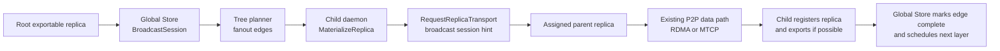
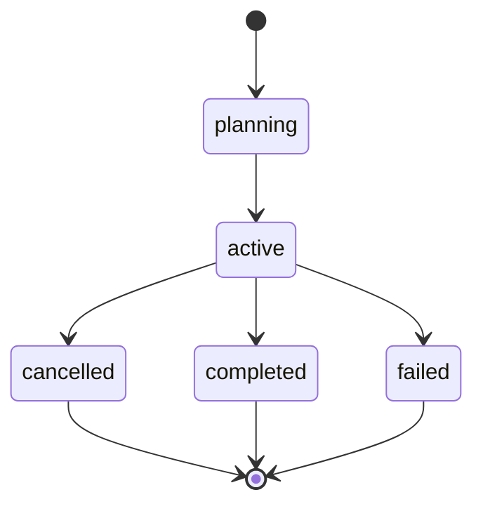

# Summary

Phase 1 made model-weight prefetches visible to Global Store group dispatch by
threading transport request ids and scheduling group hints through SDK,
Store Daemon, C++ materialization, and `RequestReplicaTransport`. That reduces
source concentration when multiple eligible replicas already exist, but it
does not produce a strict tree. Phase 2 adds explicit control-plane broadcast
sessions and tree edges while keeping all data movement on the existing P2P
materialization path.

The selected design is an end-to-end, session-aware `RequestReplicaTransport`
flow. SDK and plan callers create a broadcast session through Store Daemon, not
by connecting to Global Store directly. Child materialization calls carry a
`broadcast_session_id`; Global Store resolves the child worker to a planned
edge, validates the assigned parent replica with the same liveness, capacity,
and exportability rules used by normal transport scheduling, and returns only
that parent as the transport source.



# Goals / Non-Goals

## Goals

- Create a durable `BroadcastSession` for one artifact, optional view, epoch,
  fanout, and target set.
- Generate explicit parent-child tree edges inside Global Store.
- Make child materialization pull only from the parent assigned by the active
  edge when strict mode is enabled.
- Allow a successfully materialized child replica to become a parent for later
  layers after replica registration/export succeeds.
- Reuse existing replica registry, `artifact_transports`, heartbeat,
  accepting-new-requests, capacity, export metadata, verification metadata, and
  transport completion outcome machinery.
- Keep SDK control-path access local to Store Daemon.
- Preserve ordinary `Artifact.prefetch()`, `tensor_dict()`, Phase 1 group
  dispatch, MTCP fallback, and disk fallback behavior when no broadcast hint is
  provided.

## Non-Goals

- Do not implement topology-aware rack/host/rail planning in Phase 2.
- Do not implement chunk-level pipeline forwarding in Phase 2.
- Do not introduce NCCL as the cross-cluster model-weight broadcast control
  plane.
- Do not create a second control plane beside Global Store.
- Do not require daemon-to-daemon control RPCs for tree assignment; only data
  movement remains daemon-to-daemon.

# Prior Constraints Reviewed

## Phase 1 group scheduling

Design `0116` introduced stable transport request ids and group hints for soft
broadcast. Phase 2 keeps that path intact. A transport request may still carry a
Phase 1 scheduling group for observability and fairness, but the broadcast
session hint takes precedence for source selection because it represents a
strict edge assignment rather than a soft source-spread preference.

## Global Store as sole coordination authority

The current architecture separates Global Store metadata/coordination from
Store Daemon data movement. This design keeps tree state, failure retry, and
progress tracking in Global Store. Store Daemon remains the gateway used by SDK
callers and the executor of actual materialization.

## SDK must not connect to Global Store directly

Root `AGENTS.md` requires Python SDK code to go through Store Daemon for
control-path operations. Therefore session creation, session lookup, and
materialization hints are exposed through Store Daemon APIs. Store Daemon
forwards the session requests to Global Store through its existing metadata
gateway/client boundary.

## HA and replica visibility

Existing worker liveness, accepting-new-requests, capacity, and export-state
filters are required before a replica can serve P2P. Phase 2 does not relax
those checks for tree edges. Parent assignment is only valid while the parent
replica is transport-eligible.

# Architecture & Interfaces

## Persistent model

Three tables own broadcast state:

- `broadcast_sessions`: one row per dissemination attempt.
- `broadcast_targets`: one row per target worker/daemon in the session.
- `broadcast_edges`: one row per parent-child attempt.

`artifact_transports` gains nullable `broadcast_session_id` and
`broadcast_edge_id` columns so transport lifecycle rows remain the audit trail
for bytes movement and completion outcomes.

## Global Store RPC

`ClusterRuntimeService` adds session management RPCs:

```proto
rpc CreateBroadcastSession(CreateBroadcastSessionRequest)
    returns (CreateBroadcastSessionResponse);
rpc GetBroadcastSession(GetBroadcastSessionRequest)
    returns (GetBroadcastSessionResponse);
rpc ListBroadcastEdges(ListBroadcastEdgesRequest)
    returns (ListBroadcastEdgesResponse);
rpc CancelBroadcastSession(CancelBroadcastSessionRequest)
    returns (CancelBroadcastSessionResponse);
```

The create request accepts:

```proto
message BroadcastTargetIdentity {
  string worker_id = 1;
  string daemon_id = 2;
}

message CreateBroadcastSessionRequest {
  string session_id = 1;
  string artifact_id = 2;
  tensorcast.common.v1.ByteSpaceRef requested_byte_space = 3;
  uint64 epoch = 4;
  uint32 fanout = 5;
  repeated BroadcastTargetIdentity targets = 6;
  string root_replica_id = 7;
  bool strict_parent = 8;
  uint32 max_attempts = 9;
}
```

`session_id` is caller-supplied for idempotency. If `root_replica_id` is empty,
Global Store selects an eligible root replica for the artifact/view. `daemon_id`
targets are resolved to active `worker_id` rows during planning when possible;
the target row stores both identities so daemon restarts remain diagnosable.

## Session-aware transport request

`RequestReplicaTransportRequest` gains a broadcast hint:

```proto
message BroadcastTransportHint {
  string session_id = 1;
  bool strict_parent = 2;
}

message RequestReplicaTransportRequest {
  // existing fields...
  BroadcastTransportHint broadcast = 11;
}
```

When `broadcast.session_id` is set, Global Store verifies that:

- the request artifact/view matches the session,
- the session epoch matches the target epoch stored in the session,
- `requester_worker_id` maps to a session target,
- an active edge exists or can be planned for that target,
- the edge parent replica is currently transport-eligible.

If `strict_parent` is true, Global Store returns only the assigned edge parent.
If no eligible parent is available before the wait deadline, the request times
out or the edge is failed and requeued according to the scheduler rules below.

## Store Daemon and SDK API

Store Daemon exposes daemon-local RPCs that forward broadcast session requests
to Global Store. The SDK surface builds on existing `CallContext`:

```python
@dataclass(frozen=True, slots=True)
class BroadcastContext:
    session_id: str
    strict_parent: bool = True

@dataclass(frozen=True, slots=True)
class CallContext:
    # existing fields...
    broadcast: BroadcastContext | None = None
```

`Artifact.prefetch(..., ctx=tensorcast.context(broadcast=...))` forwards the
broadcast hint to `materialize_artifact_v2`, `DaemonCtl`, and
`MaterializeReplicaRequest`.

Store Daemon maps the daemon proto hint into `MaterializeHints`:

```c++
struct BroadcastHint {
  std::string session_id;
  bool strict_parent{true};
};

struct MaterializeHints {
  // existing fields...
  std::optional<BroadcastHint> broadcast;
};
```

`GlobalStoreClient::request_replica_transport()` and
`request_view_transport()` accept the same optional hint and copy it into
`RequestReplicaTransportRequest.broadcast`.

# Schema Changes

`schema.sql` adds:

```sql
CREATE TABLE IF NOT EXISTS broadcast_sessions (
    session_id TEXT PRIMARY KEY,
    artifact_id TEXT NOT NULL,
    requested_view_id TEXT NULL,
    epoch BIGINT NOT NULL,
    fanout INTEGER NOT NULL,
    max_attempts INTEGER NOT NULL DEFAULT 3,
    strict_parent BOOLEAN NOT NULL DEFAULT TRUE,
    state TEXT CHECK (state IN ('planning','active','completed','failed','cancelled')) NOT NULL,
    root_replica_id UUID NULL,
    created_at TIMESTAMP WITH TIME ZONE DEFAULT CURRENT_TIMESTAMP,
    updated_at TIMESTAMP WITH TIME ZONE DEFAULT CURRENT_TIMESTAMP,
    completed_at TIMESTAMP WITH TIME ZONE DEFAULT NULL
);

CREATE TABLE IF NOT EXISTS broadcast_targets (
    session_id TEXT NOT NULL,
    target_worker_id TEXT NOT NULL,
    target_daemon_id TEXT NULL,
    state TEXT CHECK (state IN ('pending','assigned','materializing','completed','failed','cancelled')) NOT NULL,
    level INTEGER NULL,
    attempt INTEGER NOT NULL DEFAULT 0,
    assigned_edge_id TEXT NULL,
    completed_replica_id UUID NULL,
    failure_reason TEXT NULL,
    created_at TIMESTAMP WITH TIME ZONE DEFAULT CURRENT_TIMESTAMP,
    updated_at TIMESTAMP WITH TIME ZONE DEFAULT CURRENT_TIMESTAMP,
    completed_at TIMESTAMP WITH TIME ZONE DEFAULT NULL,
    PRIMARY KEY (session_id, target_worker_id)
);

CREATE TABLE IF NOT EXISTS broadcast_edges (
    edge_id TEXT PRIMARY KEY,
    session_id TEXT NOT NULL,
    parent_worker_id TEXT NOT NULL,
    parent_replica_id UUID NOT NULL,
    child_worker_id TEXT NOT NULL,
    level INTEGER NOT NULL,
    attempt INTEGER NOT NULL DEFAULT 1,
    state TEXT CHECK (state IN ('planned','assigned','materializing','completed','failed','cancelled')) NOT NULL,
    transport_request_id TEXT NULL,
    failure_reason TEXT NULL,
    created_at TIMESTAMP WITH TIME ZONE DEFAULT CURRENT_TIMESTAMP,
    updated_at TIMESTAMP WITH TIME ZONE DEFAULT CURRENT_TIMESTAMP,
    completed_at TIMESTAMP WITH TIME ZONE DEFAULT NULL
);

CREATE UNIQUE INDEX IF NOT EXISTS idx_broadcast_edges_one_active_child
    ON broadcast_edges(session_id, child_worker_id)
    WHERE state IN ('planned','assigned','materializing');

ALTER TABLE artifact_transports ADD COLUMN broadcast_session_id TEXT NULL;
ALTER TABLE artifact_transports ADD COLUMN broadcast_edge_id TEXT NULL;
CREATE INDEX IF NOT EXISTS idx_artifact_transports_broadcast
    ON artifact_transports(broadcast_session_id, broadcast_edge_id, status);
```

Implementation should add a DuckDB migration file for persistent deployments
and keep `schema.sql` as the canonical new database shape.

# Scheduler State Machine

## Session planning

`CreateBroadcastSession` inserts the session and targets, then plans the first
layer. The initial parent pool contains the specified root replica or eligible
root candidates. The scheduler creates at most `fanout` planned edges for
pending targets. A target moves from `pending` to `assigned` when an edge is
created.



## Transport claim

When a broadcast transport request arrives, Global Store:

1. Finds the session by `session_id`.
2. Resolves `requester_worker_id` to a target row.
3. Finds the target active edge or creates one if capacity is available in the
   current parent pool.
4. Validates the parent replica with the normal transport eligibility checks.
5. Atomically increments parent replica `current_requests`.
6. Creates an `artifact_transports` row linked to the session and edge.
7. Marks the edge `materializing` and target `materializing`.

If parent validation fails, the current edge is marked `failed`, the target
returns to `pending`, and a new edge is planned if another eligible parent
exists.

## Completion and promotion

For broadcast transports, success means more than copied bytes:

```text
P2P load succeeded
+ child replica registration succeeded
+ child replica is visible as a usable future source
```

The materialization path should therefore call
`CompleteReplicaTransport(SUCCESS)` after successful local replica registration
for broadcast requests. If P2P succeeds but registration/export fails, the
transport completes with `FAILED`, the edge does not advance, and the target is
eligible for retry.

On success, Global Store:

- marks the transport completed with `success`,
- marks the edge completed,
- marks the target completed and records `completed_replica_id`,
- adds the child replica to the parent pool for future planning,
- schedules more pending targets up to the fanout limit,
- marks the session completed only after all targets complete.

## Failure retry

Failed, expired, and cancelled transports do not count as success. They fail
only the edge attempt. The target returns to `pending` with `attempt + 1`.
Global Store replans from the current eligible parent pool, preferring
completed child replicas and falling back to the root pool when needed. After
`max_attempts`, the target is marked `failed` and the session is marked
`failed` unless it has already been cancelled.

# Error Model

- `CreateBroadcastSession` rejects empty artifact ids, zero fanout, zero
  targets, duplicate target identities, invalid epoch, and missing eligible
  root sources.
- `RequestReplicaTransport` with a broadcast hint rejects artifact/view/session
  mismatches and unknown requester workers.
- Parent heartbeat stale, not accepting, over capacity, not exportable, or
  missing transport metadata causes the edge attempt to fail and replan.
- Reusing a `transport_request_id` with a different payload remains rejected by
  existing idempotency checks.
- `CompleteReplicaTransport(SUCCESS)` on a non-broadcast transport keeps
  existing behavior.
- `CompleteReplicaTransport(SUCCESS)` on a broadcast transport with no linked
  edge is invalid.
- Cancelled sessions stop generating new edges. In-flight transports may finish
  with failed/cancelled outcomes but must not advance cancelled sessions.

# Compatibility & Rollout

The feature is additive. Existing materialization calls do not set
`broadcast.session_id`, so normal source selection and Phase 1 group dispatch
continue to run unchanged.

Rollout should proceed in three gates:

- Gate 1: Global Store schema, repository, service, and RPC tests pass with the
  feature unused.
- Gate 2: daemon/core hint propagation works, but broadcast sessions are
  enabled only in tests or explicit callers.
- Gate 3: SDK `BroadcastContext` and daemon-mediated session creation become
  available for model-weight prefetch paths.

Backout is straightforward for callers: omit the broadcast hint and they return
to Phase 1 group dispatch or ordinary source selection.

# Naming Compliance

| Interface | Language | Compliance |
| --- | --- | --- |
| `BroadcastContext` | Python class | PascalCase class name matching existing context dataclasses. |
| `broadcast` | Python field | snake_case field name. |
| `CreateBroadcastSessionRequest` | Proto message | PascalCase message name. |
| `BroadcastTransportHint` | Proto message | PascalCase message name. |
| `broadcast_session_id` | SQL/proto field | snake_case field name. |
| `BroadcastHint` | C++ struct | PascalCase struct name. |
| `request_replica_transport` | C++ method | Existing snake_case method name retained. |
| `create_broadcast_session` | Python service method | snake_case method name. |

# Testing

Global Store tests should cover:

- session creation with root selection, targets, and first-layer edges,
- fanout limits,
- broadcast transport requests returning only the edge parent,
- parent ineligibility failing only the edge attempt,
- success completion advancing edge, target, and session state,
- failed/expired/cancelled outcomes not advancing tree progress,
- artifact/view/epoch mismatch rejection,
- max-attempt target failure,
- unchanged group dispatch tests.

Daemon/core tests should cover:

- daemon `MaterializeReplicaRequest.broadcast` to `MaterializeHints.broadcast`,
- C++ `GlobalStoreClient` proto mapping,
- broadcast materialization still using existing P2P loader,
- broadcast success completing after registration,
- registration/export failure completing the transport as `FAILED`.

An end-to-end local test should run with fake CUDA or CPU-compatible settings:

1. Register an exportable root replica.
2. Create a session with three targets and `fanout=1` or `fanout=2`.
3. Run target prefetches with the same `broadcast_session_id`.
4. Verify transport rows show edge parent assignments.
5. Verify first-layer children become later parents.
6. Force parent failure and verify only the affected target is replanned.
7. Verify ordinary unhinted prefetch still works.

# Acceptance Criteria

- A caller can create a broadcast session through Store Daemon.
- Global Store generates a parent-child tree plan for the session.
- Child materialization pulls from the edge-assigned parent in strict mode.
- A completed child registers a replica and can become a next-layer parent.
- Parent failure replans affected targets without failing the whole session
  until `max_attempts` is exceeded.
- Session completion matches all target materialization successes.
- Session epoch isolates different model versions.
- Existing `tensorcast.artifact(...).tensor_dict()`, ordinary
  `Artifact.prefetch()`, Phase 1 group dispatch, and fallback paths continue to
  work without broadcast hints.

# References

- `docs/designs/0116-control-plane-coordinated-weight-broadcast.md`
- `docs/designs/0083-group-aware-transport-scheduling.md`
- `schema.sql`
- `tensorcast/global_store/services/transport_service.py`
- `tensorcast/global_store/repositories/replica_repository.py`
- `core/store/materialization/control/materialize_orchestrator.cc`
- `core/store/runtime/ingestion/materialization_facade.cc`
- `proto/tensorcast/global_store/v1/global_store.proto`
- `proto/tensorcast/daemon/v2/store_daemon.proto`
