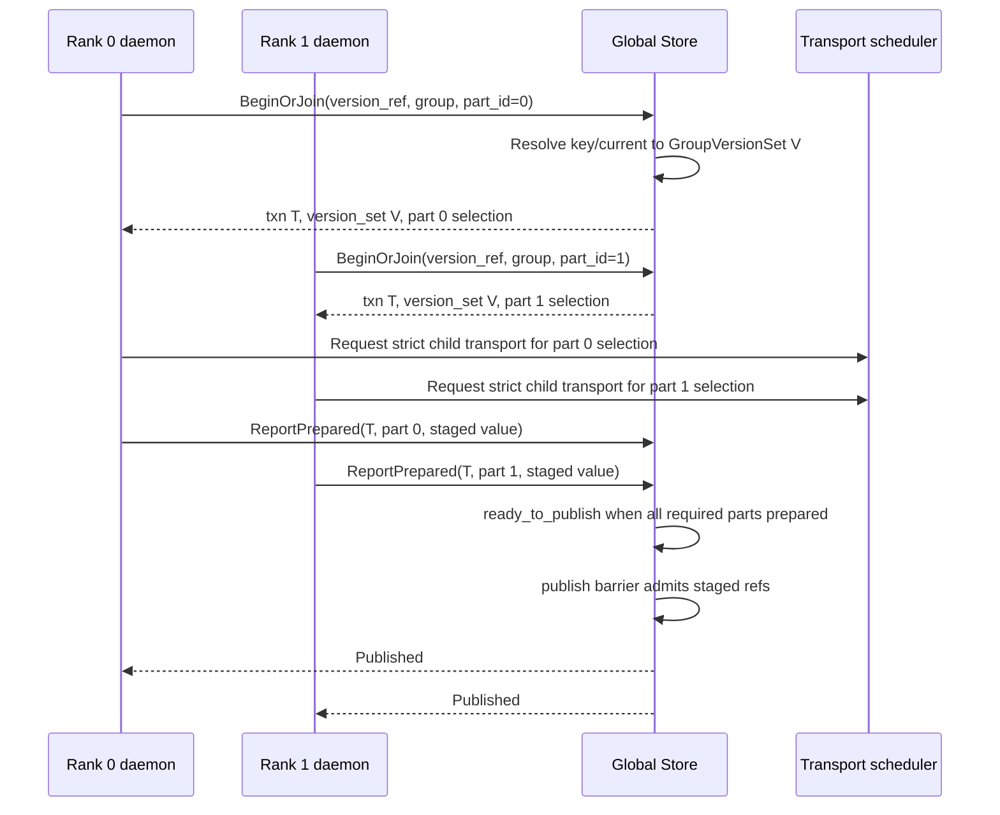

# Summary

TensorCast should introduce a native `GroupRealizationTransaction` because
tensor-parallel and model-parallel serving need an atomic way to freeze and
publish a coherent group version. The transaction must freeze a **group version
set**, not always one shared `ArtifactSelection`.

Implementation status as of 2026-05-14: the staged `GroupVersionSet` path is
implemented and cut over. WeightPublisher receiver flows are fixed to typed
`group_realization` staged publish/acquire, operation ids are opaque
diagnostics/idempotency values, and the former operation-id metadata, receiver
apply mode, and relaxed transport compatibility paths were removed from active
code, tests, and runners.

The companion execution plan was completed and removed after the final outcome
was folded back into this design. Cutover evidence is retained in
`docs/benchmarks/20260514-0117-group-realization-cutover-evidence.md`.

A tensor-parallel or model-parallel serving version is often a set of
per-rank artifacts, views, or byte spaces that must be realized together. The
long-term control-plane identity is therefore:

- a durable `GroupVersionSet` manifest;
- one `GroupVersionSetPart` per semantic rank or serving member;
- a `GroupRealizationTransaction` that freezes that manifest and tracks member
  staging;
- a staged publish barrier that makes prepared values acquirable only after the
  whole required membership is ready.

`same_selection` is still supported as a strict special case where every part
uses the same `ArtifactSelection`. `per_part_selection` is the general TP
version-set case and is the replacement target for the former relaxed grouped
transport behavior.

This design is intentionally limited to semantic consistency and staged
visibility. Progressive partial-source replication stays in `0118`.

```mermaid
flowchart LR
  A["SDK request<br>version reference + group context"] --> B["Store Daemon"]
  B --> C["Global Store<br>resolve or freeze GroupVersionSet"]
  C --> D["Part selection<br>for this part_id"]
  D --> E["Daemon stages local value<br>not current, not acquirable"]
  E --> F["0083 child transport group<br>same artifact and byte space"]
  F --> G["StoreEngine / UMA"]
  G --> H["Member prepared"]
  H --> I["Transaction ready_to_publish"]
  I --> J["Publish barrier"]
  J --> K["Staged refs become acquirable"]
```



# Goals / Non-Goals

## Goals

- Guarantee that all required parts in one semantic group resolve a mutable key,
  explicit version-set ref, or `latest` to one immutable `GroupVersionSet`.
- Support both realization kinds:
  - `same_selection`: every part receives the same `ArtifactSelection`;
  - `per_part_selection`: each `part_id` receives the selection declared by the
    version-set manifest.
- Keep `ArtifactSelection` as the materialization identity for each part.
- Keep retrieval policy, collective topology, progressive dissemination, and
  transport scheduling outside artifact identity.
- Preserve the `0083` v1 transport contract. Semantic transactions that span
  multiple artifacts derive strict child transport groups instead of weakening
  transport grouping.
- Preserve daemon-mediated SDK behavior. Python SDK code must not open direct
  Global Store channels.
- Make group serving realization fail closed: abort, timeout, or member failure
  must not expose a partially prepared group.
- Use staged binding or retained target values for v1 integration. Prepared
  values are not current and are not returned by ordinary acquire until the
  group publish barrier admits them.
- Fix key-target generation semantics so a mutable key target cannot change
  without a generation bump.
- Make rollout safe under worker churn, daemon restart, duplicate reports, and
  stale transport completion.

## Non-Goals

- Do not implement progressive partial-source replication in this design. See
  `0118`.
- Do not support `latest-k` in v1. It requires durable version history, not just
  the current key pointer.
- Do not relax `0083` to allow multi-artifact transport groups.
- Do not add SDK direct-to-Global-Store control paths.
- Do not replace Global Store artifact registration, UMA, or the P2P data path.
- Do not create a second serving publication model.
- Do not promise live in-place replacement of an already acquired same-binding
  current value in v1. The current code writes refills into the current binding
  allocation and does not provide a fail-closed group-wide cutover primitive.
  V1 uses staged/prefetch/acquire. A future live cutover needs a separate
  design with double-buffering or pointer indirection, admission fencing, and
  explicit traffic-switch semantics.

# Design Rationale

Grouped serving creates two distinct problems that should stay separate:

| Problem | TensorCast owner |
| --- | --- |
| Relative version consistency across model-parallel members | This design: persisted `GroupVersionSet` plus `GroupRealizationTransaction` |
| Fanout from receivers that have verified partial data | Follow-up `0118`: progressive replica dissemination |

A model-parallel serving version is a semantic set, not a single artifact
lookup. TensorCast already has persisted Global Store metadata, daemon-owned
binding lifetimes, strict artifact selections, and explicit transport
scheduling. The native design is therefore a durable version-set manifest first,
then per-part ordinary materialization under strict child transport groups.

# Prior Constraints Reviewed

## `0078` selection-first retrieval

Kept:

- materialization consumes an `ArtifactSelection`;
- keys and aliases must be resolved before ordinary materialization;
- selection identity includes artifact and view semantics, not execution policy.

Applied here:

- a group transaction resolves to a `GroupVersionSet`;
- each member receives exactly one frozen `ArtifactSelection` for its `part_id`;
- unresolved strings such as `latest` never flow into `MaterializeReplica` or
  binding materialization.

## `0083` group-aware transport scheduling

Kept:

- transport groups are useful for fairness, completion bias, source spread, and
  idempotent transport requests;
- all parts in one v1 transport group target the same artifact and requested
  byte space;
- transport completion outcome is separate from lease closure.

Applied here:

- `0083` does not own model-version consistency;
- a semantic transaction may span multiple artifacts, but it derives one child
  transport group per artifact/view/byte-space as needed;
- the former relaxed artifact/view grouping path is obsolete debt and was
  removed during cutover.

## `0084` binding unified model

Kept:

- binding is a local stable target byte space;
- one binding has at most one current `SealedBindingValue`;
- `seal_generation` fences current value changes.

Applied here:

- `StagedBindingValue` is an inactive value associated with a group
  transaction;
- staged values are stored in a separate allocation or retained resource and
  are not ordinary current values;
- abort and expiration preserve the previous current value.

## `0107` retrieval policy and execution topology

Kept:

- retrieval policy is execution-scoped;
- collective topology and source sharing are execution topology, not artifact
  identity;
- fallback cannot silently change artifact identity.

Applied here:

- semantic transaction freezes the version-set manifest;
- execution topology and `0083` decide how to fetch each part selection;
- strict group conflicts fail closed instead of remapping a part to another
  artifact.

## `0104`, `0112`, `0114`, and `0116`

Kept:

- rollout and prefetch remain orchestration layers over ordinary TensorCast
  materialization;
- binding-native serving remains the same-binding path;
- collective-first TP startup stays inside the shared execution trunk;
- retained serving binding targets remain explicit daemon-owned resources.

Applied here:

- group realization is a reusable semantic control primitive for those flows;
- v1 integration lands on staged retained values and explicit acquire, not on a
  hidden live mutation of an existing current binding value.

# Shared Invariants With `0118`

`0117` and `0118` share the following invariants:

- `ArtifactSelection` identity never changes inside one materialization attempt.
- Retrieval policy and topology are not artifact identity.
- Ordinary replica availability means complete requested byte-space availability.
- Export generation fences source visibility.
- Progressive coverage never upgrades to ordinary replica availability
  implicitly.
- `GroupVersionSet` is a manifest over part selections, not content truth.

# Current State And Hard Gaps

The repository already has useful substrate:

- `key_mappings.generation` and CAS-enabled swap behavior;
- `artifact_transports` request ids, fingerprints, group fields, and completion
  outcomes;
- `pending_transport_requests` for group dispatch;
- `TransportSchedulingGroup` in Global Store proto;
- daemon/core propagation of transport hints;
- binding `update_epoch`, `seal_generation`, and current value mechanics;
- serving prefetch and retained binding target concepts from `0116`.

The hard gaps are not just missing RPCs:

1. There is no durable group version-set manifest. A TP serving version can be a
   set of per-rank artifacts or views, so a single frozen `ArtifactSelection`
   cannot replace model-parallel group semantics.
2. There is no key target abstraction that can point either to one artifact
   selection or to a group version set.
3. `KeyMappingRepository.upsert(...)` can update `artifact_id` without a
   generation bump, while `swap(...)` bumps generation. That makes "freeze the
   key generation" unsafe unless all mutable target changes go through a
   generation-incrementing path.
4. The former grouped transport compatibility path relaxed artifact/view
   validation in transport group logic. That path is obsolete once version-set
   transactions exist and was removed during cutover.
5. Operation ids are opaque idempotency/diagnostic values. Group metadata is no
   longer encoded in or accepted from operation-id suffixes after cutover.
6. `BindingRegistry::Record` owns one current allocation/current value path, and
   current refill flows write into that path before readiness is reported. That
   cannot provide fail-closed group abort semantics.
7. There is no daemon/Global Store protocol for staged member readiness,
   publish admission, idempotent replay, expiration, or diagnostic query.

# Target Model

## Vocabulary

- **Version reference**: caller input. It may be an explicit
  `ArtifactSelection`, an explicit `GroupVersionSetRef`, or a mutable key/current
  target such as `latest`.
- **Key target**: the resolved current value of a mutable key generation. It is
  either one artifact selection or one group version set.
- **GroupVersionSet**: durable immutable manifest for one semantic group
  version. It is a manifest over `ArtifactSelection` parts, not a content
  identity. Artifact and `ArtifactSelection` remain the content truth.
- **GroupVersionSetPart**: one member of a version set, keyed by `part_id`, with
  a part-specific `ArtifactSelection`, requested byte space, selection hash, and
  logical layout hash.
- **Realization kind**:
  - `same_selection`: all parts use the same selection;
  - `per_part_selection`: each part uses its manifest entry.
- **GroupRealizationTransaction**: persisted transaction that freezes a version
  reference to one `GroupVersionSet`, tracks required membership, and gates
  staged value publication.
- **StagedBindingValue**: daemon-local prepared value that is not current and not
  acquirable through ordinary binding acquire.
- **Publish barrier**: Global Store state transition that admits staged values
  only after every required part has prepared successfully.
- **Child transport group**: an `0083` transport group derived from a semantic
  transaction for one strict artifact/view/byte-space subset.

## V1 Version Scope

Supported:

- explicit single `ArtifactSelection` producing a `same_selection` version set;
- explicit `GroupVersionSetRef`;
- mutable key/current target resolving to either an artifact selection or a
  group version set;
- daemon-mediated SDK group realization for materialization, serving prefetch,
  WeightPublisher staging, and retained serving targets.

Not supported:

- `latest-k`;
- cross-layout inference or best-effort key fallback;
- live group mutation of already acquired same-binding current values;
- progressive partial-source reads.

## Version-Set Resolution

The first member that creates the transaction resolves the version reference in
Global Store under a consistent repository transaction:

1. Normalize group context:
   - `group_id`;
   - `group_kind`;
   - `epoch`;
   - required `total_parts`;
   - required `part_id` set.
2. Resolve the version reference:
   - explicit `ArtifactSelection` -> synthesize or find immutable
     `same_selection` version set;
   - explicit `GroupVersionSetRef` -> load and verify manifest;
   - key/current target -> read current generation and target kind;
   - `latest` alias -> resolve to the current key target only.
3. Persist `group_realization_transactions.version_set_id`,
   `key_generation`, `manifest_hash`, and request fingerprint.
4. Return only the caller's `GroupVersionSetPart` to the daemon.

Retries must receive the same `version_set_id` and part entry when the request
fingerprint matches. Mismatched retries must fail with a conflict before
materialization starts.

V1 requires the complete required part set before a transaction can become
`ready_to_publish`. `total_parts` alone is not sufficient unless the
implementation derives the exact `part_id` set deterministically from typed
topology metadata. This prevents missing ranks from being mistaken for a
complete group.

`latest-k` is a separate future query contract, not a variation of current
pointer lookup:

```text
resolve_relative(key, latest_minus = k) -> key_generation + key target
```

That contract requires ordered key-target history. It must not be implemented by
trying to infer older versions from the current `key_mappings` pointer.



## Staged Serving And Binding Flow

V1 group serving realization must use staging:

1. The daemon reserves a staging allocation or retained target for the member.
2. The daemon materializes the frozen part selection into the staged value.
3. The staged value records transaction id, version-set id, part id, expected
   layout, expected previous current identity when applicable, and TTL.
4. The daemon reports `prepared` to Global Store.
5. Global Store enters `ready_to_publish` when every required member is prepared.
6. A publish request, or configured auto-publish policy, marks the transaction
   `published`.
7. Only after `published` may explicit group-aware acquire or serving injection
   return the staged value ref.

The old binding current value is not overwritten by prepare. A code path that
cannot provide separate staging must reject group realization with
`FailedPrecondition`.

Live in-place current switching remains a v2 problem. It needs at least:

- double-buffered or pointer-indirected binding storage;
- local admission fences that prevent ordinary acquire from observing early
  members;
- durable activation acknowledgements;
- an explicit traffic switch owned by serving orchestration.

# Architecture And Interfaces

## Global Store Proto Shape

Illustrative proto shape:

```proto
enum GroupRealizationKind {
  GROUP_REALIZATION_KIND_UNSPECIFIED = 0;
  GROUP_REALIZATION_KIND_SAME_SELECTION = 1;
  GROUP_REALIZATION_KIND_PER_PART_SELECTION = 2;
}

message GroupVersionSetRef {
  string version_set_id = 1;
  bytes manifest_hash = 2;
  uint64 manifest_generation = 3;
}

message GroupVersionSetPart {
  string part_id = 1;
  ArtifactSelection selection = 2;
  ByteSpaceRef requested_byte_space = 3;
  bytes selection_hash = 4;
  bytes logical_layout_hash = 5;
}

message KeyVersionReference {
  string key = 1;
  string namespace = 2;
  string alias = 3; // current/latest only in v1.
  uint64 expected_generation = 4;
}

message VersionReference {
  oneof value {
    ArtifactSelection explicit_selection = 1;
    GroupVersionSetRef explicit_version_set = 2;
    KeyVersionReference key_reference = 3;
  }
}

message GroupRealizationContext {
  string group_kind = 1;
  string group_id = 2;
  uint64 epoch = 3;
  uint32 total_parts = 4;
  string part_id = 5;
  repeated string required_part_ids = 6;
}

message BeginOrJoinGroupRealizationRequest {
  VersionReference version = 1;
  GroupRealizationContext context = 2;
  bytes transaction_fingerprint = 3;
  uint64 deadline_unix_nanos = 4;
}

message BeginOrJoinGroupRealizationResponse {
  string transaction_id = 1;
  GroupVersionSetRef version_set = 2;
  GroupRealizationKind realization_kind = 3;
  GroupVersionSetPart part = 4;
  string state = 5;
}

message StagedBindingValueRef {
  string daemon_id = 1;
  string daemon_session_id = 2;
  string binding_id = 3;
  string binding_value_id = 4;
  string staging_token = 5;
  uint64 staging_epoch = 6;
}

message ReportGroupRealizationPreparedRequest {
  string transaction_id = 1;
  string part_id = 2;
  StagedBindingValueRef staged_value = 3;
  uint64 expected_previous_seal_generation = 4;
  bytes prepared_value_hash = 5; // Optional diagnostic/proof hash.
  string daemon_id = 6;
  string daemon_session_id = 7;
  string worker_id = 8;
  string materialization_attempt_id = 9;
  bytes member_fingerprint = 10;
}

message GroupPublishAuthority {
  oneof value {
    string operation_lease_id = 1;
    bytes capability_token = 2;
  }
}

message PublishGroupRealizationRequest {
  string transaction_id = 1;
  bool require_ready_to_publish = 2;
  GroupPublishAuthority authority = 3;
}

message WaitGroupRealizationPublishedRequest {
  string transaction_id = 1;
  uint64 deadline_unix_nanos = 2;
}
```

The exact message names may change during implementation, but the contract must
preserve these facts:

- the transaction returns a version-set ref plus this member's part;
- `part_id` is part of the member idempotency key, not the transaction
  fingerprint;
- `transaction_fingerprint` and `member_fingerprint` are distinct; the former
  names the semantic slot request, while the latter fences one concrete staged
  result;
- staged value refs are explicit and daemon-authored;
- prepared reports are fenced by daemon session, worker, materialization
  attempt, and staging epoch so a restarted daemon cannot accidentally publish a
  stale staged value;
- publish admission is separate from transport success;
- explicit publish uses a scoped authority token or operation lease, not a raw
  coordinator id;
- stale or conflicting retries fail before materialization mutates local state.

`prepared_value_hash` is optional diagnostics/proof material. It must not become
a mandatory full GPU byte hash in the group realization protocol. Correctness is
gated by the frozen selection hash, logical layout hash, requested byte-space
identity, staged value identity, verification state, and the existing artifact
verification/load-completion contracts.

## Daemon API Shape

Daemon request surfaces that can participate in group realization should carry a
typed context instead of encoding group data in `operation_id`.

```proto
message SemanticGroupContext {
  string group_kind = 1;
  string group_id = 2;
  uint64 epoch = 3;
  uint32 total_parts = 4;
  string part_id = 5;
  repeated string required_part_ids = 6;
}

message GroupRealizationOptions {
  bool enabled = 1;
  VersionReference version = 2;
  SemanticGroupContext group = 3;
  bool require_staged_publish = 4;
  uint64 deadline_unix_nanos = 5;
}
```

`operation_id` remains an idempotency and diagnostics field only. Group metadata
embedded in `operation_id` suffixes is not part of the final contract. After
cutover, requests that provide group semantics only through `operation_id` must
fail with `InvalidArgument`.

## Binding Staging Contract

The daemon binding registry needs an explicit staged-value concept.

Normative rules:

- a staged value is not the binding current value;
- a staged value is not returned by ordinary `AcquireBindingValue`;
- a staged value has a TTL and is cleaned up on transaction abort/expiration;
- a staged value must own or retain memory independently from the old current
  value;
- a staged value records the transaction id, version-set id, part id, and layout
  identity it was prepared for;
- explicit group-aware acquire must verify transaction state is `published`
  before returning the staged value;
- current-value mutation, if later added, must be a separate operation with
  seal-generation fencing and serving traffic admission semantics.

This contract is the key feasibility boundary. Without it, the design would
claim an abort guarantee that the current single-allocation refill path cannot
provide.

## Transport Integration

Semantic group transactions derive strict child `0083` transport groups.

Child group derivation:

```text
child_group_kind = "group_realization_transport"
child_group_id =
  hash(transaction_id, artifact_id, requested_byte_space, view_id)
child_epoch = group_epoch
child_total_parts = number of transaction members using that strict child key
child_part_id = hash(part_id, artifact_id, requested_byte_space, attempt)
request_id = hash(transaction_id, part_id, artifact_id, requested_byte_space, attempt)
```

Rules:

- all requests in one child transport group must target the same artifact and
  requested byte space;
- cross-artifact TP semantics live in `GroupVersionSet`, not in `0083`;
- only `SUCCESS` completion outcomes count as transport progress;
- transport failure does not publish or abort a group by itself. The daemon
  reports member failure or aborts the semantic transaction explicitly.

# Control-Plane Scalability Boundary

This design intentionally adds semantic coordination to Global Store, but it
must not add a high-frequency data-path scheduler. Current code already shows
the tight control-plane limits:

- `BaseRepository.transaction()` serializes the whole DuckDB transaction under
  the process-wide DB execution lock, and non-transactional cursor operations
  also take that lock per execute/fetch.
- `TransportService` already has a single `_dispatch_loop_lock` around pending
  transport queue dispatch to avoid transaction storms.
- `pending_transport_requests` uses bounded `queue_scan_limit` and
  `dispatch_batch_limit`; `artifact_transports` group progress is currently
  computed from aggregate queries over transport history.
- hot mutable counters are split into `replica_counters`, and worker heartbeats
  are batched before persistence. The existing Global Store documentation and
  benchmark notes treat write amplification and request-rate times service-time
  as real saturation causes.

Therefore group realization has a hard control-plane budget:

- Global Store writes are bounded by semantic events: one transaction begin or
  replay, at most one join/prepare/fail transition per required member, one
  publish or terminal abort/expiration, and coarse cleanup. There must be no
  Global Store write proportional to transported bytes, tensor count, copy
  chunks, CUDA events, or progressive segments.
- Readiness is maintained with derived counters on the transaction row
  (`prepared_count`, `failed_count`, `published_count`) updated atomically with
  member state transitions. The member table remains the audit truth, but
  publish admission must not rescan every member on the hot path.
- Waiting clients use bounded backoff or a bounded server wait with jitter and
  terminal-state caching. A rank must not tight-poll `WaitGroupRealization` or
  `ResolveKeyMapping`.
- The design reuses the existing `0083` transport dispatcher for child
  transports. It must not introduce a second global dispatch loop or global
  queue lock for group realization transports.
- Expiration and cleanup run as indexed, batch-limited sweeps outside the
  ordinary request critical path.
- Co-located ranks may batch prepared reports through the daemon, but batching
  is an optimization only; correctness remains one fenced member transition per
  required `part_id`.

If a future implementation needs per-byte, per-chunk, or per-progress-step
coordination, that is outside this design and requires a different storage and
scheduling architecture before rollout.

# Schema Changes

Physical schema can be implemented as separate additive tables or by extending
current key tables with additive columns. The logical model is mandatory.

## Version Target History

Mutable key updates must be generation-forming.

```sql
CREATE TABLE key_version_targets (
  namespace TEXT NOT NULL,
  key TEXT NOT NULL,
  generation BIGINT NOT NULL,
  target_kind TEXT NOT NULL CHECK (
    target_kind IN ('artifact_selection', 'group_version_set')
  ),
  artifact_id TEXT,
  view_id TEXT,
  group_version_set_id TEXT,
  selection_hash BLOB,
  manifest_hash BLOB,
  created_at TIMESTAMP NOT NULL DEFAULT CURRENT_TIMESTAMP,
  CHECK (
    (
      target_kind = 'artifact_selection'
      AND artifact_id IS NOT NULL
      AND group_version_set_id IS NULL
    )
    OR (
      target_kind = 'group_version_set'
      AND group_version_set_id IS NOT NULL
      AND artifact_id IS NULL
      AND view_id IS NULL
    )
  ),
  PRIMARY KEY (namespace, key, generation)
);
```

Current `key_mappings` may remain the fast current pointer, but
`key_version_targets` is the generation truth. Target changes must be
implemented as a generation bump and must write history before advancing the
fast current pointer. `upsert(...)` may create a key or update non-target
metadata only; it must not mutate `artifact_id`, `view_id`, or
`group_version_set_id` in place. A drift between the fast pointer and
`key_version_targets` is an audit failure.

## Version-Set Manifest

```sql
CREATE TABLE group_version_sets (
  version_set_id TEXT PRIMARY KEY,
  realization_kind TEXT NOT NULL CHECK (
    realization_kind IN ('same_selection', 'per_part_selection')
  ),
  namespace TEXT,
  key TEXT,
  key_generation BIGINT,
  total_parts INTEGER NOT NULL,
  manifest_hash BLOB NOT NULL UNIQUE,
  manifest_generation BIGINT NOT NULL DEFAULT 1,
  logical_layout_hash BLOB,
  created_at TIMESTAMP NOT NULL DEFAULT CURRENT_TIMESTAMP
);

CREATE TABLE group_version_set_parts (
  version_set_id TEXT NOT NULL,
  part_id TEXT NOT NULL,
  artifact_id TEXT NOT NULL,
  view_id TEXT,
  requested_byte_space TEXT NOT NULL,
  selection_hash BLOB NOT NULL,
  logical_layout_hash BLOB,
  part_metadata_json TEXT,
  PRIMARY KEY (version_set_id, part_id),
  FOREIGN KEY (version_set_id)
    REFERENCES group_version_sets(version_set_id)
);

CREATE INDEX idx_group_version_set_parts_artifact
  ON group_version_set_parts(artifact_id, view_id, requested_byte_space);
```

For `same_selection`, the manifest should still expose a concrete part row for
each required `part_id` once `total_parts` is known. Implementations may
deduplicate storage internally, but resolver output and transaction conflict
checks operate on explicit per-part rows.

## Realization Transaction

```sql
CREATE TABLE group_realization_transactions (
  transaction_id TEXT PRIMARY KEY,
  group_kind TEXT NOT NULL,
  group_id TEXT NOT NULL,
  epoch BIGINT NOT NULL,
  version_set_id TEXT NOT NULL,
  realization_kind TEXT NOT NULL CHECK (
    realization_kind IN ('same_selection', 'per_part_selection')
  ),
  transaction_fingerprint BLOB NOT NULL,
  required_part_ids_json TEXT NOT NULL,
  total_parts INTEGER NOT NULL,
  prepared_count INTEGER NOT NULL DEFAULT 0,
  failed_count INTEGER NOT NULL DEFAULT 0,
  published_count INTEGER NOT NULL DEFAULT 0,
  state TEXT NOT NULL CHECK (
    state IN (
      'open',
      'resolved',
      'preparing',
      'ready_to_publish',
      'published',
      'aborted',
      'expired'
    )
  ),
  deadline_unix_nanos BIGINT,
  created_at TIMESTAMP NOT NULL DEFAULT CURRENT_TIMESTAMP,
  updated_at TIMESTAMP NOT NULL DEFAULT CURRENT_TIMESTAMP,
  last_state_change_at TIMESTAMP NOT NULL DEFAULT CURRENT_TIMESTAMP,
  UNIQUE (group_kind, group_id, epoch),
  FOREIGN KEY (version_set_id)
    REFERENCES group_version_sets(version_set_id)
);

CREATE TABLE group_realization_members (
  transaction_id TEXT NOT NULL,
  part_id TEXT NOT NULL,
  daemon_id TEXT NOT NULL,
  worker_id TEXT,
  daemon_session_id TEXT,
  materialization_attempt_id TEXT,
  artifact_id TEXT NOT NULL,
  view_id TEXT,
  requested_byte_space TEXT NOT NULL,
  selection_hash BLOB NOT NULL,
  member_fingerprint BLOB NOT NULL,
  state TEXT NOT NULL CHECK (
    state IN (
      'joined',
      'preparing',
      'prepared',
      'published',
      'failed',
      'cancelled',
      'expired'
    )
  ),
  staged_binding_id TEXT,
  staged_binding_value_id TEXT,
  staging_epoch BIGINT,
  expected_previous_seal_generation BIGINT,
  prepared_value_hash BLOB,
  source_replica_id TEXT,
  source_export_generation BIGINT,
  child_transport_request_id TEXT,
  failure_code TEXT,
  failure_detail TEXT,
  created_at TIMESTAMP NOT NULL DEFAULT CURRENT_TIMESTAMP,
  updated_at TIMESTAMP NOT NULL DEFAULT CURRENT_TIMESTAMP,
  PRIMARY KEY (transaction_id, part_id),
  FOREIGN KEY (transaction_id)
    REFERENCES group_realization_transactions(transaction_id)
);

CREATE INDEX idx_group_realization_transactions_state_deadline
  ON group_realization_transactions(state, deadline_unix_nanos);

CREATE INDEX idx_group_realization_transactions_version_set
  ON group_realization_transactions(version_set_id);

CREATE INDEX idx_group_realization_members_state
  ON group_realization_members(transaction_id, state);
```

`prepared_count`, `failed_count`, and `published_count` are hot-path derived
counters, not independent truth. Every member state transition must update the
member row and the transaction counters in one repository transaction. A
diagnostic reconciliation query must be available to compare counters with the
member table; reconciliation drift is a correctness bug, not a fallback path.

# Consistency Model

## Version-Set Consistency

- `GroupVersionSet` is a manifest over part selections, not a content identity.
  Artifact and `ArtifactSelection` remain authoritative for content, byte-space,
  and hash semantics.
- All members in one transaction observe the same `version_set_id` and
  `manifest_hash`.
- `same_selection` additionally requires identical artifact, view, byte space,
  selection hash, and layout hash for all parts.
- `per_part_selection` requires each `part_id` to match its manifest row.
- Duplicate `part_id` joins are idempotent only when daemon id, request
  fingerprint, and part identity match.
- Conflicting duplicate joins fail before materialization starts.

## Key Target Consistency

- Mutable key target changes are generation-forming.
- The transaction persists the key generation it resolved.
- A later key swap does not affect an existing transaction.
- `latest-k` remains unavailable until a durable key-target history and query
  contract lands.

## Binding Visibility Consistency

- Prepared staged values are invisible to ordinary acquire.
- Publish admission requires every required part to be prepared.
- Publish authority is explicit. V1 supports exactly:
  - `publish_authority_mode=AUTO_WHEN_READY`, configured by Global Store
    policy;
  - explicit coordinator publish with a coordinator id authorized for the group.
- All-member acknowledge publish is a possible future mode, but it is not part
  of v1.
- Abort and expiration delete or retire staged values and leave old current
  values untouched.
- `published` makes staged refs eligible for explicit group-aware acquire or
  serving injection; it does not imply hidden mutation of existing ordinary
  current values.

## Failure Recovery

| Scenario | Required behavior |
| --- | --- |
| first member resolves key, key changes before another member joins | later member receives the frozen version set from the transaction |
| member retries same request | idempotent same transaction and same part |
| member retries with different part selection or byte space | conflict before materialization |
| daemon prepares then disconnects | staged value remains pending until TTL or explicit abort |
| transport fails | member reports failure or retries; transaction does not publish |
| transaction expires | state becomes `expired`, staged values are cleaned up |
| publish request before all members prepared | `FailedPrecondition` or wait depending on request mode |
| ordinary acquire before publish | old current or not-found; staged value is not returned |

## Source Visibility Fence

Any source used by group realization must obey the source visibility fence:

- stop issuing new assignments before overwrite or retirement;
- let in-flight assignments drain or fail;
- revoke local export visibility;
- advance `export_generation` before new assignments can observe replacement
  bytes.

This is the same fence required by progressive assignments in `0118`.

# Configuration

New configuration must follow `0004` unified runtime config. No ad-hoc
environment variables.

Global Store config:

```proto
enum GroupPublishAuthorityMode {
  GROUP_PUBLISH_AUTHORITY_MODE_UNSPECIFIED = 0;
  GROUP_PUBLISH_AUTHORITY_MODE_AUTO_WHEN_READY = 1;
  GROUP_PUBLISH_AUTHORITY_MODE_COORDINATOR_EXPLICIT = 2;
}

message GroupRealizationConfig {
  bool enabled = 1;
  uint64 default_deadline_ms = 2;
  uint32 max_total_parts = 3;
  uint64 transaction_ttl_ms = 4;
  uint64 expiration_scan_interval_ms = 5;
  uint32 max_parts_per_version_set = 6;
  GroupPublishAuthorityMode publish_authority_mode = 7;
  uint32 max_active_transactions = 8;
  uint32 max_waiters_per_transaction = 9;
  uint64 min_wait_poll_interval_ms = 10;
  uint64 max_wait_poll_interval_ms = 11;
  uint32 max_member_reports_per_rpc = 12;
  uint32 cleanup_batch_limit = 13;
}
```

Daemon config:

```proto
message DaemonGroupRealizationConfig {
  bool enabled = 1;
  uint64 default_deadline_ms = 2;
  uint64 staged_value_ttl_ms = 3;
  uint64 max_staged_bytes = 4;
}
```

# Error Model

| Error | When |
| --- | --- |
| `InvalidArgument` | malformed group context, unknown part id, unsupported version reference |
| `NotFound` | explicit version set, key, artifact, or part does not exist |
| `AlreadyExists` | duplicate transaction or member conflicts with different fingerprint |
| `FailedPrecondition` | feature disabled, staging unavailable, publish before ready, key target changed without generation |
| `Aborted` | transaction aborted by member failure or coordinator request |
| `DeadlineExceeded` | join, prepare, wait, or publish deadline expires |
| `Unavailable` | daemon/Global Store connectivity prevents a required control action |

# Naming Compliance

| Concept | Name |
| --- | --- |
| version-set manifest | `GroupVersionSet` |
| version-set member | `GroupVersionSetPart` |
| semantic transaction | `GroupRealizationTransaction` |
| staged daemon value | `StagedBindingValue` |
| begin or replay transaction | `begin_or_join_group_realization` |
| member staging report | `report_group_realization_prepared` |
| publish barrier | `publish_group_realization` |
| wait for published state | `wait_group_realization_published` |
| strict child transport group kind | `group_realization_transport` |

All C++ and Python implementation names should use repo naming conventions:
PascalCase for types, snake_case for functions and variables, and snake_case
filenames.

# Metrics And Diagnostics

Global Store metrics:

- `tensorcast_group_version_sets_total{kind}`;
- `tensorcast_group_realization_transactions_total{kind,state}`;
- `tensorcast_group_realization_active{kind}`;
- `tensorcast_group_realization_prepare_latency_seconds{kind}`;
- `tensorcast_group_realization_publish_latency_seconds{kind}`;
- `tensorcast_group_realization_conflicts_total{reason}`;
- `tensorcast_group_realization_expired_total{kind}`;
- `tensorcast_key_target_generation_updates_total{target_kind}`;
- `tensorcast_group_realization_control_writes_total{op}`;
- `tensorcast_group_realization_db_conflicts_total{op}`;
- `tensorcast_group_realization_wait_polls_total{kind}`;
- `tensorcast_group_realization_ready_counter_reconciliations_total{outcome}`.

Daemon metrics:

- `tensorcast_group_realization_stage_bytes{device,kind}`;
- `tensorcast_group_realization_staged_values{state}`;
- `tensorcast_group_realization_acquire_after_publish_total{kind}`;
- `tensorcast_group_realization_stage_cleanup_total{reason}`;
- `tensorcast_group_realization_transport_child_groups_total`.

Diagnostics must include:

- transaction id;
- version-set id and manifest hash;
- realization kind;
- part id;
- child transport group id;
- key generation when a key reference was used;
- staged binding id/value id when applicable.

# Cutover And Final State

The cutover state is:

1. Schema/proto/config are present and enabled by the default benchmark configs.
2. Key target updates are generation-forming through key target history.
3. `same_selection` and `per_part_selection` transaction tests cover ordinary,
   cross-artifact, and cross-view version sets.
4. Daemon staged-value tests cover prepare, publish, acquire, and cleanup
   behavior.
5. WeightPublisher and serving prefetch lanes route through group realization
   where staged publication exists.
6. Operation-id-encoded group metadata is no longer an accepted input.
7. The relaxed transport-group artifact/view path has been removed.
8. Former relaxed transport callers synthesize or resolve `GroupVersionSet`
   state and derive strict child transport groups by artifact/view/byte-space.
9. Version-set group realization is the only model-parallel group coherence
   path.

After final cutover, TensorCast does not keep a long-lived runtime fallback mode
for removed group semantics. Rollback is a release rollback, not a runtime dual
semantic path; outstanding transactions and staged values must be expired during
that rollback, and key targets must not be rewritten back to an older
generation.

# Alternatives Considered

## Freeze one `ArtifactSelection` for every rank

Rejected as the long-term model. It works for replicated reads, but it cannot
represent TP or sharded serving versions where each part has its own artifact or
view. It would force TensorCast to keep the relaxed legacy path, which is
explicitly not the long-term maintenance target.

## Extend `0083` to own model-version semantics

Rejected. `0083` is a transport scheduler. Relaxing it to support
cross-artifact semantic groups would blur identity, routing, and fairness. The
right boundary is a semantic parent transaction that derives strict child
transport groups.

## Metadata-only prepare against the current binding allocation

Rejected. Current refill paths can mutate the live allocation before the group is
known to be complete. That makes abort semantics false. Staging must be a real
separate allocation or retained resource.

## Live same-binding group swap in v1

Rejected. It is feasible only with a separate cutover design. The v1 goal is to
make staged group values safe and explicit, then let serving orchestration
decide when to inject or acquire them.

## Add `latest-k` now

Rejected. Current key state is a current pointer, not a durable version history.
Adding `latest-k` without history would create ambiguous replay semantics.

# Acceptance Criteria

- A `same_selection` group returns one identical part selection to all members.
- A `per_part_selection` group can return different artifacts or views to
  different `part_id`s under one immutable manifest.
- Every member in one transaction observes the same `version_set_id` and
  `manifest_hash`.
- Mutable key target changes bump generation; in-place target mutation is not
  allowed.
- Concurrent key swaps do not change an existing transaction's version set.
- Strict child transport groups enforce same artifact and byte space.
- Prepared staged values are not ordinary current values and are not returned by
  ordinary acquire.
- Abort, expiration, and member failure do not expose partial group values.
- Publish admission fails or waits until every required member is prepared.
- SDK surfaces remain daemon-mediated.
- Relaxed transport group semantics and operation-id group metadata inputs are
  removed after cutover.
- Prepared reports are fenced by daemon session, materialization attempt, and
  staging epoch.
- Global Store writes are proportional to group members and terminal state
  changes, not transported bytes, copy chunks, tensor count, or wait-loop
  iterations.
- Publish readiness uses transaction counters updated with member transitions;
  full member scans are diagnostic or reconciliation paths only.

# References

- `docs/designs/0078-selection-first-artifact-retrieval.md`
- `docs/designs/0083-group-aware-transport-scheduling.md`
- `docs/designs/0084-binding-unified-model-and-contract.md`
- `docs/designs/0107-retrieval-policy-plane-cleanup.md`
- `docs/designs/0112-binding-native-serving-realization-and-publication.md`
- `docs/designs/0116-prefetch-serving-binding-target.md`
- `docs/designs/0118-progressive-replica-dissemination.md`
