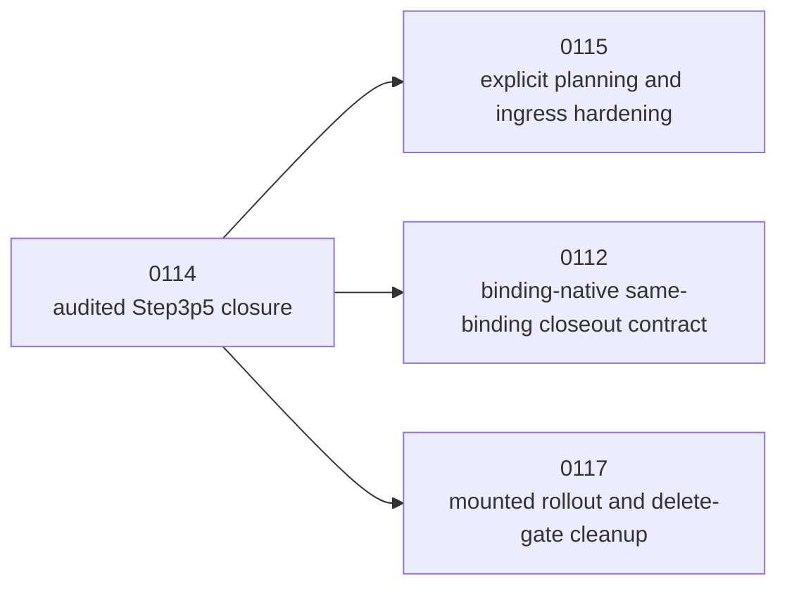

# Summary

Define the post-`0114` follow-up for work that should not keep the audited
Step3p5 collective-first closure open:

- capture mounted evidence on a second representative `BINDING_FINALIZE`
  family,
- broaden mounted operator-visible evidence beyond the minimal Step3p5 closure
  packet,
- and remove transitional delete gates only after that broader rollout
  evidence exists.

`0114` is now implemented and historical for the audited Step3p5 path.
`0115` is now implemented and historical for explicit source-bound
lane-selection closure. Their completed companion plans have been folded back
into the implemented designs and deleted. This design owns only generalized
rollout and cleanup after those closures, and its paired `0117` plan is now
the active checklist for that remaining work.

# Goals / Non-Goals

## Goals

- Keep `0114` closed once the audited Step3p5 path is proven in operator
  reality.
- Capture a documented local mounted runbook and closure packet for a second
  representative `BINDING_FINALIZE` family.
- Make mounted operator-visible evidence rich enough to justify cleanup of
  transitional bridge logic and delete gates.
- Remove stale active references, transitional compatibility-only gating, and
  other post-0114 cleanup only after the mounted rollout evidence is present.

## Non-Goals

- Reopen the audited Step3p5 architecture closure from `0114`.
- Redefine source-bound execution semantics already moved under `0115`.
- Redesign same-binding seal identity or GS metadata semantics already folded
  into the implemented `0112` same-binding closeout contract.
- Introduce a second serving startup path.

# Prior Constraints Reviewed

## `0114` audited Step3p5 closure

Kept:

- the Step3p5 same-binding operator path is already implemented and proven
  through real mounted startup;
- its final closure packet is sufficient to treat `0114` as historical rather
  than as the active owner of rollout work.

Applied here:

- this follow-up exists specifically so `0114` does not stay open for
  environment-dependent second-family rollout and delete-gate cleanup.

## `0115` explicit source-bound planning

Kept:

- execution-plan hardening and ingress-lifecycle semantics stay with `0115`.

Applied here:

- this design does not absorb explicit strategy-plan work; it only consumes the
  observable behavior those plans make possible.

## `0112` same-binding closeout metadata convergence

Kept:

- same-binding seal-reuse metadata consistency is already part of the
  implemented binding-native closeout contract.

Applied here:

- mounted rollout evidence here assumes the immediate same-binding convergence
  fixes are already landed under `0112`, but it does not become the owner of
  any further metadata-only cleanup.

# Architecture & Interfaces

## Closure Split After `0114`

The required mounted evidence for this follow-up is intentionally broader than
the minimal 0114 closure packet.

For each representative mounted family, operator-visible evidence should cover:

- serving readiness,
- dominant execution lane and collective committed bytes,
- hash backend / bytes / wall time / identity-forming facts,
- and any mounted executor metrics required to justify removing transitional
  gates.

Delete-gate cleanup must stay fail-closed:

- no transitional bridge deletion before the mounted evidence exists,
- no residual-map or compatibility-only gating deletion before the mounted
  evidence exists,
- and no documentation cleanup that would hide remaining rollout risk before
  the mounted evidence exists.

### Naming Compliance

This follow-up does not introduce a new public API. Any internal helpers added
for rollout evidence or delete-gate cleanup must continue to use repository
standard `snake_case` naming.

# Trade-offs & Risks

- Environment-dependent second-family validation may remain blocked longer than
  code-only work; keeping it in a separate follow-up avoids misreporting 0114
  as incomplete.
- Operator-visible mounted metrics can drift from internal executor truth if
  they are assembled ad hoc. The mounted evidence surfaces should therefore
  consume typed diagnostics directly where possible.
- Delete-gate cleanup becomes riskier once 0114 is historical; this design
  must keep the cleanup gates explicit so they are not silently skipped.

# Compatibility & Acceptance Criteria

This design is complete only when all of the following are true.

1. A second representative `BINDING_FINALIZE` family has a documented local
   mounted runbook and a captured closure packet comparable to Step3p5.
2. Mounted operator-visible evidence reports the required collective and hash
   details directly enough that operators do not have to infer them from
   internal-only traces.
3. Transitional bridge logic, residual-map-based gating, and stale active plan
   references are deleted only after those mounted evidence gates pass.
4. `0114` remains closed and historical throughout this rollout work.

# References

- [Collective-First Binding Realization for TP Serving Startup](/data/workspace/tensorcast-280/docs/designs/0114-collective-first-binding-realization-for-tp-serving-startup.md)
- [Explicit Source-Bound Execution Planning and Fail-Fast Lane Selection](/data/workspace/tensorcast-280/docs/designs/0115-explicit-source-bound-execution-planning-and-fail-fast-lane-selection.md)
- [Binding-Native Serving Realization and Publication](/data/workspace/tensorcast-280/docs/designs/0112-binding-native-serving-realization-and-publication.md)
