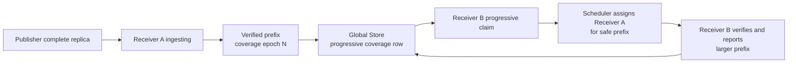
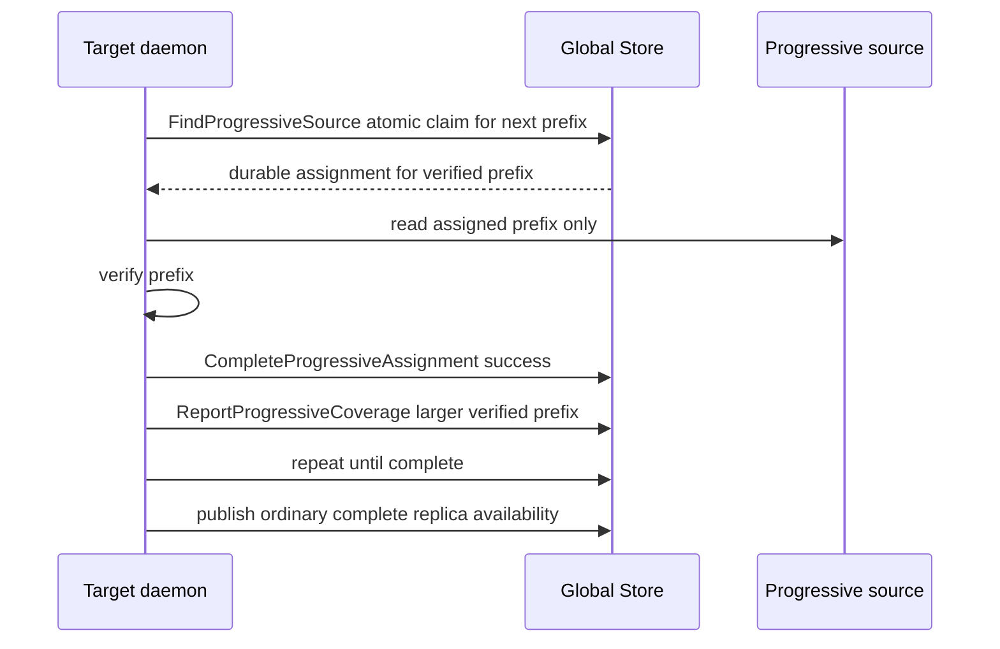

# Summary

Progressive replica dissemination lets a receiver that has already verified a
safe prefix serve that prefix to other receivers before its full replica is
complete.

This design is deliberately separate from `0117`. `0117` freezes semantic
identity for a group as a `GroupVersionSet`, with one frozen part selection per
member. This design extends the transport/source-selection plane with a
partial-source path that can only serve verified coverage for the matching
version-set part identity.



# Goals / Non-Goals

## Goals

- Reduce high-fanout source concentration and tail latency for weight
  dissemination.
- Let in-progress receivers serve only verified prefix coverage.
- Keep incomplete replicas invisible to ordinary complete-replica source
  selection.
- Preserve `ArtifactSelection` identity: a materialization must not mix
  artifacts, views, selection hashes, or layout hashes.
- Reuse `0083` source scheduling concepts without weakening ordinary transport
  semantics.
- Add explicit failure invalidation, source caps, and cross-datacenter smart
  skipping.

## Non-Goals

- Do not mark incomplete replicas as `artifact_replicas.is_available=true`.
- Do not support arbitrary sparse progressive ranges in v1.
- Do not support view transforms, local-only `msa1:` artifacts, or unverified
  coverage in v1.
- Do not implement group semantic consistency. That belongs to `0117`.
- Do not replace existing complete-replica P2P or disk transport.
- Do not make progressive dissemination the default before correctness and
  benchmark gates pass.

# Design Rationale

High-fanout replica dissemination has a source concentration problem: the first
complete source can remain overloaded even while many receivers already hold
verified prefixes. The safe optimization is not "make partial replicas generally
available"; it is "make partial coverage explicitly visible to a scheduler path
that understands the coverage boundary."

TensorCast must preserve stronger existing control-plane contracts:

- ordinary replica availability means the requested byte space is complete;
- materialization identity is `ArtifactSelection`;
- Global Store persists source eligibility and failure state;
- daemon APIs remain the SDK control-plane boundary.

# Dependency Readiness

This design depends on:

- `0117` for frozen `GroupVersionSet` and part-selection identity when a
  grouped rollout is involved;
- `0083` for transport group scheduling and source spread metrics;
- existing export metadata and heartbeat checks for ordinary P2P source safety.

It does not require `0117` for ungrouped single-artifact fanout, but the first
production rollout should wait until `0117` stabilizes so progressive path tests
can assert the same version-set manifest and part-selection identity as the group
transaction.

Before any implementation work starts, the following drift guards must hold:

- active code, tests, runners, and proto/schema surfaces have no relaxed
  `tp_version`, `#tcg:`, or operation-id group metadata path;
- WeightPublisher and grouped serving lanes use typed `GroupRealization` and
  frozen `GroupVersionSet` refs for model-parallel coherence;
- grouped progressive coverage reports carry the exact `version_set_id` and
  `part_id` returned by the `0117` begin/join path. These fields are empty only
  for ungrouped single-artifact fanout;
- progressive source assignment never resolves a mutable key or latest alias by
  itself. It consumes the already-frozen selection identity from the materializer;
- ordinary complete-replica source selection and progressive source selection are
  separate APIs or separate typed modes with fail-fast validation.

# Shared Invariants With `0117`

`0117` and `0118` share the following invariants:

- `ArtifactSelection` identity never changes inside one materialization attempt.
- Retrieval policy and topology are not artifact identity.
- Ordinary replica availability means complete requested byte-space availability.
- Export generation fences source visibility.
- Progressive coverage never upgrades to ordinary replica availability
  implicitly.
- `GroupVersionSet`, when present, is a manifest over part selections, not
  content truth.

# Current State And Gaps

Current repository state:

- `artifact_replicas` stores complete replica availability and export metadata.
- `find_available_for_transport` filters ordinary sources by artifact/view,
  heartbeat, availability, exportability, and capacity.
- `artifact_transports` and `pending_transport_requests` track complete transport
  requests and group dispatch.
- Transport completion outcome distinguishes success from failed, expired, and
  cancelled outcomes.

Gaps:

1. There is no durable progressive coverage record.
2. There is no separate progressive source visibility model.
3. In-progress receivers cannot advertise a verified prefix without becoming an
   ordinary source.
4. There is no coverage identity that includes selection hash, layout hash, hash
   space, export generation, and tensor order.
5. There is no durable progressive assignment/claim state, so source caps,
   timeout cleanup, mid-read recovery, and idempotency cannot be enforced.
6. Cross-datacenter TCP seed behavior is not represented in source eligibility.

# Target Model

## Vocabulary

- **Progressive coverage**: verified prefix coverage for an incomplete local
  materialization.
- **Coverage identity**: artifact, byte space, selection hash, logical layout
  hash, hash-space anchor, coverage order hash, replica, and export generation.
- **Progressive source**: a daemon that can serve a verified prefix through the
  progressive path only.
- **Coverage epoch**: monotonic daemon-local update number for one progressive
  materialization attempt. It is an update field, not coverage-row identity.
- **Progressive segment**: the next safe prefix slice assigned to a target.
- **Progressive assignment**: durable claim of one verified prefix segment from
  one source to one requester.

## V1 Scope

Enable progressive dissemination only for:

- canonical full artifacts;
- v1.0 byte-prefix coverage only;
- verified coverage boundaries;
- WeightPublisher and grouped serving prefetch/staged publication fanout;
- RDMA/TCP source paths already supported by ordinary remote source;
- one progressive outgoing request per in-progress source by default;
- frozen `GroupVersionSet` and part-selection identity from `0117` when the
  caller uses a semantic group.

Disable progressive source selection for:

- view transforms;
- tensor-order-prefix coverage in v1.0;
- sparse arbitrary ranges;
- unverified coverage;
- local-only `msa1:` artifacts;
- memory whose export metadata is incomplete;
- sources whose daemon heartbeat is stale;
- sources currently acting as slow cross-datacenter TCP seed, unless policy
  explicitly admits them.

Tensor-order-prefix coverage is a v1.1 candidate only after the
`coverage_order_hash` owner, canonical tensor order, and verification-boundary
tests have landed.

# Architecture And Interfaces

## Coverage Identity

A progressive coverage row is source-eligible only when all identity fields match
the target materialization:

- `artifact_id`;
- `byte_space_kind` and `byte_space_id`;
- `selection_hash`;
- `logical_layout_hash`;
- `hash_space_kind`, `hash_space_id`, and `canonical_index_multihash`;
- `coverage_order_hash`;
- `source_export_generation`;
- when a `GroupVersionSet` is present, `group_version_set_id` and
  `group_part_id`.

The `coverage_order_hash` is required because a tensor prefix is safe only if
all participants agree on tensor order. For byte-prefix mode, it identifies the
byte stream segmentation contract and is the SHA-256 digest of the canonical
byte-prefix coverage-order marker.

For grouped flows, `group_version_set_id` and `group_part_id` must be copied from
the `0117` transaction begin response. They must not be reconstructed from a key,
from current key mapping state, or from operation-id tags. A mismatch between the
group fields and the materialization attempt is a hard identity failure.

A verified prefix is reportable only after all writes covering that prefix have
completed, sink-side ordering is committed, and verification state for that
prefix is known. For GPU sink paths this requires copy handle completion; for
RDMA direct paths this requires read completion plus sink commit. It is not a
claim that a source has sent N bytes.

## Global Store API

The implementation may add a new service group or extend the runtime service
with explicitly progressive RPCs:

```proto
enum ProgressiveCoverageKind {
  PROGRESSIVE_COVERAGE_KIND_UNSPECIFIED = 0;
  PROGRESSIVE_COVERAGE_KIND_BYTE_PREFIX = 1;
  PROGRESSIVE_COVERAGE_KIND_TENSOR_PREFIX = 2; // Reserved for v1.1.
}

enum ProgressiveCoverageState {
  PROGRESSIVE_COVERAGE_STATE_UNSPECIFIED = 0;
  PROGRESSIVE_COVERAGE_STATE_PENDING = 1;
  PROGRESSIVE_COVERAGE_STATE_VERIFIED = 2;
  PROGRESSIVE_COVERAGE_STATE_FAILED = 3;
  PROGRESSIVE_COVERAGE_STATE_RETIRED = 4;
}

enum ProgressiveAssignmentState {
  PROGRESSIVE_ASSIGNMENT_STATE_UNSPECIFIED = 0;
  PROGRESSIVE_ASSIGNMENT_STATE_CLAIMED = 1;
  PROGRESSIVE_ASSIGNMENT_STATE_READING = 2;
  PROGRESSIVE_ASSIGNMENT_STATE_SUCCEEDED = 3;
  PROGRESSIVE_ASSIGNMENT_STATE_FAILED = 4;
  PROGRESSIVE_ASSIGNMENT_STATE_EXPIRED = 5;
  PROGRESSIVE_ASSIGNMENT_STATE_CANCELLED = 6;
}

message ProgressiveCoverageIdentity {
  string artifact_id = 1;
  tensorcast.common.v1.ByteSpaceRef byte_space = 2;
  bytes selection_hash = 3;
  bytes logical_layout_hash = 4;
  tensorcast.common.v1.HashSpaceRef hash_space = 5;
  bytes coverage_order_hash = 6;
  string group_version_set_id = 7;
  string group_part_id = 8;
}

message ReportProgressiveCoverageRequest {
  string coverage_id = 1;
  ProgressiveCoverageIdentity identity = 2;
  string replica_id = 3;
  string daemon_id = 4;
  string daemon_session_id = 5;
  string worker_id = 6;
  uint64 source_export_generation = 7;
  uint64 coverage_epoch = 8;
  ProgressiveCoverageKind coverage_kind = 9;
  uint64 verified_units = 10;
  uint64 verified_bytes = 11;
  uint64 completed_units = 12;
  uint64 completed_bytes = 13;
  uint64 total_units = 14;
  uint64 total_bytes = 15;
  string materialization_attempt_id = 16;
  string source_transport_id = 17;
}

message FindProgressiveSourceRequest {
  ProgressiveCoverageIdentity identity = 1;
  uint64 next_unit = 2;
  uint64 max_units = 3;
  string requester_daemon_id = 4;
  string requester_worker_id = 5;
  string requester_source_domain = 6;
  bytes request_fingerprint = 7;
  uint64 deadline_unix_nanos = 8;
  string requester_materialization_attempt_id = 9;
}

message ProgressiveSourceAssignment {
  string assignment_id = 1;
  string coverage_id = 2;
  string replica_id = 3;
  string source_daemon_id = 4;
  string source_worker_id = 5;
  string source_domain = 6;
  string seed_transport_kind = 7;
  string requester_daemon_id = 8;
  string requester_worker_id = 9;
  uint64 start_unit = 10;
  uint64 end_unit_exclusive = 11;
  uint64 start_byte = 12;
  uint64 end_byte_exclusive = 13;
  uint64 source_export_generation = 14;
  uint64 deadline_unix_nanos = 15;
  ProgressiveAssignmentState state = 16;
  tensorcast.common.v1.MemoryInfo source_memory_info = 17;
}

message CompleteProgressiveAssignmentRequest {
  string assignment_id = 1;
  ProgressiveAssignmentState outcome = 2;
  string outcome_detail = 3;
}
```

Ordinary `RequestReplicaTransport` should not return progressive sources. The
progressive path needs either a dedicated RPC or a clearly typed progressive
request mode that cannot be confused with complete-replica transport.

`FindProgressiveSource` must perform an atomic claim and return a durable
assignment, including the source `MemoryInfo` needed by the target data path.
It is not a SELECT-only source lookup.

Progressive assignments use `MemoryInfo.transport` as the only place for
exportable communicator keys, buffer sizes, and verification metadata. The
former flat `MemoryInfo.remote_memory_keys`, `buffer_sizes`, and
`verification_json` fields are reserved and are not part of the current schema.

## Schema Changes

```sql
CREATE TABLE IF NOT EXISTS replica_progress_coverage (
    coverage_id TEXT PRIMARY KEY,
    artifact_id TEXT NOT NULL,
    byte_space_kind TEXT NOT NULL,
    byte_space_id TEXT NOT NULL DEFAULT '',
    selection_hash TEXT NOT NULL,
    logical_layout_hash TEXT NOT NULL,
    hash_space_kind TEXT NOT NULL,
    hash_space_id TEXT NOT NULL DEFAULT '',
    canonical_index_multihash TEXT NOT NULL,
    coverage_order_hash TEXT NOT NULL,
    group_version_set_id TEXT NOT NULL DEFAULT '',
    group_part_id TEXT NOT NULL DEFAULT '',
    replica_id TEXT NOT NULL,
    daemon_id TEXT NOT NULL,
    daemon_session_id TEXT NULL,
    worker_id TEXT NOT NULL,
    source_export_generation BIGINT NOT NULL,
    coverage_epoch BIGINT NOT NULL,
    coverage_kind TEXT CHECK (coverage_kind IN ('byte_prefix')) NOT NULL,
    state TEXT CHECK (state IN (
      'pending','verified','failed','retired'
    )) NOT NULL,
    export_state TEXT CHECK (export_state IN (
      'not_exportable','in_progress_exportable','complete_exportable'
    )) NOT NULL,
    verified_units BIGINT NOT NULL,
    verified_bytes BIGINT NOT NULL,
    completed_units BIGINT NOT NULL,
    completed_bytes BIGINT NOT NULL,
    total_units BIGINT NOT NULL,
    total_bytes BIGINT NOT NULL,
    materialization_attempt_id TEXT NOT NULL,
    source_transport_id TEXT NULL,
    source_domain TEXT NOT NULL,
    seed_transport_kind TEXT NULL,
    deadline_at TIMESTAMP WITH TIME ZONE NULL,
    created_at TIMESTAMP WITH TIME ZONE DEFAULT CURRENT_TIMESTAMP,
    updated_at TIMESTAMP WITH TIME ZONE DEFAULT CURRENT_TIMESTAMP,
    UNIQUE(materialization_attempt_id, replica_id, source_export_generation)
);
```

There is one active coverage row per
`(materialization_attempt_id, replica_id, source_export_generation)`.
`coverage_epoch` is a monotonic update field on that row. If coverage history is
needed later, it should use a separate event table rather than making each epoch
a distinct source-eligible row.

```sql
CREATE TABLE IF NOT EXISTS progressive_source_assignments (
    assignment_id TEXT PRIMARY KEY,
    coverage_id TEXT NOT NULL,
    requester_daemon_id TEXT NOT NULL,
    requester_worker_id TEXT NOT NULL,
    source_daemon_id TEXT NOT NULL,
    source_worker_id TEXT NOT NULL,
    source_domain TEXT NOT NULL,
    seed_transport_kind TEXT NULL,
    start_unit BIGINT NOT NULL,
    end_unit_exclusive BIGINT NOT NULL,
    start_byte BIGINT NOT NULL,
    end_byte_exclusive BIGINT NOT NULL,
    source_export_generation BIGINT NOT NULL,
    state TEXT CHECK (state IN (
      'claimed','reading','succeeded','failed','expired','cancelled'
    )) NOT NULL,
    deadline_at TIMESTAMP WITH TIME ZONE NOT NULL,
    request_fingerprint BLOB NOT NULL,
    created_at TIMESTAMP WITH TIME ZONE DEFAULT CURRENT_TIMESTAMP,
    updated_at TIMESTAMP WITH TIME ZONE DEFAULT CURRENT_TIMESTAMP,
    UNIQUE(request_fingerprint)
);

`coverage_id` is intentionally not a physical foreign key in DuckDB. Assignment
rows still join to coverage rows for all state transitions, but DuckDB rejects
updates to a referenced parent row even when only non-key columns such as
`state` change; coverage retirement and expiration therefore keep the relation as
an application-level invariant plus indexed audit field.

CREATE TABLE IF NOT EXISTS progressive_source_counters (
    source_replica_id TEXT NOT NULL,
    source_daemon_id TEXT NOT NULL,
    source_export_generation BIGINT NOT NULL,
    active_assignments INTEGER NOT NULL DEFAULT 0,
    last_assigned_at TIMESTAMP WITH TIME ZONE NULL,
    updated_at TIMESTAMP WITH TIME ZONE DEFAULT CURRENT_TIMESTAMP,
    PRIMARY KEY (source_replica_id, source_export_generation)
);
```

Indexes:

- `(artifact_id, byte_space_kind, byte_space_id, state, verified_bytes)`;
- `(selection_hash, logical_layout_hash, coverage_order_hash, state)`;
- `(daemon_id, state, deadline_at)`;
- `(source_domain, seed_transport_kind, state)`.
- `progressive_source_assignments(coverage_id, state, deadline_at)`;
- `progressive_source_assignments(source_daemon_id, state, deadline_at)`.
- `progressive_source_counters(source_daemon_id, active_assignments)`.

## Target Loop



The target may switch sources between segments. It must not switch artifact,
view, selection hash, logical layout hash, or coverage order within one
materialization attempt.

## Source Eligibility

A progressive source is eligible only when:

- coverage state is `verified`;
- export state is `in_progress_exportable` or `complete_exportable`;
- verified prefix covers the requested next unit;
- source daemon heartbeat is fresh;
- current ordinary replica export metadata is still exportable;
- `artifact_replicas.export_generation` still matches
  `coverage.source_export_generation`;
- source has not exceeded the progressive outgoing concurrency cap;
- policy allows its source domain and seed transport kind.

Ordinary `find_available_for_transport` must ignore this table.

The progressive outgoing cap is separate from ordinary transport source
counters. Ordinary complete-replica transports and progressive in-progress
segments must not share one counter because they represent different source
eligibility and failure semantics.

`progressive_source_counters` is the hot counter table for this cap. An
assignment claim creates the durable assignment and increments the progressive
counter in the same repository transaction. Assignment completion, failure,
expiration, or cancellation decrements it exactly once. The counter is an
admission-control optimization; assignment rows remain the audit truth.

## Control-Plane Load Budget

Progressive dissemination is more likely than `0117` to overload Global Store
because segment count can be much larger than rank count. Current Global Store
code has strong serialization points: repository transactions hold the global
DB execution lock, the ordinary transport dispatcher already has a centralized
dispatch lock, and existing HA benchmark notes show write amplification and
tight polling can saturate the server. The progressive path must therefore obey
these limits:

- Coverage reporting is coalesced. A daemon reports only after a minimum byte
  delta, a minimum time interval, a verification-state transition, or terminal
  completion/failure. It must not report every copy chunk, RDMA completion,
  tensor, or CUDA event.
- One source-eligible coverage row is updated in place for a materialization
  attempt/replica/export generation. `coverage_epoch` is a monotonic update
  field; coverage history, if needed, goes to an events table outside the hot
  source lookup path.
- `FindProgressiveSource` is an indexed, bounded atomic claim, not a new global
  dispatcher. Candidate scans must be limited by config and must not reuse the
  ordinary `_dispatch_loop_lock` or scan all coverage rows.
- Segment sizes are bounded by policy: a minimum assignment size prevents
  tiny-segment write storms, and maximum assignment size plus assignment TTL
  bounds recovery time.
- Client-supplied coverage and assignment deadlines are capped by the configured
  Global Store TTLs. A long request deadline must not extend source visibility
  or keep source counters held beyond the progressive policy budget.
- Progressive coverage reports require explicit visibility state and export
  state. Unspecified enum values are rejected rather than inferred from byte
  counts.
- Source caps use `progressive_source_counters`, separate from
  `replica_counters`, so ordinary complete-replica transport pressure and
  progressive partial-source pressure do not contaminate each other's
  scheduling semantics.
- Target loops re-query Global Store only after an assignment succeeds, fails,
  expires, or no eligible source exists. They must not poll while a segment read
  is in flight.
- Expiration and cleanup are indexed batch sweeps. They cannot run as an
  unbounded purge in the request-critical path.
- The data path remains daemon-to-daemon. Global Store never coordinates each
  byte range inside an assigned segment.

If a workload requires claims or coverage reports at sub-chunk granularity, the
progressive feature must stay disabled until the storage/control-plane design is
changed.

## Cross-Datacenter Smart Skipping

Cross-datacenter fanout has a distinct bottleneck: local RDMA fanout should not
block behind a slow TCP seed. TensorCast should model this as a progressive
source policy:

- if a source is actively seeding across domains over TCP, it is not progressive
  source-eligible by default;
- once the seed completes and a local exportable prefix is verified, it may serve
  local progressive requests;
- operators may explicitly admit cross-domain progressive sources for benchmark
  or emergency modes through typed config.

`source_domain` is a configured transport locality domain from daemon/worker
topology metadata or unified config. It is not an ad-hoc request string. A
requester-supplied domain hint must match the server-side directory entry or be
rejected.

# Consistency Model

## Progressive Visibility

Progressive coverage is not ordinary replica availability. A complete replica is
published through the existing `artifact_replicas` path only after full
materialization and verification complete.

`ReportProgressiveCoverage(completed=true)` does not publish ordinary
availability. Ordinary availability is published only by the existing replica
registration/publication path.

Complete target publications may report terminal byte-prefix progressive
coverage only after the ordinary memory-replica registration succeeds and the
target publish path has passed the state-sync barrier. This makes fully
published receiver targets eligible as later progressive sources without making
incomplete target buffers visible through ordinary availability.

## Version Identity

Every progressive segment in one materialization attempt must match:

- `artifact_id`;
- byte space;
- `selection_hash`;
- `logical_layout_hash`;
- `hash_space`;
- `coverage_order_hash`.
- when grouped, `group_version_set_id` and `group_part_id`.

Mismatch is a hard failure, not a fallback opportunity.

## Failure And Recovery

- If a target read fails, the target reports failure and retries from another
  eligible source.
- If a source fails while serving, Global Store marks that coverage failed or
  retired and prevents new assignments.
- If source export generation changes, all older coverage for that source
  generation becomes ineligible.
- If no progressive source is available, the target falls back only according to
  explicit policy. It must not change version identity.
- On daemon restart, in-progress coverage is invalid until the daemon re-reports
  verified coverage with a valid export generation.
- Assignment timeout or source failure completes the durable assignment as
  failed/expired before a new assignment is claimed.

## Source Visibility Fence

Any source used by progressive assignment must obey the source visibility fence:

- stop issuing new assignments before overwrite or retirement;
- let in-flight assignments drain or fail;
- revoke local export visibility;
- advance `export_generation` before new assignments can observe replacement
  bytes.

This is the same fence required by group realization in `0117`.

# Configuration

Feature controls must live in unified runtime config protos.

Candidate fields:

```text
GlobalStoreConfig.worker_policy.progressive_replication.enabled
GlobalStoreConfig.worker_policy.progressive_replication.max_outgoing_per_source
GlobalStoreConfig.worker_policy.progressive_replication.coverage_ttl
GlobalStoreConfig.worker_policy.progressive_replication.assignment_ttl
GlobalStoreConfig.worker_policy.progressive_replication.allow_cross_domain_seed_sources
GlobalStoreConfig.worker_policy.progressive_replication.min_verified_bytes
GlobalStoreConfig.worker_policy.progressive_replication.min_assignment_bytes
GlobalStoreConfig.worker_policy.progressive_replication.max_assignment_bytes
GlobalStoreConfig.worker_policy.progressive_replication.max_assignments_per_materialization
GlobalStoreConfig.worker_policy.progressive_replication.assignment_candidate_scan_limit
GlobalStoreConfig.worker_policy.progressive_replication.max_claim_qps_per_daemon
GlobalStoreConfig.worker_policy.progressive_replication.cleanup_batch_limit
GlobalStoreConfig.worker_policy.progressive_replication.source_domain_policy

DaemonConfig.materialization.progressive_replication.enabled
DaemonConfig.materialization.progressive_replication.report_interval
DaemonConfig.materialization.progressive_replication.min_report_delta_bytes
DaemonConfig.materialization.progressive_replication.verify_before_report
```

# Error Model

| Case | Result |
| --- | --- |
| progressive source has only unverified bytes | not eligible |
| source export generation changes | existing coverage generation retired |
| assignment request repeats with same fingerprint | same assignment or terminal outcome returned |
| target detects checksum mismatch | target fails attempt or retries after invalidating source coverage |
| source dies mid-read | assignment fails; source coverage marked failed/retired; target re-queries |
| slow cross-domain TCP seed is only partial source | skipped by default; target waits or uses complete source according to policy |
| ordinary source selection runs | progressive coverage is ignored |
| complete materialization succeeds | ordinary replica availability is published through existing path |

# Naming Compliance

| Surface | Proposed names | Compliance |
| --- | --- | --- |
| Proto messages | `ProgressiveCoverageIdentity`, `ReportProgressiveCoverageRequest`, `FindProgressiveSourceRequest`, `ProgressiveSourceAssignment`, `CompleteProgressiveAssignmentRequest` | PascalCase messages, snake_case fields |
| Proto enums | `ProgressiveCoverageKind`, `ProgressiveCoverageState`, `ProgressiveAssignmentState` | PascalCase enum names, ALL_CAPS values |
| Python repository/service methods | `report_progressive_coverage`, `find_progressive_source`, `retire_progressive_coverage`, `expire_progressive_coverage` | snake_case functions |
| C++ structs | `ProgressiveCoverageHint`, `ProgressiveSourceAssignment` | PascalCase structs |
| Constants | `kDefaultProgressiveCoverageTtl`, `kMaxProgressiveOutgoingPerSource` | existing C++ constant style |

# Metrics And Observability

Add low-cardinality metrics:

- `tc_progressive_coverage_reports_total{state,coverage_kind}`;
- `tc_progressive_source_assignments_total{assignment_state,coverage_kind}`;
- `tc_progressive_source_assignments_active{source_domain}`;
- `tc_progressive_recovery_total{reason}`;
- `tc_progressive_skipped_sources_total{reason}`;
- `tc_progressive_verified_bytes{coverage_kind}`;
- `tc_progressive_coverage_reports_throttled_total{reason}`;
- `tc_progressive_claim_db_conflicts_total{op}`;
- `tc_progressive_claim_candidate_rows`;
- `tc_progressive_assignment_cleanup_batch_size`;
- existing `tc_transport_source_top1_share` and `tc_transport_source_hhi`
  remain the primary diffusion measurements.

Diagnostics should include:

- coverage id;
- materialization attempt id;
- selection hash and logical layout hash digests;
- source daemon id;
- source export generation;
- assignment id;
- assigned prefix bounds.

# Rollout And Final State

Rollout is additive:

1. Re-run the `0117` drift guards and confirm no relaxed group semantics remain
   in active code, tests, runners, proto, or schema.
2. Land schema/proto/config with feature flags default off.
3. Add daemon coverage reporting without source eligibility.
4. Add Global Store assignment claim behind config.
5. Add target loop support in benchmark-only lanes.
6. Enable for canonical full byte-prefix artifacts in WeightPublisher fanout.
7. Enable for grouped serving prefetch/staged publication only after `0117`
   publish-barrier gates pass.
8. Promote only after correctness and source concentration gates pass.

Backout:

- disable progressive source eligibility;
- keep coverage reporting disabled or observation-only;
- continue using ordinary complete-replica transport;
- expire progressive coverage rows.
- expire or fail outstanding progressive assignments.

There is no separate long-term fallback mode for progressive source semantics.
Once enabled for a lane, the ordinary complete-replica path remains a separate
policy choice, not a hidden fallback for mismatched progressive identity.

# Alternatives And Rationale

## Mark In-Progress Replicas Available

Rejected. Ordinary TensorCast availability means the complete requested byte
space can be served.

## Use Arbitrary Sparse Ranges In V1

Rejected. Sparse ranges require shared range identity across planner, verifier,
source, and target. Prefix coverage is sufficient for pipeline dissemination and
is safer to validate.

## Put Progressive Sources Into `0083` Without A New Visibility Model

Rejected. `0083` schedules complete replica transports. Progressive coverage has
different identity, verification, and failure semantics.

# Acceptance Criteria

- Progressive coverage is never returned by ordinary complete-replica source
  selection.
- A progressive assignment never crosses the verified prefix boundary.
- Progressive source assignment is a durable atomic claim with idempotent replay.
- There is one active source-eligible coverage row per materialization attempt,
  replica, and source export generation.
- A materialization attempt never mixes artifacts, byte spaces, selection
  hashes, layout hashes, hash spaces, or coverage order.
- A grouped materialization attempt never mixes `GroupVersionSet` ids or part
  ids, and progressive assignment does not resolve mutable keys independently of
  the `0117` frozen version reference.
- Source export generation changes retire older coverage.
- Assignment-time eligibility rechecks heartbeat, exportability, and current
  ordinary replica export generation.
- Coverage reports and assignment claims are coalesced and bounded. Global
  Store writes do not scale with copy chunks, RDMA completions, tensor count, or
  bytes inside an assigned segment.
- Atomic source claims use indexed candidate windows and progressive counters;
  they do not introduce a second global dispatcher or reuse ordinary transport
  counters.
- V1.0 supports byte-prefix only.
- Source failure mid-read causes recovery from another eligible source or a
  clear unavailable error.
- Cross-domain TCP seed sources are skipped by default for progressive local
  fanout.
- Progressive fanout improves source concentration or tail latency in the
  high-fanout WeightPublisher benchmark without increasing correctness failures
  or timeout rate.

# References

- `0083` transport scheduling:
  `docs/designs/0083-group-aware-transport-scheduling.md`
- `0117` group realization:
  `docs/designs/0117-group-realization-transaction.md`
