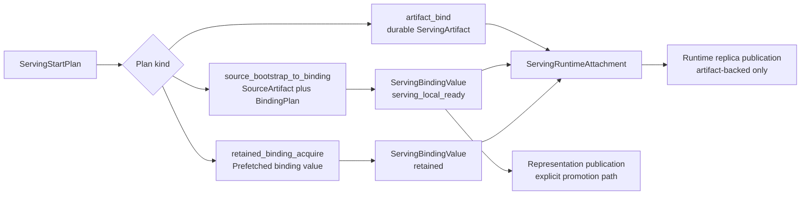

# Summary

Define the next serving-runtime refactor after `0111`, `0112`, and `0116`.
Those designs define the source-to-serving publication bridge, binding-native
same-binding realization, and serving prefetch target. This design defines how
the Python serving runtime should be reshaped so those concepts appear as deep,
canonical concepts rather than many shallow runtime modules.

The core decision is:

- keep artifact as the durable identity, discovery, routing, publication, and
  lifecycle root;
- make binding value the daemon-owned realization root;
- make runtime attachment the only process-local framework boundary;
- delete or absorb parallel concepts such as preload, manifest hints, duplicate
  recipe identities, and broad integration facades;
- permit breaking Python API changes, including internal-vLLM API changes, when
  doing so preserves or improves scenario semantics.

This design is execution-oriented, but still architectural. The companion plan
contains phases, file-by-file work, tests, rollout, and backout details.

# Goals / Non-Goals

## Goals

- Make the serving runtime artifact-first in code shape, not only in intent.
- Replace broad startup branching with one typed `ServingStartPlan`.
- Replace selector terminology with artifact locator terminology while keeping
  artifact-ref, version-key, and ranked member-key routing.
- Use `ServingArtifactManifest` as the single durable manifest model.
- Merge recipe build and compile identity into one `ServingBindingPlan`
  identity that covers trace, resolved spec, realization, layout, schema, and
  topology.
- Treat local-ready, retained, published-ready, and group-prepared states as
  readiness of a `ServingBindingValue`, not as standalone public concepts.
- Replace user-facing preload vocabulary with retained serving binding handoff
  and acquire semantics built from `artifact.prefetch(target=...)`.
- Isolate process-local attachment and framework finalize into a dedicated
  runtime attachment boundary.
- Preserve representation publication and runtime replica publication as
  separate operations.
- Preserve internal-vLLM functionality and performance-sensitive semantics even
  when TensorCast and vLLM APIs are changed incompatibly.

## Non-Goals

- Do not redefine `RepresentationTransformContract`; that remains `0110`.
- Do not redefine representation publication lineage; that remains `0105` and
  `0111`.
- Do not make local-ready values durable, routable, or cross-daemon.
- Do not make prefetch export IPC handles to the prefetch caller.
- Do not keep old Python import compatibility as a design constraint.
- Do not preserve `tensorcast.serving.integration` as a broad alias to private
  lifecycle implementation internals.
- Do not introduce direct Python SDK access to Global Store.

# Problem Statement

`tensorcast/serving` currently supports the important real scenarios, but the
runtime code carries too many overlapping concepts:

- `ServingRuntimeSession` planning, source bootstrap, retained binding acquire,
  durable artifact bind, reload, attachment, diagnostics, and publication are
  concentrated in `tensorcast/serving/_runtime_impl/lifecycle.py`.
- Historical selector naming mixed locator behavior with artifact identity;
  `ServingArtifactLocator` is the retained durable resolution concept.
- `ServingArtifactManifestHint` duplicates durable manifest concepts.
- recipe build identity and compile identity model the same contract boundary
  in different places.
- Retained binding acquire must stay aligned with the deeper prefetch and
  retained binding model from `0116`.
- Historical bootstrap-summary, endpoint projection, and diagnostics paths
  duplicated the same facts in many flat field families; runtime view
  diagnostics is the canonical projection source.
- The removed `tensorcast.serving.integration` compatibility alias previously
  exported implementation internals and made the private lifecycle module a
  downstream API.

The result is that real integrations, especially internal-vLLM, depend on many
shallow TensorCast surfaces. This is a poor long-term boundary even though the
current behavior is useful.

This design keeps the behavior and removes the parallel authorities.

# Prior Constraints Reviewed

## Root artifact-first rule

Kept and strengthened. Durable serving identity, routing, discovery, reload,
and publication remain artifact concepts. New runtime flows must first ask how
artifact metadata, artifact lifecycle, artifact publication, or artifact replica
semantics should express the workflow.

## `0111` source-to-serving publication

Kept. `0111` remains the owner of source-to-serving builder modes,
representation publication bridge facts, serving manifest rules, and the split
between semantic identity and builder/publication identity.

This design narrows runtime ownership: serving runtime may attach a local-ready
binding and may publish an artifact-backed runtime replica, but durable serving
artifact publication remains a representation publication workflow.

## `0112` binding-native realization

Kept. A daemon-owned binding value is the realization host for local-ready and
same-binding paths. The Python runtime should expose that through
`ServingBindingValue` and `ServingRuntimeAttachment`, not through a second
tensor-dict publication path or local-ready identity model.

## `0116` serving prefetch target

Kept and extended into the runtime API. Prefetch prepares retained daemon memory
without worker IPC handles. Acquire attaches the serving worker and mints a
fresh lease. The old `preload` vocabulary is revised into retained serving
binding handoff and acquire semantics.

## internal-vLLM artifact-first guidance

Kept. The internal-vLLM repository already states that TensorCast integrations
should stay artifact-centered. This design treats internal-vLLM as the primary
downstream scenario check, but not as an API compatibility constraint.

# Architecture & Interfaces

## Canonical concepts

| Concept | Meaning | Primary owner | Absorbs |
| --- | --- | --- | --- |
| `ServingArtifact` | Durable serving representation and discovery root | Store API and manifest | ad hoc prepared artifact identity |
| `ServingManifest` | Self-describing serving artifact contract | `tensorcast.types.ServingArtifactManifest` | `ServingArtifactManifestHint` |
| `ServingArtifactLocator` | Pre-resolution artifact ref or key-mapping locator | serving runtime | `ServingSelector` as identity |
| `ServingStartPlan` | Typed startup intent with exactly one selected branch | serving runtime planner | scattered config fallbacks |
| `ServingBindingPlan` | Source, target layout, topology, member, resolved spec, recipe, and realization identity | serving runtime plus store types | recipe build and compile identity duplication |
| `ServingBindingValue` | Daemon-owned realized binding value and readiness | daemon binding lifecycle | standalone local-ready/preloaded/public-ready concepts |
| `RetainedServingBindingAuthority` | Serialized authority for retained worker acquire | prefetch/acquire lifecycle | external preload authority |
| `ServingRuntimeAttachment` | Process-local model attachment to a binding value | framework adapter boundary | model attributes as authority |
| `ServingRealizationReport` | Structured execution, hashing, validation, and projection facts | serving diagnostics | flat bootstrap-summary field families |

## Startup planning

The runtime must classify startup into exactly one `ServingStartPlan` variant
before it allocates GPU memory or constructs framework runtime state:

- `artifact_bind`: resolve a durable serving artifact, read manifest, validate
  schema/digests/topology, and attach.
- `source_bootstrap_to_binding`: resolve or construct a source artifact catalog,
  build or load a `ServingBindingPlan`, realize a local-ready binding value, and
  attach.
- `retained_binding_acquire`: validate a retained binding authority derived from
  prefetch, acquire a fresh worker lease and IPC handles, and attach.

Invalid combinations must fail in the planner. Broad fallback behavior is not
allowed to hide unknown states.

## Artifact locator and manifest preflight

`ServingArtifactLocator` is a locator, not durable identity itself. It supports:

- direct artifact ref;
- version key;
- ranked member version key, resolved with `ServingBindingMemberRef`.

After resolution, every durable artifact bind and reload uses the same manifest
preflight:

- manifest tensor exists and parses as `ServingArtifactManifest`;
- representation contract hash matches policy when pinned;
- serving build digest matches policy when pinned;
- tensor schema hash matches expected framework adapter view;
- target layout and resolved spec digest match attach expectations;
- topology admission digest matches current placement when topology-sensitive;
- artifact readiness admits runtime bind.

## Binding plan identity

`ServingBindingPlan` is the cache and correctness identity for source bootstrap.
It includes:

- source artifact ref and source schema hash;
- source reuse decision and selected source subject;
- framework name, framework version, adapter version, and serving ABI version;
- model config digest and load config digest;
- topology ref and member ref;
- trace plan identity;
- resolved binding spec digest;
- target layout hash and tensor schema hash;
- representation contract hash and serving build digest;
- semantic validation requirements;
- realization plan digest and execution policy.

Recipe, resolved spec, and realization cache hits are valid only when this
identity matches. Cache mismatch fails before attachment.

## Retained binding acquire

The public operation remains `artifact.prefetch(target=ServingBindingTarget(...))`
or its set-level equivalent. The worker receives a serialized retained binding
authority, not an IPC handle. Acquire validates:

- binding id, layout id, value id, and seal generation;
- reservation capability and token scope;
- daemon id, session id, and local daemon endpoint;
- device UUID and target device;
- topology/member identity;
- target layout hash, tensor schema hash, serving build digest, and resolved
  spec digest;
- readiness and group realization stage.

The authority must also expose trusted retained reservation bytes so internal
vLLM can credit free memory before vLLM admission.

## Runtime attachment

`ServingRuntimeAttachment` owns:

- daemon binding state and close semantics;
- tensor attach and worker lease lifetime;
- framework runtime-only tensor allocation;
- post-bind finalize hooks;
- semantic validation after attach;
- endpoint and weight-version projection;
- structured realization and attachment reports;
- optional runtime replica publication state.

Framework model attributes may cache a pointer to the attachment, but they are
not the authority.

Final Python module boundaries:

- `tensorcast.serving.runtime` is the narrow framework-facing surface for
  `ServingRuntimeSession`, `RequestContext`, start-intent DTOs, artifact locator
  and policy conveniences, `RuntimeAttachment`, `RuntimeWorkerView`, and runtime
  errors. It uses explicit imports rather than a dynamic compatibility export
  path.
- `tensorcast.serving.runtime_config` owns daemon/runtime startup settings and
  runtime profile resolution.
- `tensorcast.serving.runtime_intent` owns runtime start-intent DTOs. Retained
  binding acquire carries the parsed authority from
  `tensorcast.serving.retained_binding` directly.
- `tensorcast.serving.runtime_attachment` owns `RuntimeAttachment`,
  `RuntimeBindingState`, `RuntimeBindingView`, and `RuntimeStateSeed`.
- `tensorcast.serving.runtime_view` owns endpoint/weight-version projection DTOs,
  runtime-view aggregation, and source-selection projection helpers.
- `tensorcast.serving.replica_publication` owns artifact-backed runtime replica
  publish, observational projection, retire, and active-publication reload
  rejection.
- `tensorcast.serving.errors` owns the structured serving runtime error
  hierarchy.

The package root and `tensorcast.serving.runtime` use explicit canonical imports
and do not reexport projection DTOs, state-store helpers, readiness helper
families, or broad lifecycle internals. The private lifecycle module has no
public `__all__`; callers use the canonical runtime, host, attachment, view, and
error modules.

## Publication boundaries

Runtime replica publication is allowed only for artifact-backed active binding
values and remains volatile runtime replica publication.

Durable serving artifact publication is representation publication. Local-ready
promotion must call explicit representation publication APIs and must not make
local-ready itself externally routable.

# internal-vLLM Downstream Contract

internal-vLLM currently depends on TensorCast in these scenario paths:

- `vllm/tensorcast/loader.py`: runtime session start, reload swap, attachment
  storage, replica publication hook, and local-ready promotion bridge.
- `vllm/tensorcast/host.py`, `adapter.py`, `placement.py`, `source.py`, and
  `collective.py`: framework adapter, source catalog, topology/member facts,
  runtime-only tensor handling, and collective-first materialization facts.
- `vllm/model_executor/model_loader/memory_accounting.py`: trusted retained
  reservation bytes credited before vLLM admission.
- `vllm/v1/worker/gpu_model_runner.py`, `vllm/v1/engine/llm_engine.py`, and the
  OpenAI API server: reload endpoint, runtime view projection, weight-version
  response, local-ready durable promotion, shutdown retire, and EP/EPLB reload
  guards.
- `vllm/tensorcast/builder/*_runner.py`: explicit offline `PURE_TRANSFORM` and
  `BINDING_FINALIZE` publication workflows.

Those APIs may change incompatibly. The scenario semantics must remain:

| vLLM scenario | Required semantic after refactor |
| --- | --- |
| TensorCast model load | returns or stores one `ServingRuntimeAttachment` with binding state, endpoint projection, reports, and close semantics |
| Local source cold start | local path is normalized into a source artifact before planning; trace and recipe cache under `ServingBindingPlan` identity |
| Durable reload | artifact-locator driven swap without full model reconstruction |
| Retained prefetch worker attach | retained authority preserves reservation, member, daemon/session, device, layout, schema, build, spec, and readiness validation |
| Memory capacity accounting | trusted retained reservation bytes remain available before vLLM admission |
| Runtime-only tensors and finalize | allocation and finalize happen in attachment, not in artifact resolution |
| Runtime replica publication | after-ready publication stays asynchronous and artifact-backed |
| Shutdown cleanup | worker can retire current published runtime replica from attachment state |
| Runtime view and weight version | stable projection exposes serving/source/build identity |
| Local-ready durable promotion | explicit representation publication, not local-ready durability |
| EP/EPLB reload safety | topology/member identity and semantic placement digests remain first-class |

Performance is preserved only if retained reservation accounting,
collective-first realization facts, recipe/cache identity, and in-place reload
swap remain intact.

# Naming Compliance

This design introduces Python API names and conceptual model names. It does not
require new C++ API names, but any later C++ implementation must follow the root
`AGENTS.md` C++ naming rules.

| Name | Kind | Rule |
| --- | --- | --- |
| `ServingArtifactLocator` | Python class | `PascalCase` |
| `ServingStartPlan` | Python class | `PascalCase` |
| `ServingBindingPlan` | Python class | `PascalCase` |
| `ServingBindingValue` | Python class | `PascalCase` |
| `RetainedServingBindingAuthority` | Python class | `PascalCase` |
| `RetainedServingBindingHandoff` | Python class | `PascalCase` |
| `ServingRuntimeAttachment` | Python class | `PascalCase` |
| `ServingRealizationReport` | Python class | `PascalCase` |
| `artifact_bind` | enum or string value | `snake_case` value |
| `source_bootstrap_to_binding` | enum or string value | `snake_case` value |
| `retained_binding_acquire` | enum or string value | `snake_case` value |
| `retained_reservation_bytes` | function or field | `snake_case` |
| `to_weight_version_payload` | method | `snake_case` |

# Schema Changes

No persistent SQL schema change is required by this design.

Proto changes may be needed if retained binding authority, serving manifest
preflight, or runtime projection facts need new daemon/store messages. If a
proto change is introduced, the implementation plan must run
`bash tools/build_proto_python.sh` and `bazel test //proto/...`.

# Error Model

Errors should be defined out of the common path through typed planning and
validated authorities:

- ambiguous startup config fails in the planner;
- missing placement for ranked locator or retained acquire fails before model
  construction;
- manifest, schema, layout, topology, build, spec, daemon/session, device, or
  readiness mismatch fails before attachment or reload swap;
- cache mismatches fail before GPU allocation;
- runtime replica publication failures are reported and may mark optional
  publication unhealthy, but must not corrupt active serving attachment;
- reload failure marks the worker unhealthy until explicitly recovered;
- broad fallback to a slower or less precise path is allowed only when selected
  by plan or configuration.

# Compatibility & Migration

Python API compatibility is intentionally not preserved.

The migration must be scenario-compatible:

- TensorCast tests are rewritten around canonical concepts rather than private
  class names.
- internal-vLLM imports are migrated from broad modules to narrow serving
  modules.
- vLLM request and response payloads may rename locator/policy fields, but
  must keep artifact-ref, version-key, ranked member-key, pinned manifest, and
  build/representation digest semantics.
- vLLM memory accounting must consume retained binding reservation bytes without
  changing admission behavior.
- operator-visible weight-version and runtime-view fields may be restructured,
  but they must still expose serving artifact ref, source artifact ref,
  representation contract hash, serving build digest, readiness, and source
  selection facts.

# Trade-offs & Risks

- Breaking APIs reduces compatibility work but requires coordinated internal
  vLLM migration.
- A deeper `ServingBindingPlan` identity may initially be larger, but it removes
  hidden cache validity assumptions.
- Collapsing preload into retained binding acquire can break vLLM capacity if
  trusted reservation bytes are not exposed early enough.
- Replacing flat bootstrap-summary fields with structured reports improves
  correctness but requires careful operator endpoint projection.
- Moving behavior out of `lifecycle.py` creates churn; the plan must keep
  semantic tests ahead of large file moves.

# Acceptance Criteria

- `ServingRuntimeSession` startup is planned by one typed `ServingStartPlan`
  with exactly three variants.
- Durable artifact bind and reload use one manifest preflight path.
- `ServingArtifactManifestHint` is deleted or no longer authoritative.
- recipe build/compile identity is unified under `ServingBindingPlan`.
- local source bootstrap produces a `ServingBindingValue` plus
  `ServingRealizationReport`.
- retained worker attach consumes retained binding authority derived from
  prefetch, not a public preload concept.
- runtime attachment is the only process-local attachment owner.
- runtime replica publication and representation publication remain separate.
- topology/member identity uses `ServingTopologyRef` and
  `ServingBindingMemberRef`.
- internal-vLLM scenario tests pass after migration, with no relaxation of
  retained reservation, reload swap, runtime view, local-ready promotion, or
  EP/EPLB guard semantics.

# References

- `docs/designs/0111-source-to-serving-builder-and-representation-publication.md`
- `docs/designs/0112-binding-native-serving-realization-and-publication.md`
- `docs/designs/0116-prefetch-serving-binding-target.md`
- `docs/plans/0119-serving-concept-deepening-refactor.md`
- `/data/workspace/internal-vllm/AGENTS.md`
- `/data/workspace/internal-vllm/vllm/tensorcast/loader.py`
- `/data/workspace/internal-vllm/vllm/tensorcast/retained_binding.py`
- `/data/workspace/internal-vllm/vllm/model_executor/model_loader/memory_accounting.py`
- `/data/workspace/internal-vllm/vllm/v1/worker/gpu_model_runner.py`
