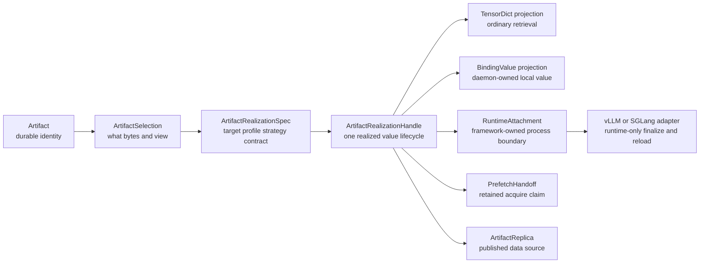

# Summary

`0119` completed the immediate serving-runtime cleanup: it split lifecycle
implementation from framework-facing runtime modules, made retained binding
acquire explicit, preserved runtime attachment as the vLLM boundary, and kept
runtime replica publication separate from durable representation publication.

This design should not be folded into `0119`. The next question is broader than
the `tensorcast/serving` module shape: it asks whether "Serving" should remain a
primary TensorCast concept or become a model-runtime profile on top of the
artifact realization system.

The decision is:

- keep `Artifact` as the durable identity, routing, discovery, lifecycle, and
  replica-publication root;
- treat "serving" as a model-runtime workload profile, not as a second artifact
  system;
- keep `Binding` as the daemon-owned local realization boundary;
- keep `RuntimeAttachment` as the process-local framework boundary;
- make TensorDict materialization, daemon binding, model-runtime attachment,
  retained prefetch, TP/P2P, reload, and local-ready promotion converge on one
  artifact realization model;
- preserve the current vLLM scenario semantics and performance-sensitive timing
  even when TensorCast and internal-vLLM APIs are changed incompatibly.



# Goals / Non-Goals

## Goals

- Decide the next design unit after `0119`: a new artifact-centered design,
  with `0119` as the executed implementation baseline.
- Reduce user-facing concepts by making artifact realization the shared path for
  TensorDict retrieval, durable load, binding, local source bootstrap, retained
  prefetch acquire, TP realization, P2P reuse, reload, and runtime replica
  publication.
- Preserve vLLM functionality and performance semantics as hard constraints,
  not compatibility accidents.
- Separate public/professional APIs from internal execution objects:
  user-facing flows should speak in artifacts, realization specs, realization
  handles, and projections; execution code may keep richer target, profile,
  binding, layout, reservation, and publication details.
- Keep device facts and framework facts out of durable artifact identity while
  still making them explicit in realization admission.
- Make P2P and TP more consistent by treating them as realization strategies
  under artifact selection, not as separate serving-only workflows.

## Non-Goals

- Do not treat `tensorcast.serving` as a compatibility boundary. It is the
  current implementation namespace after `0119` and may be reshaped directly
  when the final artifact-centered model is clearer.
- Do not collapse every runtime concern into `Artifact`. Artifact is the root,
  not a god object.
- Do not make local-ready binding values durable or globally routable without an
  explicit representation publication.
- Do not let P2P imply representation conversion or TP reshaping. P2P moves
  compatible bytes; transforms remain representation contracts and realization
  plans.
- Do not preserve Python API compatibility as a requirement. Behavior, scenario
  depth, and performance-sensitive semantics are the requirements.
- Do not put direct Global Store access in the Python SDK.

# Relationship To `0119`

`0119` should be considered the completed semantic baseline for current serving
runtime behavior. It should not become the umbrella document for this design,
and it should not force API compatibility during the next refactor.

Reasons:

- `0119` is about reshaping the Python serving runtime after `0111`, `0112`, and
  `0116`. Its vocabulary is still serving-centered.
- This design changes the conceptual owner from "serving runtime" to "artifact
  realization for model runtimes." Mixing both decisions in `0119` would make
  the document carry two different theses.
- vLLM now depends on the behavior implemented by `0119`. A new design can
  explicitly classify which vLLM-facing fields are semantic and which are only
  temporary naming before changing interfaces directly.
- The next migration should be able to break APIs cleanly. That is easier when
  the new target model is documented as a successor, not as an edit to the old
  execution plan.

`0119` remains useful as:

- the source of current module boundaries;
- the vLLM behavior baseline;
- the list of runtime attachment, retained acquire, reload, and publication
  behavior that must not regress;
- a reference for what should be renamed, absorbed, or kept internal later.

# Prior Constraints Reviewed

## Artifact-first SDK (`0039`)

Kept and completed. Retrieval, prefetch, and binding should hang off an artifact
handle. This design extends that principle by treating TensorDict retrieval,
binding, and model-runtime attach as projections over one realization model. A
model runtime is a profiled realization of an artifact or source artifact, not a
separate serving object graph.

## Selection-first retrieval (`0078`)

Kept. `ArtifactSelection` remains the identity for what artifact/view/subset is
being materialized. Realization targets, topology, collective settings, and P2P
source choices do not replace selection identity.

## Binding model (`0084`)

Kept and narrowed. `Binding` is the local daemon-owned realization boundary. It
is not durable identity and is not automatically a global artifact replica.
Serving-specific binding values should be understood as binding-value
projections with a model-runtime profile. TensorDict retrieval should not remain
a separate fallback around binding semantics when the target state is a durable
or retained local value.

## Materialization strategy (`0108`)

Kept. Disk, P2P, typed copy, collective, and fallback lanes belong in the shared
strategy plane. The next model-runtime layer should not reimplement strategy
selection inside a serving-only branch.

## Representation contract (`0110`)

Kept. TP slicing, runtime tensor schema, layout, and semantic placement safety
must be represented by the representation contract and realization plan. P2P
may only reuse a source when the source representation is compatible with the
target member layout.

## Source-to-serving publication (`0111`)

Kept but renamed conceptually. The durable output is a published representation
artifact. The fact that vLLM uses it for serving is profile metadata and
operator intent, not a separate identity system.

## Binding-native realization (`0112`)

Kept. Same-binding local-ready realization is the correct deep primitive: source
artifact bytes are realized into a binding, framework finalize runs against the
same binding-backed tensors, and promotion to a durable artifact is explicit.

## Collective-first TP startup (`0114`)

Kept and generalized. Collective-first TP startup is a realization strategy for
a target set. It should be available through the same artifact realization
pipeline as P2P and disk load, not only through serving-local code.

## Prefetch serving binding target (`0116`)

Kept but reframed. Prefetch prepares retained daemon-owned realization. The
serialized handoff should be treated as a retained binding claim/capability for
a realization target. It is not user-facing preload vocabulary.

## Serving runtime cleanup (`0119`)

Kept as current behavior baseline, not as an API compatibility boundary. Its
`ServingRuntimeSession`, `RuntimeAttachment`, retained acquire, runtime view,
and runtime replica publication behavior become inputs to this successor design,
and their interfaces may be changed when the replacement preserves or improves
the scenario semantics.

# Current State After `0119`

The current TensorCast serving code has a clear runtime baseline:

- `tensorcast.serving.runtime` is the framework-facing entrypoint for
  `ServingRuntimeSession`, start intents, runtime config, runtime attachment,
  and runtime view DTOs.
- `tensorcast.serving.config` classifies startup into exactly one plan:
  `artifact_bind`, `source_bootstrap_to_binding`, or
  `retained_binding_acquire`.
- `tensorcast.serving.policy` owns `ServingArtifactLocator` and pinned/runtime
  policy normalization.
- `tensorcast.serving.binding_plan` unifies trace, recipe, resolved spec,
  topology, layout, schema, and realization identity.
- `tensorcast.serving.retained_binding` validates retained claims, reservation
  capabilities, trusted reservation bytes, lease acquire, restore, and ownership
  transfer.
- `tensorcast.serving.runtime_attachment` owns the process-local model
  attachment and close semantics.
- `tensorcast.serving.replica_publication` owns volatile runtime replica
  publication and retirement for artifact-backed active bindings.
- `tensorcast.serving._runtime_impl.lifecycle` remains the orchestration module.

The current Store SDK still exposes several artifact-driven entrypoints that
should be unified conceptually before large API changes:

- `Artifact.tensor_dict(...)` and `Artifact.tensor_dict_into(...)` materialize
  selected bytes into caller-observed tensors.
- `Artifact.bind(...)` and `Artifact.bind_into(...)` materialize the same
  selection into a daemon-owned local binding location.
- `Artifact.prefetch(device=...)` prepares an ordinary replica, while
  `Artifact.prefetch(target=ServingBindingTarget(...))` prepares retained
  binding state.
- Serving startup then consumes bindings and retained binding claims through
  separate runtime objects.

These entrypoints already start from `Artifact`; the remaining problem is that
they expose multiple conceptual result systems. The target state is one
realization handle with different projections and lifecycle actions.

The current internal-vLLM integration exercises these semantics:

- `vllm/tensorcast/loader.py` creates a `ServingRuntimeSession`, starts the
  runtime attachment, records it on the vLLM model object, performs in-place
  durable artifact reload, starts after-ready replica publication, and exposes
  local-ready durable promotion.
- `vllm/tensorcast/placement.py` maps vLLM TP, PP, DP, EP, and EPLB facts into
  `ServingTopologyRef`, `ServingBindingMemberRef`, semantic placement digests,
  and materialization execution facts.
- `vllm/tensorcast/source.py` maps local HF/safetensors state into a
  source-artifact catalog and recipe cache policy.
- `vllm/tensorcast/collective.py` provides same-node source coordination and TP
  local-ready barriers.
- `vllm/tensorcast/adapter.py` owns vLLM model construction, trace capture,
  runtime-only tensor exclusion, attach/finalize hooks, and tensor invariants.
- `vllm/model_executor/model_loader/memory_accounting.py` credits trusted
  retained reservation bytes before vLLM admission.
- `vllm/v1/worker/gpu_model_runner.py` uses runtime view projection, reload
  response projection, shutdown publication retirement, and EP/EPLB reload
  safety.

# Concept Ownership

The next model should reduce public concepts without hiding necessary internal
state.

| Concept | Public role | Internal owner | Kept separate from |
| --- | --- | --- | --- |
| `Artifact` | Durable identity, discovery, lifecycle, replica source | Store API, daemon, Global Store | device ordinal, framework process state |
| `ArtifactSelection` | What artifact/view/subset is requested | materialization request | topology, strategy, retry policy |
| `RealizationTarget` | Where and in what representation a selection should be realized | runtime/materialization planner | durable artifact identity |
| `RealizationTargetSet` | Multi-member realization intent for TP/PP/DP groups | group realization planner | mutable key resolution |
| `ArtifactRealizationSpec` | Target, profile, representation contract, and strategy intent | SDK/runtime planner | execution attempt state |
| `ArtifactRealizationHandle` | User/professional handle for one realized value lifecycle | SDK/runtime facade | framework model internals |
| `TensorDictProjection` | Ordinary tensor-dict view of a realized selection | Store SDK | daemon-owned binding lifecycle |
| `RepresentationTransformContract` | Semantic tensor/layout contract | representation plane | transport source choice |
| `MaterializationStrategy` | Disk/P2P/collective/local execution choice | shared strategy plane | user-facing API naming |
| `BindingValue` | Daemon-owned local realization value | binding lifecycle | durable artifact replica until published |
| `RuntimeAttachment` | Process-local framework model attachment | runtime adapter | Global Store metadata |
| `RuntimeAdapter` | vLLM/SGLang-specific construction and finalize hooks | integration layer | Artifact core |
| `ArtifactReplica` | Published data source for future loads/P2P | artifact lifecycle | local-ready binding values |

`Serving` should remain only as one model-runtime profile where useful:

- acceptable as package namespace during migration;
- acceptable in profile names such as `serving_abi_version` when the payload is
  specifically the model-serving runtime ABI;
- not acceptable as a second root for artifact identity, source discovery,
  P2P routing, or publication.

# Proposed Architecture

## Artifact realization request

The long-term public shape should be artifact-centered:

```python
artifact = tc.artifact(key="model:qwen:runtime:tp8")

realization = artifact.realize(
    spec=tc.ArtifactRealizationSpec.model_runtime(
        framework="vllm",
        device="cuda:0",
        topology=topology,
        member=member,
        adapter_version="...",
        runtime_abi_version="...",
    )
)

attachment = realization.attach(adapter=vllm_adapter)
```

This is not a requirement to add this exact API immediately. It establishes the
conceptual target:

- users start from `Artifact`;
- one realization spec expresses target, profile, strategy, and admission
  intent;
- `Artifact.realize(...)` returns a realization handle, not directly a framework
  attachment;
- TensorDict, Binding, RuntimeAttachment, retained handoff, and publication are
  projections or actions of that handle;
- current `tensorcast.serving.runtime` APIs may be reshaped directly toward this
  model because source compatibility is not a goal.

Ordinary retrieval should use the same conceptual path:

```python
tensors = tc.artifact(key="model:qwen:weights").realize(
    spec=tc.ArtifactRealizationSpec.tensor_dict(device="cuda:0")
).tensor_dict()

binding = tc.artifact(key="model:qwen:weights").realize(
    spec=tc.ArtifactRealizationSpec.binding(device="cuda:0", layout=layout)
).binding()
```

The existing `artifact.tensor_dict(...)`, `artifact.tensor_dict_into(...)`,
`artifact.bind(...)`, and `artifact.bind_into(...)` methods may remain as
convenience forms if they lower into this model. They should not define a second
materialization architecture.

## Realization handle and projections

The public/professional result should be a single `ArtifactRealizationHandle`
with explicit projections:

| Projection/action | Meaning |
| --- | --- |
| `tensor_dict()` | Return ordinary TensorDict materialization for the realized selection |
| `binding()` | Return or expose the daemon-owned local binding value |
| `attach(adapter=...)` | Create a framework-owned `RuntimeAttachment` from the binding value |
| `prefetch_handoff()` | Return a retained realization claim for later acquire |
| `publish_replica(...)` | Publish an artifact-backed replica when the realized value is eligible |
| `promote(...)` | Enter explicit representation publication for local-ready values |

This keeps `Artifact` small while preventing TensorDict, binding, retained
prefetch, and model-runtime attach from becoming parallel top-level concepts.

## Startup paths under one model

The three `0119` startup plans map cleanly to artifact realization:

| Current `0119` plan | Artifact-centered meaning |
| --- | --- |
| `tensor_dict` / `tensor_dict_into` | Realize an artifact selection into a TensorDict projection |
| `bind` / `bind_into` | Realize an artifact selection into a daemon-owned binding projection |
| `artifact_bind` | Realize a durable representation artifact into a runtime binding |
| `source_bootstrap_to_binding` | Normalize local source into source artifact, then realize into target binding |
| `retained_binding_acquire` | Attach to a retained realization prepared by artifact prefetch |

The internal plans should remain explicit. The change is that they become
variants under artifact realization, not serving lifecycle branches or
TensorDict-specific fallback paths.

## TP as target-set realization

TP should be represented as a `RealizationTargetSet`:

- each member has stable topology/member identity;
- each member has a target layout and representation contract;
- source reuse and collective execution are planned for the set;
- same-node collective-first is a strategy, not a separate serving feature;
- P2P direct member copy is allowed only when representation, topology, member,
  layout, and schema are compatible.

This keeps TP deep without making TP a special user-facing artifact type.

## P2P as compatible replica movement

P2P remains a data-plane source strategy:

- source selection consumes `ArtifactSelection` and compatible replica metadata;
- P2P never converts TP size, tensor schema, or semantic placement;
- mismatched representation requires a realization plan or transform executor;
- runtime-published replicas are ordinary artifact replicas only after explicit
  publication and correct metadata registration.

## Retained prefetch as retained realization

The retained acquire payload should be treated as a serialized retained
realization claim:

- reservation capability;
- daemon/session/device/member facts;
- binding value ref;
- expected layout/schema/build/spec digests;
- readiness and verification state;
- optional group realization acquire facts.

Names such as `RetainedServingBindingAuthority` are acceptable only as internal
implementation names when they describe current code. The public concept should
be a retained realization handoff/claim. It authorizes an acquire; it is not a
new source of truth.

## Runtime attachment remains separate

Do not move framework model state into `Artifact`.

`RuntimeAttachment` should remain the boundary for:

- vLLM model object ownership;
- runtime-only tensor allocation and rehydration;
- finalize hooks;
- tensor invariant checks;
- after-ready publication hooks;
- reload response and weight-version projections;
- close/retire process-local lifecycle.

This is the correct separation: artifact is durable identity; attachment is
process-local runtime state.

# vLLM Scenario Contract

The following vLLM facts are semantic requirements, not legacy compatibility
fields.

| vLLM scenario | Must remain true after this design |
| --- | --- |
| TensorDict retrieval and TensorDict-dependent internals | TensorDict loads are projections of artifact realization and share selection, strategy, diagnostics, and P2P semantics with binding/runtime realization |
| Local HF/safetensors cold start | Local path is normalized into a source artifact before planning; recipe/trace caches are keyed by source, model, topology, member, schema, and realization identity |
| Durable artifact startup | A locator resolves to a durable artifact; manifest and policy preflight validate schema, representation contract, serving build, topology, and readiness before attach |
| Retained prefetch attach | vLLM can credit trusted reservation bytes before model construction and later acquire a fresh lease for the exact member/device/layout/value |
| vLLM memory admission | Retained reservation bytes stay visible before vLLM memory admission; this timing is a behavior requirement |
| TP multi-rank load | Same-node source coordination, collective execution facts, TP ranks, rank-local target layouts, and local-ready barrier remain explicit |
| EP/EPLB reload safety | Expert placement and EPLB digests remain part of topology admission and reload validation |
| Runtime-only tensors | Runtime-only tensor names, allocation, post-bind finalize, and invariant validation remain adapter-owned |
| In-place reload | Reload swaps the active binding value without reconstructing the vLLM model, and returns stable reload response projection |
| Runtime view | Weight-version and endpoint projections expose artifact ref, local ref, binding value ref, schema, contract, readiness, publication state, and failure state |
| Runtime replica publication | After-ready publication stays async, artifact-backed, and explicitly retired on reload/shutdown |
| Local-ready durable promotion | Promotion from local-ready binding to durable artifact remains an explicit representation publication workflow |
| Drafter models | Main and draft model TensorCast attachments can reload coherently through the same artifact locator path |

The existing vLLM `model_loader_extra_config` fields should be reclassified:

| Current field family | Future classification | Keep why |
| --- | --- | --- |
| `serving.artifact_locator` | `artifact.locator` or artifact selection input | durable startup/reload identity |
| `serving.policy` | representation/artifact preflight policy | pinned manifest/build/contract safety |
| `bootstrap.*` | source artifact bootstrap and cache policy | local cold start and trace/recipe reuse |
| `materialization.collective` | realization strategy preference | TP performance and fail-closed behavior |
| `retained_binding_acquire.*` | retained realization handoff/claim | prefetch handoff and memory accounting |
| `replica_publication.*` | runtime artifact replica publication policy | P2P source creation after model ready |
| `diagnostics.*` | realization diagnostics/profile controls | operator debugging and validation |

These fields may be renamed, moved, or deleted as standalone user-facing fields,
but their semantics should not be silently removed.

# Public, Framework, And Internal APIs

## Public user API

Public APIs should be artifact-first and small:

- `tc.artifact(...)` and `tc.from_disk(...)` remain the root.
- `Artifact.realize(spec=...)` is the target long-term model for TensorDict,
  binding, retained prefetch, and model-runtime attach.
- `Artifact.prefetch(...)` may remain as a convenience method when it lowers to
  `realize(...).prefetch_handoff()` or ordinary replica preparation.
- TensorDict helpers may remain as convenience methods when they lower to
  `realize(...).tensor_dict()`.
- Publication belongs to the realization handle or binding value, not to a
  second serving-specific authority.

## Framework integration API

Frameworks such as vLLM and SGLang need a professional API that is more
explicit than the public API:

- `RuntimeAdapter` for model construction, tensor surface, finalize hooks, and
  semantic probes;
- `ArtifactRealizationSpec` or `ModelRuntimeProfile` fields for framework
  identity, ABI, source catalog policy, and admission policy;
- `ArtifactRealizationHandle` for projection, acquire, attach, reload, and
  publication actions;
- `RuntimeAttachment` for process-local state and close/reload/publication
  projection;
- `RuntimeView` for operator and framework response payloads.

This layer should be stable enough for vLLM/SGLang maintainers but should not
expose private lifecycle helpers as a broad compatibility facade.

## Internal execution objects

Internal objects can stay rich:

- `ServingBindingPlan` or its successor realization-plan identity;
- resolved spec cache entries;
- binding layout ids and binding value refs;
- reservation capabilities and lease tokens;
- group realization acquire refs;
- materialization diagnostics;
- publication projections.

These objects should not become the everyday user API.

# Naming And API Direction

The following names are the preferred long-term conceptual direction. They do
not require compatibility aliases; the implementation may rename or reshape the
current `0119` interfaces directly once the vLLM scenario matrix is covered.

| Current name | Future direction | Rationale |
| --- | --- | --- |
| `ServingRuntimeSession` | `ArtifactRuntimeSession`, `ModelRuntimeSession`, or removed facade over `Artifact.realize` | runtime session is not serving-specific |
| `ServingArtifactLocator` | `ArtifactLocator` or `ArtifactSelectionLocator` | locator resolves artifact identity |
| `ServingBindingTarget` | `RealizationTarget` or fields inside `ArtifactRealizationSpec` | target is runtime/layout intent |
| `ServingBindingPlan` | `ArtifactRealizationPlan` for public docs; internal name may remain | plan identity covers source, target, transform, cache, and layout |
| `PrefetchedServingBinding` | `PrefetchHandoff` or `RetainedRealizationClaim` | serialized acquire capability, not a tensor handle |
| `RetainedServingBindingAuthority` | `RetainedRealizationClaim` internally, `PrefetchHandoff` publicly | serialized acquire capability, not authority of truth |
| `ServingRuntimeAttachment` | `RuntimeAttachment` | already generalized in `0119` code |
| `ServingRealizationReport` | `ArtifactRealizationReport` | report is not serving-only |
| `ServingArtifactManifest` | `RuntimeRepresentationManifest` unless the payload is truly serving ABI-specific | durable representation metadata should not be serving-rooted |
| `serving_build_digest` | `runtime_build_digest` or `representation_build_digest` unless tied to serving ABI | build identity belongs to representation/runtime profile |

Do not perform a broad rename first. Names should follow behavior ownership.
Migrate once the vLLM scenario matrix is covered by tests and docs.

# Naming Compliance

Any new Python API proposed here must follow repository style:

| Symbol | Kind | Required style | Status |
| --- | --- | --- | --- |
| `ModelRuntimeTarget` | Python class | `PascalCase` | compliant |
| `ModelRuntimeProfile` | Python class | `PascalCase` | compliant |
| `ArtifactRealizationSpec` | Python class | `PascalCase` | compliant |
| `ArtifactRealizationHandle` | Python class | `PascalCase` | compliant |
| `ArtifactRealizationPlan` | Python class | `PascalCase` | compliant |
| `ArtifactRealizationReport` | Python class | `PascalCase` | compliant |
| `RetainedRealizationClaim` | Python class | `PascalCase` | compliant |
| `PrefetchHandoff` | Python class | `PascalCase` | compliant |
| `RuntimeAttachment` | Python class | `PascalCase` | compliant |
| `Artifact.realize` | Python method | `snake_case` | compliant |
| `Artifact.prefetch` | Python method | `snake_case` | existing compliant |
| `publish_replica` | Python function/method | `snake_case` | compliant |
| `retire_replica` | Python function/method | `snake_case` | compliant |

# Error Model And Invariants

- Startup planning must resolve exactly one plan. Ambiguous retained acquire,
  durable artifact bind, and source bootstrap combinations fail before GPU
  allocation.
- TensorDict retrieval, binding, retained prefetch, and model-runtime attach must
  build the same resolved `ArtifactSelection` for the same artifact/view/subset.
- Artifact locator resolution must happen through the daemon-backed SDK path,
  not direct Global Store calls.
- A local-ready binding value is not a durable artifact and is not eligible for
  cross-daemon P2P until explicit publication.
- A runtime-published replica must be artifact-backed and tied to the active
  binding value generation.
- Reload must reject active publication states that would make source ownership
  ambiguous.
- P2P source reuse must validate representation/layout/schema/member
  compatibility before data movement.
- Device ordinal, CUDA UUID, daemon session, lease token, and process id are
  runtime facts. They must not become durable artifact identity.
- EP/EPLB semantic placement digests must participate in reload admission.
- Unexpected runtime state should fail clearly rather than falling back to a
  slower or less precise path.

# Architecture Risks

## Risk: Artifact becomes too broad

If every serving/runtime concern is placed directly on `Artifact`, the class
will mix durable identity, device placement, framework state, publication,
leases, and runtime hooks. That would make the public API simpler in name but
less coherent in behavior.

Mitigation: artifact owns durable identity and lifecycle. A realization spec and
realization handle own target/profile/strategy, projection, and publication
actions. Bindings and attachments remain separate realized projections.

## Risk: TensorDict remains a second materialization system

TensorDict APIs are the easiest path for users and tests, so they can silently
remain outside the model-runtime realization work. That would preserve two
loading systems: TensorDict materialization and binding/runtime realization.

Mitigation: make TensorDict a first-class projection of artifact realization.
Convenience methods may remain, but tests and docs should assert that selection,
source strategy, diagnostics, and P2P compatibility flow through the same
realization model.

## Risk: Runtime facts pollute durable identity

vLLM needs device UUIDs, ranks, daemon sessions, reservations, and topology
digests. These are necessary, but they are realization/admission facts, not
artifact identity.

Mitigation: keep them in target/profile/admission/claim payloads and preserve
artifact identity as artifact id plus selection/representation metadata.

## Risk: P2P hides representation conversion

Direct P2P between serving workers is attractive, but TP4-to-TP8 or EP/EPLB
layout changes are semantic transforms, not byte-copy choices.

Mitigation: direct P2P only for compatible representation and member layout.
Otherwise use a representation transform or realization plan.

## Risk: vLLM memory accounting regresses

Retained reservation bytes are credited before vLLM model construction. Moving
this under a later runtime attachment API would be too late.

Mitigation: retained realization claims must expose trusted reservation bytes
before admission, with member validation.

## Risk: Simplification removes real scenario depth

Many current vLLM fields look like compatibility baggage but encode real timing,
placement, or safety semantics.

Mitigation: classify every field before removal. Remove names only after the
semantic replacement exists and is wired into vLLM.

# Implementation Direction

No source compatibility guarantee is required. The implementation should be
phased only to protect behavior and reviewability, not to preserve old imports
or parameter names:

1. Use `0119` behavior as the baseline and refactor the implementation toward
   artifact-centered concepts directly.
2. Collapse TensorDict, binding, prefetch, and model-runtime attach onto the
   same realization spec/handle model before broad public renaming.
3. Port internal-vLLM in the same execution window as TensorCast API changes,
   because internal-vLLM is part of the controlled system.
4. Delete or narrow serving-centered public imports when the replacement exists.
5. Keep internal names only where they accurately describe implementation
   ownership.

# Acceptance Criteria

- A new design and plan exist for the artifact-centered model-runtime direction;
  `0119` remains the current baseline rather than being expanded indefinitely.
- The vLLM scenario matrix in this design is treated as a required migration
  checklist.
- Durable artifact bind, local source bootstrap, retained prefetch acquire, TP
  local-ready realization, TensorDict retrieval, P2P reuse, in-place reload,
  runtime replica publication, shutdown retirement, and local-ready durable
  promotion all have an artifact-centered explanation.
- TensorDict, Binding, RuntimeAttachment, retained prefetch handoff, and artifact
  replica publication are projections or actions of one realization model, not
  parallel user-facing source authorities.
- No design path requires direct Python SDK Global Store access.
- Device and framework facts remain realization/admission/runtime facts, not
  durable artifact identity.
- P2P remains a compatible-byte transport strategy, not a transform system.
- A future SGLang integration can reuse the same artifact realization/profile
  model without inheriting vLLM-specific public names.

# Schema Changes

No durable metadata schema change is required by this design alone. Later
implementation work may still change Python DTOs or proto wire messages if
`ServingBindingTarget`, retained binding results, runtime-view projections, or
representation manifests are renamed or generalized. Such changes should be
treated as API/schema changes for implementation review, but they should not add
a second durable metadata authority.

# References

- `docs/designs/0039-artifact-first-sdk.md`
- `docs/designs/0078-selection-first-artifact-retrieval.md`
- `docs/designs/0084-binding-unified-model-and-contract.md`
- `docs/designs/0108-tensor-aware-materialization-strategy-plane.md`
- `docs/designs/0110-artifact-representation-contract-and-transform-unification.md`
- `docs/designs/0111-source-to-serving-builder-and-representation-publication.md`
- `docs/designs/0112-binding-native-serving-realization-and-publication.md`
- `docs/designs/0114-collective-first-binding-realization-for-tp-serving-startup.md`
- `docs/designs/0116-prefetch-serving-binding-target.md`
- `docs/designs/0119-serving-runtime-concept-deepening-and-vllm-migration.md`
- `docs/architecture/p2p-transfer-strategies.md`
- `/data/workspace/internal-vllm/vllm/tensorcast/loader.py`
- `/data/workspace/internal-vllm/vllm/tensorcast/placement.py`
- `/data/workspace/internal-vllm/vllm/tensorcast/source.py`
- `/data/workspace/internal-vllm/vllm/tensorcast/collective.py`
- `/data/workspace/internal-vllm/vllm/tensorcast/adapter.py`
- `/data/workspace/internal-vllm/vllm/model_executor/model_loader/memory_accounting.py`
- `/data/workspace/internal-vllm/vllm/v1/worker/gpu_model_runner.py`
