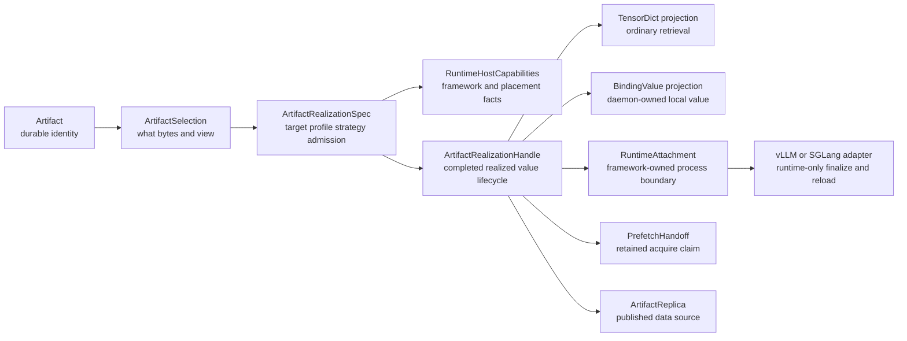

# Summary

This design defines the target model for TensorCast model-runtime realization.
The target is artifact-centered: durable identity, source selection, movement,
target planning, lifecycle, diagnostics, publication, and reuse all start from
`Artifact` and flow through one realization model.

"Serving" is not a primary TensorCast system concept in the target state. It is
one model-runtime workload profile layered on top of artifact realization.

`0121` is the companion kernel design for the realization model described here.
This document owns the artifact-centered target state; `0121` owns the shared
selection, target, strategy, representation, lifecycle, execution, and report
spine that prevents TensorDict, binding, retained prefetch, runtime attach, and
TP from becoming separate materialization systems.

The companion plan records current implementation status and migration steps.
This design intentionally describes the desired end state: direct artifact
model-runtime realization is the professional framework boundary; a separate
public serving session is not the long-term API.

The decision is:

- keep `Artifact` as the durable identity, routing, discovery, lifecycle, and
  replica-publication root;
- treat "serving" as a model-runtime workload profile, not as a second artifact
  system;
- keep `Binding` as the daemon-owned local realization boundary;
- keep `RuntimeAttachment` as the process-local framework boundary;
- make TensorDict materialization, daemon binding, model-runtime attachment,
  retained prefetch, TP/P2P, reload, and local-ready promotion converge on one
  artifact realization model;
- expose model-runtime realization through `Artifact.realize(...)` and a
  completed `ArtifactRealizationHandle`, not through a second public
  `ServingRuntimeSession` root;
- keep framework construction, tensor surface, finalize hooks, placement facts,
  source catalog, and collective behavior in a runtime host capability bundle
  outside `Artifact`;
- delete old serving-rooted public entrypoints, compatibility adapters, duplicate
  diagnostics paths, and redundant tests once the artifact-runtime replacement
  is wired; the target state must not require maintaining two materialization or
  model-runtime stacks;
- preserve the current vLLM scenario semantics, fastest compatible data path,
  retained memory-credit timing, and zero-extra-weight-residency behavior even
  when TensorCast and internal-vLLM APIs are changed incompatibly.



# Goals / Non-Goals

## Goals

- Define the canonical artifact-centered target state for the current serving
  runtime baseline.
- Reduce user-facing concepts by making artifact realization the shared path for
  TensorDict retrieval, durable load, binding, local source bootstrap, retained
  prefetch acquire, TP realization, P2P reuse, reload, and runtime replica
  publication.
- Preserve vLLM functionality and performance semantics as hard constraints,
  not compatibility accidents.
- Separate public/professional APIs from internal execution objects:
  user-facing flows should speak in artifacts, realization specs, realization
  handles, and projections; execution code may keep richer target, profile,
  binding, layout, reservation, and publication details.
- Keep device facts and framework facts out of durable artifact identity while
  still making them explicit in realization admission.
- Make P2P and TP more consistent by treating them as realization strategies
  under artifact selection, not as separate serving-only workflows.

## Non-Goals

- Do not treat `tensorcast.serving` as a compatibility boundary. It is the
  current implementation namespace and may be reshaped directly when the final
  artifact-centered model is clearer.
- Do not collapse every runtime concern into `Artifact`. Artifact is the root,
  not a god object.
- Do not make local-ready binding values durable or globally routable without an
  explicit representation publication.
- Do not let P2P imply representation conversion or TP reshaping. P2P moves
  compatible bytes; transforms remain representation contracts and realization
  plans.
- Do not preserve Python API compatibility as a requirement. Behavior, scenario
  depth, and performance-sensitive semantics are the requirements.
- Do not keep compatibility shims, aliases, or duplicate lowerings after their
  artifact-centered replacements are in use. Transitional code is allowed only
  inside a bounded migration phase tracked by the plan.
- Do not put direct Global Store access in the Python SDK.

# Relationship To The Migration Plan

The plan paired with this design owns current code status, phase tracking,
implementation gaps, and rollout order. This design should not be read as an
implementation snapshot.

The serving-runtime baseline remains important only as a regression contract:

- vLLM behavior is a regression baseline;
- runtime attachment, retained acquire, reload, runtime view, publication, and
  retirement behavior must not regress;
- serving-centered names may be renamed, absorbed, or kept internal only after
  the artifact-centered replacement preserves the same behavior;
- current implementation names do not define target terminology.

# Prior Constraints Reviewed

## Unified Artifact SDK Entrypoint (`0039`)

Kept and upgraded. `0039` now owns the public SDK entrance: users obtain or
create an `Artifact`, then realize, bind, prefetch, attach, or publish through
that root. This design extends that rule by treating TensorDict retrieval,
binding, and model-runtime attach as projections over one realization model. A
model runtime is a profiled realization of an artifact or source artifact, not a
separate serving object graph.

## Selection-first retrieval (`0078`)

Kept. `ArtifactSelection` remains the identity for what artifact/view/subset is
being materialized. Realization targets, topology, collective settings, and P2P
source choices do not replace selection identity.

## Binding model (`0084`)

Kept and narrowed. `Binding` is the local daemon-owned realization boundary. It
is not durable identity and is not automatically a global artifact replica.
Serving-specific binding values should be understood as binding-value
projections with a model-runtime profile. TensorDict retrieval should not remain
a separate fallback around binding semantics when the target state is a durable
or retained local value.

## Materialization strategy (`0108`)

Kept. Disk, P2P, typed copy, collective, and fallback lanes belong in the shared
strategy plane. The next model-runtime layer should not reimplement strategy
selection inside a serving-only branch.

## Representation contract (`0110`)

Kept. TP slicing, runtime tensor schema, layout, and semantic placement safety
must be represented by the representation contract and realization plan. P2P
may only reuse a source when the source representation is compatible with the
target member layout.

## Source-to-serving publication (`0111`)

Kept but renamed conceptually. The durable output is a published representation
artifact. The fact that vLLM uses it for serving is profile metadata and
operator intent, not a separate identity system.

## Binding-native realization (`0112`)

Kept. Same-binding local-ready realization is the correct deep primitive: source
artifact bytes are realized into a binding, framework finalize runs against the
same binding-backed tensors, and promotion to a durable artifact is explicit.

## Collective-first TP startup (`0114`)

Kept and generalized. Collective-first TP startup is a realization strategy for
a target set. It should be available through the same artifact realization
pipeline as P2P and disk load, not only through serving-local code.

## Prefetch serving binding target (`0116`)

Superseded as a standalone public serving-target design and absorbed into this
artifact-realization direction. Its retained residency and acquire-validation
semantics are kept: prefetch prepares retained daemon-owned realization, and the
serialized handoff is a retained binding claim/capability for a realization
target. It is not user-facing preload vocabulary and should not remain a
separate serving materialization family.

## Serving runtime cleanup baseline

Kept as current behavior baseline, not as an API compatibility boundary. Its
`ServingRuntimeSession`, `RuntimeAttachment`, retained acquire, runtime view,
and runtime replica publication behavior become inputs to this successor design,
and their interfaces may be changed when the replacement preserves or improves
the scenario semantics.

# Target Runtime Boundary

The target runtime boundary has one public root and two explicit layers below
it:

- `Artifact` is the durable root for identity, discovery, selection, replica
  lifecycle, and publication.
- `ArtifactRealizationSpec` expresses target kind, model-runtime profile,
  representation/admission requirements, strategy preferences, and lifecycle
  intent.
- `RuntimeHostCapabilities` is the professional framework boundary for model
  construction, tensor surface, finalize hooks, semantic probes, placement
  facts, source catalog, and collective behavior. It is an adapter capability
  bundle, not durable artifact identity.
- `ArtifactRealizationHandle` is a completed realization facade. It exposes
  only projections/actions granted by the realization lifecycle plan.
- `RuntimeAttachment` remains process-local framework state. It owns the model
  object, runtime-only tensors, reload projection, publication hooks, and close
  semantics.

The target API should not require frameworks to construct a serving-named
session. A framework integration should provide host capabilities to
`Artifact.realize(...)` and receive a completed realization handle whose
runtime-attachment projection can be stored on the framework model object.

The target design may keep implementation modules under `tensorcast.serving`
during migration. Those modules are lowerings of the artifact-runtime model, not
the public conceptual center.

# Final Module Ownership

The final shape does not require the current `tensorcast.serving` package to
disappear completely, but it does require it to become shallow. The package may
remain as an internal implementation namespace for model-serving ABI details,
builder recipes, and migration-local lowerings. It must not remain a public
source of truth for artifact identity, source selection, routing, lifecycle,
publication, or diagnostics.

| Area | Target responsibility | Must not own |
| --- | --- | --- |
| `tensorcast.api.store` / public `tensorcast` | `Artifact`, `ArtifactRealizationSpec`, `ArtifactRealizationHandle`, `ArtifactRealizationReport`, ordinary TensorDict/binding/prefetch conveniences | framework model objects, vLLM-specific placement logic, serving-session compatibility facades |
| artifact/runtime professional API | `RuntimeHostCapabilities`, `RuntimeAttachment`, runtime view/report projections, retained realization claims, publication actions | durable artifact identity, direct Global Store access, vLLM private objects |
| `tensorcast.serving` | internal serving ABI helpers, optional private lowerings, builder/publication implementation details while they remain serving-ABI-specific | public runtime session root, public locator authority, independent retained acquire model, independent diagnostics/report model |
| Store Daemon | binding values, leases, mounted-source attestation, local realization ownership, PID/session safety, device-local movement | framework construction/finalize hooks, durable metadata authority |
| Global Store | durable artifact metadata, replica metadata, coordination records, publication visibility | SDK direct control path, process-local attachment state |
| internal-vLLM `vllm.tensorcast.*` | runtime host capability construction, vLLM placement/source/collective facts, model construction/finalize hooks, reload/publication calls | TensorCast artifact selection authority, daemon lease authority, duplicate serving runtime session model |

The intended end state is one public root and one professional framework
boundary. If a serving-named object remains after migration, it must satisfy one
of these conditions:

- it is private implementation under a bounded internal module;
- it describes a true model-serving ABI payload rather than TensorCast artifact
  semantics;
- it is scheduled for deletion by the paired plan's deletion ledger.

# Decision Logic For Boundary Choices

Implementers should use the following decision sequence when adding or migrating
any runtime capability:

1. If the capability changes durable identity, artifact discovery, replica
   visibility, routing, or lifecycle, it belongs to the artifact model or
   artifact replica metadata.
2. If the capability chooses what bytes/view/subset are requested, it belongs to
   `ArtifactSelection` or a locator that resolves into an artifact selection.
3. If the capability describes where/how a selection is realized, it belongs to
   `ArtifactRealizationSpec`, `RealizationTarget`, `RealizationTargetSet`, a
   strategy plan, or a representation admission plan.
4. If the capability depends on framework construction, tensor surface,
   runtime-only tensors, finalize hooks, live EP/EPLB facts, or framework
   admission probes, it belongs to `RuntimeHostCapabilities` or
   `RuntimeAttachment`.
5. If the capability prepares a value for later acquire and memory admission, it
   belongs to `RetainedRealizationClaim` or `PrefetchHandoff`; it must not
   become a new source authority.
6. If the capability makes a realized value reusable by other daemons or future
   loads, it is an explicit publication/promote action that creates or updates
   artifact replica metadata.
7. If the only reason to keep a serving-named API is source compatibility, delete
   or internalize it after the replacement is wired. Source compatibility is not
   a design requirement.

This decision logic is intentionally stricter than "move everything from
serving to artifact." The correct target is not a large `Artifact` object. The
correct target is a small artifact root plus explicit realization specs,
handles, runtime host capabilities, retained claims, and publication actions.

# vLLM Reference Case Contract

The vLLM scenario is the reference case because it needs simple concepts at the
boundary and deep behavior behind them. The target boundary is still small:

1. select an artifact or source artifact;
2. realize it for a model-runtime target;
3. provide runtime host capabilities for construction, attach, finalize, and
   semantic admission;
4. project runtime view, reload, publication, or TensorDict results from the
   same handle.

vLLM does not need TensorCast `Artifact.tensor_dict(...)` as its steady
model-loading path. The TensorDict requirement is stronger: TensorDict must
prove the same realization semantics that runtime attach relies on. If
TensorDict remains a separate `MaterializeReplica` convenience path with
independent selection, strategy, diagnostics, lifetime, or P2P behavior,
TensorCast would keep two incompatible materialization models.

| vLLM requirement | Target contract |
| --- | --- |
| Conceptual integration surface | vLLM sees artifact selection, realization spec/handle, runtime host capabilities, `RuntimeAttachment`, and runtime view. It does not need a public serving session root. |
| TensorDict equivalence | `Artifact.tensor_dict(...)` and caller-tensor materialization are projections of the same realization model used by binding/runtime attach, with shared selection, strategy, diagnostics, and lifetime facts. |
| Retained pre-admission memory credit | A retained realization claim exposes trusted reservation bytes before vLLM model construction and validates expected member/device/layout both at credit time and acquire time. |
| Local HF/safetensors cold start | vLLM source catalog output becomes a daemon-attested mounted-source artifact subject such as `msa1:...`; no source-handle-only path bypasses artifact selection or admission. |
| Runtime model attach | vLLM owns only host capabilities: meta/runtime model construction, trace capture, runtime-only tensors, finalize hooks, tensor surface operations, and semantic probes. TensorCast owns artifact selection, binding, lifecycle, and report state. |
| Reload and publication | Runtime attachment reload and async replica publication compare active attachment or binding-value generation before replacing state or retiring stale published results. |
| EP/EPLB safety | Static semantic digests are representation/admission facts; live EP world size and EPLB maps are re-read by the framework admission hook before reload. |
| Main plus drafter models | Either model them as a target set with one reload transaction, or declare the sequential main-then-draft behavior with worker-unhealthy marking on partial failure. |

This means the TensorDict refactor is sufficient for vLLM only when it is not
just an API cleanup. It must remove semantic split-brain: the same selection
digest, source selection digest, target layout digest, strategy decision,
lifecycle capability, and realization report must be observable whether the
projection is TensorDict, binding, retained handoff, or runtime attachment.

# Performance And Memory Contract

The target API change must not add a data-plane hop. Direct
`Artifact.realize(... model_runtime ..., runtime_host=...)` is a control-plane
and ownership-boundary change over the same daemon-backed fast paths; it must
not first materialize a TensorDict, clone framework weights, or create a second
serving session that owns another binding value.

The intended weight-loading source order is compatibility-driven and explicit:

| Scenario | Required target behavior | Disallowed behavior |
| --- | --- | --- |
| Retained prefetch startup | Validate the retained realization claim before vLLM memory admission, acquire the daemon-owned binding lease, then attach the existing CUDA IPC or memfd-backed tensors. | Re-materializing the artifact, opening a second binding, or crediting memory after vLLM admission. |
| Durable artifact with local resident replica | Prefer the local replica/LIP path and return a process-visible CUDA IPC lease when representation, layout, device, and member facts match. | Falling through to disk/P2P/TensorDict because the public entrypoint changed. |
| Compatible remote replica | Use the P2P strategy only after representation, topology, member, layout, and schema compatibility checks pass. | Treating P2P as a semantic transform or silently reshaping TP/member layout. |
| Local HF/safetensors cold source | Resolve the framework source to a daemon-attested mounted-source artifact, then stream directly into the target binding/source-bound plan. | Loading a full Python state dict or full host staging buffer in normal startup. |
| Incompatible representation or target layout | Run an explicit realization transform with copy/temporary bytes reported in the resource envelope. | Generic fallback that hides the slower path or makes diagnostics indistinguishable from the fast path. |

The steady-state memory invariant is one live owner for the model weight bytes
per active runtime attachment:

- runtime attach replaces meta parameters with daemon-owned binding tensors or
  equivalent process-visible handles; it does not allocate another full set of
  PyTorch weight tensors;
- `ArtifactRealizationHandle.attachment()` is a completed-handle projection and
  must not perform another realization, session start, retained acquire, or
  CUDA IPC restore beyond binding the already-owned handle to the framework
  surface;
- runtime-only tensors, finalize-hook allocations, CUDAGraph capture, and KV
  cache remain framework-owned memory and must be reported separately from
  TensorCast weight realization bytes;
- reload may temporarily overlap old and new weight residency only when the
  chosen swap semantics require it; the overlap must be bounded, observable in
  diagnostics, and retired promptly by active-generation checks;
- compatibility shims must not keep an extra Python reference, binding handle,
  or publication lease after the artifact-runtime attachment owns the value.

Host-memory behavior follows the same rule. Normal durable, retained, and
mounted-source model-runtime startup must not construct a full Python
`dict[str, torch.Tensor]`, full safetensors state dict, or full CPU copy of the
model weights. Bounded streaming buffers, canonical-index bytes, trace/recipe
metadata, and small projection objects are allowed. The Python builder paths
that intentionally materialize serving tensors in host memory are offline/admin
workflows and are not part of normal vLLM startup.

Latency is validated by resolved strategy and stage timings, not by naming. A
successful direct artifact-runtime start should expose the selected source kind
(`local_replica`, `p2p`, `disk`, retained acquire, or explicit transform),
fallback reason, copy bytes, temporary bytes, retained bytes, direct-write
bytes, IPC-open time, attach/finalize time, and publication timing in one
artifact-realization report. A slower fallback is acceptable only when it is the
planned outcome for the resolved compatibility class.

# Concept Ownership

The next model should reduce public concepts without hiding necessary internal
state.

| Concept | Public role | Internal owner | Kept separate from |
| --- | --- | --- | --- |
| `Artifact` | Durable identity, discovery, lifecycle, replica source | Store API, daemon, Global Store | device ordinal, framework process state |
| `ArtifactSelection` | What artifact/view/subset is requested | materialization request | topology, strategy, retry policy |
| `RealizationTarget` | Where and in what representation a selection should be realized | runtime/materialization planner | durable artifact identity |
| `RealizationTargetSet` | Multi-member realization intent for TP/PP/DP groups | group realization planner | mutable key resolution |
| `ArtifactRealizationSpec` | Target, profile, representation contract, and strategy intent | SDK/runtime planner | execution attempt state |
| `ArtifactRealizationHandle` | User/professional handle for one realized value lifecycle | SDK/runtime facade | framework model internals |
| `RetainedRealizationClaim` | Serialized prefetch handoff and trusted pre-admission credit | retained lifecycle/admission | durable artifact identity |
| `TensorDictProjection` | Ordinary tensor-dict view of a realized selection | Store SDK | daemon-owned binding lifecycle |
| `RepresentationTransformContract` | Semantic tensor/layout contract | representation plane | transport source choice |
| `MaterializationStrategy` | Disk/P2P/collective/local execution choice | shared strategy plane | user-facing API naming |
| `BindingValue` | Daemon-owned local realization value | binding lifecycle | durable artifact replica until published |
| `RuntimeAttachment` | Process-local framework model attachment | runtime adapter | Global Store metadata |
| `RuntimeHostCapabilities` | vLLM/SGLang-specific construction, tensor surface, placement, source, collective, finalize, and semantic hooks | integration layer | Artifact core |
| `RuntimeAdmissionFacts` | Live framework/device/rank facts checked before attach or reload | integration host/admission | artifact key or durable replica identity |
| `ArtifactReplica` | Published data source for future loads/P2P | artifact lifecycle | local-ready binding values |

`Serving` should remain only as one model-runtime profile where useful:

- acceptable as package namespace during migration;
- acceptable in profile names such as `serving_abi_version` when the payload is
  specifically the model-serving runtime ABI;
- not acceptable as a second root for artifact identity, source discovery,
  P2P routing, or publication.

# Proposed Architecture

## Artifact realization request

The long-term public shape should be artifact-centered:

```python
artifact = tc.artifact(key="model:qwen:runtime:tp8")

realization = artifact.realize(
    spec=tc.ArtifactRealizationSpec.model_runtime(
        framework="vllm",
        device="cuda:0",
        topology=topology,
        member=member,
        adapter_version="...",
        runtime_abi_version="...",
    ),
    runtime_host=vllm_host,
)

attachment = realization.attachment()
```

This is the target professional model-runtime API. `Artifact.realize(...)`
executes realization and runtime attachment through the supplied runtime host
capabilities. The returned `ArtifactRealizationHandle` is already complete; it
does not represent a pending second attach step. `attachment()` is the preferred
projection name for the process-local `RuntimeAttachment`. If an `attach(...)`
method is kept for ergonomics, it is a projection/delegation over the completed
realization, not the operation that performs realization.

The target rules are:

- users start from `Artifact`;
- one realization spec expresses target, profile, strategy, and admission
  intent;
- framework-specific construction, tensor surface, placement, source, collective,
  finalize, and semantic hooks enter through runtime host capabilities;
- `Artifact.realize(...)` returns a completed realization handle, not directly a
  framework attachment and not an unexecuted plan;
- TensorDict, Binding, RuntimeAttachment, retained handoff, and publication are
  projections or actions of that handle;
- current `tensorcast.serving.runtime` APIs may be reshaped directly toward this
  model because source compatibility is not a goal.

Ordinary retrieval already uses this path:

```python
tensors = tc.artifact(key="model:qwen:weights").realize(
    spec=tc.ArtifactRealizationSpec.tensor_dict(device="cuda:0")
).tensor_dict()

binding = tc.artifact(key="model:qwen:weights").realize(
    spec=tc.ArtifactRealizationSpec.binding(device="cuda:0", mapping=copy_plan)
).binding()
```

The existing `artifact.tensor_dict(...)`, `artifact.tensor_dict_into(...)`,
`artifact.tensor_into(...)`, `artifact.bind(...)`, and `artifact.bind_into(...)`
methods remain as convenience forms and now lower into this model. They should
stay thin wrappers and must not regain independent materialization architecture.

## Realization handle and projections

The public/professional result is a single `ArtifactRealizationHandle` with
explicit projections:

| Projection/action | Meaning |
| --- | --- |
| `tensor_dict()` | Return ordinary TensorDict materialization for the realized selection |
| `binding()` | Return or expose the daemon-owned local binding value |
| `attachment()` | Return the framework-owned `RuntimeAttachment` created by model-runtime realization |
| `prefetch_handoff()` | Return a retained realization claim for later acquire |
| `publish_replica(...)` | Publish an artifact-backed replica when the realized value is eligible |
| `promote(...)` | Enter explicit representation publication for local-ready values |

This keeps `Artifact` small while preventing TensorDict, binding, retained
prefetch, and model-runtime attach from becoming parallel top-level concepts.

## Startup paths under one model

All startup and retrieval paths are target kinds or lifecycle policies under
artifact realization:

| Path | Artifact-centered meaning |
| --- | --- |
| `tensor_dict` / `tensor_dict_into` / `tensor_into` | Realize an artifact selection into a TensorDict or caller-tensor projection |
| `bind` / `bind_into` | Realize an artifact selection into a daemon-owned or adopted binding projection |
| `prefetch(device=...)` | Prepare a retained replica through async realization |
| `prefetch(target=...)` | Prepare retained binding or target-set handoff |
| durable artifact startup | Realize a durable representation artifact into a runtime binding and runtime attachment |
| local source bootstrap | Normalize local source into a mounted-source artifact, then realize into target binding |
| retained acquire startup | Attach to a retained realization prepared by artifact prefetch |
| model-runtime startup | Realize an artifact selection through runtime host capabilities and project a `RuntimeAttachment` |

The internal plans remain explicit. The change is that they are variants under
artifact realization, not serving lifecycle branches or TensorDict-specific
fallback paths.

## TP as target-set realization

TP should be represented as a `RealizationTargetSet`:

- each member has stable topology/member identity;
- each member has a target layout and representation contract;
- source reuse and collective execution are planned for the set;
- same-node collective-first is a strategy, not a separate serving feature;
- P2P direct member copy is allowed only when representation, topology, member,
  layout, and schema are compatible.

This keeps TP deep without making TP a special user-facing artifact type.

## P2P as compatible replica movement

P2P remains a data-plane source strategy:

- source selection consumes `ArtifactSelection` and compatible replica metadata;
- P2P never converts TP size, tensor schema, or semantic placement;
- mismatched representation requires a realization plan or transform executor;
- runtime-published replicas are ordinary artifact replicas only after explicit
  publication and correct metadata registration.

## Retained prefetch as retained realization

The retained acquire payload should be treated as a serialized retained
realization claim:

- reservation capability;
- trusted reservation bytes visible before framework memory admission;
- daemon/session/device/member facts;
- binding value ref;
- expected layout/schema/build/spec digests;
- readiness and verification state;
- optional group realization acquire facts.

Names such as `RetainedServingBindingAuthority` are acceptable only as internal
implementation names when they describe current code. The public concept should
be a retained realization handoff/claim. It authorizes an acquire; it is not a
new source of truth.

## Runtime attachment remains separate

Do not move framework model state into `Artifact`.

`RuntimeAttachment` should remain the boundary for:

- vLLM model object ownership;
- runtime-only tensor allocation and rehydration;
- finalize hooks;
- tensor invariant checks;
- after-ready publication hooks;
- reload response and weight-version projections;
- close/retire process-local lifecycle.

This is the correct separation: artifact is durable identity; attachment is
process-local runtime state.

## Framework reference flow

A vLLM implementation should be able to follow this flow without constructing a
parallel TensorDict or source subsystem:

1. Normalize `model_loader_extra_config` into artifact selection, source
   bootstrap policy, retained claim, strategy, diagnostics, and publication
   policy.
2. Before vLLM memory admission, parse any retained claim and credit only the
   trusted reservation bytes for the expected placement member.
3. Build an `ArtifactRealizationSpec.model_runtime(...)` with vLLM placement,
   target device, runtime ABI, representation policy, and adapter identity.
4. Resolve source identity through artifact selection: durable artifact for
   normal startup, or daemon-attested `msa1:` mounted-source artifact for local
   HF/safetensors bootstrap.
5. Realize through runtime host capabilities; vLLM supplies construction, trace,
   tensor surface, runtime-only tensor, finalize, placement, source, collective,
   and semantic probe hooks.
6. After vLLM readiness, publish an artifact-backed runtime replica only if the
   attachment is still the active generation.
7. On reload, re-run runtime admission, reject live EP/EPLB drift, retire or mark
   current publication state, swap the active binding value, and project the
   reload response from the new attachment.

## internal-vLLM target integration flow

internal-vLLM should become a client of the artifact-runtime professional API,
not a client of a public TensorCast serving session. The expected final flow is:

1. `model_loader_extra_config` is normalized into an artifact/runtime request:
   artifact locator or mounted-source policy, realization strategy, retained
   claim, runtime profile, diagnostics, and publication policy.
2. `vllm.tensorcast.host` builds `RuntimeHostCapabilities` from adapter,
   placement, source, collective, tensor-surface, finalize, and semantic probe
   owners.
3. Before vLLM memory admission, `memory_accounting.py` reads a neutral
   retained realization claim and credits only trusted reservation bytes for the
   expected member/device/layout.
4. Durable startup calls
   `tc.artifact(...).realize(ArtifactRealizationSpec.model_runtime(...),
   runtime_host=host)` and stores `handle.attachment()` on the vLLM model state.
5. Local HF/safetensors startup first admits the source as a daemon-attested
   `msa1:` mounted-source artifact, then uses the same model-runtime realization
   path.
6. Retained startup validates the retained claim, acquires the daemon-owned
   value, and then projects the same `RuntimeAttachment` shape as durable and
   local-source startup.
7. Reload reuses the artifact/runtime request path, re-runs live vLLM admission
   hooks, checks EP/EPLB drift, compares active generation, and swaps the active
   binding value only after validation.
8. After-ready publication, reload retirement, shutdown retirement, and
   local-ready durable promotion call artifact-runtime publication actions. They
   do not call a separate serving publication authority.

| internal-vLLM concern | Target TensorCast interaction | Decision logic |
| --- | --- | --- |
| loader startup | `Artifact.realize(... model_runtime ..., runtime_host=...)` | model loading is a realization of an artifact selection |
| placement/topology facts | `ArtifactRealizationSpec` plus runtime host admission facts | topology affects realization/admission, not artifact identity |
| source catalog | mounted-source artifact or durable artifact selection | local paths must become admitted subjects before planning |
| fast-path source selection | retained claim, local replica/LIP, P2P, disk, mounted-source, or explicit transform in the realization report | performance is a resolved strategy fact, not an API naming side effect |
| adapter/finalize/tensor surface | `RuntimeHostCapabilities` and `RuntimeAttachment` | framework-owned behavior stays out of artifact identity |
| retained memory credit | `RetainedRealizationClaim` | pre-admission reservation is a retained realization fact |
| reload/runtime view | `RuntimeAttachment` projection from completed handle | runtime state is process-local and generation-checked |
| publication/shutdown | handle or attachment publication actions with active-generation CAS | publication is artifact replica lifecycle |
| main/draft models | target-set transaction or documented sequential semantics | partial reload behavior must be explicit |

At the end of migration, internal-vLLM should not import public
`tensorcast.serving.*` session/config/retained/publication APIs for normal
startup, reload, memory accounting, runtime view, or shutdown. Any remaining
serving import must be either an internal implementation dependency with no
public contract or a serving-ABI-specific builder path with a documented owner.

# vLLM Scenario Contract

The following vLLM facts are semantic requirements, not legacy compatibility
fields.

| vLLM scenario | Must remain true after this design |
| --- | --- |
| TensorDict projection equivalence | Current vLLM does not use TensorCast TensorDict as the steady loader path, but TensorDict loads must still be projections of artifact realization and share selection, strategy, diagnostics, lifetime, and P2P semantics with binding/runtime realization |
| Local HF/safetensors cold start | Local path is normalized into a mounted-source artifact before planning; recipe/trace caches are keyed by source, model, topology, member, schema, and realization identity |
| Durable artifact startup | A locator resolves to a durable artifact; manifest and policy preflight validate schema, representation contract, serving build, topology, and readiness before attach |
| Weight-loading fast path | Direct artifact-runtime startup does not construct a TensorDict or Python state dict; it attaches daemon-owned binding tensors through the selected retained/local-replica/P2P/disk/mounted-source path |
| Retained prefetch attach | vLLM can credit trusted reservation bytes before model construction and later acquire a fresh lease for the exact member/device/layout/value |
| vLLM memory admission | Retained reservation bytes stay visible before vLLM memory admission; this timing is a behavior requirement |
| TP multi-rank load | Same-node source coordination, collective execution facts, TP ranks, rank-local target layouts, and local-ready barrier remain explicit |
| EP/EPLB reload safety | Expert placement and EPLB digests remain part of topology admission, and live EP world size/EPLB maps are checked before reload |
| Runtime-only tensors | Runtime-only tensor names, allocation, post-bind finalize, and invariant validation remain adapter-owned |
| In-place reload | Reload swaps the active binding value without reconstructing the vLLM model, and returns stable reload response projection |
| Runtime view | Weight-version and endpoint projections expose artifact ref, local ref, binding value ref, schema, contract, readiness, publication state, and failure state |
| Runtime replica publication | After-ready publication stays async, artifact-backed, active-generation checked, and explicitly retired on reload/shutdown |
| Local-ready durable promotion | Promotion from local-ready binding to durable artifact remains an explicit representation publication workflow |
| Drafter models | Main and draft model TensorCast attachments can reload through the same artifact locator path with either target-set transaction semantics or explicit sequential failure/unhealthy semantics |

The existing vLLM `model_loader_extra_config` fields should be reclassified:

| Current field family | Future classification | Keep why |
| --- | --- | --- |
| `serving.artifact_locator` | `artifact.locator` or artifact selection input | durable startup/reload identity |
| `serving.policy` | representation/artifact preflight policy | pinned manifest/build/contract safety |
| `bootstrap.*` | source artifact bootstrap and cache policy | local cold start and trace/recipe reuse |
| `materialization.collective` | realization strategy preference | TP performance and fail-closed behavior |
| `retained_binding_acquire.*` | retained realization handoff/claim | prefetch handoff and memory accounting |
| `replica_publication.*` | runtime artifact replica publication policy | P2P source creation after model ready |
| `diagnostics.*` | realization diagnostics/profile controls | operator debugging and validation |

These fields may be renamed, moved, or deleted as standalone user-facing fields,
but their semantics should not be silently removed.

# Public, Framework, And Internal APIs

## Public user API

Public APIs should stay artifact-first and small:

- `tc.artifact(...)` and `tc.from_disk(...)` remain the root.
- `ArtifactRealizationSpec`, `ArtifactRealizationHandle`, and
  `ArtifactRealizationReport` are public SDK symbols available from the same
  public package level as `Artifact`.
- `Artifact.realize(spec=...)` is the direct public/professional entrypoint for
  TensorDict, caller tensors, owned/adopted binding, mounted-source, and
  model-runtime realization.
- `Artifact.realize_async(spec=...)` is the async entrypoint for retained
  replica, retained binding, and target-set handoff where operation semantics
  are required.
- `Artifact.prefetch(...)` remains a convenience method that lowers to async
  realization while preserving `Operation[T]` status/wait/cancel behavior.
- TensorDict and binding helpers remain convenience methods because they now lower
  to `Artifact.realize(...)`.
- Publication belongs to the realization handle or binding value, not to a
  second serving-specific authority.
- Serving-rooted public entrypoints are removed or made internal once the
  artifact-centered entrypoints cover the same behavior. They are not retained as
  compatibility aliases.
- Boundary choices follow the decision logic above: artifact for durable
  identity/lifecycle, spec/target/strategy for realization intent, runtime host
  capabilities for framework facts, retained claims for prefetch acquire, and
  publication actions for reusable replicas.

## Framework integration API

Frameworks such as vLLM and SGLang need a professional API that is more
explicit than the public API:

- `RuntimeHostCapabilities` for model construction, tensor surface, finalize
  hooks, semantic probes, placement facts, source catalog, source coordination,
  and collective behavior;
- `ArtifactRealizationSpec.model_runtime(...)` fields for framework identity,
  ABI, topology/member facts, and adapter identity;
- `ArtifactRealizationHandle` for completed projection, acquire,
  runtime-attachment projection, release-contract, promotion, and publication
  actions;
- retained realization claim semantics for pre-admission trusted reservation
  credit and acquire validation;
- `RuntimeAttachment` for process-local state and close/reload/publication
  projection;
- framework admission hooks for live runtime facts that cannot be durable
  artifact identity, such as EP/EPLB reload checks;
- `RuntimeView` for operator and framework response payloads.

This layer should be stable enough for vLLM/SGLang maintainers but should not
expose private lifecycle helpers as a broad compatibility facade.

## Internal execution objects

Internal objects can stay rich:

- `ServingBindingPlan` or its successor realization-plan identity;
- resolved spec cache entries;
- binding layout ids and binding value refs;
- reservation capabilities and lease tokens;
- group realization acquire refs;
- materialization diagnostics;
- publication projections.

These objects should not become the everyday user API.

# Naming And API Direction

The following names are the preferred long-term conceptual direction. They do
not require compatibility aliases; the implementation may rename or reshape the
current serving-runtime interfaces directly once the vLLM scenario matrix is
covered. When a replacement is wired and tested, the old public name should be
deleted or narrowed to an internal implementation name; it should not remain as a
parallel compatibility path.

| Current name | Future direction | Rationale |
| --- | --- | --- |
| `ServingRuntimeSession` | removed as a public root; internal lifecycle lowering only if still useful | public runtime entry starts at `Artifact.realize(...)` |
| `ServingArtifactLocator` | `ArtifactLocator` or `ArtifactSelectionLocator` | locator resolves artifact identity |
| `ServingBindingTarget` | `RealizationTarget` or fields inside `ArtifactRealizationSpec` | target is runtime/layout intent |
| `ServingBindingPlan` | `ArtifactRealizationPlan` for public docs; internal name may remain | plan identity covers source, target, transform, cache, and layout |
| `PrefetchedServingBinding` | `PrefetchHandoff` or `RetainedRealizationClaim` | serialized acquire capability, not a tensor handle |
| `RetainedServingBindingAuthority` | `RetainedRealizationClaim` internally, `PrefetchHandoff` publicly | serialized acquire capability, not authority of truth |
| `ServingRuntimeAttachment` | `RuntimeAttachment` | already generalized in current code |
| `ServingRealizationReport` | `ArtifactRealizationReport` | report is not serving-only |
| `ServingArtifactManifest` | `RuntimeRepresentationManifest` unless the payload is truly serving ABI-specific | durable representation metadata should not be serving-rooted |
| `serving_build_digest` | `runtime_build_digest` or `representation_build_digest` unless tied to serving ABI | build identity belongs to representation/runtime profile |

Do not perform a broad rename first. Names should follow behavior ownership.
Migrate once the vLLM scenario matrix is covered by tests and docs, then remove
the old public surface in the same cleanup window.

# Naming Compliance

Any new Python API proposed here must follow repository style. This is the
target naming model, not an implementation-status table:

| Symbol | Target role | Kind | Required style | Notes |
| --- | --- | --- | --- | --- |
| `ArtifactRealizationSpec` | public target intent DTO | Python class | `PascalCase` | includes model-runtime target/profile/admission intent |
| `ArtifactRealizationHandle` | public/professional completed realization facade | Python class | `PascalCase` | projection and lifecycle actions only |
| `ArtifactRealizationReport` | public/professional report DTO | Python class | `PascalCase` | shared diagnostics and lifecycle report |
| `ResolvedArtifactSelection` | internal/professional resolver result | Python class | `PascalCase` | canonical selection facts |
| `RealizationTargetPlan` | internal/professional target-plan identity | Python class | `PascalCase` | target layout/profile facts |
| `RealizationStrategyPlan` | internal/professional strategy facts | Python class | `PascalCase` | source/P2P/disk/collective/fallback policy |
| `RepresentationAdmissionPlan` | internal/professional compatibility facts | Python class | `PascalCase` | representation/schema/layout admission |
| `RealizationLifecyclePlan` | internal/professional lifecycle facts | Python class | `PascalCase` | retained/current/publishable/release capability |
| `RealizationResourceEnvelope` | report/plan envelope | Python class | `PascalCase` | backing/export/projection/owner/cost model |
| `RealizationReleaseContract` | release action contract | Python class | `PascalCase` | idempotent cleanup and ownership transfer |
| `RealizationModelRuntimeReport` | model-runtime report payload | Python class | `PascalCase` | framework/profile report |
| `RealizationMountedSourceReport` | mounted-source report payload | Python class | `PascalCase` | `msa1:` promotion report payload |
| `RealizationPublicationReport` | runtime publication report payload | Python class | `PascalCase` | publication state and generation facts |
| `RuntimeHostCapabilities` | professional framework capability bundle | Python class/protocol | `PascalCase` | successor name for host capability surface |
| `RuntimeAttachment` | process-local framework boundary | Python class | `PascalCase` | owns model object state and close/reload projection |
| `Artifact.realize` | primary realization method | Python method | `snake_case` | direct model-runtime lowering is required in target state |
| `Artifact.realize_async` | async retained realization method | Python method | `snake_case` | retained operation targets |
| `Artifact.prefetch` | convenience wrapper over async realization | Python method | `snake_case` | must stay a thin facade |
| `ArtifactRealizationHandle.attachment` | runtime attachment projection | Python method | `snake_case` | preferred completed-handle projection |
| `publish_replica` | publication action naming | Python function/method | `snake_case` | binding/handle publication action |
| `retire_replica` | publication retirement naming | Python function/method | `snake_case` | publication cleanup action |
| `ModelRuntimeProfile` | optional public profile DTO | Python class | `PascalCase` | add only if profile fields do not fit `ArtifactRealizationSpec` |
| `RetainedRealizationClaim` | retained handoff naming | Python class | `PascalCase` | successor for retained serving authority semantics |
| `PrefetchHandoff` | optional ergonomic retained result name | Python class | `PascalCase` | public handoff name if retained result types are renamed |

# Error Model And Invariants

- Startup planning must resolve exactly one plan. Ambiguous retained acquire,
  durable artifact bind, and source bootstrap combinations fail before GPU
  allocation.
- Retained realization claims must expose trusted reservation bytes before
  framework memory admission and must validate member/device/layout before both
  credit and acquire.
- TensorDict retrieval, binding, retained prefetch, and model-runtime attach must
  build the same resolved `ArtifactSelection` for the same artifact/view/subset.
- Model-runtime realization must not lower through a TensorDict projection or
  Python state-dict materialization in normal startup; TensorDict is an
  equivalence projection, not an intermediate weight-loading buffer.
- No target kind may keep an independent selection, fallback, lifecycle,
  diagnostics, publication, or cleanup path once the shared realization lowering
  exists.
- Artifact locator resolution must happen through the daemon-backed SDK path,
  not direct Global Store calls.
- Source bootstrap must resolve to a daemon-attested mounted-source artifact or a
  durable artifact subject before realization planning.
- A local-ready binding value is not a durable artifact and is not eligible for
  cross-daemon P2P until explicit publication.
- A runtime-published replica must be artifact-backed and tied to the active
  binding value generation.
- Reload must reject active publication states that would make source ownership
  ambiguous.
- Steady-state runtime attachment must have one TensorCast-owned weight
  residency per active model. Any reload overlap must be explicit, bounded,
  reported, and retired through active-generation checks.
- Extra full-weight `torch.clone`, `.to(...)`, `.copy_(...)`, or host state-dict
  staging is allowed only for an explicit realization transform or offline
  builder workflow, and the report must account for the copy or temporary bytes.
- Source selection diagnostics must distinguish local replica/LIP, retained
  acquire, P2P, disk, mounted-source, direct-write, and fallback paths.
- P2P source reuse must validate representation/layout/schema/member
  compatibility before data movement.
- Device ordinal, CUDA UUID, daemon session, lease token, and process id are
  runtime facts. They must not become durable artifact identity.
- EP/EPLB semantic placement digests and live EP/EPLB framework facts must
  participate in reload admission.
- Main/draft TensorCast reload must declare either target-set transaction
  semantics or explicit sequential failure/unhealthy semantics.
- Unexpected runtime state should fail clearly rather than falling back to a
  slower or less precise path.
- Compatibility aliases and adapter shims must have an owner, deletion trigger,
  and test proving the replacement path. Unbounded compatibility code is a
  design violation.

# Architecture Risks

## Risk: Artifact becomes too broad

If every serving/runtime concern is placed directly on `Artifact`, the class
will mix durable identity, device placement, framework state, publication,
leases, and runtime hooks. That would make the public API simpler in name but
less coherent in behavior.

Mitigation: artifact owns durable identity and lifecycle. A realization spec and
realization handle own target/profile/strategy, projection, and publication
actions. Bindings and attachments remain separate realized projections.

## Risk: TensorDict remains a second materialization system

TensorDict APIs are the easiest path for users and tests, so they can silently
remain outside the model-runtime realization work. That would preserve two
loading systems: TensorDict materialization and binding/runtime realization.

Mitigation: make TensorDict a first-class projection of artifact realization.
Convenience methods may remain, but tests and docs should assert that selection,
source strategy, diagnostics, and P2P compatibility flow through the same
realization model.

## Risk: Runtime facts pollute durable identity

vLLM needs device UUIDs, ranks, daemon sessions, reservations, and topology
digests. These are necessary, but they are realization/admission facts, not
artifact identity.

Mitigation: keep them in target/profile/admission/claim payloads and preserve
artifact identity as artifact id plus selection/representation metadata.

## Risk: P2P hides representation conversion

Direct P2P between serving workers is attractive, but TP4-to-TP8 or EP/EPLB
layout changes are semantic transforms, not byte-copy choices.

Mitigation: direct P2P only for compatible representation and member layout.
Otherwise use a representation transform or realization plan.

## Risk: vLLM memory accounting regresses

Retained reservation bytes are credited before vLLM model construction. Moving
this under a later runtime attachment API would be too late.

Mitigation: retained realization claims must expose trusted reservation bytes
before admission, with member validation.

## Risk: Weight loading falls off the fast path

The artifact-runtime API could accidentally become a wrapper around TensorDict
materialization or a second serving session. That would add IPC-open work,
Python tensor projection objects, possible extra references, and sometimes
full-weight-copy latency.

Mitigation: direct model-runtime realization must lower to binding, retained,
local-replica/LIP, P2P, disk, and mounted-source daemon paths directly. Tests
and profile events must assert selected source kind, fallback reason, copy
bytes, temporary bytes, and attach timing for retained, local replica, P2P,
disk, mounted-source, and explicit-transform cases.

## Risk: Hidden memory duplication

During migration, old serving compatibility wrappers can retain a binding
handle while the new artifact-runtime attachment owns the replacement. Reload
can also double-reside weights longer than necessary if active-generation
retirement is not enforced.

Mitigation: completed-handle projection must transfer or share ownership
exactly once. Normal startup must not keep both `ServingRuntimeSession` state
and artifact-runtime state as live owners. Reload overlap must be bounded by the
declared swap semantics and reported in the realization resource envelope.

## Risk: Simplification removes real scenario depth

Many current vLLM fields look like compatibility baggage but encode real timing,
placement, or safety semantics.

Mitigation: classify every field before removal. Remove names only after the
semantic replacement exists and is wired into vLLM.

## Risk: Two stacks drift after migration

Keeping serving-session entrypoints, retained-serving handoffs, publication
helpers, and artifact-runtime entrypoints alive as peers would recreate the
split-brain this design is meant to remove. The two stacks would accumulate
different fallback behavior, report fields, cleanup rules, and race handling.

Mitigation: migration is delete-forward. Each replacement must name the old
entrypoints it absorbs, the guardrail tests that prove equivalent behavior, and
the cleanup commit that removes or internalizes the old public surface.

## Risk: Serving module stays deep

If `tensorcast.serving` remains the place where public config, sessions,
retained acquire, publication, reports, and diagnostics are all defined, the
system will still be serving-centered even if `Artifact.realize(...)` exists.

Mitigation: final ownership is shallow. `tensorcast.serving` may contain private
lowerings and serving-ABI-specific builder helpers, but normal startup, reload,
retained credit, runtime view, and publication flow through the artifact-runtime
professional API.

# Design Commitments

No source compatibility guarantee is required. The target state is a single
artifact-realization stack:

1. TensorDict, caller tensors, binding, retained prefetch, target sets, mounted
   source, runtime attachment, model-runtime reports, and publication all lower
   through one artifact realization model.
2. Direct model-runtime realization is reached from `Artifact.realize(...)` with
   runtime host capabilities, not from a public serving session.
3. Compatibility layers are temporary migration tools, not accepted target-state
   architecture.
4. Serving-centered names survive only when they describe an internal module,
   implementation detail, or model-serving ABI field more precisely than the
   artifact/runtime vocabulary.
5. Execution decisions follow the boundary decision logic in this design; when
   a concept could live in multiple places, choose the owner that matches the
   durable identity, realization intent, runtime host, retained claim, or
   publication responsibility.

# Acceptance Criteria

- A design and plan exist for the artifact-centered model-runtime direction;
  this design defines the target state and the paired plan tracks migration from
  current code.
- `ArtifactRealizationSpec`, `ArtifactRealizationHandle`, and
  `ArtifactRealizationReport` are public SDK symbols at the same API level as
  `Artifact`.
- Direct public/professional model-runtime realization enters through
  `Artifact.realize(ArtifactRealizationSpec.model_runtime(...), runtime_host=...)`
  or an equivalent artifact-rooted signature.
- `ArtifactRealizationHandle` is a completed-value facade; runtime attachment is
  a projection/action on that completed handle, not a second execution path.
- The vLLM scenario matrix in this design is treated as a required migration
  checklist.
- The vLLM reference case is feasible without a vLLM-owned parallel TensorDict,
  source, or control path.
- Durable artifact bind, local source bootstrap, retained prefetch acquire, TP
  local-ready realization, TensorDict retrieval, P2P reuse, in-place reload,
  runtime replica publication, shutdown retirement, and local-ready durable
  promotion all have an artifact-centered explanation.
- TensorDict, Binding, RuntimeAttachment, retained prefetch handoff, and artifact
  replica publication are projections or actions of one realization model, not
  parallel user-facing source authorities.
- Old serving-rooted public runtime entrypoints, compatibility wrappers,
  duplicate diagnostics, and redundant tests are removed or internalized once the
  artifact-centered replacement covers the behavior.
- The final `tensorcast.serving` module is shallow: normal startup, reload,
  retained memory credit, runtime view, and shutdown/publication do not require
  public serving-session/config/retained/publication APIs.
- internal-vLLM normal paths use the direct artifact-runtime API and runtime
  host capabilities; remaining serving imports are private implementation or
  serving-ABI-specific builder paths with owners.
- Retained pre-admission credit, mounted-source bootstrap, active-generation
  publication, live EP/EPLB reload checks, and main/draft reload semantics are
  covered as vLLM migration constraints.
- Retained startup applies trusted reservation credit before vLLM memory
  admission, then acquires and attaches the existing daemon-owned value without
  re-materializing the weights.
- Durable and mounted-source model-runtime startup reports the expected fast
  source (`local_replica`, `p2p`, `disk`, mounted source/direct write, or
  explicit transform) and does not go through TensorDict or a Python state-dict
  intermediate.
- Steady-state GPU and host memory accounting shows no additional full-weight
  residency beyond the active TensorCast binding/attachment, framework
  runtime-only tensors, and explicitly reported reload overlap.
- Direct artifact-runtime startup and reload expose per-stage timing and
  resource-envelope diagnostics sufficient to catch added control-plane hops,
  copy bytes, temporary bytes, and fallback latency.
- No design path requires direct Python SDK Global Store access.
- Device and framework facts remain realization/admission/runtime facts, not
  durable artifact identity.
- P2P remains a compatible-byte transport strategy, not a transform system.
- A future SGLang integration can reuse the same artifact realization/profile
  model without inheriting vLLM-specific public names.

# Schema Changes

No durable metadata schema change is required by this design alone. Later
implementation work may still change Python DTOs or proto wire messages if
`ServingBindingTarget`, retained binding results, runtime-view projections, or
representation manifests are renamed or generalized. Such changes should be
treated as API/schema changes for implementation review, but they should not add
a second durable metadata authority. When such changes replace serving-rooted
wire or Python DTOs, the old public DTOs should be deleted or made internal in
the same migration window instead of kept as permanent compatibility aliases.

# References

- `docs/designs/0039-artifact-first-sdk.md`
- `docs/designs/0078-selection-first-artifact-retrieval.md`
- `docs/designs/0084-binding-unified-model-and-contract.md`
- `docs/designs/0108-tensor-aware-materialization-strategy-plane.md`
- `docs/designs/0110-artifact-representation-contract-and-transform-unification.md`
- `docs/designs/0111-source-to-serving-builder-and-representation-publication.md`
- `docs/designs/0112-binding-native-serving-realization-and-publication.md`
- `docs/designs/0114-collective-first-binding-realization-for-tp-serving-startup.md`
- `docs/designs/0116-prefetch-serving-binding-target.md`
- `docs/architecture/p2p-transfer-strategies.md`
- `/data/workspace/internal-vllm/vllm/tensorcast/loader.py`
- `/data/workspace/internal-vllm/vllm/tensorcast/placement.py`
- `/data/workspace/internal-vllm/vllm/tensorcast/source.py`
- `/data/workspace/internal-vllm/vllm/tensorcast/collective.py`
- `/data/workspace/internal-vllm/vllm/tensorcast/adapter.py`
- `/data/workspace/internal-vllm/vllm/model_executor/model_loader/memory_accounting.py`
- `/data/workspace/internal-vllm/vllm/v1/worker/gpu_model_runner.py`
