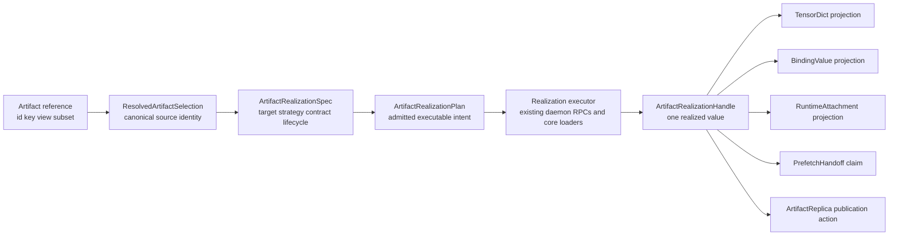
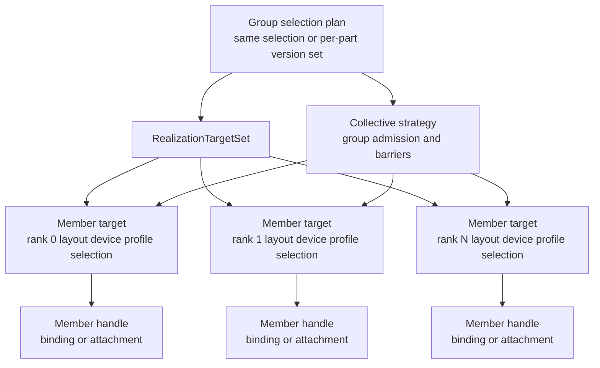

# Summary

`0120` defines the product and architecture direction: TensorCast should be
artifact-centered, and TensorDict retrieval, binding, retained prefetch,
runtime attach, P2P reuse, reload, and TP startup should all be forms of
artifact realization.

This design defines the kernel that makes that direction enforceable. The
kernel is a single planning and execution spine:



The decision is:

- every path that moves artifact bytes into process-visible tensors,
  caller-owned tensors, daemon-owned bindings, retained replicas, runtime
  attachments, or TP member targets must lower through this kernel;
- TensorDict, binding, retained prefetch, runtime attach, and TP are target
  kinds, projections, strategies, or lifecycle policies, not separate
  materialization systems;
- every completed realization is normalized as one internal resource envelope:
  selected artifact bytes, target backing, export carrier, user projection,
  release policy, and cost accounting;
- new functionality may add a target kind, representation contract, or strategy
  policy, but must not add independent selection, lifecycle, fallback, or
  diagnostics logic;
- existing daemon RPCs may remain separate implementation lowerings while they
  share the same kernel-owned plan facts, but redundant compatibility fields
  should be reserved once callers use the canonical response fields. The kernel
  is the source of truth above those lowerings.

# Goals / Non-Goals

## Goals

- Eliminate TensorDict split-brain by making TensorDict retrieval a projection
  of the same realization handle used by binding and runtime attach.
- Use one canonical selection resolver for artifact id/key, view, subset,
  mapping, view index bytes, logical layout hash, and generation hints.
- Use one target planner for ephemeral TensorDict, caller-owned tensors,
  daemon-owned binding, adopted-region binding, retained replica, model runtime,
  and TP target sets.
- Use one strategy planner for source policy, P2P, disk, collective execution,
  verification, deadlines, retry, and explicit fallback behavior.
- Use one lifecycle model for ephemeral values, borrowed caller targets,
  retained daemon state, binding current values, staged group values, and
  publishable replicas.
- Use one resource envelope for backing allocation, export carrier, projection
  owner, release policy, mutability, and movement cost across TensorDict,
  caller-tensor, binding, retained, runtime, and target-set paths.
- Use one report model so operators see the same source, layout, selection,
  timing, generation, retry, verification, and publishability facts regardless
  of which projection the user requested.
- Converge directly to the target-state realization model. Existing source/API
  compatibility is not a constraint, and old compatibility paths should be
  deleted rather than kept as parallel maintenance surfaces.
- Support TP and future runtimes as target-set realization, not as separate
  serving or framework-specific loaders.

## Non-Goals

- Do not make `Binding` the universal implementation of every retrieval. CPU
  and ephemeral TensorDict reads remain valid targets with lighter lifecycle.
- Do not collapse all daemon RPCs in the first migration. `MaterializeReplica`,
  `MaterializeIntoTarget`, `CreateOwnedBinding`, `PrefetchServingBinding`, and
  publication RPCs may remain lowerings from the shared plan.
- Do not treat Python source compatibility as a constraint. Functional behavior,
  correctness, diagnostics, and performance-sensitive timing are the constraints.
  Do not keep compatibility shims or dual old/new code paths once a target-state
  realization path exists.
- Do not move framework model objects, CUDA process-local handles, or adapter
  state into durable artifact identity.
- Do not allow direct Global Store access from the Python SDK.

# Relationship To `0120`

`0120` is the umbrella architecture. It decides that TensorCast should expose an
artifact-centered realization model rather than a serving-centered object graph.
This design is the implementation contract for that architecture.

The boundary is:

- `0120` owns the long-term user and system vocabulary: `Artifact`,
  `ArtifactRealizationSpec`, `ArtifactRealizationHandle`, projections,
  retained handoff, runtime attachment, and artifact replica publication.
- `0121` owns the shared kernel: canonical selection resolution, target
  planning, strategy planning, representation admission, lifecycle capability,
  execution lowering, report shape, and anti-split-brain tests.

Future designs should extend `0120` when they change the artifact-centered user
model. They should extend this design when they add a target kind, strategy
policy, lifecycle capability, or execution lowering.

# Problem Statement

The current code already has most of the right primitives, but they are wired
through parallel paths.

TensorDict retrieval uses `Artifact.tensor_dict(...)`,
`tensor_dict_with_diagnostics(...)`, `MaterializationPipeline.materialize_subset`
and `MaterializeReplica`. It produces a `MaterializationPayload` and then a
Python tensor dictionary.

Binding paths use `Artifact.bind(...)`, `bind_into(...)`, owned or adopted
target layout planning, `CreateOwnedBinding` or `MaterializeIntoTarget`, and
then `Binding.current_value`, `swap`, `publish_replica`, and runtime attach
operations.

Retained prefetch and local-ready serving add more paths: retained binding
handoff, source-to-binding realization, runtime attachment, group realization,
and publishability checks.

These paths repeat the same decisions:

| Decision | TensorDict path today | Binding/runtime path today | Split-brain risk |
| --- | --- | --- | --- |
| Source selection | View/subset inputs and `_build_artifact_selection` | Owner/region selection builders | Same user request can produce different selection identity |
| Target layout | Temporary payload descriptors or region-backed copy | Binding layout, target layout, current value | Layout compatibility may be enforced differently |
| Source strategy | Retrieval options, P2P/disk policy, retry | Source policy and binding RPC behavior | P2P/fallback semantics can diverge |
| Lifecycle | Payload lease and release | Binding value, staged/current, retained claims | Publish and cleanup capability may be ambiguous |
| Diagnostics | `MaterializationDiagnostics` | Binding/materialization execution diagnostics | Operators cannot compare paths reliably |

The issue is not that TensorDict exists. The issue is that TensorDict can remain
a second materialization authority. The kernel makes it a target/projection
under one authority.

The same applies to resource management. Today, TensorDict payloads,
`get_into` temporary payloads, region-backed writes, owned bindings, adopted
bindings, retained claims, and runtime attachments each carry their own small
lifecycle protocol. Some of those protocols already share real implementation
pieces, such as C++ tensor deleters, handle leases, placement leases,
`BodyBackingManager`, `LifecycleKernel`, and source-bound execution reports.
`0121` must lift those pieces into a common contract so that target-specific
paths become strategies over the same resource envelope rather than separate
owners of memory, export handles, and cleanup.

# Prior Constraints Reviewed

## Unified Artifact SDK Entrypoint (`0039`)

Kept and upgraded. The public SDK root is `Artifact`: durable identity, routing,
publication, lifecycle, discovery, and every user-facing realization flow start
there. This design strengthens the rule by requiring all byte movement from
artifacts to lower through the shared artifact realization kernel.

## Selection-first retrieval (`0078`)

Kept and made stricter. `ArtifactSelection` is the canonical description of
which durable bytes, view, subset, and logical layout are being realized. Target
topology, framework facts, CUDA device facts, and lifecycle policy do not
replace selection identity.

## Binding model (`0084`)

Kept and narrowed. `Binding` is the daemon-owned local value boundary. It is not
the universal retrieval abstraction and not durable identity. The kernel decides
when a realized value has binding capabilities.

## Programmable framework (`0055`)

Kept. Long-tail and daemon-owned warm workflows use the public `Operation[T]`
continuation model for status, wait, cancel, timeout, and idempotent
resubmission. The realization kernel must not introduce a second operation-like
handle. `ArtifactRealizationHandle` is a completed realization facade;
asynchronous submission returns `Operation[ArtifactRealizationHandle]` or an
existing family result such as `Operation[PrefetchedReplica]` during migration.

## Strategy plane (`0108`)

Kept. P2P, disk, retry, verification, collective execution, and fallback policy
are strategy-plane decisions attached to a realization plan. They must not be
embedded independently in TensorDict, binding, prefetch, or runtime paths.

## Representation contract (`0110`)

Kept. P2P moves compatible bytes. Representation conversion, TP reshaping,
runtime-only tensors, and local-ready promotion require explicit representation
contracts or transform plans.

## Trusted mounted sources (`0115`)

Kept and absorbed. `PublicDiskSourceHandle` is not a permanent source-authority
escape hatch. Successful trusted mounted-source resolution should produce a
daemon-attested mounted-source artifact profile with an `msa1:` artifact id,
canonical index bytes, generation, and policy evidence. Realization consumes that
mounted source through `ResolvedArtifactSelection` like other artifact profiles,
while preserving its narrower same-daemon, non-Global-Store authority.

## Collective-first TP (`0114`) and group transaction (`0117`)

Kept and generalized. TP is target-set realization with group admission,
member-local targets, collective strategy, staged values where needed, and a
group report. It is not a separate TP loader.

## Retained serving prefetch (`0116`)

Superseded as a standalone public serving-target design, but kept as the
retained residency and acquire-validation record. Its lasting semantics become
retained realization lifecycle and report behavior: daemon-owned residency,
reservation bytes, worker acquire capability, fresh leases, TTL/idle retirement,
status/debug visibility, and fail-closed transform-required behavior.

## Current serving runtime baseline

Kept as the current runtime-attachment behavior baseline. vLLM migration,
runtime attach, reload admission, publication, and shutdown retirement behavior
must be preserved while their lowerings move behind the realization kernel.

## Artifact-centered model runtime (`0120`)

This design implements the kernel implied by `0120`. If a future change cannot
be expressed as a realization target, strategy, contract, lifecycle, projection,
or publication action, that change must document why the artifact realization
model is insufficient.

# Architecture & Interfaces

## Kernel Components

The kernel has six internal layers. Each layer has one owner and one result
object. Public APIs may expose fewer names, but implementation paths must not
bypass these layers.

| Layer | Result | Responsibility |
| --- | --- | --- |
| Selection resolution | `ResolvedArtifactSelection` | Resolve artifact id/key, canonical index, view/subset, view index, layout hash, generation hints, and protobuf `ArtifactSelection` |
| Target planning | `RealizationTargetPlan` | Describe where bytes land: TensorDict, caller tensors, binding, retained replica, runtime attachment, or target set |
| Strategy planning | `RealizationStrategyPlan` | Describe source policy, P2P/disk preference, collective behavior, verification, retry, deadline, and explicit fallback |
| Representation admission | `RepresentationAdmissionPlan` | Validate layout/schema/member compatibility or attach a transform plan |
| Lifecycle planning | `RealizationLifecyclePlan` | Decide capabilities: ephemeral, borrowed, retained, binding current value, staged group value, publishable |
| Execution lowering | `ArtifactRealizationPlan` | Produce the admitted executable plan and lower it to existing daemon/core calls |

`ArtifactRealizationHandle` is the result facade. It exposes only capabilities
granted by the lifecycle plan.

The target, strategy, representation, and lifecycle layers jointly produce one
internal `RealizationResourceEnvelope`. The envelope is not a second public API.
It is the normalized record carried by the plan, handle, report, and daemon
lowering adapters so every path answers the same questions:

- which backing allocation or retained body owns the bytes;
- whether the caller receives a CUDA IPC export, CPU memfd export, direct-write
  completion, binding value, retained claim, or runtime attachment;
- which object owns release of export leases, placement leases, target-region
  registrations, and temporary replicas;
- which bytes were mapped, copied, directly written, retained, or published.

## Draft API Shape

The long-term public shape includes both an explicit realization API and
ergonomic artifact methods. The ergonomic methods are not compatibility shims;
they are first-class public entrypoints that lower directly to the same
target-state realization kernel.

```python
realization = artifact.realize(
    tc.ArtifactRealizationSpec.tensor_dict(device="cuda:0")
)
tensors = realization.tensor_dict()

realization = artifact.realize(
    tc.ArtifactRealizationSpec.binding(device="cuda:0", layout=layout)
)
binding = realization.binding()

tensors = artifact.tensor_dict(device="cuda:0")
binding = artifact.bind(device="cuda:0", layout=layout)
```

Ergonomic artifact methods have required lowerings:

| Public method | Required lowering |
| --- | --- |
| `Artifact.tensor_dict(...)` | `realize(ArtifactRealizationSpec.tensor_dict(...)).tensor_dict()` |
| `Artifact.tensor_dict_into(...)` | `realize(ArtifactRealizationSpec.caller_tensors(...)).complete()` |
| `Artifact.bind(...)` | `realize(ArtifactRealizationSpec.binding(...)).binding()` |
| `Artifact.bind_into(...)` | `realize(ArtifactRealizationSpec.adopted_binding(...)).binding()` |
| `Artifact.prefetch(device=...)` | `realize_async(ArtifactRealizationSpec.retained_replica(...))`, projected as `Operation[PrefetchedReplica]` during migration |
| `Artifact.prefetch(target=...)` | `realize_async(ArtifactRealizationSpec.retained_binding(...))`, projected as `Operation[PrefetchHandoff]` or current retained result types |
| Runtime attach | `realize(ArtifactRealizationSpec.model_runtime(...)).attach(adapter=...)` |

These entrypoints may keep the short method names because they are useful. They
must not own independent selection, target, source strategy, lifecycle, resource
envelope, or diagnostics logic.

`prefetch_handoff()` is a projection of a completed retained realization. It is
not a replacement for `Operation[T]`. New asynchronous realization APIs must
reuse `Operation[T]` semantics from `0055`: deterministic operation ids when
`ctx.idempotency_key` is provided, best-effort cancel scoped to the operation id,
structured status, and no raw daemon-internal continuation carrier at the public
SDK boundary.

## Control-Plane Authority Boundary

The Python SDK must not open direct Global Store channels for realization,
publication, layout provisioning, key resolution, operation observation, or
group admission. Those actions go through the Store Daemon API. This is a
blocking migration constraint, not final cleanup, because the realization kernel
would otherwise preserve a second source of metadata truth behind a unified API.

Allowed SDK authority inputs are:

- local `Artifact` handles and their cached metadata;
- daemon-returned key mappings, index bytes, operation refs, publication tokens,
  and group acquire refs;
- typed local runtime facts such as device, process, adapter, and group member.

Forbidden SDK dependencies in realization paths include direct Global Store
stubs, direct Global Store protobuf service calls, and address resolution that
lets the SDK bypass the daemon for artifact metadata or layout publication.

## Canonical Selection Resolution

Selection resolution is the first anti-split-brain boundary.

Inputs:

- artifact id or daemon-resolved key;
- artifact profile and authority scope, including durable `mi2:`/`cgid:` and
  daemon-attested mounted-source `msa1:` identities;
- canonical index bytes and generation hints;
- view spec, view id, subset tensor names, view subset hash, and view index
  bytes;
- mapping-derived source view when target layout is mapped;
- operation context for deterministic ids and group realization.

Output:

- `ResolvedArtifactSelection.proto`: canonical `ArtifactSelection`;
- canonical index bytes and selected index bytes;
- selected tensor names in logical order;
- view id, view data hash, view subset hash, and logical layout hash;
- generation hint and artifact identity used for admission;
- artifact profile and authority scope used for routing/admission;
- source selection digest, distinct from target layout or mapped-layout digest;
- diagnostics about cache hits, daemon index fetch, and view-index preparation.

Hard rule: SDK code outside the selection resolver must not call
`build_artifact_selection(...)` directly after this migration.

Plan execution, inplace refill, owned-binding refill, prefetch-set construction,
and retained/runtime paths are included in this rule. They may ask the resolver
for a selection or serialized selection ref, but they must not rebuild selection
identity from private artifact fields.

## Mounted-Source Artifact Admission

Trusted disk and local-source bootstrap do not get a second source-handle
authority. The kernel admits them by converting the source to a mounted-source
artifact subject:

- success requires a non-empty `msa1:` artifact id, canonical index bytes,
  generation, source format facts, and daemon policy evidence;
- `msa1:` may be realized only under its daemon-local authority unless explicit
  promotion to durable `mi2:` occurs;
- `msa1:` is rejected for Global Store artifact-info lookup, durable key
  activation, and cross-daemon routing as if it were a normal `mi2:` artifact;
- optimistic local-ready runtime attach may proceed only under a representation
  admission policy that records pending verification or local-only state.

Current `PublicDiskSourceHandle` names may remain as migration carriers, but the
realization kernel treats them as mounted-source artifact inputs, not as source
authority.

## Target Planning

Target planning answers where the bytes land. Target kind is configuration, not
a separate logic path.

| Target kind | Meaning | Lifecycle capability |
| --- | --- | --- |
| `tensor_dict` | Daemon materializes a temporary readable payload | Ephemeral tensor projection |
| `caller_tensors` | SDK writes into caller-owned tensors | Borrowed completion result |
| `binding_owned` | Daemon allocates and owns binding memory | Binding current or staged value |
| `binding_adopted` | Caller tensors are registered as binding target regions | Binding current value over caller-owned memory |
| `retained_replica` | Daemon prepares retained local bytes for later use | Retained claim |
| `runtime_attachment` | Binding plus framework/runtime profile and adapter | Runtime attachment projection |
| `target_set` | Multiple member-local targets for TP/PP/DP groups | Group handle and member projections |

The target plan owns target layout, region registration intent, device facts,
member identity, and binding layout identity. It does not own source selection.

Mapped and adopted targets have two identities:

- source selection identity, owned by `ResolvedArtifactSelection`;
- target layout identity, owned by `RealizationTargetPlan`.

A mapped target view id, binding layout id, target index bytes, and copy-plan
digest are target-layout facts. They may differ across TensorDict, caller-tensor,
and binding targets without changing which source artifact/view/subset was
selected.

## Unified Resource Envelope

Target kind should not create a new resource-management subsystem. It selects a
strategy for one normalized envelope:

| Axis | Meaning | Examples |
| --- | --- | --- |
| `backing_kind` | Where realized bytes live and who allocated them | daemon temporary replica, caller region, daemon binding value, retained backing, group member target |
| `export_kind` | How a process-visible consumer accesses the backing | none, direct write, CUDA IPC, CPU memfd, binding restore, retained acquire |
| `projection_kind` | What the SDK returns after execution | TensorDict view, completion result, `Binding`, retained handoff, runtime attachment, group handle |
| `owner_kind` | Object responsible for keeping backing/export valid | tensor deleter owner, handle/projection owner, caller, binding slot, retained lease, runtime attachment |
| `release_policy` | Ordered cleanup actions and failure behavior | release handle token, unload temporary replica, unregister region, close binding, release placement lease, TTL/idle retire |
| `cost_model` | Planned and actual allocation/copy/mapping costs | direct-write bytes, temp bytes, copy bytes, mmap bytes, IPC opens, retained bytes |

The envelope is how special cases become policies:

| Target kind | Backing strategy | Export/projection strategy | Release strategy |
| --- | --- | --- | --- |
| `tensor_dict` | daemon temporary replica | CUDA IPC or CPU memfd tensor view | projected tensors retain export owner; handle/projection unloads the temporary replica after exports are no longer live |
| `caller_tensors` direct | caller-owned target regions | direct write, no source export | unregister TensorCast-owned region metadata; caller owns tensor allocation |
| `caller_tensors` copy | daemon temporary replica plus caller regions | source tensor view used only inside copy loop | unload temporary replica after copy or failure |
| `binding_owned` | daemon-owned binding current/staged value | binding restore, usually CUDA IPC | binding close retires binding value after active export leases drain |
| `binding_adopted` | caller-owned regions recorded as binding value | binding projection over caller memory | binding close unregisters/invalidates binding metadata; caller owns memory |
| `retained_replica` | daemon-retained local backing | no process export during prefetch | retained claim follows TTL, idle, pin, and explicit retire policy |
| `runtime_attachment` | binding or retained backing acquired for a runtime | fresh acquire export and adapter-owned tensors | runtime attachment release drops acquire/export lease but not unrelated retained state |
| `target_set` | one envelope per member plus a group context | member projection and group report | group release closes member envelopes and staged claims in a planned order |

This envelope should reuse existing implementation concepts rather than replace
them. Daemon-local byte bodies map naturally to `BodyBackingIntent`,
`ResolvedSourceCapability`, and `BodyBackingObservation`. Export validity maps
to `HandleLeaseRegistry`, `SessionLifecycleManager`, and `LifecycleKernel`
export/placement/retention capabilities. Execution and fallback cost maps to
the existing `ExecutionStrategyPlan` and `ExecutionCommitReport`. Daemon
controller implementations mirror this with a resource-manager linkage plan so
BodyBackingManager, HandleLeaseRegistry, SessionLifecycleManager,
LifecycleKernel, and execution-commit expectations are validated and emitted
from the same envelope instead of being reconstructed per RPC handler. Python
`MaterializationPayload`, `OwnedBindingSlot`, retained acquire state, and
runtime attachment handles become projections of the envelope, not independent
owners of resource policy.

No public configuration should branch on every target-specific path. Policy
inputs should be expressed once as envelope strategy fields: `backing_kind`,
`export_kind`, `mutability_contract`, `fallback_policy`, `retention_policy`,
and `release_strictness`. Target-specific constructors may choose defaults, but
the admitted plan must show the normalized fields before execution.

## Strategy Planning

Strategy planning makes fallback explicit.

Required fields:

- source policy: allow/prefer P2P, allow/prefer disk, replica UUID pinning;
- collective policy: disabled, allowed, required, member role, group id;
- verification policy: checksum, representation compatibility, runtime probes;
- retry and deadline policy;
- lease/export policy;
- fallback policy: fail-closed, region-backed optional, wait-for-shared-disk, or
  a named fallback sequence.
- explicit execution lane allocation and residual accounting when lowering uses
  tensor-aware execution, collective work, direct writes, or generic byte-range
  fallback.

Unexpected states must fail clearly. Broad implicit fallback is not allowed.
For example, region-backed `tensor_dict_into` may fall back to temporary
payload-copy only when the spec explicitly permits that behavior.

`RealizationStrategyPlan` may lower into a core/daemon `ExecutionStrategyPlan`.
That lower-level plan must preserve `0108` semantics: mixed execution is allowed
only when lanes and residual byte ranges are planned before execution, and
runtime execution must not invent new fallback ranges after an executor rejects a
request.

## Representation Admission

Representation admission prevents transport from hiding transforms. The
admission plan validates:

- source artifact representation and target representation contract;
- target layout, tensor schema, dtype, shape, stride, storage offset, and byte
  space compatibility;
- TP member/rank layout and semantic placement digests;
- framework/runtime ABI and adapter version when a runtime attachment is
  requested;
- whether a transform plan is required before bytes can move.

If a representation transform is required, it must be part of the plan. P2P
must not silently perform semantic conversion.

## Lifecycle Capabilities

Lifecycle is the main difference between projections. It must be explicit.

| Capability | TensorDict | Caller tensors | Binding | Runtime attachment | Retained handoff | Published replica |
| --- | --- | --- | --- | --- | --- | --- |
| Read tensors | yes | target-owned | yes | adapter-owned | no direct tensors | source for later realization |
| Swap/reload | no | no | yes when binding-backed | through attachment | acquire then attach | no |
| Publish | no | no | yes only if eligible | through binding value | no | already published |
| Retain across process handoff | no | no | daemon-owned only | runtime-owned refs | yes | yes through artifact replica |
| Group staged value | no | no | yes | yes via binding | yes for acquire | no |

The handle should make unsupported actions impossible or fail with
`FAILED_PRECONDITION` and a capability-specific message.

TensorDict projection has an explicit owner. A successful `tensor_dict()`
projection must either return a mapping-like projection object that strongly owns
the realization handle, or attach equivalent finalization ownership to the
returned tensors. Ergonomic artifact entrypoints must not detach raw tensors
from the payload lease/export owner. Closing the handle or projection releases
the daemon materialized payload when no projected tensor still owns it.

Retained resources and runtime attachments have separate lifetimes. Prefetch
prepares daemon-owned retained state without exporting process-local tensor
handles; acquire or attach mints fresh caller leases and validates the retained
claim.

Handle close, binding close, runtime detach, and Python dictionary projection
drop are release triggers, not proof that backing memory is immediately safe to
free. The envelope must separate three release layers:

- export release: CUDA IPC close, CPU `munmap`, and daemon handle-lease token
  release after the last exported tensor view is gone;
- backing release: temporary replica unload, binding value retire, target-region
  unregister, or retained backing retire;
- workflow release: operation completion, placement lease release, group staged
  value closeout, publication token redemption, or runtime attachment shutdown.

If a raw tensor can escape a projection, the tensor itself must retain the
export owner. Otherwise the projection must not expose raw tensors after close.
This is a contract, not an implementation detail: closing a handle must never
leave a live returned tensor pointing at freed or unmapped backing.

Process-visible CUDA IPC and CPU memfd exports require token-backed handle
leases. If a CUDA IPC or CPU memfd lease cannot be minted, realization fails
before returning tensors. PID-bound use leases may still exist as internal
daemon lifecycle protection for non-export paths, but they are not an export
fallback for returned tensors.

## Resource Allocation And Release Model

GPU memory and CPU memory allocation are envelope backing decisions:

- daemon temporary replicas allocate through the daemon/core materialization
  path and are released by temporary-replica unload after exports are closed;
- owned bindings allocate daemon-owned binding storage and are released by
  binding lifecycle, publication/staged-value rules, and active export leases;
- adopted bindings and direct caller-tensor writes use caller allocation and
  TensorCast only owns registration, validation, and optional direct-write
  metadata;
- retained replicas and retained bindings allocate daemon-owned retained
  residency governed by TTL, idle, pin, reservation, and explicit retire policy;
- runtime attachment should acquire a fresh export/placement lease from retained
  or binding state rather than inheriting the prefetch caller's lifetime.

CPU TensorDict exports need an explicit no-write contract. The current memfd
restore path maps with private writable pages, so writes can become local
copy-on-write mutations rather than artifact or daemon backing updates. The
kernel must classify CPU TensorDict as a borrowed read-only/read-mostly
projection. TensorDict write-back and mutable CPU TensorDict semantics are not
supported; callers that need mutable storage must use a separate caller-owned
target/copy workflow outside TensorDict semantics.

## Data Movement And Cost Model

The kernel must report cost through the same envelope fields for every target:

- TensorDict dictionary assembly and projection copy Python references; they do
  not copy tensor data when the export path is CUDA IPC or CPU memfd;
- CUDA IPC opens a local process mapping, and CPU memfd performs `mmap`; both
  are mappings with release costs, not tensor-data copies;
- region-backed `caller_tensors` writes can avoid the temporary source payload;
- temporary-payload fallback for `caller_tensors` performs source export plus
  `tgt.copy_(src)` and then unloads the temporary replica;
- mapped/adopted binding plans may add copy/fill/transform work, but that work
  belongs to `copy_plan_digest`, representation admission, and execution
  strategy, not source selection;
- retained prefetch allocates residency without process-local tensor export;
  acquire/attach later pays the export cost.

Reports must make planned and actual cost visible: `backing_kind`,
`export_kind`, `projection_kind`, `owner_kind`, `release_policy`,
`mutability_contract`, `direct_write_bytes`, `copy_bytes`, `copy_count`,
`temporary_replica_bytes`, `retained_bytes`, `mmap_bytes`, `cuda_ipc_open_count`,
`cpu_memfd_fd_count`, and fallback reason buckets.

## Risk Closure Model

The risks in this design are not meant to be handled by path-specific
exceptions. Each risk must close through one of four shared mechanisms:

- admission gate: the plan cannot be built until the risk-relevant fact is
  explicit, for example source authority, fallback policy, release strictness,
  or mutability contract;
- shared adapter: existing path-specific objects such as `MaterializationPayload`,
  `OwnedBindingSlot`, retained acquire state, and runtime attachment state are
  adapted into the same `RealizationResourceEnvelope`;
- report contract: the admitted and actual behavior is visible in
  `ArtifactRealizationReport`, including fallback, cost, release strength, and
  residual work;
- deletion guardrail: old helper paths are removed or covered by tests that fail
  if new code bypasses the kernel.

No risk should be mitigated by adding a new target-specific control surface when
the same fact can be represented as selection, target, strategy, representation,
lifecycle, envelope, or report state.

| Risk class | Current context | Required closure |
| --- | --- | --- |
| Authority drift | direct SDK Global Store calls, multiple selection builders, mounted-source handles | `ResolvedArtifactSelection` carries daemon-mediated authority evidence; mounted sources enter as `msa1:` subjects; SDK realization paths cannot open Global Store channels |
| Identity mixing | mapped/adopted target layout, binding layout, copy/fill plans | source selection digest, target layout digest, and copy-plan digest are separate fields in the plan and report |
| Lifecycle split | C++ tensor deleter owners, handle leases, placement leases, `MaterializationPayload`, `OwnedBindingSlot`, retained/runtime refs | every lowering emits one resource envelope before execution and uses shared export, backing, and workflow release layers |
| Lease strength ambiguity | CUDA IPC can fall back from token-backed handle lease to PID-bound use lease in current lowerings | process-visible CUDA IPC and CPU memfd require token-backed handle leases; mint failure fails closed before returning tensors |
| Mutability ambiguity | CPU memfd restore maps `MAP_PRIVATE` writable pages | CPU TensorDict is borrowed read-only/read-mostly; TensorDict write semantics are unsupported |
| Hidden movement cost | region-backed `get_into` can fall back to temporary payload plus `copy_` | fallback must be planned, named, and reported with direct-write bytes, copy bytes, temporary bytes, and reason buckets |
| Async semantic split | prefetch and async realization could grow handle-specific wait/cancel state | `Operation[T]` remains the only public continuation model; realization handles are completed value facades |
| Group/TP drift | local-ready and TP startup can become serving-only orchestration | target-set realization owns member selection, member layout, shared strategy, staged values, and group report |

Risk closure is a per-path migration gate, not a strict phase-order gate. A path
is not migrated just because it calls a common function; it is migrated only
when its selection identity, envelope, strategy fallback, lifecycle release
layers, and report fields are visible and tested through the shared contracts.

## Execution Lowering

The kernel lowers to existing implementation primitives:

| Plan shape | Likely daemon/core lowering |
| --- | --- |
| Ephemeral TensorDict | `MaterializeReplica` |
| Caller tensor write | `MaterializeIntoTarget` or temporary payload-copy when explicitly allowed |
| Adopted binding | `MaterializeIntoTarget` plus `CreateBinding` |
| Owned binding | `CreateOwnedBinding` |
| Retained binding prefetch | `PrefetchServingBinding` until renamed |
| Runtime attachment | Binding realization plus adapter attach/freeze/finalize |
| Publishable replica | `PublishTargetReplica` |
| Mounted-source local-ready | Daemon-attested `msa1:` selection plus binding/source-bound refill |
| TP target set | Group realization transaction plus per-member binding/materialization lowerings |

Keeping RPCs separate during migration is acceptable because the kernel owns the
plan above them. Collapsing RPCs before the kernel is in place would only move
the split-brain into protocol messages.

Publication, promotion, layout provisioning, operation status, and group
admission are control-plane actions. SDK lowerings for those actions must use
Store Daemon APIs and daemon-issued authority tokens, not direct Global Store
RPCs.

## Realization Report

`ArtifactRealizationReport` replaces path-specific diagnostics as the common
operator view.

Required fields:

- artifact id, selection digest, view id, view subset hash, logical layout hash;
- source selection digest, target layout digest, copy-plan digest, and
  representation contract digest when applicable;
- target kind, target layout id, binding id/value id when applicable;
- resource envelope fields: backing kind, export kind, projection kind, owner
  kind, release policy, release strictness, mutability contract, and retained
  reservation bytes when applicable;
- source kind, source policy, replica UUID, ticket status, generation;
- operation id and operation backend for async realization or prefetch;
- strategy decisions, planned fallback lanes, actual fallback work, retry
  attempts, deadline budget;
- transport facts: P2P, disk, collective, region-backed, CPU memfd, CUDA IPC;
- cost facts: direct-write bytes, copy bytes, copy count, temporary replica
  bytes, retained bytes, mmap bytes, CUDA IPC open count, CPU memfd fd count,
  and fallback reason buckets;
- representation/admission facts and transform plan identity;
- lifecycle capabilities and publication eligibility;
- `ExecutionCommitReport` fields when present: lane allocation summary,
  committed ranges, residual fallback ranges, executor path used, and reject
  buckets;
- per-stage timings and failure status.

# TP And Target-Set Realization

TP must be represented as one realization plan over a target set, not as a
separate loader. A target set contains a shared group/version-set context,
strategy, and member-local targets. Source selection is shared only for the
`same_selection` case; `per_part_selection` carries one frozen selection per
member from the `GroupVersionSet`.



Required TP semantics:

- group/version-set resolution is shared and canonical;
- `same_selection` requires identical artifact, view, byte space, selection
  hash, and layout hash for every member;
- `per_part_selection` requires each member's source selection to match its
  frozen manifest row;
- each member owns its target layout, device facts, runtime profile, and
  placement digests;
- same-node source coordination and collective-first loading are strategy
  choices;
- staged group values and acquire claims are lifecycle states;
- member failures produce one group report with per-member diagnostics;
- direct P2P is allowed only for compatible member layouts and representation
  contracts.

This model also supports future runtimes. vLLM and SGLang should differ by
runtime profile and adapter, not by a second realization stack.

# Invariants And Error Model

- Every artifact byte movement path must start with `ResolvedArtifactSelection`,
  including daemon-attested mounted-source `msa1:` inputs.
- For the same artifact/view/subset input, TensorDict, binding, retained
  prefetch, and runtime paths must produce the same source selection identity.
- Mapped or adopted targets may produce different target layout identity while
  preserving the same source selection identity.
- A target kind may change layout and lifecycle, but it must not change source
  selection identity.
- Target-set realization shares one frozen group/version-set context. Member
  source selections are identical only for `same_selection`.
- Strategy fallback must be declared in the spec or runtime config. Unplanned
  states fail rather than silently switching transport or target logic.
- Planned fallback must include lane/residual accounting before execution when
  the lower strategy plane supports mixed execution.
- Risk-relevant facts must be present before execution. Missing source
  authority, target layout digest, fallback policy, release strictness,
  mutability contract, or resource owner is an admission failure, not a reason
  to choose a broad fallback.
- Every target kind must admit to one resource envelope with explicit backing,
  export, projection, owner, release, mutability, and cost fields.
- Target-specific defaults may choose envelope policies, but target-specific
  paths must not own separate cleanup, fallback, or cost-report logic.
- Risk mitigations must lower to shared selection, target, strategy,
  representation, lifecycle, envelope, report, or guardrail mechanisms.
  Per-target mitigation flags are not acceptable unless they map to one of
  those shared contracts.
- Publication requires an artifact-backed binding current value, publishable
  selection, and daemon-provided publication token.
- TensorDict and caller-tensor projections are not publishable by themselves.
- TensorDict projections must retain or transfer payload lease ownership until
  all projected tensors are safe to release.
- A live returned tensor must keep its export owner alive, or the API must not
  allow that tensor to escape the owning projection.
- Process-visible CUDA IPC and CPU memfd export must use token-backed handle
  leases. Mint failure is a realization error that requires operator
  intervention; it must not fall back to PID-bound cleanup.
- CPU TensorDict is a borrowed read-only/read-mostly projection. TensorDict
  write semantics are unsupported.
- CPU TensorDict realization remains valid. Binding and runtime attachment may
  require CUDA when their target kind requires it.
- Direct SDK Global Store access is forbidden. Key resolution and metadata
  operations go through Store Daemon APIs.
- Asynchronous realization and prefetch use `Operation[T]`; realization handles
  do not expose a second wait/cancel/status model.
- Runtime facts such as device UUID, process id, daemon session, lease token,
  runtime ABI, adapter version, and TP rank are realization/admission facts, not
  durable artifact identity.

# Target-State Acceptance Criteria

Source compatibility is not required, and compatibility shims should not be
kept as long-lived code. Target-state behavior, correctness, diagnostics, and
scenario coverage are required.

Acceptance criteria:

- `Artifact.tensor_dict`, `tensor_dict_into`, `bind`, `bind_into`, `prefetch`,
  retained acquire, runtime attach, reload, publication, and TP local-ready
  startup all lower through the realization kernel.
- Direct SDK Global Store access is removed from realization, publication,
  layout provisioning, key resolution, operation observation, and group
  admission paths.
- There is one SDK selection resolver, and tests fail if new paths call
  selection construction directly.
- TensorDict and Binding tests assert equal source selection identity for
  canonical, subset, and view cases.
- Mapped/adopted target tests separately assert stable target layout identity,
  copy-plan digest, and source selection identity.
- Mounted-source tests prove `msa1:` realization works same-daemon, rejects
  direct Global Store routing/key activation, and promotes to `mi2:` only through
  an explicit publication path.
- TensorDict lifetime tests prove projected tensors keep the payload owner alive
  and release daemon resources when the projection/handle lifetime ends.
- Resource-envelope tests prove TensorDict, caller-tensor direct write,
  caller-tensor copy fallback, owned binding, adopted binding, retained prefetch,
  runtime attachment, and target-set realization all report normalized backing,
  export, projection, owner, release, mutability, and cost fields.
- `get_into` tests prove region-backed direct write and temporary-payload copy
  fallback are admitted by strategy and report direct-write bytes, copy bytes,
  temporary bytes, and fallback reasons.
- Lease tests prove CUDA IPC and CPU memfd handle-lease mint failure fails
  before returning tensors.
- CPU TensorDict tests define read-only/read-mostly private-mapping behavior and
  reject TensorDict write semantics.
- Risk-closure tests prove every migrated path has an admission gate, envelope
  adapter, report field, or deletion guardrail for the applicable risks in the
  risk closure table.
- Prefetch and retained realization preserve `Operation[T]` status, wait,
  cancel, deterministic idempotency, and `NO_LEASE` semantics.
- Diagnostics are available as `ArtifactRealizationReport` for TensorDict,
  binding, retained handoff, and runtime attachment paths.
- TP startup is expressed as target-set realization with `same_selection` and
  `per_part_selection` group modes, member-local target layouts, staged values,
  and shared group strategy, not as a separate serving loader.
- Target-state behavior works: ordinary tensor retrieval, caller tensor writes,
  binding, retained prefetch, runtime attach, reload, publication, and shutdown
  retirement continue through the realization kernel without maintaining old
  independent paths.
- New external functionality is possible through target kinds and strategies
  without adding a new source authority.

# Naming Compliance

Proposed Python names follow repository conventions:

| Symbol | Kind | Convention | Status |
| --- | --- | --- | --- |
| `ArtifactRealizationSpec` | class | `PascalCase` | compliant |
| `ArtifactRealizationHandle` | class | `PascalCase` | compliant |
| `ArtifactRealizationPlan` | class | `PascalCase` | compliant |
| `ArtifactRealizationReport` | class | `PascalCase` | compliant |
| `ResolvedArtifactSelection` | class | `PascalCase` | compliant |
| `RealizationTargetPlan` | class | `PascalCase` | compliant |
| `RealizationStrategyPlan` | class | `PascalCase` | compliant |
| `RepresentationAdmissionPlan` | class | `PascalCase` | compliant |
| `RealizationLifecyclePlan` | class | `PascalCase` | compliant |
| `RealizationResourceEnvelope` | class | `PascalCase` | compliant |
| `realize` | method | `snake_case` | compliant |
| `tensor_dict` | method | `snake_case` | compliant |
| `prefetch_handoff` | method | `snake_case` | compliant |
| `publish_replica` | method | `snake_case` | compliant |

C++ implementation names introduced later must use `PascalCase` for
classes/structs, `snake_case` for functions and variables, and `ALL_CAPS` for
constants or macros.

# Trade-offs & Risks

Risk handling must be explicit in the plan model. A risk is considered closed
only when it is enforced by admission, carried by a shared adapter, visible in
reports, or protected by a deletion guardrail.

## Risk: Kernel becomes a god object

Mitigation: keep the kernel layered. Selection, target planning, strategy,
representation admission, lifecycle, and execution lowering each have a narrow
result object and ownership boundary.

Closure gate: only execution lowering may call daemon/core materialization RPCs;
other layers produce immutable plan objects and are covered by DTO-level tests.

## Risk: Binding is overused

Mitigation: target kind controls lifecycle. TensorDict and caller-tensor targets
remain lighter targets and do not inherit binding capabilities.

Closure gate: capability tests prove TensorDict and caller-tensor handles cannot
publish, swap, retain, or stage group values unless their lifecycle plan admits
those capabilities.

## Risk: SDK direct Global Store access survives behind helper APIs

Mitigation: control-plane authority cleanup is an early blocking phase. Layout
provisioning, representation publication, key resolution, operation status, and
group admission must move behind daemon-mediated APIs before the kernel is
considered authoritative.

Closure gate: SDK realization, publication, layout, key, operation, and group
authority paths have a direct-Global-Store guardrail before old path deletion.

## Risk: Mounted-source handles become a permanent bypass

Mitigation: `PublicDiskSourceHandle` remains only a migration carrier. The
admitted subject is an `msa1:` mounted-source artifact with same-daemon
authority, canonical index bytes, generation, and policy evidence.

Closure gate: mounted-source realization cannot produce durable key routing or
published `mi2:` identity except through an explicit promotion/publication step.

## Risk: Operation semantics split from realization handles

Mitigation: asynchronous realization and prefetch keep `Operation[T]` as the
only public continuation model. `ArtifactRealizationHandle` is a completed value
facade and must not grow independent wait, cancel, status, or idempotency
semantics.

Closure gate: async tests cover wait, cancel, idempotency, degraded, timeout,
and `NO_LEASE` behavior through `Operation[T]`, not handle-only state.

## Risk: TensorDict projections release payloads too early

Mitigation: TensorDict projections must own or retain the payload lease/export
owner until all projected tensors are safe to release. Tests must cover both
explicit handle close and artifact-entrypoint-returned projection lifetimes.

Closure gate: returned raw tensors keep their C++ export owner alive, or the SDK
returns an owning projection that prevents raw tensor escape after close.

## Risk: Resource management remains path-specific under new names

Mitigation: every lowering must produce a `RealizationResourceEnvelope` and the
common report fields before execution. Target-specific code may choose envelope
policies, but cleanup, lease fallback, mutability, and cost accounting must be
handled by shared adapters.

Closure gate: any cleanup, fallback, or cost-report code that cannot be mapped
to envelope fields blocks migration and must either move into a shared adapter
or be deleted with its old path.

## Risk: Export lease fallback weakens lifecycle guarantees

Mitigation: process-visible CUDA IPC and CPU memfd targets require token-backed
handle leases. If minting fails, realization fails before returning tensors.
PID-bound use leases are not a fallback for returned tensor exports.

Closure gate: CUDA IPC and CPU memfd export tests force handle-lease mint
failure and assert fail-closed behavior before tensors are returned.

## Risk: CPU TensorDict write behavior is misunderstood

Mitigation: classify CPU TensorDict as borrowed read-only/read-mostly. The
kernel does not support TensorDict write semantics.

Closure gate: CPU TensorDict report fields state the mutability contract, and
TensorDict write-intent APIs reject the request instead of pretending writes
update artifact or daemon backing.

## Risk: Mapped target layout pollutes source selection identity

Mitigation: keep source selection digest and target layout digest separate in
plans, reports, and tests. Mapped/adopted targets may change copy plans and
target layout without changing the selected source artifact/view/subset.

Closure gate: mapped/adopted tests assert stable source selection while varying
target layout digest and copy-plan digest.

## Risk: Strategy planning is bypassed by binding or direct-write paths

Mitigation: every daemon materialization lowering must receive a
`RealizationStrategyPlan` or a mechanically equivalent daemon/controller plan.

Closure gate: binding, adopted binding, retained acquire, direct-write, and
temporary-copy fallback tests assert planned fallback, lane/residual facts, and
actual executor path in the report.

## Risk: Hidden fallback cost is accepted as normal behavior

Mitigation: region-backed optional fallback, temporary-payload fallback, wait for
shared disk, and tensor-aware residual fallback are named strategy policies.

Closure gate: reports expose direct-write bytes, copy bytes, temporary replica
bytes, mmap bytes, IPC open counts, fallback reason buckets, and reject buckets.

## Risk: RPC unification happens too early

Mitigation: keep daemon RPCs as lowerings until the SDK and daemon controllers
share the same plan. Protocol cleanup should follow, not precede, the kernel.

## Risk: TP special cases leak back in

Mitigation: TP changes must add target-set fields, member target plans, or
collective strategy policy. They must not add a TP-only materialization path.

Closure gate: TP tests assert target-set planning, group report, member layout,
staged values, publish barriers, and group acquire claims.

## Risk: Compatibility pressure keeps old paths alive

Mitigation: compatibility is not a requirement, but ergonomic artifact methods
such as `Artifact.tensor_dict(...)` and `Artifact.bind(...)` remain first-class
APIs. Old helper paths should be deleted or rewritten directly to the
target-state realization model rather than maintained as compatibility code.

Closure gate: old independent paths are deleted when their target-state
replacement lands. Ergonomic artifact methods stay, but must call `realize(...)`
or `realize_async(...)` directly and share the same plans, envelopes, and
reports.

# Schema Changes

No durable metadata schema change is required by this design alone.

Implementation may introduce Python DTOs and may later revise protobuf messages
or daemon-controller DTOs. Those changes should be reviewed as API/protocol
changes, but they must not create a second durable metadata authority.

# References

- [0120 Artifact-Centered Model Runtime Realization](./0120-artifact-centered-model-runtime-realization.md)
- [0055 Programmable Framework](./0055-programmable-framework.md)
- [0078 Selection-First Artifact Retrieval](./0078-selection-first-artifact-retrieval.md)
- [0084 Binding Unified Model And Contract](./0084-binding-unified-model-and-contract.md)
- [0108 Tensor-Aware Materialization Strategy Plane](./0108-tensor-aware-materialization-strategy-plane.md)
- [0110 Artifact Representation Contract And Transform Unification](./0110-artifact-representation-contract-and-transform-unification.md)
- [0114 Collective-First Binding Realization For TP Serving Startup](./0114-collective-first-binding-realization-for-tp-serving-startup.md)
- [0115 Trusted Disk Source Format-Aware Source Handle And Metadata-First Resolve](./0115-trusted-disk-source-format-aware-source-handle-and-metadata-first-resolve.md)
- [0116 Prefetch Serving Binding Target](./0116-prefetch-serving-binding-target.md)
- [0117 Group Realization Transaction](./0117-group-realization-transaction.md)
- [P2P Transfer Strategies](../architecture/p2p-transfer-strategies.md)
