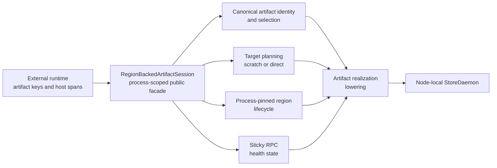
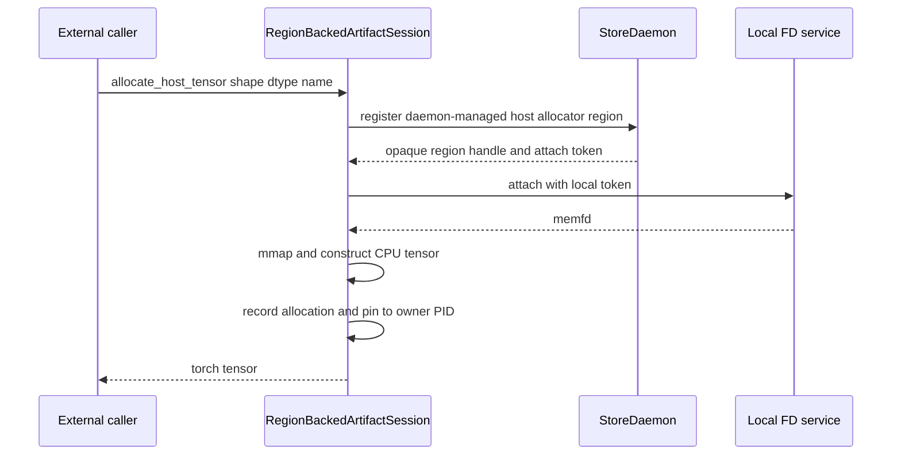
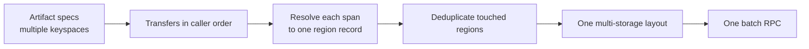
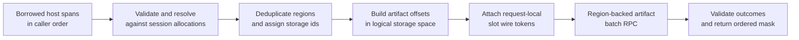
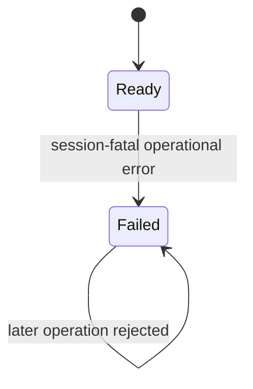
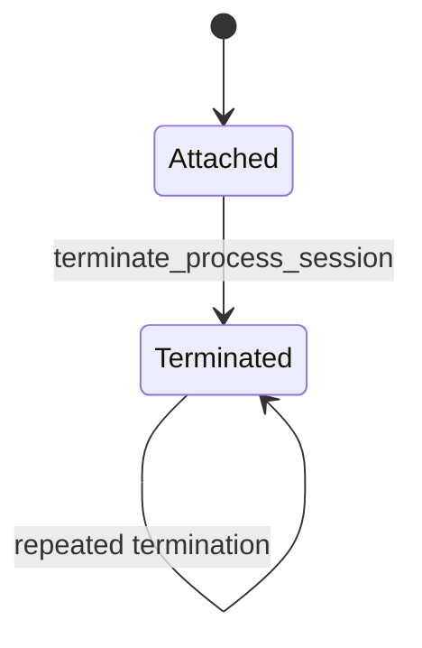
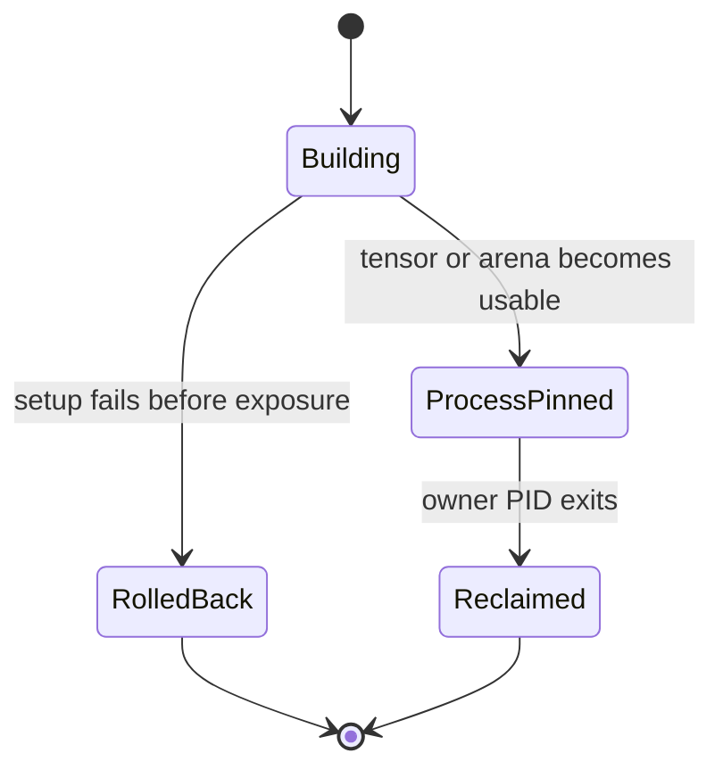

# Summary

TensorCast needs a public, process-scoped SDK session for high-throughput
applications that repeatedly test, materialize, and publish large numbers of
byte artifacts through application-owned CPU memory ranges. Typical callers
include inference runtimes, cache engines, and other systems that already own
their scheduling and memory-layout policy.

The proposed `RegionBackedArtifactSession` is one stable public boundary for:

- attaching one application process to one ready, node-local StoreDaemon;
- deriving canonical byte-artifact identities from per-artifact keyspaces and
  caller-provided engine keys;
- allocating daemon-backed CPU tensors that remain mapped for the process
  lifetime;
- executing batched `exists`, `get_into`, and `put_from` operations without
  exposing protobuf messages or daemon-control APIs;
- selecting scratch-copy or allocator-backed direct transfer behind the same
  public operation surface;
- building multi-region target layouts, slot wire tokens, operation ids, and
  artifact invariants inside the SDK;
- maintaining one sticky RPC-health state for the session; and
- retaining every published region until the owner process exits, even after an
  RPC failure or process-session termination.

The session is not a new storage authority and does not replace `Artifact`.
Every transfer item still names one TensorCast byte artifact. The session is a
batch compilation, target-memory, and failure-containment facade over the
artifact realization path.

The initial design requires only Python SDK changes. It intentionally requires
no StoreDaemon C++ change, protobuf change, or persistent schema change.



# Problem Statement

TensorCast already exposes the low-level mechanisms needed for external-memory
artifact transfer:

- byte-artifact identity and selection builders;
- host-shared region registration and local FD attachment;
- CPU memfd mapping;
- region-backed batch get and put RPCs;
- target layouts with multiple storage entries and offsets;
- stable local backing activation;
- item-level outcomes; and
- PID-based daemon cleanup.

Those mechanisms are currently too low-level to be the integration contract.
An external caller can only assemble the complete flow by depending on details
such as `DaemonCtl`, `Store._runtime`, generated protobuf types, region handles,
layout enums, storage ids, operation ids, wire slot tokens, and daemon status
codes.

This creates five system-level problems.

## 1. Internal protocol becomes public integration API

Generated protobuf messages and private runtime accessors expose implementation
choices that TensorCast must otherwise be free to change. Callers duplicate
selection construction, layout construction, outcome parsing, and retry
behavior. Compatibility then depends on undocumented daemon wire details rather
than on a reviewed SDK contract.

## 2. RPC health and region ownership become split-brain

When allocation, transfer, and cleanup are implemented by different caller
objects, no single owner can answer:

- whether new RPCs may be admitted;
- which mappings must remain alive;
- whether a failed transfer has made the backend permanently unusable;
- whether logical close is allowed to unregister a region; or
- which process identity the daemon should monitor.

Closing one wrapper can invalidate memory still referenced by another wrapper.
Conversely, retrying through a newly-created wrapper can accidentally bypass a
failure decision made by the old wrapper.

## 3. Multi-region transfer logic is repeatedly reimplemented

One logical caller batch may reference several independent host allocations.
The RPC layout must deduplicate regions, assign request-local storage ids,
construct a concatenated logical address space, validate bounds, and associate
each artifact with exactly one contiguous offset. This is TensorCast protocol
logic, not application scheduling logic.

## 4. External-memory RPC failure is ambiguous

A client-side timeout or transport failure does not prove that the daemon has
stopped reading or writing the submitted memory. Transparent retry can issue a
second operation against the same ranges while the first operation may still be
running. Immediate unregister or unmap can turn the ambiguity into a
use-after-unmap failure.

## 5. Failure needs a stable public boundary

Long-running applications often execute cache or materialization work on
background threads. Raw gRPC exceptions and generated status types are not a
stable integration contract, while treating every failure as a cache miss
hides the fact that the TensorCast session is no longer trustworthy. The SDK
needs a typed public exception, a durable local health decision, and a retained
first-failure record. Callers remain responsible for translating that typed
exception into their own control-plane or cache-failure semantics.

# Goals / Non-Goals

## Goals

- Provide one public Python SDK session for repeated, batched byte-artifact
  operations over CPU host memory.
- Keep artifacts as the durable identity, discovery, routing, and publication
  unit.
- Hide generated protobufs, daemon-control clients, region ids, target layouts,
  storage ids, operation ids, and slot wire tokens from callers.
- Attach to a ready node-local StoreDaemon without starting, stopping, or
  owning the daemon process.
- Support both scratch-copy and allocator-backed direct transfer through one
  operation interface.
- Support any number of live allocator regions in one session and any number of
  regions in one transfer batch.
- Centralize region registration, mapping, strong-reference retention, address
  resolution, and process-exit cleanup semantics.
- Centralize RPC admission, retry policy, response validation, failure latching,
  diagnostics, and post-response health checks.
- Guarantee that a surfaced session-fatal RPC failure permanently disables all
  subsequent allocation, `exists`, `get_into`, and `put_from` RPCs in that
  process session.
- Convert session-fatal operational errors into one public typed session
  exception while retaining the underlying exception as its cause.
- Keep daemon stable backing registered until the owner PID exits after a region
  has become process-pinned.
- Preserve concurrent direct get and put. Scratch mode may serialize per
  direction but must allow one get and one put concurrently.
- Make direct external-memory RPC retries zero by contract.
- Use layout-and-size-only verification for region-backed byte-artifact puts so
  direct transfer does not require a caller-memory digest or an SDK-side staging
  fallback.
- Define observability sufficient to distinguish a real artifact miss from a
  failed session.
- Allow one batch to span any number of session-owned regions and artifact
  keyspaces without exposing region or layout protocol objects.
- Remain extensible to additional external-memory component types without
  adding artifact-type-specific SDK entrypoints.

## Non-Goals

- Defining cache pages, blocks, attention layouts, recurrent state, or any
  framework-specific memory model.
- Moving application scheduling, slot allocation, eviction, pinning, or
  logical-group success policy into TensorCast.
- Supporting asynchronous use of borrowed host ranges in the initial API.
- Providing a C++, C, or Rust integration API in the initial design.
- Guaranteeing compatibility with CUDA, ROCm, or another accelerator-specific
  host-registration API. The Session guarantees stable contiguous CPU memory;
  accelerator registration remains an integration concern.
- Adopting arbitrary caller-owned memory as an allocator-backed direct region.
  Direct mode initially uses memory allocated and mapped by this session.
- Providing strict cancel-and-drain or quiescent-error guarantees without
  daemon support.
- Guaranteeing that a direct target range is unmodified after an ambiguous RPC
  error.
- Recovering a failed session in place or transparently attaching to a restarted
  daemon.
- Supporting `fork()` or spawning child processes after a process session has
  attached. The owner process must create all children before attaching.
- Starting or shutting down StoreDaemon from the session.
- Exposing direct Global Store connectivity from the SDK.
- Protecting an attached Session from explicit shutdown of another
  process-global TensorCast Store, runtime, or daemon client. Such shutdown is
  treated as teardown of the process's TensorCast client facilities.
- Adding a new artifact identity format, database table, protobuf message, or
  daemon RPC.
- Defining implementation phases or rollout tasks. Those belong in a companion
  plan if this design is accepted.

# Prior Constraints Reviewed

## Unified runtime configuration (`0004`)

Kept. Session options are typed SDK configuration and may be represented under
the unified client configuration tree. The design does not add environment-only
flags or a second configuration authority.

## Artifact-first SDK (`0039`)

Kept as the authority rule and narrowed as a public-surface rule.

`Artifact` remains the ordinary user-facing root for durable objects and
realization. `RegionBackedArtifactSession` is an advanced, high-cardinality batch
facade for integration callers. It may compile many artifact operations without
requiring one long-lived Python `Artifact` wrapper per item, but it must still:

- derive a canonical artifact id from keyspace plus engine key for every item;
- use canonical artifact selection and invariant rules;
- route metadata through StoreDaemon;
- lower byte movement through the artifact realization implementation; and
- return artifact-correlated outcomes.

The session does not introduce a parallel key-value authority, cache namespace,
or byte store. Any implementation that stores bytes under a session-only key or
bypasses artifact selection violates this design.

## CPU shared-memory materialization (`0049`)

Kept for memfd handoff and mapping safety, with a distinct ownership profile.

`0049` describes immutable materialization projections whose export lifetime is
normally tied to returned tensor references. This design covers mutable,
caller-target memory allocated for repeated direct transfers. Once such a
tensor escapes to the caller, the session cannot prove that all derived tensor
views have disappeared. Its region therefore becomes process-pinned rather
than reference-count released.

This is not an alternative artifact backing identity. It is a caller target
allocation and a target-region lifecycle policy.

## Existence authority (`0090`)

Kept. `batch_exists` asks StoreDaemon for artifact authority and does not infer
existence from region mappings, local identity derivations, or prior transfer
results. A failed session raises `RegionSessionFailedError`; it never represents
session failure as authoritative artifact absence.

## Backing and lifecycle authority (`0093`, `0094`)

Kept. The session owns process-local mappings and an admission capability; the
daemon remains the lifecycle authority for registered regions and stable
backing. PID exit is the final reclamation event for process-pinned regions.

The SDK failure latch is not a daemon lifecycle state and is not a new fencing
credential. It only prevents the local process from admitting more RPCs after
the session becomes untrustworthy.

## Composite materialization and vectored direct write (`0115`)

Kept. One batch may use several stable local backing regions, and one region may
serve many artifact offsets. Stable backing is deduplicated by region identity
inside the daemon. The session's layout compiler is the SDK-side producer of
the corresponding multi-storage target layout.

## Unified artifact realization kernel (`0121`)

Kept. `RegionBackedArtifactSession` is a public facade over canonical selection,
target planning, strategy planning, lifecycle planning, execution lowering,
and reporting. It does not own a second realization kernel.

The first implementation may lower to existing region-backed daemon RPCs while
the unified realization kernel is still converging. That lowering must live
behind one SDK adapter and reuse canonical builders. Callers must not observe
which daemon RPC carried the admitted artifact operation.

# Architecture & Interfaces

## 1. Public boundary and naming

The public surface is exported from `tensorcast.api.store`:

```python
from tensorcast.api.store import (
    AllocatorTransferOptions,
    ByteArtifactKeyspace,
    ByteArtifactSpec,
    HostMemorySpan,
    RegionArtifactInputError,
    RegionArtifactExistsResult,
    RegionArtifactTransfer,
    RegionArtifactTransferResult,
    RegionBackedArtifactSession,
    RegionBackedArtifactSessionOptions,
    RegionSessionAttachError,
    RegionSessionFailure,
    RegionSessionFailureCode,
    RegionSessionFailedError,
    RegionSessionHealth,
    RegionSessionLifecycleState,
    RegionSessionOperationKind,
    RegionSessionTerminatedError,
    RegionTransferMode,
    ScratchTransferOptions,
)
```

The implementation may live in
`tensorcast/api/store/region_backed_artifact_session.py`, but callers depend on the
`tensorcast.api.store` re-export rather than on that leaf module. A new
top-level `tensorcast.api.external_memory` namespace is rejected because it
would make external memory appear to be a second store or artifact authority.

The name `RegionBackedArtifactSession` records all three semantic layers:

- **region-backed** describes the daemon-exposed shared-memory mechanism used
  to source or target bytes;
- **artifact** states that the bytes are still stored, discovered, routed, and
  verified as TensorCast artifacts; and
- **session** states that RPC admission, mappings, and failure state are scoped
  to one attached application process.

All exported symbols must be public, documented, and free of generated
protobuf types. External callers must not need imports from:

- `tensorcast.daemon_ctl`;
- `tensorcast.proto.*`;
- `tensorcast.api.store.runtime`;
- `tensorcast.common.selection_contract`; or
- any module or attribute whose name begins with `_`.

The session connects only to StoreDaemon. It never opens a Global Store channel.

## 2. Public model schema

The public schemas are normative in meaning. Final implementation should use
frozen Pydantic models for validated value objects and ordinary resource-owning
classes for live sessions.

```python
from dataclasses import dataclass
from datetime import datetime
from enum import Enum
from typing import Annotated, Literal, Sequence

import torch
from pydantic import BaseModel, ConfigDict, Field


class RegionTransferMode(str, Enum):
    SCRATCH = "scratch"
    ALLOCATOR = "allocator"


class RegionSessionHealth(str, Enum):
    READY = "ready"
    FAILED = "failed"


class RegionSessionLifecycleState(str, Enum):
    ATTACHED = "attached"
    TERMINATED = "terminated"


class RegionSessionFailureCode(str, Enum):
    TRANSPORT = "transport"
    DAEMON_STATUS = "daemon_status"
    REGION_SETUP = "region_setup"
    REGION_LOST = "region_lost"
    MALFORMED_RESPONSE = "malformed_response"
    INTERNAL = "internal"


class RegionSessionOperationKind(str, Enum):
    ALLOCATE = "allocate"
    EXISTS = "exists"
    GET_INTO = "get_into"
    PUT_FROM = "put_from"


class RegionArtifactInputError(ValueError):
    pass


class RegionSessionAttachError(RuntimeError):
    pass


class ByteArtifactKeyspace(BaseModel):
    model_config = ConfigDict(frozen=True, extra="forbid")

    namespace: str
    engine: str
    model_id: str
    model_version: str
    layout_id: str


class ScratchTransferOptions(BaseModel):
    model_config = ConfigDict(frozen=True, extra="forbid")

    mode: Literal[RegionTransferMode.SCRATCH] = RegionTransferMode.SCRATCH
    capacity_bytes: int


class AllocatorTransferOptions(BaseModel):
    model_config = ConfigDict(frozen=True, extra="forbid")

    mode: Literal[RegionTransferMode.ALLOCATOR] = RegionTransferMode.ALLOCATOR


class RegionBackedArtifactSessionOptions(BaseModel):
    model_config = ConfigDict(frozen=True, extra="forbid")

    daemon_address: str
    session_name: str
    transfer: Annotated[
        ScratchTransferOptions | AllocatorTransferOptions,
        Field(discriminator="mode"),
    ]
    transfer_timeout_s: float | None = None
    exists_timeout_s: float = 30.0
    region_name_prefix: str = "tensorcast_region_artifact"


class ByteArtifactSpec(BaseModel):
    model_config = ConfigDict(frozen=True, extra="forbid")

    keyspace: ByteArtifactKeyspace
    engine_key: bytes
    byte_length: int


class HostMemorySpan:
    @classmethod
    def from_tensor(
        cls,
        tensor: torch.Tensor,
        *,
        offset_bytes: int,
        byte_length: int,
    ) -> "HostMemorySpan": ...

    @classmethod
    def from_address(
        cls,
        address: int,
        byte_length: int,
        *,
        owner: object,
    ) -> "HostMemorySpan": ...

    @property
    def address(self) -> int: ...

    @property
    def byte_length(self) -> int: ...


@dataclass(frozen=True, slots=True)
class RegionArtifactTransfer:
    artifact: ByteArtifactSpec
    span: HostMemorySpan


class RegionSessionFailure(BaseModel):
    model_config = ConfigDict(frozen=True, extra="forbid")

    code: RegionSessionFailureCode
    message: str
    operation_kind: RegionSessionOperationKind
    operation_id: str | None
    occurred_at: datetime


class RegionSessionFailedError(RuntimeError):
    failure: RegionSessionFailure


class RegionSessionTerminatedError(RuntimeError):
    pass


class RegionArtifactExistsResult(BaseModel):
    model_config = ConfigDict(frozen=True, extra="forbid")

    existence_mask: tuple[bool, ...]
    rpc_elapsed_s: float


class RegionArtifactTransferResult(BaseModel):
    model_config = ConfigDict(frozen=True, extra="forbid")

    success_mask: tuple[bool, ...]
    operation_id: str | None
    pack_elapsed_s: float
    copy_elapsed_s: float
    rpc_elapsed_s: float
```

`model_id` and `model_version` retain the existing
`build_byte_artifact_cgid()` vocabulary, but the SDK does not assume that every
keyspace represents neural-network weights. They identify the logical artifact
collection and its immutable version.

The keyspace belongs to `ByteArtifactSpec`, not to the process session. A
session owns transport and memory resources; it is not bound to one artifact
collection. Reusing one frozen `ByteArtifactKeyspace` instance across many
specs is expected. A single batch may contain specs from several keyspaces, and
the SDK derives each canonical artifact identity independently.

`ScratchTransferOptions.capacity_bytes` is required in scratch mode and cannot
appear in allocator mode. The discriminated policy models make invalid mixed
configuration unrepresentable without relying on an optional field. Scratch
regions are fixed-capacity and allocated at most once per direction. A request
larger than the configured capacity fails local validation before any RPC. This
avoids runtime region replacement and keeps process-pinned memory bounded and
predictable.

An integration with a known maximum operational batch must compute its maximum
packed byte requirement during setup and reject insufficient scratch capacity
before starting data-path workers. The initial SDK does not grow arenas or
split one public transfer batch into several RPCs. Metadata-only
`batch_exists()` is the exception: it may transparently partition its input to
respect the effective RPC message-size limit. Runtime capacity rejection
remains a defensive validation path, not the normal sizing mechanism.

`HostMemorySpan` is a live, non-serializable resource object rather than a
Pydantic value model. A bare integer address does not keep its allocation alive:
the tensor or pool that owns that address could otherwise be destroyed while a
blocking RPC still uses it. `from_tensor()` retains the tensor automatically.
`from_address()` is the advanced escape hatch for callers that discover ranges
through allocator metadata; its mandatory `owner` is strongly retained by the
span for at least the call lifetime. Both constructors validate address, length,
offset, CPU accessibility, contiguity where applicable, and arithmetic bounds.
There is no constructor that accepts an unowned raw address.

`RegionArtifactTransfer` is likewise a frozen resource-bearing dataclass rather
than a serializable request model. Construction requires
`artifact.byte_length == span.byte_length`; a transfer never truncates or
implicitly extends either side.

Successful result objects describe ordinary item outcomes only. A
session-fatal condition latches `health == FAILED` and raises the public
`RegionSessionFailedError`; callers never need to catch gRPC or generated
protobuf exception types. `RegionSessionFailedError.failure` carries the stable
first-failure record, and the original exception is retained as `__cause__`
when one exists.

`RegionSessionAttachError` represents endpoint, readiness, or required
capability failure before Session publication. It creates no Session and no
sticky failure record, hides raw gRPC/protobuf types, and retains the original
exception as `__cause__` when one exists.

`RegionSessionFailureCode` is a stable SDK-level classification rather than a
raw gRPC code or generated daemon enum. Every non-empty admitted transfer RPC,
allocator-region setup RPC, and internally partitioned exists sub-RPC receives
an internal correlation id before it can fail. Local failures that occur
earlier may leave `operation_id` unset. Attach failure creates no Session and
therefore no `RegionSessionFailure`. `operation_kind` and `occurred_at` make the
retained first-failure record self-contained for logs and control-plane
reporting. `occurred_at` is always timezone-aware UTC.

`RegionArtifactTransferResult.operation_id` is the id of its one transfer RPC.
It is `None` only for an empty transfer batch, which issues no RPC. Exists does
not expose one operation id because one public call may partition into several
sub-RPCs; each sub-RPC has its own internal operation id.

## 3. Session surface

```python
class RegionBackedArtifactSession:
    @classmethod
    def attach(
        cls,
        options: RegionBackedArtifactSessionOptions,
    ) -> "RegionBackedArtifactSession": ...

    @property
    def health(self) -> RegionSessionHealth: ...

    @property
    def lifecycle_state(self) -> RegionSessionLifecycleState: ...

    @property
    def failure(self) -> RegionSessionFailure | None: ...

    def allocate_host_tensor(
        self,
        shape: tuple[int, ...],
        dtype: torch.dtype,
        *,
        name: str,
    ) -> torch.Tensor: ...

    def batch_exists(
        self,
        artifacts: Sequence[ByteArtifactSpec],
    ) -> RegionArtifactExistsResult: ...

    def batch_get_into(
        self,
        transfers: Sequence[RegionArtifactTransfer],
    ) -> RegionArtifactTransferResult: ...

    def batch_put_from(
        self,
        transfers: Sequence[RegionArtifactTransfer],
    ) -> RegionArtifactTransferResult: ...

    def terminate_process_session(self) -> None: ...
```

A minimal allocator-mode caller uses only public value objects and CPU tensors:

```python
import torch

from tensorcast.api.store import (
    AllocatorTransferOptions,
    ByteArtifactKeyspace,
    ByteArtifactSpec,
    HostMemorySpan,
    RegionArtifactTransfer,
    RegionBackedArtifactSession,
    RegionBackedArtifactSessionOptions,
)

session = RegionBackedArtifactSession.attach(
    RegionBackedArtifactSessionOptions(
        daemon_address="unix:///run/tensorcast/store.sock",
        session_name="runtime-worker-0",
        transfer=AllocatorTransferOptions(),
        exists_timeout_s=30.0,
    )
)

keyspace = ByteArtifactKeyspace(
    namespace="serving",
    engine="runtime",
    model_id="model-a",
    model_version="revision-42",
    layout_id="runtime-cache-v1",
)

buffer = session.allocate_host_tensor(
    (4096,),
    torch.uint8,
    name="cache-plane-0",
)
artifact = ByteArtifactSpec(
    keyspace=keyspace,
    engine_key=b"shard-0:item-17",
    byte_length=4096,
)
transfer = RegionArtifactTransfer(
    artifact=artifact,
    span=HostMemorySpan.from_tensor(
        buffer,
        offset_bytes=0,
        byte_length=artifact.byte_length,
    ),
)

put_result = session.batch_put_from([transfer])
get_result = session.batch_get_into([transfer])
```

The ordered mask contains ordinary artifact-level outcomes only. A
session-fatal condition raises `RegionSessionFailedError`. The caller may also
inspect `session.health` and `session.failure` for control-plane reporting.

`attach()` is connect-only:

- StoreDaemon must already be running and ready;
- the endpoint must resolve to the node-local daemon required for memfd FD
  handoff;
- attach does not create a daemon, own a daemon subprocess, install daemon
  signal handlers, or stop a daemon;
- attach records `os.getpid()` as the non-configurable owner PID; and
- attach completes the capability handshake before returning.

The initial capability handshake is intentionally small. It verifies only:

- StoreDaemon responds;
- `startup_phase == DAEMON_STARTUP_PHASE_READY`;
- `cpu_shared_memory_enabled == true`;
- `local_handle_socket_path` is present and the local FD service is reachable;
  and
- the configured endpoint is eligible for node-local region access.

The handshake does not enumerate application layouts, pre-create probe
regions, reproduce daemon policy, or gate attach on source-bound or batch
transport protocol versions. Support for the requested scratch or allocator
region class and the region-backed batch methods is finally validated by the
first real allocation and operation. Failure follows the allocation/setup or
RPC failure rules below.

`allocate_host_tensor()` is valid only in allocator mode. It allocates a
daemon-managed `HOST_SHARED/ALLOCATOR` region, attaches and maps it, constructs
a CPU `torch.Tensor` with the requested shape and dtype, records the address
range, and returns the tensor. The caller does not receive the region id,
registration handle, FD token, or mmap object.

The returned tensor has dense contiguous CPU storage, a page-aligned mapping
base, a stable address for the process-pinned lifetime, and an exact logical
byte extent derived from shape and dtype. The initial Session does not promise
that an accelerator runtime will accept the mapping for CUDA, ROCm, or another
vendor-specific host-registration API. Accelerator registration, pinning, DMA
validation, and registration cleanup remain integration responsibilities.

`batch_get_into()` and `batch_put_from()` are synchronous. The caller promises
that every submitted host range remains allocated, writable for get, readable
for put, and exclusively borrowed until the method returns. Submitted spans in
one batch must be pairwise non-overlapping; the SDK rejects overlap before RPC
admission. Across concurrently executing calls, the caller must ensure that no
borrowed range overlaps another in-flight range or is read, written, freed, or
reused through another path. A batch may mix artifact keyspaces and may resolve
to any number of regions owned by the same session. The SDK emits one
multi-storage layout and one RPC rather than requiring one call per region.
Session-fatal failure raises and does not expose a partial success mask even if
some bytes were already transferred.

Each batch method snapshots its input `Sequence` to an immutable tuple at
method entry and retains the referenced specs, spans, tensors, and explicit
owners through return or raise. This first step only takes strong references; it
does not perform full caller-input validation before checking sticky Session
state. After the preliminary health/lifecycle gate succeeds, the method resolves
each span's address and length once from the snapshot and performs complete
local validation before final RPC admission. Concurrent mutation of the
caller's original sequence therefore cannot change request construction or
result correlation. This structural snapshot does not relax the caller's
obligation to keep the borrowed memory contents and lifetime valid.

`terminate_process_session()` prevents further admission and releases only
session-owned control resources, such as its helper threads or batcher, when
safe. It neither calls `release_daemon_client()` nor closes the process-shared
`DaemonCtl` channel used by other TensorCast APIs. It is an owner-process
operation, not a consumer reference release. It does not unmap, release,
unregister, or expire a process-pinned region.

Conversely, explicit shutdown of a process-global TensorCast Store, runtime, or
daemon client is treated as teardown of the process's TensorCast client
facilities and may invalidate an attached Region Session. The initial design
does not add client reference counting to prevent that shutdown. A subsequent
Session operation observes the closed client as a session-fatal operational
failure; process-pinned region and mapping retention remain unchanged.

## 4. Process session registry

The SDK permits one attached StoreDaemon per process. The process registry uses
this identity:

```text
(owner_pid, canonical_daemon_address)
```

Endpoint canonicalization occurs before lookup. Once a process has attached to
one endpoint, attempting to attach a different endpoint fails before creating a
client or region. `session_name` is diagnostic and contributes to region names;
it does not create an independent session or failure domain.

Options are default-filled and normalized before compatibility comparison. The
operational option fingerprint contains:

```text
transfer mode
scratch capacity, in scratch mode
transfer timeout
exists timeout
```

The canonical daemon address is the registry identity rather than a duplicate
fingerprint field. `session_name` and `region_name_prefix` are diagnostic and do
not participate in the operational fingerprint; their values from the first
successful attach win for the process session. A conflicting operational
fingerprint raises an error that names the differing normalized fields rather
than reporting only an opaque hash mismatch. Explicit default values and
omitted values that resolve to those defaults compare equal.

Attach uses one ordinary process-registry mutex. The attaching caller holds it
from lookup through endpoint validation, capability handshake, and final
Session publication. A concurrent attach therefore waits and then observes the
published Session or the attach failure; the initial design does not introduce
an `ATTACHING` lifecycle state, future, or condition-variable protocol. Attach
is a rare control-plane operation, so holding this mutex across its blocking
handshake is preferred over a more complex single-flight state machine. The
mutex is never used by data-plane batch operations.

The SDK keeps a strong process-registry reference to the attached session.
Repeated attach with the same normalized operational fingerprint returns the
same object only while its lifecycle state is `ATTACHED`. A repeated attach
after terminal process-session termination raises
`RegionSessionTerminatedError`. Repeated attach with a different operational
fingerprint for the same process identity fails before changing the existing
session.

The registry establishes these rules:

- a failed session cannot be replaced by a healthy object in the same process;
- dropping an application reference cannot unmap its allocations;
- independently constructed integration components can converge on one region
  registry and one RPC failure domain; and
- process-session termination cannot make daemon stable backing reclaimable
  before process exit.

The initial contract assumes that the process does not call `fork()` or spawn a
child after attaching. Inherited Session or `DaemonCtl` objects, child-side
reattachment, and child cleanup of parent-owned resources are outside the
initial design. A runtime that creates workers must complete that process
topology before each final owner process calls `attach()`.

The owner process and StoreDaemon must also share the same host PID namespace.
The numeric `os.getpid()` recorded by the SDK must name that same process from
the daemon's PID-monitoring context. Node locality and access to the daemon's
Unix socket do not by themselves satisfy this requirement. Containerized
deployments must share a PID namespace or otherwise arrange an equivalent
daemon-visible PID mapping. The SDK-only initial design does not translate PID
namespaces.

## 5. Ownership model

| Resource or decision | Owner | Lifetime |
| --- | --- | --- |
| Artifact identity and authority | TensorCast artifact system | Durable artifact lifecycle |
| StoreDaemon process | Operator or external supervisor | Independent of SDK session |
| Session RPC admission | `RegionBackedArtifactSession` | Application process session |
| Daemon-managed host region | StoreDaemon region registry | Until owner PID exit after pinning |
| Local mapping and tensor roots | SDK process session registry | Until application process teardown |
| Tensor shape and interpretation | External caller | Caller object lifetime |
| Borrowed transfer range | External caller | One synchronous SDK call |
| Direct-region address resolution | SDK session | Session lifetime |
| Application slot allocation and reuse | External caller | Outside TensorCast |
| Stable-backing activation | StoreDaemon | Derived from admitted region layouts |
| RPC failure latch | SDK session | Sticky until process exit |

The caller may create arbitrary tensor views over a returned allocation. The
SDK therefore cannot use Python reference reachability as proof that the region
is unused. Process pinning is the explicit conservative ownership policy.

## 6. Artifact identity contract

Each artifact spec supplies one keyspace and one opaque engine key. The session
uses the existing byte-artifact identity builder internally:

```python
artifact_id = build_byte_artifact_cgid(
    namespace=artifact.keyspace.namespace,
    engine=artifact.keyspace.engine,
    model_id=artifact.keyspace.model_id,
    model_version=artifact.keyspace.model_version,
    layout_id=artifact.keyspace.layout_id,
    engine_key=artifact.engine_key,
)
```

There is no session-specific hash schema or JSON identity descriptor.

The initial API does not accept a canonical `artifact_id`, and it does not
expose `artifact_id_for()` as a public method. Canonical artifact ids are
TensorCast-owned identities whose representation and derivation must remain
decoupled from external callers. Accepting both an artifact id and a keyspace
would also create two public identity paths with different validation and cache
behavior.

The external caller owns the meaning and stability of `engine_key`. Component
names, shards, ranks, epochs, and application cache keys may be encoded there,
but the SDK treats the value as opaque bytes. Region id, address, offset,
operation id, session name, and wire slot token are never part of artifact
identity.

One `ByteArtifactSpec` names exactly one contiguous byte artifact. A logical
caller object with several discontiguous components is represented by several
specs with distinct engine keys. Group-level all-or-nothing interpretation is a
caller policy over the returned masks; it is not hidden in the session.

Artifact specs in one batch may use different keyspaces. This permits one RPC
to carry independent component layouts while preserving one canonical identity
path per artifact. Supplying the same derived canonical artifact id more than
once in a batch is rejected before RPC admission, even if the corresponding
host spans differ.

The initial Session derives artifact ids and canonical selections per call and
does not retain an identity or selection cache. External engine keys are
typically high-cardinality in long-running applications, so an unbounded cache
would turn normal workload diversity into process memory growth. Results still
correlate with input order and do not require the caller to receive or interpret
canonical artifact ids. Existence truth always comes from StoreDaemon.

### 6.1 Identity stability and verification

For one derived canonical artifact id, every producer and consumer must agree
on one immutable byte layout and byte length. `layout_id` must change whenever
any byte-layout-affecting property changes. Examples include schema version,
element type, page or block size, tensor organization, and component kind.
`model_version` must identify an immutable logical collection revision rather
than a mutable deployment alias. TensorCast treats these values as caller-owned
identity inputs and cannot infer omitted compatibility dimensions.

`batch_put_from()` always lowers each item with
`BYTE_ARTIFACT_VERIFICATION_MODE_LAYOUT_AND_SIZE_ONLY`, the keyspace's
`layout_id`, and `artifact.byte_length`. The initial public Session has no
strict-digest option. In particular, it does not hash caller memory before a
direct put: strict SHA-256 verification can force a staging path and would
change the intended direct-transfer cost model.

`batch_exists()` is an identity-presence query. The existing selection wire
schema does not carry `ByteArtifactSpec.byte_length`, so an exists result does
not independently prove byte-length compatibility. A subsequent get validates
the requested layout and length. A mismatch is session-fatal because it
indicates that callers reused an identity across incompatible layouts or that
the installed components disagree on the byte-artifact contract.

## 7. Region allocation and address resolution

Every successful allocator-mode allocation performs this internal sequence:



The session retains a private record for each allocation:

```text
allocation sequence for diagnostics
region handle
base address
capacity bytes
mapped tensor root
NumPy or extension storage root
mmap object
attachment facts
optional frozen slot geometry
region lifecycle state
```

Allocation names combine the configured prefix, sanitized session name, owner
PID, and a monotonically increasing allocation sequence. Names are diagnostic;
the returned daemon region id remains the binding identity.

Address resolution succeeds only when one allocation contains the full span:

```text
artifact.byte_length == transfer.span.byte_length
allocation.base_address <= transfer.span.address
transfer.span.address + transfer.span.byte_length
    <= allocation.base_address + allocation.capacity_bytes
```

Zero or negative addresses, zero lengths, artifact/span length mismatch,
arithmetic overflow, crossing a region boundary, overlapping region records,
and ambiguous containment fail before RPC admission.

Multiple live allocations are normal. The session owns an interval-indexed
registry of all allocation records and must not overwrite a previous record
when another tensor is allocated. Every record has its own region handle,
mapping roots, capacity, and frozen slot geometry, while RPC health and terminal
process-session lifecycle remain shared across the complete registry.

One direct batch may contain spans from any number of those records. Address
resolution assigns each span to exactly one record; the layout compiler then
deduplicates region records and emits one storage entry per touched region.
Callers neither select a region explicitly nor split batches at region
boundaries.



## 8. Scratch transfer

Scratch mode accepts host ranges not allocated by the session. The session owns
two fixed-capacity daemon-managed `HOST_SHARED/SCRATCH` regions:

- one get arena; and
- one put arena.

Each direction has a dedicated lock. A get and put may run concurrently, but
two gets or two puts serialize while they use the same direction-specific
arena.

For put:

1. validate all artifact specs and borrowed source ranges;
2. derive artifact identities and selections;
3. pack source bytes into the put arena;
4. build one scratch storage entry and one artifact offset per transfer;
5. issue the region-backed put-if-absent RPC; and
6. parse item outcomes into the original order.

For get:

1. validate all artifact specs and borrowed target ranges;
2. derive artifact identities and selections;
3. build one scratch storage entry and packed offsets;
4. issue the region-backed get RPC;
5. validate the complete response;
6. copy only successful artifact ranges into caller targets; and
7. return item results in the original order.

If get raises a session-fatal failure, no scratch bytes are copied into caller
targets. The scratch arena is never reused because the whole session has become
failed. A late daemon write therefore remains confined to session-owned scratch
memory.

## 9. Allocator-backed direct transfer

Allocator mode accepts only ranges contained in tensors allocated by the same
session. It performs no application-to-scratch copy.

This is a caller-side zero-copy guarantee: the Session passes the caller's
registered region to StoreDaemon without copying through an SDK scratch arena.
It is not an end-to-end no-staging guarantee. StoreDaemon may select an internal
staging or transport fallback according to daemon configuration, artifact
routing, peer capabilities, and source locality. The initial minimal handshake
does not predict or require one daemon-internal realization path. Observability
should distinguish direct region export from daemon-internal staging so callers
can evaluate the realized performance without changing correctness semantics.

For every batch, the SDK:

1. resolves every host range to exactly one private allocation record;
2. collects unique regions in first-appearance order;
3. assigns request-local storage ids such as `storage-0`;
4. computes the logical base of each storage as the sum of preceding region
   capacities;
5. validates one stable slot geometry per region;
6. builds one target offset per byte artifact;
7. adds request-local slot wire tokens;
8. issues one batch RPC; and
9. validates outcomes and echoed tokens before reporting success.

The logical storage offset is:

```text
storage_logical_base[region]
  + transfer.span.address
  - region.base_address
```

The wire layout may therefore contain many storage entries without exposing
that representation to the caller.



## 10. Slot geometry and wire tokens

The current daemon contract requires allocator-region offsets to carry
`slot_index` and `slot_generation`. These fields remain SDK-internal.

For each region, the first admitted direct batch derives a candidate
`slot_bytes` from its contained transfer lengths. Every transfer touching that
region in the batch must have the same length, and all offsets and the region
capacity must be aligned to that length. The session freezes the accepted
geometry for that region. A later incompatible batch fails local validation.

Candidate geometry is not committed while a request is still being validated.
The SDK first completes address containment, per-region uniformity, alignment,
overlap, duplicate-artifact, arithmetic, and request/response wire-budget
checks. During final admission it rechecks Session state and atomically compares
and installs all previously unseen `region -> slot_bytes` entries under the
region-geometry lock. The installation is all-or-nothing for the batch. A
locally rejected request therefore cannot poison future geometry.

If concurrent first-use batches propose different geometry for the same region,
one compatible candidate wins the atomic installation and the conflicting call
raises `RegionArtifactInputError` without issuing an RPC or changing Session
health. Existing compatible entries are left unchanged. Whenever both the
Session-state and geometry locks are required, code acquires the Session-state
lock first and the geometry lock second; neither is held across an RPC.

For each direct RPC:

- allocate one non-zero monotonically increasing `uint64` RPC generation;
- derive `slot_index = region_offset // slot_bytes`;
- attach the same RPC generation to every offset in the batch;
- remember the sent tuple by artifact outcome identity; and
- require the daemon to echo the same slot index and generation.

The counter is atomic or lock-protected because get and put may execute
concurrently. Counter wrap fails closed.

This is a wire-token adapter, not a per-slot lifecycle state machine. The
session does not observe application allocation, free, eviction, or reuse, and
does not maintain persistent per-slot generations. Echo validation detects a
malformed or mismatched response; it cannot stop an already-issued stale write.

## 11. Stable backing activation

The session does not expose `activate_stable_local_backing()`.

Direct target-layout validation in StoreDaemon acquires the registered local
mapping, derives stable backing from region identity and offset geometry, and
activates or merges that backing before transfer. The SDK validates consistent
per-region geometry so activation does not depend accidentally on which item is
visited first.

Explicit activation may be added later as an internal prewarm optimization. It
must not become an external correctness switch or expose a region id.

## 12. RPC policy

All region-backed get and put calls use zero transparent SDK retries. This is a
fixed safety contract, not a caller-tunable option.

An operation id provides correlation and idempotency information but does not
make it safe to reissue a direct external-memory operation after an ambiguous
error. A retry could overlap a still-running prior read or write against the
same memory.

`batch_exists` is read-only and does not borrow a memory range. It may use the
canonical metadata retry policy. Only an error ultimately surfaced by that
policy triggers the session failure latch.

Batch admission uses the effective gRPC maximum send and receive payload sizes
as the source of truth for item-count and serialized-metadata limits. The SDK
computes a conservative wire budget from the serialized request and an
ordinary-outcome response estimate; it does not introduce a second caller-configured
`max_batch_items` value. Because artifact-id lengths vary, the resulting maximum
item count is batch-dependent rather than a universal constant.

`DaemonCtl` already resolves its channel's send and receive limits when it
constructs gRPC channel options. The implementation records those exact
resolved values in one immutable private limits object owned by `DaemonCtl`;
the Session reads that internal snapshot rather than reading environment
variables again or trying to query options back from a gRPC channel. The same
values therefore configure the channel and govern Session admission.

The implementation shape is equivalent to:

```python
@dataclass(frozen=True, slots=True)
class _GrpcMessageLimits:
    max_send_bytes: int
    max_receive_bytes: int
```

`DaemonCtl.__init__()` resolves `_GrpcMessageLimits` once using the existing
validated environment/default path, stores it before creating the channel, and
passes the object into its channel-option builder. Channel refresh reuses that
same object; it does not observe environment changes made after client
construction. A private read-only accessor allows the Session to consume the
snapshot without making transport configuration part of the public Session
API.

The server-side gRPC limits are not exposed by the existing daemon config RPC.
The SDK-only initial design consequently requires this deployment invariant:

```text
daemon max_receive_message_bytes >= client max_send_message_bytes
daemon max_send_message_bytes    >= client max_receive_message_bytes
```

The SDK measures a completed outbound protobuf with `ByteSize()` after all
request fields have been populated. For response admission it constructs a
conservative ordinary-outcome
size from the input artifact ids, status fields, direct-mode slot tokens where
applicable, protobuf framing overhead, and fixed safety headroom. Error-message
text is not treated as unbounded normal payload; if an exceptional daemon
response still exceeds either endpoint's limit, the resulting transport error
is session-fatal under the ordinary failure rules.

One public `batch_get_into()` or `batch_put_from()` call still lowers to exactly
one RPC. If either its request or conservative ordinary-outcome response estimate exceeds the derived wire
budget, local validation rejects the complete transfer batch before RPC
admission. `batch_exists()` instead partitions its ordered input into the
largest contiguous sub-batches that fit the same budget and issues those RPCs
transparently. It reconstructs one result in original input order. If an exists
sub-call ends in a session-fatal error, the public call latches failure and
raises without exposing results from earlier sub-calls.

Every exists partition is an independent logical sub-RPC and receives its own
operation id. Metadata retries of that same sub-RPC retain its id; moving to the
next partition allocates a new one. There is no additional public parent
operation id. If a partition fails fatally, `RegionSessionFailure.operation_id`
records the id of that failing partition, while logs and traces also record its
zero-based partition index and the total partition count.

For a partitioned exists call, `rpc_elapsed_s` is the public call's total
wall-clock time spent executing all sub-RPC attempts, including metadata
retries. Per-sub-call timing remains an internal metric or trace detail.

`transfer_timeout_s=None` means that the SDK sets no client-side transfer
deadline. This is the allocator/direct-mode default because a deadline can
return a mutable target slot to the caller while the daemon may still be
writing it. A caller may explicitly configure a finite deadline, but doing so
accepts the ambiguous-completion risk described below. Scratch mode may use a
finite deadline more safely because a failed arena is never reused, although
zero transparent retry still applies.

No-deadline direct transfer can block an application thread indefinitely and
does not eliminate ambiguity after a connection loss. Strict resolution
requires a future daemon cancel-and-drain contract. The initial SDK chooses the
less aggressive default without claiming strict quiescence.

The SDK creates operation ids internally. External callers do not control or
reuse them in the initial API.

Artifact routing, placement, publication, and retention policy are daemon
configuration in the initial API. `batch_put_from()` does not accept a policy
profile or artifact TTL, and the SDK leaves the existing RPC TTL unset. Region
lifetime configuration remains separate and process-pinned. A future
caller-selected artifact-retention policy requires a separate reviewed public
contract rather than passing daemon policy strings through this session.

A successful put item ends the source borrow: after success is returned, the
daemon no longer reads that source span, and later mutation or reuse of the
caller slot cannot change the immutable artifact contents. Stable local backing
may optimize transfer registration, but it must not turn a reusable caller slot
into mutable artifact authority.

## 13. RPC health state

RPC health and attachment lifecycle are independent of each other and of region
ownership:





`FAILED` is sticky for the process-registry key. There is no transition from
`FAILED` back to `READY`, and another call to `attach()` returns the same failed
session rather than constructing a replacement while it remains attached.

`TERMINATED` is not a health value. It means that the owner process has ended
the SDK session lifecycle, whereas `FAILED` means that RPC results are no
longer trustworthy. A failed session may subsequently terminate without losing
its first failure.
Admission requires both `health == READY` and
`lifecycle_state == ATTACHED`.

Each batch operation uses this admission protocol:

1. snapshot the caller sequence and take the strong references required to
   inspect it safely;
2. acquire the short-lived Session-state lock for a preliminary gate;
3. raise `RegionSessionFailedError` with the retained first failure when health
   is `FAILED`, taking precedence over every later error;
4. otherwise raise `RegionSessionTerminatedError` when lifecycle state is
   `TERMINATED`;
5. release the lock and perform complete local validation, address resolution,
   identity derivation, and protobuf construction without admitting an RPC; if
   validation fails, recheck Session state before exposing the local input
   error;
6. for an empty valid batch, perform no RPC and return the empty result described
   below;
7. reacquire the Session-state lock, repeat the `FAILED` then `TERMINATED`
   checks, atomically commit any first-use geometry under the documented lock
   order, allocate the transfer RPC operation id, and increment the diagnostic
   in-flight count;
8. release all short-lived locks before blocking staging or RPC work;
9. execute local staging and the admitted region-backed RPC;
10. latch and raise the first session-fatal failure atomically;
11. decrement the in-flight count; and
12. recheck health before exposing a success result.

The preliminary gate makes sticky Session state deterministic without counting
locally invalid input as admitted work. The second gate closes the race in which
another call fails or terminates the Session during local request construction.
For an attached healthy Session, an empty exists batch returns
`existence_mask=()` and `rpc_elapsed_s=0.0`; an empty get or put returns
`success_mask=()`, `operation_id=None`, and zero pack, copy, and RPC timings.
Empty calls do not increment the in-flight count. They still perform the
preliminary state gate, so an empty call cannot bypass failed or terminated
state; that gate is the empty call's linearization point. Allocation follows
the same two-gate ordering without a sequence snapshot: validate shape, dtype,
and region-setup inputs between the preliminary and final gates, then assign an
operation id and increment in-flight state before the first daemon action.

For partitioned `batch_exists()`, steps 7 through 12 apply separately to every
sub-RPC. Each partition rechecks Session state, allocates its own operation id,
and increments/decrements the RPC in-flight count around only that partition and
its retries. A concurrent failure or termination therefore prevents admission
of the next partition; the public call raises and exposes none of its earlier
partial masks.

The session-state lock never serializes RPCs. An operation that completes after a
concurrent call has latched failure discards its success and raises
`RegionSessionFailedError`. The in-flight count is used for diagnostics and
deferred control-resource cleanup only; failure does not wait for daemon drain
and never triggers region cleanup.

## 14. Failure classification

Failure classification is allowlist-based. The only normal daemon item statuses
are:

- `BATCH_ITEM_STATUS_OK` for exists, get, and put, including an adopted or
  joined put-if-absent encoded as a successful outcome; and
- `BATCH_ITEM_STATUS_MISS` for exists and get.

An empty batch completes locally without an RPC only after the preliminary
Session-state gate succeeds. Every other returned status is session-fatal,
including `UNSPECIFIED`, `UNAVAILABLE`,
`FAILED_PRECONDITION`, `INVALID_ARGUMENT`, `INTERNAL_ERROR`, a numeric status
unknown to the installed SDK, and `MISS` from put. This deliberately treats a
possibly artifact-scoped daemon rejection as process-session failure: the
integration cannot safely determine whether the code reflects one bad artifact,
a layout incompatibility, a stale region, or a daemon/SDK version mismatch.

The following conditions are also session-fatal:

- a final gRPC transport, deadline, cancellation, availability, or internal
  error from `exists`, `get_into`, or `put_from`;
- a final daemon RPC, registration, attachment, or FD-handoff failure while
  creating an allocator region or scratch arena;
- an observed daemon restart or identity discontinuity;
- loss, expiry, or rejection of a process-pinned region;
- malformed batch response;
- missing, duplicate, or unknown artifact outcomes;
- mismatched echoed slot tokens;
- a response that violates byte length, layout, or stable-backing invariants;
  and
- an unexpected SDK exception after RPC admission.

Stable public failure-code mapping is:

| Condition | `RegionSessionFailureCode` |
| --- | --- |
| Final gRPC transport, cancellation, deadline, or availability failure | `TRANSPORT` |
| Non-allowlisted or unknown daemon item status, including a generic `FAILED_PRECONDITION` | `DAEMON_STATUS` |
| Ambiguous registration, FD attachment, mmap, or region setup failure | `REGION_SETUP` |
| A structured region-control or attachment result that unambiguously reports loss, expiry, or rejection of an already process-pinned region | `REGION_LOST` |
| Missing, duplicate, unknown, token-mismatched, or otherwise malformed response | `MALFORMED_RESPONSE` |
| Unexpected admitted SDK failure not classified above | `INTERNAL` |

The SDK never parses free-form daemon error text to infer `REGION_LOST`. When
the available structured signal is only a non-allowlisted item status, it uses
`DAEMON_STATUS` even if the accompanying text appears to describe a region
problem. `REGION_LOST` is reserved for typed region-control, attachment, or
other machine-readable evidence about an already pinned region.

The initial SDK does not claim proactive daemon-incarnation detection. The
basic attach handshake records no boot-unique identity, so a daemon restarted
at the same endpoint may first become observable when an existing region is
rejected or another RPC exposes a discontinuity. Once observed, that condition
is session-fatal; a successful metadata call alone is not proof that all
process-pinned region state survived.

After the preliminary sticky-state gate succeeds, local caller validation
errors occur before final RPC admission and raise a typed
`RegionArtifactInputError`. Examples include an invalid address, mismatched
length, scratch-capacity overflow, non-CPU allocation request, and direct span
outside session allocations. They do not latch RPC health because no daemon
operation was attempted. If the Session was already failed or terminated, its
terminal Session exception takes precedence over these input errors.

Invalid allocation shape or dtype also fails before RPC and does not latch
health. A purely local mmap or tensor-construction failure may leave the session
ready only when the new region is still `Building` and exact rollback completes.
If region creation has an ambiguous daemon outcome, FD attachment cannot be
validated, or rollback is uncertain, the session latches failure. Previously
process-pinned regions remain retained in every case. Allocation and lazy
scratch-arena creation use the same session admission and failure rules as
artifact operations.

After a session-fatal error:

- the first operation raises `RegionSessionFailedError` with the captured
  failure;
- every later allocation or batch operation raises immediately with the same
  first-failure record;
- `batch_exists` never turns failed health into an authority proof of absence;
- no new daemon RPC is issued;
- no region is unregistered or released; and
- the SDK emits the full traceback once, then rate-limits derivative logs.

The public exception hides gRPC and protobuf implementation types while
preserving the original exception chain. Mapping it to cache miss, subsystem
disablement, process restart, or another policy belongs to the caller.

## 15. Region lifecycle

Region lifecycle is deliberately independent of RPC health:



This state machine applies independently to every allocator allocation and to
each direction-specific scratch arena. One session may therefore retain many
`ProcessPinned` region records at once, including regions with different
capacities and slot geometries. The session registry is their aggregate owner:
a health transition or process-session termination changes RPC admission but
does not transition any process-pinned region toward reclamation.

### Building

The SDK may release and unregister a partially-created region only while all of
the following are true:

- no tensor or memory view has escaped to the caller;
- no RPC has referenced the region;
- stable backing has not been published for use; and
- setup rollback can identify the exact region.

### Process-pinned

A region becomes process-pinned when:

- an allocator tensor is returned to the caller; or
- a scratch arena becomes available for an admitted operation.

After that transition, the SDK must not invoke:

- `release_host_shared_region()`;
- `unregister_region()`;
- forced unregister;
- region expiry or TTL renewal policy that can reclaim it while the owner lives;
  or
- local unmap as part of process-session termination or RPC failure handling.

Process-pinned regions use non-expiring registration semantics. The session and
process registry retain mapping roots. Python `atexit` may stop SDK helper
threads, and the existing process-level TensorCast runtime may close its shared
gRPC channel, but the Session does not send a region lifecycle RPC or release
the shared `DaemonCtl` client.

The daemon's PID monitor observes the owner process exit and reclaims all
regions and stable backing associated with that PID. This is the only normal
reclamation path after pinning.

Daemon termination, administrator intervention, host failure, or daemon data
loss can still remove backing before client PID exit. Those events fail the
session; an SDK-only design cannot prevent them.

## 16. Process-session termination semantics

`terminate_process_session()` is idempotent, terminal, and non-recoverable
within the owner process. It means that the whole owner process, not merely one
consumer object, no longer intends to issue operations. A component that only
drops its own reference must not call it. It is not memory destruction and is
deliberately not named `close_region()`.

After termination:

- `lifecycle_state` reports `TERMINATED` while `health` remains independently
  `READY` or `FAILED`;
- a call made on an otherwise healthy terminated session raises the local
  `RegionSessionTerminatedError` without RPC;
- a session that was already failed continues raising
  `RegionSessionFailedError` with its first-failure record, even if it is also
  terminated;
- Session-owned batcher and helper-thread resources may close when doing so
  cannot trigger region release;
- the Session does not call `release_daemon_client()` or close the
  process-shared `DaemonCtl` channel;
- allocator mappings and scratch mappings remain strongly rooted; and
- `attach()` in the same owner process raises `RegionSessionTerminatedError`
  rather than returning or creating an operational session.

Termination first closes admission and then allows already-admitted synchronous
calls to reach their normal terminal result. Control resources used by those
calls are retained until their in-flight count reaches zero. Termination does
not cancel an RPC and does not wait as proof of daemon-side quiescence.

Recovery is intentionally a process restart, not termination followed by
attach. If a future use case needs temporary admission pause and resume, it
should add a separate `suspend()`/`resume()` contract; overloading process
termination with recovery would make ownership ambiguous.

This intentionally trades runtime reclamation for safety and a simple ownership
contract. An application that needs to reclaim external-memory regions must
terminate and restart the owning process in the initial design.

## 17. Concurrency model

The session uses independent synchronization domains:

| Domain | Locking rule |
| --- | --- |
| Session registry | One mutex held across attach lookup, handshake, and publication; never used by data-plane calls |
| Health state | Short lock around admission, latch, and post-check |
| Region registry | Read/write or ordinary lock around allocation and address records |
| Slot geometry | Short lock for atomic all-or-nothing first-use installation; Session-state lock precedes it when both are needed |
| RPC generation | Atomic increment or short dedicated lock |
| Scratch get | One direction-specific mutex held through staging and RPC |
| Scratch put | One direction-specific mutex held through staging and RPC |
| Direct RPC | No global transfer mutex |

No lock may be held while waiting for a different component to acquire the same
lock. Session-state, region-registry, and geometry locks must not be held across
a blocking RPC. Scratch locks are intentionally held across their direction's
blocking RPC because the arena is the borrowed transfer buffer.

The Session validates that spans within one submitted batch are pairwise
non-overlapping. It intentionally does not maintain an in-flight interval lock
table across direct calls: application schedulers already own slot allocation,
pinning, and reuse policy, and duplicating that state in the SDK would create a
second allocator authority. The caller must therefore prevent cross-call span
overlap and all external access or reuse of a borrowed range until its
synchronous call returns. Strong owner references preserve allocation lifetime;
they are not a substitute for this exclusivity rule.

## 18. Result ordering and partial item outcomes

Result masks preserve input order and have exactly the same length as the input
sequence.

The daemon may return artifact outcomes in a different order. The SDK matches
them by canonical artifact identity, rejects duplicates or unknown identities,
and reconstructs caller order.

The SDK also rejects duplicate derived artifact identities in the input before
RPC admission. Outcome correlation is artifact-based rather than
occurrence-based; the initial API does not define two destinations or two
sources for the same artifact in one batch.

Ordinary item misses may produce a partial success mask. Grouping several
artifacts into a higher-level object and folding their masks is caller policy.

For a normally returned get result, only a span whose corresponding
`success_mask` entry is `True` is consumable and guaranteed to contain the
complete requested artifact. A `False` entry makes no public promise about that
target span's bytes; the caller must discard or reinitialize it. This common
rule applies even though scratch mode copies only successful ranges and a
particular direct daemon implementation may leave missed ranges unchanged.

A session-fatal error never exposes a partial success mask. It raises
`RegionSessionFailedError` because completion is ambiguous. A put may
nevertheless have published some immutable artifacts before a transport
failure. Put-if-absent semantics keep those artifacts valid, but the failed
process session does not probe or retry them.

After a direct get raises `RegionSessionFailedError`, every target span
submitted by that call is untrusted and must not be consumed. After a scratch
get raises, no scratch bytes are copied into caller targets, as specified by the
scratch transfer contract.

## 19. Observability

The SDK emits or exposes at least:

- session name, owner PID, endpoint, and transfer mode;
- health transition count and current health;
- first failure code, operation id, method, and timestamp;
- admitted, completed, rejected-after-failure, and in-flight operation counts;
- artifact count, total bytes, unique region count, and transfer direction;
- scratch bytes copied and direct bytes submitted;
- RPC latency and local packing/copy latency;
- item outcome counts;
- allocated region count and bytes;
- address-resolution and geometry-validation failures; and
- suppressed transparent retry count for region-backed transfers.

Logs and traces may include region ids for operator diagnostics inside the SDK,
but public result models do not require callers to understand them. Raw engine
keys and artifact ids should follow existing cardinality and privacy policy;
high-cardinality values are trace attributes or sampled logs, not unbounded
metric labels.

## 20. Internal implementation boundary

One public `RegionBackedArtifactSession` should compose private helpers rather than
expose several independently-owned sessions:

```text
RegionBackedArtifactSession
  process attachment and public contract
  per-call artifact identity and selection derivation
  RPC failure latch
  allocator region registry
  scratch get arena
  scratch put arena
  target-layout compiler
  RPC lowering and outcome parser
```

Separate public allocation and transfer sessions are rejected because they
would allow region ownership and RPC health to diverge. Private classes or
modules remain an implementation choice.

The implementation should reuse existing Store runtime, identity, selection,
materialization, region, and outcome helpers. It must not copy generated
protobuf construction into a framework integration package.

# Invariants & Error Model

## Invariants

- Every transfer item resolves to exactly one TensorCast byte-artifact identity.
- Callers provide only keyspace plus engine key; canonical artifact ids remain
  SDK-internal.
- The session is not an artifact authority and cannot report existence without
  StoreDaemon.
- One owner process attaches to at most one canonical StoreDaemon endpoint and
  has one sticky health decision.
- Session name is diagnostic and never creates another process session or
  failure domain.
- Owner PID is captured from the current process and cannot be configured.
- The owner process and StoreDaemon observe the same numeric owner PID in one
  shared host PID namespace.
- The process does not fork or spawn children after attaching the Session.
- A process-pinned region is never explicitly released, unregistered, expired,
  or unmapped while its owner PID is alive.
- Region lifecycle never transitions because RPC health becomes failed.
- Lifecycle state and RPC health are separate; process-session termination is
  terminal and never resets failed health.
- Sticky `FAILED` state, then terminal `TERMINATED` lifecycle, takes precedence
  over full validation of a newly submitted caller input.
- A surfaced session-fatal failure admits no later daemon RPC.
- Empty batches pass the Session-state gate but issue no RPC and do not count as
  in-flight work.
- Direct get and put use zero transparent retries.
- Allocator/direct mode guarantees no Session-side caller-to-scratch copy; it
  does not guarantee that StoreDaemon avoids every internal staging fallback.
- Region-backed puts always use layout-and-size-only verification; strict
  payload hashing is not exposed by the initial Session.
- A success returned after another concurrent operation fails is discarded.
- A direct transfer range is wholly contained in exactly one session allocation.
- A transfer artifact occupies one contiguous range.
- A batch may span multiple keyspaces and multiple session regions, but it may
  not contain a duplicate derived artifact identity.
- Spans in one batch are pairwise non-overlapping, and the caller guarantees
  that borrowed spans do not overlap or participate in other access across
  concurrent calls.
- Multi-component logical objects use distinct artifact identities.
- Every direct region has one frozen, homogeneous slot geometry. First-use
  geometry is installed atomically only after the complete batch passes local
  validation and wire-budget checks.
- Slot wire tokens are request-local protocol fields, not persistent slot
  ownership state.
- Generated protobuf and private runtime types never cross the public session
  boundary.
- SDK control and metadata traffic goes through StoreDaemon, never directly to
  Global Store.
- Application grouping, eviction, and slot reuse remain caller-owned policy.
- A canonical artifact identity is never reused for a different byte layout or
  byte length; `batch_exists` proves identity presence rather than independent
  length compatibility.
- Transfer batch wire size is validated against effective gRPC payload limits;
  oversized get and put batches fail locally, while exists partitions
  transparently.
- `DaemonCtl` resolves one immutable client message-limit snapshot at
  construction and reuses it for channel creation, channel refresh, and Session
  wire-budget validation; deployment keeps the daemon's corresponding limits
  at least as large.
- Each transparently partitioned exists sub-RPC has its own operation id;
  retries of that logical sub-RPC retain the same id.
- The Session does not retain an artifact-identity or selection cache.
- Batch methods snapshot their input sequence and resolved span facts before
  admission and retain all owners through completion.
- Only `True` get outcomes make their target spans consumable. False outcomes
  and all direct-get targets after a session-fatal exception are untrusted.
- Process-session termination never releases the process-shared `DaemonCtl`
  client.
- A session-fatal batch raises one public typed exception and never reports
  partial success.

## Error model

| Error class | RPC sent | Session latch | Public behavior |
| --- | --- | --- | --- |
| Invalid options or attach precondition | no | no session created | Raise model validation error or `RegionSessionAttachError` |
| Invalid input span, overlap, or capacity | no | no | Raise `RegionArtifactInputError` |
| Transfer batch exceeds derived gRPC wire budget | no | no | Raise `RegionArtifactInputError` |
| Empty batch on attached healthy Session | no | no | Return empty mask, zero timings, and no transfer operation id |
| Invalid local allocation input | no | no | Raise typed allocation or input error |
| Exact rollback of an unexposed building region | maybe | no | Raise typed allocation error |
| Ambiguous allocation, registration, or FD attachment failure | attempted | yes | Raise `RegionSessionFailedError` |
| Artifact miss | yes | no | False item result |
| Any non-allowlisted or unknown item status | yes | yes | Raise `RegionSessionFailedError` |
| Final transport or deadline error | attempted | yes | Raise `RegionSessionFailedError` |
| Region missing or rejected | attempted | yes | Raise `RegionSessionFailedError` |
| Malformed or token-mismatched response | yes | yes | Raise `RegionSessionFailedError` |
| Call after failure | no | already failed | Raise with retained first-failure record |
| Healthy call after process-session termination | no | no | Raise `RegionSessionTerminatedError` |

The final two rows take precedence over caller-input validation, including for
empty batches. A generic daemon item failure maps to `DAEMON_STATUS`; only a
structured machine-readable region signal maps to `REGION_LOST`.

# Schema Changes

No persistent data schema changes are required. `schema.sql` is unchanged.

No protobuf or daemon RPC changes are required for the initial design. The new
schema is confined to public Python SDK option, input, result, health, and
failure models.

Future strict cancel-and-drain support would require a separate design and may
require protocol changes. It is not implicit in this document.

# Alternatives & Rationale

## Keep raw daemon APIs in each integration

Rejected. It exposes private runtime access and wire protocol, duplicates
correctness logic, and creates incompatible lifecycle decisions across callers.

## Add framework-specific SDK clients

Rejected. TensorCast only needs artifact identity, host spans, allocation,
transfer mode, and item outcomes. Framework-specific pages, tensors, ranks, or
cache trees are caller concepts and do not belong in the SDK contract.

## Expose separate allocation and transfer sessions

Rejected. Region lifetime and RPC health must share one failure domain. Separate
public owners permit one object to release memory or recover RPCs behind the
other object's state.

## Require one public `Artifact` object per transfer item

Rejected for this integration surface. It preserves artifact-first semantics
but imposes avoidable object orchestration on high-cardinality batches and does
not itself provide process-pinned allocation ownership. The session retains
canonical artifact identity while compiling batches internally.

## Release regions on process-session termination or first RPC failure

Rejected. An ambiguous RPC may still access the region, and caller tensor views
may still exist. Process pinning is conservative and enforceable without daemon
changes.

## Recover automatically after daemon or RPC failure

Rejected. Reattaching cannot prove old external-memory operations are quiescent
or reconstruct the relationship between old mappings and stable backing. The
owning process must restart.

## Maintain per-slot allocation generations in the SDK

Rejected for the synchronous initial API. The SDK does not own caller slot
allocation events, and a generation check cannot prevent an already-issued
write. Request-local wire generations satisfy the existing response-echo
contract without pretending to provide memory fencing.

## Require one deadline policy for every transfer mode

Rejected. Allocator/direct mode defaults to no client-side deadline because
caller memory may be reused after return. Scratch mode may use a finite deadline
because late access remains confined to a failed session arena. Both modes keep
zero transparent retries, and neither policy eliminates connection-loss
ambiguity.

## Require one RPC per region

Rejected. The existing target layout and batch RPCs already support several
storage entries. Splitting by region would add round trips, weaken batch outcome
correlation, and provide no lifecycle simplification because all regions still
belong to the same process session. The SDK therefore compiles all regions and
keyspaces in one caller batch into one RPC.

# Trade-offs & Risks

## Process-pinned memory is intentionally retained

Process-session termination does not reclaim allocator or scratch regions. A
process that allocates too much memory must restart to return it early. Fixed
scratch capacity and observable allocator bytes bound and expose this cost.

## Sticky failure reduces availability

A transient final RPC error disables TensorCast operations for the remainder of
the process. This is intentional because SDK-only recovery cannot prove memory
quiescence. Supervisors may restart the application process when recovery is
desired.

## Direct get has a residual late-write hazard

If a direct get fails ambiguously, the daemon may still write into the target
range after the SDK raises `RegionSessionFailedError`. Process pinning prevents
use-after-unmap, but it cannot prevent the external caller from reusing that
range for different data. Strict safety requires daemon cancel-and-drain or a
caller-owned quarantine/fencing contract. Defaulting direct transfer to no
client-side deadline reduces but does not eliminate this risk.

The initial design accepts this residual risk. Scratch mode confines late writes
to a failed session arena that is never reused.

## Direct put may publish data after an ambiguous result

A put may complete after the caller receives failure. The immutable
put-if-absent artifact remains valid if publication completed, but the failed
session reports no success and performs no retry or follow-up probe.

## One failure domain may be broad

All regions, keyspaces, and operations attached by one owner process fail
together. This is deliberate: session names are diagnostic and cannot be used
to bypass a sticky health decision. Workloads requiring independent failure
domains must use independent owner processes.

## Address-backed spans still depend on honest ownership

`HostMemorySpan` removes the unowned bare-pointer API and retains either the
source tensor or an explicit `owner`. The SDK can validate arithmetic and
direct-region containment, but it cannot prove that an arbitrary owner actually
controls the supplied scratch-mode address. The synchronous borrow contract and
an honest `from_address(..., owner=...)` association remain mandatory.

## Layout-and-size verification assumes deterministic identity use

The initial Session does not compute a strict payload digest. Put-if-absent can
therefore join an existing artifact whose identity, layout, and size match
without proving that the caller's proposed bytes are identical. This preserves
the direct-transfer cost model, but it requires callers to use one canonical
identity only for semantically identical bytes. Deployments that need content
identity rather than engine-key identity require a separately reviewed strict
verification mode and must accept its hashing or staging cost.

## Caller-side direct transfer may still stage inside StoreDaemon

Allocator mode removes the SDK scratch copy and submits caller region spans
directly, but daemon routing or peer transport capability may still select an
internal staging path. This affects achieved bandwidth and CPU consumption, not
the public artifact or memory-safety semantics. The initial Session observes
the realized path rather than rejecting a correct transfer because it staged.
A future hard no-staging service level would require a separate capability and
admission contract.

## PID-based cleanup requires a shared PID namespace

Process-pinned lifetime depends on the daemon observing the same numeric owner
PID as the SDK. A node-local endpoint shared across isolated PID namespaces is
insufficient and can break exit detection. The initial SDK documents this as a
deployment precondition rather than claiming namespace translation.

## Daemon PID cleanup is outside SDK control

The SDK can refrain from unregistering regions, but daemon failure,
administrator action, or bugs can still violate the intended lifetime. Such an
event fails the session. This design does not claim a protocol-level lease proof
stronger than the existing daemon implementation.

# Compatibility & Acceptance Criteria

## Compatibility

- The session is an additive, opt-in public SDK surface.
- Ordinary `Artifact` and `Store` behavior remains unchanged.
- Process-session termination does not release the process-shared
  `DaemonCtl` client used by ordinary TensorCast APIs.
- Existing daemon and protobuf versions are used in the initial implementation.
- Existing low-level Python methods may remain for internal use, but external
  integration documentation and tests must use the session surface.
- No source-compatibility promise is made for code that accessed private
  `_runtime` state or constructed generated daemon protobufs directly.
- Artifact ids produced from the same keyspace and engine key remain compatible
  with the existing byte-artifact identity builder, while remaining hidden from
  the caller-facing session API.

## Acceptance criteria

- A caller can attach to a ready node-local StoreDaemon without starting or
  stopping it.
- Attach checks only daemon response, `startup_phase == READY`, CPU shared
  memory enablement, reachable local FD handoff, and node-local region access;
  it performs no protocol-version matrix check.
- One owner process can attach to only one canonical daemon endpoint. Repeated
  attach with the same normalized operational fingerprint returns the same
  session while it is attached; a different endpoint, conflicting operational
  fields, or attach after terminal process-session termination fails.
- Explicit and omitted defaults compare equal. Session name and region-name
  prefix do not participate in the operational fingerprint, and their
  first-attach values win.
- One registry mutex serializes the complete attach lookup, handshake, and
  publication sequence; concurrent attaches cannot construct two Sessions.
- The owner process and StoreDaemon share one host PID namespace, and process
  topology is complete before the Session attaches; post-attach fork or spawn
  is outside the supported contract.
- Public integration code imports no generated protobuf, `DaemonCtl`, private
  runtime object, selection builder, region handle, or wire enum.
- Artifact ids are produced exclusively through the canonical byte-artifact
  identity implementation; callers can supply only keyspace plus engine key.
- Keyspace is artifact-scoped rather than session-scoped; one batch may span
  multiple keyspaces.
- Transfers use `HostMemorySpan`; tensor spans retain their tensor and address
  spans require a retained explicit owner.
- Every batch method snapshots its input sequence and resolved span facts and
  retains all referenced owners through return or raise.
- Failed state, followed by terminated lifecycle, wins over full validation of
  a newly submitted input. Local input errors on an operational Session do not
  latch health.
- Empty batches on an attached healthy Session return locally with empty masks
  and zero timings, perform no RPC, and do not increment the in-flight count.
  Empty transfer results carry `operation_id=None`; failed or terminated state
  is still reported instead of an empty result.
- `batch_exists`, `batch_get_into`, and `batch_put_from` preserve input order and
  return one result per input artifact.
- Duplicate derived artifact identities in one input batch fail before RPC.
- Overlapping spans in one batch fail before RPC, and tests exercise the
  documented caller-owned exclusivity requirement for concurrent calls.
- Region-backed puts use layout-and-size-only verification without hashing
  caller memory, while incompatible get layout or length is session-fatal.
- The Session retains no artifact-id or canonical-selection cache.
- Scratch mode uses distinct fixed-capacity get and put arenas and permits one
  get and one put concurrently.
- An integration with a known maximum batch size can reject insufficient
  scratch capacity during setup rather than from its operational worker.
- Allocator mode supports multiple live tensors and one batch spanning multiple
  regions without caller-visible region metadata.
- Allocator tensors have dense contiguous page-aligned CPU storage and stable
  addresses. Accelerator-specific host registration remains an integration
  responsibility rather than a Session guarantee.
- A multi-region, multi-keyspace caller batch is compiled into one batch RPC.
- Allocator/direct mode performs no Session-side caller-to-scratch copy, while
  daemon-internal staging remains an allowed and observable realization path.
- First-use geometry is installed all-or-nothing only after complete local and
  wire-budget validation. Concurrent conflicting first-use geometry admits at
  most one candidate and sends no RPC for the rejected candidate.
- Get and put reject a batch whose serialized request or conservative
  ordinary-outcome response estimate exceeds the effective gRPC payload budget
  before RPC admission.
- Exists transparently partitions by the same derived wire budget, preserves
  order across sub-calls, and exposes no partial result if a sub-call fails.
- Each exists partition uses a distinct operation id, while retries of that
  partition retain its id; a fatal failure records the failing partition's id.
- `DaemonCtl` resolves and records the exact client limits before creating its
  channel; channel refresh and Session sizing consume the same immutable
  snapshot, and deployment tests enforce compatible daemon limits.
- Direct get and put issue exactly one RPC attempt.
- Wire slot generation and echo checks occur entirely inside the SDK.
- The first session-fatal operational failure raises
  `RegionSessionFailedError`, permanently latches health, and prevents all later
  allocation or artifact RPCs for the process session.
- Concurrent successful responses are discarded if another operation latched
  failure before they expose a result.
- Artifact misses do not latch the session.
- Every non-allowlisted or unknown daemon item status latches the session.
- Failure-code tests verify that generic item statuses map to `DAEMON_STATUS`,
  that `REGION_LOST` requires a structured region signal, and that free-form
  daemon messages are never parsed for classification.
- The retained first-failure record uses stable SDK failure and operation enums,
  an optional correlation id, and a timestamp rather than exposing raw gRPC or
  generated daemon status types.
- A daemon restart is required to fail the Session only after a restart,
  identity discontinuity, or lost region becomes observable; the initial SDK
  does not claim proactive incarnation detection.
- RPC health remains `READY | FAILED`; lifecycle state independently records
  terminal `ATTACHED -> TERMINATED` process-session lifecycle.
- Process-session termination and RPC failure issue no host-shared release or
  unregister RPC.
- Process-session termination may stop Session-owned helper resources but does
  not call `release_daemon_client()` or close the shared `DaemonCtl` channel.
- A process-pinned mapping remains strongly referenced after caller references
  to the session or allocation root are dropped.
- Normal reclamation of process-pinned daemon regions occurs only after owner
  PID exit.
- Successful put ends the source borrow and produces artifact contents that do
  not change when the caller later reuses the source span.
- Only targets with a `True` get outcome are consumable; false targets and every
  direct-get target from a fatal call are treated as untrusted.
- Artifact placement and retention use daemon configuration; the initial
  session API exposes no policy profile or artifact TTL.
- No SDK path connects directly to Global Store.
- Tests distinguish authoritative artifact absence from a typed failed-session
  exception.
- Tests cover malformed responses, missing outcomes, token mismatch, daemon
  discontinuity once observed, no-deadline direct defaults, opt-in finite
  timeout, address overflow, cross-region spans, setup-time scratch-capacity
  validation, defensive scratch overflow, multi-region and multi-keyspace
  layout, duplicate input rejection, mutable-sequence snapshotting,
  overlapping-span rejection, wire-budget rejection, transparent exists
  partitioning, allocation setup failure, process-session termination, and
  process-exit cleanup.
- End-to-end daemon tests cover local-home and remote-home put completion by
  mutating or reusing the caller source span after put returns and verifying
  that later get still returns the originally published bytes.
- Metrics and traces expose session health, first failure, in-flight operations,
  transfer bytes, mode, region count, and suppressed retries without unbounded
  high-cardinality metric labels.

# Naming Compliance

The proposed Python API follows repository naming rules:

| Symbol | Kind | Convention | Status |
| --- | --- | --- | --- |
| `RegionBackedArtifactSession` | class | `PascalCase` | compliant |
| `RegionBackedArtifactSessionOptions` | class | `PascalCase` | compliant |
| `RegionSessionHealth` | class | `PascalCase` | compliant |
| `RegionSessionLifecycleState` | class | `PascalCase` | compliant |
| `RegionSessionFailure` | class | `PascalCase` | compliant |
| `RegionSessionFailureCode` | class | `PascalCase` | compliant |
| `RegionSessionOperationKind` | class | `PascalCase` | compliant |
| `RegionSessionAttachError` | class | `PascalCase` | compliant |
| `RegionSessionFailedError` | class | `PascalCase` | compliant |
| `RegionSessionTerminatedError` | class | `PascalCase` | compliant |
| `RegionTransferMode` | class | `PascalCase` | compliant |
| `ScratchTransferOptions` | class | `PascalCase` | compliant |
| `AllocatorTransferOptions` | class | `PascalCase` | compliant |
| `ByteArtifactKeyspace` | class | `PascalCase` | compliant |
| `ByteArtifactSpec` | class | `PascalCase` | compliant |
| `HostMemorySpan` | class | `PascalCase` | compliant |
| `RegionArtifactInputError` | class | `PascalCase` | compliant |
| `RegionArtifactTransfer` | class | `PascalCase` | compliant |
| `RegionArtifactExistsResult` | class | `PascalCase` | compliant |
| `RegionArtifactTransferResult` | class | `PascalCase` | compliant |
| `attach` | method | `snake_case` | compliant |
| `allocate_host_tensor` | method | `snake_case` | compliant |
| `from_tensor` | method | `snake_case` | compliant |
| `from_address` | method | `snake_case` | compliant |
| `batch_exists` | method | `snake_case` | compliant |
| `batch_get_into` | method | `snake_case` | compliant |
| `batch_put_from` | method | `snake_case` | compliant |
| `terminate_process_session` | method | `snake_case` | compliant |
| `READY`, `FAILED`, `ATTACHED`, `TERMINATED` | enum members | `ALL_CAPS` | compliant |
| `SCRATCH`, `ALLOCATOR` | enum members | `ALL_CAPS` | compliant |
| `TRANSPORT`, `DAEMON_STATUS`, `REGION_SETUP`, `REGION_LOST`, `MALFORMED_RESPONSE`, `INTERNAL` | enum members | `ALL_CAPS` | compliant |
| `ALLOCATE`, `EXISTS`, `GET_INTO`, `PUT_FROM` | enum members | `ALL_CAPS` | compliant |

Serializable public value models use type hints and validated Pydantic schemas.
Live owner-bearing spans and transfers use typed resource classes or frozen
dataclasses so ownership cannot be serialized away. Implementation imports must
use absolute `tensorcast.*` paths. No C++ API is proposed by this design; any
future C++ companion design must separately demonstrate
`PascalCase` class/struct, `snake_case` function/method, and `ALL_CAPS`
constant/macro compliance.

# Documentation Impact

If accepted and implemented, this design requires updates to:

- the public SDK API index;
- region-backed architecture documentation;
- StoreDaemon connection and external-integration guidance;
- examples showing scratch and allocator modes;
- failure and observability documentation; and
- API references that currently encourage direct use of daemon-control or
  generated protobuf types.

No documentation-system rule changes are required.

# Resolved Review Decisions

- Public symbols are exported from `tensorcast.api.store`; the main class is
  `RegionBackedArtifactSession`. Region backing is a Store artifact-transfer
  mechanism, not a parallel external-memory product namespace.
- The caller provides keyspace plus engine key only. Keyspace is
  artifact-scoped rather than session-scoped, and canonical artifact ids are
  derived and consumed inside TensorCast.
- One batch may span multiple keyspaces and multiple session-owned regions. The
  SDK emits one multi-storage RPC layout; duplicate derived artifact ids in one
  batch are rejected.
- Transfers use an owned `HostMemorySpan`, with a tensor-retaining constructor
  and an explicit-owner address constructor. Unowned raw addresses are not
  accepted.
- Daemon item statuses use a small operation-specific success allowlist. Every
  fatal, non-allowlisted, unspecified, or unknown RPC status fails the entire
  process session.
- Session-fatal failures latch health and raise the public
  `RegionSessionFailedError`; framework-specific miss/failure conversion is a
  caller responsibility.
- Endpoint, readiness, and required-capability failures before Session
  publication raise `RegionSessionAttachError` and create no sticky Session
  state.
- One owner process attaches to one canonical daemon endpoint and owns one RPC
  failure domain. Operational options are compared after default filling and
  normalization; session name and region-name prefix are first-attach-wins
  diagnostics rather than fingerprint fields.
- One ordinary registry mutex is held across attach lookup, handshake, and
  publication. The initial implementation does not introduce a separate
  attaching state machine.
- Attach performs only basic readiness, CPU shared-memory, local FD handoff,
  and node-local access checks. It does not negotiate a protocol-version
  matrix.
- Region-backed puts use layout-and-size-only verification. Artifact producers
  must keep byte layout and length stable for one canonical identity, and
  `batch_exists` proves identity presence rather than independent length
  compatibility.
- Transfer request and response metadata are bounded by the effective gRPC
  payload budget. Get and put reject oversized batches; exists partitions
  transparently and preserves one all-or-error public result.
- The effective client limits are resolved once and retained by `DaemonCtl`
  before channel construction. Initial channel creation, channel refresh, and
  Session protobuf sizing use that same immutable snapshot. Compatible server
  limits are a deployment invariant because the current config RPC does not
  expose them.
- Each transparently partitioned exists sub-RPC uses a distinct operation id;
  retries of that sub-RPC reuse its id, and there is no public parent operation
  id.
- The initial Session retains no artifact-id or selection cache. It rejects
  overlapping spans within one batch, while cross-call range exclusivity stays
  caller-owned.
- Batch inputs and span facts are snapshotted before admission. Only successful
  get targets are consumable; false targets and direct targets from a fatal call
  are untrusted.
- After the safe reference snapshot, sticky failed state and then terminated
  lifecycle take precedence over full caller-input validation. Empty batches
  pass that state gate but issue no RPC; empty transfer results use
  `operation_id=None`.
- First-use slot geometry is committed atomically and all-or-nothing only after
  the batch passes every local and wire-budget validation. A rejected batch
  cannot freeze geometry.
- PID-based reclamation requires the owner process and StoreDaemon to share one
  PID namespace. Process topology must be complete before attach; post-attach
  fork and spawn are outside the initial contract.
- `TERMINATED` is terminal process-session lifecycle, not RPC health. Health
  remains `READY | FAILED`, and recovery from either terminal termination or
  failed health requires process restart.
- Termination may stop Session-owned helper resources but never releases or
  closes the process-shared `DaemonCtl` client.
- Allocator/direct mode defaults to no client-side transfer deadline and always
  uses zero transparent retries. The residual late-access risk is accepted for
  the initial SDK-only design.
- Allocator/direct mode guarantees caller-side zero copy only. StoreDaemon may
  use an observable internal staging fallback without changing correctness.
- Allocator tensors guarantee stable, page-aligned, dense contiguous CPU
  storage; accelerator-specific host registration is caller-owned.
- First-failure diagnostics use stable SDK failure and operation enums, an
  optional operation id, and a timestamp. Daemon restart is fatal when it
  becomes observable; proactive boot-incarnation detection is not promised.
- `REGION_LOST` requires structured machine-readable evidence about an already
  pinned region. Generic non-allowlisted statuses map to `DAEMON_STATUS`; the
  SDK never classifies failures by parsing free-form daemon messages.
- Artifact routing, placement, publication, and retention policy are controlled
  by daemon configuration in the initial API.

# References

- [Unified Runtime Config](./0004-unified-runtime-config.md)
- [Unified Artifact SDK Entrypoint](./0039-artifact-first-sdk.md)
- [CPU Shared Memory Materialization](./0049-cpu-shared-memory-materialization.md)
- [Existence Semantics and Single Authority Truth](./0090-existence-semantics-and-single-authority-truth.md)
- [Backing Identity and Retained Backing Ownership](./0093-backing-identity-and-retained-backing-ownership.md)
- [Unified Lifecycle Kernel](./0094-unified-lifecycle-kernel-and-capability-families.md)
- [Composite Materialization and Vectored Direct-Write](./0115-composite-materialization-and-vectored-direct-write.md)
- [Unified Artifact Realization Kernel](./0121-unified-artifact-realization-kernel.md)
- [Region-Backed API](../architecture/api/region-backed.md)
- [Materialization Flow](../architecture/api/materialization-flow.md)
