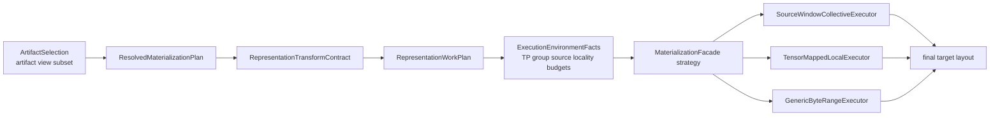
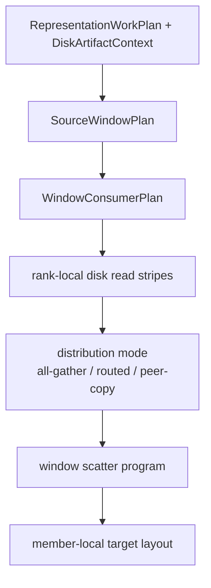

# Summary

Define a TensorCast-native TP source-window collective realization strategy.

The goal is to make TensorCast match the loading shape that wins in
InstantTensor-style systems while preserving TensorCast's artifact-centered
architecture:

- source identity, views, target layout, and runtime representation semantics
  remain TensorCast artifact realization facts;
- strategy selection remains inside `MaterializationFacade`;
- source-window ownership, striping, batching, collective distribution, and
  scatter are executor-private planning artifacts;
- vLLM and other framework integrations provide placement, target layout, and
  runtime host facts, but do not own a parallel loader or data path.

This design introduces one executor family:

- `SourceWindowCollectiveExecutor`

The executor reads safetensors or compatible disk sources in source-order
windows, stripes each source window across the TP group, distributes the window
payload through GPU collectives, and scatters only the needed slices into each
member's final target layout.

It is not a new public SDK API. It is an execution strategy under the unified
artifact realization model.

# Problem Statement

Recent Qwen3 TP=8 measurements show that the current TensorCast loader is
functionally correct but not competitive with InstantTensor.

Observed with daemon startup excluded:

| Model | Loader | Storage | Weight load | LOAD_DONE |
| --- | ---: | ---: | ---: | ---: |
| Qwen3-30B-A3B-Instruct-2507 | InstantTensor | SSD cold | 10.43s | 33.06s |
| Qwen3-30B-A3B-Instruct-2507 | TensorCast | SSD cold | 26.20s | 58.98s |
| Qwen3-235B-A22B-Instruct-2507 | InstantTensor | SSD cold | 70.69s | 105.86s |
| Qwen3-235B-A22B-Instruct-2507 | TensorCast | SSD cold | 151.59s | 186.97s |

The profile points to source-read execution shape, not daemon startup, GPU copy,
or metadata planning:

- 30B mapped target:
  - target bytes per rank: `7,680,585,728`
  - tensor destination bytes per rank: `7,529,590,784`
  - tensor source read bytes per rank: `25,145,667,584`
  - read amplification: `3.34x`
  - `collective_eligible=0`
- 235B mapped target:
  - target bytes per rank: `58,959,618,128`
  - tensor destination bytes per rank: `57,973,955,584`
  - tensor source read bytes per rank: `195,966,557,184`
  - read amplification: `3.38x`
  - `collective_eligible=0`

The current path is target-slice first:

1. each TP rank receives a mapped target layout;
2. the local mapped executor tries to directly materialize that rank's target
   bytes;
3. many dim1 and rect2d slices read full source rows to extract a smaller
   column slice;
4. cross-rank source-window dedup does not occur for this workload;
5. owner-file collective admits almost no useful replicated payload.

InstantTensor's winning shape is source-window first:

1. build a source-offset-ordered chunk stream from safetensors tensor offsets;
2. split each chunk across the TP group;
3. each rank reads only its share of the chunk;
4. use NCCL to distribute the chunk to the group;
5. each rank consumes the tensors or slices it needs.

TensorCast should adopt that execution shape inside its own realization model.

# Decision

Create `SourceWindowCollectiveExecutor` as the primary TP shared-source cold
start executor for safetensors-backed target-set realization.

The executor is selected by the existing strategy seam and consumes existing
semantic truth:



The executor's internal plan is source-window oriented and distribution-mode
aware:



Normative rules:

1. Source-window planning is executor-private. It must not enter
   `ArtifactSelection`, public SDK, or durable artifact identity.
2. The strategy plane owns whether this executor is selected.
3. The executor must consume `RepresentationWorkPlan`; it must not recover
   tensor semantics from ad hoc tensor names or framework-specific conventions.
4. `ByteRangeMap` remains the residual fallback and explainability surface, not
   the primary plan for this executor.
5. Host-local SSD, shared filesystem, tmpfs, and remote source decisions remain
   cost-model decisions. No filesystem name should force a path by itself.
6. The implementation does not need to preserve old experimental behavior. When
   the new executor is proven, obsolete owner-file and local-mapped fallbacks
   should be deleted or narrowed rather than maintained indefinitely.

# Ownership And Existing Design Alignment

## `0108` strategy plane

`0108` remains the owner of:

- semantic truth placement,
- source acquisition,
- execution environment facts,
- executor selection,
- lane allocation,
- no implicit fallback after an explicit lane is selected.

This design adds one strategy candidate and one source-bound execution mode. It
does not move strategy into `collective_disk_loader.cc`.

## `0109` collective executor

`0109` remains the owner of collective executor policy for same-host TP
realization. Its existing owner-file executor is not deleted by this design, but
its role narrows:

- owner-file collective is a tensor-job owner batching strategy;
- source-window collective is the preferred shape when source-window striping
  and window scatter have a lower cost than owner-file tensor-job execution;
- both are collective executors under the same strategy plane.

The long-term collective section should be understood as "source-ownership
collective executors", where owner-file batching and source-window striping are
two execution strategies.

## `0110` representation semantic core

`0110` remains the semantic source of truth. Source-window collective must
consume `RepresentationTransformContract` and `RepresentationWorkPlan`.

The executor may lower those contracts into:

- source windows,
- window slices,
- scatter operations,
- fill operations,
- residual fallback ranges.

Those lowerings are volatile execution plans, not semantic truth.

## `0115` composite materialization

`0115` owns the generic composite execution contract below the strategy seam.
This design extends the consumer set of that contract to GPU target-set
realization:

- source-window read batches are composite source operations;
- scatter into final target layout is a composite target write;
- future RDMA or remote source-window variants must reuse the same seam rather
  than adding profile-private transport APIs.

The first implementation may live in `collective_disk_loader.cc`, but the
target direction is a shared dataplane primitive that can be reused by ordinary
mapped target, binding, TensorDict, and runtime attachment paths.

## `0121` realization kernel

`0121` remains the long-term owner of target-set realization. TP is a target
set:

- each member has a member-local target layout and device;
- the group has one realization strategy;
- the result has one group report;
- framework integration observes one runtime attachment or binding projection
  per member.

Source-window collective is a strategy of that target-set realization, not a
separate TP loader.

# Core Concepts

## Source Window

A source window is a contiguous interval in a single source file:

```cpp
struct SourceWindow {
  uint32_t source_index;
  uint64_t source_offset;
  uint64_t source_bytes;
  uint64_t useful_payload_bytes;
};
```

Windows are built from typed representation work, not from raw destination byte
ranges alone. They may merge nearby source spans when:

- the gap is under a configured byte limit;
- the amplification ratio stays under a configured limit;
- the result fits the configured window cap;
- the resulting scatter program remains bounded.

## Window Striping

For a TP group of size `N`, a window is divided into `N` rank-local read
stripes. Rank `r` reads:

```text
[window_start + stripe_start(r), window_start + stripe_end(r))
```

The default stripe policy should be balanced by byte count and page alignment.
It may use a single owner for small windows when collective startup cost would
dominate.

## Window Distribution

After rank-local read, the group distributes stripes into a complete or
partially complete group-visible window buffer.

The executor must make distribution an explicit part of the source-window plan,
not a hardcoded all-gather side effect. Each window records which rank consumes
which source intervals and which producer rank owns each interval after
striping.

The executor may select among:

- `ncclAllGather` for equal padded stripe sizes;
- `send/recv` or broadcast groups for irregular windows;
- peer-copy on same-host NVLink when it has better measured cost;
- a later communicator-backed collective when the communicator topology model
  owns that route.

The first implementation may use full-window all-gather because it is the
closest InstantTensor-equivalent shape and easiest to validate. It is not the
end-state abstraction. The plan must retain enough consumer-span information
to replace full-window all-gather with routed distribution without changing
artifact, vLLM, or public SDK interfaces.

Distribution modes:

| Mode | Shape | When to use |
| --- | --- | --- |
| `FullWindowAllGather` | every rank receives the whole window | MVP, large windows, low implementation risk, NVLink-rich same-host TP |
| `ConsumerRouted` | producer ranks send only intervals consumed by each target rank | when target layout knowledge materially reduces peer bytes |
| `HybridWindow` | all-gather dense subranges and route sparse subranges | mixed full/dim0/dim1/rect2d windows |
| `LocalOnly` | no peer transfer | TP=1, tiny windows, or windows consumed only by the producing rank |

The cost model decides per executor run and may later decide per window. It
must account for both peer bytes and peer waste. TensorCast should use its
source and target layout knowledge to beat the InstantTensor-equivalent
all-gather shape when routed distribution is clearly cheaper.

## Scatter Program

The scatter program maps source-window offsets to target writes:

```cpp
struct WindowScatterOp {
  uint32_t consumer_rank;
  uint64_t window_offset;
  uint64_t target_storage_index;
  uint64_t target_offset;
  uint64_t bytes;
  uint64_t src_pitch_bytes;
  uint64_t dst_pitch_bytes;
  uint64_t rows;
};
```

The distribution plan uses consumer spans, not tensor names:

```cpp
struct WindowConsumerSpan {
  uint32_t consumer_rank;
  uint64_t window_offset;
  uint64_t bytes;
};

enum class WindowDistributionMode {
  kFullWindowAllGather,
  kConsumerRouted,
  kHybridWindow,
  kLocalOnly,
};
```

The scatter program owns:

- contiguous copies;
- dim0 slices;
- dim1 slices;
- rect2d slices;
- concat fragments when represented by the work plan;
- fill and pad local work where needed.

For dim1 and rect2d, the plan must avoid per-row disk reads. It may read a
larger coalesced source window and scatter selected columns to the target.

## Cost Model

The strategy planner must compare at least these candidates:

- `GenericByteRangeExecutor`
- `TensorMappedLocalExecutor`
- `OwnerFileCollectiveExecutor`
- `SourceWindowCollectiveExecutor`

The source-window candidate estimate includes:

| Metric | Meaning |
| --- | --- |
| `window_source_bytes` | source bytes read by all ranks combined |
| `rank_read_bytes_max` | maximum source bytes read by one rank |
| `useful_payload_bytes` | bytes that actually feed target or typed work |
| `read_amplification` | `window_source_bytes / useful_payload_bytes` |
| `peer_transfer_bytes` | bytes transferred through NCCL or peer copy |
| `peer_useful_bytes` | peer bytes consumed by target scatter |
| `peer_waste_bytes` | peer bytes delivered but not consumed |
| `scatter_bytes` | target bytes written by scatter |
| `peak_temporary_bytes` | max per-rank staging memory |
| `window_count` | number of source windows |
| `scatter_op_count` | number of target scatter ops |
| `distribution_mode` | selected distribution mode or mixed-mode summary |
| `residual_bytes` | bytes not handled by source-window executor |

Eligibility requires:

- disk source with usable safetensors or canonical source index;
- TP collective group hint or target-set group facts;
- complete target layout and representation work plan;
- bounded temporary memory;
- residual policy satisfied;
- estimated cost lower than local mapped or generic alternatives.

# Execution Modes

This design adds two source-bound execution modes:

- `kSourceWindowCollective`
- `kSourceWindowCollectiveMixed`

`kSourceWindowCollective` requires the source-window executor to handle all
data bytes admitted by the work plan, with only typed local pad/fill allowed.

`kSourceWindowCollectiveMixed` allows:

- source-window collective lane,
- local typed lane,
- generic residual lane,
- deferred typed lane.

The mixed mode is the long-term default once correctness and performance are
proven. Strict pure mode remains useful for benchmarks and fail-fast validation.

# Runtime Flow

## Ordinary disk TensorDict path

1. Integration builds rank-local trace and target selection as it does today.
2. Daemon resolves disk artifact metadata and source index.
3. `MaterializationFacade` builds an `ExecutionStrategyPlan`.
4. If source-window collective wins the cost model, the plan selects
   `SourceWindowCollectiveExecutor`.
5. `collective_disk_loader` or its successor group executor joins the TP group.
6. The group builds one source-window plan from the shared representation work
   and validates a plan hash across ranks before mutating targets.
7. Ranks execute windows in source order.
8. Each rank scatters to its own target allocation or TensorDict backing.
9. The commit report records actual source bytes, peer bytes, scatter bytes,
   fallback bytes, and selected executor.

## Mapped target and binding path

1. Controller builds `ResolvedMaterializationPlan` and
   `RepresentationWorkPlan`.
2. Source-bound strategy admits source-window collective before local mapped
   execution when the group facts are present.
3. The executor writes directly into `IntoTargetLayout`.
4. If mixed mode is selected, residual bytes are explicit in the lane plan.
5. Strict mode must fail before expensive local mapped or generic execution.

# Diagnostics

The executor must emit a structured summary for every run:

```text
source_window_collective_plan
  artifact_id=...
  group_id=...
  tp_size=...
  windows=...
  source_window_bytes=...
  useful_payload_bytes=...
  read_amplification=...
  rank_read_bytes_max=...
  peer_transfer_bytes_estimate=...
  scatter_ops=...
  residual_bytes=...
  peak_temporary_bytes=...
  selection_reason=...

source_window_collective_timings
  plan_sec=...
  read_sec=...
  collective_sec=...
  scatter_sec=...
  total_sec=...
  actual_source_read_bytes=...
  actual_peer_transfer_bytes=...
  actual_target_write_bytes=...
```

The public or operator-facing report should extend existing collective metrics
instead of adding a second diagnostics path:

- `collective_unique_source_bytes`
- `collective_peer_transfer_bytes`
- `collective_peak_temporary_bytes`
- `collective_batch_count`
- `collective_dedup_saving_bytes`
- `source_window_read_amplification`
- `source_window_count`
- `source_window_scatter_ops`
- `dominant_executor=SourceWindowCollectiveExecutor`

# Configuration

Add typed config under `engine.materialization_strategy`.

Proposed fields:

```yaml
engine:
  materialization_strategy:
    enable_source_window_collective: true
    source_window_collective_batch_bytes: 512MB
    source_window_collective_max_gap_bytes: 256KB
    source_window_collective_max_amplification: 2
    source_window_collective_max_scatter_ops_per_window: 4096
    source_window_collective_peak_bytes_budget: 4GB
    source_window_collective_min_saving_bytes: 512MB
    source_window_collective_max_peer_to_read_ratio: 8
    source_window_collective_distribution: auto
    source_window_collective_allow_mixed_residual: true
```

No environment variable should be the canonical strategy switch.

Since the project is not online yet, backward-compatible aliases are not a
requirement. The implementation should prefer clean typed names and delete old
experimental knobs once the replacement is proven.

# Expected Performance Contract

The executor is accepted only if it changes the measured shape.

For the Qwen3 TP=8 SSD-cold benchmarks:

- 30B target:
  - TensorCast weight load should move from `26.20s` toward InstantTensor's
    `10.43s`;
  - source read amplification should drop from `3.34x` to no more than `1.2x`
    for the source-window lane;
  - `LOAD_DONE` should improve materially, not only the isolated executor time.
- 235B target:
  - TensorCast weight load should move from `151.59s` toward InstantTensor's
    `70.69s`;
  - source read amplification should drop from `3.38x` to no more than `1.2x`
    for the source-window lane.

Correctness acceptance:

- deterministic generation output must match default and InstantTensor for the
  30B prompt already used in the benchmark;
- 235B TensorCast must produce coherent generation after the new executor;
- tensor parity tests must cover full, dim0, dim1, rect2d, concat, pad, and
  mixed residual cases.

# Non-Goals

- Do not add a vLLM-private loader.
- Do not expose source-window plans in public SDK or persistent artifact
  metadata.
- Do not preserve old experimental owner-file or local-mapped behavior once the
  new executor supersedes it.
- Do not hardcode Qwen3, MoE, tensor names, file counts, or TP=8.
- Do not use daemon startup time to hide data path regressions.
- Do not implement per-row packed rect2d reads as the main strategy. That was
  measured and regressed due to tiny reads.

# Open Questions

1. The first implementation can use NCCL all-gather with padded equal stripes,
   but the plan representation must already carry consumer spans so routed
   distribution can land without changing the public or integration boundary.
2. The first scatter implementation can use H2D and `cudaMemcpy2DAsync` from
   a full window buffer. A later implementation may use GPU kernels for more
   complex packed scatter.
3. Ordinary TensorDict and mapped binding may share one executor immediately,
   or the mapped target path may land first because the current performance
   regression is there.
4. Host-local SSD defaulting should remain cost-model driven. The design does
   not assume source-window collective always wins on local SSD.
