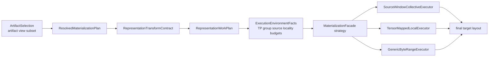
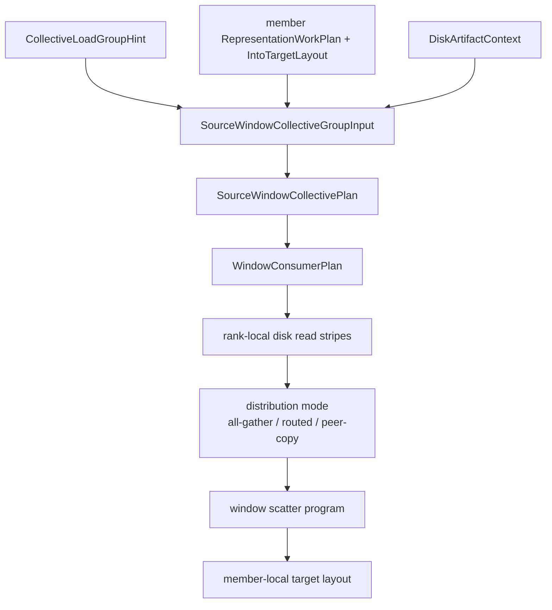

# Summary

Define a TensorCast-native TP source-window collective realization strategy.

The goal is to make TensorCast match the source-window-first loading shape
while preserving TensorCast's artifact-centered architecture:

- source identity, views, target layout, and runtime representation semantics
  remain TensorCast artifact realization facts;
- strategy selection remains inside `MaterializationFacade`;
- source-window ownership, striping, batching, collective distribution, and
  scatter are executor-private planning artifacts;
- vLLM and other framework integrations provide placement, target layout, and
  runtime host facts, but do not own a parallel loader or data path.

This design introduces one executor family:

- `SourceWindowCollectiveExecutor`

The executor reads safetensors or compatible disk sources in source-order
windows, stripes each source window across the TP group, distributes the window
payload through GPU collectives, and scatters only the needed slices into each
member's final target layout.

It is not a new public SDK API. It is an execution strategy under the unified
artifact realization model.

# Problem Statement

Recent Qwen3 TP=8 measurements show that the current TensorCast loader is
functionally correct but not yet within the target cold-start envelope.

Observed with daemon startup excluded:

| Model | Loader | Storage | Weight load | LOAD_DONE |
| --- | ---: | ---: | ---: | ---: |
| Qwen3-30B-A3B-Instruct-2507 | Source-window-first baseline | SSD cold | 10.43s | 33.06s |
| Qwen3-30B-A3B-Instruct-2507 | TensorCast | SSD cold | 26.20s | 58.98s |
| Qwen3-30B-A3B-Instruct-2507 | TensorCast source-window strict/direct | SSD cold | 23.40s | 55.43s |
| Qwen3-30B-A3B-Instruct-2507 | TensorCast source-window strict/direct read-ahead | SSD cold | 21.27s | 52.81s |
| Qwen3-30B-A3B-Instruct-2507 | TensorCast source-window strict/direct persistent readers | SSD cold | 21.43s | 53.86s |
| Qwen3-30B-A3B-Instruct-2507 | TensorCast source-window strict/direct persistent read pump | SSD cold | 20.72s | 52.86s |
| Qwen3-30B-A3B-Instruct-2507 | TensorCast source-window strict/direct direct-to-pinned | SSD cold | 18.94s | 50.67s |
| Qwen3-30B-A3B-Instruct-2507 | TensorCast source-window participant copy-elision | SSD cold | 17.75s | 50.76s |
| Qwen3-30B-A3B-Instruct-2507 | TensorCast source-window historical HybridWindow 4GB routed gate | SSD cold | 19.22s | 52.18s |
| Qwen3-30B-A3B-Instruct-2507 | TensorCast source-window planner index-cache | SSD cold | 19.07s | 51.78s |
| Qwen3-30B-A3B-Instruct-2507 | TensorCast source-window source-index preparse overlap | SSD cold | 18.79s | 49.28s |
| Qwen3-30B-A3B-Instruct-2507 | TensorCast source-window plan-hash v2 | SSD cold | 17.74s | 51.40s |
| Qwen3-30B-A3B-Instruct-2507 | TensorCast source-window window-builder reserve fix | SSD cold | 17.29s | 49.93s |
| Qwen3-30B-A3B-Instruct-2507 | TensorCast source-window storage-span member cache | SSD cold | 17.36s | 49.87s |
| Qwen3-30B-A3B-Instruct-2507 | TensorCast source-window resolve context cache | SSD cold | 17.38s | 49.60s |
| Qwen3-30B-A3B-Instruct-2507 | TensorCast source-window local-read metrics inline | SSD cold | 17.36s | 48.99s |
| Qwen3-30B-A3B-Instruct-2507 | TensorCast source-window multi-slot read-ahead, 4 slots | SSD cold | 16.81s | 51.10s |
| Qwen3-30B-A3B-Instruct-2507 | TensorCast source-window multi-slot read-ahead, 8 slots | SSD cold | 16.87s | 48.98s |
| Qwen3-30B-A3B-Instruct-2507 | TensorCast source-window shared request refs, 8 slots | SSD cold | 16.83s | 48.59s |
| Qwen3-30B-A3B-Instruct-2507 | TensorCast source-window data-only coverage proof | SSD cold | 16.74s | 49.54s |
| Qwen3-30B-A3B-Instruct-2507 | TensorCast source-window target-storage fast path | SSD cold | 16.83s | 49.61s |
| Qwen3-30B-A3B-Instruct-2507 | TensorCast source-window HybridWindow 64MB routed gate | SSD cold | 17.60s | 48.49s |
| Qwen3-30B-A3B-Instruct-2507 | TensorCast source-window forced ConsumerRouted | SSD cold | 17.61s | 50.07s |
| Qwen3-30B-A3B-Instruct-2507 | TensorCast source-window HybridWindow packed routed | SSD cold | 17.02s | 49.23s |
| Qwen3-30B-A3B-Instruct-2507 | TensorCast source-window ConsumerRouted packed | SSD cold | 17.53s | 47.81s |
| Qwen3-30B-A3B-Instruct-2507 | TensorCast ConsumerRouted delayed-pack experiment (rejected) | SSD cold | 17.24s | 50.36s |
| Qwen3-30B-A3B-Instruct-2507 | TensorCast source-window call-profile instrumentation | SSD cold | 16.77s | 49.29s |
| Qwen3-30B-A3B-Instruct-2507 | TensorCast source-window vLLM outer-profile instrumentation | SSD cold | 16.80s | 49.80s |
| Qwen3-30B-A3B-Instruct-2507 | TensorCast source-window source-catalog manifest fast path | SSD cold | 16.36s | 50.09s |
| Qwen3-30B-A3B-Instruct-2507 | TensorCast source-window metadata-fingerprint fast path, warm recipe cache | SSD cold | 16.23s | 51.90s |
| Qwen3-30B-A3B-Instruct-2507 | TensorCast source-window prepared full-window, 8 slots | SSD cold | 14.69s | 48.59s |
| Qwen3-30B-A3B-Instruct-2507 | TensorCast source-window prepared source-handle reuse full-window, 8 slots | SSD cold | 14.63s | 47.27s |
| Qwen3-30B-A3B-Instruct-2507 | TensorCast source-window plan-cache-off, prepared full-window | SSD cold | 13.78s | 49.05s |
| Qwen3-30B-A3B-Instruct-2507 | TensorCast source-window ref group input, prepared full-window | SSD cold | 12.97s | 52.81s |
| Qwen3-30B-A3B-Instruct-2507 | TensorCast source-window prepared consumer-routed, 8 slots | SSD cold | 15.59s | 49.93s |
| Qwen3-30B-A3B-Instruct-2507 | TensorCast source-window prepared consumer-routed deferred 2D pack, 8 slots | SSD cold | 14.99s | 51.32s |
| Qwen3-30B-A3B-Instruct-2507 | TensorCast source-window prepared hybrid-window, 8 slots | SSD cold | 15.04s | 55.71s |
| Qwen3-30B-A3B-Instruct-2507 | TensorCast source-window ConsumerRouted experiment | SSD cold | 23.10s | 56.72s |
| Qwen3-30B-A3B-Instruct-2507 | TensorCast ConsumerRouted compiled+batched, serial program build | SSD cold | 17.95s | 53.44s |
| Qwen3-30B-A3B-Instruct-2507 | TensorCast ConsumerRouted compiled+batched, parallel program build | SSD cold | 13.71s | 48.53s |
| Qwen3-30B-A3B-Instruct-2507 | TensorCast ConsumerRouted compiled+batched, same-daemon hot | SSD cold | 11.54s | 33.92s |
| Qwen3-30B-A3B-Instruct-2507 | TensorCast typed config ConsumerRouted, logfix load 1 | SSD cold | 13.96s | 47.80s |
| Qwen3-30B-A3B-Instruct-2507 | TensorCast typed config ConsumerRouted, logfix same-daemon load 2 | SSD cold | 11.74s | 35.06s |
| Qwen3-30B-A3B-Instruct-2507 | TensorCast typed config ConsumerRouted, load 1 | JFS cold | 11.68s | 44.97s |
| Qwen3-30B-A3B-Instruct-2507 | TensorCast typed config ConsumerRouted, same-daemon load 2 | JFS cold | 7.44s | 31.86s |
| Qwen3-30B-A3B-Instruct-2507 | TensorCast typed config ConsumerRouted buffered, load 1 | tmpfs resident | 7.62s | 42.67s |
| Qwen3-30B-A3B-Instruct-2507 | TensorCast typed config ConsumerRouted buffered, same-daemon load 2 | tmpfs resident | 4.28s | 28.07s |
| Qwen3-235B-A22B-Instruct-2507 | Source-window-first baseline | SSD cold | 70.69s | 105.86s |
| Qwen3-235B-A22B-Instruct-2507 | TensorCast | SSD cold | 151.59s | 186.97s |
| Qwen3-235B-A22B-Instruct-2507 | TensorCast source-window strict/direct | SSD cold | 121.38s | 154.28s |
| Qwen3-235B-A22B-Instruct-2507 | TensorCast source-window strict/direct read-ahead | SSD cold | 115.08s | 146.93s |
| Qwen3-235B-A22B-Instruct-2507 | TensorCast source-window strict/direct persistent readers | SSD cold | 109.88s | 141.43s |
| Qwen3-235B-A22B-Instruct-2507 | TensorCast source-window strict/direct persistent read pump | SSD cold | 109.96s | 141.77s |
| Qwen3-235B-A22B-Instruct-2507 | TensorCast source-window strict/direct direct-to-pinned | SSD cold | 94.28s | 128.41s |
| Qwen3-235B-A22B-Instruct-2507 | TensorCast source-window full-window all-gather current control | SSD cold | 88.52s | 119.79s |
| Qwen3-235B-A22B-Instruct-2507 | TensorCast source-window multi-slot read-ahead, 8 slots | SSD cold | 87.17s | 118.95s |
| Qwen3-235B-A22B-Instruct-2507 | TensorCast source-window ref group input, prepared full-window | SSD cold | 79.67s | 121.57s |
| Qwen3-235B-A22B-Instruct-2507 | TensorCast source-window HybridWindow 64MB routed gate | SSD cold | 89.10s | 126.17s |
| Qwen3-235B-A22B-Instruct-2507 | TensorCast ConsumerRouted compiled+batched, parallel program build | SSD cold | 80.90s | 116.98s |
| Qwen3-235B-A22B-Instruct-2507 | TensorCast ConsumerRouted compiled+batched, same-daemon hot | SSD cold | 76.84s | 104.74s |

Experiment evidence summary:

- Metadata feasibility matches the measured local-mapped read profile closely:
  estimated/profile read bytes are within about `1.005x` for both 30B and
  235B, so the source-window planning model is representative enough to guide
  the implementation.
- Source-window disk read volume drops to nearly one model payload per TP
  group: 30B read/rank moves from `25.27GB` estimated local-mapped reads to
  `7.63GB` source-window reads (`0.302x`), and 235B moves from `196.85GB` to
  `58.77GB` (`0.299x`).
- Rank-striped IO smoke tests show the storage shape is viable before NCCL and
  scatter are added: 30B reads `61.06GB` in `9.96s` (`6.13GB/s` wall), and
  235B reads `470.19GB` in `71.50s` (`6.58GB/s` wall).
- Runtime validation confirms the design direction. Prepared full-window runs
  reach `12.97s` weight load on 30B and `79.67s` on 235B; compiled routed plus
  batched scatter reaches `13.71s` first-load and `11.54s` same-daemon hot on
  30B, and `80.90s` first-load / `76.84s` same-daemon hot on 235B.
- The main remaining limits are not source metadata parsing or group assembly.
  The retained diagnostics point to group-level prepared realization, full-window
  peer waste, and routed pack/scatter operation density. Real WorkPlan gates
  estimate full-window scatter copy launches can drop from `151,685` to
  `3,605` on 30B and from `303,223` to `28,181` on 235B if batching preserves
  copy-engine-like bandwidth.
- Rejected experiments are part of the design boundary: rank-local cache
  singleflight, generic per-rank preparse, stream-ordered all-gather/scatter,
  simple adjacent-span coalescing, and reorder-only routed packing did not move
  the dominant path enough to justify new abstractions.

Rejected 30B follow-ups: `representation_transform_builder` reserve variants
measured `17.70s/50.83s` and `17.68s/49.21s`, did not reduce
`representation_realization_plan` beyond noise, and were reverted. They confirm
that small per-rank builder capacity tweaks are not the remaining acceptance
lever.

The latest rank-local cache singleflight validation is also not a throughput
lever. With 30B TP=8 SSD cold, all ranks reported
`mapped_plan_cache_hit=0`, `mapped_plan_cache_waited=0`,
`execution_template_cache_hit=0`, and `execution_template_cache_waited=0`.
The run measured `17.06s` weight load / `50.40s` `LOAD_DONE`, slower than the
current all-gather control. This confirms that the current cache keys are
rank-local because they include target layout/index and topology facts; repeated
planning has to be removed through group-level prepared realization, not by
coalescing same-key rank-local cache misses.

The latest source-window admission cleanup is a real first-load win. Profiling
showed that prebuild group-plan cache-key construction cost `1.07s` on the
leader because it re-walked 150k WorkPlan fragments; compact key encoding only
reduced this to `1.01s`, so the default first-load path now skips that cache
lookup and keeps group-plan cache as explicit repeated-load behavior. The
runtime group input also now carries shared immutable `RepresentationWorkPlan`
and `IntoTargetLayout` references into `SourceWindowCollectiveMemberInput`.
The 30B TP=8 SSD cold rerun measured `12.97s` weight load / `52.81s`
`LOAD_DONE`, with `key_sec=0`, `input_sec=0.00033s`, `plan_sec=0.862s`, and
source-window runtime `read=7.37s,total=9.50s`. The matching 235B rerun measured
`79.67s` / `121.57s`, with `input_sec=0.000039s`, `plan_sec=1.61s`, and
runtime `read=62.57s,total=72.60s`. The remaining control-plane target is not
more cache-key encoding; it is group-level prepared realization and template
reuse for the rank-local `prepare_plan_sec`/`prepare_execution_sec` band.

The latest routed-distribution validation is a mixed but useful result. Runtime
now has bounded per-pair packing for ConsumerRouted windows: small remote pieces
are copied into producer-side pack staging, transferred with one NCCL send/recv
per producer-consumer pair, then scattered from consumer-side receive staging.
This keeps the source-window group plan as the authority and changes only the
runtime distribution primitive. On 30B TP=8 SSD cold, HybridWindow packed routed
measured `17.02s` / `49.23s`; it routed only `1/115` windows and therefore could
not materially change the full path. Forced ConsumerRouted packed measured
`17.53s` / `47.81s`, with peer transfer reduced to `53.75GB` but
`scatter_issue=6.18s`, `routed_pack_ops=142917`, and
`routed_packed_pairs=25105`. This proves peer bytes are no longer the limiter in
routed mode; the next routed step must reduce GPU pack/scatter operation count,
not add more NCCL pair packing.
Correctness was also checked with the same 30B prompt used for previous
TensorCast validation; ConsumerRouted packed returned a coherent Chinese answer
and `finish_reason=stop`.

A follow-up delayed-pack ConsumerRouted experiment delayed small linear remote
pack pieces until after span collection, then sorted/coalesced them before
writing the producer-consumer pack stage. It was rejected and reverted. On 30B
TP=8 SSD cold it measured `17.24s` / `50.36s`, with runtime total still
`9.95s`. It affected only `4275` pending linear pack pieces (`732MB`) and
coalesced them to `4212`, while total `routed_pack_ops` remained `142854`.
This proves the current routed limiter is not linear-piece ordering; it is the
dominant 2D packed path and final packed scatter. The next routed improvement
must be a batched GPU pack/scatter kernel or a different distribution shape,
not another small coalescing pass.

The source-window group call-profile instrumentation splits each rank's
collective loader call into request preparation, group-state lookup, assemble
wait, leader execution, follower result wait, and total time. The 30B TP=8 SSD
cold profile rerun measured `16.77s` / `49.29s`. The leader spent `10.82s` in
execution, composed of `1.13s` group plan/admission plus `9.49s` runtime. The
followers waited for that same result; group assemble skew was only
`0.035-0.232s`. This proves group join mechanics are not the remaining
performance lever. The next control-plane work must remove repeated
rank-local source-bound realization before the group call; the next data-plane
work must reduce the leader runtime or routed scatter operation count.

The vLLM outer-profile instrumentation then split the startup path around
TensorCast artifact realization. The 30B TP=8 SSD cold rerun measured
`16.80s` / `49.80s`. Fast stages such as runtime host/context/placement/spec
construction, source selector resolution, plan selection, and attachment are all
below milliseconds to tens of milliseconds. The non-trivial outer work is
`startup.from_disk=1.53-1.86s`,
`local_ready.prepare.build_source_catalog=1.06-1.12s`, and
`local_ready.prepare.build_recipe=0.46-0.48s` per rank before the daemon refill
path finishes. This makes source catalog and recipe/template preparation a
real optimization target, but still within the TensorCast artifact/runtime
model. It should be solved by stronger source catalog identity, recipe
template reuse, and group-prepared realization, not by adding a vLLM-private
loader branch.

The follow-up source-catalog fast path reuses the daemon-attested
`PublicDiskSourceHandle.canonical_index_bytes` when vLLM builds a TensorCast
`SourceCatalog`. This keeps source identity in the artifact model while
avoiding a per-rank safetensors header rescan. The 30B TP=8 SSD cold rerun
measured `16.36s` / `50.09s`, and reduced
`local_ready.prepare.build_source_catalog` from `1.06-1.12s` to `0.49-0.52s`.
The next TensorCast-side fingerprint fast path treats the canonical index hash
plus selected-file facts as the source metadata fingerprint identity when
canonical identity is present. The first run after the cache-key change exposed
a true cold recipe compile cost (`build_recipe=5.18s`, `weight_load=22.06s`);
the warm-cache rerun measured `16.23s` / `51.90s`, with
`build_source_catalog=0.46s` and `build_recipe=0.48s`. This validates the
control-plane optimization but also shows the higher-return design problem:
prepared recipe/cache lifecycle must become explicit artifact state instead of
being rediscovered in every rank on the load path.

The profile points to source-read execution shape, not daemon startup, GPU copy,
or metadata planning:

- 30B mapped target:
  - target bytes per rank: `7,680,585,728`
  - tensor destination bytes per rank: `7,529,590,784`
  - tensor source read bytes per rank: `25,145,667,584`
  - read amplification: `3.34x`
  - `collective_eligible=0`
- 235B mapped target:
  - target bytes per rank: `58,959,618,128`
  - tensor destination bytes per rank: `57,973,955,584`
  - tensor source read bytes per rank: `195,966,557,184`
  - read amplification: `3.38x`
  - `collective_eligible=0`

The current path is target-slice first:

1. each TP rank receives a mapped target layout;
2. the local mapped executor tries to directly materialize that rank's target
   bytes;
3. many dim1 and rect2d slices read full source rows to extract a smaller
   column slice;
4. cross-rank source-window dedup does not occur for this workload;
5. owner-file collective admits almost no useful replicated payload.

The target loading shape is source-window-first:

1. build a source-offset-ordered chunk stream from safetensors tensor offsets;
2. split each chunk across the TP group;
3. each rank reads only its share of the chunk;
4. use NCCL to distribute the chunk to the group;
5. each rank consumes the tensors or slices it needs.

TensorCast should adopt that execution shape inside its own realization model.

Current implementation evidence:

- The production group plan builder consumes real `RepresentationWorkPlan`,
  `IntoTargetLayout`, `DiskArtifactContext`, source index digest, and TP group
  facts. No tensor-name classifier or vLLM-private loading branch is required.
- Strict source-window execution now reaches zero residual bytes on the tested
  30B and 235B TP=8 mapped-target runs and fails before target publication if
  group final admission cannot prove that shape.
- Fast-prep planning avoids byte-range map construction and source-layout map
  composition for strict source-window, reducing the earlier 30B runtime
  planning bottleneck from about `52.87s` weight load to `23.40s`.
- The remaining performance gap is the data plane. `FullWindowAllGather`
  removes disk read amplification but is not the final distribution mode for
  235B: it transfers `3.29TB` across peers with `2.88TB` waste. The design
  therefore keeps consumer spans and distribution mode in the group plan so
  coalesced/cost-gated `ConsumerRouted` or `HybridWindow` can be implemented
  without changing the artifact or vLLM boundary.
- Multi-slot host read-ahead is now implemented for source-window runtime.
  It preserves ordered GPU issue into each staging slot while letting host
  reads run ahead across up to 8 slots. This improves the current 30B
  source-window band to `16.81s` weight load and gives 235B a best measured
  `87.17s`/`118.95s`. The 235B runtime data plane reads 470.19GB in `72.24s`,
  about `6.51GB/s`, close to the measured SSD O_DIRECT ceiling, so deeper read
  queueing is useful but no longer the main remaining lever.
- The source-window reader now uses persistent per-rank reader workers instead
  of creating one thread per rank per chunk. This improves 235B from
  `115.08s` to `109.88s` and runtime read time from `94.55s` to `90.21s`.
  The 30B max-rank weight time is neutral/noisy (`21.43s` versus the earlier
  best `21.27s`), but runtime total still improves slightly.
- The read-ahead coordinator now uses one persistent pump thread instead of
  creating one `std::async` task per chunk. This improves the current 30B best
  to `20.72s` with runtime total `11.85s`. The 235B result is neutral/noisy
  (`109.96s` versus `109.88s`), so this is a small scheduling cleanup rather
  than the main remaining performance lever.
- Source-window direct mode now reads aligned `O_DIRECT` ranges directly into
  pinned host staging and adjusts the H2D source offset for unaligned
  safetensors payload starts. This removes the previous direct scratch-buffer
  copy on the hot path. 30B improves to `18.94s` max-rank weight load with
  `read=9.60s`; 235B improves to `94.28s` with `read=74.70s`, about
  `6.29GB/s` and close to the measured SSD O_DIRECT upper bound. With 128MiB
  chunks and 8-slot read-ahead, the current 235B control improves further to
  `87.17s` with runtime total `72.24s` and direct pinned-read fallback
  diagnostics explaining the remaining `1.96GB` of boundary fallback reads.
- An explicit `ConsumerRouted` runtime experiment is implemented and correct,
  but it is not a performance win yet. On 30B it reduces peer transfer from
  `427GB` to `53.7GB` and peer waste to zero, but weight load regresses to
  `23.10s` because per-span pack/scatter issue time rises to `9.76s`.
- Caching CUDA device selection in the source-window executor removes a large
  part of that routed issue overhead. 30B `ConsumerRouted` improves to
  `19.09s` max-rank weight load, with `scatter_issue` down to `5.80s`; it is
  now close to all-gather but still not clearly better. A producer-batched pack
  experiment was measured and rejected because it did not improve
  `scatter_issue` and regressed end-to-end load time. The latest forced
  ConsumerRouted rerun reaches `17.61s`/`50.07s`, but
  `routed_pack_ops=147585` and `scatter_issue=5.59s` still keep it behind the
  best all-gather/hybrid timings.
- Full-window all-gather also benefits from lazy device switching before actual
  scatter copies: 30B `scatter_issue` fell to `1.22s` and `LOAD_DONE` improved
  to `49.84s`, although max-rank weight load remained in the same noise band
  around `19.06s`.
- The same lazy-device code did not refresh the 235B best run: the rerun measured
  `98.87s`/`133.99s` because cold direct-read time was `80.05s` versus
  `74.70s` in the direct-to-pinned best. Treat it as a useful scatter profile,
  not as the new 235B best.
- `LocalOnly` is now implemented as an explicit owner-only distribution branch.
  The planner rejects local-only windows that have remote consumers, and the
  runtime reads, stages, and scatters only on the owner rank. This keeps
  local-only execution aligned with TensorCast's group plan semantics and gives
  later `HybridWindow` planning a correct local subpath without creating a new
  vLLM loader branch.
- The group planner now coalesces adjacent scatter spans before admission.
  Adjacent linear spans, horizontally adjacent 2D column spans, and vertically
  adjacent 2D row-band spans are merged only when rank, source index, target
  storage, row geometry, and exact source/target adjacency agree. This keeps
  the source-window plan hash, `source_window_scatter_op_count`, and runtime
  scatter program aligned. The row-band extension is correct but nearly neutral
  on Qwen3-30B: the HybridWindow 64MB rerun measured `17.43s`/`49.04s`, and
  runtime scatter ops moved only from about `153754` to `153714`. It is not the
  full routed/hybrid performance path; pairwise routed packing or a GPU scatter
  kernel is still needed before `ConsumerRouted` can become a default
  performance mode.
- `auto` distribution now has a conservative owner-only rule: if every planned
  window is consumed by exactly one rank, the planner selects `LocalOnly` and
  reports zero peer transfer. Any multi-rank consumer window keeps the previous
  `FullWindowAllGather` default. This completes a safe automatic LocalOnly
  admission case without promoting the still-negative `ConsumerRouted`
  experiment to default behavior.
- `HybridWindow` now has a per-window mixed-mode realization, with conservative
  routed admission. The plan stores a distribution mode per source window;
  owner-only windows use `LocalOnly`, dense multi-rank windows stay on
  `FullWindowAllGather`, and sparse multi-rank windows may use
  `ConsumerRouted` only when the consumer spans are linear/contiguous and the
  routed peer-byte saving clears `source_window_collective_min_routed_peer_saving_bytes`
  (default `64MB`). The per-window mode is part of the plan hash and runtime
  chunk dispatch. This realizes the TensorCast-side mixed-mode shape while
  keeping Qwen3 TP=8 on the benchmark-proven all-gather path until routed
  pack/scatter is coalesced or GPU-kernel backed enough to win.
- Daemon-side canonical/source index parsing now uses a bounded shared parsed
  index cache. This keeps the optimization in TensorCast's artifact metadata
  layer, not in vLLM. On the 30B SSD cold historical HybridWindow 4GB-gate run it reduced
  `prepare_source_bound_plan` mean time from `1.197s` to `0.805s` and
  `parse_source_tables` mean time from `0.626s` to `0.043s`; max-rank weight
  load moved from `19.22s` to `19.07s`, so the end-to-end impact is real but
  small compared with source-window runtime and vLLM/NCCL/bootstrap overhead.
- The same parsed-index layer now has per-key in-flight coalescing, and daemon
  source-bound prepare can preparse the physical source index before execution
  plan construction. This is still a TensorCast artifact metadata optimization:
  the vLLM loader only supplies the artifact/source facts and does not gain a
  private source-window branch. On the 30B SSD cold historical HybridWindow 4GB-gate rerun,
  `physical_source_table_preparsed=1`, `parse_source_index_sec=0`, max
  `physical_source_index_wait_sec=0.000135s`, and
  `resolved_mapped_execution_plan total_sec` max was `0.279s`. The fair loader
  timing was `18.79s`/`49.28s`, so this removes a real execution-planning cost
  but does not refresh the `17.75s` best result.
- Source-window plan hashing now reserves the expected payload size before
  appending member, window, and consumer span facts. This preserves the stable
  plan hash semantics while reducing 30B plan `hash_sec` from about `0.294s`
  to `0.278s`; total benchmark time stayed in run-to-run noise.
- Source-window plan hashing now uses a v2 execution-fact payload. It hashes
  source identity, group world size, member target layout, summary metrics, rank read
  bytes, windows, per-window distribution mode, and consumer scatter spans,
  instead of also serializing the full original `RepresentationWorkPlan` after
  those facts have been lowered into windows. The source-window planner test
  keeps hash sensitivity for source index digest, member order, target layout,
  distribution mode, and span changes. A follow-up unit test verifies that
  changing only the runtime `group_id` does not change the hash; `group_id`
  remains a group-assembly/logging fact, not a reusable execution-plan fact.
- Strict source-window mapped execution-template cache keys now apply the same
  distinction: they exclude runtime `group_id` but retain source locality,
  sharing domain, TP world size, rank, strategy config, source metadata, and
  target/materialization plan identity. This preserves TensorCast consistency
  and prepares the cache shape for explicit prepared realization without
  aliasing different rank-local target layouts. Unit coverage verifies the
  stable key ignores only `group_id`; including runtime group id still changes
  the key, and rank changes remain key-sensitive.
- The collective disk loader now treats source-window group-plan cache as an
  explicit opt-in repeated-load optimization. Admission profiling showed that
  first-load prebuild key construction re-walked 150k WorkPlan fragments and
  cost `1.07s`; compact binary key encoding only reduced that to `1.01s`.
  The default first-load path therefore skips cache-key lookup (`key_sec=0`),
  while tests can still enable cache reuse explicitly. The 30B prepared
  full-window rerun improved to `13.78s`/`49.05s`.
- Source-window group input is now ref-backed in runtime while preserving
  value-backed tests. `SourceWindowCollectiveMemberInput` can carry
  `shared_ptr<const RepresentationWorkPlan>` and
  `shared_ptr<const IntoTargetLayout>`, so final admission no longer copies
  eight large WorkPlans before building the group plan. The 30B rerun reduced
  `input_sec` from `0.255s` to `0.00033s`, `plan_sec` to `0.862s`, and
  weight load to `12.97s`.
- The v2 plan-hash payload was also measured after keeping sensitivity to
  source index digest, member order, target layout, distribution mode, and
  changed consumer-span geometry. On the 30B SSD cold
  rerun, `hash_sec` fell to `0.126s`, planner `total_sec` fell to `0.934s`,
  and group `plan_sec` fell to `1.198s`. The fair timing was
  `17.74s`/`51.40s`, so this is a retained control-plane improvement rather
  than a completed throughput fix.
- A compact binary plan-hash payload was measured and rejected. It raised 30B
  `hash_sec` to `0.565s` and plan build total to `1.388s`, so the current
  implementation keeps the text payload with explicit reserve until the plan
  builder is reorganized around cheaper structural digests.
- Replacing planner metrics `std::map` interval buckets with
  `absl::flat_hash_map` was also measured and rejected. On the 30B SSD cold
  HybridWindow run, `metrics_sec` regressed from `0.278s` to `0.430s` and
  plan build total from `1.104s` to `1.408s`. The next planner optimization
  should reduce repeated interval work, not only swap container types.
- Source-window participant copy-elision is kept: the group leader now moves
  participants out of the assembled group state, and the source-window runtime
  no longer copies `RepresentationWorkPlan`/`IntoTargetLayout` into its
  scatter-only participant view. On 30B SSD cold this moved max-rank weight
  load to `17.75s`, with `runtime_total=9.83s`.
- The source-window window builder now avoids both the intermediate grouped-span
  vector and exact-size repeated `reserve()` calls while appending consumer
  spans. The rejected one-pass variant regressed 30B `windows_sec` to `1.329s`
  because vector capacity grew linearly. The retained version uses exponential
  capacity growth, giving `windows_sec=0.368s`, planner `total_sec=0.877s`,
  group `plan_sec=1.129s`, and fair 30B SSD cold timing of `17.29s`/`49.93s`.
- The latest reserve-fix profile splits the remaining 30B max-rank load into
  `store.from_disk` max `1.693s`, `local_ready.realize.realize_from` max
  `13.546s`, and Python finalize max `0.116s`. Daemon refill max is
  `13.389s`, with `prepare_plan_sec=0.957s`, `prepare_execution_sec=0.778s`,
  and `materialize_sec=11.840s`. The materialize segment contains the
  `1.129s` group plan and `9.906s` source-window runtime, so the next control
  plane target is group admission/orchestration and artifact resolve, not a
  vLLM-private loader branch.
- Source-window group input now projects resolved target storage spans into
  `SourceWindowCollectiveMemberInput`, and the planner passes them as an
  `absl::Span` to per-item lowering. This removes per-work-item reconstruction
  from `target_layout` while keeping the public group-plan shape intact. The
  30B SSD cold rerun measured `append_sec=0.091s`, planner `total_sec=0.858s`,
  group `plan_sec=1.117s`, and fair timing `17.36s`/`49.87s`; this is retained
  as a small control-plane cleanup, not a new weight-load best.
- `ResolvePublicDiskSource` now builds mounted-source metadata through the
  shared `DiskArtifactContext` cache, whose key has been aligned with the
  mounted-source snapshot fingerprint fields (`inode`, `size`, `mtime_ns`).
  The first public resolve warms the same safetensors context that later
  materialization consumes. A 30B SSD cold rerun confirmed one resolve-time
  cache miss followed by rank-local cache hits, with `store.from_disk` average
  improving from `1.638s` to `1.307s`; max-rank weight load remained effectively
  unchanged (`17.36s`/`49.87s` to `17.38s`/`49.60s`), so the main design target
  stays runtime data movement and group orchestration.
- Source-window group metrics now collect local-mapped physical-read intervals
  during the existing window consumer-span metrics scan, instead of scanning
  raw candidate spans again for the same local-read baseline. This preserves the
  same admission values while reducing 30B planner `metrics_sec` to `0.261s`
  and group `plan_sec` to `1.095s`; the fair rerun measured
  `17.36s`/`48.99s`, so this is retained as a small planner cleanup.
- A canonical-index preparse future inside rank-local binding realization was
  measured and reverted. It made the profile report
  `canonical_index_table_preparsed=1` and reduced `prepare_plan_sec` max to
  `0.906s`, but the builder still waited `0.23-0.28s` on the future and the
  fair 30B SSD cold run regressed to `17.62s`/`50.69s`. This is evidence that
  further per-rank preparse does not reach the target cold-start envelope; the
  control-plane design should instead construct a group-level artifact
  realization plan once and derive per-rank member views from it.
- A rank-local mapped-plan and execution-template cache singleflight experiment
  was measured on 30B TP=8 SSD cold and did not help. The run reported
  `mapped_plan_cache_hit=0`, `mapped_plan_cache_waited=0`,
  `execution_template_cache_hit=0`, and `execution_template_cache_waited=0` on
  all ranks, with `17.06s` max-rank weight load and `50.40s` `LOAD_DONE`.
  Because `binding_realization_plan_cache_key(...)` includes target layout,
  target index JSON, canonical index JSON, placement, and source-window config,
  and `mapped_execution_template_cache_key(...)` also includes TP topology rank,
  these entries are not shared across TP ranks. This is a useful diagnostic
  guard for identical same-key requests, but it is not the performance path for
  Qwen3 TP source-window. The next control-plane optimization must build one
  group-level prepared realization/execution plan and derive rank-local views.
- Binding realization now reuses the canonical parsed source table when the
  effective source byte-space is identical to the canonical byte-space. This
  keeps the plan builder consistent with the artifact metadata cache and
  removes a redundant `parse_canonical_index_shared` call in the no-view path.
  The 30B HybridWindow 64MB rerun confirmed `source_table_reused=1` on all TP
  ranks, but measured `17.83s`/`49.31s`; keep it as a safe cleanup, not as a
  throughput lever.
- A stream-ordered all-gather/scatter experiment removed the explicit
  post-all-gather `synchronize_all()` and relied on the same per-rank CUDA
  streams to order scatter after NCCL. It was correct enough to complete 30B
  and 235B runs, but not faster: 30B measured `17.81s`/`50.62s`, and 235B
  measured `89.37s`/`122.39s` with the wait moving into `scatter_sync`. The
  code was reverted; the all-gather synchronization is not the remaining
  remaining cold-start gap.
- A borrowed planner member-input experiment was measured and reverted. It
  reduced `plan_sec` but regressed the vLLM-visible run to `23.30s` max-rank
  weight load, so the retained optimization avoids runtime participant copies
  without adding borrowed pointer semantics to the public group-plan input.
- Ordinary TensorDict and runtime attachment reports now project retrieval and
  execution-topology facts into the shared realization strategy report model.
  TensorDict projection is covered by
  `test_tensor_dict_realization_reports_execution_topology_policy`; direct
  runtime attachment projection is covered by
  `test_runtime_attachment_resolved_report_projects_execution_topology_options`.
  Direct runtime bind and reload pass the same materialization options used for
  daemon binding into `report_for_runtime_attachment(...)`, so framework code
  still contributes facts rather than a source-window-specific data path.
- Source-window runtime now resolves final target pointers directly from the
  planner-proven consumer `storage_index` instead of re-scanning every target
  storage span for each scatter piece. The 30B TP=8 SSD rerun hit the fast path
  for all `151985` scatter pieces and measured `16.83s`/`49.61s`, so this is a
  retained consistency cleanup but not a root performance lever.

# Decision

Create `SourceWindowCollectiveExecutor` as the primary TP shared-source cold
start executor for safetensors-backed target-set realization.

The executor is selected by the existing strategy seam and consumes existing
semantic truth:



The executor's internal plan is group-level, source-window oriented, and
distribution-mode aware:



Normative rules:

1. Source-window planning is executor-private. It must not enter
   `ArtifactSelection`, public SDK, or durable artifact identity.
2. The strategy plane owns whether this executor is selected.
3. The executor must consume `RepresentationWorkPlan`; it must not recover
   tensor semantics from ad hoc tensor names or framework-specific conventions.
4. `ByteRangeMap` remains the residual fallback and explainability surface, not
   the primary plan for this executor.
5. Host-local SSD, shared filesystem, tmpfs, and remote source decisions remain
   cost-model decisions. No filesystem name should force a path by itself.
6. The implementation does not need to preserve old experimental behavior. When
   the new executor is proven, obsolete owner-file and local-mapped fallbacks
   should be deleted or narrowed rather than maintained indefinitely.
7. The source-window plan builder is a TP group planner. A rank-local planner
   may produce a candidate summary, but final admission must happen with all
   group members, their devices, work plans, and target layouts present.

# Ownership And Existing Design Alignment

## `0108` strategy plane

`0108` remains the owner of:

- semantic truth placement,
- source acquisition,
- execution environment facts,
- executor selection,
- lane allocation,
- no implicit fallback after an explicit lane is selected.

This design adds one strategy candidate, two source-bound execution modes, and
a separate collective executor selector. It does not move strategy into
`collective_disk_loader.cc`.

## `0109` collective executor

`0109` remains the owner of collective executor policy for same-host TP
realization. Its existing owner-file executor is not deleted by this design, but
its role narrows:

- owner-file collective is a tensor-job owner batching strategy;
- source-window collective is the preferred shape when source-window striping
  and window scatter have a lower cost than owner-file tensor-job execution;
- both are collective executors under the same strategy plane.

The long-term collective section should be understood as "source-ownership
collective executors", where owner-file batching and source-window striping are
two execution strategies.

## `0110` representation semantic core

`0110` remains the semantic source of truth. Source-window collective must
consume `RepresentationTransformContract` and `RepresentationWorkPlan`.

The executor may lower those contracts into:

- source windows,
- window slices,
- scatter operations,
- fill operations,
- residual fallback ranges.

Those lowerings are volatile execution plans, not semantic truth.

## `0115` composite materialization

`0115` owns the generic composite execution contract below the strategy seam.
This design extends the consumer set of that contract to GPU target-set
realization:

- source-window read batches are composite source operations;
- scatter into final target layout is a composite target write;
- future RDMA or remote source-window variants must reuse the same seam rather
  than adding profile-private transport APIs.

The first implementation may live in `collective_disk_loader.cc`, but the
target direction is a shared dataplane primitive that can be reused by ordinary
mapped target, binding, TensorDict, and runtime attachment paths.

## `0121` realization kernel

`0121` remains the long-term owner of target-set realization. TP is a target
set:

- each member has a member-local target layout and device;
- the group has one realization strategy;
- the result has one group report;
- framework integration observes one runtime attachment or binding projection
  per member.

Source-window collective is a strategy of that target-set realization, not a
separate TP loader.

# Core Concepts

## Collective Group Input

Source-window collective planning consumes the whole TP group, not one
member's rank-local view:

```cpp
struct SourceWindowCollectiveMemberInput {
  uint32_t rank;
  int device_id;
  RepresentationWorkPlan work_plan;
  loading::IntoTargetLayout target_layout;
  std::vector<TargetStorageSpan> storage_spans;
};

struct SourceWindowCollectiveGroupInput {
  loading::CollectiveLoadGroupHint group;
  std::shared_ptr<const loader::DiskArtifactContext> disk_context;
  std::vector<SourceWindowCollectiveMemberInput> members;
  SourceWindowCollectiveConfig config;
};
```

This mirrors the existing mapped collective executor's real execution facts:
rank, device, work plan, target layout, and target storage spans are all
participant facts. The source-window executor must not regress to a builder
that estimates only one rank and then assumes the group is symmetric.

## Source Window

A source window is a contiguous interval in a single source file:

```cpp
struct SourceWindow {
  uint32_t source_index;
  uint64_t source_offset;
  uint64_t source_bytes;
  uint64_t useful_payload_bytes;
};
```

Windows are built from typed representation work, not from raw destination byte
ranges alone. They may merge nearby source spans when:

- the gap is under a configured byte limit;
- the amplification ratio stays under a configured limit;
- the result fits the configured window cap;
- the resulting scatter program remains bounded.

## Window Striping

For a TP group of size `N`, a window is divided into `N` rank-local read
stripes. Rank `r` reads:

```text
[window_start + stripe_start(r), window_start + stripe_end(r))
```

The default stripe policy should be balanced by byte count and page alignment.
It may use a single owner for small windows when collective startup cost would
dominate.

## Window Distribution

After rank-local read, the group distributes stripes into a complete or
partially complete group-visible window buffer.

The executor must make distribution an explicit part of the source-window plan,
not a hardcoded all-gather side effect. Each window records which rank consumes
which source intervals and which producer rank owns each interval after
striping.

The executor may select among:

- `ncclAllGather` for equal padded stripe sizes;
- `send/recv` or broadcast groups for irregular windows;
- peer-copy on same-host NVLink when it has better measured cost;
- a later communicator-backed collective when the communicator topology model
  owns that route.

The first performance implementation may use rank-striped full-window
all-gather because it is the closest source-window-equivalent shape and easiest
to validate. Each TP rank reads its stripe first; the collective assembles the
bounded window for scatter. This is not the end-state abstraction. The plan
must retain enough consumer-span information to replace full-window all-gather
with routed distribution without changing artifact, vLLM, or public SDK
interfaces.

Owner-read plus broadcast is not the same distribution. It is useful as a
transitional coordination/debug path, but it collapses disk reads onto one
rank and can create large peer waste. It must not be used as the cost-model or
benchmark definition of `FullWindowAllGather`.

Distribution modes:

| Mode | Shape | When to use |
| --- | --- | --- |
| `FullWindowAllGather` | every rank receives the whole window | MVP, large windows, low implementation risk, NVLink-rich same-host TP |
| `ConsumerRouted` | producer ranks send only intervals consumed by each target rank | when target layout knowledge materially reduces peer bytes |
| `HybridWindow` | all-gather dense subranges and route sparse subranges | mixed full/dim0/dim1/rect2d windows |
| `LocalOnly` | no peer transfer; every consumer span must target the owner rank | TP=1, tiny windows, or windows consumed only by the producing rank |

The cost model decides per executor run and may later decide per window. It
must account for peer bytes, peer waste, pack/scatter operation count, and
minimum absolute saving. TensorCast should use its source and target layout
knowledge to beat the source-window-equivalent all-gather shape when routed
distribution is clearly cheaper, but should stay on all-gather when routed only
creates small fragmented transfers.

## Scatter Program

The scatter program maps source-window offsets to target writes:

```cpp
struct WindowScatterOp {
  uint32_t consumer_rank;
  uint64_t window_offset;
  uint64_t target_storage_index;
  uint64_t target_offset;
  uint64_t bytes;
  uint64_t src_pitch_bytes;
  uint64_t dst_pitch_bytes;
  uint64_t rows;
};
```

The distribution plan uses consumer spans, not tensor names:

```cpp
struct WindowConsumerSpan {
  uint32_t consumer_rank;
  uint64_t window_offset;
  uint64_t bytes;
};

enum class WindowDistributionMode {
  kFullWindowAllGather,
  kConsumerRouted,
  kHybridWindow,
  kLocalOnly,
};
```

The scatter program owns:

- contiguous copies;
- dim0 slices;
- dim1 slices;
- rect2d slices;
- concat fragments when represented by the work plan;
- fill and pad local work where needed.

For dim1 and rect2d, the plan must avoid per-row disk reads. It may read a
larger coalesced source window and scatter selected columns to the target.

## Cost Model

The strategy planner must compare at least these candidates:

- `GenericByteRangeExecutor`
- `TensorMappedLocalExecutor`
- `OwnerFileCollectiveExecutor`
- `SourceWindowCollectiveExecutor`

The source-window candidate estimate includes:

| Metric | Meaning |
| --- | --- |
| `group_disk_read_bytes` | source bytes read by all ranks combined |
| `rank_read_bytes_max` | maximum source bytes read by one rank |
| `local_rank_read_bytes_max` | maximum current local mapped physical source reads estimated from WorkPlan geometry |
| `rank_read_saving_bytes` | `local_rank_read_bytes_max - rank_read_bytes_max`, saturated at zero |
| `unique_payload_bytes` | unique source payload bytes covered by windows |
| `useful_payload_bytes` | bytes that actually feed target or typed work |
| `read_amplification_x1000` | `group_disk_read_bytes / useful_payload_bytes`, fixed-point x1000 |
| `peer_transfer_bytes` | bytes transferred through NCCL or peer copy |
| `peer_useful_bytes` | peer bytes consumed by target scatter |
| `peer_waste_bytes` | peer bytes delivered but not consumed |
| `target_write_bytes` | target bytes written by scatter |
| `peak_temporary_bytes` | max per-rank staging memory |
| `window_count` | number of source windows |
| `scatter_op_count` | number of target scatter ops |
| `distribution_mode` | selected distribution mode or mixed-mode summary |
| `residual_bytes` | bytes not handled by source-window executor |

Eligibility requires:

- disk source with usable safetensors or canonical source index;
- TP collective group hint or target-set group facts;
- complete target layout and representation work plan;
- bounded temporary memory;
- residual policy satisfied;
- estimated cost lower than local mapped or generic alternatives. For mapped
  targets, this comparison must use the current local mapped physical read
  estimate or measured profile, not an idealized local target payload. On
  Qwen3 TP=8, this distinction is material because local mapped reads about
  `3.3x` more source bytes than it writes.

# Execution Modes

This design adds two source-bound execution modes:

- `kSourceWindowCollective`
- `kSourceWindowCollectiveMixed`

`kSourceWindowCollective` requires the source-window executor to handle all
data bytes admitted by the work plan, with only typed local pad/fill allowed.

`kSourceWindowCollectiveMixed` allows:

- source-window collective lane,
- local typed lane,
- generic residual lane,
- deferred typed lane.

The mixed mode is the long-term default once correctness and performance are
proven. Strict pure mode remains useful for benchmarks and fail-fast validation.

It also separates the selected collective executor from the execution mode:

```cpp
enum class SourceBoundCollectiveExecutor : uint8_t {
  kNone,
  kOwnerFile,
  kSourceWindow,
};
```

`ResolvedSourceBinding::collective_eligible` is an owner-file-era gate and is
not expressive enough for source-window collective. Source-window admission
must be driven by typed config, group facts, source index facts, representation
work, target layout, and cost model. Owner-file shared-source gates must not
block a source-window candidate unless the source-window cost model rejects it.

# Admission Model

Source-window selection has two levels:

1. Per-member pre-admission creates a
   `SourceWindowCollectiveCandidateSummary`. It records that the member has
   usable disk context, representation work, target layout, collective group
   facts, and an estimated local contribution. It must not mutate lane mode as
   if group admission has already succeeded.
2. Group final admission happens after all participants are known. It builds a
   `SourceWindowCollectiveGroupInput`, computes one group plan and plan hash,
   validates group consistency, and only then commits to the executor.

Selection modes:

| Mode | Behavior |
| --- | --- |
| `dry_run` | produce candidate summaries and diagnostics only; do not change executor |
| `auto` | try group final admission; on rejection, explicitly fall back to local mapped and report `source_window_group_rejected:<reason>` |
| `strict` | group final admission failure is fatal before target mutation |

This keeps `0108`'s rule intact: once strict source-window execution is
selected, TensorCast must not silently fall back to local mapped or generic
execution.

# Runtime Flow

## Ordinary disk TensorDict path

1. Integration builds rank-local trace and target selection as it does today.
2. Daemon resolves disk artifact metadata and source index.
3. `MaterializationFacade` builds an `ExecutionStrategyPlan`.
4. If source-window collective wins the cost model, the plan selects
   `SourceWindowCollectiveExecutor`.
5. `collective_disk_loader` or its successor group executor joins the TP group.
6. The group builds one source-window plan from the shared representation work
   and validates a plan hash across ranks before mutating targets.
7. Ranks execute windows in source order.
8. Each rank scatters to its own target allocation or TensorDict backing.
9. The commit report records actual source bytes, peer bytes, scatter bytes,
   fallback bytes, and selected executor.

## Mapped target and binding path

1. Controller builds `ResolvedMaterializationPlan` and
   `RepresentationWorkPlan`.
2. Source-bound strategy admits source-window collective before local mapped
   execution when the group facts are present.
3. The executor writes directly into `IntoTargetLayout`.
4. If mixed mode is selected, residual bytes are explicit in the lane plan.
5. Strict mode must fail before expensive local mapped or generic execution.

The mapped-target runtime must use a separate request/result shape, not a flag
inside `CollectiveMappedTargetLoadRequest`. The current mapped collective
request is centered on `ByteRangeMap` and owner-file collective lanes, while
source-window collective is centered on a group plan:

```cpp
struct SourceWindowCollectiveMappedTargetLoadRequest {
  std::string artifact_id;
  loading::CollectiveLoadGroupHint group;
  std::shared_ptr<const loader::DiskArtifactContext> disk_context;
  RepresentationWorkPlan representation_work_plan;
  loading::IntoTargetLayout target_layout;
  SourceWindowCollectiveCandidateSummary candidate_summary;
  std::string source_index_digest;
  int device_id;
};
```

The implementation may reuse existing clique setup, pinned-buffer pools, and
target span resolution, but the public C++ runtime entry should be
`try_source_window_collective_mapped_target_load(...)` or an equivalent
source-window-specific executor entry.

# Diagnostics

The executor must emit a structured summary for every run:

```text
source_window_collective_plan
  artifact_id=...
  group_id=...
  tp_size=...
  windows=...
  group_disk_read_bytes=...
  rank_read_bytes_max=...
  local_rank_read_bytes_max=...
  rank_read_saving_bytes=...
  unique_payload_bytes=...
  useful_payload_bytes=...
  target_write_bytes=...
  read_amplification_x1000=...
  peer_transfer_bytes_estimate=...
  peer_useful_bytes_estimate=...
  peer_waste_bytes_estimate=...
  scatter_ops=...
  residual_bytes=...
  peak_temporary_bytes=...
  distribution_mode=...
  selection_reason=...

source_window_collective_timings
  plan_sec=...
  read_sec=...
  collective_sec=...
  scatter_sec=...
  total_sec=...
  actual_source_read_bytes=...
  actual_peer_transfer_bytes=...
  actual_peer_useful_bytes=...
  actual_peer_waste_bytes=...
  actual_target_write_bytes=...
```

The public or operator-facing report should extend existing collective metrics
instead of adding a second diagnostics path:

- `collective_unique_source_bytes`
- `collective_peer_transfer_bytes`
- `collective_peak_temporary_bytes`
- `collective_batch_count`
- `collective_dedup_saving_bytes`
- `source_window_group_disk_read_bytes`
- `source_window_rank_read_bytes_max`
- `source_window_local_rank_read_bytes_max`
- `source_window_rank_read_saving_bytes`
- `source_window_unique_payload_bytes`
- `source_window_target_write_bytes`
- `source_window_peer_transfer_bytes`
- `source_window_peer_useful_bytes`
- `source_window_peer_waste_bytes`
- `source_window_scatter_op_count`
- `source_window_window_count`
- `source_window_read_amplification_x1000`
- `source_window_distribution_mode`
- `dominant_executor=SourceWindowCollectiveExecutor`

# Configuration

Add typed config under `engine.materialization_strategy`.

Proposed fields:

```yaml
engine:
  materialization_strategy:
    source_window_collective_window_bytes: 512MB
    source_window_collective_max_gap_bytes: 256KB
    source_window_collective_max_window_amplification_x1000: 2000
    source_window_collective_max_plan_read_amplification_x1000: 1200
    source_window_collective_max_scatter_ops_per_window: 4096
    source_window_collective_peak_bytes_budget: 4GB
    source_window_collective_min_rank_read_saving_bytes: 512MB
    source_window_collective_max_peer_to_read_ratio_x1000: 8000
    source_window_collective_min_routed_peer_saving_bytes: 64MB
    source_window_collective_distribution_mode: auto
    source_window_collective_allow_mixed_residual: false
    source_window_compiled_program_build_threads: 0
    enable_source_window_scatter_cuda_graph: false
```

`enable_source_window_collective`, `source_window_collective_selection_mode`,
`source_window_collective_distribution_mode`,
`enable_source_window_plan_cache`,
`enable_source_window_batched_scatter_kernel`, and
`enable_source_window_compiled_routed_program` are production defaults. Normal
serving configs should not restate them; override them only for diagnostics or
controlled experiments.

The protobuf and C++ config should use integer byte fields and `_x1000`
fixed-point ratios. Human-readable YAML size literals may be accepted by the
unified config layer, but the stored config value should not depend on
floating-point parsing or defaults.

No environment variable should be the canonical strategy switch. The compiled
ConsumerRouted program, batched scatter kernel, compiled-program build
parallelism, and scatter CUDA graph controls are all typed
`materialization_strategy` fields. `source_window_compiled_program_build_threads
= 0` means auto-select.

Since the project is not online yet, backward-compatible aliases are not a
requirement. The implementation should prefer clean typed names and delete old
experimental knobs once the replacement is proven.

# Expected Performance Contract

The executor is accepted only if it changes the measured shape.

For the Qwen3 TP=8 SSD-cold benchmarks:

- 30B target:
  - TensorCast weight load should move from `26.20s` toward the
    `10.43s` source-window-first target;
  - source read amplification should drop from `3.34x` to no more than `1.2x`
    for the source-window lane;
  - `LOAD_DONE` should improve materially, not only the isolated executor time.
- 235B target:
  - TensorCast weight load should move from `151.59s` toward the
    `70.69s` source-window-first target;
  - source read amplification should drop from `3.38x` to no more than `1.2x`
    for the source-window lane.

Current strict/direct evidence satisfies the read-amplification contract but
not the final throughput target. 30B moves from `26.20s` to a best measured
`14.69s` weight-load log with prepared full-window after the direct-to-pinned,
copy-elision, plan-hash, window-builder, multi-slot read-ahead, data-only
coverage-proof, source-catalog fast paths, and prepared local-ready reuse. This
does not mean the end-to-end path reaches the target envelope: the prepared
run still has `LOAD_DONE=48.59s` because `prime_model_load()` spends about `3.14s`
preparing source/recipe facts before the weight-load log. The target-storage
fast-path rerun measured `16.83s`/`49.61s`; it confirms planner-proven target
layout facts are used consistently at runtime, but it does not change the
throughput target.
The rejected delayed-pack ConsumerRouted rerun measured `17.24s`/`50.36s` and
confirms that simple linear-pack coalescing is not the missing lever.
The call-profile rerun measured `16.77s`/`49.29s` and confirms group assemble
wait is not the missing lever either.
235B moves from `151.59s` to `79.67s` on the weight-load log with prepared
full-window, ref-backed group input, and 128MB chunks; the best observed
`LOAD_DONE` remains `118.95s` from the earlier 8-slot all-gather sample.
That validates the artifact-centered planner, strict executor admission, and
first pipeline steps. The data plane still needs a coalesced routed/hybrid
distribution and the control plane needs group-level prepared execution before
this design is performance-complete:
forced ConsumerRouted reduces 30B peer transfer from `427GB` to `53.7GB`, but
`routed_pack_ops=147585` and `scatter_issue=5.59s` erase the gain. The 64MB
hybrid gate makes routed windows reachable, but it routes only 1/115 windows on
30B and 4/885 on 235B, and the 235B full-window all-gather control remains
faster than hybrid in `LOAD_DONE`. LocalOnly is implemented and tested as a
semantic/runtime building block for hybrid plans, but it is not a replacement
for all-gather or routed distribution on the measured Qwen3 TP=8 workloads.
Source-window preparse reduces planner latency while leaving the first-load
benchmark dominated by artifact resolve, group planning/admission, and runtime
distribution/IO.

Fast source work-plan rebind narrows one rank-local planning step without
changing the artifact contract: when physical safetensors metadata has the same
shape, stride, dtype, and logical length as the representation contract, the
daemon patches only the built work-plan source specs instead of deep-copying
and patching the full `RepresentationTransformContract`. The first validation
run showed `work_plan_source_rebind_fast_path=1` on all 30B TP=8 ranks and
`work_plan_sec=0.202-0.206s`, down from the earlier `0.275-0.280s` band. This
helps control-plane latency, but it does not replace the remaining group-level
realization and data-plane IO/distribution work.

The local safetensors IO `auto` policy is now aligned with source-window's
measured SSD-cold requirements. For large regular safetensors on
direct-friendly local filesystems, cold or partial page-cache residency selects
`direct_aligned_edges`; small sources, non-direct-friendly filesystems, and hot
page-cache probes remain buffered. This keeps JFS/tmpfs safety while allowing
source-window to reach direct-to-pinned reads without a benchmark-only override.
The default-policy validation run reports direct auto selection on both 30B and
235B TP=8 SSD cold: 30B loads weights in `17.76s` with `read=9.60s`, and 235B
loads weights in `90.83s` with `read=73.86s`. These are correctness and default
policy confirmations, not new best throughput results.

Source-window group execution also resolves this auto IO decision once per
group before constructing the per-rank sources. The resolved strategy is then
passed through the same local mapped safetensors source factory, so ordinary
local mapped behavior stays unchanged while TP group startup avoids repeating
the same `statfs` and `mincore` probes eight times. The 235B auto-default
validation improved from `90.83s`/`123.54s` to `89.89s`/`122.12s`; 30B confirms
the log shape (`auto_decision_count=1`, `direct_source_count=8`) but remains
inside normal end-to-end timing noise.

The strict collective control-plane contract is also separate from owner-file
`pure_collective`: when source-window strict/auto is selected under
`COLLECTIVE_POLICY_REQUIRE_COLLECTIVE`, it must reach source-window group final
admission and fail there before target mutation if the group is rejected. It
must not be pre-rejected by owner-file locality, shared-fs, or pure-collective
coverage gates. A 30B TP=8 required-policy rerun on 2026-06-15 confirmed
`admitted=1`, `handled=true`, and `read_amplification_x1000=1000`; its
`21.33s` weight load was a slower SSD read sample, not a semantic fallback.

vLLM-side boundary tests now cover TP placement facts, collective-context
unavailable behavior, and `materialization.collective` runtime-profile
round-trip from `model_loader_extra_config`. The integration remains
artifact-centered: vLLM supplies host capabilities and facts, while TensorCast
owns source-window planning, admission, and execution.

# Optimization Triage

Treat optimization work in three buckets:

1. High-return and already proven: source-window group reads, direct-to-pinned
   safetensors IO, deeper bounded read-ahead, persistent reader workers, and
   removal of local mapped read amplification. These changed the dominant 30B
  path from `26.20s` TensorCast local mapped to `14.69s` prepared weight-load
  log, and 235B from `151.59s` to `87.17s`.
2. High-return but structural: group-level prepared realization/control and
   coalesced routed/hybrid distribution. The first bounded routed packing
   implementation reduced peer traffic and improved 30B `LOAD_DONE`, but exposed
   GPU pack/scatter issue count as the next limiter. These are the remaining
   places where TensorCast can use complete source and target layout knowledge
   to beat or match the source-window-first shape without adding a vLLM-private
   loader. The latest prepared-key component diagnostic sharpens this boundary:
   target layout template and target index are already group-common for Qwen3
   TP=8, while `BindingRealizationPlan` remains rank-specific. The group-level
   builder must therefore collect per-rank realization plans as member facts and
   derive one shared template plus per-rank views; a single rank-local cache key
   cannot express the intended abstraction.
3. Low-return or effectively fixed for the current benchmark: daemon startup
   time, already excluded; 235B source-window disk reads, already near the
   measured SSD direct-read ceiling; CUDA IPC restore and Python finalize,
   already below the main critical path; request ownership and per-rank
   cache/preparse micro-tweaks, repeatedly measured inside noise or regressed.
   The retained data-only coverage proof is safe, but the failed full-target
   proof shows that broader generic coverage shortcuts can break typed local
   pad/fill semantics. The target-storage fast path likewise confirms that
   reusing planner target-storage facts is semantically cleaner but only moves
   scatter issue time inside the noise band. The delayed-pack ConsumerRouted
   experiment similarly shows that linear-piece ordering tweaks touch too few
   bytes to matter; routed needs a structural pack/scatter primitive. The
   group call-profile shows condition-variable/group-join mechanics are also
   low-return because followers are waiting for the single leader execution.
   The direct canonical-index-bytes source catalog path is worth retaining
   because it removes unnecessary Python object churn while preserving
   daemon-attested artifact identity, but its verified 20k-entry microbench
   speedup is only `1.08x`; further source-catalog gains should come from
   prepared source/catalog state, not more local parser tuning. The admin
   local-ready lifecycle now accepts a prepared `source_catalog` and validates
   its artifact identity before recipe preparation, which gives prewarm/group
   prepared flows a TensorCast-native hook without broadening the public vLLM
   bootstrap surface. Prepared recipe bootstrap also now checks recipe,
   request/source-subject, and prepared-catalog identity before materialization
   starts, including catalog metadata-fingerprint agreement. These cleanups can
   be retained when they simplify ownership, diagnostics, or consistency, but
   should not drive disruptive design changes.
   `ArtifactRuntimeIntegration.prepare_local_ready_recipe(...)` extends that
   hook into a public lifecycle operation: it runs the same admission, source
   resolution, catalog/cache, recipe build, and identity preflight used by
   `start(LocalSourceBootstrap)`, then stops before target materialization.
   vLLM `prime_model_load()` now calls this operation only for local
   source-bootstrap plans, while durable artifact and retained-binding modes
   skip before authority validation and configured runtime connection.
   Source-subject resolution uses the TensorCast daemon/RPC endpoint, so
   benchmark runs should continue prestarting the daemon and use runtime
   connect mode when daemon startup time must stay outside loader timing. This
   is a valid prewarm optimization because it moves prepared recipe/source facts into the
   TensorCast artifact runtime instead of creating a parallel vLLM loader path.
   The prepared result is then passed back through
   `artifact.realize(..., runtime_prepared_local_ready=...)` only when source
   path, model hash, and target device match; the mounted-source core reuses it
   after artifact identity is known and before the existing fail-before-mutation
   prepared recipe/source/catalog checks.
   The 30B TP=8 SSD-cold validation with a prestarted daemon measured
   `14.69s` max rank weight-load and `48.59s` `LOAD_DONE` for prepared
   full-window, with `3.14s` average prime recipe/source preparation still in
   `LOAD_DONE`. This proves the lifecycle shape is useful, but it is not an
   target cold-start fix by itself.
4. Fast primitive, still expensive production shape: a TP=8 H800 microbench now
   validates the raw source-window primitive. A 512MiB BF16 rank-striped
   full-window `ncclAllGather` completes in about `0.0033s`; adding one coarse
   `cudaMemcpy2DAsync` scatter per rank completes in about `0.0031s`
   end-to-end within measurement noise. Raising the microbench to a
   production-like `165` scatter ops/rank/window (`1320` group ops/window,
   close to 30B's `151985 / 115` density) raises per-window time to
   `0.0069s`, or about `0.8s` scaled to the 30B window count. This proves raw
   collective bandwidth and a coarse scatter primitive are not the root gap,
   while also proving production scatter launch granularity is a real bounded
   cost. The production executor is slower because it includes disk/read
   staging, per-window scheduling, group planning, repeated preparation, and
   roughly `150k` real recipe scatter pieces.

Detailed optimization boundary:

| Component | Evidence | Judgment |
|---|---|---|
| Daemon startup | Excluded by the predaemon harness. | Fixed for loader comparison; not a TensorCast loader optimization target. |
| Python binding creation | `store.create_binding` is about `20ms` per rank. | Low-return; avoid vLLM-private loader paths. |
| CUDA memory handle restore | About `0.23-0.25s` per rank and async-overlapped. | Low-return unless future traces show it unhidden. |
| vLLM/runtime source import | Earlier prepared runs still paid `startup.from_disk=1.53-1.86s` per rank after prime. `from_resolved_public_disk_source(...)` now reuses the prepared daemon-attested `PublicDiskSourceHandle`; the 30B rerun reports `startup.from_prepared_disk_source` avg `0.093s` and improves full-window `LOAD_DONE` to `47.27s`. | Mostly solved for prepared local source-bootstrap. Remaining source acquisition work should live in explicit prepared lifecycle; do not add a vLLM-private source path. |
| Source catalog and parsed-index lifecycle | `1.06-1.12s` CPU per rank before fast paths; `0.46-0.50s` after canonical manifest/fingerprint fast paths; direct canonical-index-bytes catalog construction is `0.141s` avg versus `0.153s` for the dataclass path in a synthetic 20k-entry microbench; admin bootstrap can now carry a prepared source catalog; prepared recipe/source/catalog identities are checked before mutation; vLLM prime now calls TensorCast `prepare_local_ready_recipe()` and passes matching prepared facts back into mounted-source artifact realization. The C++ daemon also has an identity-keyed canonical-index parse cache, but the 30B first-load rerun still measured `parse_source_tables_sec=0.275-0.320s` because the first thread must parse while followers wait. | Partially optimized; stop local parser/key tuning. Move parsed catalog/index facts into explicit prepared source context or group-prepared realization if they need to leave the hot path. |
| Warm recipe/template build | `0.46-0.49s` CPU per rank. | Medium-return: reuse/prebuild recipe templates with strict artifact, placement, model, and ABI keys. |
| Cold recipe/trace compile | `5.18s` CPU per rank after a cache-key change. | High-return structural target: make prepared recipe publication/cache lifecycle explicit artifact state. |
| Rank-local work-plan and execution preparation | About `0.75-0.90s` plus `0.26-0.46s` per rank in the latest 30B run. A later mapped-plan split measured `mapped_plan_cache_key_sec=0.022-0.023s`, no cache hits or waits, and `mapped_plan_cache_build_sec=0.682-0.729s` on the 30B first-load path. The prepared-key component run further shows one target-layout-template hash and one target-index hash across TP=8, but eight `BindingRealizationPlan` hashes. | High-return structural target: replace repeated rank-local preparation with a group-level prepared realization/template. Cache-key encoding and lookup mechanics are not first-load root levers; the group builder must collect rank-specific `BindingRealizationPlan` member facts and normalize shared template state explicitly. |
| Execution-template runtime group key | Source-window selectable auto/strict paths now ignore runtime `group_id` while keeping rank/world/source/target/config in the key. The remaining key split is the rank-specific realization plan, not target layout/index or rendezvous identity. | Correct prepared-cache convergence for repeated same-layout loads; not a first-load data-plane root lever. |
| Group source-window planning/admission | Admission profiling split `input_sec`, `key_sec`, `lookup_sec`, `build_sec`, and `cache_store_sec`. Prebuild cache-key lookup cost `1.07s` on the first 30B load, while compact key encoding only reduced it to `1.01s`; default first-load source-window plan cache is now disabled and explicit opt-in. Ref-backed group input removes large WorkPlan copies, reducing `input_sec` from `0.255s` to `0.00033s` and latest `plan_sec` to `0.862s`. | Good first-load cleanup already done. Remaining `build_sec=0.86s` is medium-return; bigger wins require group-level prepared realization/template reuse rather than more cache-key or parser micro-tuning. |
| Disk read path | 235B source-window runtime reaches about `6.48-6.51GB/s` against a `6.72GB/s` SSD direct ceiling. | Mostly fixed on SSD; further read-loop tuning is small-band work. |
| Raw full-window NCCL all-gather | TP=8 512MiB microbench is about `0.0033s`. | Low-return for now; optimize production scheduling and data shape first. |
| Coarse 2D scatter primitive | Same microbench adds one 2D scatter per rank in about `0.00011s`. | Low-return as a primitive; high-return only if production scatters can be batched/coarsened toward this shape. |
| Production scatter launch density | Real 30B batched-scatter gate estimates `151,685 -> 3,605` copy launches; real 235B estimates `303,223 -> 28,181`. | Medium/high-return: batching can recover scatter issue (`1.11s` on 30B, `3.64s` on 235B), but it does not explain the whole gap alone. |
| Full-window peer transfer | 30B prepared full-window transfers `427.45GB` peer bytes for `53.77GB` useful payload. Prepared ConsumerRouted proves peer waste can be eliminated (`53.75GB`, zero waste) but regresses because `scatter_issue=5.78s`, `routed_pack_ops=142917`, and `cuda_device_switches=61029`. The deferred-2D-pack scheduling experiment reduces device switches to `42622` and routed runtime total from `10.31s` to `9.81s`, but the visible result is only `14.99s`/`51.32s`. | High-return only through coalesced routed/hybrid distribution that reduces operation density, not by forcing today's routed executor or iterating on local ordering tweaks. |
| Routed 2D pack/scatter shape | ConsumerRouted is dominated by 2D pack and final scatter issue. Linear delayed-pack touched only a small tail, and deferred 2D pack reduced some scheduling overhead without changing the dominant operation count. | Structural target: use a copy-engine-equivalent batched pack/scatter primitive or a different distribution plan. Do not spend more time on reorder-only coalescing. |
| Full-window scatter issue | 30B has `151985` scatter ops and about `1.10s` scatter issue. | Medium-return; target-storage lookup is solved, remaining gain needs batching/specialized copy. |
| Simple tensor-staged adjacent-span coalescing | Real verbose 30B/235B WorkPlan summaries both report `raw_copy_ops == tensor_staged_copy_ops` and `estimated_op_reduction_x1000=0`. | Rejected as a runtime MVP; the fragments are real tensor/rectangle geometry, not a coalescing bug. |
| Routed linear-piece coalescing | Delayed-pack touched only `732MB` and still left about `143k` pack ops. | Low-return; stop iterating on ordering-only tweaks. |
| Routed 2D pack/scatter | Routed mode is dominated by 2D pack/scatter and packed remote scatter issue count. | High-return structural target: batched GPU pack/scatter or a different distribution shape. |
| Group join mechanics | Assemble skew is only `0.035-0.232s`. | Low-return; diagnostics are enough. |
| Full-target coverage shortcuts | Full-target proof would skip local pad/fill semantics. | Invalid/destructive; keep data-only proof only. |

This boundary is part of the design: TensorCast should pursue optimizations
that exploit complete artifact/source/target layout facts, but should not
delete artifact lifecycle semantics or invent a vLLM-owned source path to save
sub-second control costs.

Source-window reference comparison update:

- The reference source-window SSD run uses `URING`, `chunk_size=8MiB`,
  `io_depth=64`, and a chunk pipeline that rank-stripes disk reads, performs
  H2D, runs `ncclAllGather`, and exposes contiguous tensor views from a
  ring-buffer layout. With default `copy=True`, vLLM still receives owning
  tensors and then copies into model parameters, but those copies are coarse
  tensor-sized GPU copies.
- TensorCast's current source-window executor has already removed the old
  read amplification, but it realizes directly into the TensorCast/vLLM target
  binding layout. For dim1/rect2d TP shards that means many real
  tensor/rectangle scatter operations into contiguous target shards. The
  target-storage lookup fast path proved the pointer-resolution part is
  solved; the remaining cost is the operation shape and full-window peer waste.
- Prepared local-ready already moves about `3.14s` of source/recipe work
  before the weight-load log and improves the 30B best log value to `14.69s`,
  but `LOAD_DONE` remains `48.59s`. Further clearing rank-local control-plane
  work is useful, but it is not enough to reach the target end-to-end
  envelope. The data-plane/layout shape must also change.

Real recipe/trace validation update:

- The 30B TP=8 warm-cache run was re-analyzed from the production
  `BindingRealizationPlan` protobuf, trace dumps, and safetensors headers,
  not from tensor-name rules. Each rank has `18,867` copy entries, `0` fill
  entries, `18,626` tensorcast source slices, `435` destination tensors, and
  about `7.68GB` of target copy bytes. Across TP=8 that is `150,936` copy
  entries and about `61.45GB` of realized bytes.
- The production source-window group plan reports `150,544` consumer scatter
  spans at admission and `151,985` runtime scatter pieces. This is essentially
  the real recipe/source-tensor granularity plus storage-boundary effects, not
  an order-of-magnitude explosion from window fragmentation.
- The same runtime profile shows `read=7.42s`, `collective_issue+sync=0.83s`,
  `scatter_issue+sync=1.19s`, and total data-plane time `9.50s`. The most
  obvious structural waste is full-window all-gather peer traffic:
  `427GB` peer bytes for only `53.8GB` useful peer bytes. A future executor
  should therefore reduce peer waste first. Batched final scatter remains a
  conditional target only after the copy primitive proves memcpy-like bandwidth;
  it should not spend most effort on shaving already-small target pointer lookup
  or group join costs.
- A new `collective_transform_microbench` source-window mode validates the
  primitive lower bound independently of vLLM and disk IO. TP=8, BF16, 512MiB
  full-window all-gather runs in `0.00325537s`; all-gather plus one coarse 2D
  scatter per rank runs in `0.00313622s` with `0.000112516s` scatter time.
  Correctness passes for TP=2 and TP=8 small cases. With
  `--source_window_scatter_ops_per_rank=165`, the same 512MiB case measures
  `receiver_transform_avg_sec=0.00391022` and `total_avg_sec=0.00693844`.
  This means the production `0.83s` collective and `1.19s` scatter segments
  are not caused by NCCL or `cudaMemcpy2DAsync` being inherently too slow; the
  scatter number is consistent with production launch density plus scheduling,
  while the remaining end-to-end gap must be attacked through read/staging,
  repeated preparation, and coarser realization.

The next structural realization mode should therefore stay inside the same
artifact-centered design, but deepen the executor abstraction:

1. Keep source-window collective as the group admission and source interval
   planning abstraction.
2. Move prepared realization construction to the group level. The group
   builder should receive the per-rank `BindingRealizationPlan` member facts
   produced by artifact realization, then normalize shared artifact/source,
   target-layout-template, target-index, TP topology, and strategy facts before
   lowering per-rank member views. This is the correct place to exploit the
   complete source/target layout information TensorCast has; trying to make
   one rank-local prepared key represent the group is the wrong abstraction.
3. Add a lower-waste realization shape for tensor-aware sources: read and
   distribute source intervals in an order that can feed lower-waste routed
   copies and, if proven separately, batched GPU pack/scatter. The first target is not to
   reduce a nonexistent window-fragment explosion; the real WorkPlans show the
   roughly `150k` 30B and `296k` 235B copy fragments are genuine. The target is
   to avoid the `427GB` 30B full-window peer waste where routed/hybrid
   distribution is cheaper, without replacing CUDA memcpy paths with a slower
   custom copy kernel.
4. Preserve TensorCast binding ownership: the final model still attaches
   TensorCast-managed tensors through the existing runtime attachment path. The
   optimization is how the daemon materializes those tensors, not a vLLM loader
   bypass.
5. Treat non-contiguous source aliasing as invalid for current vLLM kernels
   unless the tensor schema explicitly admits it. Dim1 TP shards should become
   contiguous target tensors via coarse 2D copy or a batched GPU scatter
   primitive, not views with full-source row stride.

The first implementation step for this structural mode is now in place as a
planner-level feasibility API:
`summarize_source_window_tensor_staged_copy(...)`. It takes the same
artifact-centered `SourceWindowCollectiveGroupInput` used by source-window
group final admission, derives raw tensor/source-fragment copy ops from the
production `RepresentationWorkPlan`, coalesces adjacent rank-local staged
linear and 2D ops by source tensor, destination tensor, and target storage,
and reports eligible/ineligible bytes plus operation-count reduction. It is
not invoked by default in production loading. This keeps current behavior and
performance stable while giving the next runtime MVP a concrete gate.

The feasibility API is now wired into the real source-window final-admission
path behind `diagnostics_verbosity=verbose`. The production loader logs
`source_window_tensor_staged_feasibility` after source-window plan admission,
using the real group input and without changing strict admission, plan hash,
fallback semantics, or target mutation ordering. Basic/off diagnostics do not
pay this cost.

The real 30B and 235B verbose gates reject the simple tensor-staged runtime
MVP. With daemon startup excluded and TP=8, the 30B run at
`/data/tc/qwen3-source-window-runtime/20260616-staged-copy-verbose/20260616-043249-30b-staged-copy-verbose-slots8`
reported `raw_copy_ops=150936`, `tensor_staged_copy_ops=150936`, and
`estimated_op_reduction_x1000=0`; the 235B run at
`/data/tc/qwen3-source-window-runtime/20260616-staged-copy-verbose/20260616-043450-235b-staged-copy-verbose-slots8`
reported `raw_copy_ops=295560`, `tensor_staged_copy_ops=295560`, and
`estimated_op_reduction_x1000=0`. Therefore the design should not build a
CPU-side adjacent-span coalescing executor as the next runtime. The next
material improvement must come from lower-waste routed/hybrid distribution,
group-level prepared realization that removes repeated artifact/control work,
or a batched GPU pack/scatter primitive that has first passed a memcpy-like
microbenchmark gate.

The follow-up feasibility API is
`summarize_source_window_batched_scatter(...)`. It consumes the admitted
`SourceWindowCollectivePlan` and runtime chunk size, then estimates the current
copy launch count versus a future batched GPU descriptor program. For
FullWindowAllGather and LocalOnly, the diagnostic shape is one final scatter
launch per runtime chunk/rank. For ConsumerRouted/HybridWindow, the same
descriptor model also estimates one pack launch per producer-consumer pair
before final scatter. This remains a gate, not an accepted implementation:
admission, plan hash, artifact identity, fallback, and target publication
semantics remain unchanged, and any runtime kernel must pass a separate
memcpy-like microbenchmark before becoming default.

The real TP=8 SSD-cold diagnostic reruns validate the target. The 30B run at
`/data/tc/qwen3-source-window-runtime/20260616-batched-scatter-summary/20260616-045803-30b-batched-scatter-summary/qwen3_30b_ssd_source_window_batched_scatter_summary`
reported `runtime_chunk_bytes=134217728`, `estimated_runtime_chunk_count=457`,
runtime `scatter_ops=151985`, and batched-scatter
`estimated_current_copy_launches=151685`, `batched_total_copy_launches=3605`,
`estimated_copy_launch_reduction_x1000=977`. The 235B run at
`/data/tc/qwen3-source-window-runtime/20260616-batched-scatter-summary/20260616-050012-235b-batched-scatter-summary/qwen3_235b_ssd_source_window_batched_scatter_summary`
reported `estimated_runtime_chunk_count=3539`, runtime `scatter_ops=304795`,
and batched-scatter `estimated_current_copy_launches=303223`,
`batched_total_copy_launches=28181`,
`estimated_copy_launch_reduction_x1000=908`. Daemon startup was excluded in
both runs, and `fincore_resident=0`.

This changes the runtime design target from "find more adjacent spans" to
"reduce peer waste and control overhead while treating scatter as a measured
copy-engine problem." A follow-up FullWindowAllGather NVRTC descriptor-copy
kernel validated correctness but was rejected by production profiling: on the
30B TP=8 SSD-cold source-window run, launch count dropped to `7172` batched
kernel launches for `153647` descriptors, but `scatter_issue` regressed from
`1.12s` to `18.09s`, and pinned descriptor scratch did not help. The default
runtime therefore keeps `cudaMemcpyAsync/cudaMemcpy2DAsync` and leaves the
custom kernel default-off behind typed config
`enable_source_window_batched_scatter_kernel`.

The same default-off descriptor kernel has now been extended to ConsumerRouted
local pieces and packed remote final scatter. This exposed a runtime
consistency bug: `set_device_cached` could become stale after
`NcclClique::synchronize_all()`, because the clique synchronizer switches CUDA
devices internally. The source-window runtime now invalidates its cached current
device after clique-wide synchronization. With that fix, the 30B JFS forced
ConsumerRouted diagnostic covered `120,728` routed final-scatter descriptors
with `7,316` kernel launches and only `736` fallback descriptors, reducing
runtime `scatter_issue` from `6.36s` to `5.77s` and data-plane total from
`9.43s` to `8.51s`. `routed_pack_ops` remained `154,436`, so this is useful
evidence for descriptor batching but not a default-runtime acceptance result.

The design implication is that "fewer launches" is not a sufficient acceptance
criterion. Any future batched pack/scatter primitive must first prove
copy-engine-equivalent bandwidth and host issue time in a standalone
microbenchmark before it can enter the default TensorCast runtime. Until that
gate passes, the next production work should prioritize group-level prepared
realization/control and ConsumerRouted/HybridWindow variants that reduce
full-window peer waste without increasing pack/scatter operation density.

The source-window reference comparison reinforces this boundary. The target
method is a thin C++ ring pipeline over safetensors offsets: Python reads
metadata and warms NCCL, while C++ overlaps file read, `cudaMemcpyAsync`, and
NCCL all-gather with aligned chunks, CUDA-registered host buffers, optional
cuFile direct-to-device reads, and non-blocking streams. It returns DLPack views
into the loader buffer and does not pay TensorCast's daemon artifact,
attestation, source catalog, recipe, target layout, group admission, or
publication lifecycle on the critical path. TensorCast should not add a
vLLM-private source-window bypass; it should express the comparable
prepared state through stronger artifact/source/catalog/recipe/group-plan
semantics and then run a source-window data path with lower peer waste.

Prepared realization facts are now executable cache identity inputs for the
source-window group plan cache, but only behind the explicit executor
`enable_source_window_plan_cache` option. The prepared key is built from
artifact identity, source index digest, strategy config, TP size, the shared
target-layout template, target-index identity, and sorted per-member facts. The
prepared-realization identity is split deliberately:

- the group key describes the artifact/source/strategy/topology and shared
  target template, and is stable across runtime rendezvous ids and rank-local
  realization plans;
- the member key adds rank-local realization-plan hash, target geometry, rank,
  and device-sensitive storage facts.

The latest 30B TP=8 run validates this shape with one prepared group-template
key, eight member keys, eight realization-plan hashes, one target-layout
template hash, and one target-index hash. Missing or incomplete prepared facts
still fail closed to the full WorkPlan key.

This does not change the first-load design target. A cache identity can hide
repeated planning after a prepared load has already built the real plan, but it
does not remove true cold disk/device materialization. The accepted benchmark
path now enables source-window, plan cache, compiled ConsumerRouted, batched
scatter, direct safetensors I/O, and bounded compiled-program build parallelism
through typed daemon config rather than environment switches. The durable design
remains: daemon-owned prepared source/catalog/recipe/group-template state for
control-plane reuse, plus a lower-waste routed or hybrid source-window runtime
whose pack/scatter primitive has proven copy-engine-equivalent behavior before
becoming a broader default.

Correctness acceptance:

- deterministic generation output must match default loader baseline for the
  30B prompt already used in the benchmark;
- 235B TensorCast must produce coherent generation after the new executor;
- tensor parity tests must cover full, dim0, dim1, rect2d, concat, pad, and
  mixed residual cases.

The latest 235B typed-config `ConsumerRouted` generation check satisfies the
235B serving-side acceptance item. It ran from
`/data/tc/qwen3-235b-typedconfig-generation-correctness-20260616/20260616-221522-tensorcast-typedconfig-consumer-routed/tensorcast`
with TP=8, bf16, `max_model_len=1024`, direct safetensors I/O, strict
source-window `ConsumerRouted`, plan cache, compiled routed program, and
batched scatter. It returned `rc=0`, `finish_reason=stop`, `LOAD_DONE=118.298s`,
generation time `3.715s`, and a coherent Chinese answer for the same prompt.

# Non-Goals

- Do not add a vLLM-private loader.
- Do not expose source-window plans in public SDK or persistent artifact
  metadata.
- Do not preserve old experimental owner-file or local-mapped behavior once the
  new executor supersedes it.
- Do not hardcode Qwen3, MoE, tensor names, file counts, or TP=8.
- Do not use daemon startup time to hide data path regressions.
- Do not implement per-row packed rect2d reads as the main strategy. That was
  measured and regressed due to tiny reads.

# Open Questions

1. The first implementation can use NCCL all-gather with padded equal
   rank-striped reads, but the plan representation must already carry consumer
   spans so routed distribution can land without changing the public or
   integration boundary.
2. The first scatter implementation can use H2D and `cudaMemcpy2DAsync` from
   a full window buffer. A later implementation may use GPU kernels for more
   complex packed scatter.
3. Ordinary TensorDict and mapped binding may share one executor immediately,
   or the mapped target path may land first because the current performance
   regression is there.
4. Host-local SSD defaulting should remain cost-model driven. The design does
   not assume source-window collective always wins on local SSD.

# CUDA Graph Scatter Feasibility Update

A benchmark-only source-window mode now validates CUDA Graph replay as the next
copy-engine-equivalent pack/scatter candidate. The benchmark captures each
rank's synthetic source-window scatter sequence as a CUDA graph and replays it
after the usual NCCL all-gather. It keeps the CUDA memcpy path, unlike the
previous NVRTC descriptor-copy kernel that reduced launch count but lost
bandwidth and regressed production.

On the remote H800 worker with TP=8, bf16, and a 128MiB synthetic window,
receiver scatter time scales as follows:

| Scatter ops/rank | Baseline receiver | Graph receiver | Receiver speedup |
|---:|---:|---:|---:|
| 1 | 0.0546ms | 0.0451ms | 1.21x |
| 42 | 1.015ms | 0.132ms | 7.70x |
| 165 | 3.683ms | 0.401ms | 9.19x |
| 512 | 11.119ms | 1.173ms | 9.48x |

For 165 ops/rank, the graph contains 1320 copy nodes across 8 rank graphs.
Replay takes about `0.403ms`, but capture and instantiate take `7.58ms`. This
means CUDA Graph is a strong prepared execution-template primitive, not a free
cold-path switch. The production design should express it as TensorCast-owned
prepared execution state keyed by artifact identity, source index digest,
member realization facts, target layout/template hashes, and storage geometry.
The graph or graph-node template must be built before target mutation and
validated against the admitted `SourceWindowCollectivePlan` hash. A runtime path
that captures and instantiates a fresh graph for every cold chunk/window is not
accepted unless separately proven faster end to end.

This update narrows the next implementation target: prefer a prepared CUDA
Graph memcpy-node template, or prove cheap `cudaGraphExecMemcpyNodeSetParams`
retargeting, before enabling graph replay in the default source-window runtime.
Keep the current memcpy path as the production default until that gate passes.

# CUDA Graph Update Constraint

A follow-up benchmark tested whether CUDA Graph memcpy nodes can act as a
cheaply retargetable source-window scatter template. CUDA 12.8 rejects this for
2D memcpy operands: `cudaGraphExecMemcpyNodeSetParams` requires both the
instantiation-time and updated operands to be one-dimensional. The valid 1D
alternative expands every 2D scatter into per-row copy nodes and uses
`cudaGraphExecMemcpyNodeSetParams1D`, but this is not a production candidate.
For a 128MiB TP=8 synthetic window with 165 scatter ops/rank, the 1D template
has 32,768 nodes, takes `875.6ms` to build, spends `28.38ms` per replay just
updating node params, and has `79.62ms` receiver time. The exact 2D static graph
for the same shape has 1,320 nodes and replays receiver scatter in `0.402ms`.

Design consequence: TensorCast should not implement row-expanded 1D graph
retargeting in the source-window runtime. If CUDA Graphs enter production, they
must be exact-shape prepared replay graphs, or must first prove that
`cudaGraphExecUpdate` can update a whole 2D graph cheaply enough while
preserving target mutation ordering and plan-hash validation. The accepted
execution-template abstraction should therefore carry graph/chunk geometry as
prepared state; it should not promise arbitrary per-chunk 2D retargeting via
`cudaGraphExecMemcpyNodeSetParams`.

# CUDA Graph Exec Update Result

The whole-graph update path was also tested. A benchmark mode mutates a
non-executable graph's 2D memcpy-node parameters with
`cudaGraphMemcpyNodeSetParams(...)`, then calls `cudaGraphExecUpdate(...)` on
the instantiated graph. CUDA rejects the update with
`cudaGraphExecUpdateErrorParametersChanged` (`result=5`). This means TensorCast
cannot rely on `cudaGraphExecUpdate` to retarget 2D source-window scatter
copies on CUDA 12.8.

The design should therefore treat CUDA Graphs as exact-shape prepared replay
objects only. They are useful if the daemon can prepare graph instances for the
specific admitted source-window plan/chunk/target geometry before the hot
materialization path. They are not a general retargetable execution template for
changing 2D copy addresses. The implementation plan should stop pursuing graph
retargeting and instead choose between exact prepared graph replay, a different
copy-engine batching primitive, or a routed/hybrid plan that reduces copy node
count without requiring graph address retargeting.

# Production CUDA Graph Scatter Gate

A default-off diagnostic runtime path now exists behind typed config
`enable_source_window_scatter_cuda_graph`. It builds exact-shape CUDA graphs
from the real production source-window scatter
descriptors and launches those graphs in place of the per-descriptor memcpy
issue loop. This path keeps TensorCast's artifact-centered boundary: it consumes
the admitted source-window plan and target storage spans already owned by the
daemon, does not add a vLLM loader branch, and falls back to the existing
memcpy scatter path on graph build/launch failure.

The production gate was validated on the H800 worker with TP=8 and bf16 after
rebuilding `//daemon:tensorcast_daemon`. Because the worker did not expose the
previous `/mnt/host0` SSD copy, the experiment used the JFS 30B model path
`/mnt/step3-alignment/zane/opensources_model/Qwen3-30B-A3B-Instruct-2507`.
Both control and graph-on runs used source-window strict full-window
all-gather, 8 read-ahead slots, 128MiB engine slices, 10GB engine pool,
`max_model_len=1024`, `HF_HUB_OFFLINE=1`, `posix_fadvise(DONTNEED)`, and
`fincore_resident=0`. Daemon startup was not counted.

| JFS 30B run | Weight load | LOAD_DONE | Runtime total | Scatter issue+sync | Graph build | Launch shape |
|---|---:|---:|---:|---:|---:|---|
| Control memcpy scatter | 25.22s | 58.62s | 21.29s | 1.286s | 0 | 151,985 memcpy launches |
| Exact-shape graph scatter | 26.26s | 59.63s | 22.70s | 2.149s | 1.106s | 3,589 graph launches + 16 memcpy launches |

This result changes the design stance. Exact-shape graph replay is correct and
does reduce host launch count by about 42x in the real loader, but graph
construction in the hot materialization loop is too expensive. Combined with
CUDA 12.8's rejection of 2D graph retargeting, CUDA Graph scatter should not be
an accepted first-load optimization under the current vLLM-owned target
allocation model.

Graphs may re-enter the design only as prepared execution state when TensorCast
can satisfy all of these constraints:

- Target addresses and source staging addresses are known and stable before the
  hot `realize` path, or are owned by TensorCast strongly enough to reuse graph
  instances safely.
- Graph state is keyed by artifact identity, source index digest, admitted
  source-window plan hash, member realization facts, target layout/template
  hash, and target storage span geometry.
- Graph validity is checked before target mutation, with strict fail-fast
  semantics on hash or geometry mismatch.
- Graph build cost is hidden in prime/prepare/cache lifecycle rather than
  charged to first-load materialization.

Until those constraints are met, the design should focus on reducing fixed
TensorCast/vLLM orchestration latency, turning prepared realization and
source-window plan cache on in real runs, and improving source-window
distribution/layout planning so the runtime issues fewer scatter operations.

# Source-Window Plan Cache Semantics

The source-window group-plan cache is now part of the daemon materialization
strategy surface through `enable_source_window_plan_cache`. The default is
enabled, so repeated realizations reuse the admitted group plan whenever the
artifact identity and target layout facts match. The daemon builds a prepared
plan key from artifact identity, source index digest, world size, member
prepared-realization facts, target layout/template hash, target index hash, and
target storage span geometry. The key intentionally excludes runtime-only group
identifiers and target pointer addresses.

This cache is TensorCast-owned prepared/reuse state. It does not create a vLLM
loader branch and does not change source-window admission semantics. In strict
mode, a cache hit still returns the same admitted `SourceWindowCollectivePlan`
and plan hash before target mutation. A mismatch or missing prepared facts fall
back to the full work-plan key or to a normal plan build, depending on the
available facts.

A same-daemon 30B JFS repeat run verified the intended behavior:

| Load | plan cache | plan_sec | build_sec |
|---:|---|---:|---:|
| 1 | miss, prepared key | 0.863s | 0.857s |
| 2 | hit, prepared key | 0.0098s | 0 |

This makes the cache useful for prepared artifact lifecycles and repeated
realizations in a long-lived daemon. It should not be presented as solving
first-load cold latency by itself. First-load still needs either an explicit
prime/prepare phase that populates the cache before `realize`, or deeper
integration where TensorCast owns more of the target allocation/realization
lifecycle before vLLM asks for weight materialization.

# Batched Scatter Kernel Diagnostic

A default-off batched scatter kernel path exists behind typed config
`enable_source_window_batched_scatter_kernel`. The path uses the admitted
source-window plan and target storage spans in the daemon and does not add a
vLLM-private loader branch. It batches production scatter
descriptors into one NVRTC kernel launch per rank/chunk when descriptor count
and capacity gates pass, and falls back to the existing memcpy path otherwise.

The H800 30B JFS diagnostic shows why this is not the primary design path.
Without prepared launch-state caching, the path reduced launch count from
`151,985` memcpy launches to `3,589` kernel launches but regressed badly:
`batched_scatter_kernel_submit=9.093s` and total scatter issue+sync was
`9.849s`. The root cause was host wrapper overhead, not NVRTC compilation:
daemon prewarm had already compiled the kernel before `LOAD_DONE` started.

Caching per-device prepared launch state during daemon prewarm fixed that
specific defect. The prepared-launch run measured
`batched_scatter_kernel_submit=0.038s`, descriptor build `0.701s`, and
scatter issue+sync `0.762s`, below the memcpy control's `1.286s`. This makes
the kernel useful diagnostic evidence for launch-density reduction.

The ConsumerRouted final-scatter extension keeps the same boundary. It fixes a
real cached-device consistency defect and proves the descriptor path can cover
almost all packed remote scatter pieces, but it only moves 30B JFS routed
runtime total from `9.43s` to `8.51s` because the producer-side routed pack
program is still `154k` operations. Promotion to default therefore still
requires a lower-operation pack/scatter shape, not just enabling the current
kernel gate.

The design stance remains conservative:

- Keep this path default-off until it proves stable across SSD/JFS/tmpfs and
  235B, with generation correctness checks.
- Do not treat generic SM copy kernels as a source-window-equivalent primitive.
  The expected 30B gain is only about `0.5-0.8s` on the current full-window
  plan, while the remaining TensorCast gap is dominated by lifecycle/control
  cost and full-window transfer waste.
- Reuse the prepared launch-state cache if future routed/hybrid prototypes need
  a kernel primitive, but prefer a copy-engine-equivalent or layout-aware
  primitive before promoting this path.
- Continue to express all state through TensorCast artifact, source-window
  plan, member realization facts, and daemon-owned target storage spans.

# Cache-Hide Boundary and Expected Latency

The source-window group-plan cache and prepared local-ready path are useful
TensorCast lifecycle tools, but they must be scoped correctly.

A same-daemon 30B JFS rerun on `ws-7681b3683947089e-worker-spdxq` used three
separate vLLM child processes against one already-started daemon/global store,
with TP=8, bf16, `max_model_len=1024`, strict source-window full-window
all-gather, 8 read-ahead slots, 128MiB engine slices, 10GB engine pool,
`HF_HUB_OFFLINE=1`, `enable_source_window_plan_cache=true`, and
`posix_fadvise(DONTNEED)` before every load. The worker did not expose the SSD
`/mnt/host0` model copy, so this result is a cache/lifecycle boundary test.

| Same daemon load | plan cache | plan_sec | daemon runtime total | daemon read | weight load | LOAD_DONE |
|---:|---|---:|---:|---:|---:|---:|
| 1 | miss | 0.889s | 27.50s | 25.27s | 31.28s | 64.20s |
| 2 | hit | 0.0196s | 25.03s | 22.97s | 27.02s | 50.78s |
| 3 | hit | 0.0093s | 24.84s | 22.77s | 26.58s | 49.53s |

This proves the cache hides repeated source-window group-plan construction
(`~0.88s` for this 30B TP=8 plan), not the data-plane read and not vLLM's
engine startup tail. On the third cache-hit load, TensorCast realization was
aligned with daemon runtime: `startup.source_bootstrap.realize=max 26.44s`,
`local_ready.realize.realize_from=max 26.01s`, daemon source-window runtime
`24.84s`. After weight loading, vLLM still spent `10.29s` in
`init engine (profile, create kv cache, warmup model)`. That cost is not a
source-window copy problem.

The earlier SSD `13.09s` weight / `49.59s` `LOAD_DONE` row has the same
interpretation. Its preserved TensorCast profile shows
`startup.source_bootstrap.realize=max 12.88s`,
`local_ready.realize.realize_from=max 12.45s`, daemon data-plane
`total=9.48s`, `read=7.38s`, and
`prime.source_bootstrap.prepare_recipe=max 3.11s`. Therefore the 49s number is
full vLLM engine startup latency with TensorCast included, not daemon loader
latency.

A later SSD typed-config rerun on the same worker supersedes the old
"no `/mnt/host0` copy" limitation and validates the intended cache-hide
boundary on the benchmark path itself. The run used source-window strict
`ConsumerRouted`, direct safetensors I/O, plan cache, compiled routed program,
batched scatter, `source_window_compiled_program_build_threads=16`, TP=8,
bf16, `max_model_len=1024`, `HF_HUB_OFFLINE=1`, daemon/global-store prestart,
and `posix_fadvise(DONTNEED)` before both loads. Run root:
`/data/tc/qwen3-30b-a3b-instruct-tensorcast-typedconfig-20260616-logfix/20260616-215644-typedconfig-consumer-routed-logfix`.

| Same daemon load | plan cache | plan_sec | program prepare | daemon runtime total | daemon read | weight load | LOAD_DONE |
|---:|---|---:|---:|---:|---:|---:|---:|
| 1 | miss | 0.885s | 1.225s | 9.960s | 8.599s | 13.961s | 47.804s |
| 2 | hit | 0.006s | 0.107s | 9.560s | 8.751s | 11.736s | 35.059s |

This shows that TensorCast can hide nearly all source-window group-plan and
compiled-program construction when the same daemon/cache lifecycle is reused.
The second load is close to the target SSD sample (`10.43s` weight,
`33.06s` `LOAD_DONE`) while still going through TensorCast artifact identity,
prepared realization facts, strict group admission, and target-relative
programs. The remaining first-load gap is therefore lifecycle placement and the
vLLM engine tail, not missing source/target layout information.

The same typed configuration was also rerun on JFS cold and tmpfs resident.
JFS cold reached `11.68s` / `44.97s` on load 1 and `7.44s` / `31.86s` on
same-daemon load 2. tmpfs resident with buffered safetensors I/O reached
`7.62s` / `42.67s` on load 1 and `4.28s` / `28.07s` on same-daemon load 2.
An attempted tmpfs run with forced direct I/O failed before target publication
because tmpfs rejects `O_DIRECT`; this is a configuration/capability boundary,
not a source-window admission change. The design should keep filesystem I/O
mode as typed strategy input and let auto/buffered handle tmpfs-style resident
sources.

Design implications:

- Prepared source/catalog/recipe and source-window group-plan cache are
  worthwhile, but they are `1-3s` lifecycle levers, not a standalone path from
  `49s` to `33s`.
- Group-prepared realization remains the right next abstraction because it can
  build one group template, derive member views, and make the cache usable
  before `realize`; the expected first-load gain is roughly `1-1.5s`.
- Full-window scatter batching remains a small optimization for the current
  plan, roughly `0.5-0.8s` on 30B.
- With SSD daemon runtime already around `9.5s`, the near-term 30B SSD
  weight-load target is `10.5-12s`. Going below that requires lower-waste
  routed/hybrid distribution that avoids full-window peer waste without adding
  more pack/scatter work than it removes.
- The `LOAD_DONE` target depends on vLLM fixed startup. TensorCast can only
  reach a target cold-start `33-38s` end-to-end result if TensorCast-specific
  prime/realize work is hidden or amortized and the remaining vLLM tail is
  comparable to the default/reference runs.

## 2026-06-16 ConsumerRouted Pack/Scatter Design Update

The latest 30B JFS TP=8 forced-ConsumerRouted experiments validate the
descriptor-batched runtime shape but also clarify its limit.

All runs used the already-started daemon/global-store timing boundary, strict
source-window `ConsumerRouted`, 8 read-ahead slots, 4GiB engine pool,
`posix_fadvise(DONTNEED)`, and `fincore_resident=0`.

| Path | Weight load | LOAD_DONE | Daemon runtime | Scatter issue | Key result |
|---|---:|---:|---:|---:|---|
| kernel off control | 14.93s | 47.77s | 10.12s | 6.20s | fallback descriptors 269,014 |
| producer pack + final scatter batched | 11.09s | 50.11s | 7.23s | 5.28s | kernel descriptors 268,151; `routed_span_plan=5.13s` |
| plus runtime chunk span prefilter | 10.86s | 45.74s | 7.09s | 5.20s | span refs 1,202,960 -> 153,007; little runtime gain |
| plus local grouped 2D batched descriptors | 10.46s | 44.83s | 6.75s | 4.86s | `routed_local_2d_pieces=21,107`; `routed_span_plan=4.62s` |

Design implications:

- The descriptor path should stay inside TensorCast source-window
  materialization. It uses TensorCast-owned group plans, member realization
  facts, daemon staging buffers, and target storage spans. No vLLM-private
  loader branch is needed.
- The default-off descriptor primitive is useful for routed/hybrid prototypes:
  it can batch producer 2D pack, packed final scatter, and local grouped 2D
  copies. It should remain gated until SSD/JFS/tmpfs and 235B coverage are
  broader.
- The remaining `routed_span_plan=4.62s` is not a CUDA launch problem. It is
  runtime CPU work to re-derive per-effective-span geometry, producer routing,
  target storage pieces, and descriptor lists.
- The next design object should be a compiled source-window scatter/pack
  program, attached to prepared group realization. The program should be derived
  from the group plan plus target storage layout once, cache stable descriptor
  templates, and bind only runtime stage pointers and target base pointers when
  executing.
- This is a refinement of the current source-window design, not a new
  independent design. It deepens the existing group-plan/prepared-realization
  abstraction and preserves the artifact-centered integration boundary.

### Compiled Program Gate

A first compiled ConsumerRouted program slice now exists behind typed config
`enable_source_window_compiled_routed_program`. It compiles per-chunk descriptor
templates and routes runtime execution through those templates. Build
parallelism is controlled by `source_window_compiled_program_build_threads`;
`0` keeps auto mode. The implementation deliberately remains default-off.

The 30B JFS TP=8 diagnostic shows why:

| Mode | Weight load | Daemon total | scatter issue | routed span plan | compiled build |
|---|---:|---:|---:|---:|---:|
| compiled on | 15.08s | 11.39s | 0.248s | 0s | 4.77s |
| compiled off | 14.19s | 10.14s | 5.29s | 5.08s | 0s |

The shape is correct: runtime issue becomes cheap. The lifecycle boundary is
wrong for default use: compiling during `realize` only relocates the CPU cost.
The design target is therefore not "compile in the hot load call"; it is
"prepare/cache a stable group program before target mutation." The compiled
program belongs to source-window prepared group realization, keyed by artifact
identity, source index digest, group layout, member realization facts, and
target layout templates. Execution should bind volatile target base pointers
and staging buffers at runtime.

### Target-Relative Program Cache Refinement

The compiled program cache has now been validated as a refinement of the
existing source-window design:

- Cached program templates must be target-relative, not pointer-relative.
  Stable entries identify the target by `(rank, storage_index, logical_offset)`
  plus copy geometry. They never store a realization's `base_ptr`.
- Runtime execution binds volatile pointers late from the current
  `mapped_participants` target storage spans. This keeps cached programs
  reusable across repeated `realize` calls while still failing before target
  mutation if layout geometry does not match.
- The process-local feasibility cache key currently includes artifact identity,
  artifact path, source-window `plan_hash`, runtime chunk sizing, participant
  rank/device, source-index digest, and target storage span geometry. It now
  uses a `v2` schema that prefers durable `SourceWindowPreparedRealizationFacts`
  when all participants provide a complete and consistent prepared group/member
  identity. Runtime source digest and target span geometry remain in the key as
  validation inputs.
- The vLLM boundary remains unchanged. vLLM supplies facts and runtime config;
  TensorCast owns the source-window group program, cache admission, and daemon
  execution.
- Compiled program construction itself is now a pure CPU, target-pointer-free
  helper over a built `SourceWindowCollectivePlan`, participant storage span
  geometry, and runtime chunk sizing. This is the correct boundary for
  prepared group realization: prime should call the same helper and store the
  resulting target-relative program before target mutation; hot `realize`
  should only look up the program and bind current staging/target pointers.

The first repeat-load result on 30B JFS TP=8:

| Iteration | Plan cache | Compiled cache | Weight load max | LOAD_DONE | Daemon total | compiled build |
|---:|---|---|---:|---:|---:|---:|
| 1 | miss | miss | 15.698s | 50.342s | 11.893s | 4.613s |
| 2 | hit | hit | 8.216s | 29.242s | 6.248s | 0s |

This result resolves the earlier design ambiguity. Compiling routed descriptors
is the right runtime shape, but the key design object is the cache boundary:
source-window prepared group realization should produce a validated
target-relative program, and hot `realize` should only bind current staging and
target pointers.

Promotion criteria before default use:

- Add unit tests for compiled program cache-key sensitivity to plan hash,
  source index digest, runtime chunk sizing, participant rank/device ordering,
  and target storage span geometry. Status: landed for the process-local
  feasibility key. The test also proves target allocation `base_ptr` is excluded
  while target span geometry is included.
- Add fake/CUDA parity tests for a cached program reused against fresh target
  allocations. Status: CUDA/NCCL parity landed for the process-local feasibility
  cache. The test keeps old target allocations alive with guard bytes, reuses
  the cached compiled program against fresh target allocations, and verifies
  both cache hit behavior and target data correctness.
- Prefer prepared-realization identity for the compiled program cache key before
  promoting the cache boundary. Status: landed for the process-local feasibility
  cache with unit coverage for prepared group/member facts, target layout
  template hash, source digest, target span geometry, and incomplete facts.
- Extract compiled program construction into a reusable target-pointer-free
  prepare boundary. Status: landed with a testing prewarm entry that fills the
  same compiled routed program cache before runtime execution.
- Promote the prewarm boundary from testing-only into TensorCast prepared group
  realization. Status: first production hook landed. Core now exposes
  `prepare_source_window_collective_routed_program_cache(...)`, which consumes a
  group of public mapped-target requests, reuses group final admission and plan
  cache logic, and prepares the same target-relative routed program cache used
  by hot runtime. `OwnedBindingService` now collects prepared TP members by
  prepared group identity plus runtime group id and submits a best-effort async
  prewarm once all ranks are present. This keeps vLLM out of the loader branch
  and preserves TensorCast artifact/prepared-realization ownership.
- Reproduce the cache-hit result on SSD cold-read and the 235B model before
  changing defaults.
- Keep the experimental env gate until the production prepared-realization
  prewarm path is profiled on 30B/235B and either reliably wins immediate
  realize or has explicit inflight cache coordination.

2026-06-16 update:

- In-flight coordination has been added to the compiled routed program cache.
  If prepared-group prewarm is already building a program, hot `realize` waits
  for that build instead of compiling a duplicate program. On 30B JFS TP=8,
  first load waited `4.68s` on prewarm and measured `15.154s` weight load /
  `52.840s` LOAD_DONE; the second same-daemon load hit the program cache with
  `wait=0` and measured `7.965s` / `30.532s`.
- Correctness validation exposed an unsafe interaction between the compiled
  routed program path and the default-off batched scatter kernel path. Baseline
  consumer-routed, compiled-only, and batched-only runs generated normal text;
  compiled+batched together generated repeated-token output. Runtime therefore
  disables the batched scatter kernel whenever compiled routed program is
  enabled and logs this explicitly. The combined path must remain inadmissible
  until it has large-model parity coverage for compiled templates plus batched
  descriptors together.
- This does not change the design direction. The correct artifact-centered
  target is still a prepared, target-relative group program plus late pointer
  binding. Batched descriptor kernels are still useful, but they must be proved
  correct as a separate program-execution backend before being combined with
  compiled routed programs.

2026-06-16 update:

- The combined compiled routed program + batched scatter backend has been
  fixed and validated on the real 30B TP=8 model. The previous corruption was
  caused by host descriptor staging lifetime: batched scatter submits an async
  H2D copy from pinned host descriptors, but the caller reused a single pinned
  descriptor buffer per rank across many consecutive compiled-program batches.
- The execution backend now treats pinned host descriptor arrays as stream-owned
  staging resources. Each rank has a small ring of descriptor slots; each slot
  is protected by a CUDA event recorded after launch and cannot be reused until
  the rank stream has consumed it. This is an execution-resource invariant, not
  a change to source-window group planning or artifact identity.
- Device descriptor buffers remain reusable per rank because H2D descriptor
  upload and kernel execution are ordered on the same stream.
- The runtime guard that disabled batched scatter under compiled routed program
  has been removed. The path remains explicitly experimental while broader SSD
  and 235B coverage is pending.
- Correctness run:
  `/data/tc/qwen3-generation-correctness-20260616-compiled-batched-fixed/20260616-185726-30b-tensorcast-compiled-batched-fixed`.
- Direct-I/O JFS performance run:
  `/data/tc/qwen3-30b-a3b-instruct-tensorcast-predaemon-20260614-compare/20260616-190427-30b-jfs-consumer-routed-compiled-batched-direct-fixed`.
  It measured `14.107s` first-load weight and `8.620s` same-daemon
  cache-hit weight. Batched scatter reduced scatter issue to about `0.42s`;
  total runtime is now dominated by direct read variance and vLLM-side
  initialization outside the daemon.

2026-06-16 SSD and 235B design evidence:

- The compiled routed program + batched scatter backend was rerun on SSD
  copies under `/mnt/host0/vllm-loader-bench` with TP=8, bf16,
  `max_model_len=1024`, source-window strict ConsumerRouted, plan cache,
  daemon/global-store prestarted, and `posix_fadvise(DONTNEED)` before each
  load. Auto I/O selected `direct_aligned_edges` on `/mnt/host0`, so this path
  now exercises the intended direct pinned read data plane without a manual
  override.
- 30B SSD:
  `/data/tc/qwen3-30b-a3b-instruct-tensorcast-predaemon-20260614-compare/20260616-192930-30b-ssd-consumer-routed-compiled-batched-fixed`.
  The first load measured `19.704s` weight / `58.150s LOAD_DONE`; the
  same-daemon hot load measured `11.537s` weight / `33.916s LOAD_DONE`.
  Daemon hot runtime was `9.616s`, of which `8.798s` was direct read.
- 235B SSD:
  `/data/tc/qwen3-235b-a22b-instruct-tensorcast-predaemon-20260616-compare/20260616-194048-235b-ssd-consumer-routed-compiled-batched-fixed`.
  The first load measured `100.436s` weight / `148.581s LOAD_DONE`; the
  same-daemon hot load measured `76.838s` weight / `104.737s LOAD_DONE`.
  Daemon hot runtime was `72.968s`, of which `67.173s` was direct read.
- The 235B run preserves the key source-window invariant:
  `bytes_read=470.187GB` for `470.192GB` of safetensors payload, so the group
  plan still gives roughly 1.0x read amplification at 235B scale.
- GPU-dependent daemon coverage was validated on the existing remote worker
  `ws-7681b3683947089e-worker-spdxq` rather than the local no-GPU host. With
  `/data/workspace/internal-vllm/.venv` activated as `luoyuchu`, the worker
  reported torch `2.8.0+cu128`, CUDA available, and 8 visible GPUs; the remote
  `bazel test //daemon:owned_binding_service_test` passed with the CUDA 12.8
  library path propagated through Bazel `--test_env`.
- These numbers support the current abstraction split. Source-window group
  planning and target-relative compiled programs are the right TensorCast-owned
  data-plane representation. The remaining first-load gap is a lifecycle issue:
  the first hot `realize` still waits for prepared program construction
  (`4.6s` on 30B SSD, `18.5s` on 235B SSD), while hot loads remove that wait.
  The next design improvement should make artifact prime/prepared realization
  start earlier or coordinate in-flight program preparation more explicitly;
  it should not introduce a vLLM-private loader branch or a pointer-bound
  compiled program identity.

2026-06-16 parallel compiled-program build update:

- The ConsumerRouted compiled-program prepare step is now parallelized over
  independent source-window chunks with a bounded CPU worker pool. This keeps
  the same group plan, prepared identity, cache key, and target-relative
  program representation; only construction scheduling changed.
- On 30B SSD, explicit serial-vs-parallel A/B showed prewarm program build
  moving from `4.876s` to `0.328s`, runtime wait moving from `4.544s` to `0s`,
  and first-load timing moving from `17.952s` / `53.442s` to `13.708s` /
  `48.527s`.
- On 235B SSD, the same parallel build path measured `80.903s` /
  `116.977s`; prewarm program build was `1.260s`, runtime wait was `0.512s`,
  daemon runtime was `73.913s`, and direct read was `67.392s`.
- This changes the optimization priority. CPU program build is no longer the
  primary limiter. For 235B, direct SSD read is already the dominant cost; for
  30B, the remaining end-to-end gap is mostly the vLLM engine setup tail and
  lifecycle timing around prime/realize. The TensorCast design should therefore
  keep moving toward earlier artifact/prepared realization and reusable
  target-relative programs, not vLLM-private loader branches.
- Correctness was revalidated after the parallel-build change by running the
  same prompt through vLLM default and TensorCast. Both produced the same
  coherent answer and `finish_reason=stop`; run root:
  `/data/tc/qwen3-30b-a3b-instruct-generation-correctness-20260616/20260616-200500-default-vs-tensorcast-parallel-build`.

2026-06-16 remote-worker validation update:

- GPU-dependent validation must be run on a real GPU worker. The final audit
  used `ws-7681b3683947089e-worker-spdxq` in namespace `shai-core`, executed as
  `luoyuchu`, with `/data/workspace/internal-vllm/.venv` activated. The worker
  reported torch `2.8.0+cu128`, CUDA available, 8 visible H800 GPUs, and
  TensorCast imported from `/data/workspace/tensorcast-280`.
- NCCL interface selection is an environment fact, not a TensorCast admission
  rule. This worker has no `eth0`; tests must use a real interface such as
  `ens20np0`. With `NCCL_SOCKET_IFNAME=eth0`, `collective_disk_loader_test`
  failed in NCCL bootstrap before TensorCast execution. With
  `NCCL_SOCKET_IFNAME=ens20np0`, the same target passed in `22.6s`.
- The latest remote 30B typed-config `ConsumerRouted` correctness run is:
  `/data/tc/qwen3-30b-typedconfig-generation-correctness-remote-20260616/20260616-230232-tensorcast-typedconfig-consumer-routed-remote`.
  It used TP=8, bf16, `max_model_len=1024`, direct safetensors I/O, strict
  source-window `ConsumerRouted`, compiled routed program, and batched scatter.
  It returned `rc=0`, `finish_reason=stop`, `load_done_sec=47.346s`, generation
  `2.260s`, and a coherent Chinese answer; daemon ready time `9.625s` was
  separately recorded and excluded.
- Python validation should use the interpreter explicitly:
  `/data/workspace/internal-vllm/.venv/bin/python -m pytest`. The console
  script `internal-vllm/.venv/bin/pytest` currently carries a stale shebang to
  `tensorcast-280/.venv/bin/python3`, so it is not an acceptable environment
  consistency proof.
- TensorCast Python tests that import `tensorcast._C` require the nvshmem wheel
  library path in `LD_LIBRARY_PATH`:
  `/data/workspace/internal-vllm/.venv/lib/python3.10/site-packages/nvidia/nvshmem/lib`.
  Missing that path presents as `ImportError: libnvshmem_host.so.3`, not as a
  source-window correctness failure.
