# 01. 全局最优与分布式执行统一框架（现状锚定版）

## 1. 文档立场与边界

本文不是“再造一套抽象架构”，而是基于当前仓库现实，给未来决策建立统一分析基线。

关键边界：

1. `0055` 是已实现能力（Current Reality）。
2. `0056`、`0060` 是提案能力（Proposed Target），可调整，不是既成事实。
3. 本文关注的是“状态放置 + 状态扭转 + 控制流/数据流分层”，不是字段草案。

我们要回答的核心问题：

1. 哪些状态应该留在 SDK 本地。
2. 哪些状态必须下沉到 Daemon。
3. 哪些状态必须经过 Global Store（GS）仲裁。
4. 如何在“全局最优能力”和“热路径成本”之间做工程上可落地的平衡。

---

## 1.1 统一术语与一致性不变量（强约束）

本系列文档的最大风险不是“细节不够”，而是**术语漂移**导致实现分叉、组件增殖和一致性边界被悄悄放宽。下面给出强制统一口径（实现评审以此为准）。

### 1.1.1 术语（本系列唯一口径）

1. `lane`：治理轨（同一 Artifact 模型下的治理策略分类），收敛为三类（Lane Compiler 的输出也必须落在这三类内）：
   - `catalog-first`：GS 管理轨（cataloged）。适合长寿命高复用对象（权重/检查点/半持久共享块）。
   - `stream-first`：Daemon 直管轨（streaming）。适合短寿命高频推进对象（PD 流式 KV、队列中间态）。
   - `hybrid-cache-first`：共享缓存轨（shared-cache）。适合中寿命热点共享（摘要目录 + 迁移/反热点）。
   - 说明：lane 是 per-action/per-artifact 的治理选择；一个 workflow/plan 可以混合多个 lane 的步骤，但同一 `idempotency_key` 的重试语义必须固定 lane。
2. `mode`：治理强度档位（运行期可切换），收敛为三类：`Local-First` / `Budgeted-Hybrid` / `Global-Governed`。
   - `mode` 只改变“预算/准入/回源闸门”的力度，不改变正确性边界，也不把 per-item 推进上推到 GS。
3. `policy`：可审计的治理策略对象（Lane Compiler 的产物），至少包含：`lane`、`policy_version`、`staleness_budget`（目录/信号陈旧性预算）、`mode_limits`（预算/准入参数）。
4. `directory`：用于发现与路由的目录视图（允许 bounded-stale），只提供**建议**，不做正确性裁决。
5. `fencing/ownership`：正确性边界（必须强一致），由 `operation lease_generation` 与 epoch-fenced capability tokens 提供围栏。
6. `role`：同一 Store Daemon 在不同 lane 中承担的角色，例如 `issuer daemon`/`broker leader`/`home daemon`；不是新增二进制或新服务。

注意：本系列文档的 `policy/policy_version` 指 lane/mode/预算/陈旧性等“治理策略版本”，不要与现有 API/Proto 中的 `StorePolicy`（持久化/驻留/冷暖/保活等存储语义）混淆。两者正交：`StorePolicy` 决定“存到哪/保多久”，治理 `policy` 决定“怎么协调/怎么去热/怎么切 mode”。

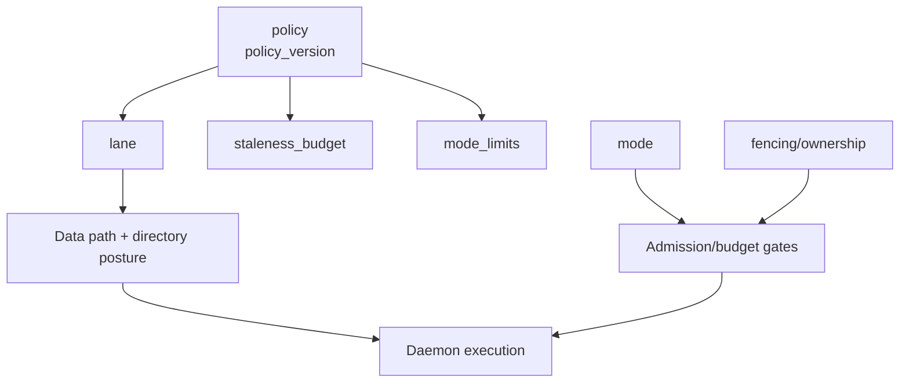

### 1.1.2 不变量（实现必须满足）

1. **强一致边界最小化**：强一致只覆盖 `fencing/ownership`（lease/epoch/token 校验）。调度信号、目录建议允许 bounded-stale。
2. **热状态不上 GS**：任何 per-item/per-attempt 的高频状态推进（queue item、credit、KV per-blob exists/推进、重试内择源评分）不得成为 GS 热写/热读。
3. **去热化不等于放宽一致性**：从 GS 去热化选源时，必须保留与 `replica_counters` 等价的 `claim/reservation` 语义，防止源侧过载、抖动与不可复现的热点。
4. **mode ⟂ lane**：`mode` 与 `lane` 正交；同一 `idempotency_key` 内默认禁止变更 `lane`（避免语义漂移与重复副作用）。
5. **审计闭环**：关键控制决策必须可追溯，最低审计键：`request_id + idempotency_key + lane + policy_version`（Plan 与非 Plan 路径一致）。

## 2. 项目现状基线（以代码与协议为锚）

### 2.1 已实现能力（0055 + 当前仓库）

1. Artifact-first 与选择身份体系已成立。
- 锚点：`docs/designs/0055-programmable-framework.md`
- 锚点：`tensorcast/api/store/artifact.py`
- 锚点：`tensorcast/common/selection_identity.py`

2. Daemon 侧 operation/lease 能力已存在。
- 锚点：`proto/tensorcast/daemon/v2/store_daemon.proto`
- 包含：`QueryReplicaStatus/WaitReplicaStatus`、`CreatePlacementLease`、`Acquire/Renew/ReleaseRetentionHandle`

3. Daemon 生命周期与 lease/guard/finalizer 机制已形成统一模型。
- 锚点：`docs/designs/0011-unified-session-lifecycle-leases.md`
- 锚点：`daemon/state/session_lifecycle.h`
- 锚点：`daemon/state/retention_registry.h`

4. GS 的 operation lease + registry + replica directory 已运行。
- 锚点：`proto/tensorcast/operation/v1/operation.proto`
- 锚点：`proto/tensorcast/global_store/v1/global_store.proto`
- 锚点：`tensorcast/global_store/repositories/operation_repository.py`
- 锚点：`schema.sql`

5. SDK 当前仍以“本地执行 Plan.run + 远端调用数据面能力”为主。
- 锚点：`tensorcast/api/plan/plan.py`
- 现状校正：`Plan.run` 当前不直接调用 Node Agent；instance steps 需要通过 `NodeAgent.ExecutePlan`（或等价执行面）执行，SDK 侧 discovery/client 仍需补齐。

6. 当前 P2P materialize 的“选源”仍显著依赖 GS 热路径（并非完全 Local-First）。
- 锚点：`core/store/materialization/control/materialize_orchestrator.cc`（`RequestReplicaTransport/RequestViewTransport` 调用链）
- 锚点：`core/store/components/global_store_client.cc`（`request_replica_transport/request_view_transport`）

### 2.2 尚未实现（0056/0060 处于提案态）

1. `0056` 提案中的 daemon-run `ExecutePlan`、daemon-served signals、KV home-shard 机制仍未落地为当前对外协议。
- 现状证据：`proto/tensorcast/daemon/v2/store_daemon.proto` 中无 `ExecutePlan`/`TensorCastSignals` 相关 RPC。

2. `0060` 提案中的 queue 协议与 broker 状态机尚未成为当前正式模块。
- 现状证据：`proto/tensorcast` 目前无 `queue` proto 包；仅在 capability token 中预留 `queue_epoch` fencing 结构。

这意味着：

- 我们现在做的是“以 0056/0060 的目标场景反推状态架构”，而不是宣称这些机制已经在系统中可用。

---

## 3. 三层系统视角：User Process / Daemon / Global Store

```mermaid
flowchart LR
  subgraph U[User Process / SDK]
    U1[Artifact Handle]
    U2[StoreRuntimeContext]
    U3[Local Key/Index Cache]
    U4[CallContext / Idempotency]
  end

  subgraph D[Store Daemon]
    D1[Replica Session / Operation State]
    D2[SessionLifecycle Leases]
    D3[Retention Registry]
    D4[Placement Lease Tokens]
    D5[StoreEngine / UMA]
    D6[Local Scheduling Decisions]
  end

  subgraph G[Global Store]
    G1[workers / instances registry]
    G2[artifacts / replicas catalog]
    G3[operations lease fencing]
    G4[memory_tier snapshots + leases]
  end

  U -->|High-frequency control calls| D
  D -->|Low-frequency arbitration/refresh| G
  D <-->|P2P/Disk data plane| D
```

结论先行：

- 热路径应优先留在 `U + D`。
- GS 负责“低频但必须统一”的事实锚点与仲裁边界。
- 现状上仍有一类关键热控制路径（P2P 选源）经过 GS，这正是 Wave 0/1 的首要去热化对象。

### 3.1 角色化：同一 Store Daemon 的不同角色（不是新增组件）

为保持组件实现统一性，本系列把 queue/KV 等场景中的“新名词”统一解释为 **Store Daemon 的角色（role）**，而不是新增组件：

1. `issuer daemon`：负责 retention handle 的签发与校验、renew/release（capability token 的 `issuer_daemon_id` 必须可验证）。
2. `broker leader`（0060 提案）：负责 queue 的高频 work state/lease/credit 推进（本地线性化），并以 epoch-fenced tokens 防止 split-brain 写入。
3. `home daemon`（0056 提案）：负责某个 KV shard 的 blob 不变量与 epoch 围栏下的所有权（GS 只负责 shard lease/fencing，不承接高基数 blob 目录热写）。
4. `executor daemon`（现状）：负责 materialize/prefetch/pin 等执行入口与数据面调度（P2P/disk/UMA）。

统一约束：

- role 变化不应引入平行协议与平行状态机；优先复用现有 `session_lifecycle`/capability token/`operation.proto` fencing 语义。
- 任何 directory/signal 仅提供建议；正确性必须由 token/epoch/lease_generation 校验闭环。

---

## 4. 全量状态地图（现状+提案统一梳理）

> 这是本文核心：把所有关键状态按“归属、更新频率、一致性需求、热冷路径”统一建模。

### 4.1 状态分类

1. 身份状态（Identity）。
2. 生命周期状态（Lifecycle）。
3. 资源预算状态（Resource/Budget）。
4. 目录状态（Directory）。
5. 仲裁状态（Arbitration/Fencing）。

### 4.2 状态总表（模块级）

> 说明：下表显式列出 `Read Path/Write Path`（`L0/L1/L2` 成本阶梯口径见 `7.1`），用于对“GS 去热化”和“强一致边界最小化”做硬检查：**任何高频推进状态不得写入 GS（L2）**。

| 状态对象 | 当前/提案 | SoT层级 | Read Path（热度） | Write Path（频率） | 一致性/陈旧性 | 主要模块（锚点） | 备注 |
|---|---|---|---|---|---|---|---|
| `artifact_id/view_id/logical_layout_hash/selection_hash` | 当前 | SDK+Daemon | `L0/L1` 热读（幂等/缓存/路由基线） | `L0` 计算 + `L1` 透传（中频） | 强确定性（哈希稳定） | `tensorcast/api/store/artifact.py` `tensorcast/common/selection_identity.py` | 幂等、路由、缓存共同基准 |
| `replica_uuid(operation id)` | 当前 | Daemon | `L1` 热读（join/状态查询） | `L1` 高频推进 | 单点内线性化 + 语义隔离 | `daemon/state/replica_session_manager.h` | 与 `ReplicaKey` 分离 |
| Use/Placement/Commit/Retention Lease | 当前 | Daemon | `L1` 热读 | `L1` 高频推进 | 强边界（过期/释放必须准确） | `daemon/state/session_lifecycle.h` | 0011 的统一 lease 语义 |
| Retention Handle token | 当前 | Issuer Daemon | `L1` 热读（renew/release） | `L1` 中高频（issue/renew/release） | 令牌合法性 + issuer 真实性（不确定即 fail-closed） | `daemon/state/retention_registry.h` | issuer 路由是硬约束 |
| Placement lease token | 当前 | Daemon | `L1` 热读 | `L1` 中频（pin/unpin/renew） | token scope + expiry | `daemon/state/placement_lease_tokens.h` `proto/tensorcast/daemon/v2/store_daemon.proto` | 0056 目标态下 pin 需要 join key 才能安全重试 |
| Worker/Instance membership | 当前 | GS | `L2 -> (L0/L1 cache)` 冷到温 | `L2` 中频（注册/心跳） | bounded-stale（必须显式 staleness 预算） | `tensorcast/global_store/services/worker_service.py` `tensorcast/global_store/services/instance_service.py` `tensorcast/capability_directory.py` | directory 基础事实锚点 |
| Replica catalog / counters | 当前（热点） | GS | 当前：`L2` 偏热（每请求回源选源） 目标：`L1` 候选缓存优先，失败回源 `L2` | 当前：`L2` 偏热（`replica_counters` 原子 claim） 目标：`L1` 本地 claim 热推进 + `L2` 低频目录真相 | claim/reservation 语义必须等价（去热化不可放宽） | `tensorcast/global_store/services/transport_service.py` `tensorcast/global_store/repositories/replica_repository.py` `schema.sql` | transport 选源与并发占用锚点 |
| Operation lease generation | 当前 | GS | `L2` 冷（仲裁） | `L2` 低频 | 强围栏（fencing 真相层） | `proto/tensorcast/operation/v1/operation.proto` `tensorcast/global_store/repositories/operation_repository.py` | 关键 fencing 边界 |
| Memory tier snapshots/leases | 当前 | GS + Daemon | `L2 -> L1 cache` 温 | `L2` 中频（快照/租约） | bounded-stale + lease 正确性 | `docs/designs/0034-stable-memory-tiers.md` `tensorcast/global_store/services/memory_tier_service.py` | 用于预算治理 |
| Queue work item state | 提案(0060) | Broker Leader(Daemon) | `L1` 热读（claim/ack/nack） | `L1` 高频推进（per-item） | 本地线性化 + epoch fencing | `docs/designs/0060-tensor-work-queue.md` | v1 L0：leader 存活期 at-least-once |
| Queue work lease/credit ledger | 提案(0060) | Broker Leader(Daemon) | `L1` 热读 | `L1` 高频推进 | 本地线性化 + token fencing | `docs/designs/0060-tensor-work-queue.md` | 不应上推 GS 热写 |
| Queue leadership epoch | 提案(0060) | GS | `L2` 冷读（directory 缓存允许 bounded-stale） | `L2` 低频 | 强一致（只做 fencing，不做 per-item） | `docs/designs/0060-tensor-work-queue.md` `proto/tensorcast/operation/v1/operation.proto` | 与 operation lease_generation 对齐 |
| Plan execution graph | 当前+提案(0056) | 当前：SDK Plan runner（仅 worker steps）+ Node Agent（独立 service，instance steps 需外部执行） 提案：Node Agent 主轴 + 可选无状态入口 | `L0/L1` 热读 | `L0/L1` 中高频推进 | 步骤幂等 + 重试可合流 | `tensorcast/api/plan/plan.py` `proto/tensorcast/node_agent/v1/node_agent.proto` `tensorcast/node_agent/*` | 先复用 Node Agent，再评估 gateway 壳 |
| TensorCastSignals cache | 提案(0056) | Daemon cache | `L1` 热读 | `L2` watch/刷新 + `L1` 低写入缓存 | bounded-stale（必须显式预算） | `docs/designs/0056-programmable-framework-adv.md` | 用 watch/cache 减少 GS 压力 |
| KV shard lease & home ownership | 提案(0056) | GS(lease) + Home Daemon(data) | shard lease：`L2` 冷读（缓存） blob 读写：`L1` 热 | shard lease：`L2` 低频 blob 推进：`L1` 高频 | 强围栏 + epoch fail-closed | `docs/designs/0056-programmable-framework-adv.md` | GS 不存高基数 KV blob 全量目录 |

### 4.3 状态依赖图

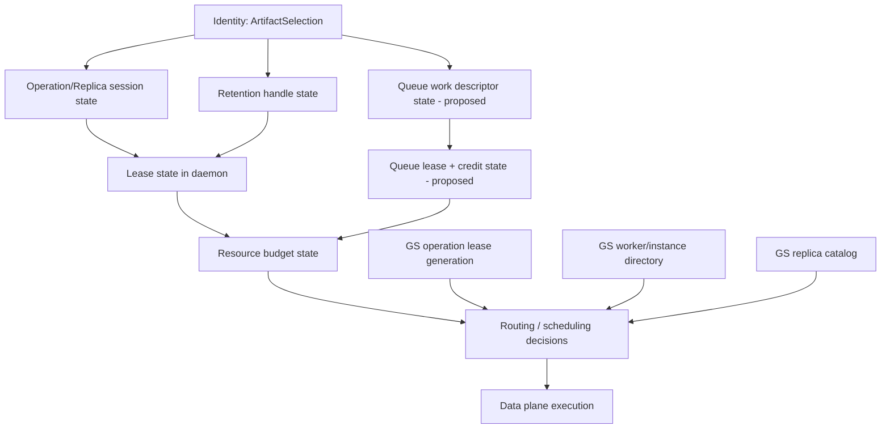

---

## 5. 数据流、状态流、控制流：三流拆解

## 5.1 数据流（Bytes Plane）

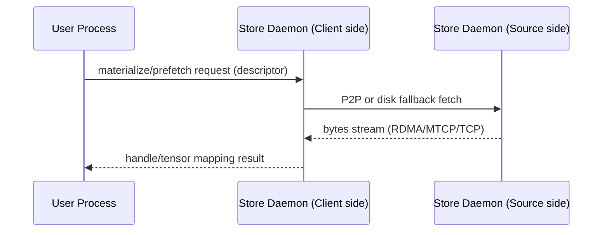

特征：

1. 高吞吐、大字节。
2. 成本主要来自网络与内存层。
3. 不应让 GS 进入该链路。

## 5.2 状态流（State Mutation Plane）

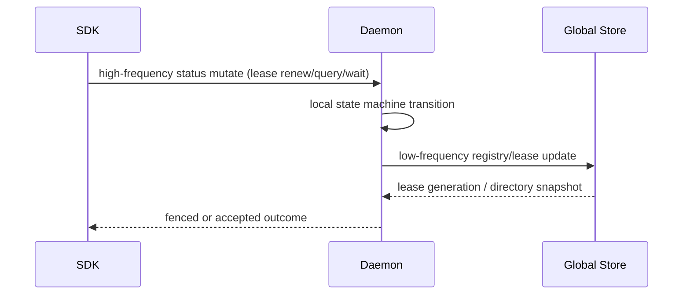

特征：

1. 高频状态扭转应在 Daemon 本地闭环。
2. GS 主要承接低频仲裁状态。

## 5.3 控制流（Meta Control Plane）

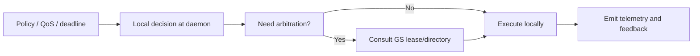

特征：

1. 控制流可近似，不可越过安全边界。
2. 真正必须强一致的是 fencing/ownership，不是每次路由评分。

---

## 6. 关键场景状态扭转（Current vs Proposal）

## 6.1 当前（0055）Artifact 预取与操作状态

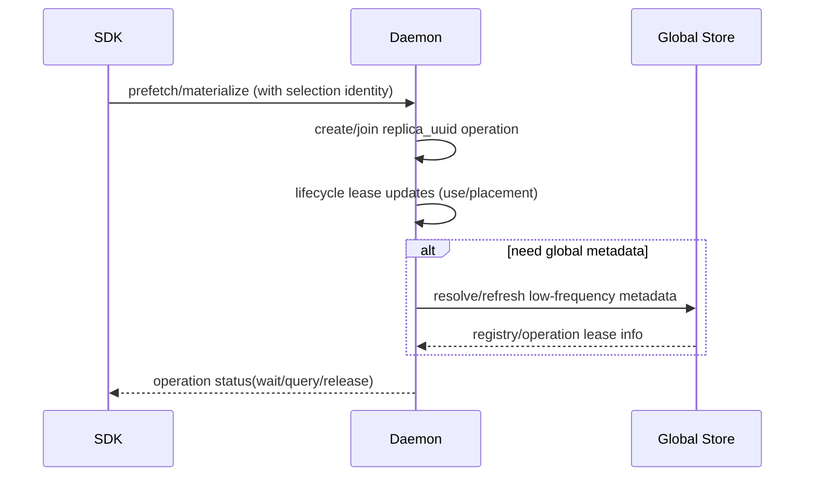

分析：

1. 高频状态主要发生在 Daemon 内。
2. 但对 P2P 选源而言，当前路径仍常态经过 GS（`RequestReplicaTransport/RequestViewTransport`），因此“GS 去热化”是现状到目标态的关键鸿沟。

## 6.2 提案（0060）Queue stage-and-enqueue

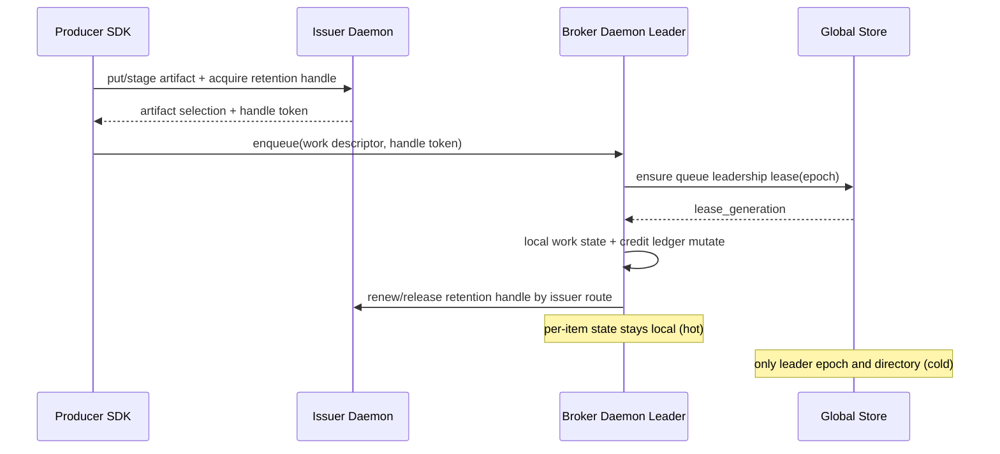

分析：

1. `0060` 的核心价值不是“有队列”，而是“把高频状态留在 broker 本地”。
2. GS 只提供 queue epoch 围栏，避免 split brain。

## 6.3 提案（0056）执行面：Node Agent 优先 + 可选协调入口

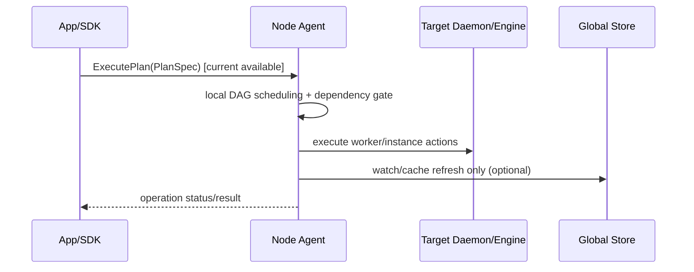

分析：

1. 当前仓库已有 `NodeAgent.ExecutePlan`，应作为 0056 路线的默认执行面，而不是新建平行语义。
2. 如需 gateway，只应作为“无状态接入/路由外壳”，不能复制一套执行语义。
3. Wave 0/1 的重点应放在“复用 Node Agent + 补齐 daemon action/cache”，而非先扩张入口角色。

---

## 7. 热路径与冷路径分层（成本模型）

### 7.1 三层成本阶梯

1. `L0`: SDK 本地状态读写（最低成本）。
2. `L1`: SDK <-> Daemon RPC（中等成本）。
3. `L2`: Daemon <-> GS 仲裁/刷新（最高控制成本）。

工程原则：

- 高频状态尽量限制在 `L0/L1`。
- `L2` 只承接必须跨节点一致的边界状态。

### 7.2 典型状态的热冷分类

| 状态 | 推荐层级 | 原因 |
|---|---|---|
| SDK 缓存（key/index/session） | L0 | 高频读多写少，局部即可 |
| operation wait/query、lease renew | L1 | 高频且与执行面强耦合 |
| queue item 推进（提案） | L1 | 高频状态机，不能每步上 GS |
| global leadership / epoch | L2 | 必须单一仲裁与围栏 |
| worker/instance directory | L2->L1 cache | 全局目录但可 bounded-stale 缓存 |

### 7.3 场景对照：权重加载 vs KV(PD流式) vs KV(Decoder共享)

| 维度 | 权重加载 | KV Cache (PD流式) | KV Cache (Decoder共享) |
|---|---|---|---|
| 对象规模 | 极大（100GB~TB） | 单对象中等，聚合总量大 | 中到大（可形成热点“半持久块”） |
| 生产频率 | 低 | 极高（请求级持续流） | 中到高（随热点与会话变化） |
| 消费频率 | 低到中（扩容/重启时集中） | 极高（解码持续消费） | 中到高（多 Decoder 复用） |
| 生命周期 | 长（复用高） | 短到中（P短、D相对长） | 中（比 PD 流式更长） |
| 复用模式 | 跨实例稳定复用 | 请求级即时消费，复用低 | 跨 Decoder 重复命中，复用中高 |
| 全局目录价值 | 高 | 低到中 | 中到高（热点定位与迁移受益明显） |
| 可接受一致性 | 边界强一致 + 路由可陈旧 | 边界强一致 + 执行近似最优 | 边界强一致 + 热点目录近实时 |
| 推荐控制策略 | `catalog-first` | `stream-first` | `hybrid-cache-first` |

核心判断：

1. 权重加载更适合 `catalog-first`（GS 参与度高但频率低）。
2. PD-KV 更适合 `stream-first`（GS 参与度低但边界强）。
3. Decoder 共享 KV 在治理上更接近“轻量权重/热点副本”，不应与 PD 流式 KV 走同一策略。
4. 三者应长期并存，不能强行统一到同一控制路径。

### 7.4 生产者-消费者关系：直接打消费者，还是先等待

这个问题要按“时延目标 + 源侧资源 + 目标可用性”三因子决策。

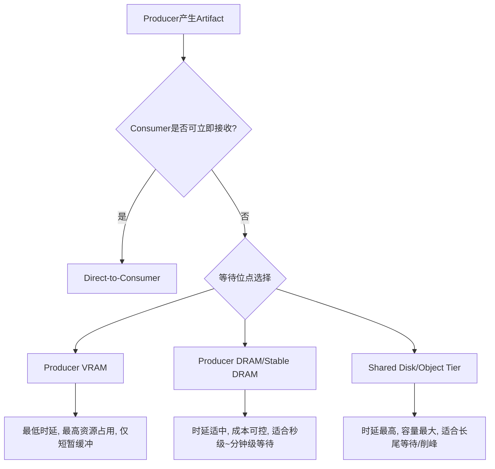

建议规则：

1. `Producer VRAM` 仅作为极短暂瞬态缓冲，不应用于排队等待。
2. `Producer DRAM/Stable DRAM` 是默认等待位点（尤其是 queue_staged/retention handle 语义）。
3. `Shared Disk` 作为容量兜底层，不应成为低延迟主路径。

### 7.5 三轨数据路径：GS管理轨、Daemon直管轨、共享缓存轨

为应对你提出的“部分 Artifact 经过 GS、部分不经过 GS”，以及“Decoder 共享 KV 类似权重”的场景，建议明确定义三轨，不做隐式混用：

1. `lane=catalog-first`（GS管理轨 / cataloged）
- 适用：`persistent_shared`、权重、检查点、高复用长寿命对象。
- SoT：GS catalog + Daemon execution state。
- 目标：全局可见、可解释、可做近全局最优路由。

2. `lane=stream-first`（Daemon直管轨 / streaming）
- 适用：PD-KV、短寿命高频中间态、queue_ephemeral。
- SoT：Daemon/Broker 本地状态 + GS fencing lease。
- 目标：最小控制开销、快速推进、故障可退化。

3. `lane=hybrid-cache-first`（共享缓存轨 / shared-cache）
- 适用：Decoder 共享 KV、热点中寿命缓存块。
- SoT：轻量目录层（可在 GS 或 shard 协调层）+ Daemon 副本执行状态。
- 目标：在不全量中心化的前提下获得高命中与反热点迁移能力。

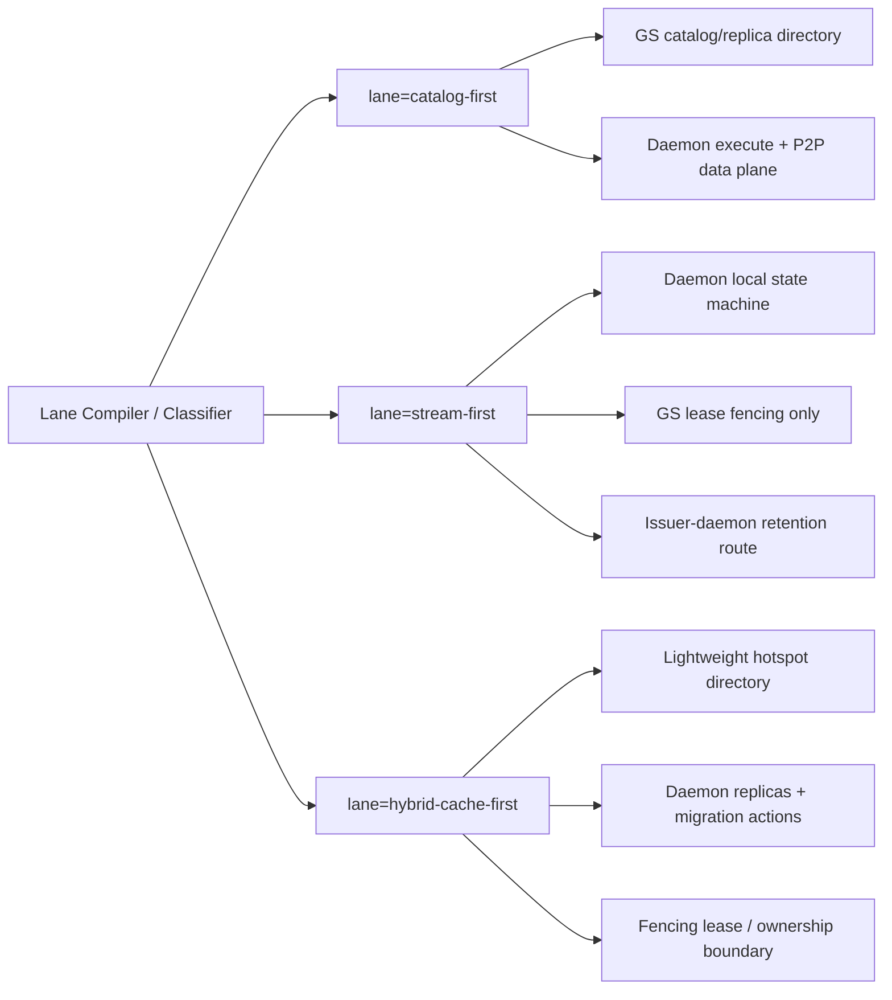

关键点：

1. 三轨不是三套对象模型，而是同一 Artifact 模型下的三种治理策略。
2. 是否入 GS catalog 是“治理选择”，不是“对象本质差异”。
3. `lane=stream-first` / `lane=hybrid-cache-first` 都必须接受边界仲裁（epoch/fencing），只是不上 GS 全量热写路径。

### 7.6 KV 两形态细分：流式KV 与 共享KV

你新增的点非常重要：KV 不能只按“高频流”建模。

建议拆成两个子类：

1. `kv_streaming`（PD流式）
- 以“请求传输链路”驱动，P->D 连续流。
- 目标：最低控制开销 + 高吞吐推进。
- 状态：尽量本地化，GS 仅作 lease/fencing。

2. `kv_shared`（Decoder间共享）
- 以“热点片段复用”驱动，多个 Decoder 重复命中。
- 目标：命中率与热点迁移收益。
- 状态：需要一个“轻量目录层”来描述热点位置与副本质量。

这解释了为什么它“某种程度像权重”：不是因为对象同构，而是因为复用结构同构。

### 7.7 负载均衡：三轨并存下如何避免热点

在 “部分经GS、部分不经GS” 的前提下，负载均衡必须分层实现：

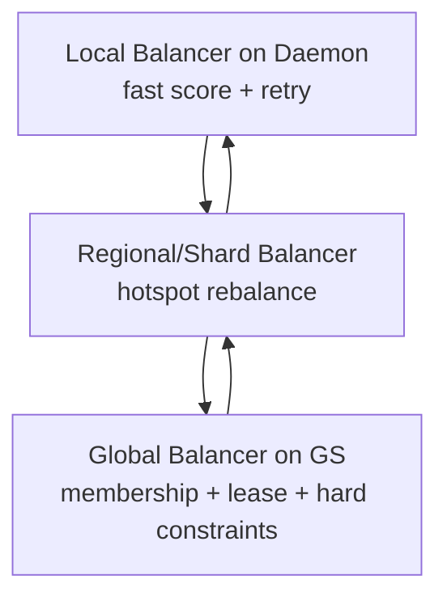

分工建议：

1. `L0`：每请求快速择源（本地评分，毫秒级）。
2. `L1`：热点迁移与副本重分布（秒级）。
3. `L2`：边界仲裁与容量硬约束（低频强一致）。

这允许 streaming 路径不回源 GS 热读，同时保证共享热点可被全局治理。

### 7.8 lane × mode：治理强度如何作用于三轨（避免术语混用）

`lane` 决定“数据路径 + directory 姿态”；`mode` 决定“预算/准入/回源闸门”的力度。两者正交（`mode ⟂ lane`），任何模式下都不得改变 fencing/ownership 边界，也不得把 per-item 推进推回 GS。

| lane \\ mode | `Local-First` | `Budgeted-Hybrid` | `Global-Governed` |
|---|---|---|---|
| `catalog-first` | 目录/仲裁可回源 GS（低频），请求级择源在 daemon 本地完成；强调可解释性与稳态命中 | 在 `catalog-first` 的基础上引入全局预算（memory tier/拓扑预算/并发预算）与准入闸门；仍以 daemon 执行近似最优 | 对高价值/高干扰关键流要求更强的 admission（可 fail-closed）与更严格 staleness 预算；**不是**“每请求回源 GS” |
| `stream-first` | 高频推进全部在 daemon（或 broker leader）本地闭环；GS 仅做 epoch/lease fencing 与低频目录事实 | 增加 credit/并发/链路预算等收敛回路，限制故障风暴与拓扑干扰；仍不把 per-item 推进写入 GS | 关键流保护优先：必要时更保守的并发门控/退化路径（例如限制 P2P、强制冷却窗口）；GS 仍只做边界仲裁 |
| `hybrid-cache-first` | 轻量热点目录（摘要）+ daemon 本地快速择源；允许 bounded-stale 信号驱动命中 | 把热点迁移/反热点纳入预算闭环（秒级），让共享命中“可规划”而不是“碰运气” | 对热点场景启用更强的迁移/准入治理与更严格的目录 freshness SLA；目录仍是建议，正确性由 fencing/版本校验闭环 |

共通规则（必须执行）：

1. fencing/ownership 校验始终 `fail-closed`（不确定就拒绝推进/续租/写入）。
2. `mode` 影响“闸门强度”，不改变“状态放置”：per-item/per-attempt 推进不写入 GS。
3. `lane` 决策必须可审计；同一 `idempotency_key` 内默认禁止切 `lane`（切 lane 必须进入新幂等域）。

---

## 8. 为什么“都走 GS”会成为瓶颈（以及如何拆解）

### 8.1 问题本质

即使传输的是 descriptor，如果每次 `resolve/route/exists/推进` 都经 GS，系统依然会被控制面热写热读压垮。

### 8.2 具体瓶颈维度

1. 写放大：per-item 状态迁移频繁写 GS。
2. 读放大：高频路由/存在性检查回源 GS。
3. 耦合放大：任何 GS 抖动都会扩大到业务热路径。

### 8.3 正确拆解方式

1. 把“事实真相”与“高频执行状态”分开。
2. GS 只存低频真相与仲裁边界（lease_generation、membership、global budget）。
3. Daemon 本地维护高频推进状态（queue lease/credit、retry、短周期评分）。

### 8.4 基于当前代码的集中化热点提示

以下是从现状代码可直接看到的“潜在热化点”，不是假设：

1. GS 传输选源当前以 `RequestReplicaTransport` + `replica_counters` 原子更新为中心。
- 锚点：`tensorcast/global_store/services/transport_service.py`
- 锚点：`tensorcast/global_store/repositories/replica_repository.py`

2. Worker/Instance 心跳、能力目录、状态同步都汇聚在 GS。
- 锚点：`tensorcast/global_store/services/worker_service.py`
- 锚点：`tensorcast/global_store/services/instance_service.py`

3. Operation lease（generation fencing）是 GS 仲裁锚点。
- 锚点：`tensorcast/global_store/repositories/operation_repository.py`
- 锚点：`proto/tensorcast/operation/v1/operation.proto`

推论：

1. 这些机制对“低频高价值仲裁”非常合适。
2. 但若把 PD-KV 或 queue per-item 高频推进也塞进同一路径，放大风险很高。

---

## 9. “全知全能”目标的可行折中

绝对全知不可达，原因是观测延迟、状态传播延迟与控制成本。

可行做法是三层知识面：

1. Truth Plane（GS）：强一致、低频、边界真相。
2. Belief Plane（Daemon）：有界陈旧、局部高频观测。
3. Action Plane（Daemon/StoreEngine）：高速执行与降级。

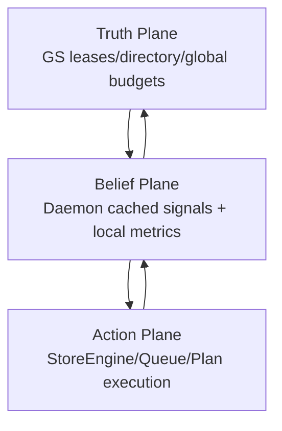

这本质上就是：

- 用强一致约束“边界正确性”；
- 用近似最优驱动“执行效率”。

---

## 10. Artifact 治理：不拆对象模型，拆治理策略

不建议把 Artifact 拆成两套对象模型（例如 queue artifact vs normal artifact）。

建议保留统一 Artifact 抽象，用治理标签区分行为：

1. `persistent_shared`：长寿命高复用，偏全局规划与稳态命中。
2. `queue_ephemeral`：短寿命高频流，偏本地推进与快速回收。
3. `burst_backlog`：生产大于消费，优先预算/准入收敛。
4. `cache_kv_streaming`：PD流式KV，高基数高频推进，采用 shard lease + epoch fencing + 本地高速状态机。
5. `cache_kv_shared`：Decoder共享KV，中高复用，采用“轻量目录 + 热点迁移 + 边界围栏”。

这些治理标签不是新的对象模型，而是 `policy` 的输入/输出之一：它们决定默认 `lane`，并影响默认 `mode` 的起始与升级阈值（`mode ⟂ lane`）。
注意：这些治理标签也不是 `StorePolicy(profile=...)` 的替代或镜像；`StorePolicy` 仍描述存储/持久化/驻留语义，治理标签只用于 lane/mode 的编译与审计。

| 标签 | 默认 `lane` | 默认 `mode`（起始建议） | 说明 |
|---|---|---|---|
| `persistent_shared` | `catalog-first` | `Budgeted-Hybrid` | 更需要目录质量与全局预算边界（扩容/预热窗口可短时升级） |
| `queue_ephemeral` | `stream-first` | `Local-First` | 高频推进留在 broker/daemon，本地闭环优先 |
| `burst_backlog` | 继承原 lane | `Budgeted-Hybrid` | 这是“收敛信号”，不是新 lane：以预算/准入止振荡 |
| `cache_kv_streaming` | `stream-first` | `Local-First` 或 `Budgeted-Hybrid` | 默认低控制开销；在拓扑干扰高时进入 Hybrid |
| `cache_kv_shared` | `hybrid-cache-first` | `Budgeted-Hybrid` | 需要轻目录与热点治理能力，优先做可观测与迁移闭环 |

---

## 11. 决策框架：状态放哪一层

### 11.1 五问法

每个新状态先回答五个问题：

1. 更新频率是否高到会成为热路径？
2. 是否需要跨节点强一致仲裁？
3. 失败后是否允许 bounded-stale 或重试恢复？
4. 是否与数据面执行强耦合？
5. 是否直接影响安全边界（ownership/fencing）？

### 11.2 放置规则

1. 高频 + 执行耦合强：放 Daemon 本地。
2. 低频 + 跨节点边界：放 GS。
3. 用户会话级、重复读高：放 SDK 本地缓存。
4. 任意层都不能绕过 fencing/ownership 校验。

### 11.3 反模式（必须避免）

1. 用“全局最优”作为借口把热路径推回 GS。
2. 用“本地效率”作为借口弱化 token/epoch 校验。
3. 用单一策略覆盖所有生命周期与增长类型。

---

## 12. 面向 0056/0060 的决策建议（可执行）

1. 对 Queue（0060）：坚持“leader 本地高频推进 + GS 仅 epoch 仲裁”。
2. 对 Plan（0056）：现状是 `Plan.run` 以 SDK 本地编排为主、instance step 下沉 `NodeAgent.ExecutePlan`；Wave 0/1 先统一执行主轴，再决定是否需要 gateway 壳。
3. 对 GS：持续强化低频强边界能力，不承接 per-item 热写。
4. 对 SDK：保留轻量本地 cache 与 request 上下文，不承担跨节点一致性职责。
5. 对一致性：强一致收敛在 fencing/ownership；调度信号允许 bounded-stale。

### 12.1 Wave 0/1 前置项（必须先补齐）

1. `GS 选源去热化`：把“每请求中心选源”收敛为“边界约束 + 本地择源”，至少先实现目录缓存与回源闸门，并补齐与当前 `replica_counters` 等价的 claim/reservation 语义。
2. `QueueDirectory 最小契约`：在 queue 状态机落地前，先明确可稳定发现 `(queue identity -> leader endpoint -> epoch fencing)` 的最小目录语义。
3. `执行面统一`：以 Node Agent 作为 instance action 的唯一执行边界（EngineAdapter boundary），避免形成“Gateway Daemon + Node Agent”双执行面；并补齐 `instance_id -> node_agent_endpoint` 的发现与 SDK client（pilot 允许 direct-dispatch，长期收敛到 gateway/daemon dispatch）。
4. `LaneContext 闭环`：除 `PlanSpec.context.tags` 外，`materialize/prefetch` 等非 plan 请求也必须携带 lane/policy 上下文（可先用请求 metadata），否则审计与重试语义不闭环。
5. `Directory 契约统一`：把 capability directory / QueueDirectory / shared-cache 轻目录统一成“bounded-stale advisory directory”契约族（携带显式 staleness 预算）。短期可允许 SDK 直连 GS + 缓存，长期收敛到 daemon-served signals/directory（0056），但语义必须一致。
6. `动作幂等与重试护栏`：任何会在 daemon-run / broker / at-least-once 语义下被重试的动作必须具备 join key（幂等合流）或显式禁止重试；尤其是 placement pin 当前 `CreatePlacementLease` 缺少 operation_id join key，在启用跨进程重试前必须补齐。

### 12.2 架构级 Proposal（包含较大改动）

以下 proposal 是“长期最优导向”，允许突破当前实现边界：

1. `Proposal-A: 三层协调器（Global / Shard / Local）`
- Global（GS）：membership、lease、硬预算。
- Shard（先内嵌于现有 daemon/GS 协调逻辑，后续按压力阈值再独立）：按 artifact class 管理热点与迁移。
- Local（daemon）：请求级择源与执行。
- 价值：兼顾全局治理与热路径效率，避免 GS 单层承压，同时避免过早新增平行控制器。

2. `Proposal-B: Artifact Lane Compiler（治理编译器）`
- 把 Artifact 分类策略显式编译成 lane：
  - `catalog-first`（权重/共享KV）
  - `stream-first`（PD-KV/队列中间态）
  - `hybrid-cache-first`（共享热点缓存，可随画像动态切换）
- 价值：让“走不走 GS”从隐式约定变成可审计、可回放的策略系统；优先作为现有控制面的策略模块，而不是先建新服务。

3. `Proposal-C: 共享KV 轻目录层（可选入GS）`
- 目录只记录“热点摘要与副本质量”，不记录每个 KV 细粒度对象。
- 轻目录项必须绑定现有副本版本语义：`byte-space identity + export_state + export_generation + freshness SLA`。
- 对热点块做近实时迁移建议，配合 daemon 执行。
- 价值：在不把高基数对象全量上 GS 的前提下提升全局命中与均衡能力；实现上优先扩展现有 GS 目录契约，不平行新增第二套目录体系。

绑定约束（避免目录与现有 catalog 脱节）：

1. 仅 `export_state=EXPORTABLE` 的副本允许进入轻目录可用候选。
2. 轻目录命中的副本必须校验 `export_generation` 未过期或未回退。
3. 目录项必须携带 `freshness SLA`（超窗即降级回 catalog/本地重选）。
4. 与 `schema.sql` 的 `artifact_replicas.export_state/export_generation` 保持单向可验证关系。

4. `Proposal-D: 双平面负载均衡`
- Data-plane LB：daemon 本地最短路径与拥塞规避。
- Meta-plane LB：global/shard 层做热点降温与迁移编排。
- 价值：避免“把所有负载均衡职责压给一个平面”导致失真。

### 12.3 组件统一实现与关系约束（必须满足）

1. `契约复用优先于实现复用`：跨语言组件只复用协议和语义，不直接跨语言复用实现（例如 `CapabilityDirectory` 语义可复用，daemon 仍应采用本地实现）。
2. `执行面单一主轴`：0056 执行语义以 Node Agent 为主轴，gateway 仅可做无状态入口。
3. `选源一致性护栏不可缺失`：任何“本地择源”都必须绑定 claim/reservation/fencing 语义，避免去热化后引入过量并发或副本抖动。
4. `Shard 是职责抽离，不是先验新组件`：先在现有 GS/daemon 边界内完成职责分层，达到负载阈值后再抽离部署形态。
5. `mode ⟂ lane`：mode 只改变闸门强度，不改变 fencing/ownership 边界，也不把 per-item 推进推回 GS。
6. `动作幂等闸门`：在 daemon-run / broker / at-least-once 语义下会被重试的动作必须可 join（幂等合流）或显式禁止重试（placement pin 等副作用动作尤需严格）。

### 12.4 对 Proposal 的取舍建议

1. 若目标是“最快落地”：先完成 `12.1` 前置项，再做 `Proposal-A` 的最小形态（L0/L2，暂不单独建设 Shard 控制器）。
2. 若目标是“中期演进收益”：优先做 `Proposal-B`，但落在现有控制面内，先不引入新控制服务。
3. 若目标是“KV 命中率极致”：推进 `Proposal-C + Proposal-D`，同时严格执行 `12.3` 的目录与一致性约束。

---

## 13. 仍需实证的数据（决策前必须补齐）

1. Daemon 本地评分在不同负载下的收益拐点。
2. directory/signals 缓存窗口对错误路由率与尾延迟的影响。
3. GS 在不同“回源率”下的可承载上界。
4. queue_ephemeral 在 L0/L1/L2 一致性级别下的业务可接受性。
5. 拓扑感知预算对关键流保护的净收益。

这些不是框架正确性的前提，但决定参数与上线节奏。

---

## 14. 升华版架构规划（结合当前代码）

本节给出“长期最优导向”的高层规划，并明确三件事：

1. 与现有模块/代码的关系；
2. 重构大方向；
3. 重构影响范围。

### 14.1 目标架构形态（未来态）

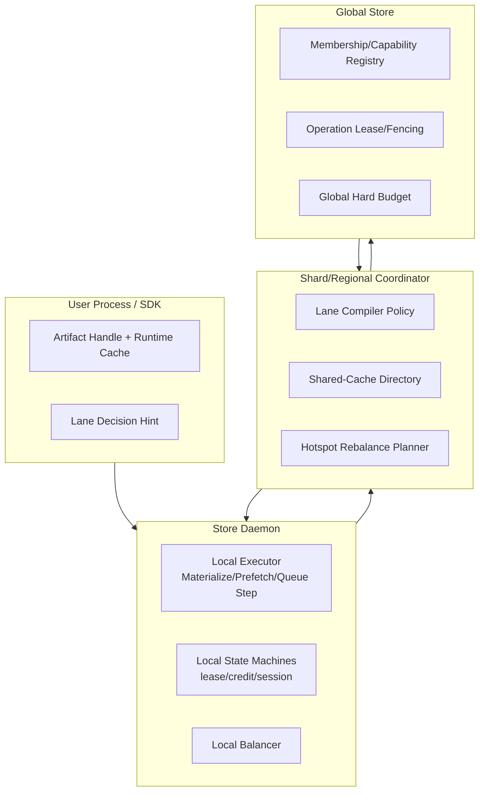

解释：

1. `Global` 负责边界真相与强约束；
2. `Shard` 负责策略与热点治理；
3. `Local` 负责高频执行与快速反馈。

这不是推翻当前系统，而是把现有能力从“单层协调”升级为“分层协调”。

### 14.2 与现有模块/代码关系（Current -> Target）

| 现有模块/组件 | 当前职责 | 规划后职责变化 |
|---|---|---|
| `tensorcast/api/store/artifact.py` `tensorcast/api/store/runtime.py` | SDK 入口、会话与缓存、调用 daemon | 保持轻边界；增加 lane hint 传递，不承载跨节点一致性 |
| `tensorcast/capability_directory.py` | SDK 侧 capability 目录缓存与陈旧性控制 | 保持为目录契约语义基线；daemon 侧实现同契约 C++ cache，不直接复用 Python 实现 |
| `tensorcast/api/plan/plan.py` | 当前以本地编排执行为主，instance step 明确要求 Node Agent 执行 | 向 Node Agent/shard-aware 编排演进（仍保持 artifact-first） |
| `proto/tensorcast/node_agent/v1/node_agent.proto` `tensorcast/node_agent/server.py` `tensorcast/node_agent/executor.py` | 已有 `ExecutePlan` 执行入口与 DAG 执行器 | 作为 0056 近期执行面主轴；可在其上增加缓存/路由能力 |
| `daemon/state/session_lifecycle.h` | lease/guard/finalizer 本地状态机 | 继续作为 Local Executor 核心，不上推 GS |
| `daemon/state/retention_registry.h` | issuer-daemon retention 续租与释放 | 继续承担 queue/shared-cache 的保活锚点 |
| `daemon/state/replica_session_manager.h` | replica_uuid 操作态与 join 语义 | 继续作为幂等合流与 operation 局部状态基础 |
| `daemon/service/controllers/*` | materialize/registration/transport 控制入口 | 扩展为 lane-aware 执行入口（不改变数据面本质） |
| `tensorcast/global_store/services/worker_service.py` `instance_service.py` | 目录/心跳/能力注册 | 保持 Global registry，不承接热路径状态推进 |
| `tensorcast/global_store/services/transport_service.py` | GS 选源与 transport 协调 | 逐步从“每请求中心选源”转为“边界约束 + 局部执行辅助” |
| `core/store/materialization/control/materialize_orchestrator.cc` | materialize 过程中的 transport 请求与选源触发 | 演进为“本地候选优先 + 失败回源 GS”，并保持 lease/fencing/预算校验链 |
| `tensorcast/global_store/repositories/operation_repository.py` | lease_generation 围栏锚点 | 保持 fencing 真相层核心地位 |
| `schema.sql` (`workers/instances/artifact_replicas/operations/...`) | 全局元数据存储 | 保持边界数据；新增共享缓存摘要/策略表（非全量高基数对象） |
| `proto/tensorcast/operation/v1/operation.proto` | 全局 lease 语义 | 继续作为统一 fencing 协议层 |
| `proto/tensorcast/daemon/v2/store_daemon.proto` | daemon 主数据面与控制入口（当前无 `ExecutePlan`） | 演进为 lane-aware + signals-aware action 接口，与 Node Agent 协作而非重复 |

结论：

1. 当前核心模块可复用度很高，不需要重做数据面；
2. 主要新增的是“中层协调与策略编译”能力，而不是替换 StoreEngine。

### 14.3 重构大方向（Architecture Refactor Directions）

1. `方向A：控制面分层化`
- 先在“GS + Daemon”现有结构内完成职责分层，再按压力阈值演进到“Global + Shard + Local 三层”。
- 目标：削减 GS 热负担，同时保留全局仲裁能力。

2. `方向B：Lane Compiler 化`
- 把 lane 决策从文档约定转成系统能力。
- 统一输出 `catalog-first / stream-first / hybrid-cache-first`。

3. `方向C：KV 双形态治理`
- 明确 `kv_streaming` 与 `kv_shared` 两条治理链路。
- 前者强调推进效率，后者强调共享命中与热点迁移。

4. `方向D：双平面负载均衡`
- Data-plane：本地快速择源与拥塞规避；
- Meta-plane：分片/全局做热点降温、迁移与容量校准。

5. `方向E：从“全量目录”转向“摘要目录”`
- 对共享KV只管理热点摘要，不把全部高基数对象纳入 GS。
- 保持高价值全局视图，同时控制中心成本。

### 14.4 重构改变范围（Impact Scope）

为了便于决策，本节只给“范围级别”，不落字段细节。

#### A. 低改动范围（可先行）

1. `docs` 与策略治理层：
- `docs/distributed-coordination-series/*`
- 策略规则与评审门禁文档

2. `SDK 轻改`（hint 透传）：
- `tensorcast/api/store/*`
- `tensorcast/api/plan/*`

#### B. 中改动范围（主干演进）

1. `daemon 控制层`：
- `daemon/service/controllers/*`
- `daemon/state/*`（保持本地状态机主导）

2. `global_store 服务层`：
- `tensorcast/global_store/services/*`
- `tensorcast/global_store/repositories/*`

3. `协议层`：
- `proto/tensorcast/daemon/v2/*`
- `proto/tensorcast/global_store/v1/*`
- `proto/tensorcast/operation/v1/*`

#### C. 高改动范围（架构跃迁）

1. `新增 shard 协调层（可先内嵌 daemon）`
- 新增中层协调模块与路由缓存/热点目录机制

2. `schema 扩展`
- `schema.sql` 新增“共享缓存摘要、策略版本、迁移计划”相关实体

3. `可观测与治理系统`
- 新增 lane 维度指标、模式切换审计、迁移收益闭环

### 14.5 不建议改变的稳定基座（建议保守）

1. `Artifact-first` 对象模型（不拆平行数据对象）。
2. `lease/fencing` 作为正确性底线。
3. `StoreEngine` 数据面主路径（P2P/磁盘回退/UMA）的核心机制。

这些是当前系统最有价值的“稳定资产”，不应在重构中被稀释。

---

## 15. Scaling 潜力分析：现状上限与重构增益

你补充的“规模上限”问题，本质是要回答：

1. 哪条路径最先打满；
2. 打满后是否可通过架构把瓶颈迁移出去。

### 15.1 统一扩展性模型（先看瓶颈位置）

集群可扩展规模不是单值，而是由三类上限共同决定：

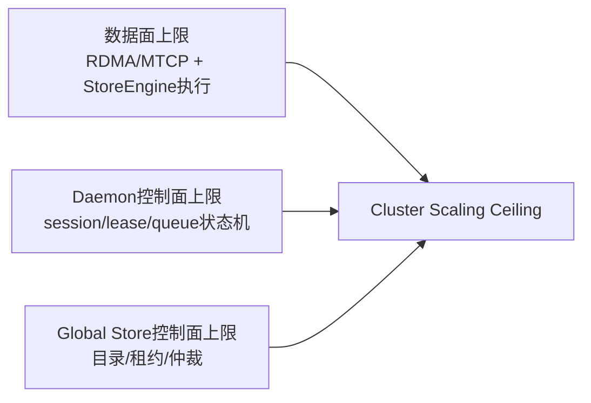

可写成：

`ScaleCeiling = min(C_data_plane, C_daemon_control, C_global_control)`

对 TensorCast 当前语境，真正先打满的常常不是 RDMA 带宽，而是控制面路径（尤其是 `C_global_control`）。

### 15.2 现状（过度依赖 GS）为什么难上大规模

从当前模块看，GS 具备如下事实（均为现网锚点）：

1. 单节点部署定位明确（`tensorcast/global_store/README.md`）。
2. 目录与协调能力很强，但 `workers`/`replica_counters`/`artifact_transports` 等存在热写路径。
3. P2P 选源当前仍以 GS `RequestReplicaTransport/RequestViewTransport` 为中心路径（`materialize_orchestrator -> global_store_client` 调用链）。
4. 心跳虽有批处理降压（约 100ms flush，约 5s 心跳），但这是“基础开销”，不是全部开销。

因此当系统把“高频动作”也放进 GS 时，负载会变成：

`Q_gs_total = Q_heartbeat + Q_directory + Q_lease_fencing + Q_route_hot + Q_misc`

如果 `Q_route_hot` 接近业务请求量（例如每次队列推进、每次高频 KV 传递都中心仲裁），GS 会先到拐点，导致：

1. 路由尾延迟上升；
2. 全局仲裁抖动放大到业务面；
3. 集群可扩展节点数与吞吐上限被 GS 绑定。

### 15.3 重构后的 scaling 增益（按架构决策分级）

注意：下面是“架构等级区间”，不是压测最终数字；真实上限仍需基准测试校准。

| 架构形态 | GS 负载形态 | 典型可扩展等级（工程估计） | 主要前提 |
|---|---|---|---|
| `S0: 中心化热路径`（多数请求回源 GS） | `Q_route_hot` 高 | 小规模到中小规模（常在几十节点级就出现明显控制面压力） | 混合高频负载（PD-KV/queue）占比上升 |
| `S1: GS + daemon cache`（目录缓存与有界陈旧） | `Q_directory` 显著下降 | 中规模（百节点级可行性明显提升） | 高缓存命中、严格 fencing 边界 |
| `S2: 三轨并存`（catalog/stream/shared-cache） | 高频状态下沉到 daemon，本地推进 | 中大规模（数百节点级潜力） | lane 分类准确、回源率受控 |
| `S3: 分层协调`（Global + Shard + Local） | GS 只承载真相与硬约束 | 大规模潜力（更高百节点到千节点前置条件） | shard 协调稳定、观测和回滚体系成熟 |

解释：

1. `S0 -> S1` 的收益来自“减少每请求回源”。
2. `S1 -> S2` 的收益来自“把高频状态机彻底本地化”。
3. `S2 -> S3` 的收益来自“把热点治理从 GS 再下沉一层（Shard）”。

### 15.4 按核心业务场景看 scaling 驱动项

| 场景 | 先打满的能力 | 主要 scaling 风险 | 推荐架构等级 |
|---|---|---|---|
| 权重加载（大对象低频） | 数据面与单次路由质量 | 扩容风暴时瞬时路由集中 | `S1/S2` 即可覆盖大多数阶段 |
| PD 流式 KV（高频短停留） | 控制面状态推进 | GS 热写/热读放大 | 至少 `S2`，长期要 `S3` |
| Decoder 共享 KV（中寿命热点） | 热点目录与迁移能力 | 热点集中与迁移滞后 | `S2` 起步，收益峰值在 `S3` |
| Queue 中间态（0060） | lease/credit 状态机 | 若中心化会快速热化 | 必须 `S2` 思路（leader 本地推进） |
| 持久化/检查点回放 | 规划与预算编排 | 任务洪峰与共享磁盘争用 | `S1/S2`，必要时短时升到 `Global-Governed` |

### 15.5 规模治理的实操闸门（避免“感觉可扩展”）

要把“可扩展”变成可执行，需要强制设闸门：

1. `GS回源率闸门`：高频 lane 的回源占比必须持续低于阈值（例如目标 <10%，最好 <5%）。
2. `目录命中率闸门`：daemon/SDK 目录缓存命中需达到高位（例如 >95%）。
3. `控制面尾延迟闸门`：GS 仲裁 RPC 的 P99 不得跨越业务预算。
4. `失效安全闸门`：当 cache/shard 失效时，系统必须 fail-closed 且可快速降级到保守模式。

结论：

1. “只靠 GS”可以跑，但难以承载高频场景下的规模扩展。
2. 真正提升规模上限的关键，不是改数据面，而是把高频状态从 GS 迁出，并保持边界仲裁强一致。

---

## 16. Contract-First：Wave 0/1 的最小契约集合（可验收）

本节把前文原则收敛成“实现必须对齐的契约”，目的只有一个：**减少新组件、减少语义分叉、让去热化/模式切换可灰度与可回滚**。

### 16.1 LaneContext 契约（GovernanceContext v0）

必备字段（至少可审计，不要求一次性都上 proto）：

1. `lane`（`catalog-first/stream-first/hybrid-cache-first`）
2. `policy_version`（策略版本，便于回放与灰度）
3. `request_id`、`idempotency_key`、`qos`、`deadline_ms`（若存在）

传播要求（必须覆盖 plan 与非 plan）：

1. Plan 路径：`PlanSpec.context.tags` 作为 v0 承载（直到显式字段落地）。
2. 非 Plan 路径：SDK 必须把 `CallContext.tags` 映射到 daemon gRPC metadata（v0）；daemon 必须把 `lane/policy_version` 打到审计日志与关键指标标签里，避免“只有 Plan 可审计”的断层。
   - 推荐 metadata keys（v0 约定）：`x-tc-lane`, `x-tc-policy-version`, `x-tc-request-id`, `x-tc-idempotency-key`, `x-tc-qos`。

一致性要求：

1. 同一 `idempotency_key` 内默认禁止切 `lane`；若必须切 lane，必须进入新幂等域（新 `idempotency_key`）并记录迁移审计。
2. `mode` 可以在运行期调整，但必须可追溯（至少记录 mode 决策点与生效窗口）。

### 16.2 Directory 契约族（bounded-stale advisory directory）

统一口径：directory 只负责“建议路由/发现”，正确性由 fencing/token 校验保证（directory 不得成为正确性单点）。

1. `CapabilityDirectory`（现状目录视图）
   - facts：workers/instances membership + capability flags。
   - semantics：bounded-stale cache（必须显式 `max_staleness` 与回源闸门）。
2. `NodeAgentDirectory`（0056/执行面统一前置目录契约）
   - MUST resolve：`instance_id -> node_agent_endpoint`（dialable gRPC endpoint）+ `daemon_id/engine/capability_flags`（用于准入与审计）。
   - semantics：bounded-stale；必须显式 staleness budget 与回源闸门；endpoint 缺失或 capability 不满足时必须 fail-fast。
   - correctness：endpoint 仅用于路由建议；执行正确性由 Node Agent 的 target identity check 保证（`daemon_id/instance_id` 不匹配必须拒绝执行）。
   - 现状校正：当前仓库的 instance registry 已包含 `capability_flags` 与 `signals_endpoint`，但尚未形成“可直接拨号”的 `node_agent_endpoint` 事实锚点；Wave 0/1 需补齐该事实锚点（pilot 可短期通过 reserved label 键承载，例如 `labels["tc.node_agent.endpoint"]`，但长期必须升格为显式字段以避免 ad-hoc 约定）。
3. `QueueDirectory`（0060 前置目录契约）
   - MUST resolve exactly three facts：`queue identity -> leader_daemon_id -> endpoint + queue_epoch`（bounded-stale）。
   - correctness：由 epoch-fenced tokens 保证；directory 仅用于路由建议。
4. `shared-cache` 轻目录（`hybrid-cache-first` 所需）
   - 只记录热点摘要与副本质量（低基数），不记录全量高基数 KV blob。
   - 目录项必须可验证地绑定到副本版本语义（例如 `export_state/export_generation` 与 freshness SLA）。

迁移口径（与 0056 对齐）：

- 短期允许 SDK 直连 GS（例如 `CapabilityDirectoryClient`），但必须把语义（staleness budget、回源策略、审计字段）固化为契约。
- 目标态收敛到 daemon-served signals/directory：daemon cache 通过 watch/批量刷新从 GS 填充；外部应用不直接依赖 GS 的 directory API（减少热路径耦合）。

### 16.3 Transport 去热化契约（保持 claim/reservation 等价）

目标：把 `RequestReplicaTransport` 从“每请求中心选源 + GS 原子 claim”演进为“本地择源 + 失败回源”，同时保留并发占用语义与可审计性。

1. v0（当前）
   - GS 选源并对 `replica_counters` 做原子 claim，`transport_id` 用于回收与审计。
2. v1（去热化）
   - daemon 本地择源优先：从缓存目录获得候选摘要，本地快速评分与短窗粘性。
   - 并发占用必须仍可验证：要么由 source daemon 签发短 TTL 的 `claim ticket`，要么提供等价的 reservation 机制；传输完成/超时必须回收，避免泄漏占用。
3. 回源闸门（必须有）
   - 本地候选失败/超窗才回源 GS；必须有指标：回源率、claim 失败率、超时回收率、P99 控制延迟。

### 16.4 动作幂等与重试契约（at-least-once 不制造副作用）

原则：

1. daemon-run / broker / at-least-once 场景会在未知结果下重试；所有可重试动作必须“幂等合流”（join key）。
2. 若动作天生不可幂等，必须在契约层标记为“不可重试”，并在执行器里 fail-fast（而不是隐式重试造成副作用）。

典型显式例子（与 0056 对齐）：

- placement pin 当前 `CreatePlacementLease` 缺少 `operation_id` join key；在启用跨进程重试或 daemon-run 执行前必须补齐，否则可能产生重复 pin（副作用不可控）。
