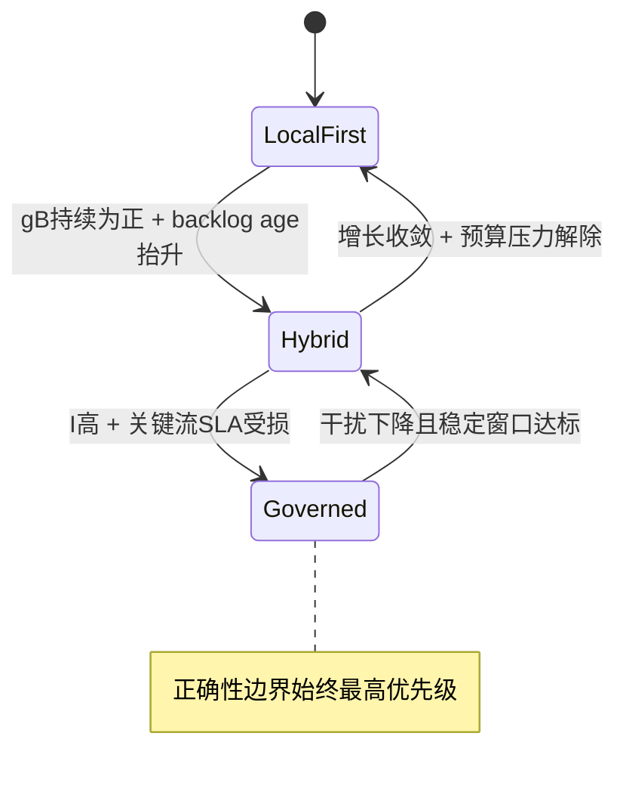
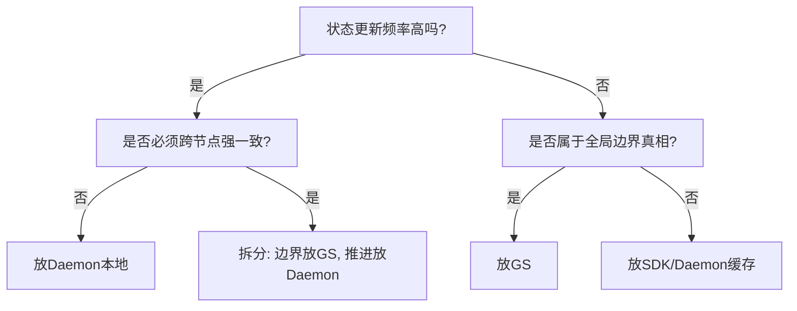
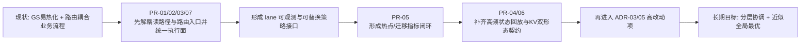

# 02. 模式切换、工作负载画像与治理落地（决策手册）

## 1. 本文目标

`01` 解决“状态该放哪”，本篇解决“在真实业务波动中如何决策”。

核心输入：

1. 当前可用能力：`0055` 已落地。
2. 目标场景：`0056`（daemon-run plan/signals/KV 协调）与 `0060`（descriptor-only queue）。
3. 现实约束：TensorCast 不是追求百万 QPS 的消息系统，而是高价值大对象/高干扰数据系统。

核心输出：

1. 一套可执行的工作负载画像模型。
2. 一套“中心化 vs 分布式”裁决逻辑。
3. 一套从当前系统逐步演进到目标状态的决策路线。

## 1.1 术语与关系（与 `01` 对齐）

为避免实现阶段术语漂移，本篇沿用 `01` 的强制口径：

1. `lane`：治理轨（收敛为三类）：`catalog-first` / `stream-first` / `hybrid-cache-first`。
2. `mode`：治理强度档位（运行期可切换）：`Local-First` / `Budgeted-Hybrid` / `Global-Governed`。
3. `policy`：可审计治理策略对象（Lane Compiler 产物），至少包含 `lane + policy_version + staleness_budget + mode_limits`。

注意：本篇的 `policy/policy_version` 指 lane/mode/预算/陈旧性等“治理策略版本”，不要与现有 API/Proto 中的 `StorePolicy`（持久化/驻留/冷暖/保活等存储语义）混淆。两者正交：`StorePolicy` 决定“存到哪/保多久”，治理 `policy` 决定“怎么协调/怎么去热/怎么切 mode”。

硬约束（本篇所有“切换/治理”讨论都必须满足）：

1. `mode ⟂ lane`：`mode` 只改变闸门强度，不改变正确性边界，也不把 per-item 推进推回 GS。
2. 同一 `idempotency_key` 内默认禁止切 `lane`；若必须切 lane，必须进入新幂等域并记录迁移审计。

实现验收口径：LaneContext/Directory/去热化/幂等 的最小契约集合见 `01-global-optimum-vs-distributed-execution-framework.md` 的第 16 节（Contract-First）。

---

## 2. 统一目标：不是单指标最优，而是系统稳态最优

我们优化的是多目标函数，不是单点吞吐：

1. 正确性边界：ownership / fencing / idempotency。
2. 性能：吞吐与 tail latency。
3. 干扰：大流对关键流的影响。
4. 控制面可扩展性：GS 回源率与热写压力。
5. 演进可控性：可灰度、可回滚、可解释。

结论：

- “每次决策全局最优”在工程上不可持续；
- “边界强一致 + 执行近似最优”才是可长期运行的方案。

---

## 3. 画像模型：把 Artifact 从“对象”变成“行为体”

## 3.1 七维画像向量

每个 Artifact/Workload 用以下七维描述：

1. 生命周期：`L`（短/中/长）。
2. 生产速率：`lambda_p`（items/s 或 bytes/s）。
3. 消费速率：`lambda_c`。
4. 增长速率：`gN=lambda_p-lambda_c`，`gB=lambda_p*E[size]-lambda_c*E[size]`。
5. 对象规模：`E[size]` 与 p95 size。
6. 复用率：`R`（跨请求复用概率）。
7. 拓扑干扰系数：`I`（大流对关键流/链路的影响强度）。

这七维是决策输入，不是仅用于监控展示。

## 3.2 五类主画像（用于初始治理）

1. `A类` 长寿命高复用：模型权重、基线工件。
2. `B类` 短寿命高频稳态：在线流水线中间结果。
3. `C类` 短寿命持续增长：生产快于消费，积压扩大。
4. `D类` 高干扰大对象：单次传输影响拓扑显著。
5. `E类` 中寿命共享热点：典型如 Decoder 间共享 KV 片段。

建议：先做五类即可，不要过早把标签做得过细。

---

## 4. 协调模式：从“架构口号”变成“运行策略”

## 4.1 三模式定义

1. `Local-First`（默认模式）。
- 主要依赖 SDK/Daemon 本地状态。
- GS 仅用于必要的低频真相刷新。

2. `Budgeted-Hybrid`（收敛模式）。
- 本地执行仍占主导。
- 但执行必须满足全局预算边界（链路/并发/保活预算）。

3. `Global-Governed`（高风险治理模式）。
- 对高干扰或高价值关键流采用更强中心约束。
- 许可优先于执行，牺牲部分延迟换系统稳定。

补充约束（必须写死，防止实现漂移）：

- `Global-Governed` 不是“每请求回源 GS / 让 GS 执行热路径”，而是更强的 admission/budget/回源闸门；per-item 推进仍必须留在 daemon/broker 本地。

## 4.2 模式与项目现状映射

| 模式 | 当前支持度 | 依赖能力 |
|---|---|---|
| Local-First | 中（部分可实践） | 0055 + 当前 daemon/GS registry + 选源去热化 |
| Budgeted-Hybrid | 中（可先做部分） | memory tier + 目录缓存 + 预算控制面 |
| Global-Governed | 中低（需谨慎推进） | 强仲裁策略、灰度开关、回滚机制 |

`0056/0060` 的价值主要在于把 Local-First 与 Hybrid 的执行基础补齐，而不是让系统走向“全中心化”。

现状校正（必须明确）：

1. 当前 P2P 选源在主路径上仍显著依赖 GS（`materialize_orchestrator -> GlobalStoreClient::request_replica_transport/request_view_transport`）。
2. 因此 `Wave 0/1` 的前置目标不是“直接享受 Local-First 收益”，而是先完成“GS 选源去热化”。

## 4.3 模式切换状态机

---

## 5. 中心化与分布式的裁决逻辑（你关心的核心权衡）

## 5.1 什么时候偏中心化

满足任意一条即可倾向中心治理：

1. 冲突域大且跨节点（ownership 争用明显）。
2. 错判成本高（一次错误会放大为系统风险）。
3. 流量干扰度高（I 高，大流冲击关键流）。
4. 任务价值高（关键 SLA 流量）。

## 5.2 什么时候偏分布式

满足以下条件时优先本地化：

1. 高频状态推进（per-item/per-attempt）。
2. 决策依赖局部瞬时信息（本机队列、本机资源水位）。
3. 全局最优收益低于协调开销。
4. 失败可通过重试/降级恢复。

## 5.3 一句话规则

- 中心化负责“边界真相”；
- 分布式负责“高频执行”。

## 5.4 KV 两类场景的专门裁决

你补充的场景要求我们把 KV 至少拆成两类：

1. `PD流式KV`
- 更像实时数据流：高频、短停留、连续传输。
- 默认裁决：`Local-First` 或 `Budgeted-Hybrid`，GS 只做 fencing/shard lease。

2. `Decoder共享KV`
- 更像“热点共享副本”：复用中高，生命周期中等。
- 默认裁决：`Budgeted-Hybrid`，需要轻量目录与热点迁移能力；在高价值场景可临时升到 `Global-Governed`。

| 维度 | PD流式KV | Decoder共享KV |
|---|---|---|
| 核心目标 | 推进吞吐与低时延 | 命中率与热点均衡 |
| 目录依赖 | 低 | 中到高 |
| 最佳路径 | stream-first | hybrid-cache-first |
| 主要风险 | 控制面回源过多导致抖动 | 热点集中与迁移滞后 |

---

## 6. 控制回路设计：避免振荡与误触发

## 6.1 三层回路

1. 快回路（ms 级）。
- 本地重试、局部重选、短退避。

2. 收敛回路（100ms~秒级）。
- admission/credit/局部并发调节。

3. 全局回路（秒级）。
- 全局预算更新、模式升级/回切决策。

## 6.2 防振荡机制（必须有）

1. 双阈值（进入阈值 > 退出阈值）。
2. 最小驻留时间（min dwell）。
3. 冷却窗口（cooldown）。
4. 调整速率限制（rate limit）。

## 6.3 统一裁决顺序

当回路冲突时，固定顺序：

1. fencing/ownership 正确性。
2. 关键流 SLA。
3. 全局预算边界。
4. 吞吐与命中率最优。

这条顺序必须写入实现注释与值班手册，不能只在设计文档里出现。

## 6.4 模式切换默认参数表（v0 建议值，可灰度调参）

> 目标是先给出“可执行默认值”，避免上线后完全靠人工值守调参。

| 参数 | 默认值（建议） | 说明 |
|---|---|---|
| 快回路窗口 | `10s` | 统计短期抖动与局部失败率 |
| 收敛回路窗口 | `60s` | 判断 backlog/回源率是否持续偏离 |
| 全局回路窗口 | `300s` | 判断模式升级/回切的稳态趋势 |
| 进入 `Budgeted-Hybrid` 条件 | 连续 `2` 个收敛窗口超阈 | 例：`GS回源率` 或 `backlog age` 超阈 |
| 退出 `Budgeted-Hybrid` 条件 | 连续 `3` 个收敛窗口回落 | 进入阈值高于退出阈值（双阈值） |
| 进入 `Global-Governed` 条件 | 连续 `2` 个全局窗口关键流 SLA 受损 | 或 fencing 冲突率异常上升 |
| 最小驻留时间（Governed） | `15 min` | 避免模式抖动 |
| cooldown | `10 min` | 回切后冷却时间，禁止立刻再升级 |
| 调整速率限制 | 每 `15 min` 最多一次模式变更 | 控制系统振荡 |

## 6.5 触发/退出与回滚判据矩阵（按 lane）

| lane | 默认模式 | 触发升级信号 | 退出信号 | 异常策略 |
|---|---|---|---|---|
| `catalog-first` | `Budgeted-Hybrid` | GS 仲裁 P99 超预算且关键流受损 | 目录命中与仲裁延迟恢复到阈值内 | 默认 `fail-closed`（边界语义优先） |
| `stream-first` | `Local-First` | backlog 持续上升 + 回源率异常 | backlog 收敛且回源率恢复 | 控制动作 `fail-closed`；已接收数据短窗 `fail-open` |
| `hybrid-cache-first` | `Budgeted-Hybrid` | 热点集中度持续恶化 + 迁移收益下降 | 热点分散恢复且命中率回升 | 目录建议可降级，ownership/fencing 仍 `fail-closed` |

冲突处理细则：

1. 多信号同时触发时，先看 `6.3` 优先级，再看“持续时间最长”的信号源。
2. 同优先级冲突时，选择更保守模式（宁可短期损失吞吐，不放宽正确性边界）。
3. 任一窗口内出现 fencing/ownership 不确定态，立即切到保守执行并触发回滚检查。

---

## 7. 四个高价值场景推演（面向 0056/0060 目标）

## 7.1 场景一：短寿命高频生产-消费链（0060 主场景）

特征：

1. `L` 短，`lambda_p/lambda_c` 都高。
2. per-item 状态推进频繁。
3. 数据可大可小，但 descriptor 推进频率极高。

裁决：

1. work item/work lease/credit 放 broker leader 本地。
2. GS 仅承接 queue leadership + epoch fencing。
3. issuer-daemon retention handle 走 issuer 路由，不绕 leader。

前置条件（先于 queue 本地状态机实现）：

1. 需要先定义 `QueueDirectory` 最小契约，至少回答三件事：
- 如何稳定定位 queue（`namespace/name/group` 语义）。
- 如何发现 leader endpoint（含 bounded-stale 预算）。
- 如何绑定 epoch fencing（与 `operation lease_generation` 对齐）。
2. 在当前仓库可先复用 `operation lease + capability_token.queue_epoch + worker/instance directory` 组合实现最小版本。

收益：

- 避免 GS 成为热写热点。

风险：

- L0 broker 故障下状态丢失（0060 已明确语义边界）。

## 7.2 场景二：长寿命高复用 artifact（现状与未来都常见）

特征：

1. `L` 长，`R` 高。
2. 重复读取多，路由质量重要。

裁决：

1. replica 目录与低频状态放 GS。
2. 单次读路径中的重试/候选排序在 daemon 本地做。
3. SDK 保留短 TTL 本地缓存，降低重复回源。

收益：

- 兼顾全局视图与热路径成本。

## 7.3 场景三：KV 预热迁移（0056 提案场景）

特征：

1. 对象高基数，生命周期偏短。
2. 批量 exists/get/put 高频。
3. 若全量进 GS catalog，控制面会被拖垮。

裁决：

1. GS 只管 shard lease（低基数仲裁）。
2. home daemon 管理 blob 不变量与 epoch fence。
3. daemon-run plan 负责分布式动作编排。

收益：

- 保留“全局可控边界”同时避免高基数目录中心化。

## 7.4 场景四：Decoder 间共享 KV（你补充的关键场景）

特征：

1. 不同 Decoder 实例之间存在可复用 KV 片段。
2. 对象生命周期明显长于 PD 流式中间态。
3. 复用收益与热点迁移收益显著。

裁决：

1. 不走“纯流式本地态”单一路径，采用 `hybrid-cache-first`。
2. 目录层不必记录全部细粒度对象，但必须记录热点摘要与副本质量。
3. 数据面依旧由 daemon 执行，目录层负责建议迁移与反热点。

收益：

- 把共享KV治理从“碰运气命中”提升为“可规划命中”。

风险：

- 目录过细会热化；目录过粗会失去迁移收益，需要持续调参。

## 7.5 issuer 路由故障语义矩阵（Queue/共享缓存必须具备）

`retention handle` 在当前实现上与 issuer 强绑定（token 校验会校验 `issuer_daemon_id`）。  
因此必须把故障语义写成显式矩阵，而不是“失败后重试”一句话带过。

| 故障场景 | 默认语义 | 允许动作 | 禁止动作 | 补救流程 |
|---|---|---|---|---|
| issuer daemon down | `fail-closed`（默认） | 在 `grace TTL` 内保留已在途消费 | 无限续租、无界等待 | 进入 `renew_pending`，超时后 `re-stage` 到新 issuer；旧 handle 写入 broker tombstone |
| broker 与 issuer 网络分区 | `fail-closed`（默认） | 短窗重试与目录重解析 | 用旧路由长期续租 | 超过分区阈值后拒绝 renew/release，触发 producer 侧补偿或重入队 |
| queue epoch 变更（leader 切换） | 强围栏切断旧会话 | 新 epoch 下重建 lease/credit | 旧 epoch 的 ack/nack/extend | 旧 epoch 直接拒绝，按 `(queue_operation_id, epoch)` 重新握手 |
| issuer 重启且目录已迁移 | 有条件恢复 | 若可验证同 issuer 身份则继续 | 跨 issuer 直接复用旧 token | 无法验证时走 `re-stage + new handle`，旧 token tombstone 回收 |

语义原则：

1. `fail-open` 仅限短暂“读已接收数据”窗口，不允许放宽 ownership/epoch 校验。
2. 任何涉及 renew/release 的不确定状态，统一 `fail-closed`。
3. 目录恢复与重试都必须受限于预算（重试次数/时间窗），避免故障风暴放大。

---

## 8. 决策卡片（用于架构评审会）

以下卡片可直接用于评审结论模板。

## 8.1 卡片 A：新状态应放哪层？

## 8.2 卡片 B：某操作是否必须每次回源 GS？

判定标准：

1. 不涉及 ownership/epoch/fencing：默认不必每次回源。
2. 涉及边界仲裁：必须回源或使用有效围栏缓存。
3. 只为“追求可能更优路由”而回源：优先用 bounded-stale 本地信号。

## 8.3 卡片 C：是否需要升级模式到 Global-Governed？

触发建议：

1. `I` 高且持续。
2. 关键流 SLA 持续受损。
3. Local/Hybrid 下无法在两个窗口内收敛。

退出建议：

1. 干扰指标与 SLA 同时恢复。
2. 达到最小驻留时长后再回切。

## 8.4 卡片 D：Producer 该不该等待，以及等在哪里？

判定顺序：

1. Consumer 可立即接收：优先直达（direct-to-consumer）。
2. 不可立即接收且等待窗口很短：允许极短暂 `VRAM` 缓冲。
3. 等待窗口达到秒级或更长：转入 `DRAM/stable_dram`（默认）。
4. 积压持续增长：落入共享磁盘/对象层兜底，并进入 `Budgeted-Hybrid` 或 `Global-Governed`。

## 8.5 卡片 E：lane 决策记录点与重试语义

判定标准：

1. lane 决策必须可审计，至少记录：`request_id + idempotency_key + lane + policy_version`。
2. 同一 `idempotency_key` 默认不允许在重试中切换 lane（避免语义漂移与重复副作用）。
3. 若确需切 lane，必须显式进入新幂等域（新 `idempotency_key`）并留下迁移审计记录。
4. 审计与指标的基数必须受控：`lane/policy_version/qos` 可进入指标标签；`request_id/idempotency_key` 必须只进日志/trace（禁止进入 Prometheus label）。

近期落地建议（结合当前协议）：

1. Plan 路径短期先借 `PlanSpec.context.tags` 透传 lane/policy_version。
2. 非 Plan 路径（`materialize/prefetch/pin/...`）短期由 SDK 把 `CallContext.tags` 映射到 daemon gRPC metadata（因为当前 `store_daemon.proto` 尚无统一 `CallContext` 字段），透传 lane/policy_version。
   - 推荐 metadata keys（v0 约定）：`x-tc-lane`, `x-tc-policy-version`, `x-tc-request-id`, `x-tc-idempotency-key`, `x-tc-qos`（缺省值允许为空但必须可审计）。
3. daemon 侧统一在执行入口落审计日志与关键指标标签（至少 lane/policy_version/qos），避免“只有 Plan 可审计”的断层。
4. 协议演进阶段把 LaneContext 升格为显式字段，并覆盖 plan 与非 plan RPC，减少隐式约定与跨语言偏差。

---

## 9. 从当前系统到目标系统的分阶段决策

## 9.1 阶段 0：立即可执行（不依赖 0056/0060 新协议）

1. 固化状态分层原则：热状态不上 GS（per-item 推进不入 GS；强一致仅覆盖 fencing/ownership）。
2. 把“GS 参与每请求选源”识别为明确技术债，建立去热化改造清单与验收指标。
3. 以 `transport 路径降回源` 作为硬目标，至少落四项（注意：去热化必须保持 claim/reservation 等价语义）：
- source sticky（短窗粘性候选，减少重复中心仲裁）。
- 短 TTL 候选缓存（携带 staleness 预算；命中即本地决策，失败才回源）。
- 失败回源策略（本地失败后再回 GS，避免盲目双写路径）。
- claim/reservation 等价机制（例如 source 侧短 TTL ticket 或本地 reservation），并有超时回收防泄漏。
4. 建立 LaneContext 审计闭环：Plan 用 `PlanSpec.context.tags`；非 Plan 用 daemon metadata；daemon 统一落日志/指标标签，避免语义漂移。
5. 建立“回源率 + claim失败率 + fencing 失败率 + stale 超窗率 + 控制面 P99”指标闸门（lane/mode 维度可切片）。
6. 在现有流程中引入 mode 切换的观测与手动开关（kill switch/回滚优先），不急于自动化切换。
   - 配置与发布口径必须遵循 `docs/designs/0004-unified-runtime-config.md`，避免新增 ad-hoc env vars 或分散开关。

## 9.2 阶段 1：围绕 0060 试点（队列场景）

1. 先做单场景小流量 L0 试点。
2. 先落 `QueueDirectory` 最小契约，再验证 leader 本地推进 + epoch fencing 模式。
3. 验证 retention handle 的 issuer 路由与失效语义（含 grace TTL/re-stage/tombstone）。

## 9.3 阶段 2：围绕 0056 试点（控制网络）

1. 当前 `Plan.run` 以 SDK 本地编排为主；阶段 2 目标是把可外部执行步骤统一到 `NodeAgent.ExecutePlan`，避免新增平行执行面。
2. 建立 daemon cache signals 原型，并补齐 worker action 与目录缓存能力。
3. 如需 gateway，仅保留无状态接入能力；验证其可替换且不承载独占语义。
4. 明确 `NodeAgentDirectory` 最小契约（见 `01` 第 16.2 节），至少可稳定解析：`instance_id -> node_agent_endpoint`（且 gated by `INSTANCE_CAPABILITY_FLAG_NODE_AGENT_ENABLED`）。
   - 现状校正：当前仓库的 GS instance registry 具备 `capability_flags/signals_endpoint/labels`，但尚未形成“可直接拨号”的 `node_agent_endpoint` 事实锚点；因此在进入执行统一前，必须先把“Node Agent 可发现/可拨号”变成明确可验收的目录事实。
5. 补齐 SDK discovery/client（直连模式先行）：
   - discovery：通过 bounded-stale directory 获取 instance 元信息，并解析 `node_agent_endpoint`（pilot 可短期用 reserved label 键承载，例如 `labels["tc.node_agent.endpoint"]`；长期必须升格为显式字段，避免 ad-hoc 约定）。
   - client：SDK 侧提供 `NodeAgentService.ExecutePlan` 调用与错误映射；失败必须可解释（endpoint 缺失/能力不满足/拨号失败/target mismatch）。
   - orchestration：`Plan.run` 的本地编排必须能把 instance steps 分发给 Node Agent（跨 target 依赖仍由编排层控制），避免“instance step 永远 UNIMPLEMENTED”的断层。
6. 统一验收口径（必须写清楚）：
   - 对外语义：只要启用 Node Agent 且目录可发现，Plan 中的 instance steps 就必须可执行；否则必须 fail-fast 并给出可操作的缺失项（目录事实、能力位、网络可达性）。
   - 一致性：LaneContext/审计键/幂等域规则与非 Plan 路径一致（避免 Plan 独享语义）。

## 9.4 阶段 3：融合治理

1. 画像驱动模式切换自动化。
2. 拓扑预算与关键流保护联动。
3. 以治理闭环而非功能数量作为里程碑。

## 9.5 阶段 4：架构级升级（可选激进路线）

如果你选择更根本性的长期路线，建议进入阶段4：

1. 引入“三层协调器”：
- Global（GS）/Shard（区域或分片）/Local（daemon）分层治理。

2. 引入 `Artifact Lane Compiler`：
- 把每类 Artifact 编译为 `catalog-first / stream-first / hybrid-cache-first`，并可热更新策略。

3. 引入“共享KV轻目录层”：
- 不记录全部细粒度对象，只记录热点摘要与副本质量，支持迁移决策。

---

## 10. 指标体系与治理闸门

## 10.1 指标分组

1. 正确性：fencing 冲突、token 失配、双主写入。
2. 性能：p50/p95/p99、关键流 SLA。
3. 干扰：大流占比、非关键流延迟放大。
4. 控制面：GS 回源率、GS 热写 QPS、缓存 staleness 超窗率。

## 10.2 上线闸门

1. 设计闸门：状态 SoT 与一致性边界是否清晰。
2. 实验闸门：对照实验是否优于集中式与纯分布式 baseline。
3. 灰度闸门：是否有 mode kill switch 和一键回退。
4. 全量闸门：关键场景长稳运行是否通过。
5. 幂等闸门：所有在未知结果下可能被重试的动作必须具备 join key（幂等合流）或显式禁止重试（placement pin 等副作用动作尤需严格）。

---

## 11. 面向当前决策的建议结论

结合现状与目标，建议当前采用以下主策略：

1. 把 `0056/0060` 当作方向约束，而非实现承诺。
2. 对所有新状态强制执行“边界状态 vs 推进状态”拆分评审。
3. 近期优先做可观测与治理闭环，而不是立即追求复杂控制算法。
4. 在队列与 plan 两条线都坚持“GS 低频仲裁、Daemon 高频执行”。
5. 保持强一致范围最小化：只覆盖 fencing/ownership。
6. 对 KV 明确区分 `PD流式` 与 `Decoder共享`，分别采用 `stream-first` 与 `hybrid-cache-first`。
7. 0056 执行面优先复用 `NodeAgent.ExecutePlan`，避免先引入双执行面复杂度。
8. 0060 在队列状态机前必须先落 `QueueDirectory` 最小契约与 issuer 故障语义。

---

## 12. 问题覆盖矩阵（对应本轮讨论）

| 你的问题 | 本文回答位置 | 结论 |
|---|---|---|
| Artifact 可否按长/短生命周期区分 | 3、7 | 可以，但必须叠加频率/增长/干扰维度 |
| Decoder 间共享 KV 是否应与 PD-KV 区分治理 | 5.4、7.4、11 | 必须区分，前者更接近热点共享副本治理 |
| 不同架构决策对 scaling 的影响 | 17 | 关键在于是否把高频控制状态从 GS 热路径迁出 |
| 方案能否泛化到更多场景 | 18 | 能，前提是满足七维画像、三轨映射与边界围栏约束 |
| 仅看 descriptor 为何仍可能瓶颈 | 2、5、7.1 | 控制面热路径若中心化，仍会拖垮系统 |
| 全局最优与去中心化如何权衡 | 5 | 用边界强一致 + 执行近似最优 |
| 去中心化性能要求不极端能否利用 | 4、9 | 可以适度增强中心预算治理，但不把 GS 放入热路径 |
| 如何辅助后续决策 | 8、9、10 | 给出决策卡片、阶段路线与闸门体系 |
| 0056/0060 是提案如何处理 | 1、4.2、9 | 作为目标约束分阶段验证，不按既成事实推进 |
| 现状是否已高支持 Local-First | 4.2、9.1、17 | 否：当前仍有 GS 选源热路径，Wave0/1 需先去热化 |
| 0056 执行面是否应新建 gateway | 9.3、14、16 | 不应先新建平行执行面；先复用 Node Agent ExecutePlan |
| Queue epoch 是否可先于目录契约落地 | 7.1、9.2、16 | 不可；先定义 QueueDirectory 最小契约再推进队列状态机 |
| issuer 路由故障如何处理 | 7.5、9.2 | 需显式故障矩阵与补救流程，默认 renew/release fail-closed |
| lane 决策与重试语义如何收敛 | 8.5、13、16 | 必须记录 lane 决策点；同幂等域默认禁止重试改 lane |

---

## 13. 待验证假设（必须实证）

1. 拓扑干扰指标 `I` 的可观测性是否足够稳定。
2. 模式切换阈值对业务的敏感度。
3. retention handle TTL 与 queue lease 预算之间的最优比例。
4. Node Agent/协调入口失效重试下，计划步骤幂等合流的实际成功率。
5. 共享KV目录粒度（摘要粒度）对命中率与控制面成本的最优平衡点。
6. 不同 lane 下 GS 回源率与 P99 控制时延的拐点区间（用于量化 scaling 潜力）。
7. 扩展场景（检查点/装配/恢复）在三轨下的稳态切换成本与回滚时延。
8. QueueDirectory 的 bounded-stale 窗口对 leader 误判率与故障恢复时长的影响。
9. 同一 idempotency 域内“禁止 lane 变更”对重试成功率与副作用抑制的净收益。

这些验证结果将决定参数，不改变主框架方向。

---

## 14. 架构重构执行规划（高层）

本节把“怎么改”收敛为架构级计划，按你要求明确三点：

1. 与现有模块关系；
2. 重构方向；
3. 重构范围。

### 14.1 执行路线图（Wave-based）

### 14.2 Wave 与现有模块映射

| Wave | 目标 | 关联现有模块 |
|---|---|---|
| W0 | 固化术语与契约（lane/mode/policy、审计键、Directory 契约族）+ GS 选源去热化清单与指标闸门 + QueueDirectory 最小契约（PR-08a） | `docs/distributed-coordination-series/*`, `core/store/materialization/control/*`, `tensorcast/global_store/services/*` |
| W1 | Node Agent 执行面统一（主轴）+ daemon 执行入口 lane-aware + LaneContext 透传闭环（plan+非plan）+ 动作幂等/重试护栏（placement pin 等） | `tensorcast/node_agent/*`, `daemon/service/controllers/*`, `daemon/state/*`, `tensorcast/api/plan/*`, `tensorcast/api/store/*` |
| W2 | 引入 shard 协调（可先内嵌 daemon） | `daemon/*`（新协调子模块）, `tensorcast/global_store/services/*` |
| W3 | 上线共享KV摘要目录与迁移编排 | `tensorcast/global_store/repositories/*`, `schema.sql`, `proto/tensorcast/global_store/v1/*` |
| W4 | 自动化策略收敛与模式切换 | `tensorcast/global_store/metrics.py`, `daemon`/`sdk` observability 相关模块 |

补充关系矩阵（统一 SoT，避免平行组件）：

| 组件 | SoT 边界 | 必须做的事 | 不应做的事 |
|---|---|---|---|
| SDK (`tensorcast/api/store/*`, `tensorcast/api/plan/*`) | 请求上下文与轻缓存 | 透传 lane/policy、保留本地读缓存 | 承担跨节点仲裁或全局一致性 |
| Daemon (`daemon/service/controllers/*`, `daemon/state/*`) | 高频执行状态与本地状态机 | 本地择源执行、queue/lease/credit 推进、失败回源 | 把高频状态上推 GS 热写 |
| Node Agent (`node_agent.proto`, `tensorcast/node_agent/*`) | 计划执行主轴 | 执行 DAG、聚合步骤状态、与 daemon 协同 | 与 daemon/gateway 形成第二套独立执行语义 |
| Global Store (`global_store/services/*`, `schema.sql`, `operation.proto`) | 全局真相与围栏边界 | membership、lease/fencing、硬预算、目录真相 | 承接 per-item 热状态推进 |
| QueueDirectory（基于 GS 目录语义） | `queue identity -> leader endpoint -> epoch fencing` | 稳定发现与 bounded-stale 控制 | 复制一套与 operation lease 脱节的队列围栏体系 |

### 14.3 每个 Wave 的重构方向与改变范围

#### W1：Lane-aware Local Executor（中改动）

1. 方向：
- 保持 daemon 本地状态机核心地位；
- 以 Node Agent 为默认 Plan 执行器；
- 在执行入口引入 lane 策略分派，并形成 LaneContext 审计闭环（plan+非plan）；
- 在启用跨进程重试前补齐动作幂等护栏（placement pin join key 或显式不可重试）。

2. 范围：
- `daemon/service/controllers/*`
- `daemon/state/session_lifecycle*`
- `tensorcast/api/plan/plan.py`
- `tensorcast/node_agent/server.py`, `tensorcast/node_agent/executor.py`

#### W2：Shard 协调层（中到高改动）

1. 方向：
- 增加 Global 与 Local 之间的中层协调；
- 把热点治理与迁移决策从 GS 热路径中剥离。

2. 范围：
- `daemon` 新增协调子模块（或 sidecar）
- `tensorcast/global_store/services/*` 增加 shard 相关协调接口
- `proto/tensorcast/operation/v1/*` 与 `global_store/v1/*` 增量扩展

#### W3：共享KV轻目录（高改动）

1. 方向：
- 不记录全量高基数KV对象；
- 记录热点摘要与副本质量，用于迁移与均衡；
- 与现有 `artifact_replicas.export_state/export_generation` 严格绑定，避免目录“指向旧副本”。

2. 范围：
- `schema.sql` 新表/视图
- `tensorcast/global_store/repositories/*`
- `tensorcast/global_store/rpc/*`

#### W4：自动化治理（中改动）

1. 方向：
- 从人工阈值运营转向闭环调优；
- 保持 kill switch 与回滚优先。

2. 范围：
- 指标、审计、策略发布与回滚控制面

### 14.4 变更边界（避免失控）

1. 不改动数据面核心语义：
- P2P/RDMA/MTCP、StoreEngine materialization 主路径保持稳定。

2. 不改动对象模型核心语义：
- 维持 Artifact-first，不引入并行数据对象系统。

3. 优先控制面增量演进：
- 先治理，再自动化，再大规模切换。

---

## 15. 统一决策清单（ADR-lite）

本节用于“最终拍板”，统一口径为：

1. 与现有模块关系；
2. 重构方向；
3. 改变范围；
4. 回滚护栏。

| ADR | 决策主题 | 与现有模块关系 | 重构方向 | 改变范围 |
|---|---|---|---|---|
| ADR-01 | 三轨数据路径（catalog/stream/shared-cache） | 复用 `Artifact-first`、`daemon controllers`、`global_store registry` | 从隐式策略切换到显式 lane 治理 | 中（控制面与策略层） |
| ADR-02 | KV 双形态治理（PD流式 vs Decoder共享） | 复用 `session_lifecycle`、`retention_registry`、`operation lease` | 把单一 KV 策略拆分为两条治理链路 | 中（策略与路由层） |
| ADR-03 | Global/Shard/Local 三层协调 | 复用 GS 仲裁与 daemon 执行；新增 shard 协调能力 | 控制面分层化，降低 GS 热路径压力 | 高（新增中层协调） |
| ADR-04 | Lane Compiler（策略编译器） | 对接 `sdk hint`、`plan`、`node_agent`、`daemon dispatch` | 策略配置化、可审计、可回放 | 中（SDK+node_agent+daemon+治理面） |
| ADR-05 | 共享KV轻目录（摘要目录） | 基于 `schema.sql`、`global_store repos/services` 扩展 | 全量目录 -> 热点摘要目录 | 高（schema + GS 服务） |
| ADR-06 | 双平面负载均衡（data/meta） | data-plane 复用 `StoreEngine/P2P`; meta-plane 扩展 GS/shard 策略 | 本地快选源 + 全局/分片反热点 | 中高（执行层+治理层） |
| ADR-07 | 一致性边界最小化 | 复用 `operation.proto` fencing、token 语义 | 强一致仅覆盖 ownership/fencing | 低（原则约束） |
| ADR-08 | Wave 化重构落地 | 复用现有模块并分阶段推进 | 先低风险治理，后中高风险跃迁 | 低到高（按波次渐进） |

### 15.1 每条 ADR 的回滚护栏（统一模板）

每条 ADR 统一要求以下回滚能力：

1. `Kill Switch`：可按 lane/场景一键降级到 Local-First 或现网稳定模式。
2. `Read-Only Fallback`：协调层异常时可退回仅执行、停止新治理动作。
3. `Fencing Strict Mode`：任何不确定状态默认 fail-closed，不放宽 ownership/epoch 校验。
4. `Metrics Gate`：若关键指标连续超阈值（SLA、错误率、GS 压力），自动触发回滚。

### 15.2 拍板优先级建议（从高到低）

1. `ADR-07`（一致性边界最小化）  
2. `ADR-01`（三轨数据路径）  
3. `ADR-02`（KV 双形态治理）  
4. `ADR-08`（Wave 执行路线）  
5. `ADR-04`（Lane Compiler）  
6. `ADR-06`（双平面负载均衡）  
7. `ADR-05`（共享KV轻目录）  
8. `ADR-03`（三层协调器完全体）  

原因：

1. 先固化边界与分轨，才能避免后续实现反复摇摆。
2. 再推进策略编译与均衡优化，最后再做架构级新增层，风险更可控。

---

## 16. 先做“局部重构”是否更有利（结论：是）

你的这个判断是正确的。对长期目标而言，先做几项“高杠杆局部重构”可以显著降低后续大改风险。

### 16.1 局部重构优先清单（Pre-Refactor Set）

| PR | 局部重构项 | 与现有模块关系 | 重构方向 | 改变范围 | 解锁后续 |
|---|---|---|---|---|---|
| PR-01 | Capability Directory 契约复用扩展（带 staleness 预算） | 复用 `tensorcast/capability_directory.py` 的目录语义与失效策略；daemon 侧采用同契约本地实现 | 在既有目录语义基础上补 daemon 侧接入与 staleness 预算；定义长期收敛到 daemon-served signals/directory（0056）的迁移口径；并为 transport 候选提供读模型 | 低到中（daemon + SDK 读路径） | ADR-01, ADR-04 |
| PR-02 | 执行入口路由抽象层（Routing Interface） | 覆盖 `daemon/service/controllers/*` 与 GS client 调用点 | 将“如何选源”从业务流程剥离成可替换策略层，并先去热化 GS 每请求选源（保持 claim/reservation 等价语义） | 中（daemon 控制层） | ADR-04, ADR-06 |
| PR-03 | 统一 LaneContext 透传（SDK->Daemon） | 复用 `CallContext`、`plan`、daemon RPC 请求上下文 | 覆盖 plan 与非 plan RPC（materialize/prefetch 等）的 lane/policy_version 显式透传；非 plan v0 先用 gRPC metadata，避免隐式约定 | 低到中（SDK + daemon 协议增量） | ADR-01, ADR-02 |
| PR-04 | 高频状态机事件化（本地事件日志/回放钩子） | 基于 `session_lifecycle`、`retention_registry` 扩展 | 为 queue/kv 高频状态提供可观察、可回放基座 | 中（daemon state） | ADR-02, ADR-03 |
| PR-05 | 热点与迁移可观测最小闭环 | 覆盖 `global_store/metrics.py`、daemon 指标 | 先做指标闭环，再做自动迁移闭环 | 低（观测层） | ADR-05, ADR-06 |
| PR-06 | KV 双形态统一键空间契约 | 复用 `selection_identity` 与 capability/fencing 语义 | 统一 `kv_streaming/kv_shared` 的身份与围栏口径 | 中（common + daemon + 规划协议） | ADR-02, ADR-05 |
| PR-07 | Node Agent 执行面统一 | 复用 `node_agent.proto`、`node_agent/server.py`、`node_agent/executor.py` | 以现有 `ExecutePlan` 为主执行面，避免双执行面；补齐 `NodeAgentDirectory`（`instance_id -> node_agent_endpoint`）与 SDK 侧 discovery/client，使 `Plan.run` 能分发 instance steps 并形成审计闭环 | 低到中（plan + node_agent） | ADR-04, ADR-08 |
| PR-08a | QueueDirectory 最小契约（前置） | 复用 `operation lease`、`capability_token.queue_epoch`、worker/instance 目录语义 | 先定义发现/围栏边界与 bounded-stale 预算，再落 queue 本地状态机 | 中（GS目录+daemon queue） | ADR-01, ADR-07 |
| PR-08b | issuer 故障语义与回收机制 | 复用 `retention_registry`、issuer 路由、tombstone/grace TTL 机制 | 在 PR-08a 契约之上完善故障分级恢复与回收 | 中（daemon queue+恢复流程） | ADR-01, ADR-07 |

### 16.2 为什么这些局部重构“先做更优”

1. 它们都不破坏现有数据面主路径（P2P/RDMA/MTCP）。
2. 它们直接降低未来大改的不确定性（尤其是 ADR-03/ADR-05 的高风险项）。
3. 它们把“策略讨论”提前变成“系统能力”，避免后续返工。

### 16.3 建议的最小启动组合（90 天）

建议先启动：`PR-01 + PR-02 + PR-03 + PR-05 + PR-07`；若 90 天窗口内包含 queue 试点，则并行加入 `PR-08a`。

原因：

1. 这五项能最快形成“可治理、可观测、可回滚、执行面不分叉”的基础盘。
2. 它们对现网侵入相对可控，不要求立即引入 shard 新层。
3. 完成后再推进 `PR-04/PR-06/PR-08b`，会显著降低实现复杂度。

说明：

1. `PR-01` 明确要求“复用已有 capability directory 语义与失效策略”，避免平行建设目录协议。
2. 若需新能力，优先定义为 `CapabilityDirectory` 的增量接口（如 transport 候选摘要）；daemon 采用本地实现对齐语义，不直接依赖 Python 实现。

### 16.4 与 Wave 路线的对应

1. `Wave 0/1`：优先落 `PR-01/PR-02/PR-03/PR-05/PR-07`，若含 queue 试点则同步落 `PR-08a`。
2. `Wave 2`：引入 `PR-04` 作为 shard 协调前置能力。
3. `Wave 3`：引入 `PR-06/PR-08b`，再上共享KV轻目录与迁移编排。

### 16.5 为什么“先局部重构”更利于长期目标（因果链）

核心逻辑：

1. 局部重构先把“接口与观测”稳定下来，再动“大结构”，可逆性更高。
2. 大改（如 shard 协调层、共享KV目录）依赖前置数据与策略接口，否则容易反复返工。
3. 在 TensorCast 当前规模与吞吐约束下，这种顺序能以更低风险获得更高演进速度。

### 16.6 对你的核心场景，局部重构的直接收益

| 场景 | 优先局部重构 | 立即收益 | 长期收益 |
|---|---|---|---|
| 权重加载（大对象、低频） | `PR-01`, `PR-02` | 降低目录回源与路由抖动，扩容高峰更稳 | 为 `catalog-first` 与全局预算治理提供稳定入口 |
| PD 流式 KV（高频、短停留） | `PR-02`, `PR-03`, `PR-04` | 高频状态留在 daemon，减少 GS 热写 | 为 `stream-first` + shard 协调奠定状态机与回放基础 |
| Decoder 共享 KV（中寿命、热点复用） | `PR-05`, `PR-06` | 先识别热点/迁移收益，避免盲目目录化 | 为“轻目录 + 迁移编排”降低试错成本 |

### 16.7 哪些改造不建议先做（避免高成本返工）

1. 不建议先上“完整三层协调器”再补观测与接口抽象。  
原因：没有 `PR-02/PR-05` 的基座，协调器会变成不可验证的复杂黑盒。

2. 不建议先把高基数 KV 全量写入 GS。  
原因：会把原本应在 daemon 本地推进的热状态中心化，放大单点瓶颈。

3. 不建议用单一策略同时治理 `PD流式KV` 与 `Decoder共享KV`。  
原因：两者目标函数不同（吞吐推进 vs 命中与迁移），统一策略会两头不优。

### 16.8 你当前可直接拍板的“先行重构组合”

建议先拍板以下顺序（保持 90 天内可落地）：

1. `PR-02`（路由抽象层）+ `PR-03`（LaneContext 透传）作为语义底座。
2. `PR-07`（Node Agent 执行面统一）避免后续双执行面返工。
3. `PR-01`（目录缓存读模型）降低 GS 热路径压力。
4. `PR-05`（观测闭环）作为后续 ADR 的上线门槛。
5. 若 queue 试点立项，先补 `PR-08a`（QueueDirectory 前置契约）。
6. 再进入 `PR-04` / `PR-06` / `PR-08b`，最后推进 ADR-03/05 高改动项。

这套顺序的本质是：先把系统变成“可测、可控、可回滚”，再做大重构。

---

## 17. Scaling 规模目标与架构决策映射

本节回答你新增的核心问题：不同决策对集群规模到底有什么影响。

### 17.1 先统一口径：规模不是节点数单指标

建议把“可扩展规模”定义为三维同时满足：

1. 节点规模：可稳定运行的 daemon/instance 数量；
2. 控制面规模：单位时间可承载的状态推进（lease/route/queue/kv 控制事件）；
3. 扰动恢复规模：局部故障或扩容风暴下的恢复时间与抖动幅度。

只有三维都达标，才算真正可 scale。

### 17.2 现状与目标的规模潜力差异（按架构阶段）

| 阶段 | 架构特征 | 规模潜力结论 | 主要限制项 |
|---|---|---|---|
| `Stage-A` 现状偏中心化 | GS 参与较多路由与目录路径 | 可支撑中小规模，但高频场景下上限受 GS 约束明显 | GS 单点控制面、热路径回源 |
| `Stage-B` 局部重构后 | daemon 目录缓存 + 路由抽象 + lane hint | 规模潜力明显提升到中规模，且扩展斜率更平滑 | 缓存一致性与回源策略 |
| `Stage-C` 三轨治理稳定 | 高频状态机下沉 daemon，本地推进 | 可进入中大规模区间，混合负载稳定性大幅提升 | 热点治理与迁移策略成熟度 |
| `Stage-D` 分层协调完成 | Global/Shard/Local 协同 | 才具备进一步冲击更大规模的架构条件 | shard 协调复杂度与运维成熟度 |

说明：

1. 我们不在文档里承诺“固定节点数”，因为当前仓库没有统一基准压测结果可直接给出硬值。
2. 但可以确定的是，`Stage-A -> Stage-C` 的核心收益来自“把高频控制状态移出 GS 热路径”。

### 17.3 与现有模块的直接关系（你关心的落地性）

1. 限制现状规模的关键模块：
- `tensorcast/global_store/services/transport_service.py`
- `tensorcast/global_store/services/worker_service.py`
- `tensorcast/global_store/repositories/operation_repository.py`

2. 提升规模潜力的关键改造入口：
- `daemon/service/controllers/*`（路由与执行入口解耦）
- `daemon/state/session_lifecycle.*`、`daemon/state/retention_registry.*`（高频状态机本地化）
- `tensorcast/api/plan/plan.py`、`tensorcast/api/store/*`（lane hint + 上下文透传）

3. 进一步放大规模的中层能力：
- shard 协调与轻目录（`global_store services/repos + proto/schema` 增量扩展）

### 17.4 推荐的规模推进方式（避免一开始就追“大而全”）

1. 第一阶段目标：先把 GS 从“热执行中心”降为“边界仲裁中心”。
2. 第二阶段目标：再把热点治理从 GS 拆到 shard/local。
3. 第三阶段目标：最后再追求更高层次的近似全局最优。

这个顺序最符合当前 TensorCast 代码现状，也最符合你提的长期最优演进路线。

---

## 18. 场景扩展与泛化：不止权重与 KV

你提到希望验证思路能否泛化，这一节给出扩展场景与裁决映射。

### 18.1 扩展场景清单（基于现有模块能力）

1. `S-1 检查点持久化与回放`
- 关联模块：`core/checkpoint/*`, `daemon/state/persistence_manager.*`, `global_store placement_service.py`
- 特征：对象大、频率中低、恢复时突发。

2. `S-2 View Piece 装配与 Seal`
- 关联模块：`daemon/service/controllers/registration_controller.cc`, `tensorcast/global_store/services/view_state_service.py`
- 特征：元数据编排复杂，数据面可并行，seal 前后状态切换关键。

3. `S-3 大规模滚动发布预热`
- 关联模块：`tensorcast/api/store/artifact.py` prefetch、`daemon/service/controllers/materialization_controller.cc`
- 特征：短时并发上升，拓扑干扰大，之后迅速回落。

4. `S-4 队列化中间特征流（非 KV）`
- 关联模块：`0060` 提案（queue lease/credit）、`daemon/state/retention_registry.*`
- 特征：高频短寿命，生产消费速率可能失衡。

5. `S-5 故障恢复与状态重建`
- 关联模块：`global_store recovery_service.py`, `worker_service.py`, `daemon ha/state sync`
- 特征：平时低频，故障窗口内控制流密度激增。

### 18.2 泛化裁决矩阵（映射到三轨）

| 场景 | 默认 lane | 默认模式 | GS 角色 | Daemon 角色 |
|---|---|---|---|---|
| S-1 检查点持久化/回放 | `catalog-first` | `Budgeted-Hybrid` | 计划与边界预算、状态归档 | 执行与重试、局部流控 |
| S-2 View 装配/Seal | `catalog-first + shared-cache` | `Budgeted-Hybrid` | 维护装配元数据与 seal 边界 | 负责 piece 执行与本地拼装 |
| S-3 滚动预热 | `catalog-first`（必要时混合） | `Global-Governed`（短时） | 扩容窗口做预算与反热点 | 本地择源与并发门控 |
| S-4 队列化中间流 | `stream-first` | `Local-First` | 仅做 epoch/fencing 与目录发现 | broker 本地推进 lease/credit |
| S-5 故障恢复 | `catalog-first` | `Global-Governed`（恢复窗口） | 真相恢复与边界重建 | 本地状态对账与补偿执行 |

### 18.3 泛化是否成立：判定标准

如果新场景满足以下判定，则可直接纳入本框架而无需新建体系：

1. 能用七维画像描述（`L`、`lambda_p`、`lambda_c`、`gN/gB`、`E[size]/p95`、`R`、`I`）；
2. 能落到三轨之一（或受控混合）；
3. 一致性边界仍可由 `lease/fencing` 覆盖；
4. 出现异常时可退回 `Local-First` 或 `Global-Governed` 保守模式。

满足以上四点，说明这套架构具有可泛化性，而不是只服务于“权重 + KV”。
