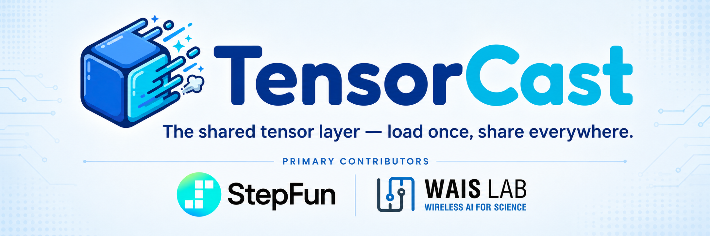

<p align="center">
  
</p>

<p align="center">
  <strong>The shared tensor layer — load once, share everywhere.</strong>
</p>

<p align="center">
  <a href="README.md">Developer guides</a> |
  <a href="architecture/architecture-overview.md">Architecture</a> |
  <a href="#quickstart">Quickstart</a> |
  <a href="development/build-from-source.md">Build from source</a> |
  <a href="development/testing.md">Testing</a>
</p>

TensorCast is a high-performance distributed artifact storage system for model
weights, KV cache, and other tensor artifacts. It lets services load tensors
once, publish them as artifacts, and share them across local or distributed
processes through a Store Daemon, a Global Store, and zero-copy GPU mappings
where available.

## Features

- **Artifact-first storage model**: durable artifact identity is the primary
  abstraction for metadata, discovery, routing, lifecycle, and replica state.
- **Load once, share everywhere**: publish tensors once, then retrieve them by
  key from other processes or services without duplicating the full load path.
- **Store Daemon control path**: Python SDK calls go through a node-local Store
  Daemon instead of connecting directly to the Global Store.
- **GPU-aware sharing**: C++ Store Engine supports CUDA IPC export for
  zero-copy client mappings and fake CUDA for CPU-only test environments.
- **Distributed data movement**: Store Daemons can move artifact data over TCP
  or RDMA-backed P2P paths while the Global Store coordinates metadata.
- **Disk materialization and checkpointing**: artifacts can be backed by disk
  loaders and checkpoint flows for repeatable serving and recovery workflows.

## Install

```bash
pip install tensorcast
```

`pip install tensorcast` pulls in the matching `torch==2.11.0` CUDA 12.8 build
automatically. If your environment already has a different torch version, build
from source instead: [Build from source](development/build-from-source.md).

| Axis | Supported |
|---|---|
| Python | 3.10 / 3.11 / 3.12 |
| OS | Linux only, kernel >= 5.10 |
| glibc | >= 2.28 (RHEL 8, Ubuntu 20.04+, Debian 10+) |
| torch | 2.11.0 + CUDA 12.8 (exact pin; ABI-checked at import) |
| CUDA | 12.8 driver + runtime |

## Quickstart

TensorCast persists tensors through a **Store Daemon** backed by a
**Global Store** for metadata and key mapping:

1. Start the Global Store.
2. Start the Store Daemon and connect it to the Global Store.
3. From Python, `put()` tensors and later read them back by key.

Install the matching torch build before installing TensorCast when you are
setting up the environment explicitly:

```bash
pip install torch==2.11.0 --index-url https://download.pytorch.org/whl/cu128
pip install tensorcast
```

Start the services:

```bash
# 1. Start the Global Store
uv run tensorcast-cli global start --config=examples/config/global_store_config.yaml

# 2. Start the Store Daemon and connect it to the Global Store
uv run tensorcast-cli daemon start \
  --config=examples/config/store_daemon_config.yaml \
  --global-store-mode connect \
  --global-store-address 127.0.0.1:50051

# 3. Verify both services are up
uv run tensorcast-cli global status
uv run tensorcast-cli daemon status
```

Use the Python SDK:

```python
import tensorcast as tc
import torch

tc.init(mode="connect", address="127.0.0.1:50052")

state_dict = {"layer.weight": torch.randn(8, 8, device="cuda:0")}
tc.put(state_dict, key="demo:model:001")

handle = tc.artifact(key="demo:model:001")
tensors = handle.tensor_dict(device="cuda:0")
print(tensors)
```

## Next Steps

- [SDK Startup User Guide](guides/sdk-startup-user-guide.md) - SDK and daemon startup
- [API Architecture](architecture/api/README.md) - async, views, prefetch, and policy flows
- [Build from Source](development/build-from-source.md) - local development build and troubleshooting
- [Testing Guide](development/testing.md) - Python, C++, P2P, and RDMA tests
- [Store Daemon Deployment](deployment/store-daemon.md) - daemon deployment and config
- [Global Store Deployment](deployment/global-store-deployment.md) - Global Store deployment
