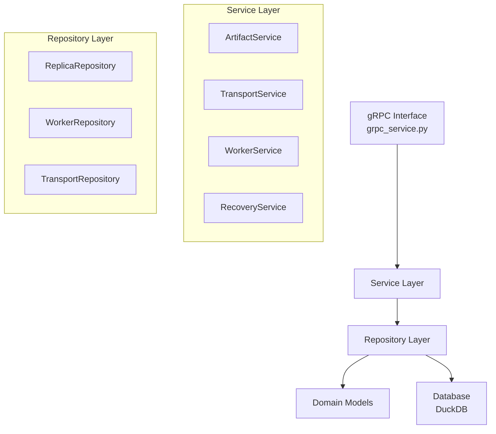

# Global Store Development Guide

This guide provides detailed information for developers working on the Global Store component. For a high-level overview of the system architecture, see the [Architecture Overview](./architecture-overview.md).

## Module Structure

The Global Store follows a clean, layered architecture for maintainability and testability:

```
tensorcast/global_store/
├── __init__.py           # Package initialization
├── __main__.py           # Entry point
├── grpc_service.py       # gRPC service implementation
├── db_utils.py           # Database utilities
├── init.sql              # Database schema
├── models/               # Domain models
│   ├── __init__.py
│   ├── replica.py        # Replica entity
│   ├── worker.py         # Worker entity
│   └── transport.py      # Transport entity
├── repositories/         # Data access layer
│   ├── __init__.py
│   ├── base.py          # Base repository
│   ├── replica_repository.py
│   ├── worker_repository.py
│   ├── transport_repository.py
│   └── chunk_directory_repository.py
├── services/            # Business logic layer
│   ├── __init__.py
│   ├── artifact_service.py
│   ├── transport_service.py
│   ├── worker_service.py
│   ├── chunk_service.py
│   └── recovery_service.py
├── config/              # Configuration
│   ├── __init__.py
│   └── settings.py
└── exceptions/          # Custom exceptions
    ├── __init__.py
    └── base.py
```

## Layered Architecture



### Layer Responsibilities

- **gRPC Interface**: Handles RPC requests and delegates to services
- **Service Layer**: Implements business logic and orchestrates operations
- **Repository Layer**: Manages data persistence with DuckDB
- **Domain Models**: Define data structures and entities

## Protocol Buffer API

The Global Store exposes its functionality through a gRPC interface defined in [`proto/global_store.proto`](../../../../proto/global_store.proto).

### Service Groups

#### Artifact Replica Management
- `RegisterReplica`: Register a new artifact replica
- `UpdateReplica`: Update replica heartbeat
- `UnregisterReplica`: Remove a replica
- `GetArtifactInfoById`: Retrieve artifact replicas by content-addressed ID
- `ListReplicas`: Query replicas with filters

#### Transport Operations
- `RequestReplicaTransport`: Request artifact transfer with load balancing
- `CompleteReplicaTransport`: Mark transport as completed

#### Worker Management
- `RegisterWorker`: Register Store Daemon worker
- `WorkerHeartbeat`: Process health checks
- `UnregisterWorker`: Remove worker
- `ListActiveWorkers`: Query active workers

#### High Availability
- `SynchronizeWorkerState`: Sync worker state
- `RequestFullStateSync`: Request complete sync

#### Chunk Directory
- `QueryChunkLocations`: Query chunk locations across replicas
- `BatchUpdateChunkStates`: Batch update chunk metadata

## Service Layer Details

### ArtifactService
Manages artifact replica registration and lifecycle.

```python
class ArtifactService:
    def register_replica(self, replica_info: ReplicaInfo) -> Replica:
        """Register or update a artifact replica."""

    def update_heartbeat(self, replica_id: UUID) -> None:
        """Update replica's last heartbeat timestamp."""

    def get_model_replicas(self, artifact_id: str) -> List[Replica]:
        """Get all replicas for a artifact, prioritized by availability."""
```

### TransportService
Coordinates artifact transfers with intelligent load balancing.

```python
class TransportService:
    def request_transport(
        self,
        artifact_id: str,
        target_node_id: str
    ) -> Tuple[Replica, UUID]:
        """Request artifact transport with load balancing."""

    def complete_transport(self, transport_id: UUID) -> None:
        """Complete transport and release resources."""
```

Load balancing algorithm priorities:
1. Memory type (GPU > RAM > DISK)
2. Current load ratio
3. Most recent heartbeat

### WorkerService
Manages Store Daemon lifecycle and health.

```python
class WorkerService:
    def register_worker(self, worker_info: WorkerInfo) -> Worker:
        """Register a new Store Daemon worker."""

    def heartbeat(self, worker_id: str, state: WorkerState) -> None:
        """Process worker heartbeat."""

    def cleanup_inactive_workers(self) -> None:
        """Remove workers that missed heartbeat timeout."""
```

### ChunkService
Manages distributed chunk directory queries and updates.

```python
class ChunkService:
    def query_chunk_locations(
        self, artifact_id: str, chunk_indices: Optional[List[int]] = None
    ) -> List[ChunkLocation]:
        """Return candidate locations for requested chunks."""

    def batch_update_chunk_states(
        self,
        worker_id: str,
        node_id: str,
        updates: List[ChunkStateUpdate],
    ) -> int:
        """Apply chunk state updates from a worker."""
```

### RecoveryService
Handles high availability and state synchronization.

```python
class RecoveryService:
    def synchronize_worker_state(
        self,
        worker_id: str,
        local_replicas: List[WorkerLocalReplica]
    ) -> SyncResult:
        """Synchronize worker state with Global Store."""

    def handle_worker_recovery_registration(
        self,
        worker_info: WorkerInfo
    ) -> RecoveryResult:
        """Handle worker recovery after crash."""
```

## Repository Layer

Repositories follow DuckDB best practices for thread safety and performance.

### Base Repository Pattern
```python
class BaseRepository:
    def get_cursor(self) -> duckdb.DuckDBPyConnection:
        """Get thread-local database cursor."""

    def execute_query(self, query: str, params: tuple) -> List[Any]:
        """Execute query with automatic cursor management."""
```

### Transaction Management
- Uses thread-local cursors for safety
- Automatic transaction boundaries
- Proper error handling and rollback

## Database Schema

The complete schema is defined in `init.sql`. Key tables:

- **workers**: Store Daemon registrations
- **replicas**: Artifact instance locations
- **replica_counters**: High-frequency load tracking
- **transports**: In-flight transfers
- **chunk_directory**: Chunk-level metadata and state

## Configuration

Environment variables for Global Store:

```bash
# Server
GLOBAL_STORE_PORT=50051
GLOBAL_STORE_MAX_WORKERS=10

# Database
GLOBAL_STORE_DB_PATH=/path/to/models.db

# Worker Management
GLOBAL_STORE_HEARTBEAT_TIMEOUT_MS=30000
GLOBAL_STORE_CLEANUP_INTERVAL_MS=60000
GLOBAL_STORE_HEARTBEAT_INTERVAL_MS=5000

# Performance
GLOBAL_STORE_TRANSPORT_WAIT_RETRY_INTERVAL_MS=200
GLOBAL_STORE_OPTIMIZE_INTERVAL_MS=3600000
```

## Monitoring & Metrics

Global Store exposes Prometheus metrics on `:8000/metrics`:

### Key Metrics
- `global_store_replicas_total`: Total replica count
- `global_store_replicas_per_artifact`: Per-artifact distribution
- `global_store_transport_requests_total`: Transport success/failure
- `global_store_transport_wait_seconds`: Load balancer latency
- `global_store_state_sync_operations_total`: HA sync operations

### Metric Implementation
```python
from tensorcast.global_store.metrics import (
    REPLICA_GAUGE,
    TRANSPORT_COUNTER,
    record_transport_wait_time
)

# In service methods
REPLICA_GAUGE.labels(artifact_id=artifact_id).inc()
TRANSPORT_COUNTER.labels(status="success").inc()
```

## Web UI Integration

Optional web dashboard for monitoring:

- **Process**: Separate FastAPI application
- **Communication**: Uses gRPC interface only
- **Real-time**: WebSocket updates
- **Configuration**:
  - `GLOBAL_STORE_UI_ENABLED`: Enable UI (default: true)
  - `GLOBAL_STORE_UI_PORT`: UI port (default: 9000)

## Testing

Comprehensive test suite in `tests/python/global_store/`:

### Test Structure
```
tests/python/global_store/
├── conftest.py          # Shared fixtures
├── test_grpc_service.py # gRPC interface tests
├── test_services.py     # Service layer tests
├── test_repositories.py # Repository tests
└── test_integration.py  # Full stack tests
```

### Running Tests
```bash
# All tests
pytest tests/python/global_store/ -v

# With coverage
pytest tests/python/global_store/ --cov=tensorcast.global_store

# Specific test file
pytest tests/python/global_store/test_services.py -v
```

## Development Workflow

### Adding a New Feature

1. **Define Domain Artifact** (if needed)
   ```python
   # models/new_model.py
   @dataclass
   class NewModel:
       field1: str
       field2: int
   ```

2. **Create Repository**
   ```python
   # repositories/new_repository.py
   class NewRepository(BaseRepository):
       def create(self, artifact: NewModel) -> NewModel:
           # Implementation
   ```

3. **Implement Service**
   ```python
   # services/new_service.py
   class NewService:
       def __init__(self, repository: NewRepository):
           self.repository = repository
   ```

4. **Update gRPC Interface**
   ```python
   # grpc_service.py
   def NewRpcMethod(self, request, context):
       return self.new_service.handle_request(request)
   ```

5. **Add Tests**
   ```python
   # tests/python/global_store/test_new_feature.py
   def test_new_feature(new_service):
       # Test implementation
   ```

## Best Practices

1. **Layer Isolation**: Each layer only imports from layers below
2. **Thread Safety**: Always use `get_cursor()` for database access
3. **Error Handling**: Use custom exceptions from `exceptions/base.py`
4. **Metrics**: Add metrics for new operations
5. **Testing**: Write tests for all new functionality
