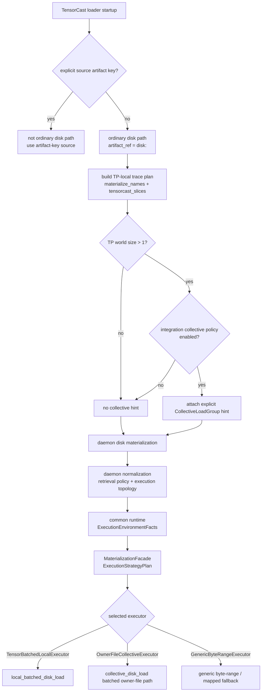
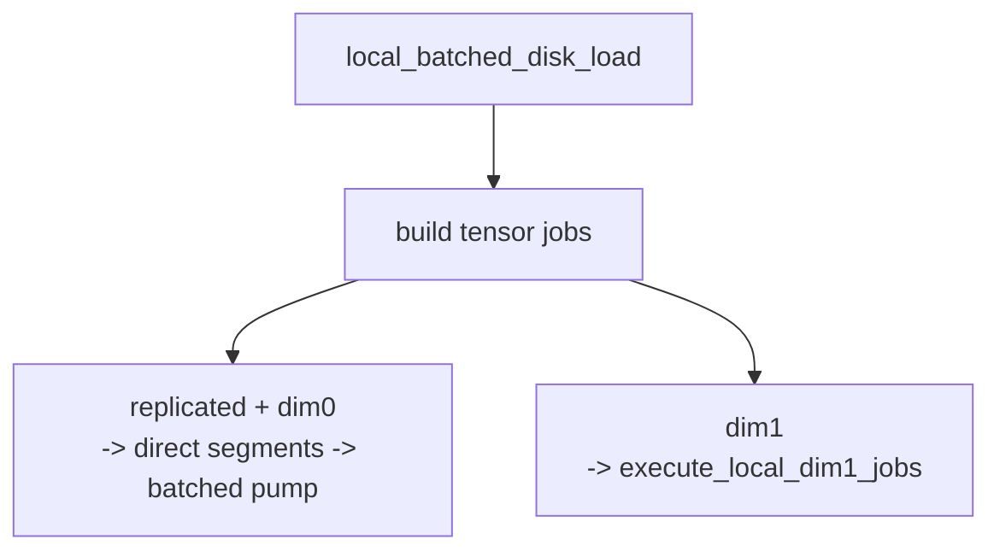
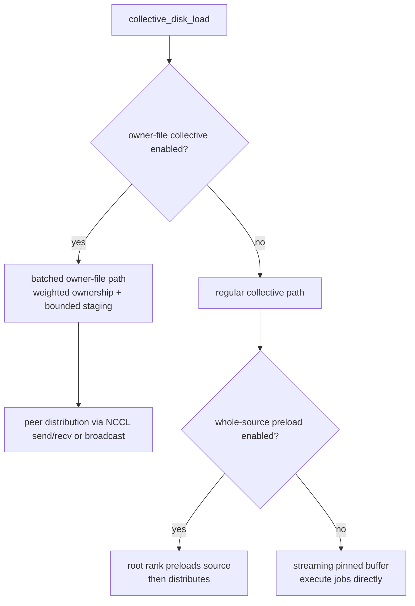
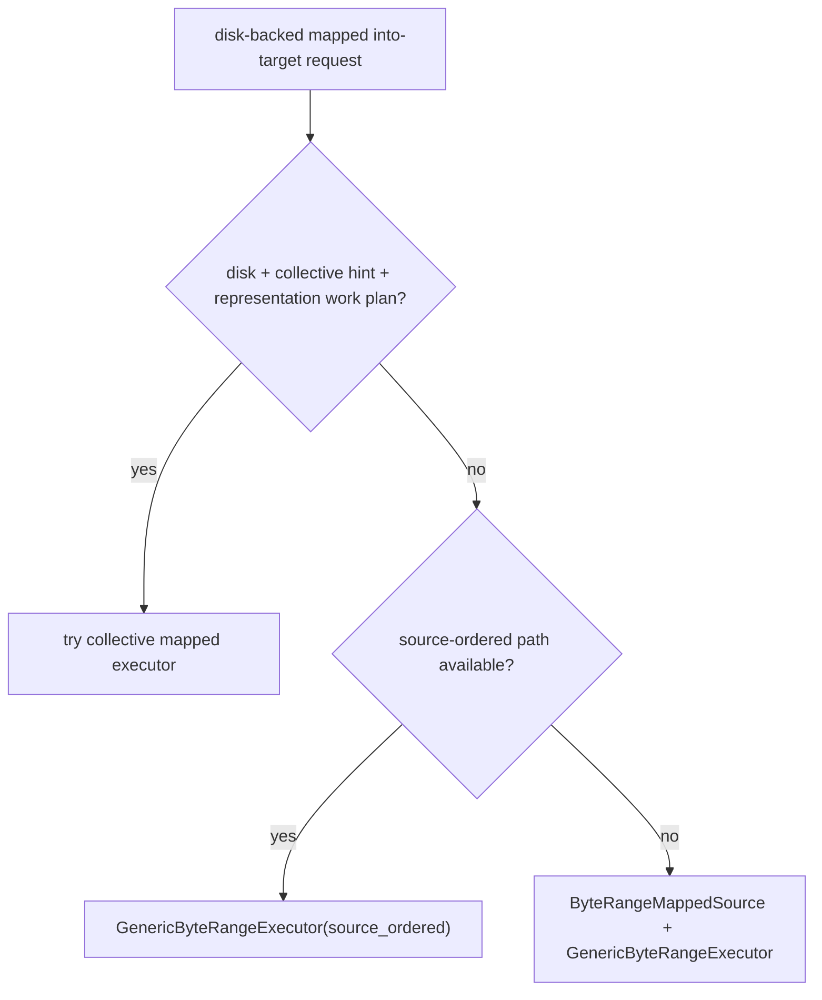

# Disk Load Strategy

This document describes the current `load from disk` strategy for TensorCast-backed
model loading, with emphasis on:

- TP-aware rank-local slicing in the current internal-vLLM TensorCast loader,
- local SSD versus shared filesystem behavior,
- daemon-side executor selection under the converged `0108-01` strategy plane,
- the difference between ordinary `tensor_dict` startup and mapped `into-target` paths.

Related docs:
- `docs/internals/model-loading.md`
- `docs/architecture/api/materialization-flow.md`
- `docs/internals/byte-range-mapping-and-execution.md`
- `docs/designs/0108-tensor-aware-materialization-strategy-plane.md`

## Scope

In scope:

- Ordinary disk-backed startup through `Artifact.tensor_dict(...)`.
- TP-aware request shaping before materialization.
- Explicit separation between retrieval policy and execution-topology context.
- Common-runtime strategy planning for generic, local-batched, and collective executors.
- Disk-backed `MaterializeIntoTarget` / mapped binding strategy.

Out of scope:

- P2P-first loads from remote replicas.
- Serving-artifact startup and reload-by-swap beyond their interaction with disk fallback.
- Canonical index and byte-range compiler details beyond what is needed to explain strategy choice.

## Layered View

The current disk strategy is split into four boundaries:

1. Integration-side request shaping decides what the current rank needs and
   whether to attach explicit same-host collective context.
2. Daemon normalization lowers retrieval policy and execution-topology context
   separately into one internal request object.
3. Common runtime builds one `ExecutionStrategyPlan` from:
   - resolved semantic/view truth,
   - acquired source capabilities,
   - execution-topology and locality facts,
   - typed `engine.materialization_strategy` policy.
4. Replica/runtime execution consumes the selected plan; it is no longer the
   architecture owner of `AUTO`.

This is the important post-`0108-01` ownership split:

- integrations still own TP-local selection shaping,
- daemon normalization owns policy/topology separation,
- `MaterializationFacade` owns ordinary disk executor candidacy and selection,
- `Replica` / `ReplicaLoadController` execute the selected plan and emit commit
  diagnostics.

Important boundaries:

- the generic TensorCast SDK does not infer collective mode from ambient
  environment,
- `collective_load_group`, source locality, and source-sharing hints are
  execution-topology facts, not retrieval policy,
- executor-private work items do not travel through SDK or proto request
  surfaces,
- ordinary disk startup and mapped-target execution now use the same strategy
  family contracts.

## Typed Daemon Defaults

The default `0108-01` strategy entry point is daemon config, not ad-hoc environment
variables:

```yaml
engine:
  materialization_strategy:
    enable_local_batched_disk_load: true
    enable_tensor_aware_mapped_executor: true
    allow_mixed_execution: true
    enable_owner_file_collective: false
    executor_preference: MATERIALIZATION_STRATEGY_EXECUTOR_PREFERENCE_AUTO
    owner_file_collective_peak_bytes_budget: 8GB
    owner_file_collective_batch_bytes: 512MB
    owner_file_collective_dim1_staging_bytes: 256MB
    owner_file_collective_max_inflight_batches: 1
    owner_file_collective_shared_fs_only: true
    owner_file_collective_max_owner_skew_ratio: 1.5
    owner_file_collective_min_dedup_saving_bytes: 64MB
    owner_file_collective_group_assemble_timeout: 2s
    owner_file_collective_allow_mixed_residual: false
    owner_file_collective_planner_cache_entries: 256
```

See `examples/config/store_daemon_config.yaml`.

Operationally, this means:

- local-batched disk load is enabled by default,
- tensor-aware mapped execution remains available for eligible mapped paths,
- owner-file collective now uses a bounded batched executor when selected,
- eager owner-file preload and root whole-source preload remain only as legacy
  collective fallback scaffolding and are explicitly not the preferred route.

## End-To-End Decision Tree For Ordinary Disk Startup

The main startup path is ordinary disk-backed `tensor_dict(...)`, not mapped
runtime binding.



## Step 1: TP-Aware Request Shaping In The internal-vLLM Loader

The current internal-vLLM TensorCast loader does not send a full-model load
request per rank. Instead, each rank first traces its own checkpoint access
pattern and builds a rank-local plan:

- `materialize_names`: the checkpoint tensors this rank needs,
- `tensorcast_slices`: the rank-local slice hull used to build the view.

The disk request is then:

1. `artifact.subset(materialize_names)`
2. `.view(slices=tensorcast_slices)`
3. `.tensor_dict(...)`

This is the first TP-specific optimization. It reduces disk work before the
daemon chooses any executor.

This step is integration-owned, not a generic TensorCast SDK behavior. The
current implementation lives in the internal-vLLM loader, which traces
`model.load_weights(...)`, builds `TracePlan`, derives `tensorcast_slices`, and
caches the result per TP rank and world size.

Important consequences:

- TP handling starts in the loader, not only in the daemon.
- The trace cache is per `tp_rank` and `tp_world_size`, so each rank carries its
  own stable trace-plan cache entry.
- `TP=1` naturally degenerates to a non-collective single-rank request.

## Step 2: Integration-Level Collective Hinting

For ordinary `disk:<model_path>` startup, collective remains an explicit
TensorCast API contract. The generic SDK does not attach a collective hint on
its own.

The current internal-vLLM loader may synthesize that explicit
`CollectiveLoadGroup` on behalf of the caller by constructing
`CallContext.collective`, but this is an integration policy above the API
boundary rather than a TensorCast-core SDK default.

Current rule:

- local filesystems:
  - `xfs`
  - `ext2`
  - `ext3`
  - `ext4`
  - `btrfs`
  - `zfs`
  - `tmpfs`
  - default to `collective = false`
- anything else:
  - currently also defaults to `collective = false`
  - reason: integration-side collective hint rollout remains conservative until
    the shared-FS benchmark and serving matrix is fully recaptured
  - explicit overrides remain available, and once the request carries explicit
    shared-source proof the daemon-side owner-file batched executor is now the
    preferred collective route

This is not a hard-coded `JuiceFS` or `JFS` special case by name. The current
internal-vLLM loader treats them through filesystem type detection:

- host-local SSD paths usually resolve to one of the local filesystem types and
  therefore default to non-collective startup,
- JuiceFS/JFS/shared filesystems usually do not fall into that local whitelist,
  but ordinary disk-backed startup is currently still kept on the
  non-collective path by default as a temporary regression mitigation,
- if mount type detection fails, the code currently also biases toward
  non-collective.

Current internal-vLLM behavior therefore is:

- local filesystems default to no collective hint,
- shared/non-local filesystems also default to no collective hint today,
- explicit integration override remains available for collective experiments.

This choice only affects whether the request carries a collective hint. The
daemon still performs a second-stage eligibility check before it actually uses a
collective executor.

## Why Local SSD And Shared Filesystems Split Here

The split exists because the best-known disk strategy differs by storage class:

- on host-local SSD, direct per-rank reading plus local batching is usually
  better than coordinating a TP collective read,
- on shared filesystems, letting TP ranks cooperate often reduces redundant IO
  and improves effective source-side locality.

This is why the common TensorCast runtime no longer uses ambient environment as
the control surface for collective selection. The current intended behavior is:

- keep the generic SDK contract explicit,
- allow integrations to synthesize explicit per-call hints when they have the
  right TP topology context,
- keep daemon-side executor policy centralized in typed strategy config,
- avoid forcing shared-fs collective from ambient loader heuristics until the
  benchmark and serving rollout gates are fully recaptured.

## Step 3: Common-Runtime Strategy Planning For `tensor_dict`

Once the disk request reaches the daemon, ordinary executor selection is owned
by common runtime rather than replica-layer branch order.

`MaterializationFacade` now builds one `ExecutionStrategyPlan` for ordinary
`GPU <- DISK` startup and evaluates three candidates:

1. `GenericByteRangeExecutor`
2. `TensorBatchedLocalExecutor`
3. `OwnerFileCollectiveExecutor`

The chosen executor is logged together with selection reason, rejected
candidates, residual bytes, and commit accounting. `Replica` and
`ReplicaLoadController` consume that selected plan; they do not own `AUTO`.

### Collective Eligibility

`OwnerFileCollectiveExecutor` is only considered when all of the following hold:

- target is `GPU <- DISK`,
- the request carries a `collective_load_group`,
- execution-topology locality policy does not reject collective for host-local
  media,
- `canonical_index_json` is available,
- `source_index_json` is available,
- `variant_identity` is available,
- the requested view does not require extra server-side materialization
  transform,
 - the source is backed by a `DiskLoader` with usable shared context,
 - typed budget and threshold checks pass.

If any of these fail, the daemon logs why collective was skipped and continues
to the next candidate.

### Local-Batched Eligibility

`TensorBatchedLocalExecutor` is considered when:

- target is GPU,
- `canonical_index_json` is available,
- `source_index_json` is available,
- `variant_identity` is available,
- `DiskLoader` shared context is available,
- `enable_local_batched_disk_load = true`,
- no residual/fill-only/server-transform constraint forces generic fallback.

If the planner rejects it, the request falls through to generic execution with
an explicit selection reason.

### Generic Fallback

`GenericByteRangeExecutor` remains the correctness backstop:

- canonical index and source index are composed when available,
- view selection is composed if needed,
- the request is lowered through `ByteRangeMappedSource`,
- transfer runs through the generic pump path.

It is still the dominant fallback IR and explainability surface, but it is no
longer the architecture owner of ordinary disk `AUTO`.

## Internal Shape Of `local_batched_disk_load`

`local_batched_disk_load` is still tensor-aware, but it is single-rank and
local. It splits disk jobs into:

- `replicated` jobs,
- `dim0 partitioned` jobs,
- `dim1 partitioned` jobs.



Operationally:

- replicated and dim0-partitioned regions are lowered into direct source
  segments and pumped efficiently,
- dim1-partitioned tensors use a dedicated execution path,
- the daemon emits `local_batched_disk_load timings` with job counts and
  timing breakdowns for verification.

## Internal Shape Of `collective_disk_load`

`collective_disk_load` is the executor runtime used by the current same-host
collective path. When owner-file collective is selected, the ranks form a
same-host clique, build weighted owner batches, and execute tensor jobs
cooperatively.



Current defaults and caveats:

- `enable_owner_file_collective` exists,
- the default daemon config keeps it `false`,
- owner-file batch planning is now the steady-state owner collective path,
- eager `owned_payload` preload and root whole-source preload are explicitly
  legacy fallback scaffolding,
- group-assemble timeout is now typed config,
- the current owner-file rollout remains zero-residual-only; requests with
  residual fallback bytes stay on local-batched or generic execution.

As with local-batched, collective execution is still tensor-aware:

- replicated tensors,
- dim0-partitioned tensors,
- dim1-partitioned tensors

are handled separately with different execution routines.

## Filesystem-Specific Summary

### Host-Local SSD

Expected behavior:

- no collective hint from the loader,
- TP ranks still perform rank-local `subset + slice` shaping,
- daemon usually lands on `local_batched_disk_load`,
- generic fallback is only the residual safety path.

This is the current best-known default path for ordinary host-local startup.

### JuiceFS / JFS / Shared Filesystems

Expected behavior:

- current internal-vLLM loader still defaults to no collective hint,
- daemon therefore usually stays on the non-collective local-batched or generic
  path,
- explicit collective experiments can still attach a group and exercise
  `collective_disk_load` when eligibility is satisfied.

The important point is that these filesystems are currently handled by storage
class inference, not by a product-specific special case table, but current
default policy still biases to non-collective startup.

## Mapped `into-target` / `bind_into` Disk Path

Mapped disk execution follows a related but different strategy tree. This is
used by `MaterializeIntoTarget`, `bind(...)`, and `bind_into(...)` flows.



The key differences from ordinary `tensor_dict` startup are:

- the request already arrives as a mapped target layout,
- the runtime considers source-ordered execution using source layout metadata,
- collective mapped execution is only possible when a derived representation
  work plan and
  collective group are both present,
- owner-file or collective mapped execution is only eligible when the emitted
  work plan already has zero residual generic fallback,
- runtime execution must not partially execute mapped work and then implicitly
  derive new residual fallback at execution time,
- otherwise the residual executor is still the generic byte-range engine.

## Runtime Binding And Ordinary Disk Startup

Ordinary disk startup should not be confused with serving-artifact runtime
binding.

Current rule:

- `tensorcast_enable_runtime_binding=true` does not by itself turn ordinary
  `disk:<model_path>` startup into the preferred mapped startup path,
- startup source binding is only attempted when an explicit
  `tensorcast_source_artifact_key` is provided,
- otherwise ordinary disk startup stays on the `tensor_dict` strategy described
  above.

This guard exists because disk-backed mapped source binding is not currently the
best-known startup path for plain local checkpoint directories.

## Practical Verification Checklist

When validating which disk path actually executed, use the following signals.

For host-local SSD:

- loader should not attach a collective hint,
- daemon should emit `local_batched_disk_load timings`,
- materialization diagnostics should not show `source=local_replica` unless the
  request was intentionally satisfied from an already-local source.

For shared filesystem startup:

- do not expect a collective group by default today,
- if you explicitly enable collective experiments, then the loader should attach
  a collective group,
- in that explicit-collective case, the daemon should log collective
  eligibility and successful runs should emit `collective_disk_load timings`.

For mapped `into-target` requests:

- inspect `materialize_mapped_into_target execution_commit`,
- check:
  - `collective_handled`,
  - `direct_write_supported`,
  - `source_ordered`,
  - `dominant_executor`.

## Current Intended Defaults

The intended operator-facing behavior today is:

- ordinary host-local disk startup:
  - use `tensor_dict` path,
  - rely on rank-local trace slicing,
  - let the daemon select local-batched disk load,
- shared filesystem startup:
  - still default to non-collective startup today,
  - reserve collective for explicit experiments until owner-file collective is
    production-ready,
  - let the daemon decide whether collective eligibility is satisfied once a
    collective hint is actually present,
- mapped runtime binding:
  - reserve for explicit serving/source-artifact workflows, not plain disk
    startup.

This gives TensorCast a single consistent strategy stack:

1. TP-aware request shaping in the loader,
2. integration-owned explicit collective hint synthesis,
3. typed daemon strategy selection,
4. byte-range fallback only for residual coverage.
