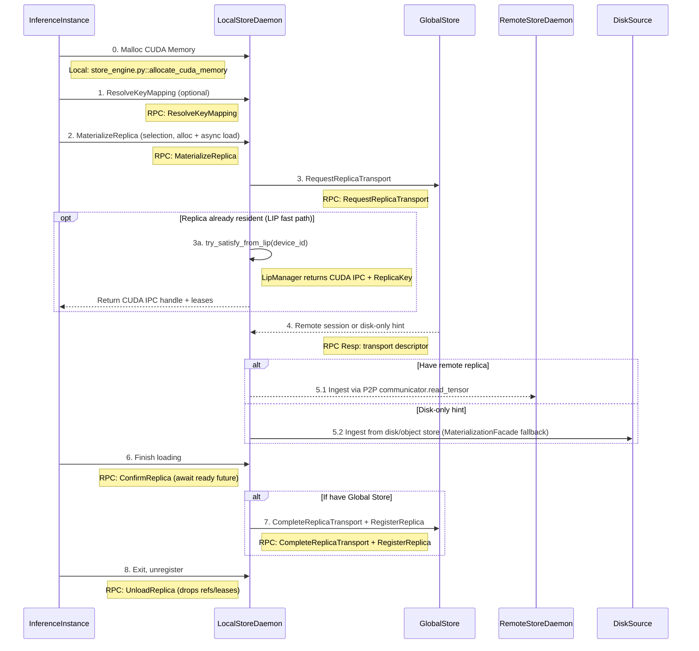

# Artifact Loading Workflow

This diagram shows the complete artifact loading workflow in TensorCast, including the interaction between different components.

Related docs:
- `docs/architecture/artifact-views-and-retrieval.md`
- `docs/architecture/api/materialization-flow.md`
- `docs/internals/byte-range-mapping-and-execution.md`

## System Components

- **InferenceInstance**: Python + CXX EXT
- Entrypoint: `tensorcast.artifact(...).tensor_dict` / `.tensor_dict_into` (facade over the process Store)
  - CLI class: `client.py::DaemonCtl`
  - CXX: `checkpoint_py.cc`

- **LocalStoreDaemon**: C++ gRPC service (see `../architecture/api/api-design.md`)
  - Binary: `daemon/tensorcast_daemon`
  - Service: `store_daemon.StoreDaemonService` (ResolveKeyMapping/MaterializeReplica/ConfirmReplica/UnloadReplica/MaterializeIntoTarget)

- **SessionLifecycle & LIP Runtime**: `SessionLifecycleManager`, `RefTracker`, and `LipManager` (under `daemon/state/session_lifecycle.*` and `daemon/state/lip_manager.*`) track per-PID references, mint `UseLease`s for GPU replicas, and satisfy selection-first `MaterializeReplica` requests from already-resident CUDA IPC handles when a matching Lease-In-Place replica exists.

- **GlobalStore**: Python
  - Entrypoint: `tensorcast/global_store/grpc_service.py::GlobalStoreServicer`

- **RemoteStoreDaemon**: Same as LocalStoreDaemon

## Runtime Initialization

All client processes call `tensorcast.init(mode=...)` to establish the daemon session. Initialization pins
the daemon endpoint and constructs the shared Store used by the module-level helpers. The Store owns
retry policy, lease keepalive, and fallback orchestration for the process. Advanced integrations can
access it via `tensorcast.store()`, but day-to-day usage goes through the functional helpers.

## Artifact Loading Sequence

## Region-backed tensor_dict_into

Region-backed into calls bypass daemon-owned replicas by streaming bytes into a
client-registered CUDA region using `MaterializeIntoTarget`. The SDK computes a
coalesced `TargetLayout` over canonical or view-indexed ByteSpaces (including
packed subsets), validates against the selected index, and invokes the v2 RPC
directly. The daemon maps the IPC handles (single or ordered multi-storage),
streams bytes from P2P or disk, and releases the region reference on completion
without allocating VRAM.

See [tensor_dict_into dataflow](tensor_dict_into_dataflow.md) for the detailed
sequence and constraints.

## Deferred Slice Materialization

Deferred loaders expose vLLM-friendly placeholder binding while still using the
region-backed data plane:

- `Artifact.deferred_loader(...)` allocates a client-owned CUDA arena, registers
  the arena as a VRAM region, and returns CUDA tensors immediately.
- `DeferredLoader.tensor(...)` returns placeholder views into the arena; no I/O
  occurs until `commit()`.
- `commit()` issues a single `MaterializeIntoTarget` RPC and returns an
  `InplaceSlot` that keeps tensor storage pointers stable across swaps.
- `packing="byte_space"` places tensors at their logical offsets in the selected
  canonical/view ByteSpace. Full coverage uses empty `tensor_names` +
  `view_subset_hash=b""` and is publishable; subset/packed layouts remain
  local-only.
- `packing="append"` / `packing="plan"` build local packed layouts (ordered
  call/plan order) and are not publishable in Phase 1. Use
  `slot.publish_replica()` or `slot.swap(..., publish=True)` to publish a
  routable memory replica once the slot is filled.

### Lease-In-Place Fast Path & Use Leases

`MaterializeReplica` consumes `ArtifactSelection` and uses `selection.artifact_id` as the request identity. Key workflows resolve key mapping first through `ResolveKeyMapping`, then issue `MaterializeReplica`. Before coordinating transport, the controller asks `LipManager::try_satisfy_from_lip` for a replica that already lives on the requested GPU. When this fast path hits, the daemon reuses the existing CUDA IPC handle, marks the status as `ALLOCATED`, and returns immediately (plus optional daemon-selected `used_disk_path`) without invoking the bulk materialization pipeline. If the fast path misses, the controller immediately falls through to the engine-backed path described below.

Both the fast path and the engine path increment the caller’s PID in `RefTracker`, create a `UseLease` inside `SessionLifecycleManager`, and stash the resulting `ReplicaSession` under the supplied `replica_uuid`. That keeps eviction and TTL orchestration honest—`ConfirmReplica` waits on the stored future before admitting success, and `UnloadReplica` (or PID death) releases the lease so ReplicaRuntime knows when it is safe to evict the GPU allocation.

### Runtime Events and Publish Context IDs

- The daemon-side Store constructs a `publish_context_id` for every ingestion request via `RuntimeContext::mint_publish_context_id()` before the pipeline starts. `MaterializationFacade` publishes typed `IngestionStartedEvent`/`IngestionCompletedEvent` payloads through `IngestionEventHub` so subscribers receive identical metadata (ingestion source, target device, `request_id`, publish context, and any resolved view hints).
- MetadataGateway subscribes to `ingestion_completed` events and reuses the `publish_context_id` to dedupe synchronous publish requests against auto-publish flows—whichever arrives first performs the Global Store RPC, and the later call becomes a no-op/TTL refresh.
- ReplicaRuntime also listens for the same events to keep UMA telemetry in sync and to attribute pipeline metrics (bytes, duration, success/failure) to the correct request id.

## Key Steps Explained

1. **Request Construction & Materialization**: The SDK builds one `ArtifactSelection` (`selection.artifact_id`, optional `selection.view_spec` / `selection.view_id`, optional subset fields) and issues `MaterializeReplica` with device selectors, optional `pinned_allocation_timeout_ms`, caller `pid`, and `replica_uuid` for `ConfirmReplica`/`UnloadReplica`.
2. **Key Resolution & Daemon-Owned Disk Source Selection**: Key-based callers first resolve the human key via Global Store (`ResolveKeyMapping`) to obtain `artifact_id`, then materialize by selection. If disk fallback is allowed, the daemon resolves managed/shared-disk or local-import bindings internally and, when available, populates `used_disk_path`. Clients do not provide retrieval disk paths.
3. **Lease-In-Place Reuse**: `LipManager::try_satisfy_from_lip` checks whether the target GPU already holds the replica. On a hit, the daemon reuses the resident CUDA IPC handle, marks the status as `ALLOCATED`, and immediately responds with the original `artifact_id` and any `used_disk_path` while still tracking the caller’s PID/lease.
4. **Replica Selection & Transfer**: LIP misses call into `StoreEngine::materialize_replica`, which routes through `MaterializationFacade` and `MaterializeOrchestrator` to request a remote replica (`RequestReplicaTransport`). Successful transports stream bytes over the communicator; failures fall back to `ingest_from_disk` using the resolved disk path when available.
5. **Lease Binding & Reference Tracking**: Every granted replica increments `RefTracker` for the caller PID and acquires a GPU `UseLease` from `SessionLifecycleManager`. These handles block eviction until the PID drops its reference or TTL expires, keeping telemetry and scheduler state consistent.
6. **GPU Transfer & Confirmation**: `MaterializeReplica` returns as soon as memory is allocated (resident or freshly loaded). The client must call `ConfirmReplica` with the `replica_uuid`; the daemon waits (up to the gRPC deadline, capped at 30s) for the ingestion future before confirming success, surfacing any loader failures back to the caller.
7. **Registration & Publish**: Once ingestion completes, `MaterializationFacade` marks the Global Store transport session finished, registers or refreshes the replica metadata, and publishes `ingestion_completed` events with the original `publish_context_id` so ReplicaRuntime and MetadataGateway stay in lock-step.
8. **Cleanup**: When inference exits or releases the tensors, it calls `UnloadReplica`. The daemon drops the PID reference, releases the associated `UseLease`, and only tears down the GPU allocation once no active references remain, ensuring shared replicas survive across overlapping consumers. If the replica never reached allocation, `UnloadReplica` is a no-op and returns success.

## In-Memory Registration (Store API)

- Unified API: BeginRegisterArtifact → FeedRegisterArtifactStream → CommitRegisteredArtifact.
- Realization Plans:
  - Coalesced VRAM: daemon allocates a single VRAM segment and exposes CUDA IPC to the SDK which writes tensor bytes directly.
  - VRAM Lease (FDML): client exports CUDA IPC handles for unique storage blocks and feeds LeaseSegments; daemon computes hash by compiling the canonical ByteRangeMap (PAD=0) and streaming leased memory through the unified byte-range program.

### LeaseSegments ↔ ByteRangeMap

- Robust protocol: each `LeasedSegment` includes `artifact_offset` (logical byte offset in the canonical artifact layout) plus a `storage_id` reference. This removes any ordering assumption when sending lease segments.
- Daemon behavior:
  - Builds the canonical `ByteRangeMap` from canonical index bytes and compiles it into a `ByteRangeProgram`.
  - Treats all `PAD` intervals as zero-filled for hashing and for any materialization copies.
  - Reads `DATA` intervals from the referenced storage windows (`StorageEntry` + `mapping_base_offset` + `storage_offset`) regardless of feed order.
- Client behavior:
  - SDK computes a coalesced logical layout and sets `artifact_offset` per unique storage block.
  - Ordering no longer matters, but the SDK still sorts for stable traces.

### Shared Storage Graph Helper

- SDK registration flows call `tensorcast.api._tensor_graph.build_tensor_storage_graph()` before feeding lease segments.
- The helper deduplicates `torch.Storage` objects and emits a `TensorStorageGraph` containing `StorageEntry` rows (unique storage id, device id, base pointer, storage length) plus `TensorAlias` metadata (tensor name, storage id, storage offset, logical byte length, shape, stride, dtype).
- Clients transmit the deduplicated storage table via `storage_entries` and alias metadata via `tensor_aliases`. The daemon reconstructs canonical index JSON from these structures, producing byte-for-byte parity with disk persistence and opening each CUDA IPC handle only once per unique storage.
- On materialization, the SDK maps the returned CUDA IPC handle once and constructs all `torch.Tensor` views from that mapping in one pass so the mapping is reference-counted across tensors and closed exactly once.

Recommended: rely on `tensorcast.register(...)` (or `register_async`) with
`RegisterArtifactOptions(lease_in_place=True)` and an explicit `ttl_ms`. The Store
manages keepalives automatically and surfaces the committed descriptor through the
returned `RegisteredArtifact`. Same-machine consumers materialize into daemon-owned
coalesced VRAM (CUDA IPC) for zero-copy use.

### Client Facade & Store helpers

- `tensorcast.register(...)` (lease-in-place) and `tensorcast.put(...)` (daemon-owned coalesced VRAM)
  return a `RegisteredArtifact` describing the canonical index, replica metadata, and lease handle
  when applicable. Both functions call into the shared Store and offer async variants via
  `tensorcast.store().register_async(...)`.
- Retrieval is handle-first: `tensorcast.artifact(...).tensor_dict(...)` streams tensors to the requested
  device (sync) and `tensor_dict_async(...)` mirrors it asynchronously. In-place copies use
  `artifact.tensor_dict_into(...)` or the convenience `artifact.tensor_into(name, target, ...)`.
  The Store validates shapes/strides/device before mutating buffers, zero-fills PAD segments to keep
  tensors consistent on failure, and unloads daemon-backed replicas immediately after copy/validation.
- `StoreOptions` and per-call `FallbackOptions` express disk/P2P strategies without sprinkling
  policy flags across call sites.
- Low-level lease feeding and commit orchestration are handled internally by the Store,
  so most integrations rely entirely on the functional facade and its cancellation hooks.

### Python SDK Updates

- Plan selection uses a typed enum `PlanType` instead of raw strings to avoid typos:
  - `PlanType.VRAM_COALESCED` (aliases: `"coalesced"`)
  - `PlanType.VRAM_LEASED` (aliases: `"lease"`)
- `RegisterArtifactOptions` is now a frozen dataclass with slots for immutability.
- Loading helpers with fixed return types now hang off `Artifact`:
  - Synchronous: `tensorcast.artifact(...).tensor_dict(...) -> dict[str, torch.Tensor]`
  - Asynchronous: `tensorcast.artifact(...).tensor_dict_async(...) -> ArtifactFuture[dict[str, torch.Tensor]]`
- `ArtifactFuture.done() / result(timeout) / cancel()` mirror the standard `concurrent.futures`
  contract. Cancellation propagates to daemon RPCs (`AbortRegisteredArtifact`, `RevokeRegisteredArtifact`)
  and records telemetry for observability.
- Unified error model under `TensorCastError` with readable subclasses like `DaemonUnavailable`, `DeviceMismatch`, and `IndexParseError`.
- Key-resolution loads raise a clear runtime error when a key is absent, including the daemon address and guidance for registering artifacts.
- Key→artifact-id lookups are cached inside the Store for 30 seconds by default (override with `TENSORCAST_STORE_KEY_CACHE_TTL_SECONDS`); disk fallback relies on daemon-resolved managed disk locations rather than client-side disk hints.

### Registration Semantics

- Commit returns RFC-0007 content-addressed descriptor (`artifact_id = mi2:index_multihash:data_multihash`).
- Python: `RegisteredArtifact.commit()` returns `CommitResult` with fields:
  - `descriptor` (ArtifactDescriptor)
  - `existed` (bool) — true when the commit hit an existing replica and joined a reference
- Idempotent success on duplicates: if the same `mi2:` artifact already has a replica on the same device, the daemon reclaims the new allocation and returns `OK` with the existing descriptor plus `existed=true`.

## Variant-Aware Views (v1)

- `core/store/materialization/dataplane/view/view_planner.{h,cc}` materializes a `ViewPlan` from canonical index JSON plus a `ViewSpec`. v1 supports single-dimension `narrow` (slice) operations and emits both the variant layout (`view_index_json`) and a `SelectionPlan` describing canonical byte ranges.
- `core/store/materialization/dataplane/view/view_plan_source.{h,cc}` wraps any `SeekableSource` and executes the `SelectionPlan`, streaming minimal bytes (zero-filling PAD regions) to downstream consumers.
- `StoreEngine` now exposes static helpers:
  - `compute_view_plan(...)` → Loader-backed planning entry point surfaced to the daemon.
  - `view_plan_allows_alias(plan)` → Returns `true` when the selection is contiguous and segment-aligned so the engine can hand out zero-copy aliases.
  - `compute_view_data_hash_from_source(source, plan, leaf_bytes)` → Delegates to `ViewHashComputer`, which reuses the TreeHash pipeline to verify variant byte spaces across disk, GPU, and replica-resident sources.

These APIs keep view normalization, selection, and hashing anchored in the C++ core so the Python daemon and SDK share a single implementation.
- Join/Lease semantics for duplicates: when `existed=true`, the daemon also joins a lightweight reference for the caller’s PID. If a TTL was provided at `BeginRegisterArtifact`, `KeepAliveRegisterArtifact` can extend the TTL, and the unified `SessionLifecycleTask` drops the joined reference when the TTL expires. This mirrors the lifecycle of a self-created replica.

### Client Reuse & Resiliency

- The Python SDK establishes a single gRPC client per process during `tensorcast.init(mode=...)`; all
  subsequent API calls reuse the same Store session obtained via `tensorcast.store()`. This ensures
  every helper targets the same daemon endpoint and prevents accidental cross-daemon usage.
- The underlying client enables gRPC keepalive and performs a light retry with channel refresh on transient errors (`UNAVAILABLE`, `INTERNAL`, `UNKNOWN`, `DEADLINE_EXCEEDED`).
- In registration flows, `RegisteredArtifact` holds a cached client for its lifetime (keepalive thread, commit/abort/revoke, and feed helpers reuse the same channel).
